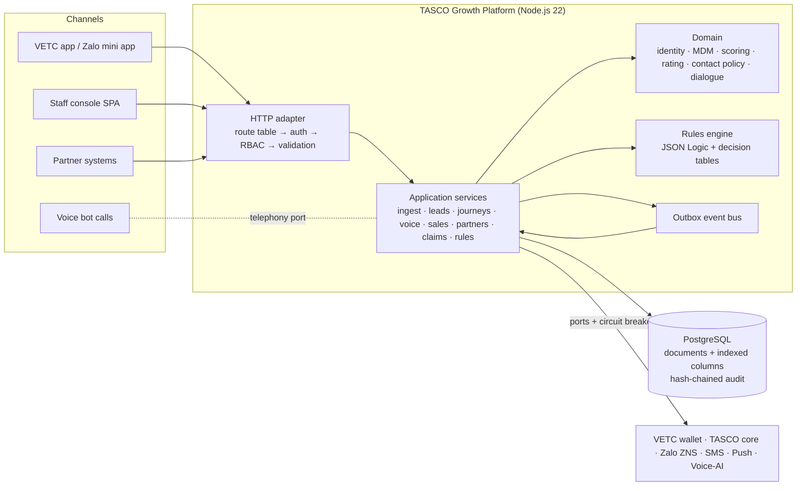

# Architecture documentation — TASCO Growth Platform

TASCO Insurance × VETC motor insurance growth platform (new business, renewals, partners, claims FNOL), built by iorta TechNXT.
Runtime: Node.js 22, PostgreSQL 16 (or in-memory for dev/demo), one runtime dependency (`pg`).

Everything here is written from the source code. Each document cites the files it describes, so a reviewer can check every claim. Where the platform currently uses a **sandbox** adapter rather than a production integration, the document says so. Regulatory statements are flagged **"confirm with TASCO legal"**.

## Documents

| # | Document | Audience | What it answers |
|---|---|---|---|
| 1 | [Solution architecture](solution-architecture.md) | CTO, architects, delivery leads | Principles, C4 views, hexagonal layering, key flows, event catalogue, configurability model, scaling to 6M vehicles, roadmap |
| 2 | [Architecture decision records](adr/) | Architects, tech leads, auditors | The 12 decisions that shape the platform, with alternatives and consequences |
| 3 | [Integration architecture](integration-architecture.md) | Integration teams (VETC, TASCO core, Zalo, telco, voice-AI vendor, partners) | Every port: contract, protocol, auth, idempotency, resilience, SLA, sandbox vs production |
| 4 | [Deployment & infrastructure](deployment-and-infrastructure-architecture.md) | Platform/SRE, InfoSec, finance | Environments, Kubernetes topology, network zones, Postgres HA, secrets, CI/CD, capacity and cost, observability |
| 5 | [Data architecture](data-architecture.md) | Data office, DPO, data stewards, BI | ERD, data dictionary, MDM/golden record, data quality, lineage, retention, migration, analytics feed |
| 6 | [Security architecture](security-architecture.md) | CISO, InfoSec, pen-testers, auditors | STRIDE threat model, OWASP Top 10 and ASVS L2 mapping, RBAC/ABAC, crypto and keys, known gaps |
| 7 | [AI governance](ai-governance.md) | Compliance, model risk, CX, product | Voice bot principles, script lifecycle, lead-score model risk, LLM policy, monitoring, RACI |

### ADR index

| ADR | Decision | Status |
|---|---|---|
| [ADR-001](adr/ADR-001-hexagonal-architecture.md) | Hexagonal / Clean architecture | Accepted |
| [ADR-002](adr/ADR-002-nodejs-minimal-dependencies.md) | Node.js 22, minimal dependencies (`pg` only at runtime), JavaScript + JSDoc | Accepted |
| [ADR-003](adr/ADR-003-rules-engine-maker-checker.md) | JSON Logic rules engine with maker-checker governance | Accepted |
| [ADR-004](adr/ADR-004-persistence.md) | PostgreSQL document + indexed-columns pattern; in-memory adapter with the same behaviour | Accepted |
| [ADR-005](adr/ADR-005-transactional-outbox.md) | Outbox table + `SKIP LOCKED` relay now, message broker later | Accepted (gap noted) |
| [ADR-006](adr/ADR-006-field-encryption-blind-index.md) | Field-level AES-256-GCM encryption + HMAC blind index | Accepted |
| [ADR-007](adr/ADR-007-authentication-identity.md) | Local JWT + TOTP now; OIDC federation to TASCO IdP as target | Accepted (interim) |
| [ADR-008](adr/ADR-008-hash-chained-audit.md) | Hash-chained, append-only audit log | Accepted |
| [ADR-009](adr/ADR-009-voice-bot-dialogue.md) | Deterministic voice bot dialogue with a governed script; LLM only as an optional classifier behind a port | Accepted |
| [ADR-010](adr/ADR-010-api-first-openapi.md) | API-first route table that generates OpenAPI | Accepted |
| [ADR-011](adr/ADR-011-vanilla-spa-design-tokens.md) | Vanilla JS SPA + design tokens (no framework, strict CSP) | Accepted |
| [ADR-012](adr/ADR-012-deployment-containers-k8s.md) | Containers; Kubernetes as primary target; Railway for pilots | Accepted |

## System at a glance

## Source map

| Layer | Path | Contents |
|---|---|---|
| Shared kernel | `src/shared/` | config (12-factor, `*_FILE` secrets), logger (PII redaction), crypto, validation, resilience, metrics, errors, clock |
| Rules engine | `src/rules/` | `jsonLogic.js` (safe subset), `decisionTable.js`, `validators.js` (per-kind validation, copy guard, statutory commission caps) |
| Domain | `src/domain/` | `identity.js`, `enrichment.js`, `leads.js`, `rating.js`, `contactPolicy.js`, `voicebot.js` |
| Application | `src/application/` | One service per use-case area, plus `accessPolicy.js` (RBAC + ABAC + masking) and `rulesService.js` (versioning, maker-checker) |
| Composition root | `src/bootstrap/container.js` | Chooses adapters, wires services, registers event subscribers |
| Persistence adapters | `src/adapters/persistence/` | `schema.js` (collection registry), `codec.js`, `memoryStore.js`, `postgresStore.js`, `auditChain.js`, `query.js` |
| Messaging adapter | `src/adapters/messaging/outboxEventBus.js` | Outbox publish / relay / drain |
| Integration adapters | `src/adapters/integrations/` | Sandbox VETC wallet, TASCO core, notifications, simulated caller, synthetic VETC source |
| HTTP adapter | `src/adapters/http/` | `app.js` (pipeline), `routes.js` (73 routes), `router.js`, `openapi.js`, `security.js` |
| Processes | `src/server.js`, `src/jobs/cli.js` | API server with outbox relay and graceful shutdown; batch jobs |
| Configuration | `config/rules/*.json` (20 rule kinds), `config/security/rbac.json` | Business rules seeded as version 1; RBAC |
| Schema | `db/migrations/001_init.sql` | 19 collection tables + `audit_log` |
| Deployment | `Dockerfile`, `docker-compose.yml`, `deploy/k8s/`, `railway.json`, `.github/workflows/ci.yml` | See the deployment document |

## Conventions used in these documents

- **Implemented**: present in the code at the cited path.
- **Sandbox**: the port and the calling code are real; the adapter behind the port simulates the external system (`src/adapters/integrations/*`).
- **Planned / target**: a design commitment that is not in the code yet. Each one names an owner phase in the roadmap.
- **Infra**: a control delivered by the platform (Kubernetes, WAF, managed Postgres, CI) rather than by application code.
