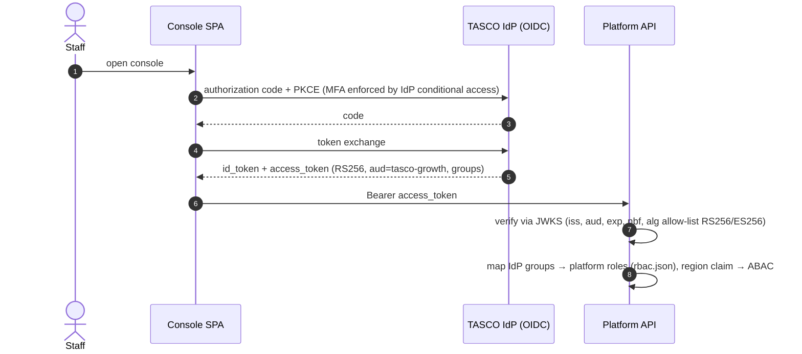

# ADR-007: Authentication — local JWT + TOTP now; OIDC federation to the TASCO IdP as target

- **Status:** Accepted (interim for pilot and UAT; target state defined)
- **Date:** 2026-10-07
- **Related:** [Security architecture §7–8](../security-architecture.md#7-identity-authentication-mfa-and-session-management)

## Context and problem statement

Four kinds of principal call the platform:

1. **Staff** (13 roles) from TASCO and VETC, using the console;
2. **Customers** inside the VETC app or Zalo mini app;
3. **Partner systems**, server to server;
4. **Batch jobs**.

The TASCO enterprise IdP (Azure AD / Keycloak) and VETC app SSO cannot be integrated in the pilot timeframe. MFA is still required for privileged roles, and joiner-mover-leaver must be controlled.

## Decision drivers

- MFA for privileged roles from day one.
- The principal contract `{id, roles, region, customerId?}` must not change when the IdP arrives.
- Short-lived tokens; lockout against brute force.
- Partners get revocable machine credentials.

## Considered options

1. **Local users (scrypt) + TOTP + short-lived HS256 JWT now. Target: OIDC with the TASCO IdP for staff, token exchange with VETC SSO for customers, and API keys moving to OAuth2 client credentials or mTLS for partners.**
2. Integrate the IdP before the pilot.
3. Server-side sessions with cookies.

## Decision outcome

Chosen option: **1**.

**Current implementation**

| Principal | Mechanism | Code |
|---|---|---|
| Staff | Username + password (scrypt N=16384, r=8, p=1, 16 B salt, 64 B hash) → if the role is in `MFA_REQUIRED_ROLES` (default admin, rule_approver, compliance_officer, data_steward) or the user is enrolled → `mfaToken` (JWT `aud=mfa`, 5 min) → TOTP (RFC 6238, SHA-1, 6 digits, ±1 step) → access JWT (`aud=staff`, `amr`, `jti`, TTL `JWT_TTL_SECONDS` = 1,800 s) | `identityService.js`, `crypto.js` |
| Lockout | 5 failures (`LOCKOUT_MAX_FAILURES`) → locked for 15 min (`LOCKOUT_MINUTES`). Failures are audited. Unknown users get a timing-equalised response. | `identityService.login` |
| Per-request | `verifyJwt` pins `alg=HS256`, uses a constant-time signature comparison and checks `exp`. The user is reloaded on every request, so a disabled account or changed roles take effect immediately. The `jti` revocation list is checked on logout. | `identityService.authenticate` |
| Customer | A signed renewal link (`profileId.HMAC16`) or, in demo, a profile id → customer JWT `aud=customer`, 1 h. Target: VETC SSO token exchange. | `routes.js /api/customer/session`, `customerService.issueCustomerToken` |
| Partner | `X-Api-Key: tpk_<24 random bytes>`. Only the SHA-256 is stored, with a prefix for support. Revocable. The partner must be `active`. | `partnerService` |
| Password policy | 12–128 characters (ASVS V2.1, length over complexity) | `checkPasswordPolicy` |

**Target state (phase 2)**

- Customers: the VETC app exchanges its SSO token for a platform customer token (RFC 8693 token exchange or a signed assertion). Customer-authorised wallet debits use VETC's in-app confirmation.
- Partners: OAuth2 client credentials with scopes (`quote`, `purchase`, `policies:read`) or mTLS at the gateway. API keys are retained only for small partners.

### Consequences

- Good: privileged roles are MFA-protected today, and the principal contract is stable across the migration.
- Good: there is no session state on the server. Tokens are short-lived.
- Bad / gaps:
  - HS256 uses one shared secret (`JWT_SECRET`) for staff, customer and MFA tokens; they are separated only by `aud`. Any holder of the secret can mint any token. The target is asymmetric RS256/ES256 from the IdP.
  - **The revocation list is in-process, per replica.** Logout is only guaranteed on the replica that handled it, until the token expires (≤ 30 min). The target is a shared denylist (Redis) or short TTLs plus IdP session revocation.
  - **`verifyMfa` does not check `lockedUntil`.** The failure counter increments, but a locked account can keep submitting TOTP codes while its `mfaToken` is valid (5 min). Only the per-IP login rate limit applies, and it is spoofable via `X-Forwarded-For` (see the security gaps). **Fix:** check the lock in `verifyMfa`, and bind the `mfaToken` to a single-use nonce.
  - TOTP codes can be replayed within the ±30 s window, because no last-used step is stored (ASVS 2.8.4). **Fix:** persist `lastTotpStep`.
  - Changing a password does not revoke outstanding tokens. **Fix:** store a `tokenVersion` or `passwordChangedAt` and reject older `iat`.
  - Renewal links do not expire, and they embed the plate key. **Fix:** add `exp` and a nonce, and use a pseudonymous id.
  - Partner API key `scopes` are stored but **not enforced**. All partner routes check only `partner:transact`.
  - `GET /api/demo/totp/:username` returns live TOTP codes whenever `DEMO_MODE` is on. `DEMO_MODE` defaults to **on** whenever `NODE_ENV ≠ production`. SIT, UAT and perf environments must set `DEMO_MODE=false`, or use `NODE_ENV=production`, unless they are explicitly demo environments.

## Pros and cons of the options

**IdP first.** The best end state. However, it would block the pilot on enterprise onboarding lead time.

**Cookie sessions.** Revocation is easy. However, they need sticky or shared session storage plus CSRF protections, and they suit partners and app embedding less well.
