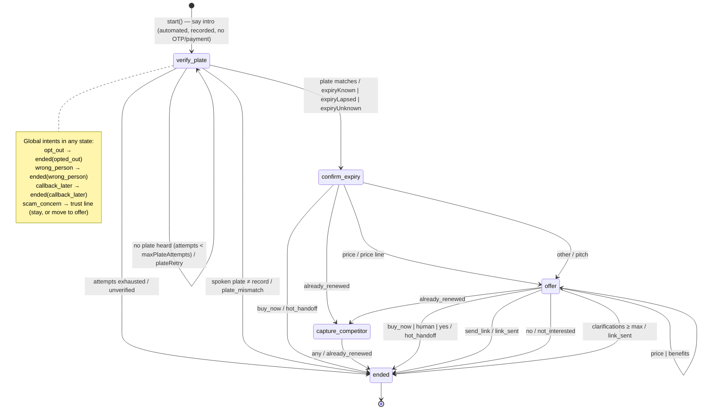

# ADR-009: Deterministic voice bot dialogue with a governed script; LLM only as an optional classifier behind a port

- **Status:** Accepted
- **Date:** 2026-10-07
- **Related:** [ADR-003](ADR-003-rules-engine-maker-checker.md), [AI governance](../ai-governance.md), [Integration §3.5](../integration-architecture.md#35-telephony--asr--tts-voice-ai-vendor)

## Context and problem statement

Outbound renewal calls at scale are much cheaper with a voice bot than with telesales (`config/rules/costs.json`, `insightsService.overview().economics`). In Vietnam, however, customers are highly wary of insurance and "VETC" phone scams. The call must therefore:

- **build trust**: disclose that it is automated, never ask for an OTP or payment, and verify the customer without reading out their data;
- **say only approved words**: regulated pricing, no discount language (Law on Insurance Business 08/2022/QH15; **confirm with TASCO legal**);
- **respect opt-out immediately**;
- **hand over to a human** with a minimal summary.

Generative LLM dialogue can hallucinate prices, promise discounts, or leak data, and it is hard to approve under maker-checker.

## Decision drivers

- Every customer-facing utterance must be pre-approved, versioned and copy-guarded.
- Behaviour must be predictable and testable (golden transcripts).
- The vendor ASR/TTS must be replaceable.
- NLU must be improvable without touching the script or the flow.

## Considered options

1. **Code-defined finite-state dialogue + governed script (`content.voicebot` rule kind) + pluggable intent classifier (keyword default, LLM optional).**
2. A fully generative LLM agent with a system prompt.
3. The vendor's proprietary bot builder.

## Decision outcome

Chosen option: **1** (`src/domain/voicebot.js`).

- **Script as governed content.** Lines (vi + en gloss), intent keywords, `maxPlateAttempts` and `maxClarifications` live in `config/rules/content.voicebot.json`. They are changed only through maker-checker, with the copy guard applied to `lines` (`validators.js`). Lines can only interpolate context fields such as `{{plateMasked}}`, `{{expiryVi}}` and `{{premiumVi}}`.
- **Plate-first verification.** The customer must say the plate. `extractPlateFromSpeech` maps spoken Vietnamese digits, and the result must equal the profile's key. The bot never reads the full plate (`maskPlate`) or the name.
- **Classifier port.** `createDialogue(script, { classify })`. The default is `keywordClassifier(script)`, which strips diacritics and uses whole-word matching. An LLM classifier may be injected **if** it returns one of the script's intent names or `unknown`. It never generates speech.
- **Outcome effects** (`voiceService.finalize`): handoff, link, opt-out (DNC + consent override), already-renewed (expiry +365 d at confidence 0.6), and DQ issues for wrong-person or plate-mismatch. Every call is audited.
- **Telephony port.** `runCall(dialogue, session, plate)` streams ASR text turns. The sandbox is `simulatedCaller.js` (weighted personas).

### Consequences

- Good: zero hallucination risk in speech. Compliance approves the exact words. Behaviour is unit-testable per state.
- Good: the LLM can improve recall later without re-approving the dialogue. It needs only model-risk sign-off ([AI governance §5](../ai-governance.md#5-llm-integration-policy)).
- Bad: rigid conversations, and the keyword NLU misses paraphrases. The `yes` intent includes short tokens (`co`, `u`, `ok`). Matching uses whole-word padding, so `co` will not match inside `cong`, but it can still misfire on phrases like "không có". Intent order puts `no` after `yes`, so "có" inside "không có" resolves to `yes` when both keywords are present. **Mitigation:** a labelled evaluation set, an intent precision/recall report per script version, and keyword-order review in maker-checker.
- Bad: the call `transcript` is stored encrypted, and recordings stay with the telephony vendor (contract and DPA required). Retention is 180 days (`retention.json`).
- Note: the intro says "Cuộc gọi được ghi âm" (the call is recorded). Recording consent and disclosure wording must be **confirmed with TASCO legal**.

## Pros and cons of the options

**Generative agent.** Natural conversation. However, the content cannot be approved in advance, prices and discounts may be hallucinated, prompt injection via speech is possible, and PII flows to the model.

**Vendor bot builder.** Fast to start. However, the script would live outside maker-checker and audit, and it creates vendor lock-in.
