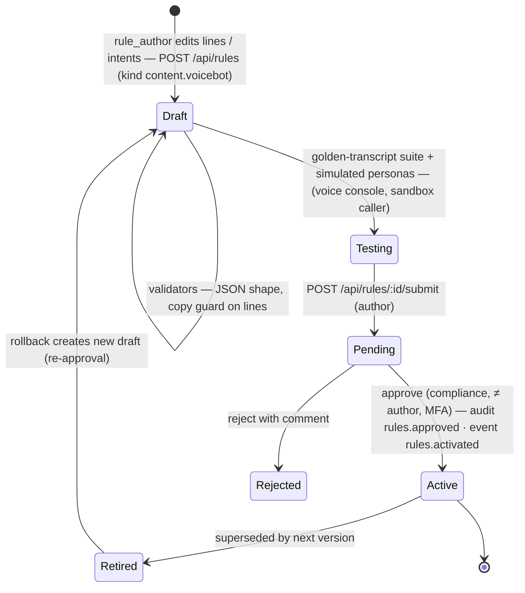

# AI & prompt governance

> Scope: every automated decision or AI component that affects customers on the platform.
> - The voice bot: dialogue policy, intent classifier, and the vendor's ASR/TTS.
> - The lead score, next-best action and journey assignment.
> - MDM inference of policy expiry and vehicle category.
> - Any future LLM or ML model.
>
> Related: [ADR-003](adr/ADR-003-rules-engine-maker-checker.md), [ADR-009](adr/ADR-009-voice-bot-dialogue.md). Regulatory statements are flagged **"confirm with TASCO legal"**.

## 1. AI inventory and risk tiering

| # | Component | Type | Code / config | Customer impact | Risk tier | Owner |
|---|---|---|---|---|---|---|
| 1 | Voice bot dialogue | Deterministic state machine + governed script | `src/domain/voicebot.js`, `config/rules/content.voicebot.json` | Speaks to customers; captures opt-out; hands off to sales | **High** (direct interaction, vishing context) | CX lead |
| 2 | Intent classifier | Keyword NLU (default); LLM optional (future) | `keywordClassifier` in `voicebot.js` | Wrong intent leads to a wrong path (a missed opt-out is critical) | **High** | CX lead + model risk |
| 3 | ASR / TTS | Vendor ML (Vietnamese) | Telephony port ([integration §3.5](integration-architecture.md#35-telephony--asr--tts-voice-ai-vendor)) | Mis-transcription → plate mismatch or wrong intent | Medium | Vendor + CX |
| 4 | Lead score + tier | Explainable weighted rules (white-box) | `src/domain/leads.js#score`, `config/rules/scoring.json` | Who gets contacted, how often, on which channel | Medium | Growth analytics |
| 5 | Next-best action, journey assignment | Decision tables / JSON Logic | `nba.json`, `journeys.json`, `leads.js` | Channel choice, suppression, B2B routing | Medium | Campaign |
| 6 | Expiry inference | Evidence-weighted inference | `src/domain/enrichment.js#inferExpiry`, `enrichment.json` | Timing of reminders; quote start date | Medium | Data office |
| 7 | Vehicle category inference | Decision table | `enrichment.categoryTable` | **Regulated premium amount** if not confirmed | **High** for pricing correctness | Data office + underwriting |
| 8 | Benefits relevance | JSON Logic relevance scores | `benefits.json`, `leads.js#benefitsFor` | Which value-adds are shown (only `legalStatus=approved` items to customers) | Low | Product |
| 9 | Future: LLM classifier / agent assist; propensity model | ML/LLM | Not implemented | — | Assessed before introduction | Model risk |

## 2. Voice bot design principles

Each principle is enforced in code or governed content.

| # | Principle | How it is enforced |
|---|---|---|
| 1 | **Disclose automation and recording** at call start | The `intro` line: "đây là trợ lý tự động của VETC … Cuộc gọi được ghi âm" ("this is VETC's automated assistant … this call is recorded"). Payload `disclosure: "automated_assistant"`. Governance dashboard states the disclosure. Recording-notice wording: **confirm with TASCO legal**. |
| 2 | **Never ask for an OTP, card or payment** on a call | Stated in `intro` and the `trust` line. The dialogue has no state that collects such data. Payment happens only in the VETC app (`link`, `handoff` lines). |
| 3 | **Plate-first verification.** The customer says the plate; the bot never reads it out. | State `verify_plate`: `extractPlateFromSpeech` must equal the profile key. A mismatch ends the call (`plate_mismatch`), and after `maxPlateAttempts` (3) the call ends `unverified`. Afterwards the bot refers to the vehicle only by `plateMasked` (`30A-***.45`). |
| 4 | **Truthful about price.** The premium is regulated and identical everywhere; no discounts. | The `price` line states the regulated premium incl. VAT and pivots to service value. The copy guard bans `giảm giá`, `chiết khấu`, `hoàn tiền`, `discount`, `cashback`, `rebate`, `cheaper`, … (`copy_guard.json`). Validation fails if a line contains them. |
| 5 | **Respect opt-out immediately** | `opt_out` is a **global** intent checked before any state logic. It ends the call, sets `consent.call=false`, `dnc=true` and `consentOverrides` (which survive data rebuilds), audits `consent.withdrawn` and triggers a lead recompute (`zeroWhen: consent.dnc` → score 0, NBA `suppress`). |
| 6 | **Safety first** | `callback_later` ("đang lái xe", "busy", "driving") ends politely with a drive-safely line |
| 7 | **Handle scam concerns** | The `scam_concern` intent gives the `trust` line: how to verify, and that payment happens in-app only |
| 8 | **Human handoff on request or intent** | `human`, `buy_now` and `yes` in the offer state end as `hot_handoff`. The handoff summary is minimal: masked phone, talking points, trust/price flags (`handoffSummary`). Supervisors and agents work it under ABAC. |
| 9 | **Bounded conversation** | `maxClarifications` (2), then a link is sent instead of looping. Utterances are truncated (500 characters). |
| 10 | **Lawful targeting** | Calls only after `canContact()`: call consent, DNC, 08:00–20:00 local, weekly call cap 2 (`contact_policy.json`). The campaign endpoint skips company-owned vehicles and profiles without consent or a phone (`routes.js /api/voice/campaign`). Decree 91/2020/ND-CP call rules and the national Do-Not-Call list: **confirm with TASCO legal**. Check against the national DNC register before calling (planned integration). |
| 11 | **Every call improves data, nothing more** | Outcomes update expiry (renewed elsewhere, confidence 0.6), raise DQ issues (wrong person, plate mismatch) and record consent. There are no hidden profiling attributes. |

## 3. Script and prompt lifecycle (`content.voicebot`)

**What is governed:** the bot lines (vi text + en gloss), intent keyword lists and their order (first match wins), `maxPlateAttempts`, `maxClarifications` and the disclosure type. The state machine itself is code: changes go through a pull request, code review and release.

**Approver checklist (compliance):**

1. Disclosure and recording notice unchanged, or legally re-approved.
2. No request for OTP, card, password or payment.
3. Price statements match the active `tariff.*` and say "same at every insurer".
4. No banned phrases (automated) and no implied discounts (human judgement: e.g. "ưu đãi" (offer) implying a price cut).
5. The opt-out keyword list is not narrowed. Every removal needs a justification.
6. The intent order is reviewed (a short `yes` keyword can capture "không có" ("I don't have it"); see [ADR-009](adr/ADR-009-voice-bot-dialogue.md)).
7. Golden-transcript results attached: 100 % pass on critical paths (opt-out, plate mismatch, scam concern, price).
8. Tone and politeness in Vietnamese (Quý khách form of address), and regional dialect check.

**Testing assets:**

- `simulatedCaller.js` personas (eager, self-serve, price shopper, skeptic, already renewed, busy, opt-out, wrong plate);
- the interactive voice console (`POST /api/voice/sessions`, `/turns`);
- **planned:** a labelled utterance set (§5.3) and an automated regression run on `POST /api/rules/validate` for `content.voicebot`.

**Prompts for future LLMs** follow the same lifecycle under a new rule kind (e.g. `content.llm_prompts`). The system prompt, few-shot examples, model id, temperature and output schema are versioned, copy-guarded where customer-facing, and approved by compliance and model risk.

## 4. Model risk management: lead scoring and inference

### 4.1 Model card: lead score (`scoring` v1)

| Item | Value |
|---|---|
| Purpose | Prioritise outreach (who, when, which channel) for renewal and new business. It **does not** affect price, eligibility or claims. |
| Method | `score = round(Σ weight_f × clamp(value_f, 0, 1) × (0.6 + 0.4 × expiryConfidence))`, set to 0 if `consent.dnc` |
| Factors (weight) | urgency (35): days to expiry/lapse · expiryConfidence (15) · engagement (20): app sessions, toll trips · reachability (15): push, Zalo, call consent, SMS · affinity (15): prior VETC purchase, TASCO customer, wallet covers premium, auto top-up, minus complaints |
| Tiers | hot ≥ 70, warm ≥ 45, otherwise nurture |
| Explainability | Every lead stores `reasons[] {factor, label, points, max, why}` sorted by contribution; the NBA stores `ruleId`. Both are shown in the customer 360 view. |
| Excluded attributes | Name, gender, age and date of birth are not collected. `region` and `ownerType` are available in the facts but **not used** by any factor. |
| Proxy-risk attributes | `walletBalance` (affluence proxy), `province` (via facts), `complaints12m` (reduces affinity) |
| Validation | `validators.js`: weights sum to 100, hot > warm. `/api/rules/simulate` compares current and candidate output per profile. |
| Limitations | Hand-set weights, not fitted. Synthetic ground truth only in demo (`_hidden` in synthetic records); real calibration needs production outcomes. |

### 4.2 Controls

| Control | Method | Threshold / cadence | Status |
|---|---|---|---|
| Explainability | Factor reasons and NBA rule ids on every lead | 100 % coverage | Implemented |
| Change control | Maker-checker + simulate; model-risk sign-off for `scoring`, `nba`, `journeys` | Every change | Implemented (sign-off procedural) |
| Reproducibility | Store the rule-set versions/checksums used on each lead | Every evaluation | **Planned** ([data §8](data-architecture.md#8-metadata-lineage-and-reconciliation)) |
| Calibration | Conversion rate (order within 30 days of the first touch) by tier; hot > warm > nurture, monotonic | Monthly | Planned (needs analytics mart) |
| Fairness | Contact rate, tier mix and conversion by **province group**, **owner type** and **vehicle category**. Disparate-impact ratio of contact rate ≥ 0.8 versus the reference group, unless explained by urgency. Review of proxy features. | Quarterly + on each scoring change | Planned |
| Feature guard | Validator rule: scoring factors must not reference `region`, `ownerType` or any future demographic field without a model-risk waiver | On save | **Recommended** (add to `validators.js#SPECIFIC.scoring`) |
| Drift | PSI on the score distribution (alert > 0.2) and on key features (`days`, `expiryConfidence`, engagement); weekly tier-mix trend | Weekly | Planned |
| Outcome loop (refit) | Quarterly review: compare factor contributions with outcomes; propose new weights as a draft; A/B (champion/challenger) using hold-out groups | Quarterly | Planned. Needs an experiment flag, because there is one active version per kind today. |
| Human oversight | Telesales see the reasons and can reject leads (handoff `lost` with a note); supervisors reassign | Continuous | Implemented |

### 4.3 Inference models (MDM)

| Model | Risk | Control |
|---|---|---|
| Expiry inference | A wrong date means early or late reminders, and a quote start date that overlaps or leaves a gap in existing cover | Measure the accuracy of inferred expiry against later verified certificates or TASCO issuance (share within ±21 days, per method). Tune `expiryEvidence` confidences by maker-checker. Reminders ask the customer to **verify** (`verify_expiry` template, `needsConfirmation` in the app). |
| Category inference | **A wrong category means a wrong regulated premium** if the customer does not correct it | Measure accuracy against TASCO-issued categories. **Recommendation:** when `categoryConfidence < 0.8`, require explicit customer or agent confirmation of seats/usage before `purchase` (not enforced today; `quote` uses the inferred category unless `options.category` is passed). |

Hard-coded confidences outside the rule set (customer 0.8, steward 0.9, voice bot 0.6, issued 1.0; voice `expiryKnown` threshold 0.5; app `needsConfirmation` < 0.75) should move into `enrichment` so they are governed too.

## 5. LLM integration policy

### 5.1 Permitted and prohibited uses

| Permitted (with approval) | Prohibited |
|---|---|
| Intent classification behind the `classify(text) → intent` port. The output must be one of the script's intent names or `unknown`. | Generating customer-facing speech or messages that were not pre-approved |
| Internal agent assist: summarising call outcomes for telesales from **structured** signals | Quoting prices, eligibility, cover terms or legal advice |
| DQ assistance: suggesting the normalisation of messy free text for steward review | Deciding consent, claims, underwriting or any decision with legal effect without a human |
| Rule authoring assistant that drafts JSON Logic **as a draft only**, still subject to validators and maker-checker | Collecting or processing OTPs, card data or national id |

### 5.2 Data protection

1. **Minimise.**
   - Send only the current utterance (≤ 500 characters) and the intent list.
   - Before sending, mask digit sequences (plates, phones) and known names.
   - Never send profile data, transcript history or ids.
2. **Residency and DPA.**
   - No personal data goes to an external model provider without a DPA, a processing-purpose record, a transfer impact assessment, and confirmation that cross-border transfer rules are met: Decree 13/2023/ND-CP transfer dossier and the PDP Law 2025 (**confirm with TASCO legal**).
   - Prefer an in-country or self-hosted model for anything that touches customer speech.
3. **No training on customer data** by the provider (contractual), and zero data retention where offered.
4. **Logging.** Log the intent, confidence, model id and prompt version, but not the raw prompt or completion when it may contain PII.

### 5.3 Evaluation and red-teaming

| Suite | Content | Pass criteria |
|---|---|---|
| Intent evaluation set | ≥ 2,000 labelled Vietnamese utterances: Northern, Central and Southern dialects, diacritic-less ASR output, code-switching (vi/en), noise and filler, numbers spoken in words | Macro F1 ≥ keyword baseline + 5 pts; **`opt_out` recall ≥ 0.99**; `scam_concern` recall ≥ 0.95; `buy_now` precision ≥ 0.9 |
| Plate extraction | Spoken plates in many styles ("ba mươi A …", "30A 123 45", 4-digit legacy) | ≥ 98 % exact match on clear audio transcripts |
| Red team | Prompt injection via speech ("bỏ qua hướng dẫn…" / "ignore previous instructions"), requests for discounts, impersonation scripts, abusive language, attempts to extract other customers' data | Zero policy violations: classifier output stays in the enum; no PII echoed |
| Regression | Golden transcripts for each script version | 100 % on critical paths |
| Latency | p95 classification time | ≤ 300 ms (otherwise fall back to keywords) |

**Runtime guard-rails:**

- schema-validate the output (enum);
- timeout, then fall back to `keywordClassifier`;
- the keyword `opt_out` check **always runs first** and overrides the LLM;
- a feature flag per campaign for gradual rollout.

## 6. Monitoring

**Governance dashboard** (`GET /api/dashboard/governance`, permission `audit:read`; `insightsService.governance`) returns today:

- `voiceBot.calls`, `voiceBot.outcomes` (opted_out, hot_handoff, link_sent, already_renewed, plate_mismatch, unverified, wrong_person, callback_later, not_interested);
- `plateVerificationFailureRate` = (plate_mismatch + unverified) / calls;
- `optOutRate` = opted_out / calls;
- `disclosure` statement;
- rule-set counts by status (draft, pending, active, retired, rejected);
- audit-chain verification (`ok`, `entries`, `head`).

**Metrics and thresholds:**

| Metric | Source | Threshold → action |
|---|---|---|
| Opt-out rate | governance dashboard / `voice_calls_total{outcome="opted_out"}` | > 8 % weekly → review script and targeting; > 15 % → pause campaign |
| Plate verification failure | governance dashboard | > 25 % → check ASR quality and data accuracy (wrong numbers) |
| Wrong-person rate | `voice_calls_total{outcome="wrong_person"}`, DQ issues | > 5 % → data quality incident with the VETC data office |
| Unknown-intent / clarification rate | Session `lastIntent`, clarifications (planned metric) | > 20 % → NLU review |
| Complaints mentioning the bot | CX ticketing (planned integration) | Any vishing-related complaint → incident (§7) |
| Copy-guard blocks at send | `messages_total{status="blocked"}` | > 0 → template defect; fix the template |
| Contact-policy suppressions | Touchpoint `skipped` reasons | Trend review monthly (consent health) |
| Score drift / fairness | Analytics marts (§4.2) | PSI > 0.2 or DI < 0.8 → model-risk review |
| Handoff conversion | `handoffs` won/lost | Below target → review talking points and scoring |

## 7. AI incident handling

| Incident | Examples | Immediate containment | Follow-up |
|---|---|---|---|
| Harmful or incorrect bot speech | Wrong price stated, discount implied, rude wording | Roll back `content.voicebot` to the previous version (rollback → approve). Pause automated calls: suspend the `journeys` CronJob and stop `/api/voice/campaign` use. | Root cause; add a golden transcript; compliance review |
| Missed opt-out | Customer said stop and was called again | Pause campaigns; manually set DNC for affected profiles; review `consent.withdrawn` audit entries | Add utterances to the evaluation set; widen keywords; regulator and customer communication if required (**confirm with TASCO legal**) |
| Vishing wave impersonating VETC | Customers report fraudulent "VETC insurance" calls | Push and Zalo service message to affected regions: "VETC never asks for OTP/payment by phone"; strengthen the trust line | Coordinate with VETC security and the authorities |
| Model or ASR degradation | Vendor ASR accuracy drop; plate failures spike | The telephony breaker opens on errors. Otherwise reduce campaign concurrency or pause. | Vendor SLA escalation |
| Scoring defect | A bad weights version leads to the wrong customers being contacted | Roll back `scoring`/`nba`; recompute leads (`POST /api/leads/recompute`) | Simulation evidence required on the next change |

> **Gap:** there is no single **kill switch** that stops all automated calls immediately, independent of maker-checker. Today it takes a CronJob suspend plus discipline on the campaign endpoint. **Recommendation:** an operational flag, for example `VOICE_BOT_ENABLED` in config or an `ops` toggle with `ops:run_jobs` and audit, checked in `voiceService.autoCall`.

## 8. Roles and responsibilities (RACI)

R = Responsible · A = Accountable · C = Consulted · I = Informed

| Activity | Product owner (TASCO) | CX lead (VETC) | Compliance officer | Legal / DPO | Model risk / analytics | InfoSec | Rule author | Rule approver | iorta TechNXT engineering | Telesales ops |
|---|---|---|---|---|---|---|---|---|---|---|
| Voice bot script change | A | R | C | C | I | I | R | R (approve) | I | C |
| Disclosure / recording wording | C | C | R | A | — | — | I | I | I | — |
| Dialogue state-machine change (code) | A | C | C | I | I | C | — | — | R | I |
| Scoring / NBA / journey change | A | C | C | I | R (sign-off) | — | R | R (approve) | I | C |
| Fairness and drift review | I | I | C | C | R/A | — | — | — | C | I |
| LLM introduction (new model or prompt) | A | C | C | R (DPA, transfer) | R (evaluation) | R (security review) | — | R (approve prompt) | R (integration) | I |
| Opt-out and consent handling | I | R | A | C | — | — | — | — | R (code) | I |
| AI incident response | A | R | R | C | C | C | — | — | R | I |
| Governance dashboard review (monthly) | A | R | R | I | R | I | — | — | C | I |
| Category/expiry inference accuracy | A | — | I | — | R | — | C | C | C | — |

## 9. Regulatory alignment (to confirm)

All of the following must be **confirmed with TASCO legal** before production:

- personal data processing basis and AI disclosure (Decree 13/2023/ND-CP; Law on Personal Data Protection 2025 and its implementing decree);
- marketing calls and messages: hours, frequency and the DNC registry (Decree 91/2020/ND-CP);
- consumer protection and call recording notice (Law on Protection of Consumers' Rights 2023);
- the prohibition on discounts or rebates for compulsory TNDS (Law on Insurance Business 08/2022/QH15; Decree 67/2023/ND-CP);
- data residency (Cybersecurity Law 2018; Decree 53/2022/ND-CP).

The platform's defaults are conservative and configurable (`contact_policy`, `copy_guard`, `retention`), so legal positions can be applied as maker-checker rule changes rather than code changes.
