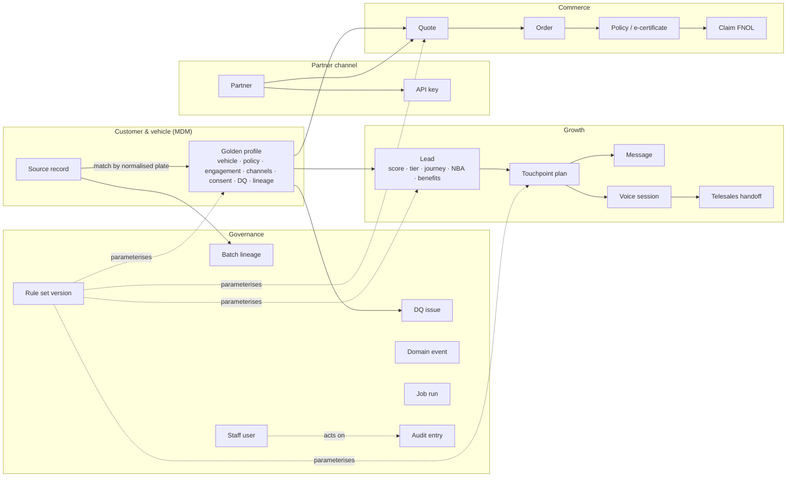
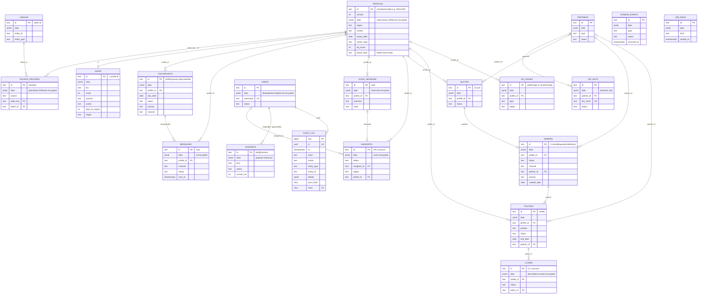
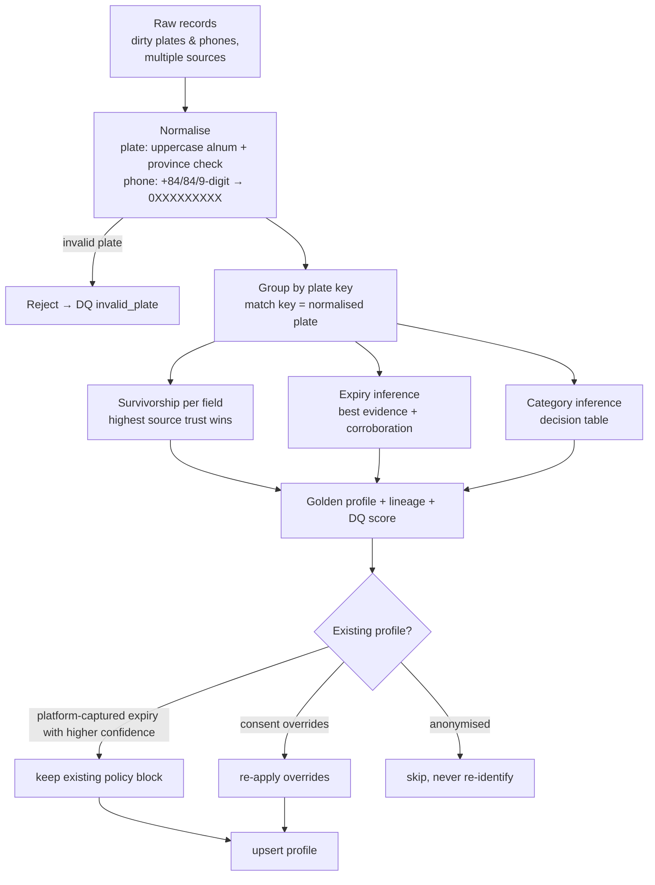
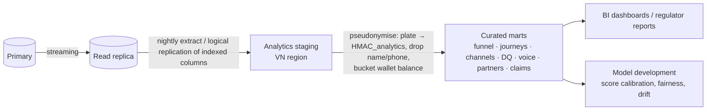

# Data architecture

> Sources of truth:
> - the collection registry `src/adapters/persistence/schema.js`;
> - the DDL `db/migrations/001_init.sql`;
> - the codec `src/adapters/persistence/codec.js`;
> - MDM logic `src/domain/enrichment.js`;
> - rule sets `config/rules/enrichment.json` and `config/rules/retention.json`.
>
> Storage pattern: [ADR-004](adr/ADR-004-persistence.md). Encryption: [ADR-006](adr/ADR-006-field-encryption-blind-index.md).

## 1. Storage pattern

Each of the 19 collections is a PostgreSQL table with:

```
id text PRIMARY KEY · version integer (optimistic lock) · data jsonb (the document; PII fields encrypted)
· <indexed columns extracted from the document> · <blind-index columns> · created_at · updated_at
```

`audit_log` is a separate append-only, hash-chained table, and `schema_migrations` records applied migrations. Only the indexed columns (plus `id`, `created_at`, `updated_at`) can be filtered or sorted (`query.js#assertColumns`).

## 2. Conceptual model



## 3. Logical ERD

Relationships are logical. They are enforced in the services and checked by reconciliation; there are no database foreign keys ([ADR-004](adr/ADR-004-persistence.md)).



## 4. Data classification

| Class | Examples | Controls |
|---|---|---|
| **Restricted — personal** | Customer name and phone; call transcript; claim description and location; staff TOTP secret | AES-256-GCM field encryption; masked unless `profile:read_pii`; redacted in logs; DSAR scope |
| **Confidential — personal-linked** | Licence plate (match key), policy expiry and insurer, engagement metrics, wallet balance, consent flags, IP addresses in audit | Clear in DB (needed for matching and filtering); access by RBAC/ABAC; pseudonymised in analytics (**plate status: confirm with TASCO legal / DPO**, see [ADR-006](adr/ADR-006-field-encryption-blind-index.md)) |
| **Confidential — business** | Quotes, orders, commission, rule sets (tariffs, scoring), partner data | RBAC; audit |
| **Internal** | Metrics, job runs, DQ issue counts | Staff access |
| **Public** | Certificate validity with a masked plate (`/api/public/certificates/:certNo`) | Rate-limited; no PII |

## 5. Data dictionary

Legend: **Idx** = extracted indexed column (filterable); **PII** = personal data; **Enc** = encrypted at rest by the codec. "Doc" fields live only in `data jsonb`. "Source" says which code writes the field.

### 5.1 `profiles` — golden record (1 per vehicle)

| Field | Column / type | Idx | PII | Enc | Description | Source |
|---|---|---|---|---|---|---|
| `id` | `id` text | PK | Linked | — | Normalised plate key, e.g. `30A12345` (`normalizePlate`) | `enrichment.buildProfiles` |
| `plate` | doc | — | Linked | — | Display plate `30A-123.45` | same |
| `province` | `region` text | ● | — | — | Province from plate prefix (`PROVINCES`) | same |
| `name` | doc | — | ● | ● | Survivor name (highest source trust) | same |
| `phone` | doc + `phone_bidx` | ● (bidx) | ● | ● | Survivor valid VN mobile `0XXXXXXXXX`; blind index for equality lookup | same |
| `altPhones[]` | doc | — | ● | ● | Other valid phones (conflict → DQ `conflicting_phone`) | same |
| `sources[]`, `recordIds[]` | doc | — | — | — | Contributing sources and source record ids | same |
| `ownerType` | `owner_type` text | ● | — | — | `individual` / `company` | VETC account |
| `tagActivatedAt` | doc | — | — | — | ETC tag activation date (new-vehicle signal) | VETC account |
| `vehicle.{tollClass, seats, usage, category, categoryConfidence, categoryBasis, firstRegisteredYear}` | doc | — | — | — | Vehicle facts; category from `enrichment.categoryTable` | MDM |
| `policy.expiryDate` | `expiry_date` date | ● | Linked | — | Best expiry estimate | MDM / customer / steward / bot / TASCO issue |
| `policy.{expiryMethod, expiryConfidence, expiryCandidates[], certNo, verified}` | doc | — | — | — | Evidence and confidence | same |
| `policy.insurer` | `insurer` text | ● | — | — | Current insurer (`TASCO`, other, `OTHER`, null) | same |
| `policy.competitorNote` | doc | — | ● (free text) | **— (gap)** | Customer's own words about the competitor policy (voice bot) | `voiceService.finalize` |
| `engagement.*` | doc | — | Linked | — | App sessions, toll trips, long trips, wallet balance, auto top-up, prior purchase, complaints | VETC account |
| `channels.{app_push, zalo_zns, sms, voice_bot, telesales}` | doc | — | — | — | Reachability | MDM |
| `consent.{marketing, call, dnc}` | doc | — | ● | — | Consent state | VETC + platform overrides |
| `consentOverrides` | doc | — | ● | — | Platform-captured consent that survives rebuilds | customer / bot opt-out |
| `dataQuality.score` | `dq_score` int | ● | — | — | 0–100 (§7) | MDM |
| `dataQuality.missing[]` | doc | — | — | — | Open DQ facets | MDM |
| `lineage[]` | doc | — | — | — | `{field, source, confidence, rule?, at?}` | MDM + updates |
| `partnerId` | doc | — | — | — | Partner that supplied a record | MDM |
| `anonymised`, `anonymisedAt` | doc | — | — | — | Erasure markers (rebuild skips anonymised profiles) | `customerService.erase` |

### 5.2 `source_records` — landed raw records

| Field | Column | Idx | PII | Enc | Description |
|---|---|---|---|---|---|
| `id` = `recordId` | PK | ● | — | — | Source-unique record id |
| `source` | `source` | ● | — | — | `vetc_account`, `partner_<type>`, `telesales_csv`, … |
| `plateRaw` / `plateKey` | doc / `plate_key` | ● | Linked | — | Raw and normalised plate (null if invalid) |
| `phoneRaw`, `fullName` | doc | — | ● | ● | Raw contact data |
| `batchId` | `batch_id` | ● | — | — | Ingestion batch (`B-<date>-<rand>`) |
| `tollClass, seatsDeclared, usageDeclared, ownerType, tagActivatedAt, firstRegisteredYear, policy{insurer, certNo, expiryDate, verified}, lastInspectionDate, declaredExpiry, partnerId` | doc | — | Linked | — | Source attributes |
| VETC account attributes (`appUser, appSessions30d, tollTrips30d, longTripsKm90d, walletBalance, autoTopUp, pushEnabled, zaloLinked, marketingConsent, callConsent, dnc, complaints12m, priorVetcInsurancePurchase`) | doc | — | Linked / consent | — | Engagement, channel and consent. **Not accepted by `POST /api/data/ingest`** (allow-list gap, [integration §3.4](integration-architecture.md#34-sourcefeed--vetc-data-and-cdc)) |
| `_hidden` | doc | — | — | — | **Synthetic data only** (ground truth for model evaluation). Must never exist in production feeds. Stripped from DSAR export. |
| `ingestedAt`, `anonymised` | doc | — | — | — | Landing time; erasure marker |

### 5.3 `leads`

| Field | Column | Idx | Description |
|---|---|---|---|
| `id` = `profileId` | PK | ● | One lead per profile |
| `tier` | `tier` | ● | `hot` ≥ 70, `warm` ≥ 45, else `nurture` (`scoring.tiers`) |
| `score` | `score` | ● | 0–100, damped by expiry confidence; 0 when DNC |
| `journey`, `objective` | `journey` | ● | First matching journey (`journeys.priority`) |
| `nextBestAction.{action,label,reason,ruleId,…}` | `action` | ● | NBA decision-table output |
| `daysToExpiry` | `days_to_expiry` | ● | Negative = lapsed |
| `region` | `region` | ● | Province |
| `reasons[]` | doc | — | Per-factor `{factor, label, points, max, why}` (explainability) |
| `benefits[]`, `premium`, `plate`, `evaluatedAt` | doc | — | Top benefits, TNDS premium incl. VAT, business date |

### 5.4 Engagement collections

| Collection | Key fields (Idx in **bold**) | PII / Enc | Notes |
|---|---|---|---|
| `touchpoints` | `id` (`profile:journey:step:dueDate`), **profile_id, due_date, status, journey, channel**, `step, channels[], marketing, template, result, executedAt` | — | Deterministic id gives idempotent planning. Status `scheduled → done/skipped/cancelled`. |
| `messages` | `id` uuid, **profile_id, channel, status, sent_at**, `templateKey, journey, step, touchpointId, marketing, text, blockReason, providerMessageId, error, sessionId` | `to` ● Enc. `text` contains the plate and a renewal link (Linked, clear). | Status `sent/failed/blocked`. Contact history for caps. |
| `voice_sessions` | `id` uuid, **profile_id (customerId), outcome, state**, `mode, verified, plateAttempts, clarifications, signals{priceAsked, trustConcern, expiryConfirmed, competitorInfo, expiryStatement}, ctx{plateKey, plateMasked, expiry, …}, persona, handoffId, startedAt, endedAt` | `transcript` ● Enc. **`signals.competitorInfo` and `signals.expiryStatement` are free-text customer speech stored in clear (gap).** | Retention 180 d |
| `handoffs` | `id`, **status, assigned_to, region, profile_id**, `sessionId, plate, plateVerifiedByCustomer, phoneMasked, journey, expiryDate, daysToExpiry, premium, score, outcome, priceAsked, trustConcern, talkingPoints[], notes[], createdAt` | `name` ● Enc; phone masked | Minimal data for telesales (`handoffSummary`) |

### 5.5 Commerce collections

| Collection | Key fields (Idx in **bold**) | PII / Enc | Notes |
|---|---|---|---|
| `quotes` | `id` `Q-uuid`, **profile_id, status**, `plate, channel, partnerId, journey, lines[{product, startDate, endDate, termDays, premiumNet, vat, total, priceRegulated, breakdown}], total, benefits, bundle, createdBy, expiresAt, orderId` | Linked (plate) | TTL 24 h; `open → converted` |
| `orders` | `id` `O-…`, **profile_id, status, channel, partner_id, journey, created_date**, `quoteId, amount, paymentRef, policies[], commission[{product, rate, amount, ruleId, capped}], createdBy, completedAt, error` | — | `pending_payment → completed`, or `payment_failed` / `issuance_failed_refunded` |
| `policies` | `id` = certNo, **profile_id, product, status, end_date, partner_id**, `policyNo, plate, startDate, premiumNet, vat, total, channel, orderId, certificateUrl, issuedAt, insurer` | Linked (plate) | Financial and legal record (10-year archive) |
| `claims` | `id` `CL-…`, **profile_id, status, policy_id**, `product, incidentDate, photos, history[], slaDueAt` | `description`, `location` ● Enc | FNOL front door. Adjudication happens in TASCO core. |

### 5.6 Partner, identity and governance collections

| Collection | Key fields (Idx in **bold**) | PII / Enc | Notes |
|---|---|---|---|
| `partners` | `id`, **type, status**, `name, region, createdAt` | — | Types: bank, showroom, agent, fleet, inspection_center |
| `api_keys` | `id`, **partner_id, key_hash (unique), status**, `prefix, scopes[], createdBy, revokedAt` | — (SHA-256 only) | Plaintext key returned once |
| `users` | `id`, **username (unique), status**, `roles[], region, passwordHash (scrypt), failedLogins, lockedUntil, lastLoginAt, createdBy, passwordChangedAt` | `displayName`, `totpSecret` ● Enc | Staff only |
| `rulesets` | `id` `kind@N`, **kind, status, version_no**, `payload, checksum, description, createdBy, submittedAt, approvedBy, approvalComment, activatedAt, retiredAt, supersededBy, rejectedBy, rejectionComment` | — | Maker-checker history |
| `domain_events` | `id`, **type, status, occurred_at**, `payload, actor, correlationId, attempts, handled[], lastError, processedAt` | Payload carries profile ids (plates) | Outbox |
| `dq_issues` | `id`, **profile_id, type, status**, `recordId, source, batchId, detectedAt, via, resolution, resolvedBy, resolvedAt` | — | §7 |
| `lineage` | `id` = batchId, **entity_id, entity_type**, `source, records, rejected, at` | — | Batch lineage |
| `job_runs` | `id`, **kind, started_at**, `actor, status, result, error, finishedAt` | — | Job history |
| `audit_log` | `seq, id, at, actor, action, entity_type, entity_id, details, prev_hash, hash` | `details` hold ids, reasons and **IP addresses** (personal data of staff/customers) | Append-only, hash-chained |

## 6. Master data management (golden record)



**Match key.** `normalizePlate()` (`src/domain/identity.js`) produces `^\d{2}[A-Z]{1,2}\d{4,5}$` with a valid province code. It handles forms such as `30a-123.45`, `30A 12345`, `30A.123.45` and the legacy 4-digit form. Exact match on the key only; there is no fuzzy matching. That is deliberate, because a plate is a legal identifier. Wrong-person and plate-mismatch outcomes from calls feed DQ.

**Survivorship** (`enrichment.sourceTrust`):

| Source | Trust |
|---|---|
| tasco_core | 1.00 |
| vetc_app_purchase | 0.95 |
| vetc_account | 0.85 |
| customer_declared | 0.75 |
| partner_inspection_center | 0.65 |
| partner_bank, showroom, fleet | 0.60 |
| partner_agent | 0.50 |
| telesales_csv, default | 0.40 |

| Attribute | Rule |
|---|---|
| phone | Valid normalised phones sorted by trust. The first is the survivor; the rest go to `altPhones`. More than one distinct phone raises a DQ issue. |
| name, seats, usage, tollClass | Highest-trust non-empty value |
| ownerType, tag, engagement, channels, consent | From the `vetc_account` record (system of record for the account) |
| vehicle.category | `categoryTable` (first hit) over seats, toll class and commercial flag, with confidence and basis |
| policy.expiryDate | Evidence ranking (below) |
| policy.insurer | First record carrying an insurer, else the insurer from the best expiry evidence |

**Expiry evidence** (`enrichment.expiryEvidence`, `inferExpiry`):

| Method | Confidence |
|---|---|
| verified_certificate | 1.0 |
| customer_declared | 0.75 |
| partner_policy_record | 0.7 × trust / 0.6 (capped at 0.7) |
| inspection_cycle | 0.5 (last inspection + 365 d, rolled forward to ≥ today − 60 d) |
| tag_anniversary | 0.25 |

- **Corroboration:** each different method agreeing within 21 days adds 0.15, up to 0.95.
- **Usable** means confidence ≥ 0.5.

Facts captured on the platform are applied by `applyDeclaredExpiry`. **Note:** these confidences are hard-coded in services, not in the `enrichment` rule set (configurability gap).

| Platform source | Confidence | Where hard-coded |
|---|---|---|
| customer (app) | 0.8 | `customerService` |
| data steward | 0.9 | `routes.js` |
| voice bot (renewed elsewhere) | 0.6 | `voiceService` |
| TASCO issuance | 1.0 | `salesService` |

**Rebuild protection.** On rebuild, an existing policy block is kept when its method is `customer_declared`, `voice_bot` or `tasco_issued` and it has higher confidence (`ingestionService.rebuild`).

> **Defect:** `data_steward` is **not** in that list. A steward correction (confidence 0.9) is overwritten the next time that plate is rebuilt from source data. Add `data_steward` to the preserved methods. Better still, preserve any method whose lineage source is platform-captured.

## 7. Data quality

**Score** (per profile, 0–100):

```
completeness = 1 − (#missing of {phone, name, reliable_expiry, vehicle_category, current_insurer}) / 5
score = round(100 × (0.5·completeness + 0.35·expiryConfidence + 0.15·categoryConfidence))   // weights: enrichment.dataQuality
```

| DQ dimension | Measure | Issue type(s) | Raised by |
|---|---|---|---|
| Validity | Plate and phone format, province | `invalid_plate` (record-level) | `ingestionService.ingest` |
| Completeness | Mandatory facets present | `phone`, `name`, `current_insurer` | `buildProfiles` |
| Accuracy / reliability | Expiry confidence ≥ 0.5; category confidence ≥ 0.6 | `reliable_expiry`, `vehicle_category` | `buildProfiles` |
| Consistency | One phone per vehicle | `conflicting_phone` | `buildProfiles` |
| Accuracy (field-verified) | Customer contradicts the data | `wrong_person`, `plate_mismatch` | `voiceService.finalize` |
| Uniqueness | Duplicates merged per plate | stats `duplicatesMerged` | `buildProfiles` |
| Timeliness | Freshness of the source feed | (planned: `stale_source`) | Feed monitoring |

**Workflow:**

1. Issues are listed at `GET /api/dq/issues` (`dq:read`).
2. A data steward resolves them via `POST /api/dq/issues/:id/resolve` (`dq:resolve`), or corrects the expiry with `PATCH /api/customers/:id/expiry` (evidence required, audited).
3. Customers fix their own data (`POST /api/customer/expiry`), and calls fix it too.
4. A resolved issue reopens if the next rebuild detects it again.

KPIs (`/api/dashboard/overview`): open issues by type, and profiles with usable data.

> **Mislabel:** `insightsService` counts `dq_score ≥ 50` as `profilesWithUsableData`. The MDM definition is `expiryConfidence ≥ 0.5`. Align the definitions.

## 8. Metadata, lineage and reconciliation

**Technical metadata.**

- `schema.js` (collections, indexed columns, PII and blind-index fields) is machine-readable.
- **Target:** export it to the data catalogue (e.g. OpenMetadata/DataHub) with classification tags from §4.
- OpenAPI (`/api/openapi.json`) documents interface metadata.

**Business metadata.**

- Each rule set version carries `kind, description, checksum, createdBy, approvedBy, activatedAt`.
- The descriptions in `config/rules/*.json` act as a business glossary seed.

**Lineage, at four levels:**

| Level | Where | API |
|---|---|---|
| Batch | `lineage` collection `{batchId, source, records, rejected, at}`; `source_records.batchId` | `GET /api/customers/:id/lineage` (`recentBatches`) |
| Record → profile | `profiles.recordIds[]`, `sources[]` | same |
| Field | `profiles.lineage[] {field, source, confidence, rule, at}` | same |
| Decision | `leads.reasons[]` (factor, points, why), `nextBestAction.ruleId`, `quote.lines[].breakdown[].rateRule`, `order.commission[].ruleId` | `GET /api/customers/:id`, `/api/leads` |

> **Gap:** leads and quotes do not record **which rule-set versions** (kind@N or checksum) produced them. Add a `rulesSnapshot` (`rulesService.snapshot()` already returns `{kind, version, checksum}`) to leads, quotes and orders, so any decision can be reproduced for regulators.

**Reconciliation:**

| Check | Implemented |
|---|---|
| Ingestion: records = landed + rejected; profiles = distinct valid plates (returned per batch) | ● |
| Orders: completed ⇒ payment ref present and each policy exists; `pending_payment` > 1 h flagged (`opsService.reconcile`) | ● |
| Wallet settlement ↔ orders; TASCO core policy register ↔ policies; partner commission ↔ finance | Planned |
| Event backlog / dead letters (`/api/ops/status`) | ● (manual) |
| Audit chain integrity (`/api/audit/verify`) | ● |

## 9. Retention, archival, erasure and backup

**Retention policy** (`config/rules/retention.json`, rule kind `retention`, maker-checker; **periods to be confirmed with TASCO legal**):

| Entity | Retain | Action | Implemented by `opsService.applyRetention` |
|---|---|---|---|
| source_records | 365 d | delete | ● `deleteWhere(created_at < cutoff)` — see note 1 |
| profiles | 1,825 d (5 y) | anonymise when no active policy and no activity | Planned (archival pipeline) |
| voice_sessions | 180 d | delete (recordings + transcripts) | ● |
| messages | 365 d | archive | Planned |
| orders | 3,650 d | archive (financial records) | Planned |
| certificates (policies) | 3,650 d | archive | Planned |
| audit_log | 3,650 d | archive, never deleted early | Planned (WORM) |

Notes:

1. `created_at` is preserved on upsert, so source-record age counts from **first landing**, not from the last refresh. A record refreshed daily by CDC is still deleted after 365 days, after which the profile rebuild loses that source. Use `updated_at`, or keep the latest version per source.
2. The policy description says "legal hold overrides deletion", but **no legal-hold flag exists in code**. Add `legalHold` on profiles, claims and orders, and skip held entities.
3. `domain_events`, `touchpoints`, `dq_issues` and `job_runs` have no retention rule. Add 30 d (`done` events), 90 d (executed touchpoints), 365 d (resolved DQ) and 365 d (job runs).

**Erasure** (`customerService.erase`, `POST /api/dsar/:id/erase`, `dsar:manage`):

- Refused while an active policy exists (legal retention).
- Otherwise it:
  - nulls the profile's name and phone and sets `anonymised`, DNC and no consent;
  - deletes the lead;
  - nulls PII in up to 100 source records;
  - erases message `to` and text;
  - empties voice transcripts;
  - writes an audit entry.
- **Gaps:**
  - `handoffs` (name, plate, talking points) are not erased;
  - `voice_sessions.signals.competitorInfo` and `expiryStatement` and `profiles.policy.competitorNote` (free-text speech) are not cleared;
  - `claims` free text follows claims retention (confirm);
  - the export (`exportData`) omits handoffs, quotes, orders and claims;
  - VETC must also be notified (suppression list), otherwise the next feed re-lands contact data in `source_records`. The profile stays anonymised because the rebuild skips anonymised profiles.

**Backup.** Managed PITR (14 d) plus monthly snapshots (12 months), encrypted with KMS, in the same jurisdiction ([deployment §6](deployment-and-infrastructure-architecture.md#6-database-postgresql-high-availability)). Field-encrypted PII stays encrypted in backups, so **data keys must be retained for as long as backups that need them**. A key may only be destroyed after the re-key job has run and the backups have aged out. Erasure in backups follows "beyond use" handling: restored backups re-apply erasures from the audit log (`dsar.erased` entries) before use.

## 10. Migration strategy

**Schema migrations.**

- Numbered SQL files in `db/migrations/NNN_description.sql`, applied in order and recorded in `schema_migrations`, each in its own transaction (`postgresStore.migrate`).
- Never edit an applied file.
- The registry (`schema.js`) and the DDL are kept in step by the schema test.
- Expand/contract for zero-downtime releases ([deployment §10](deployment-and-infrastructure-architecture.md#10-release-strategies)).
- Run them from the single migration Job (`MIGRATE_ON_START=false` on replicas).
- **Document shape changes** inside `data` need no DDL. Readers must tolerate missing fields; prefer additive changes. For breaking changes, use a backfill job with `update()` and keyset paging.

**Legacy data migration:**

| Source | Approach | Trust / evidence |
|---|---|---|
| VETC account base (6 M) | Bulk file load → staging → parallel rebuild ([integration §6](integration-architecture.md#6-data-feed-design-for-the-6-m-vehicle-base)) | `vetc_account` 0.85 |
| TASCO core in-force and expired TNDS policies | Extract the policy register (plate, cert no, period, holder) as source `tasco_core` with `policy.verified = true`. This makes renewal journeys (`insurer = TASCO`) accurate from day one. | `tasco_core` 1.0, verified certificate |
| VETC app past insurance purchases | Source `vetc_app_purchase` | 0.95 |
| Partner and telesales lists | Only with a documented lawful basis (**confirm with TASCO legal**); sources `partner_<type>` / `telesales_csv` | 0.4–0.65 |
| Consent and DNC registers | Loaded **before** any journey is enabled; consent overrides take precedence | — |

Migration steps:

1. Profile the source data.
2. Agree the mapping with data owners.
3. Run trial loads in SIT with masked data.
4. Reconcile counts and samples with the business.
5. Dress-rehearse in perf.
6. Production load in a freeze window.
7. Run the post-load DQ report.
8. Enable journeys progressively by region.

## 11. Analytics and BI feed



Rules:

- **No decrypted PII leaves the platform** for analytics.
- The analytics pseudonym uses its own key, never `BLIND_INDEX_KEY`.
- Join keys are stable pseudonyms.
- Small-cell suppression (n < 10) applies in reports shared outside the data office.
- Event-level facts (`messages`, `touchpoints`, `voice_sessions` outcomes, `orders`) feed attribution (journey → order via `orders.journey`).

The in-product dashboards (`insightsService.overview/adoption/governance`) cover operational KPIs. Heavy analysis belongs in the marts.
