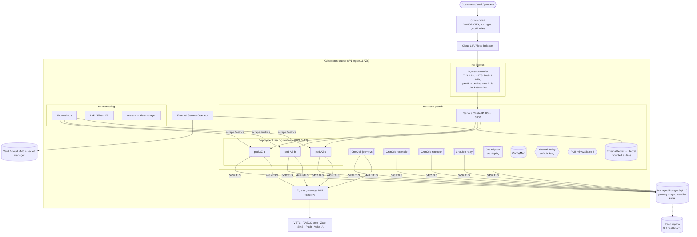
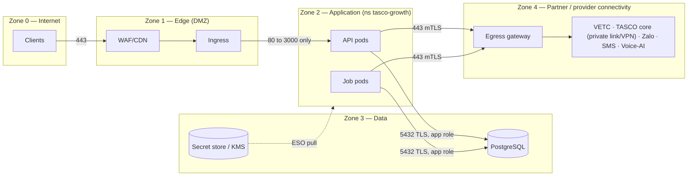
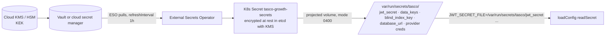
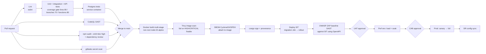
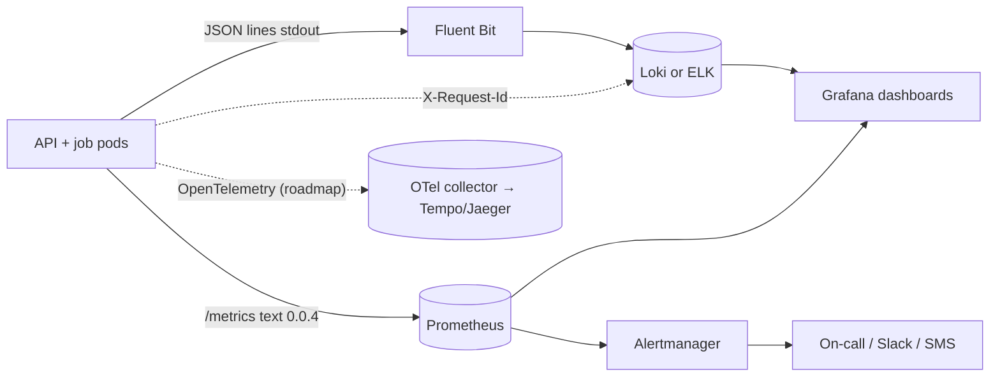

# Deployment & infrastructure architecture

> The deployment assets are `Dockerfile`, `docker-compose.yml`, `deploy/k8s/`, `railway.json` and `.github/workflows/ci.yml`. This document is the **design** those assets implement. If a value here differs from a manifest, the manifest is authoritative for what is deployed, and this document states the intent. Raise a change to bring them back in line.
> Decision record: [ADR-012](adr/ADR-012-deployment-containers-k8s.md).

## 1. Principles

1. **One immutable artefact.** The same signed image (digest-pinned) is promoted from SIT to UAT, perf, prod and DR. Only configuration differs.
2. **Twelve-factor.**
   - Configuration comes from the environment, and secrets from mounted files (`*_FILE`, `src/shared/config.js`).
   - Logs go to stdout as JSON.
   - Processes are stateless; state lives in Postgres.
   - API and jobs share one image with different commands (`node src/server.js`, `node src/jobs/cli.js <job>`).
3. **Least privilege everywhere.**
   - Containers run non-root with a read-only root filesystem, all Linux capabilities dropped and the RuntimeDefault seccomp profile.
   - Network policy is default-deny.
   - The DB uses separate owner and app roles.
4. **Fail safe.**
   - Production refuses to boot without `JWT_SECRET`, `BLIND_INDEX_KEY` and `DATA_KEYS`, or with `DEMO_MODE` on (`loadConfig`).
   - Readiness stays false until the server listens and the DB answers.
   - `SIGTERM` handling drops readiness first, then drains, then exits within 25 s (`src/server.js`).
5. **Data residency.** Production personal data is stored and processed in Vietnam (**confirm with TASCO legal**: Cybersecurity Law 2018 and Decree 53/2022/ND-CP; Decree 13/2023/ND-CP and the Law on Personal Data Protection 2025 on cross-border transfer).

## 2. Environments

| Env | Purpose | Hosting | Data | `NODE_ENV` / `DEMO_MODE` | Integrations | Promotion gate |
|---|---|---|---|---|---|---|
| **dev** | Developer laptop | `docker compose up`, or `npm run dev` with the in-memory store | Synthetic (`SEED_RECORDS`, `SEED`) | development / true | Sandbox adapters | — |
| **CI** | Pipeline tests | GitHub Actions + Postgres service container | Synthetic | test / true | Sandbox | All checks green |
| **SIT** | System integration with VETC/TASCO test systems | K8s namespace `tasco-growth-sit` | Synthetic + provider test accounts | production / **false** | Real adapters → provider sandboxes | Automatic on merge to `main` |
| **UAT** | Business acceptance, training | K8s namespace `tasco-growth-uat` | Synthetic, or masked extract with DPO approval | production / false (true only for a separate demo namespace) | Provider UAT systems | Manual approval (product owner) |
| **perf** | Load, soak and resilience tests at 6 M scale | Dedicated namespace sized like prod | Synthetic 6 M (`SEED_RECORDS=6000000` via bulk loader) | production / false | Sandbox gateways with latency/fault injection | Perf report signed off |
| **prod** | Live | K8s cluster in a Vietnam region, 3 AZs | Real personal data | production / false | Production providers | CAB approval + change window |
| **DR** | Warm standby | Second VN region / DC | Replica of prod | production / false | Production providers (failover config) | DR drill twice a year |
| **pilot** (optional) | Stakeholder demos | Railway (`railway.json`) | **Synthetic only** | production + `ALLOW_DEMO_IN_PRODUCTION=true` / true | Sandbox | Product owner |

> **Important.** `DEMO_MODE` defaults to `true` whenever `NODE_ENV ≠ production`. It enables `/api/demo/totp/:username`, which returns live TOTP codes, the `demoProfileId` customer login, and seeding. Every shared environment (SIT, UAT, perf, prod, DR) **must** run with `NODE_ENV=production` and `DEMO_MODE=false`. CI asserts this through a manifest lint.

## 3. Kubernetes topology

### 3.1 Workload specification (target values)

| Item | API Deployment | CronJob pods | Migration Job |
|---|---|---|---|
| Image | `ghcr.io/<org>/tasco-growth@sha256:…` (digest pinned) | same | same |
| Command | `node src/server.js` | `node src/jobs/cli.js <job>` | `node src/jobs/cli.js migrate` |
| Replicas | HPA min 3, max 12; CPU target 65 %. Scale-down stabilisation 300 s. | 1 per run | 1 |
| Requests / limits | 500m CPU / 512 Mi → limit 1 CPU / 1 Gi | 250m / 512 Mi → 1 CPU / 1 Gi | 100m / 256 Mi |
| Node heap | `NODE_OPTIONS=--max-old-space-size=768` (about 75 % of the limit) | same | — |
| Probes | liveness `GET /health/live` (period 10 s, failure 3); readiness `GET /health/ready` (period 5 s), which includes a DB ping; startup probe up to 60 s | — | — |
| Security context | `runAsNonRoot`, `runAsUser 10001`, `readOnlyRootFilesystem: true`, `allowPrivilegeEscalation: false`, `capabilities.drop: [ALL]`, `seccompProfile: RuntimeDefault`, `automountServiceAccountToken: false` | same | same |
| Writable paths | `emptyDir` at `/tmp` only (Node does not need it; kept for diagnostics) | same | same |
| Spread | `topologySpreadConstraints` across zones; pod anti-affinity by hostname | — | — |
| Termination | `terminationGracePeriodSeconds: 30` (the app force-exits at 25 s) | `activeDeadlineSeconds` per job | `backoffLimit: 0` |
| Env | `MIGRATE_ON_START=false` (migrations only via the Job, because `migrate()` takes no lock), `TRUST_PROXY=true`, `DATABASE_SSL=true` | same | same |

### 3.2 CronJobs

| Job | Schedule (cron in UTC; ICT = UTC+7) | What it does (`src/jobs/cli.js`) | Policy |
|---|---|---|---|
| `journeys` | `5 1-12 * * *` (08:05–19:05 ICT hourly, inside the 08:00–20:00 contact window) | `journeyService.runDue` then `events.drain()` | `concurrencyPolicy: Forbid` (runDue does not lock touchpoints; parallel runs could double-send), `startingDeadlineSeconds: 600`, `activeDeadlineSeconds: 3300` |
| `recompute` (recommended) | `30 17 * * *` (00:30 ICT) | Nightly full re-score so time-dependent facts (`days`) advance | Forbid. At 6 M, shard (see §12). |
| `reconcile` | `0 19 * * *` (02:00 ICT) | `opsService.reconcile` (orders ↔ payment ref ↔ policies; stuck `pending_payment` > 1 h) | Forbid. Alert if `mismatches > 0`. |
| `retention` | `0 20 * * *` (03:00 ICT) | `opsService.applyRetention` (deletes `source_records` > 365 d and `voice_sessions` > 180 d; other entities flagged for the archival pipeline) | Forbid |
| `relay` | `*/5 * * * *` | `events.drain()`, a safety net in addition to the 1 s in-process relay | Forbid |

Short-lived job pods are not scraped by Prometheus. Job outcomes are recorded in `job_runs` (`GET /api/ops/jobs`) and in the JSON logs (`job finished`). Alert on the Kubernetes `kube_job_status_failed` metric.

### 3.3 PDB and disruption

`PodDisruptionBudget` `minAvailable: 2` for the API, so node drains and upgrades never take the service below 2 pods. Combined with readiness gating and graceful shutdown, rolling node upgrades cause no downtime.

## 4. Network zones and Zero Trust

| Control | Implementation |
|---|---|
| Default deny | `NetworkPolicy` with empty ingress/egress in `tasco-growth`, then allow-lists: ingress from the ingress-controller namespace to port 3000; ingress from `monitoring` (Prometheus) to port 3000 for `/metrics`; egress to Postgres (CIDR/port 5432), DNS (53), and the egress gateway (443) |
| Identity per workload | Distinct ServiceAccounts for the API, each job and migrations; no token automount; DB credentials per workload type (the migrator owns the schema; the app has DML only, and `INSERT/SELECT` only on `audit_log`) |
| Never trust the network | TLS to Postgres with `rejectUnauthorized: true` (`postgresStore.js`); mTLS to providers; JWT verified on every request; the user reloaded per request (`identityService.authenticate`) |
| Admin access | No SSH to nodes. `kubectl` via SSO + MFA + just-in-time RBAC. DB break-glass via a bastion with session recording. |
| Service mesh (optional) | Istio/Linkerd mTLS between pods once more services exist. Not required for a single deployable. |

## 5. Ingress and WAF

| Control | Setting |
|---|---|
| TLS | TLS 1.2+ (prefer 1.3); modern cipher suites; certificate via cert-manager (ACME or corporate CA); HSTS is also set by the app in production |
| Forwarded headers | The ingress must **overwrite**, not append, `X-Forwarded-For` with the real client IP. The app trusts the **left-most** XFF value when `TRUST_PROXY=true` (`app.js#clientIp`). If a client-supplied XFF were preserved, an attacker could rotate fake IPs to bypass per-IP rate limits and the login limiter, and pollute audit IPs. See [security §15](security-architecture.md#15-known-gaps-and-remediation-plan). |
| Rate limiting | Edge: per-IP (e.g. 600/min), per-partner-key (contracted quota), and a stricter limit for `/api/auth/*` and `/api/customer/session`. The app's in-process limiter (`RATE_LIMIT_MAX` 300/min/IP, `RATE_LIMIT_LOGIN_MAX` 10/min/IP) is defence in depth **per replica**, so the effective limit is × replicas. |
| Body size | 1 MiB (matches `BODY_LIMIT_BYTES`) |
| Path rules | Block `/metrics` from outside the cluster. Optionally restrict `/api/openapi.json` and staff APIs (`/api/*` except `/api/customer/*`, `/api/public/*`, `/api/partner/*`, `/api/auth/*`, `/api/meta`) to TASCO/VETC corporate egress IPs or ZTNA. |
| WAF | OWASP CRS paranoia level 2 on `/api/*`, with tuned exclusions for rules payloads (`/api/rules*` carries JSON Logic); bot management on customer and public endpoints |
| Partner mTLS (target) | A separate host `partner-api.<domain>` with client certificate verification |

## 6. Database: PostgreSQL high availability

| Aspect | Design |
|---|---|
| Service | Managed PostgreSQL 16 in a VN region, or Patroni-managed on VMs/K8s operators (CloudNativePG) if no managed option meets residency |
| HA | Primary + synchronous standby in another AZ (automatic failover, about 30–60 s). Apps reconnect via the `pg` pool (failed queries surface as 5xx; idempotent retries are safe). |
| Backups / PITR | Continuous WAL archiving + daily base backups, encrypted with KMS. PITR retention 14 days in prod (35 days if the regulator requires it), plus monthly snapshots kept 12 months. **Restore drill quarterly.** |
| Read replica | Async replica for BI extracts, `/api/dashboard/*` (target: route via a second pool `DATABASE_READ_URL`) and analytics feeds |
| DR | Cross-region async replica (RPO ≤ 5 min), promoted in DR (§14) |
| Connections | The pool per process is `DB_POOL_MAX` (default 10). With 12 API pods and 5 job pods, that is up to 170 connections. Put **PgBouncer** (transaction pooling) in front: advisory **transaction** locks and `SKIP LOCKED` are compatible with transaction pooling. |
| Parameters | `statement_timeout` 15 s set by the app; `idle_in_transaction_session_timeout` 60 s; `log_min_duration_statement` 500 ms; `pg_stat_statements` enabled |
| Roles | `tasco_owner` (migrations; owns tables, triggers); `tasco_app` (SELECT/INSERT/UPDATE/DELETE on collections; **INSERT/SELECT only** on `audit_log`; no TRUNCATE; no DDL); `tasco_ro` (read replica, BI views) |
| Encryption | Storage encryption with KMS; TLS enforced (`hostssl`); PII is additionally field-encrypted by the app ([ADR-006](adr/ADR-006-field-encryption-blind-index.md)) |
| Partitioning (scale) | `messages`, `touchpoints` and `domain_events` by month ([solution §10](solution-architecture.md#10-scalability-to-6-million-vehicles)) via a new numbered migration |

## 7. Configuration

All settings come from `src/shared/config.js`. The ConfigMap holds non-secret values; secrets are mounted files.

| Variable | Default | Prod value / note |
|---|---|---|
| `NODE_ENV` | `development` | `production` |
| `PORT` | 3000 | 3000 |
| `PUBLIC_BASE_URL` | `http://localhost:3000` | `https://growth.<tasco-domain>`, used in links and certificate URLs |
| `DATABASE_URL` / `_FILE` | — (memory store) | **Secret file** |
| `DATABASE_SSL` | = production | `true` |
| `DB_POOL_MAX` | 10 | 10 (with PgBouncer) |
| `JWT_SECRET` / `_FILE` | random in dev | **Secret file**, ≥ 48 random bytes |
| `JWT_TTL_SECONDS` | 1,800 | 1,800 (900 for admin, once role-based TTL exists) |
| `MFA_REQUIRED_ROLES` | admin, rule_approver, compliance_officer, data_steward | Add `telesales_supervisor`, `partner_manager` and `support_engineer` (recommendation) |
| `BLIND_INDEX_KEY` / `_FILE` | random in dev | **Secret file**, 32 bytes base64 |
| `DATA_KEYS` / `_FILE` | random `dev` key | **Secret file**, `k1:<b64>,k2:<b64>` |
| `DATA_KEY_ACTIVE` | last key | Explicit (e.g. `k2`) |
| `CORS_ORIGINS` | empty (same-origin only) | VETC/Zalo web origins if they call cross-origin |
| `RATE_LIMIT_WINDOW_MS` / `_MAX` / `_LOGIN_MAX` | 60,000 / 300 / 10 | Keep. The edge enforces the global limits. |
| `LOCKOUT_MAX_FAILURES` / `LOCKOUT_MINUTES` | 5 / 15 | Keep |
| `BODY_LIMIT_BYTES` | 1 MiB | 1 MiB |
| `LOG_LEVEL` | debug (dev) / info (prod) | `info` |
| `DEMO_MODE` | = !production | **`false`** |
| `ALLOW_DEMO_IN_PRODUCTION` | false | false (pilot only) |
| `SEED_RECORDS`, `SEED` | 2,500, 20261007 | Unused when `DEMO_MODE=false` |
| `SIM_TODAY` | — | **Unset** (pins the business date; demos only) |
| `RULES_DIR` | `config/rules` | Default |
| `TRUST_PROXY` | = production | `true` (behind ingress) |
| `MIGRATE_ON_START` | runs if not `false` | **`false`** in K8s |

## 8. Secrets and configuration

| Secret | Rotation | Procedure |
|---|---|---|
| `DATA_KEYS` | Yearly, or on suspicion | Add `k(n+1)` → set `DATA_KEY_ACTIVE` → rolling restart → run the re-key job (planned) → remove the old key after verification ([ADR-006](adr/ADR-006-field-encryption-blind-index.md)) |
| `JWT_SECRET` | Every 90 days | Rotation invalidates all sessions and all renewal links (the link key is derived from `JWT_SECRET` in `container.js`). Schedule off-hours, or implement multi-key verification (`kid`) first. Target: IdP-signed tokens (no shared secret). |
| `BLIND_INDEX_KEY` | Only on compromise | Requires recomputing `*_bidx` columns (planned job) |
| DB credentials | 30–90 days | Dynamic DB credentials from Vault (database secrets engine) where possible |
| Provider credentials | Per provider policy | Store as files; adapters read on boot (restart to rotate) |
| Partner API keys | Partner-driven, ≤ 12 months | Issue the new key → partner switches → revoke the old one (`DELETE /api/partners/keys/:keyId`) |

The rules: no secrets in images, Git, ConfigMaps or env literals. gitleaks runs in CI (§9). `*_FILE` is the only supported mechanism in K8s.

## 9. CI/CD pipeline and promotion

| Stage | Gate (blocks promotion) |
|---|---|
| Lint, tests, coverage | Any failure; coverage below the gates (`npm run test:coverage`) |
| SAST (CodeQL) | New high/critical findings |
| Dependencies | `npm audit --omit=dev --audit-level=high`; dependency review on new packages (any new runtime dependency needs an ADR, per [ADR-002](adr/ADR-002-nodejs-minimal-dependencies.md)) |
| Secrets | Any gitleaks finding |
| Container | Trivy HIGH/CRITICAL with an available fix; image runs as root; missing SBOM |
| DAST | ZAP baseline high alerts |
| SIT smoke | `/health/ready`, login + MFA, quote → order with sandbox/provider test accounts |
| Prod | Signed image digest only (admission policy, e.g. Kyverno/Gatekeeper: `verifyImages`); CAB ticket reference |

Promotion is **GitOps** (recommended: Argo CD or Flux). The pipeline commits the new image digest to the environment overlay (`deploy/k8s/overlays/<env>` if overlays are used), and the cluster reconciles. There are no `kubectl apply` calls from CI to prod.

## 10. Release strategies

| Strategy | When | How |
|---|---|---|
| **Rolling** (default) | Backward-compatible code and config | `maxSurge: 1`, `maxUnavailable: 0`; readiness-gated; PDB protects capacity |
| **Canary** | Risky behaviour changes (journeys, purchase) | Ingress weight split (NGINX canary annotations or Argo Rollouts): 5 % → 25 % → 100 %, with automated analysis on `http_requests_total{status=~"5.."}` rate, p95 `http_request_duration_seconds`, `integration_calls_total{result="error"}` and `orders_completed_total` |
| **Blue-green** | DB-affecting releases, major upgrades | Two Deployments (`-blue`/`-green`), with the Service selector switched after smoke tests. **DB changes must be expand/contract**: (1) migration adds columns/tables (compatible with old code) → (2) deploy new code → (3) a later migration removes old structures. |

Caveats specific to this platform:

- **The outbox relay runs in every pod, including canary pods.** Old and new versions process the same event types, so handler changes must be backward compatible, or the event type must be versioned (`policy.issued.v2`).
- **CronJobs use their own image tag.** Update them in the same release, after the API rollout succeeds.
- **The rules cache TTL is 15 s, and rule sets are data, not deployments.** Rule changes go through maker-checker, not the release process.

## 11. Railway (pilot) and Docker Compose (local)

**Railway** (`railway.json`):

- Builder: Dockerfile. Start command `node src/server.js`. Health check `/health/ready`. Restart policy on failure.
- Railway Postgres plugin → `DATABASE_URL`.
- Secrets are Railway variables. `*_FILE` is not used there, so set `JWT_SECRET`, `BLIND_INDEX_KEY`, `DATA_KEYS` and `DATA_KEY_ACTIVE` directly.
- For a demo: `NODE_ENV=production`, `DEMO_MODE=true`, `ALLOW_DEMO_IN_PRODUCTION=true`.
- Single replica (the in-process limiter and revocation list are then accurate).
- Jobs run as a Railway cron service with the same image and the command `node src/jobs/cli.js journeys`.
- **Constraints:** synthetic data only; no NetworkPolicy; residency not in Vietnam; not for production personal data (**confirm with TASCO legal**).

**Docker Compose** (`docker-compose.yml`): `app` (built from the Dockerfile, port 3000, waits for a healthy DB) + `postgres:16` with a named volume. Dev secrets are in a local `.env` (never committed). `docker compose up` gives a full stack with demo data. Without Compose, `npm run dev` uses the in-memory store and needs no database.

## 12. Capacity estimates

**Assumptions** (to validate in the perf environment):

| # | Assumption |
|---|---|
| A1 | 6.0 M vehicles; 7.8 M source records (1.3 per vehicle) |
| A2 | Expiries uniform across the year: ≈ 16.4 k vehicles reach expiry per day |
| A3 | About 30 % of vehicles are in an active journey; the renewal journey has 7 steps; on average 5 sends per expiring vehicle |
| A4 | Voice bot is used for about 20 % of expiring vehicles (hot/warm + consent): ≈ 3.3 k calls/day |
| A5 | Platform conversion ≈ 15 % of expiring vehicles: ≈ 2.5 k orders/day (1.2 lines/order) |
| A6 | Staff users ≈ 300 (telesales heavy); peak customer app traffic follows push waves |
| A7 | Average stored document sizes (jsonb + row overhead): profile 3 KB, lead 3 KB, source record 1.2 KB, touchpoint 0.6 KB, message 0.8 KB, voice session 4 KB, quote 3 KB, order 1 KB, policy 1 KB, audit 0.4 KB |

**Storage (year 1, primary, excluding WAL and backups)**

| Collection | Rows | Size |
|---|---|---|
| profiles | 6 M | ≈ 18 GB + 2.5 GB indexes |
| leads | 6 M | ≈ 18 GB + 2 GB |
| source_records | 7.8 M | ≈ 9.5 GB + 1.5 GB |
| touchpoints | ≈ 7 M live + ≈ 42 M executed/yr | ≈ 30 GB/yr (purge or partition executed rows > 90 d) |
| messages | ≈ 30 M/yr | ≈ 24 GB/yr |
| voice_sessions | ≈ 1.2 M/yr (180 d retention) | ≈ 2.5 GB steady |
| quotes / orders / policies | ≈ 2.7 M / 0.9 M / 1.1 M per year | ≈ 8 + 1 + 1.1 GB/yr |
| audit_log | ≈ 18 M/yr (≈ 50 k entries/day) | ≈ 7 GB/yr |
| domain_events | ≈ 3 M/yr (purge `done` > 30 d) | < 1 GB steady |
| **Total** | | **≈ 120–130 GB in year 1 → provision 500 GB with autoscaling storage** |

**Throughput**

| Workload | Estimate | Implication |
|---|---|---|
| API (customer + staff) | Baseline 10–20 RPS; push-wave peaks about 150 RPS for 15 min | 3 pods are comfortable (each Node process handles hundreds of RPS of indexed reads). HPA to 12 gives headroom for 1,000+ RPS. |
| Logins | 300 staff around 08:00; scrypt ≈ 50 ms CPU each | Negligible; the login rate limit is 10/min/IP |
| Journey executions | ≈ 115 k touchpoint evaluations/day → ≈ 10 k per hourly run; ≈ 8 DB round-trips + 1 provider call each, sequential | ≈ 15–25 min per run with providers at 100 ms. Fits the hour, with little margin. **Required before full scale:** parallel workers claiming touchpoints with `SKIP LOCKED`, and **asynchronous voice calls** (today `autoCall` is synchronous inside `runDue`). |
| Nightly recompute | 6 M profiles × about 6 round-trips | Single-threaded about 6–10 h. Shard by `hash(id) % 8` with keyset paging to finish in about 1 h. Better: recompute only profiles whose journey window changes (`days` crossing a step offset). |
| Orders | ≈ 2.5 k/day; peak ≈ 1 order/s | Bound by wallet and core latency, not by the platform |
| Outbox | ≈ 10 k events/day | Trivial for the SKIP LOCKED relay |
| Audit appends | ≈ 50 k/day (peak ≈ 20/s) | Well within serialised append capacity (≈ 1 k/s) |

**Database sizing (prod):** primary 8 vCPU / 32 GB RAM / 500 GB SSD (≥ 6 k IOPS) + sync standby of the same size. Read replica 4 vCPU / 16 GB. Hot working set: profiles + leads + touchpoints indexes ≈ 10 GB, which fits in RAM.

## 13. Cost-aware sizing

| Env | API | Jobs | Postgres | Notes |
|---|---|---|---|---|
| dev | local | local | memory or compose | $0 |
| SIT | 2 pods (250m/512Mi) | on demand | 2 vCPU / 8 GB, single AZ, 7 d PITR | Shared cluster; scale to zero at night (KEDA/cron scaler) |
| UAT | 2 pods | on demand | 2 vCPU / 8 GB | Shared cluster |
| perf | 3–12 pods | sharded workers | 8 vCPU / 32 GB, provisioned only for test windows | Ephemeral: create, test, destroy (IaC) |
| prod | 3 pods baseline (HPA to 12) | ≈ 5 pod-hours/day | 8/32 primary + standby + 4/16 replica | Reserved/committed-use for the baseline; HPA for peaks |
| DR | 0–1 pod warm (scale on failover) | — | Async replica 4/16 | Warm standby, not active-active |

Levers:

1. Async voice and journey workers instead of bigger pods.
2. Purge or partition high-churn tables (touchpoints, messages, events) to keep the DB on a smaller tier.
3. Run BI on the read replica, not the primary.
4. Use Vietnamese cloud providers if they meet InfoSec and residency requirements; they are typically cheaper than hyperscaler list prices.
5. Per-message channel costs (`config/rules/costs.json`) dominate infrastructure costs at scale. The NBA prefers push (cheapest) over ZNS over SMS over voice over telesales.

## 14. Disaster recovery

| Target | Value |
|---|---|
| RPO | ≤ 5 min (async cross-region replication + WAL archive) |
| RTO | ≤ 1 h |
| Strategy | Warm standby: DR cluster manifests synced by GitOps with replicas = 0/1; DB replica in the DR region |

Failover runbook:

1. Declare the incident (on-call + CAB emergency).
2. Promote the DR replica.
3. Point `DATABASE_URL` (secret) to the DR primary.
4. Scale up the DR API and CronJobs.
5. Switch DNS / global load balancer.
6. Verify `/health/ready`, `/api/audit/verify` (chain intact) and the outbox backlog.
7. Notify providers if the egress IPs change (pre-register DR IPs).

Drill twice a year. The PITR restore drill is quarterly.

## 15. Observability

**Logs** (`src/shared/logger.js`):

- One JSON object per line: `{ts, level, msg, service, ...fields}`.
- PII keys are redacted (`password, secret, token, authorization, cookie, phone, altPhones, name, totpSecret, apiKey, otp, code, mfaToken, refreshToken, accessToken`).
- Errors include the message, code and stack.
- Every API request logs `{requestId, method, route, status, ms}` (health, metrics and static requests are excluded).
- Retention: 30 days hot, 1 year archive. Security events are also in the audit chain.

**Metrics** (`src/shared/metrics.js`, exposed at `/metrics`, cluster-internal only):

| Metric | Labels | Use |
|---|---|---|
| `http_request_duration_seconds` (histogram) | route, method | Latency SLO (p95) |
| `http_requests_total` | route, method, status | Error-rate SLO, 401/403/429 anomaly detection |
| `integration_calls_total` | integration, result | Provider health |
| `integration_short_circuit_total` | integration | Breaker open → page |
| `events_published_total` / `events_processed_total` | type / type, status | Outbox flow; `dead_letter` → alert |
| `messages_total` | channel, status, journey | Send volume, blocked/failed rates (copy guard, consent) |
| `quotes_total`, `orders_completed_total` | channel (, journey) | Business KPIs |
| `voice_calls_total` | outcome | Bot outcomes, opt-out rate |
| `process_resident_memory_bytes`, `process_uptime_seconds` | — | Runtime health |

Gaps:

- No `/metrics` from CronJob pods (use `job_runs` and logs, or a Pushgateway).
- No DB pool metrics.
- No event backlog gauge (available via `GET /api/ops/status`; add a gauge `outbox_pending` and `outbox_oldest_pending_seconds`).

**Alerts (SLO-based):**

| Alert | Condition | Severity |
|---|---|---|
| API availability burn | 5xx ratio > 1 % over 5 min (fast burn of the 99.9 % SLO) | Page |
| Latency | p95 > 1 s for 10 min on read routes | Ticket |
| Breaker open | `increase(integration_short_circuit_total[5m]) > 0` for wallet or core | Page |
| Dead letters | `increase(events_processed_total{status="dead_letter"}[15m]) > 0` | Page |
| Outbox lag | Oldest pending/processing event > 5 min | Page |
| Auth anomalies | `http_requests_total{route="POST /api/auth/login",status="401"}` spike; `status="423"` (lockouts) | Security |
| Reconciliation | `job.reconciliation` mismatches > 0 | Ticket (finance ops) |
| Audit chain | `/api/audit/verify` `ok=false` (synthetic probe hourly) | Security page |
| Job failure | `kube_job_status_failed > 0` | Ticket |

**Tracing:** today correlation uses `X-Request-Id`, which is accepted from the client if it matches `^[\w-]{8,64}$` and generated otherwise. It is echoed in the response and in error bodies and logged per request. Gap: it is not propagated into domain events (`correlationId` is null) or into outbound provider calls.

**OpenTelemetry roadmap:**

1. Instrument `node:http` and `pg` with OTel auto-instrumentation (adds dev/runtime dependencies, which need an ADR-002 exception).
2. Propagate W3C `traceparent` to providers and put the trace id into `domain_events.correlationId`.
3. Generate span metrics (RED) in the collector, replacing the hand-rolled histograms.
4. Tail-based sampling that keeps all error traces.
