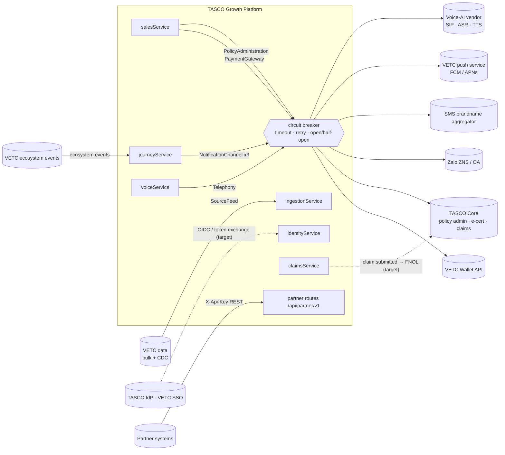
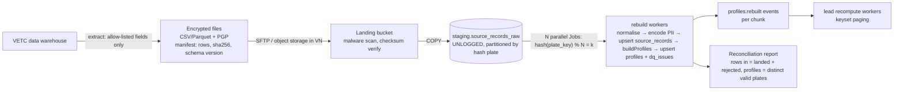

# Integration architecture

> Every external dependency sits behind a **port**: a JavaScript contract injected by the composition root (`src/bootstrap/container.js`). The platform currently ships **sandbox adapters** (`src/adapters/integrations/*`). Production adapters implement the same method signatures. This document is the contract that VETC, TASCO core, Zalo, the SMS aggregator, the voice-AI vendor and partners build against.

## 1. Integration landscape



| # | Port | Direction | Sandbox adapter (today) | Production adapter (target) | Status |
|---|---|---|---|---|---|
| 1 | PaymentGateway | Outbound | `createVetcWalletGateway` (`mockGateways.js`) | VETC Wallet REST API | Sandbox |
| 2 | PolicyAdministration | Outbound | `createTascoCoreGateway` | TASCO core policy admin / e-certificate API | Sandbox |
| 3a–c | NotificationChannel (`app_push`, `zalo_zns`, `sms`) | Outbound | `createNotificationGateway({channel})` | VETC push gateway; Zalo ZNS API; SMS brandname aggregator | Sandbox |
| 4 | Telephony / ASR / TTS | Outbound + streaming | `createSimulatedCaller` (`simulatedCaller.js`) | Voice-AI vendor (SIP trunk + Vietnamese ASR/TTS) | Sandbox |
| 5 | SourceFeed (VETC data / CDC) | Inbound | `createSyntheticVetcSource` + `POST /api/data/ingest` | VETC bulk files + CDC stream | Sandbox + API implemented |
| 6 | VETC ecosystem events | Inbound | `POST /api/ecosystem/events` (staff-authenticated) | Event stream / signed webhook | API implemented, transport target |
| 7 | IdP (staff) / VETC SSO (customer) | Inbound auth | Local users + TOTP; signed renewal link | OIDC (TASCO IdP); VETC SSO token exchange | Interim ([ADR-007](adr/ADR-007-authentication-identity.md)) |
| 8 | Partner API | Inbound | `/api/partner/v1/*` | Same, behind the API gateway (+ OAuth2 client credentials or mTLS) | Implemented |
| 9 | Claims FNOL to core | Outbound | `claim.submitted` event (no subscriber) | TASCO core claims API | Target |

## 2. Common integration policies

### 2.1 Resilience wrapper (`src/shared/resilience.js`)

Every outbound port is wrapped at composition time: `breaker(name, port, opts)` → `{ port, exec, state, name }`. Callers invoke `gateways.X.exec(() => gateways.X.port.method(...))`.

| Parameter | Default | Overrides |
|---|---|---|
| `timeoutMs` | 5,000 ms | telephony 30,000 ms |
| `retries` | 2 (3 attempts in total) | telephony 0 |
| Backoff | `100 ms × 2^(attempt-1) × U(0.5, 1.5)` (exponential + jitter) | — |
| Retryable | Errors without `status`, `status ≥ 500`, `429` | 4xx are **not** retried |
| `failureThreshold` | 5 consecutive failed `exec` calls (after their retries) → **open** | — |
| `resetMs` | 30,000 ms open → **half-open**; next success closes, failure re-opens | — |
| Short-circuit | `503 UPSTREAM_UNAVAILABLE` "circuit open" | — |
| Metrics | `integration_calls_total{integration,result}`, `integration_short_circuit_total{integration}` | — |
| Visibility | `GET /api/ops/status` → `integrations[].circuit` | — |

Requirements for production adapters, which the wrapper cannot enforce:

1. **Cancel on timeout.** `withTimeout` rejects but does not abort the underlying request. Adapters must use `AbortSignal.timeout(ms)` (`fetch`/`undici`) so sockets are released.
2. **Map errors to status.** Throw errors with `status` (e.g. `errors.upstream()` → 503, `errors.validation()` → 400) so the retry classification is correct.
3. **Idempotency on every retried mutation.** Retries are safe only when the provider deduplicates on the key the platform sends.
4. **Half-open admits concurrent calls.** The breaker does not limit half-open to a single probe, so a burst can hit a recovering provider. Production adapters with strict quotas should add a concurrency limiter (bulkhead) per provider.

### 2.2 Transport security and identity

| Concern | Standard for all outbound integrations |
|---|---|
| Transport | TLS 1.2+ (prefer 1.3). Certificate validation is on. Private connectivity (VPN / private link / leased line) to VETC and TASCO core where available. |
| Client auth | Prefer **mTLS** (TASCO core, VETC wallet). Otherwise OAuth2 client credentials with short-lived tokens. Static API keys only where the provider offers nothing else (SMS aggregators). |
| Message integrity | Inbound webhooks (VETC events, provider delivery receipts) must be HMAC-SHA256 signed with a timestamp (±5 min replay window). |
| Egress | Kubernetes NetworkPolicy egress allow-list + egress gateway / NAT with **fixed IPs**, so providers can allow-list the platform. |
| Secrets | Delivered as `*_FILE` mounts from the secret store ([deployment §8](deployment-and-infrastructure-architecture.md#8-secrets-and-configuration)); never in env literals or images. |
| Data minimisation | Send only what the provider needs (see the per-port tables). Never send OTPs or card data. The platform never handles card data. |
| Logging | Request ids are propagated (`X-Request-Id`). Payloads are not logged. The logger redacts `phone`, `name`, `token` and similar keys (`src/shared/logger.js`). |

### 2.3 Proposed SLAs (to be contracted)

| Integration | Availability | Latency p95 | Throughput needed (prod, peak) | Error budget action |
|---|---|---|---|---|
| VETC wallet debit/refund | 99.95 % | ≤ 2 s | ≤ 5 TPS (§3.1 sizing) | Breaker opens → purchase returns 503; customer retries; no partial state |
| TASCO core issue | 99.9 % | ≤ 3 s per line | ≤ 10 TPS | Compensation (refund) + reconciliation |
| Zalo ZNS | Provider SLA | ≤ 1 s accept | ≤ 50 msg/s burst (quota-bound) | Fall back to the next channel in the step's list |
| SMS brandname | Provider SLA | ≤ 1 s accept | ≤ 50 msg/s | Next channel / next run |
| App push | 99.9 % | ≤ 500 ms accept | ≤ 200 msg/s | Next channel |
| Voice-AI | 99.5 % | ASR partials ≤ 300 ms; TTS first byte ≤ 400 ms | ≤ 100 concurrent calls (pilot 20) | Touchpoint skipped, retried next run within caps |
| VETC CDC feed | 99.5 % | Freshness ≤ 15 min | ~1–2 M changes/day | Backfill from daily delta file |

## 3. Port contracts

Notation: TypeScript-style signatures for clarity; the code is JavaScript ([ADR-002](adr/ADR-002-nodejs-minimal-dependencies.md)).

### 3.1 PaymentGateway — VETC wallet

```ts
interface PaymentGateway {
  name: string;
  debit(req: { idempotencyKey: string; customerId: string; amount: number /* VND, positive integer */; description: string })
    : Promise<{ transactionId: string; status: 'captured'; amount: number; customerId: string; description: string; at: string }>;
  refund(req: { transactionId: string; amount: number })
    : Promise<{ refundId: string; transactionId: string; amount: number; status: 'refunded' }>;
}
```

| Aspect | Contract |
|---|---|
| Caller | `salesService.purchase` → `gateways.payment.exec(() => port.debit({ idempotencyKey: orderId, customerId: profileId, amount: q.total, description: 'Insurance <plate>' }))` |
| Idempotency | `idempotencyKey` = order id (`O-` + sha256(quoteId:Idempotency-Key)[0..20]). **The wallet must return the original result for a repeated key**, which the sandbox does via its `processed` map. A retry after a timeout is therefore safe. |
| Customer authorisation | **Production:** a debit must be authorised by the wallet holder through VETC's in-app confirmation (push-to-confirm / PIN / biometrics), or through a pre-authorised mandate. Staff-initiated `POST /api/orders` (telesales, `policy:issue`) must **not** be able to debit a wallet without that confirmation. The production adapter returns `pending_customer_confirmation` and completes asynchronously (webhook → outbox). This is a **design requirement not yet modelled in code**. |
| `customerId` | Today the profile id (plate key). **Production:** the VETC account id resolved via the golden record. Do not send the plate. |
| Refund | Called on issuance failure. Today it is **not** wrapped by the breaker, and failures are swallowed. **Target:** `payment.refund_requested` outbox event, retried with backoff, dead-lettered to ops, with an idempotency key `refund:<orderId>`. |
| Errors | `4xx` (insufficient balance, account blocked) → non-retryable → `order.payment_failed` and the error is surfaced to the user. `5xx` / timeout → retried twice → `503`. |
| Reconciliation | Daily wallet settlement file ↔ `orders.paymentRef` (planned extension of `opsService.reconcile`, which today checks internal consistency only). |
| Auth | mTLS + OAuth2 client credentials. Request signing if VETC requires it. |

### 3.2 PolicyAdministration — TASCO core

```ts
interface PolicyAdministration {
  name: string;
  issuePolicy(req: { product: string; plate: string; holderName: string | null; startDate: string; endDate: string;
                     premiumNet: number; vat: number; orderId: string })
    : Promise<{ policyNo: string; certNo: string; product: string; plate: string; holderName: string | null;
                startDate: string; endDate: string; premiumNet: number; vat: number; orderId: string;
                certificateUrl: string; issuedAt: string }>;
  cancelPolicy(req: { policyNo: string; reason: string }): Promise<{ policyNo: string; status: 'cancelled'; reason: string }>;
}
```

| Aspect | Contract |
|---|---|
| Caller | `salesService.purchase`, one call per quote line, inside the breaker |
| Idempotency | **Required:** the core must deduplicate on `(orderId, product)`. Today the request carries `orderId` but not a per-line key, and the breaker retries twice on 5xx or timeout. **A core without dedupe could double-issue.** The production adapter must send `Idempotency-Key: <orderId>:<product>`. |
| Data sent | Product, plate, holder name, period, premium and VAT. The full vehicle category and seat data needed for TNDS issuance should be added from the golden record (`vehicle.category`, `seats`, `usage`). Confirm the field list with TASCO core. |
| E-certificate | `certificateUrl` is a public verification URL. The sandbox uses `${PUBLIC_BASE_URL}/verify/<certNo>`, backed by `GET /api/public/certificates/:certNo` (masked plate, validity, no PII). In production, the core may host the PDF. The QR must still point to a verification page without PII. Electronic certificate legal format: **confirm with TASCO legal** (Decree 67/2023). |
| Compensation | Issuance failure triggers a refund (§3.1). Already-issued lines remain and are listed in the order (`policies[]`) for ops to cancel via `cancelPolicy` (**manual today**). **Target:** an automated saga step `policy.cancel_requested`. |
| Bordereaux / sync | Daily policy register from the core ↔ `policies` (planned reconciliation job) |

### 3.3 NotificationChannel — app push, Zalo ZNS, SMS

```ts
interface NotificationChannel {
  name: 'app_push' | 'zalo_zns' | 'sms';
  send(req: { to: string /* 'vetc-app:<profileId>' for push, else phone 0XXXXXXXXX */; text: string; templateKey: string; idempotencyKey: string })
    : Promise<{ providerMessageId: string; status: 'accepted'; to: '[set]' | null; templateKey: string; length: number }>;
}
```

| Aspect | Contract |
|---|---|
| Caller | `journeyService.sendMessage`. It is the only send path, used by scheduled touchpoints, ecosystem triggers, `renewal.link_requested` and `policy.issued` confirmations. |
| Pre-send gates | `canContact()`: reachable channel, DNC, consent per channel/marketing, 08:00–20:00 local for marketing, daily/weekly marketing caps, weekly call cap (`config/rules/contact_policy.json`). Then template render and **copy guard** (`checkCopy`). A failed guard gives `status: blocked`, which is never sent. |
| Idempotency | `idempotencyKey` = message id (a UUID per send). Map it to the provider's dedupe field (Zalo `tracking_id`; SMS aggregator client message id; push collapse id). See the [ADR-005 gap](adr/ADR-005-transactional-outbox.md) about deterministic ids for event-driven sends. |
| Fallback | A step lists channels in priority order. The first `sent` wins. A `failed` or `blocked` result tries the next channel. |
| Delivery receipts | **Target:** a signed provider webhook → `messages.status = delivered/failed` + metrics. Today the status reflects provider **acceptance** only. |
| Push | Through VETC's push service (VETC owns the app). The address is the profile/account id, never a phone. Deep link = signed renewal link (`links.renew`). |
| Zalo ZNS | See §4. **The production adapter must send `template_id + params`, not free text.** |
| SMS | Brandname "VETC" or "TASCO" registered with carriers (**confirm with TASCO legal**: Decree 91/2020/ND-CP on anti-spam; advertising SMS rules). Messages are ≤ 160 GSM-7 characters or 70 UCS-2 characters per segment. Vietnamese diacritics force UCS-2, so templates should be checked for segment count. |

### 3.4 SourceFeed — VETC data and CDC

```ts
interface SourceFeed { name: string; fetchBatch(): Promise<SourceRecord[]> }

type SourceRecord = {
  recordId: string; source: 'vetc_account' | `partner_${string}` | 'telesales_csv' | string;
  plateRaw: string; phoneRaw?: string; fullName?: string;
  tollClass?: 1|2|3|4|5|null; seatsDeclared?: number|null; usageDeclared?: 'personal'|'commercial'|null;
  ownerType?: 'individual'|'company'; tagActivatedAt?: string; firstRegisteredYear?: number;
  policy?: { insurer: string|null; certNo?: string|null; expiryDate: string; verified: boolean } | null;
  lastInspectionDate?: string|null; declaredExpiry?: string|null; partnerId?: string;
  // VETC account engagement, channel and consent attributes (consumed by domain/enrichment for source 'vetc_account'):
  appUser?: boolean; appSessions30d?: number; tollTrips30d?: number; longTripsKm90d?: number; walletBalance?: number;
  autoTopUp?: boolean; pushEnabled?: boolean; zaloLinked?: boolean; marketingConsent?: boolean; callConsent?: boolean;
  dnc?: boolean; complaints12m?: number; priorVetcInsurancePurchase?: boolean;
};
```

| Aspect | Contract |
|---|---|
| Entry points | `ingestionService.ingest(records, {actor, sourceName})` called by (a) `POST /api/data/ingest` (`data:ingest`, ≤ 5,000 records per call, field allow-list), (b) jobs and seed via `SourceFeed.fetchBatch()`, (c) partner onboarding |
| **Inconsistency to fix** | The HTTP allow-list in `routes.js` (`recordId, source, plateRaw, phoneRaw, fullName, tollClass, seatsDeclared, usageDeclared, ownerType, tagActivatedAt, policy, lastInspectionDate, declaredExpiry, partnerId, firstRegisteredYear`) **drops the engagement, channel and consent attributes** that `enrichment.buildProfiles` reads from `vetc_account` records. Profiles loaded through the API therefore have all channels except SMS/voice off and all consents `false`. Either extend the allow-list with a typed schema for these fields, or load VETC account data only through the bulk/CDC path. |
| Idempotency | `source_records` are upserted by `recordId`. Re-sending a batch is safe, and the rebuild is deterministic per plate. |
| Keys | Match key = normalised plate (`normalizePlate`). Invalid plates are landed but rejected from MDM, raising `dq_issues: invalid_plate`. |
| PII | `phoneRaw` and `fullName` are encrypted at rest by the codec. Do not send national id, address or date of birth; they are not needed. |

Data feed design for the 6 M base is in §6.

### 3.5 Telephony / ASR / TTS (voice-AI vendor)

```ts
interface Telephony {
  name: string;
  /** Drive a call: place it, stream customer ASR text turns into dialogue.turn(session, text), speak bot lines via TTS,
   *  stop when session.state === 'ended'. Returns the ended session. */
  runCall(dialogue: { turn(session, text: string): Session }, session: Session, plateDisplay: string): Promise<Session>;
}
```

| Aspect | Contract |
|---|---|
| Caller | `voiceService.autoCall` (journey step `voice_bot`, `POST /api/voice/campaign`). Breaker: 30 s timeout, **0 retries** (a retry would mean a second call to a person). |
| Production shape | The platform keeps the **dialogue policy**. The vendor provides SIP dialling, VAD, Vietnamese ASR (text + confidence) and TTS of the **exact approved lines** (`session.transcript[].text`). The integration is a streaming session (WebSocket/gRPC). Recommended: the vendor calls the platform's dialogue endpoint per turn, or the platform runs a media-less dialogue worker. The 30 s timeout must be replaced by a per-turn timeout plus an overall call cap (for example 4 min), and `runCall` becomes asynchronous: call result → webhook → `voiceService.finalize`. |
| Data sent | Phone number (to dial), bot line text. **Do not send** the plate, name or expiry to the vendor beyond what is spoken. The bot speaks `plateMasked`, never the full plate. |
| Recording | Vendor-side recordings require a DPA, in-Vietnam storage, retention ≤ 180 days (`retention.json`) and deletion on DSAR. The disclosure wording is "Cuộc gọi được ghi âm" (**confirm with TASCO legal**). |
| Caller id | The official VETC hotline / brandname number only. Customers are told to expect only that number (trust line). |
| Rate | Per-campaign concurrency limit; `maxCallAttemptsPerWeek` = 2 via the contact policy |
| Sandbox | `simulatedCaller.js`: seeded weighted personas (eager, self-serve, price shopper, skeptic, already renewed, busy, opt-out, wrong plate) for rehearsal and load tests without dialling anyone |

### 3.6 VETC ecosystem events

```ts
type EcosystemEvent = { type: 'vetc.tag_activated' | 'vetc.inspection_booked' | 'vetc.wallet_topped_up' | 'vetc.long_trip_started';
                        profileId: string /* plate key; production: VETC account id resolved to profile */; at?: string /* ISO time */ };
```

| Aspect | Contract |
|---|---|
| Today | `POST /api/ecosystem/events` with a staff bearer token holding `journeys:run`. It calls `journeyService.handleEcosystemEvent`, then drains the outbox. |
| Production transport | Option A (preferred at scale): a Kafka topic from VETC → a consumer worker in the platform (consumer group, at-least-once, commit after the handler). Option B: an HTTPS webhook with HMAC signature + timestamp, behind the gateway, a dedicated machine identity (not a staff user) and a dedicated permission `events:ingest` (to add to `rbac.json`). |
| Idempotency | Events need a unique `eventId`. Store processed ids (dedupe table, TTL 7 days). Today the handler is **not** idempotent for `send` triggers, but the contact caps limit the blast radius. |
| Semantics | Trigger rules in `config/rules/triggers.json`: `tag_activated` → re-evaluate into `new_vehicle`; `inspection_booked` → service message if `days < 60`; `wallet_topped_up` → marketing push if within ±30 days of expiry; `long_trip_started` → marketing push if lapsed 0–60 days |
| Volume | Wallet top-ups and trips can reach millions per day. **VETC should pre-filter** to vehicles in the platform's interest set (expiry window, or new tags), or the consumer drops non-matching events cheaply (trigger `when` is evaluated after a profile lookup). |

### 3.7 Identity providers

| Integration | Today | Target |
|---|---|---|
| Staff IdP | Local users; scrypt; TOTP for privileged roles; HS256 JWT 30 min (`identityService.js`) | OIDC Authorization Code + PKCE against the TASCO IdP (Azure AD / Keycloak). RS256/ES256 verified via JWKS (`iss`, `aud`, `exp`, `nbf`). Group → role mapping. MFA by IdP conditional access. SCIM or JIT provisioning for joiner-mover-leaver. |
| Customer | Signed renewal link `profileId.HMAC-SHA256(linkKey, profileId)[0..16]` → customer JWT 1 h (`container.js#links`, `/api/customer/session`) | VETC app SSO token → token exchange (RFC 8693) → platform customer token bound to the VETC account id. Links gain an expiry and a nonce. |
| Partners | API key (SHA-256 stored) | OAuth2 client credentials (scopes enforced) or mTLS at the gateway |

### 3.8 Partner API (inbound)

See §5 for the guide.

| Aspect | Contract |
|---|---|
| Base path | `/api/partner/v1` (versioned in the path) |
| Auth | `X-Api-Key: tpk_…`. Keys are issued by `POST /api/partners/:id/keys` (shown once) and revoked by `DELETE /api/partners/keys/:keyId`. The partner must be `active`. |
| Authorisation | Role `partner_api` → `partner:transact`. Ownership: orders only for the partner's own quotes, and policies/statements filtered by `partnerId`. **Key `scopes` are stored but not yet enforced** (gap). |
| Idempotency | `POST /orders` requires `Idempotency-Key` (8–100 characters, `[\w-]`) |
| Rate limits | Per-IP limit in-process (`RATE_LIMIT_MAX`/min). **Target:** per-key quotas at the API gateway. |
| Errors | `{error: {code, message, details, requestId}}`. Codes: `VALIDATION_FAILED` 400, `UNAUTHENTICATED` 401, `FORBIDDEN` 403, `NOT_FOUND` 404, `CONFLICT` 409, `BUSINESS_RULE_VIOLATION` 422, `RATE_LIMITED` 429, `UPSTREAM_UNAVAILABLE` 503 |

### 3.9 Claims FNOL → TASCO core (target)

`claimsService.submit` publishes `claim.submitted {claimId, profileId}` with an internal SLA `slaDueAt = +4 h`. There is no subscriber yet. The target subscriber calls the TASCO core claims API, using the claim id as the idempotency key, and stores the core claim number. Photos are captured by count only today. **Target:** pre-signed object storage uploads, scanned for malware, with retention per claims policy.

## 4. Zalo ZNS template governance

Zalo Notification Service (ZNS) sends **pre-approved templates** to phone numbers that are Zalo users, via the brand's Official Account. Zalo's rules (template approval, allowed content types, quality rating, quotas and pricing) change periodically. **Confirm the current policy with Zalo and TASCO legal before go-live.**


Governance rules:

1. **Single source of wording.** `content.messages` (vi primary, en for staff review) holds the canonical wording. The ZNS template submitted to Zalo must match it word for word, apart from parameter placeholders. Template keys in use: `verify_expiry, first_reminder, conquest_reminder, value_reminder, urgent_reminder, expiry_day, lapsed_notice, new_vehicle_welcome, inspection_tnds_check, cross_sell, purchase_confirmation` (`config/rules/content.messages.json`).
2. **Parameters only.** Placeholders `{{plate}}, {{expiry}}, {{days}}, {{premium}}, {{link}}, {{benefit}}, {{certNo}}` map to typed ZNS params. The link parameter must be the official domain (signed renewal link).
3. **Mapping as configuration.** Add a `channelTemplates.zalo_zns` map (`templateKey → {templateId, params[]}`) to `content.messages`, or as its own rule kind, under maker-checker. The production `zalo_zns` adapter rejects any `templateKey` without an approved mapping. Until this is built, the sandbox accepts free text, which **is not** how ZNS works.
4. **Message class.** Transactional/customer-care messages (`purchase_confirmation`, `expiry_day`, `lapsed_notice`, `verify_expiry`) are distinct from promotional ones (`value_reminder`, `cross_sell`, `conquest_reminder`). Promotional use of ZNS may be restricted or priced differently. The journey `marketing` flag drives consent and caps, and must match the Zalo template class. Classifying `lapsed_notice` and `verify_expiry` as non-marketing for vehicles **not insured with TASCO** must be **confirmed with TASCO legal**, because non-marketing messages bypass the contact window and caps (`serviceMessagesBypassCaps: true`).
5. **Change control.** A wording change means a new `content.messages` version **and** a new ZNS template. The old template stays mapped until the new one is approved, which gives atomic cut-over.
6. **Monitoring.** Delivery rate, user blocks and the ZNS quality rating per template appear on the governance dashboard (planned). Auto-suspend a template whose quality drops.

## 5. Partner API guide (summary)

The audience is banks, showrooms, agents, fleets and inspection centres. The full spec is at `/api/openapi.json` (tag *Partner API*).

| Step | Call | Notes |
|---|---|---|
| 0. Onboard | TASCO partner manager: `POST /api/partners` → `POST /api/partners/:id/keys` | The key is shown once. Store it in your vault. Rotate at least every 12 months, or immediately on staff change. |
| 1. Quote | `POST /api/partner/v1/quotes` `{plate, products:[{code, options}], holderName?, phone?, seats?, usage?, currentExpiry?, consentMarketing?}` | Unknown plates are onboarded as a new golden record (source `partner_<type>`, trust 0.5–0.65 per `enrichment.sourceTrust`). Products must be sold on the `partner_api` channel (`products.json`). |
| 2. Bind | `POST /api/partner/v1/orders` `{quoteId, holderName?}` + `Idempotency-Key` | Same key gives the same order (`idempotentReplay: true`). Quote TTL is 24 h. Payment method per partner contract (today the sandbox wallet; **production: partner collects premium and settles to TASCO, or the customer pays via a VETC link**, to be decided). |
| 3. Policies | `GET /api/partner/v1/policies?limit&offset` | Only your own sales |
| 4. Commission | `GET /api/partner/v1/statement?from&to` | Computed per line at bind time. Rate from the `commission` table, capped by `statutoryCaps` (**figures to confirm with TASCO finance/legal**). |

Example:

```http
POST /api/partner/v1/quotes HTTP/1.1
X-Api-Key: tpk_••••••••
Content-Type: application/json

{"plate":"30A-123.45","products":[{"code":"TNDS_CAR"},{"code":"PA_SEAT","options":{"seats":5,"sumInsuredPerSeat":10000000}}],"holderName":"Nguyễn Văn A","phone":"0912345678","currentExpiry":"2026-11-30"}
```

Partner data obligations (contract):

- the partner warrants a lawful basis and consent for any phone or name it submits (**confirm with TASCO legal**);
- `consentMarketing` is recorded **only if** the partner collected it;
- data submitted is used for the quote/policy and for MDM.

> **Known issues to fix before external partners go live** ([security §15](security-architecture.md#15-known-gaps-and-remediation-plan)):
> - **Information exposure.** A quote for an existing plate is rated from the golden record. Cover start = the day after the current expiry, so the response reveals the vehicle's current expiry date, even when it came from another source. Restrict partner quotes for existing profiles to partner-supplied facts, or return only the price.
> - **Data poisoning.** Partner-supplied facts merge into the golden record by trust ranking. Keep partner trust below VETC and TASCO sources (it is today), and quarantine partner phones until verified.
> - **`consentMarketing` is accepted but ignored** by the handler. Wire it through to consent with source `partner`, or remove it from the schema.

## 6. Data feed design for the 6 M-vehicle base

### 6.1 Initial load (one-off, per environment)



| Item | Design |
|---|---|
| Volume | About 6 M `vetc_account` records + about 1.8 M partner/telesales records (synthetic ratio 22 %), so about 7.8 M source records → about 6 M profiles |
| Format | Parquet (preferred) or UTF-8 CSV with a header. Schema version in the manifest. Dates are ISO `YYYY-MM-DD`. Phones and plates come **raw**: the platform normalises them, and keeping them raw preserves lineage. |
| Security | PGP-encrypted at rest in transit storage. The bucket is in Vietnam (**confirm with TASCO legal**). Least-privilege service account. Files are deleted after successful load + 7 days. |
| Throughput (estimate) | The rebuild costs about 2 writes per source record plus 1–2 per profile. With 8 workers × about 1,500 rows/s (batching upserts with multi-row `INSERT … ON CONFLICT`, planned `bulkUpsert` optimisation), 7.8 M records load in about 15–20 min. With the current row-by-row `upsert`, expect about 300–500 rows/s per worker, so about 1–1.5 h with 8 workers. |
| Validation | Row count and checksum against the manifest. Reject rate threshold: abort if > 5 % invalid plates. DQ issue summary by type. |
| Lead scoring | After the rebuild, sharded recompute with keyset paging (not `OFFSET`, which degrades at millions of rows). Touchpoints are planned for current journeys only (`catchUpDays: 2`). |

### 6.2 Steady state (delta)

| Option | When | Mechanics |
|---|---|---|
| **CDC (preferred)** | VETC can run Debezium (or equivalent) on account, tag and consent tables | Changes → Kafka topic `vetc.accounts.v1` (key = account id) → platform consumer → `ingest()` micro-batches (≤ 5,000 records or 5 s). Exactly-once is not required because ingestion is idempotent by `recordId`. |
| Daily delta file | CDC not available | Same file contract as §6.1, with `change_type` (`upsert`/`delete`). Nightly window 00:00–05:00 ICT. |
| Consent / DNC changes | Always near-real-time | Consent withdrawal must take effect before the next contact: target ≤ 15 min end to end. Dedicated topic or webhook. Platform `consentOverrides` survive rebuilds (`ingestionService.rebuild`). |
| Deletes | Account closure / DSAR at VETC | `change_type=delete` → anonymise the profile (`customerService.erase` semantics), unless a policy is active (legal retention) |

### 6.3 Outbound feeds

| Feed | Consumer | Content | Cadence |
|---|---|---|---|
| Policy register delta | TASCO core / finance | `policies` + `orders` (paymentRef, commission) | Daily + on `policy.issued` (target event) |
| Commission statements | Partners, finance | `partnerService.statement` | Monthly |
| Analytics extract | Data platform / BI | Pseudonymised, aggregated ([data §11](data-architecture.md#11-analytics-and-bi-feed)) | Daily |
| DQ feedback to VETC | VETC data office | `dq_issues` by type (invalid plate, conflicting phone, wrong person) by `recordId` | Weekly |

## 7. Integration testing

| Level | Scope | Where |
|---|---|---|
| Unit | Domain + adapters with sandbox gateways | `npm test` |
| Contract | Each port: a shared test suite run against the sandbox **and** the real adapter (SIT) for idempotency, error mapping and timeouts | Planned `test/contract/*` |
| Postgres | Store behaviour on real Postgres (SKIP LOCKED, optimistic lock, audit chain) | `npm run test:pg` (CI service container) |
| SIT | Real VETC wallet sandbox, TASCO core UAT, Zalo test OA, SMS test brandname, voice vendor test trunk | SIT environment ([deployment §2](deployment-and-infrastructure-architecture.md#2-environments)) |
| Resilience | Fault injection (`failRate` option on sandbox gateways; toxiproxy in SIT) to verify breaker behaviour and compensation | SIT / perf |
| Load | `npm run test:perf` + simulated caller personas | Perf environment |
