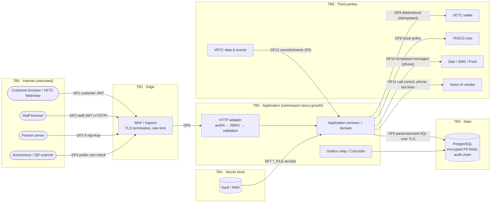
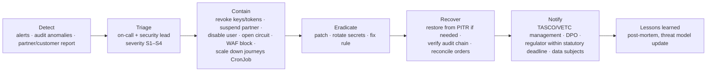

# Security architecture

> Audience: TASCO CISO / InfoSec, VETC security, penetration testers, internal audit.
> Every control cites the file that implements it. Weaknesses are listed openly in §15. Regulatory references are flagged **"confirm with TASCO legal"**.

## 1. Scope and security objectives

| Asset | Why it matters | Primary objective |
|---|---|---|
| Personal data of about 6 M vehicle owners (name, phone, plate, consent, engagement, transcripts, claims) | PDP obligations (Decree 13/2023/ND-CP; Law on Personal Data Protection 2025), trust (**confirm with TASCO legal**) | Confidentiality, lawful processing |
| Money movement (VETC wallet debit, refunds, partner commission) | Fraud and double charge | Integrity, non-repudiation |
| Regulated rules (tariffs, copy guard, commission caps, consent policy) | Mis-selling and illegal discounts (Law on Insurance Business 08/2022/QH15; confirm) | Integrity, four-eyes |
| Policies and e-certificates | Legal proof of compulsory cover | Integrity, availability |
| Audit trail | Accountability for regulators and audit | Integrity (tamper evidence) |
| Credentials and keys (JWT secret, data keys, blind-index key, partner keys, TOTP seeds) | Compromise means full breach | Confidentiality |

## 2. Trust boundaries and data-flow diagram

Each arrow that crosses a trust boundary (TB) authenticates, validates and minimises data. PII crosses into TB5 only on DF10 and DF11 (phone numbers) and DF12 (inbound).

## 3. Threat model (STRIDE)

Ratings: **H**igh / **M**edium / **L**ow residual risk after current controls. "Gap" refers to §15.

| Component | S — Spoofing | T — Tampering | R — Repudiation | I — Information disclosure | D — Denial of service | E — Elevation of privilege |
|---|---|---|---|---|---|---|
| **Edge / HTTP adapter** (`app.js`, `security.js`) | Forged `X-Forwarded-For` defeats per-IP limits (**H**, G1) | TLS at ingress; JSON-only bodies, 1 MiB cap (**L**) | `X-Request-Id` on every response and log (**L**) | Generic 500 errors with request id; no stack traces to clients (**L**) | In-process limiter is per replica (**M**, G7); `headersTimeout` 15 s, `requestTimeout` 30 s (**L**) | Route-table auth on every non-public route (**L**) |
| **Staff identity** (`identityService.js`) | Password + TOTP for privileged roles; lockout 5/15 min; timing equalisation (**M**, G2, G14) | HS256 with `alg` pinning and constant-time compare (**L**) | Logins, failures, lockouts and MFA failures audited with IP (**L**) | Error messages do not reveal whether a user exists (**L**) | Lockout can be triggered by an attacker against a known username (**M**, by design; edge rate limits) | Admin can grant itself any role and learns new users' TOTP seeds (**H**, G5, G30) |
| **Customer session** (`/api/customer/session`, `links`) | Signed links (HMAC, 96-bit truncated) (**M**: no expiry, G11) | Link HMAC over profile id (**L**) | Customer actions audited with customer actor (**L**) | Link contains the plate key in clear (**M**, G11) | `loginLimited` per IP (**M**, G1) | Customer token cannot reach staff routes (`auth: staff` check) (**L**) |
| **Partner API** (`partnerService`, `/api/partner/v1`) | SHA-256-hashed API keys; partner must be active (**M**: bearer secret, G8) | Idempotency-Key on orders (**L**) | `actor = partner:<id>` in audit (**L**) | Quote reveals the current expiry of any known plate (**M**, G8) | No per-key quota (**M**, G7) | Scopes not enforced (**M**, G8); quote/order ownership enforced (**L**) |
| **Rules engine / service** (`jsonLogic.js`, `rulesService.js`) | Approver must be MFA-protected (default `MFA_REQUIRED_ROLES`) (**L**) | Four-eyes; validation; checksum; operator allow-list; no `eval` (**L**); non-atomic activation (**L**, G16) | Every transition audited (**L**) | Rule payloads are business-confidential; `rules:read` only (**L**) | No expression size or depth limit (**L**, G16) | Any approver can approve any kind, e.g. `abac` (**M**, G16) |
| **Sales / payment** (`salesService.js`) | Customer ownership of quote checked; staff orders not customer-confirmed (**H**, G3) | Order id derived from quote + key; quote TTL (**M**: race, G4) | `order.*` audit (**L**) | Certificate check masks plate, no PII (**L**) | Breaker isolates wallet/core (**L**) | Staff `policy:issue` can debit any customer's wallet (**H**, G3) |
| **Journeys / messaging** (`journeyService.js`, `contactPolicy.js`) | Messages only from official channels and templates (**L**) | Copy guard at activation and send (**L**) | Message log per send (**L**) | Message `text` contains the plate and a link, stored in clear (**L**) | Frequency caps protect customers; `concurrencyPolicy: Forbid` (**M**, double-send risk if two runs overlap) | `journeys:run` can trigger marketing to any profile within policy (**L**) |
| **Voice bot** (`voicebot.js`, `voiceService.js`) | Customer proves plate; bot never reads data; trust line against vishing (**L**) | Script governed (maker-checker) (**L**) | `voice.call_completed` audit (**L**) | Transcript encrypted; free-text signals in clear (**M**, G13); any `voice:operate` user can read any transcript (**M**, G9) | Breaker, 0 retries (**L**) | — |
| **Persistence** (`postgresStore.js`, `codec.js`) | DB TLS with certificate verification; per-workload DB roles (infra) (**L**) | Optimistic locking; parameterised SQL; identifier allow-list (**L**) | — | Field-level AES-GCM for PII; blind index (**L**); plate in clear (**M**, ADR-006) | `statement_timeout` 15 s; `LIMIT` ≤ 5,000 (**L**) | No dynamic SQL from input (**L**) |
| **Audit log** (`auditChain.js`, migration trigger) | — | Hash chain + UPDATE/DELETE trigger (**M**: TRUNCATE / superuser, G12) | This *is* the non-repudiation control | `audit:read` only; ids only in details (IP addresses included) (**L**) | Full-chain verify on dashboard (**L**, G12) | — |
| **Outbox / jobs** (`outboxEventBus.js`, `cli.js`) | Jobs use their own ServiceAccount and DB role (infra) (**L**) | Events in DB, claimed with SKIP LOCKED (**L**) | `actor` on events; job runs recorded (**L**) | Payloads hold profile ids only (**L**) | Stuck `processing` rows; no backoff (**L**, G17) | — |
| **Outbound integrations** (`resilience.js`, gateways) | mTLS / OAuth2 to providers (target) (**M** until built) | Idempotency keys (**M**: core per-line key missing) | Provider message ids stored (**L**) | Data minimisation per port (**L**) | Timeout + retry + breaker (**L**); timeout does not abort (**L**, G19) | — |
| **SPA / static** (`public/`, `serveStatic`) | — | Strict CSP, no inline script; path-traversal guard (**L**) | — | `Cache-Control: no-store` on API responses (**L**) | Static caching (**L**) | `frame-ancestors 'none'` against clickjacking (**L**) |
| **Secrets / config** (`config.js`) | — | Secrets from files; prod refuses missing secrets or demo mode (**L**) | — | Demo endpoints leak TOTP in non-prod `NODE_ENV` (**M**, G6) | — | — |
| **Supply chain / CI** | Signed images (target) (**M**) | One runtime dependency; lockfile; SCA; SAST (**L**) | Git history, signed commits (recommended) | gitleaks (**L**) | — | Admission policy verifies signatures (target) |

## 4. Zero Trust principles

| Principle | Implementation | Status |
|---|---|---|
| Verify explicitly | JWT verified on every request; staff user reloaded on every request (`identityService.authenticate`), so disable or role change applies immediately; partner key + partner status checked per request | Implemented |
| Least privilege | 30 fine-grained permissions across 15 roles (§8); ABAC on region and ownership; PII masked unless `profile:read_pii`; DB app role without DDL/TRUNCATE (infra) | Implemented / infra |
| Assume breach | Field-level encryption (DB or backup theft yields ciphertext); hash-chained audit; NetworkPolicy default deny; short token TTL; segmented secrets (`BLIND_INDEX_KEY` ≠ data keys) | Implemented / infra |
| No implicit network trust | TLS to DB with certificate verification; mTLS to providers (target); no "internal = trusted" bypasses in code (except `/metrics`, which must be network-restricted) | Partial |
| Device and session posture | Target via IdP conditional access (managed devices for PII roles) | Planned ([ADR-007](adr/ADR-007-authentication-identity.md)) |
| Continuous monitoring | Audit + metrics + alerts (§12) | Implemented / infra |

## 5. OWASP Top 10 (2021) control mapping

| ID | Risk | Controls (file) | Residual / gaps |
|---|---|---|---|
| **A01** Broken Access Control | Deny by default: each route declares `auth` and `perm` (`routes.js`), enforced in `app.js` → `access.require`. ABAC (`accessPolicy.check`, rule kind `abac`): `regional_data`, `agent_own_handoffs`. Ownership: customer routes use `principal.customerId`, never a client id; partner order/policy/statement scoped by `partnerId`; `quote.profileId === customerId`. Staff vs customer token separation (`aud`). CORS allow-list. | Object-level ABAC missing on several staff endpoints (G9); admin self-grant (G5); staff wallet debit (G3); partner scopes (G8) |
| **A02** Cryptographic Failures | AES-256-GCM per field with random 96-bit IV and auth tag, key ids (`crypto.js`); scrypt passwords; SHA-256 API keys; HMAC blind index; TLS to DB (`rejectUnauthorized: true`); HSTS in prod; secrets ≥ 32 bytes; production refuses missing keys | KMS envelope (target); re-key job (planned); plate in clear (ADR-006) |
| **A03** Injection | Parameterised SQL only; identifiers from the registry with regex check; filter and sort columns allow-listed (`query.js`, `postgresStore.js`). JSON Logic interpreter with operator allow-list, no `eval`/`Function`, prototype keys forbidden (`jsonLogic.js`). Allow-list input validation rejects unknown fields (`validation.js`). DOM via `textContent` (ADR-011). Log injection limited (JSON encoding; request id regex). | Ingest record values only key-allow-listed (G26) |
| **A04** Insecure Design | Threat model (this doc); maker-checker; idempotent purchase; state machines (claims, handoffs, rules, dialogue); contact policy; copy guard; plate-first voice verification; compensation on issuance failure | Purchase race (G4); no customer confirmation on staff debit (G3); refund not retried (G18) |
| **A05** Security Misconfiguration | Strict security headers + CSP (`security.js`); `X-Powered-By` removed; prod fail-fast on secrets and demo mode (`config.js`); non-root read-only container; NetworkPolicy (infra); `Cache-Control: no-store` on APIs | `DEMO_MODE` default true when `NODE_ENV ≠ production` (G6); `/metrics` unauthenticated (G15) |
| **A06** Vulnerable and Outdated Components | One runtime dependency (`pg`); `npm audit --omit=dev --audit-level=high`; dependency review; Trivy; SBOM; Node 22 LTS; vendored front-end code (`public/vendor/qrcode.mjs`, reviewed) | Base image patch cadence (monthly rebuild) |
| **A07** Identification and Authentication Failures | Password ≥ 12 characters; scrypt; lockout; TOTP MFA for privileged roles; short TTL; logout revocation; MFA token audience-scoped and 5 min; timing equalisation | G1, G2, G7, G11, G14, G30 |
| **A08** Software and Data Integrity Failures | Rules validated + four-eyes + checksum; audit hash chain; outbox; lockfile; CI gates; image signing and admission verification (target) | Audit TRUNCATE path (G12) |
| **A09** Security Logging and Monitoring Failures | Hash-chained audit of auth, consent, DSAR, rules, orders, views (`profile.viewed` with `piiVisible`); JSON logs with request id and redaction; metrics and alerts (deployment §15) | SIEM forwarding and anchoring (target) |
| **A10** SSRF | No user-controlled outbound URLs. Provider endpoints come from config. Links are built from `PUBLIC_BASE_URL`. Egress NetworkPolicy allow-list (infra). | — |

## 6. OWASP ASVS L2 summary

Status: ● implemented · ◐ partial · ○ planned · ⬚ infrastructure control

| Chapter | Status | Evidence | Open items |
|---|---|---|---|
| V1 Architecture, design, threat modelling | ◐ | This document; centralised auth pipeline (`app.js`); hexagonal boundaries (ADR-001); route table as a single control point (ADR-010) | Formal threat-model review each release; security champions |
| V2 Authentication | ◐ | 2.1 length-based policy 12–128 (`checkPasswordPolicy`); 2.4 scrypt; 2.2 lockout + audit; 2.8 TOTP (RFC 6238) for privileged roles | 2.1.7 breached-password check; 2.8.4 TOTP replay (G14); MFA lockout (G2); self-service TOTP enrolment (G30); IdP federation (ADR-007) |
| V3 Session management | ◐ | Stateless JWT, 30 min TTL, `jti`; logout revocation; no cookies (no CSRF surface) | Shared revocation (G7); revoke on password change (G14); absolute and idle timeouts in the SPA |
| V4 Access control | ◐ | Deny by default; RBAC + ABAC; server-side ownership checks; PII masking by permission | Object-level checks on remaining staff routes (G9); SoD on user admin (G5) |
| V5 Validation, sanitisation, encoding | ● | Allow-list schemas with length bounds and enums; JSON-only; parameterised SQL; safe rule interpreter; DOM `textContent` | Typed schema for ingest records (G26) |
| V6 Stored cryptography | ◐ | AES-256-GCM, random IVs, key ids and rotation; scrypt; secrets from files | KMS-wrapped keys; re-key and blind-index rotation jobs |
| V7 Error handling and logging | ● | Generic errors with request id; structured JSON logs; PII redaction; audit chain | SIEM integration; log integrity outside the DB |
| V8 Data protection | ◐ | Field encryption; masking (`maskProfile`, `maskPhone`, `maskPlate`); `no-store`; DSAR export and erase; retention rules | Erasure completeness and free-text fields (G13); legal hold flag |
| V9 Communication | ⬚ | TLS at ingress (1.2+), HSTS, TLS to DB with verification | mTLS to providers |
| V10 Malicious code | ● | Minimal dependencies; SAST; SCA; secret scanning; no dynamic code execution | Subresource integrity is N/A (no CDN scripts) |
| V11 Business logic | ◐ | Maker-checker; idempotency; quote TTL; state machines; contact caps; copy guard; statutory caps | G3, G4, G16, G18 |
| V12 Files and resources | ● (N/A largely) | No file uploads today (claims capture a photo count only); static path-traversal guard; body limit | Claim photo upload: pre-signed URLs, AV scan, type checks (planned) |
| V13 API and web service | ◐ | OpenAPI generated from code; JSON content-type enforcement; schema `additionalProperties: false`; idempotency headers; partner API versioned | Per-key quotas and scopes (G7, G8); response schemas |
| V14 Configuration | ◐ | Security headers/CSP; prod fail-fast; non-root, read-only container (⬚); SBOM; secrets as files | Demo-mode defaults (G6); `/metrics` exposure (G15) |

## 7. Identity, authentication, MFA and session management

| Item | Current | Target |
|---|---|---|
| Staff login | Username + password (scrypt N=16384, r=8, p=1) → MFA step for enrolled or `MFA_REQUIRED_ROLES` (default admin, rule_approver, compliance_officer, data_steward). Users in those roles without enrolment are refused (`MFA enrolment required`). | OIDC + PKCE to the TASCO IdP; MFA via conditional access |
| MFA | TOTP SHA-1, 6 digits, 30 s, ±1 step; `mfaToken` JWT `aud=mfa`, 5 min. Failures count towards lockout. | Enforce the lock in `verifyMfa`; single-use mfaToken; replay protection; WebAuthn for admins |
| Lockout | 5 failures → 15 min; audited (`auth.login_failed`, `auth.login_locked`, `auth.mfa_failed`) | Progressive delays; alerting on spray patterns |
| Access token | HS256 JWT, `aud=staff`, `roles`, `region`, `amr`, `jti`, 30 min | RS256/ES256 from the IdP, validated via JWKS |
| Revocation | `POST /api/auth/logout` adds the `jti` to an in-memory map (per replica); a disabled user is rejected on the next request | Shared denylist (Redis) or IdP session revocation |
| Customer | Signed link → customer JWT (1 h). Demo: `demoProfileId` when `DEMO_MODE`. | VETC SSO token exchange; expiring links |
| Partner | `X-Api-Key` (SHA-256 stored), revocable | OAuth2 client credentials with enforced scopes, or mTLS |
| Recommended `MFA_REQUIRED_ROLES` | — | Add `telesales_supervisor`, `partner_manager` and `support_engineer`. Ideally MFA for all staff once the IdP is in place. |

## 8. Authorisation: RBAC and ABAC

### 8.1 RBAC matrix

Source: `config/security/rbac.json`. It is changed only through code review and CAB; it is deliberately not a business rule kind.

Role keys: ADM admin · EXE executive · CAM campaign_manager · TSA telesales_agent · TSS telesales_supervisor · RAU rule_author · RAP rule_approver · CPL compliance_officer · DST data_steward · CLM claims_handler · PTM partner_manager · AUD auditor · SUP support_engineer · CUS customer · PAPI partner_api

| Permission | ADM | EXE | CAM | TSA | TSS | RAU | RAP | CPL | DST | CLM | PTM | AUD | SUP | CUS | PAPI |
|---|:-:|:-:|:-:|:-:|:-:|:-:|:-:|:-:|:-:|:-:|:-:|:-:|:-:|:-:|:-:|
| `users:manage` | ● |  |  |  |  |  |  |  |  |  |  |  |  |  |  |
| `ops:read` | ● |  |  |  |  |  |  |  |  |  |  |  | ● |  |  |
| `ops:run_jobs` | ● |  |  |  |  |  |  |  |  |  |  |  | ● |  |  |
| `audit:read` | ● |  |  |  |  |  | ● | ● |  |  |  | ● |  |  |  |
| `rules:read` | ● |  | ● |  |  | ● | ● | ● |  |  |  | ● |  |  |  |
| `dashboard:read` | ● | ● | ● |  | ● | ● | ● | ● | ● |  | ● | ● |  |  |  |
| `leads:read` |  |  | ● | ● | ● |  |  |  | ● |  |  |  |  |  |  |
| `leads:recompute` |  |  | ● |  |  |  |  |  |  |  |  |  |  |  |  |
| `journeys:run` |  |  | ● |  |  |  |  |  |  |  |  |  |  |  |  |
| `profile:read` |  |  | ● | ● | ● |  |  | ● | ● | ● |  |  |  |  |  |
| `voice:operate` |  |  | ● | ● | ● |  |  |  |  |  |  |  |  |  |  |
| `handoff:read` |  |  | ● | ● | ● |  |  |  |  |  |  |  |  |  |  |
| `handoff:work` |  |  |  | ● | ● |  |  |  |  |  |  |  |  |  |  |
| `profile:read_pii` |  |  |  | ● | ● |  |  |  | ● |  |  |  |  |  |  |
| `quote:create` |  |  |  | ● | ● |  |  |  |  |  |  |  |  |  |  |
| `policy:issue` |  |  |  | ● | ● |  |  |  |  |  |  |  |  |  |  |
| `policy:read` |  |  |  | ● | ● |  |  |  |  | ● | ● |  |  |  |  |
| `handoff:assign` |  |  |  |  | ● |  |  |  |  |  |  |  |  |  |  |
| `rules:author` |  |  |  |  |  | ● |  |  |  |  |  |  |  |  |  |
| `rules:approve` |  |  |  |  |  |  | ● | ● |  |  |  |  |  |  |  |
| `dsar:manage` |  |  |  |  |  |  |  | ● |  |  |  |  |  |  |  |
| `dq:read` |  |  |  |  |  |  |  |  | ● |  |  |  |  |  |  |
| `dq:resolve` |  |  |  |  |  |  |  |  | ● |  |  |  |  |  |  |
| `profile:update` |  |  |  |  |  |  |  |  | ● |  |  |  |  |  |  |
| `data:ingest` |  |  |  |  |  |  |  |  | ● |  |  |  |  |  |  |
| `claims:read` |  |  |  |  |  |  |  |  |  | ● |  |  |  |  |  |
| `claims:update` |  |  |  |  |  |  |  |  |  | ● |  |  |  |  |  |
| `partners:manage` |  |  |  |  |  |  |  |  |  |  | ● |  |  |  |  |
| `customer:self` |  |  |  |  |  |  |  |  |  |  |  |  |  | ● |  |
| `partner:transact` |  |  |  |  |  |  |  |  |  |  |  |  |  |  | ● |

Segregation of duties enforced by the matrix:

- the author cannot approve (no role has both `rules:author` and `rules:approve`, and `rulesService` also blocks self-approval);
- admin has no `profile:read_pii`, `rules:author` or `rules:approve`;
- an auditor is read-only.

**But:** `users:manage` lets an admin assign any role, including to themselves (G5). `customer:self` is declared but not checked by any route; customer routes rely on `auth: 'customer'` plus `principal.customerId`.

Route → permission mapping: 73 routes (6 public, 55 staff, 8 customer, 4 partner), listed in `/api/openapi.json` under `x-permission` and `x-audience`.

### 8.2 ABAC policies (`config/rules/abac.json`, rule kind `abac`)

| Policy | Resource / actions | Applies to roles | Allow condition |
|---|---|---|---|
| `agent_own_handoffs` | handoff: read, update | telesales_agent | `resource.assignedTo == user.id` OR `resource.assignedTo == null` |
| `regional_data` | profile: read | telesales_agent, telesales_supervisor | `user.region == 'ALL'` OR `user.region == resource.region` |
| `customer_self` | customer_self: read, purchase | customer | `resource.ownerId == user.customerId` (declared; ownership is currently enforced in route code) |

How evaluation works (`accessPolicy.check`):

- ABAC runs after RBAC, only for policies whose `resource` and `action` match.
- A policy restricts a principal only if all of the principal's roles with permissions are within `appliesToRoles`. **A user who also holds any other role with permissions escapes the restriction** (G10). This is intended so supervisors are not region-locked by an agent policy, but it means role combinations must be reviewed.
- The handoff list is filtered per item. Profile reads call `check` in `GET /api/customers/:id`.

### 8.3 PII masking

`maskProfile` (`accessPolicy.js`): without `profile:read_pii`, the name becomes `N. V. An`-style initials and phones become `0912***678` (`util.maskName`, `maskPhone`), with `piiMasked: true`.

Other masking:

- message `to` is hidden without PII permission;
- handoffs carry only a masked phone;
- the voice bot speaks a masked plate (`maskPlate` → `30A-***.45`);
- the public certificate check returns a masked plate.

Every customer-360 view is audited as `profile.viewed {piiVisible}`.

## 9. Cryptography and key management

| Purpose | Algorithm / parameters | Key / secret | Rotation |
|---|---|---|---|
| PII at rest | AES-256-GCM, 12-byte random IV, 16-byte tag, `enc:v1:<kid>:…` | `DATA_KEYS` (32 bytes each), `DATA_KEY_ACTIVE` | Add a key, switch active, re-key job (planned), retire. Yearly. |
| Equality search on phone | HMAC-SHA256 (lower-cased value) | `BLIND_INDEX_KEY` (32 bytes) | On compromise only; recompute `*_bidx` |
| Staff passwords | scrypt N=2^14, r=8, p=1, 16-byte salt, 64-byte output; `timingSafeEqual` | per-user salt | Rehash on login when parameters change (planned) |
| Access, MFA and customer tokens | HMAC-SHA256 JWT (HS256 only; `alg` pinned) | `JWT_SECRET` (≥ 48 bytes) | 90 days (invalidates sessions and links); target IdP asymmetric keys |
| Renewal links | HMAC-SHA256 truncated to 16 base64url characters (96 bits) | `sha256("links:" + JWT_SECRET)` | Tied to `JWT_SECRET` (separate key recommended) |
| Partner API keys | 24 random bytes (`tpk_…`), stored as SHA-256 | — | ≤ 12 months; revoke on demand |
| TOTP | HMAC-SHA1 (RFC 6238), 160-bit seed | per user, encrypted at rest | Re-enrol on device loss |
| Audit chain | SHA-256 over canonical JSON | — | n/a; external anchoring (target) |
| Transport | TLS 1.2+ (ingress), TLS with verification to Postgres | certificates via cert-manager / provider CA | Automated |

Key custody:

- **Today:** keys are mounted as files from the secret store and live in process memory.
- **Target:** DEKs wrapped by a KMS/HSM KEK and unwrapped at boot via workload identity. KMS audit logs track key use. Keys stay in a Vietnamese region (**confirm with TASCO legal**).

## 10. Secrets management

- **Delivery:** `<NAME>_FILE` (`config.js#readSecret`) from External Secrets Operator → Vault or cloud secret manager, mounted read-only (0400). Env literals are used only on Railway pilots with synthetic data.
- **Fail-fast:** production throws at boot if `JWT_SECRET`, `BLIND_INDEX_KEY` or `DATA_KEYS` are missing, if a data key is not 32 bytes, if `DATA_KEY_ACTIVE` is unknown, or if `DEMO_MODE` is on without `ALLOW_DEMO_IN_PRODUCTION`.
- **Non-production:** missing secrets get ephemeral random values plus a startup warning (`config.warnings`). Data encrypted with an ephemeral key is unreadable after a restart. That is acceptable only with the in-memory store.
- **Hygiene:** gitleaks in CI; no secrets in images (multi-stage build, `.dockerignore`); the logger redacts `secret`, `token`, `apiKey` and `authorization` keys.

Rotation procedures are in [deployment §8](deployment-and-infrastructure-architecture.md#8-secrets-and-configuration).

## 11. Input validation, data access and PII handling

- **Validation** (`src/shared/validation.js`):
  - allow-list per route;
  - unknown properties are rejected (this also neutralises `__proto__` keys);
  - strings are bounded (default max 1,000);
  - enums, patterns (ids `^[A-Za-z0-9_\-:@.]+$`), integer ranges and ISO dates are checked;
  - arrays are length-bounded.

  Bodies must be JSON objects ≤ 1 MiB with `Content-Type: application/json` (`app.js#readBody`). Free-form `object` fields (rule payloads) go through the per-kind validator instead.
- **Domain normalisation:** plates and phones are normalised and validated before use (`identity.js`). Customer utterances are capped at 500 characters in transcripts and 200 in signals.
- **Data access:** only `$n`-parameterised statements. No string-built SQL from input. `LIMIT` ≤ 5,000, offsets ≥ 0.
- **Output:** JSON with `Cache-Control: no-store`. The SPA renders with `textContent`.
- **PII handling rules:**
  1. Collect the minimum (the ingest allow-list excludes national id, address and date of birth).
  2. Encrypt Restricted fields ([data §4](data-architecture.md#4-data-classification)).
  3. Mask by default.
  4. Keep PII out of audit details and logs.
  5. Retention by rule.
  6. DSAR export and erase (`/api/dsar/*`, `/api/customer/data-export`).
  7. Disclose AI use (voice bot) ([AI governance](ai-governance.md)).

## 12. Security logging, monitoring and audit

**Audit events** (hash-chained, `auditService.record`):

- **Auth:** `auth.login`, `auth.login_failed`, `auth.login_locked`, `auth.mfa_failed`, `auth.password_changed`
- **Users and partners:** `user.created`, `user.updated`, `partner.created`, `partner.status_changed`, `partner.api_key_issued`, `partner.api_key_revoked`
- **Rules:** `rules.seeded`, `rules.draft_created`, `rules.submitted`, `rules.approved`, `rules.rejected`
- **Data:** `data.ingested`, `profile.viewed`, `profile.expiry_corrected`, `customer.expiry_declared`, `consent.updated`, `consent.withdrawn`, `dsar.access_exported`, `dsar.erased`, `dq.resolved`
- **Commerce:** `quote.created`, `order.completed`, `order.payment_failed`, `order.issuance_failed`, `claim.submitted`, `claim.status_changed`
- **Engagement and jobs:** `voice.call_completed`, `handoff.updated`, `journeys.run`, `ecosystem.event_handled`, `leads.recomputed`, `job.*`

**Security monitoring** (alert rules in [deployment §15](deployment-and-infrastructure-architecture.md#15-observability)):

- login failure and lockout spikes;
- 401/403/429 anomalies per route;
- partner key misuse (403s and 429s per partner);
- a failed audit-chain probe;
- DSAR erase volume;
- off-hours rule approvals;
- `users:manage` actions (always notify the security mailbox);
- a breaker open on payment.

**SIEM (target):** forward JSON logs and a periodic export of the audit log, plus the hourly chain-head anchor, to the TASCO SIEM and WORM storage.

## 13. Secure SDLC: scanning in CI

Pipeline: `.github/workflows/ci.yml`, see [deployment §9](deployment-and-infrastructure-architecture.md#9-cicd-pipeline-and-promotion).

| Control | Tool | Gate |
|---|---|---|
| Lint (incl. `no-eval`-style rules) | ESLint 9 | Errors fail |
| Unit, integration, API, security tests + coverage | `node --test` (`test:coverage` gates 80/70/80), `test:security` | Failures fail |
| Postgres behaviour | `test:pg` against a Postgres service | Failures fail |
| SAST | GitHub CodeQL (javascript) | New high/critical |
| SCA | `npm audit --omit=dev --audit-level=high`; dependency-review action | High+ |
| Secrets | gitleaks | Any finding |
| Container | Trivy (OS + npm) | HIGH/CRITICAL with a fix |
| DAST | OWASP ZAP baseline against SIT (spec-driven via `/api/openapi.json`) | High alerts |
| SBOM | CycloneDX/SPDX attached to the image | Must exist |
| Review | CODEOWNERS: `src/shared/crypto.js`, `src/adapters/http/*`, `config/security/*`, `db/migrations/*` need a security reviewer | Required approval |

## 14. Penetration-test readiness checklist

- [ ] Test environment = SIT/UAT with `NODE_ENV=production`, `DEMO_MODE=false`, real TLS, behind the production-like ingress/WAF (with a WAF bypass list for the tester's IPs, to test the app itself)
- [ ] Test accounts for **every role** (15), MFA-enrolled where required, plus 2 partners (active + suspended) with keys, and customer links for 3 profiles in different regions
- [ ] OpenAPI spec exported (`npm run job -- openapi`) and shared; route permission matrix (§8) shared
- [ ] Synthetic dataset loaded (≥ 50 k profiles) with known PII markers to detect leakage
- [ ] Sandbox gateways configured with fault injection (`failRate`) for business-logic tests (compensation, idempotency)
- [ ] In-scope focus list: auth/MFA (G1, G2, G14, G30), object-level access (G9), purchase race and idempotency (G3, G4), partner API (G8), rules engine injection and maker-checker bypass, customer link forgery and replay (G11), audit-chain tampering (G12), CSP/XSS in the SPA, DSAR completeness (G13)
- [ ] Out of scope / provider-owned: VETC wallet, TASCO core, Zalo, telco
- [ ] Logging verified: testers' actions appear in the audit chain and logs with request ids; SOC informed of the test window
- [ ] Rollback and data reset plan (`store.reset()` only in test environments)
- [ ] Known-issue list (§15) shared up front, so testing time goes to unknowns

## 15. Known gaps and remediation plan

| ID | Severity | Finding (file) | Remediation | Phase |
|---|---|---|---|---|
| G1 | High | `clientIp()` trusts the **left-most** `X-Forwarded-For` when `TRUST_PROXY=true` (`app.js`). Clients can spoof IPs to bypass per-IP and login rate limits and to falsify audit IPs. | Take the right-most untrusted hop (configure the number of trusted proxies); ingress overwrites XFF; edge rate limits | Before prod |
| G2 | High | `verifyMfa` does not check `lockedUntil` (`identityService.js`), so TOTP guessing continues during lockout while `mfaToken` is valid (5 min) | Check the lock; single-use mfaToken (nonce); per-user MFA attempt cap (e.g. 5) | Before prod |
| G3 | High | Staff `POST /api/orders` (`policy:issue`) debits the customer's VETC wallet with no customer confirmation (`salesService.purchase`) | The production wallet adapter requires in-app customer authorisation (async confirm), or staff orders generate a payment link instead of a debit | Before prod |
| G4 | High | Concurrent purchases of the same quote with different Idempotency-Keys can both pass `status === 'open'`, leading to a double debit (`salesService.purchase`) | Atomic `UPDATE quotes SET status='converting' WHERE id=$1 AND status='open'` in a transaction with the order insert; unique index on `orders(quoteId)` for completed or pending orders | Before prod |
| G5 | High | `users:manage` can assign any role, including to self (only removing one's own admin is blocked) (`identityService.update`, `createUser`). This contradicts the SoD statement in `rbac.json`. | Forbid self role changes; maker-checker (second admin or security approval) for privileged role grants; alert on every grant | Before prod |
| G30 | High | `createUser` returns the new user's **TOTP secret** to the creating admin, who also sets the initial password, so the admin can fully impersonate the new user (e.g. a rule approver) | Force a password change at first login; user self-enrols TOTP (QR shown only to the user); later IdP federation | Before prod |
| G6 | Medium | `DEMO_MODE` defaults to true when `NODE_ENV ≠ production`. It exposes `/api/demo/totp/:username` (live TOTP codes), `demoProfileId` customer login and `/api/meta` demo plates. | Default `DEMO_MODE=false` unless explicitly set; CI manifest lint; network-restrict demo environments | Before SIT |
| G7 | Medium | Rate limiter and token revocation are in-process, per replica (`security.js`, `identityService.revoked`) | Edge/gateway rate limiting; Redis-backed limiter and denylist; per-partner quotas | Phase 2 |
| G8 | Medium | Partner API: key `scopes` not enforced; quotes for existing plates reveal the current expiry (cover start); partner facts can influence the golden record; `consentMarketing` ignored | Enforce scopes per route; partner quotes use partner-supplied facts only; quarantine partner contact data; wire or remove consent | Before partner go-live |
| G9 | Medium | Missing object-level checks: `GET /api/customers/:id/lineage`, `PATCH /api/customers/:id/expiry`, `POST /api/quotes` (any profile, any region), `GET /api/policies`, `GET/POST /api/voice/sessions/:id` (any transcript), `POST /api/rules/simulate` | Apply `access.check(principal, action, {type, region, …})` consistently; add a declarative `abac` field in the route table | Phase 2 |
| G10 | Medium | ABAC policies are skipped for users holding any additional role outside `appliesToRoles` (`accessPolicy.check`) | Make the escape explicit per policy (`exemptRoles`) instead of implicit | Phase 2 |
| G11 | Medium | Renewal links never expire, are deterministic per profile, embed the plate key, and use a key derived from `JWT_SECRET`; customer tokens are not revoked on erase | Links with `exp` + nonce + pseudonymous id; separate `LINK_KEY`; check `anonymised` on customer authentication | Phase 2 |
| G12 | Medium | Audit: `TRUNCATE` bypasses the row trigger (`reset()` uses it); a superuser can rewrite the whole chain; full-chain `verify()` on every governance dashboard call; audit write not in the business transaction | DB role separation (no TRUNCATE/DDL for the app role); statement-level TRUNCATE trigger; hourly external anchoring; incremental verification; transactional audit | Before prod (roles) / Phase 2 |
| G13 | Medium | Free-text speech in clear: `voice_sessions.signals.competitorInfo`/`expiryStatement`, `profiles.policy.competitorNote`; erasure misses handoffs and these fields; DSAR export omits handoffs, quotes, orders and claims | Encrypt (add to `pii`) or store structured values only; extend erase and export | Phase 2 |
| G14 | Low | TOTP replay within ±30 s; password change does not invalidate tokens; one HS256 secret for all audiences | `lastTotpStep`; `tokenVersion`; IdP asymmetric tokens | Phase 2 |
| G15 | Low | `/metrics` unauthenticated on the app port | NetworkPolicy + ingress block (infra); optional bearer token for scrape | Before prod (infra) |
| G16 | Low | Rule activation not atomic (two active versions possible); commission cap validator uses string matching and skips rows without a product condition; no per-kind approver roles; no expression size limit | Transaction + partial unique index; evaluate each row against each capped product; `approverRoles` per kind; node-count limit | Phase 2 |
| G17 | Low | Outbox: stuck `processing` rows after a crash; no backoff; event-driven sends not deduplicated | Lease + reaper; `next_attempt_at`; deterministic message ids | Phase 2 |
| G18 | Low | Refund on issuance failure bypasses the breaker and swallows errors | Refund via outbox with retries, DLQ and alert | Before prod |
| G19 | Low | `withTimeout` does not abort the underlying request | `AbortSignal` in real adapters | With real adapters |
| G21 | Low | `migrate()` has no advisory lock; `MIGRATE_ON_START` defaults on | `pg_advisory_lock` in `migrate()`; set `MIGRATE_ON_START=false` in K8s | Before prod |
| G23 | Low | Malformed percent-encoding in a path parameter makes `decodeURIComponent` throw in `router.match` → logged as an unhandled 500 | Catch and return 400 | Phase 2 |
| G26 | Low | `POST /api/data/ingest` allow-lists record keys but not value types or lengths | Typed record schema | Phase 2 |

## 16. Security incident response outline

| Step | Platform-specific actions |
|---|---|
| Contain | Revoke partner keys (`DELETE /api/partners/keys/:keyId`), suspend partners (`PATCH /api/partners/:id`), disable users (`PATCH /api/users/:id {status: disabled}`, effective on the next request). Suspend journeys by setting the CronJob to `suspend: true`. Rotate `JWT_SECRET` to kill all sessions and links. Roll back a rule set (`/api/rules/:id/rollback` → approve). |
| Investigate | `GET /api/audit?actor=…&action=…`; `/api/audit/verify` (integrity); request-id correlation across logs; `messages` and `voice_sessions` for customer impact |
| Personal data breach | Assess scope via the audit trail (`profile.viewed` with `piiVisible`, `dsar.*`). Notify the competent authority (Ministry of Public Security / A05) within **72 hours** of discovery, per Decree 13/2023/ND-CP (and the PDP Law 2025 implementing rules), and notify affected data subjects where required (**confirm deadlines and channel with TASCO legal**). |
| Evidence | Preserve the audit-chain head hash, logs (WORM), DB snapshot and K8s events. Keep a chain of custody. |
| Communication | A pre-approved holding statement for customers emphasising "VETC never asks for OTP or payment by phone" (vishing incidents) |
