# Solution architecture

> Scope: the TASCO Growth Platform codebase (`/src`, `/config`, `/db`). Companion documents: [integration](integration-architecture.md), [deployment](deployment-and-infrastructure-architecture.md), [data](data-architecture.md), [security](security-architecture.md), [AI governance](ai-governance.md), [ADRs](adr/).

## 1. Business context in one paragraph

VETC runs electronic toll collection for about 6 million vehicles. Its records hold a plate, a phone number and engagement signals for every vehicle. Only about 1 in 10 records has a verified motor insurance certificate (`src/adapters/integrations/syntheticVetcSource.js` reproduces this). TASCO Insurance wants to:

- win **new business**, meaning uninsured, lapsed and newly registered vehicles;
- **retain** its own TNDS (compulsory third-party liability) customers;
- work **with** the partners (banks, showrooms, agents, fleets, inspection centres) who close most TNDS sales today, not against them;
- give customers a trustworthy digital experience, including claims FNOL.

The TNDS premium is set by regulation (`config/rules/tariff.tnds_car.json`, Decree 67/2023/ND-CP; **confirm with TASCO legal**). Price therefore cannot be the lever. The platform competes on four things instead: **data, timing, channel and service value**.

## 2. Architecture principles

| # | Principle | How the code enforces it |
|---|---|---|
| P1 | **Domain at the centre, adapters at the edge** (hexagonal) | `src/domain/*` imports only `src/shared/*` and `src/rules/*`. Adapters are chosen only in `src/bootstrap/container.js`. See [ADR-001](adr/ADR-001-hexagonal-architecture.md). |
| P2 | **Business rules are data, not code** | 20 rule kinds in `config/rules/*.json`, evaluated by a safe JSON Logic subset (`src/rules/jsonLogic.js`). Changes go through maker-checker (`src/application/rulesService.js`). See [ADR-003](adr/ADR-003-rules-engine-maker-checker.md). |
| P3 | **Secure by default, deny by default** | Every route declares `auth`/`perm`/schemas (`src/adapters/http/routes.js`). Validation rejects unknown fields (`src/shared/validation.js`). PII is encrypted per field (`codec.js`). Production refuses to boot without secrets (`src/shared/config.js`). |
| P4 | **Explainability over black boxes** | The lead score is a weighted sum of named factors with reason strings (`src/domain/leads.js#score`). Each NBA result carries a `ruleId`. Golden-record fields carry lineage and confidence (`src/domain/enrichment.js`). |
| P5 | **Consent and trust first** | Every outbound touch passes `canContact()` (`src/domain/contactPolicy.js`) and the copy guard. The voice bot discloses that it is automated and verifies the plate first (`src/domain/voicebot.js`). |
| P6 | **Idempotent, at-least-once integration** | Orders use idempotency keys (`salesService.purchase`). Outbound calls are wrapped in timeout + retry + circuit breaker (`src/shared/resilience.js`). Event handlers are named and tracked per event (`outboxEventBus.js`). |
| P7 | **Minimal supply chain** | One runtime dependency (`pg`). Crypto, HTTP, routing, metrics and validation come from `node:*` built-ins. See [ADR-002](adr/ADR-002-nodejs-minimal-dependencies.md). |
| P8 | **Twelve-factor, stateless processes** | Config comes from env or `*_FILE`. Logs are JSON on stdout. State lives in Postgres. Shutdown is graceful (`src/server.js`). |
| P9 | **Same behaviour in every environment** | The in-memory and Postgres stores share `codec.js`, `query.js` and `auditChain.js`, so encryption, filtering and audit chaining behave the same ([ADR-004](adr/ADR-004-persistence.md)). |
| P10 | **Tamper-evident accountability** | A hash-chained `audit_log` with a database trigger that blocks UPDATE and DELETE (`db/migrations/001_init.sql`, [ADR-008](adr/ADR-008-hash-chained-audit.md)). |

## 3. C4 Level 1 — System context

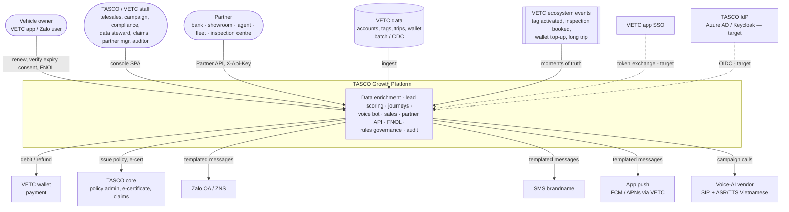

## 4. C4 Level 2 — Containers

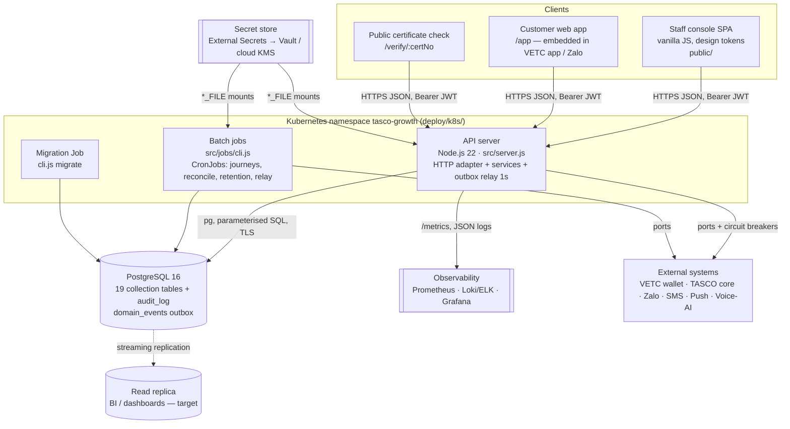

| Container | Technology | Responsibility | Scaling |
|---|---|---|---|
| API server | Node.js 22, `node:http`, `src/server.js` | All synchronous APIs, static SPA, `/health/*`, `/metrics`, `/api/openapi.json`; background outbox relay every 1 s | Horizontal (stateless). HPA on CPU. The outbox relay is safe on N replicas (`FOR UPDATE SKIP LOCKED`). |
| Batch jobs | Same image, `node src/jobs/cli.js <job>` | `journeys`, `recompute`, `reconcile`, `retention`, `relay`, `migrate`, `seed`, `rules`, `openapi` | One pod per CronJob run. Use `concurrencyPolicy: Forbid` (see the deployment document). |
| PostgreSQL | Managed PostgreSQL 16 | System of record, outbox, audit chain | Vertical, plus a read replica. Partitioning at scale (§10). |
| SPA | Static files in `public/` served by the API | Staff console, customer app, certificate verification | CDN-cacheable `/assets/*` (`Cache-Control: max-age=86400`) |

## 5. C4 Level 3 — Components (API server)

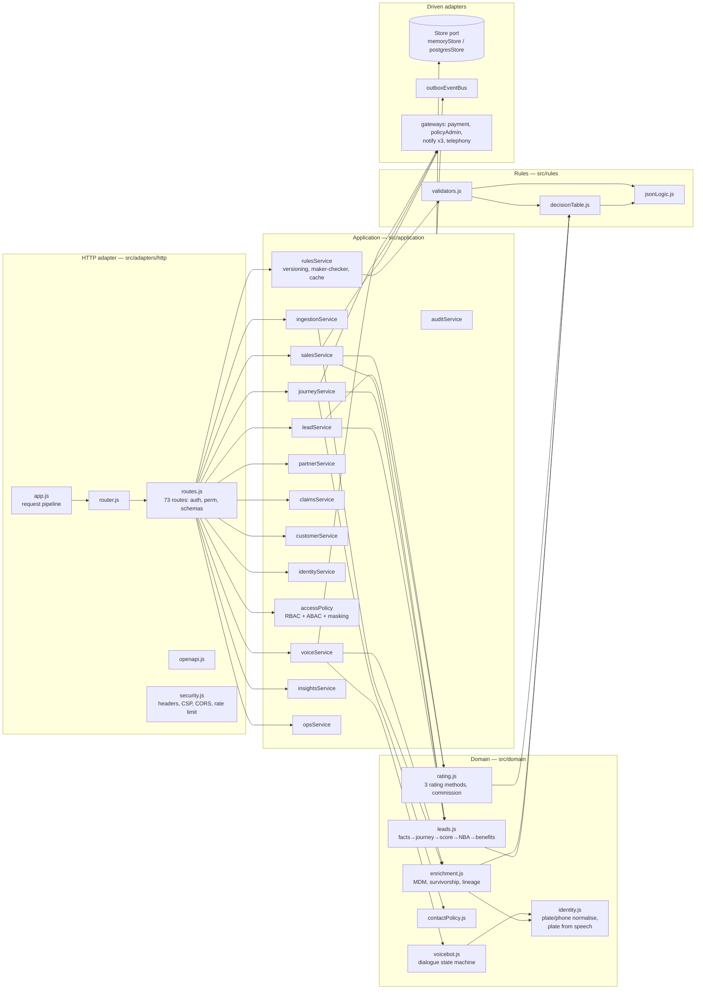

## 6. Hexagonal layering and the dependency rule

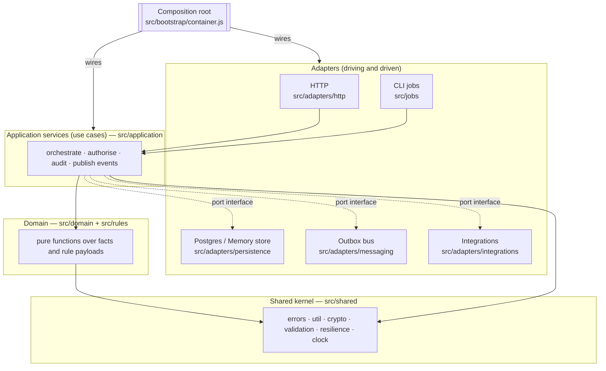

**Dependency rule.** Source dependencies point inward only:

1. `src/domain/*` and `src/rules/*` depend only on `src/shared/*`. They do no I/O and read no clock (`today` is passed in), so they can be unit-tested deterministically.
2. `src/application/*` depends on the domain, plus **ports** injected through the factory arguments `{ store, rules, audit, events, clock, logger, metrics, gateways }`. It never `require`s an adapter.
3. Adapters depend on application/domain types. Only `src/bootstrap/container.js` knows which adapter implements which port. For example, `createPostgresStore` is chosen when `DATABASE_URL` is set, and `createMemoryStore` otherwise.

**Ports (implicit interfaces, JS + JSDoc; [ADR-002](adr/ADR-002-nodejs-minimal-dependencies.md))**

| Port | Methods | Adapters |
|---|---|---|
| Store / Collection | `get, insert, update (optimistic version), upsert, bulkUpsert, find({where, orderBy, limit, offset}), count, countBy, delete, deleteWhere, raw` | `memoryStore.js`, `postgresStore.js` |
| Store extras | `transaction(fn)`, `claimEvents(limit)`, `migrate()`, `ping()`, `close()`, `audit.{append,list,verify,count}` | same |
| EventBus | `publish(type, payload, {actor, correlationId})`, `subscribe(type, name, fn)`, `relay(limit)`, `drain()` | `outboxEventBus.js` |
| PaymentGateway | `debit({idempotencyKey, customerId, amount, description})`, `refund({transactionId, amount})` | `createVetcWalletGateway` (sandbox) |
| PolicyAdministration | `issuePolicy({...})`, `cancelPolicy({policyNo, reason})` | `createTascoCoreGateway` (sandbox) |
| NotificationChannel | `send({to, text, templateKey, idempotencyKey})` | `createNotificationGateway({channel})` ×3 (sandbox) |
| Telephony | `runCall(dialogue, session, plateDisplay)` | `createSimulatedCaller` (sandbox) |
| SourceFeed | `fetchBatch()` | `createSyntheticVetcSource` (sandbox) |
| RulesProvider | `get(kind)`, `getRecord(kind)` | `rulesService.js` |

Full contracts are in [integration-architecture.md](integration-architecture.md).

## 7. Key flows

### 7.1 Ingest → golden record → score → journey

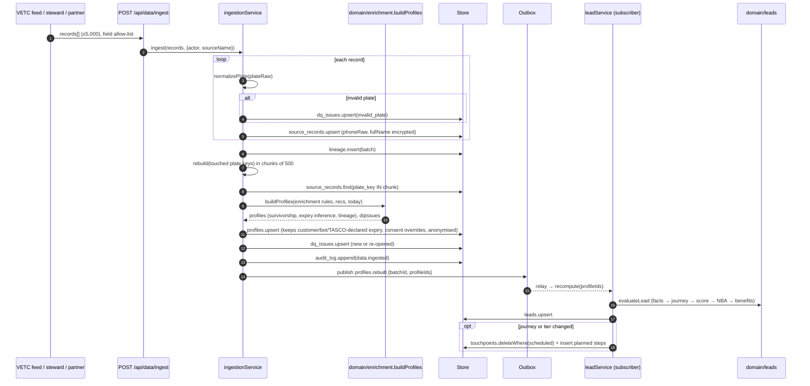

Notes. The rebuild is **incremental by plate**: only the plates in the batch are rebuilt. Facts captured on the platform (`customer_declared`, `voice_bot`, `tasco_issued`) survive a rebuild when they have higher confidence (`ingestionService.rebuild`). A vehicle with an active TASCO TNDS policy gets NBA `insured`, and its journey is cleared (`leadService.recomputeOne`).

### 7.2 Voice bot call → handoff

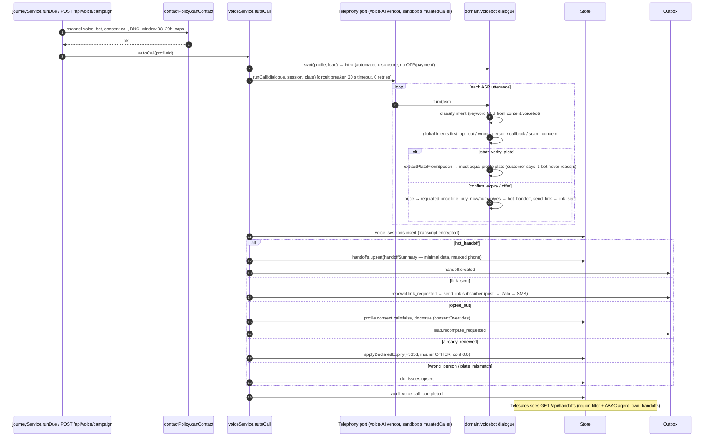

### 7.3 Quote → pay → issue → e-certificate (idempotency and compensation)

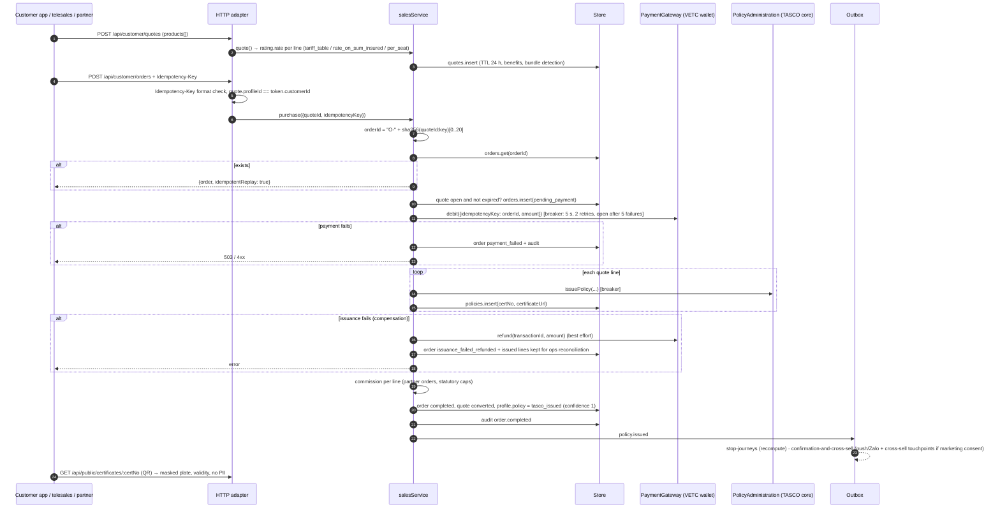

The design is idempotent at three levels:

1. **Order id** is derived from `(quoteId, Idempotency-Key)`. A replayed request returns the stored order.
2. The **payment idempotency key** is the order id. The wallet adapter must deduplicate on it; the sandbox does (`processed` map).
3. The **message idempotency key** is the message id.

Compensation is **refund, then flag**. Lines that were already issued stay in place, and `opsService.reconcile` reports them.

> Known gaps (tracked in [security-architecture.md §15](security-architecture.md#15-known-gaps-and-remediation-plan)):
> - Two concurrent purchases of the **same quote** with **different** idempotency keys can both pass the `status === 'open'` check, because the check and the write are not atomic.
> - The `refund()` call is not wrapped in the circuit breaker, and its failure is swallowed (`.catch(() => {})`) with no outbox retry.
>
> Target design: a conditional update `UPDATE quotes SET status='converting' WHERE id=$1 AND status='open'`, done in the same transaction as the order insert, plus a `payment.refund_requested` outbox event with retries and a dead letter.

### 7.4 Partner API new-business onboarding

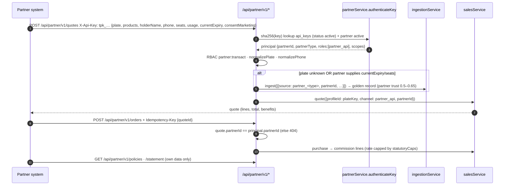

### 7.5 Rule change with maker-checker

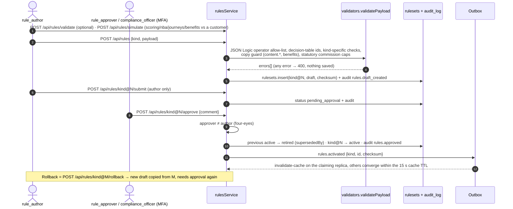

### 7.6 Ecosystem event trigger (moment of truth)

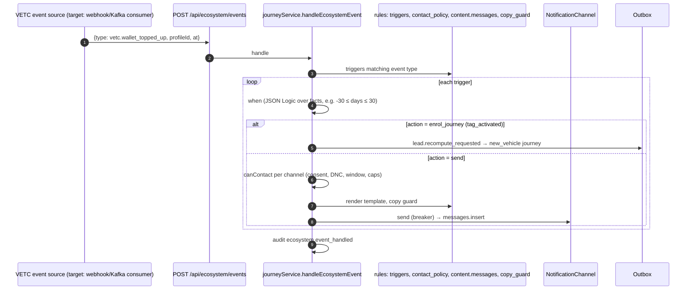

Today the ecosystem event endpoint is a staff-authenticated API (`perm: journeys:run`). The production source is a VETC event stream; see [integration-architecture.md §3.6](integration-architecture.md#36-vetc-ecosystem-events).

## 8. Event-driven design

The platform uses domain events for **reactions that must not block the caller**: re-scoring, sending confirmations, cache invalidation. It uses them for **integration fan-out** later.

The current implementation (`src/adapters/messaging/outboxEventBus.js`, [ADR-005](adr/ADR-005-transactional-outbox.md)) works as follows:

- `publish()` inserts into the `domain_events` table with `status = 'pending'`.
- `relay()` claims a batch with `UPDATE … WHERE id IN (SELECT … FOR UPDATE SKIP LOCKED)` (`postgresStore.claimEvents`).
- Each subscriber is a named handler. Handlers that succeed are recorded in `evt.handled`, so on a retry only the failed handlers run again.
- After 5 attempts the event moves to `dead_letter`.
- Delivery is **at-least-once**, so handlers must be idempotent.
- The relay runs every 1 s in each API replica (`src/server.js`), as the `relay` CronJob, and synchronously via `events.drain()` at the end of interactive requests that need read-your-writes (for example `POST /api/orders`).

### 8.1 Event catalogue

| Event | Producer (file) | Payload | Subscribers (`src/bootstrap/container.js`) | Idempotency of handler |
|---|---|---|---|---|
| `profiles.rebuilt` | `ingestionService.ingest` | `{batchId, profileIds[]}` | `recompute-leads` → `leadService.recompute(ids)` | Recompute is a pure function of current state; upserts by profile id |
| `lead.recompute_requested` | `journeyService.handleEcosystemEvent` (`enrol_journey`), `voiceService.finalize` (opt-out, already-renewed), `customerService.declareExpiry/updateConsent` | `{profileIds[], reason}` | `recompute-leads` | Same as above |
| `policy.issued` | `salesService.purchase` | `{orderId, profileId, policies[{id, product, endDate}], channel, journey}` | `stop-journeys` (recompute → NBA `insured`, deletes scheduled touchpoints), `confirmation-and-cross-sell` (service message on push/Zalo; cross-sell touchpoints with deterministic ids if marketing consent) | Touchpoint ids are deterministic (`profile:cross_sell:step:due`). **The confirmation message is not deduplicated on replay** (new message id each time). See the gap list. |
| `renewal.link_requested` | `voiceService.finalize` (`link_sent`) | `{profileId, journey}` | `send-link` (push → Zalo → SMS, non-marketing, first `sent` wins) | Not deduplicated on replay (same caveat) |
| `handoff.created` | `voiceService.finalize` (`hot_handoff`) | `{handoffId, profileId}` | none today. Target: CTI / dialler queue, supervisor alert | n/a |
| `claim.submitted` | `claimsService.submit` | `{claimId, profileId}` | none today. Target: TASCO core claims FNOL API, SLA timer (`slaDueAt` = +4 h) | n/a |
| `rules.activated` | `rulesService.approve` | `{kind, id, checksum}` | `invalidate-cache` | Naturally idempotent |

Events carry `id`, `type`, `actor`, `correlationId` (nullable today; target: the HTTP `X-Request-Id`), `occurredAt`, `status`, `attempts`, `handled[]`, `lastError`, `processedAt`.

### 8.2 Event lifecycle

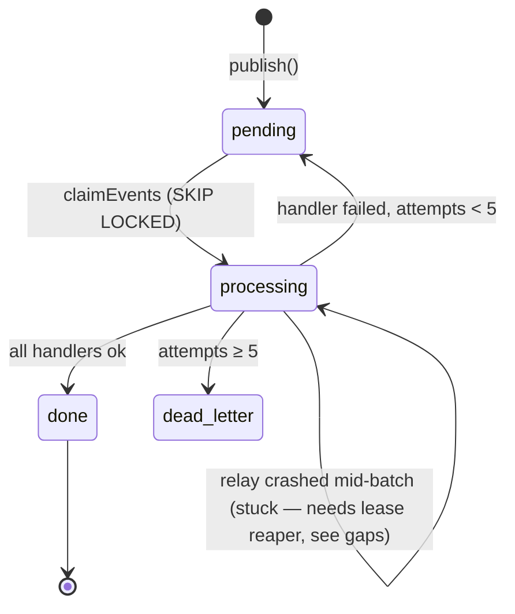

## 9. Configurability model

Business behaviour lives in rule sets. Each rule set is versioned in `rulesets` (`kind@N`), validated per kind (`src/rules/validators.js`) and activated only by a second person. Code changes are needed only for a new **rating method**, **dialogue state**, **rule operator** or **integration**.

| Rule kind | File | What it controls | Business owner | Change path |
|---|---|---|---|---|
| `products` | `products.json` | Catalogue, channels, rating method + rate kind, bundles | Product | Rules console, maker-checker |
| `tariff.tnds_car`, `tariff.tnds_motorbike` | `tariff.*.json` | Regulated TNDS premiums (Decree 67/2023, confirm with TASCO legal), VAT | Underwriting + Compliance | Maker-checker. Approver must be compliance. |
| `rating.motor_pd`, `rating.pa_seat` | `rating.*.json` | Illustrative voluntary rates. **Replace with TASCO filed rates.** | Actuarial | Maker-checker |
| `commission` | `commission.json` | Partner commission table + `statutoryCaps`. The validator rejects rates above the cap. | Finance + Legal | Maker-checker |
| `enrichment` | `enrichment.json` | Source trust, expiry evidence weights, corroboration, category table, DQ weights | Data office | Maker-checker + DQ regression check |
| `scoring` | `scoring.json` | Factors (weights must sum to 100), tiers, damping, `zeroWhen` | Growth analytics | Maker-checker + simulate + model-risk review ([AI governance](ai-governance.md)) |
| `nba` | `nba.json` | Next-best-action decision table | Campaign | Maker-checker + simulate |
| `journeys` | `journeys.json` | Audiences, anchors, steps, channels, marketing flag, cross-sell | Campaign | Maker-checker + simulate |
| `triggers` | `triggers.json` | Ecosystem event → action | Campaign | Maker-checker |
| `benefits` | `benefits.json` | Value-beyond-discount catalogue. Only `legalStatus=approved` items reach customers. | Product + Legal | Maker-checker, copy guard |
| `content.messages` | `content.messages.json` | Message templates (vi/en) | Marketing + Compliance | Maker-checker, copy guard. Zalo template registration is out of band ([integration §4](integration-architecture.md#4-zalo-zns-template-governance)). |
| `content.voicebot` | `content.voicebot.json` | Bot script lines and NLU keywords | CX + Compliance | Maker-checker, copy guard ([AI governance](ai-governance.md)) |
| `copy_guard` | `copy_guard.json` | Banned phrases (no discounts/rebates on regulated products) | Compliance | Maker-checker |
| `contact_policy` | `contact_policy.json` | Contact window, frequency caps, consent per channel | Compliance / DPO | Maker-checker |
| `abac` | `abac.json` | Attribute policies (region, own handoffs) | InfoSec | Maker-checker (security-sensitive: approver must be InfoSec) |
| `retention` | `retention.json` | Retention days and action per entity | DPO + Legal | Maker-checker |
| `referral` | `referral.json` | Referral programme (disabled pending legal) | Product + Legal | Maker-checker |
| `costs` | `costs.json` | Unit costs for the business-case dashboard | Finance | Maker-checker |
| RBAC | `config/security/rbac.json` | Role → permission | InfoSec | **Code review + CAB** (not a rule kind, deliberately) |

Guard-rails present in code:

- the JSON Logic operator allow-list and forbidden keys (`__proto__`, `prototype`, `constructor`);
- weights must sum to 100;
- `tiers.hot > tiers.warm`;
- unique ids;
- a valid contact window;
- VAT between 0 and 0.2;
- the copy guard on every customer-facing string;
- commission caps.

Approval writes `rules.activated`. The rules cache TTL is 15 s (`CACHE_TTL_MS`).

## 10. Scalability to 6 million vehicles

Assumptions:

- 6.0 M vehicles;
- about 1.3 source records per vehicle (7.8 M rows);
- expiries spread evenly, so about 16.4 k vehicles reach expiry per day;
- about 30 % of the base in an active journey at any time;
- detailed sizing in [deployment §12](deployment-and-infrastructure-architecture.md#12-capacity-estimates).

| Concern | Design already in code | Required at 6 M (planned) |
|---|---|---|
| Golden-record build | Incremental rebuild **by plate** in 500-plate chunks (`ingestionService.rebuild`). Only touched plates are rebuilt. | Initial load: bulk `COPY` into a staging table, then rebuild in parallel workers partitioned by `hash(plate_key) % N` (each worker a Job). Steady state: VETC CDC → small batches. |
| Lead recompute | Event-driven for changed profiles | The full recompute (`recompute(null)`) uses `OFFSET` paging, which degrades at millions of rows. Move to **keyset pagination** (`WHERE id > $last ORDER BY id`) and shard across workers. Run nightly only for time-dependent facts (`days`). |
| Journey execution | `runDue` reads due touchpoints (limit 5,000) | Claim touchpoints with `FOR UPDATE SKIP LOCKED` (as the outbox does) so N workers can run in parallel without double sends. Today safety relies on CronJob `concurrencyPolicy: Forbid`. |
| Table growth | Indexed columns per collection | **Range-partition** `messages` and `touchpoints` by month, and `domain_events` by `occurred_at` with a purge of `done` events older than 30 days. Hash-partition `profiles`/`leads`/`source_records` by `id` only if the table exceeds about 100 GB. |
| Reads for BI and dashboards | `countBy` on indexed columns | Route `/api/dashboard/*` and the analytics feed to a **read replica**. Replace `insightsService.governance()` full-chain `audit.verify()` with incremental verification from a checkpoint ([ADR-008](adr/ADR-008-hash-chained-audit.md)). |
| Outbound volume | Breakers per channel | Queue offload: outbox → broker topic per channel → channel workers with provider rate limits (Zalo ZNS quotas, SMS TPS). See [ADR-005](adr/ADR-005-transactional-outbox.md). |
| Audit throughput | `pg_advisory_xact_lock(724001)` serialises appends to keep one linear chain | About 1–2 k appends/s on modest hardware is enough for the current audit points. If needed, use per-day chains or batched Merkle roots. |
| API | Stateless; HPA | Shared rate limiter and token revocation (Redis or gateway) once there is more than one replica ([security gaps](security-architecture.md#15-known-gaps-and-remediation-plan)). |

## 11. Quality attributes (targets)

| Attribute | Target | Mechanism |
|---|---|---|
| Availability (API) | 99.9 % monthly | ≥ 2 replicas across zones, PDB, readiness gating on DB ping, graceful drain (`src/server.js`) |
| Latency | p95 < 300 ms for read APIs; p95 < 1.5 s for purchase (dominated by wallet and core) | Indexed column filters; `statement_timeout 15 s`; breaker timeouts |
| RPO / RTO | RPO ≤ 5 min (PITR), RTO ≤ 1 h (prod) | Managed Postgres PITR + cross-region replica in DR |
| Rule change lead time | ≤ 1 day from draft to active | Maker-checker console; target published in `insightsService.adoption()` |
| Explainability | 100 % of scores carry factor reasons; 100 % of NBAs carry `ruleId` | `domain/leads.js` |
| Auditability | Every state-changing use case audited; chain verifiable | `auditService`, `/api/audit/verify` |

## 12. Evolution roadmap

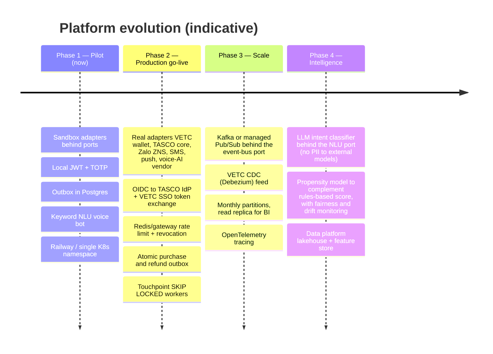

| Item | Why | Approach | Constraint kept |
|---|---|---|---|
| Kafka / Pub/Sub | Fan-out to CTI, data platform, TASCO core; replay | Relay publishes outbox rows to topics; consumers keep the named-handler idempotency model | Publishers do not change (`events.publish`) |
| LLM NLU | Better intent recall on free speech | Implement `classify(text) → intent` with the same contract as `keywordClassifier`, behind a feature flag; evaluate against a labelled set | The dialogue state machine and script stay deterministic and governed ([ADR-009](adr/ADR-009-voice-bot-dialogue.md)) |
| Real IdP | Joiner-mover-leaver, SSO, central MFA | OIDC code flow with PKCE (staff); RS256 tokens verified by JWKS; roles from IdP groups | Principal shape `{id, roles, region}` unchanged ([ADR-007](adr/ADR-007-authentication-identity.md)) |
| Data platform | BI, model training, regulatory reporting | Logical replication / CDC of the indexed columns into pseudonymised curated marts (no decrypted PII) | PII is minimised and pseudonymised by plate-key HMAC ([data §11](data-architecture.md#11-analytics-and-bi-feed)) |
