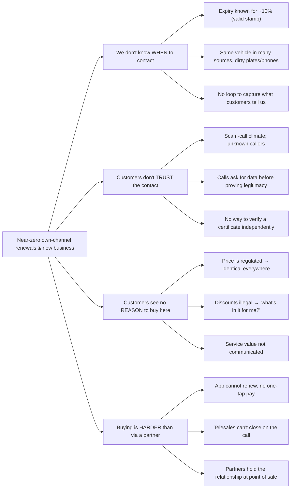
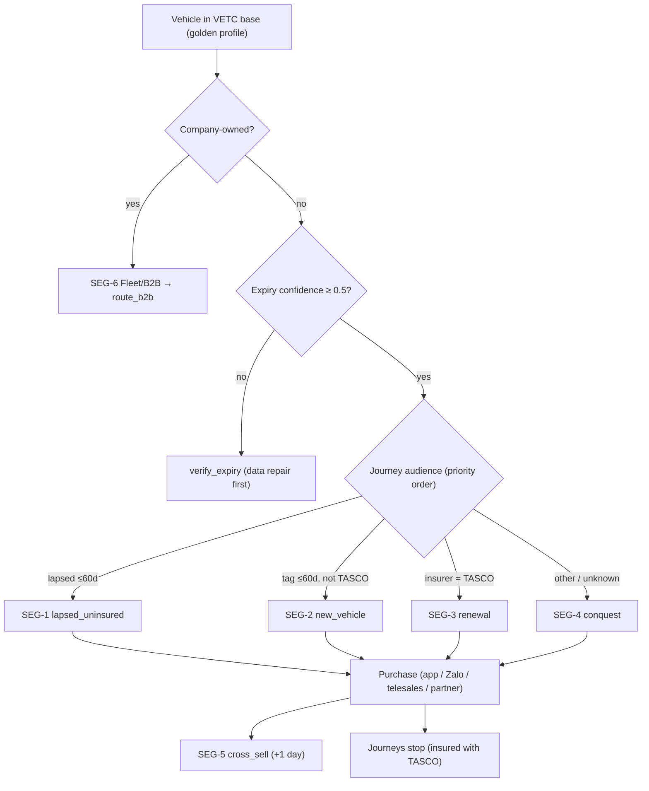
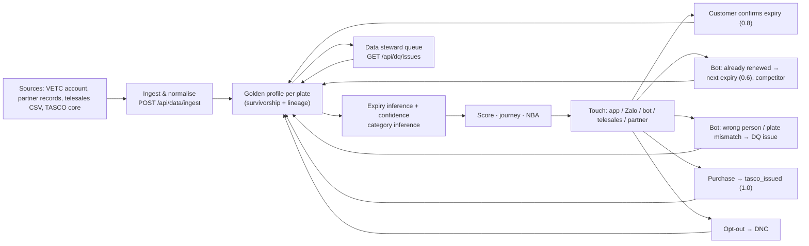
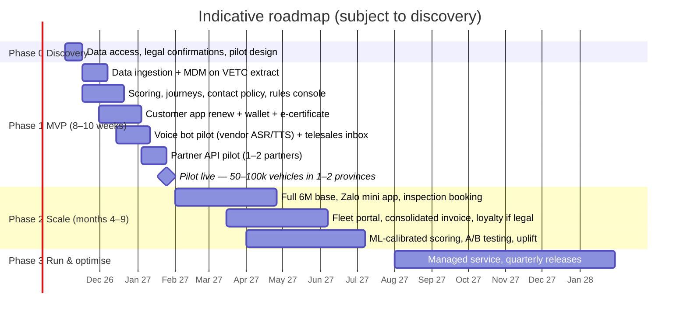

# 01 — Business Context and Growth Strategy

**TASCO Insurance × VETC Motor Insurance Growth Platform**
Prepared by iorta TechNXT · Version 1.0 · October 2026 · Classification: Client Confidential

> **How to read this document.** Statements about TASCO, VETC and the market come **only** from the client brief. Statements about the solution are grounded in the codebase; file paths and API endpoints are cited. Everything else is an **assumption**, labelled `[A-nn]` and listed in §13. All financial figures are **illustrative** and must be replaced with TASCO data during discovery.

---

## Contents

1. [Executive summary](#1-executive-summary)
2. [Market and TASCO/VETC context](#2-market-and-tascovetc-context)
3. [Problem analysis: why own-channel renewals are near zero](#3-problem-analysis-why-own-channel-renewals-are-near-zero)
4. [Growth strategy: new business and retention](#4-growth-strategy-new-business-and-retention)
5. [Channel strategy: arm the partners, don't fight them](#5-channel-strategy-arm-the-partners-dont-fight-them)
6. [Value beyond discount](#6-value-beyond-discount)
7. [Trust strategy](#7-trust-strategy)
8. [Data strategy: every touch improves the data](#8-data-strategy-every-touch-improves-the-data)
9. [How the strategy maps to the four challenge tracks](#9-how-the-strategy-maps-to-the-four-challenge-tracks)
10. [Phased roadmap](#10-phased-roadmap)
11. [KPI tree, baselines and targets](#11-kpi-tree-baselines-and-targets)
12. [Business case model (illustrative)](#12-business-case-model-illustrative)
13. [Assumptions register](#13-assumptions-register)
14. [Fit with the judging criteria](#14-fit-with-the-judging-criteria)
15. [What was added beyond the brief](#15-what-was-added-beyond-the-brief)
16. [Key risks and mitigations](#16-key-risks-and-mitigations)

---

## 1. Executive summary

**The situation.** VETC, Tasco group's electronic toll collection operator, has about 6 million car drivers, and 70–80% of them use the VETC app. That is one of the largest direct-to-driver relationships in Vietnam. Today VETC sells compulsory motor third-party liability insurance (*Bảo hiểm TNDS bắt buộc*) mainly through agents, banks, car showrooms and corporate partners. Its own channels (app push, telesales) are small. **Zero renewals have been closed through own channels this year.**

**The diagnosis.** The problem is not demand. TNDS is compulsory, and drivers need a valid certificate for inspection (*đăng kiểm*) and roadside checks. The near-zero result has three root causes:

1. **Data.** Only 1 in 10 records has a valid policy stamp, so VETC does not know *when* to contact most drivers.
2. **Trust.** Customers do not trust sales calls in a market full of scam calls.
3. **Value.** TNDS premiums are fixed by regulation and direct discounts are illegal, but most customers are looking for a percentage discount. Partners close faster, and the app cannot renew yet.

**The answer.** We propose a **growth platform** that wins on *data, trust and service*, never on price. It covers **new business as well as retention**:

| Lever | What the platform does | Evidence in code |
|---|---|---|
| Data repair loop | Merges dirty multi-source records into one golden profile per plate. It infers policy expiry with a stated confidence, and every customer touch (app confirmation, bot call, purchase) improves the record. | `src/domain/enrichment.js`, `config/rules/enrichment.json`, `POST /api/customer/expiry` |
| Explainable prioritisation | Scores every vehicle 0–100 with plain-language reasons and picks a next-best action and journey. | `src/domain/leads.js`, `config/rules/scoring.json`, `nba.json`, `journeys.json` |
| Trust-first contact | The voice bot discloses that it is automated, verifies the **plate first** (the customer says it; the bot never reads it out) and never takes payment. Payment happens only in the VETC app. Certificates can be checked by QR. | `src/domain/voicebot.js`, `config/rules/content.voicebot.json`, `GET /api/public/certificates/:certNo` |
| One-tap renewal | Signed deep link, then quote, then VETC wallet debit, then TASCO e-certificate. Idempotent, so a customer can never be charged twice. | `src/application/salesService.js`, `POST /api/customer/quotes`, `POST /api/customer/orders` |
| Value beyond discount | Roadside assistance, e-certificate, inspection reminders, claims fast-lane, multi-year cover and cover upgrades. A copy guard blocks the word "discount" from customer copy. | `config/rules/benefits.json`, `copy_guard.json` |
| Partners as a channel | A partner API with plate-based quoting, binding and commission statements, capped at statutory limits. | `/api/partner/v1/*`, `config/rules/commission.json` |

**Illustrative base case** (§12; every input is an assumption). At full scale in year 1 after the MVP, own channels plus the partner API issue about **140,000 TNDS policies**, worth about **VND 79 bn net premium (≈ USD 3.1 M)**. Cross-sell adds about **VND 6.9 bn**. The AI voice bot does the qualifying work for about **VND 1.2 bn**; the same work done by human telesales would cost about **VND 13.4 bn**. The MVP can be live with a pilot cohort in **8–10 weeks** (§10).

**Our recommendation:** approve an MVP pilot in 1–2 provinces on a 50,000–100,000-vehicle cohort. Decide on scale-up with measured conversion, data-repair and trust KPIs (§11).

---

## 2. Market and TASCO/VETC context

### 2.1 The players (from the brief)

| Entity | Role | Relevance |
|---|---|---|
| **TASCO Insurance** (tascoinsurance.com.vn) | Non-life insurer in Vietnam. Subsidiary of Tasco Joint Stock Company, which acquired Groupama Vietnam General Insurance in 2022. | Risk carrier and issuer of TNDS, physical damage and personal accident policies. Owns underwriting, tariffs and claims. |
| **Tasco JSC** | Group parent. | Owns both TASCO Insurance and VETC, so the group already has a captive distribution opportunity. |
| **VETC** (vetc.com.vn) | Electronic toll collection operator with an e-wallet-like platform. About 6 M car drivers; 70–80% use the VETC app. | Owns the customer relationship, the app, the wallet, toll and trip signals, and tag activation events. |
| **Other insurers on VETC** | VETC is a multi-insurer platform (TASCO, PVI, PTI via ADD Solutions). Customers can choose. | TASCO must *earn* the choice through service. VETC's neutrality must be respected (§16). |
| **Traditional channels** | Agents and partners (individuals and companies), banks, car showrooms, corporate and fleet accounts. Partners close most deals today. | The current engine of volume. They should be armed, not displaced (§5). |

### 2.2 Product and regulatory frame

- **TNDS is compulsory and price-regulated.** The platform's tariff rules carry the annual premiums from Decree 67/2023/ND-CP Appendix I (`config/rules/tariff.tnds_car.json`, `tariff.tnds_motorbike.json`), for example VND 437,000 + 10% VAT = **VND 480,700** for a car under 6 seats. *TASCO underwriting must confirm the figures before go-live.*
- **Discounts and rebates are prohibited** in customer copy (Law on Insurance Business 08/2022/QH15, cited in `config/rules/copy_guard.json`). The platform therefore competes on **service and convenience**.
- **Partner commission has statutory caps.** These are encoded per product in `config/rules/commission.json` (for example TNDS 5% of net premium). *TASCO finance and legal must confirm.*
- **Contact and privacy obligations:** anti-spam rules (Decree 91/2020/ND-CP), Decree 13/2023/ND-CP on personal data protection, and the Personal Data Protection Law 91/2025/QH15 (effective 2026). These are encoded conservatively in `config/rules/contact_policy.json` and `retention.json`. *Confirm with TASCO legal.*

### 2.3 Strategic asset inventory

| Asset | Owner | How the platform uses it |
|---|---|---|
| 6 M driver relationships, app reach 70–80% | VETC | Primary reach: app push costs VND 0 per send (`config/rules/costs.json`) |
| ETC tag activation events | VETC | Signal of a new vehicle, which triggers the *new_vehicle* journey (`config/rules/triggers.json`) |
| Toll trips, long trips, app sessions | VETC | Engagement score and benefit relevance (`scoring.json`, `benefits.json`) |
| VETC wallet and auto top-up | VETC | One-tap payment; "wallet covers premium" affinity signal |
| Inspection booking | VETC (service) | Moment of truth: valid TNDS is required at inspection |
| Policy administration, e-certificates, claims | TASCO | Issuance via the `policyAdmin` port; QR verification; FNOL |
| Partner network | VETC / TASCO | Partner API and portal, commission statements |

---

## 3. Problem analysis: why own-channel renewals are near zero

### 3.1 Symptoms (from the brief)

- Only **1 in 10** records has a valid policy stamp.
- **0** renewals were closed through own channels this year.
- Telesales converts poorly. Customers distrust sales calls, direct discounts are illegal, partners close faster, and the app cannot renew.
- Most customers care about a percentage discount.

### 3.2 Root-cause tree



### 3.3 Root causes and design responses

| # | Root cause | Design response | Where it lives |
|---|---|---|---|
| RC-1 | Expiry date unknown or unreliable for most vehicles | Evidence-based expiry inference with confidence (verified certificate 1.0, customer-declared 0.75, partner record ≤0.7, inspection cycle 0.5, tag anniversary 0.25) plus corroboration boosts. Low-confidence vehicles get a *verify expiry* action before any selling. | `enrichment.json` → `expiryEvidence`, `nba.json` rule `fix_data` |
| RC-2 | Duplicate, dirty multi-source records | Plate and phone normalisation; one golden record per plate; source-trust survivorship; field-level lineage | `src/domain/identity.js`, `enrichment.js`, `GET /api/customers/:id/lineage` |
| RC-3 | No capture loop | Customer confirms expiry in the app, the bot captures "already renewed", insurer and next date, and TASCO issuance sets confidence to 1.0 | `POST /api/customer/expiry`, `voiceService.finalize`, `salesService.purchase` |
| RC-4 | Distrust of calls | Bot disclosure, plate-first verification, a "never OTP or payment" statement, a trust script for "is this a scam?", payment only in the app | `content.voicebot.json` lines `intro`, `trust`, `plateMismatch` |
| RC-5 | No independent proof | Public certificate verification page and QR with no PII | `GET /api/public/certificates/:certNo`, `/verify/:certNo` |
| RC-6 | Price-only mindset | Benefits engine ranks the value items most relevant to each driver; the voice bot answers price truthfully ("regulated, same everywhere") and pivots to value | `benefits.json`, `content.voicebot.json` line `price` |
| RC-7 | Hard to buy | Signed deep link → quote → VETC wallet debit → e-certificate; idempotent | `POST /api/customer/session`, `/quotes`, `/orders` |
| RC-8 | Partners own the point of sale | Partner API to quote and bind by plate, with transparent commission | `/api/partner/v1/*` |

---

## 4. Growth strategy: new business and retention

The client asked us not to limit scope to TNDS renewals. The strategy therefore treats the VETC base as a **portfolio of segments**, each with its own journey, objective and economics. The journey engine places each vehicle in the **first matching journey by priority** (`config/rules/journeys.json`). It stops all contact as soon as the vehicle is insured with TASCO (`leadService.recomputeOne` → action `insured`).

### 4.1 Segment portfolio

| Seg ID | Segment | Definition (rule) | Objective | Journey ID | Primary play |
|---|---|---|---|---|---|
| **SEG-1** | Uninsured / lapsed vehicles | Expiry passed within the last 60 days with confidence ≥ 0.5 | New business | `lapsed_uninsured` (priority 1) | Service notice ("may be driving without compulsory TNDS"), then a bot call (hot/warm), then telesales (hot) |
| **SEG-2** | New vehicles | ETC tag activated ≤ 60 days ago, insurer not TASCO | New business | `new_vehicle` (priority 2) | Welcome, save TNDS in the app, verify expiry, value reminder |
| **SEG-3** | TASCO book renewal | Current insurer = TASCO | Retention | `renewal` (priority 3) | Seven-step cadence from −45 to 0 days: verify, remind, value, bot, urgent, telesales, expiry day |
| **SEG-4** | Conquest | Insured elsewhere or insurer unknown | New business | `conquest` (priority 4) | Same cadence, using the `conquest_reminder` template and benefit-led copy; bot for hot leads only |
| **SEG-5** | Cross-sell and bundles | Bought TNDS only and gave marketing consent | Cross-sell | `cross_sell` (post-purchase, +1 day) | PA_SEAT (passengers), MOTOR_PD (own damage), bundles `SAFE_DRIVE` and `FULL_MOTOR` |
| **SEG-6** | Fleet / B2B | `ownerType = company` | New business and retention | NBA `route_b2b` | Route to the B2B team; fleet dashboard and consolidated invoice (benefit `fleet_dashboard`) |
| **SEG-7** | Partner-led | Sold by a bank, showroom, agent, fleet operator or inspection centre | New business | Partner API | Partners quote and bind by plate; VETC data pre-fills; commission statement |



*Note:* the decision order above is simplified from `nba.json`, where `dnc` → `fleet` → `fix_data` → … is evaluated first-hit. Journey assignment (`journeys.json`) runs independently and in priority order. See §16 risk R-08 on fleet vehicles entering B2C journeys.

### 4.2 Segment play summary

| Segment | Why they buy here | Hook (copy key) | Best channel order | Escalation |
|---|---|---|---|---|
| SEG-1 Lapsed | Legal exposure, and inspection blocked without TNDS | `lapsed_notice` (service, not marketing) | Push → Zalo ZNS → SMS | Bot +2 days (hot/warm), telesales +5 days (hot) |
| SEG-2 New vehicle | First time in the ecosystem; set-and-forget reminders | `new_vehicle_welcome`, `verify_expiry` | Push → Zalo | Value reminder +14 days |
| SEG-3 Renewal | Already a TASCO customer; one-tap renewal | `first_reminder`, `urgent_reminder`, `expiry_day` | Push → Zalo → SMS | Bot −14 days (hot/warm), telesales −3 days (hot) |
| SEG-4 Conquest | Same regulated price, *better service* | `conquest_reminder`, `value_reminder` | Push → Zalo → SMS | Bot −14 days (hot only) |
| SEG-5 Cross-sell | "TNDS only covers third parties" | `cross_sell` | Push → Zalo | None (marketing consent required) |
| SEG-6 Fleet | One view and one VAT invoice | Account management | B2B team | — |
| SEG-7 Partner | Partner closes faster with VETC data | API | Partner's own front end | Commission |

### 4.3 Event-driven moments of truth

Calendar-driven reminders are reinforced by **ecosystem events**, the moments when a driver is most receptive (`config/rules/triggers.json`, `POST /api/ecosystem/events`):

| Trigger ID | VETC event | Condition | Action | Marketing? |
|---|---|---|---|---|
| `tag_activated` | `vetc.tag_activated` | — | Enrol in `new_vehicle` | — |
| `inspection_booked` | `vetc.inspection_booked` | Expiry < 60 days away | `inspection_tnds_check` via push or Zalo | No (service) |
| `wallet_topup` | `vetc.wallet_topped_up` | Expiry within ±30 days | `first_reminder` push: customer is in the app with funds | Yes |
| `long_trip` | `vetc.long_trip_started` | Lapsed ≤ 60 days | `value_reminder` push | Yes |

---

## 5. Channel strategy: arm the partners, don't fight them

### 5.1 Principle

Partners close most TNDS deals today because they are present at the moment of need: a car purchase, a loan, an inspection. Competing with them on the same moment is slow and damages the relationship. The strategy is to **own the moments partners do not see** (renewal timing, in-app moments, lapsed vehicles) and to **arm partners** with VETC data and instant TASCO issuance for the moments they do own.

### 5.2 Channel roles

| Channel | Code `channel` | Role | Cost per contact (`costs.json`) | Consent needed (`contact_policy.json`) |
|---|---|---|---|---|
| VETC app push | `app_push` | Primary reminder; one-tap renew | VND 0 | `marketing` for marketing messages |
| Zalo ZNS / OA | `zalo_zns` | Secondary reminder; trusted branded channel | VND 300 | `marketing` for marketing messages |
| SMS | `sms` | Fallback for phone-only contacts | VND 700 | `marketing` for marketing messages |
| AI voice bot | `voice_bot` | Qualify, verify the plate, capture data, hand off or send a link | VND 1,500/min × 1.6 min = **VND 2,400 per call** | `call` (+ `marketing`) |
| Telesales | `telesales` | Close hot leads; handle objections | VND 6,000/min × 4.5 min = **VND 27,000 per call** | `call` (+ `marketing`) |
| Partner API | `partner_api` | Partner-originated new business | Commission (TNDS 5% of net) | Partner obtains consent (`consentMarketing` field) |

Service messages (lapsed notice, expiry day, purchase confirmation, a link the customer asked for) bypass frequency caps but still respect DNC and channel availability (`serviceMessagesBypassCaps: true`). Marketing messages are limited to **08:00–20:00 ICT, 1 per day and 3 per week**, with at most **2 call attempts per week** (`contact_policy.json`).

### 5.3 Waterfall logic

For each touchpoint the journey engine tries the step's channels in order. It sends on the **first permitted channel that succeeds** and records the reasons for any channel it blocks (`journeyService.executeTouchpoint`). Low-cost digital channels therefore always go first, and calls are reserved for hot and warm leads (`onlyTiers`).

### 5.4 Partner enablement

| Capability | Endpoint | Business value |
|---|---|---|
| Onboard partner by type (bank, showroom, agent, fleet, inspection centre) | `POST /api/partners` | Self-serve partner growth |
| Issue or revoke API key (shown once, stored hashed) | `POST /api/partners/:id/keys`, `DELETE /api/partners/keys/:keyId` | Secure B2B integration |
| Quote by plate; unknown vehicles are onboarded as new business | `POST /api/partner/v1/quotes` | Each partner sale also enriches the VETC base |
| Bind (idempotent) | `POST /api/partner/v1/orders` | Instant e-certificate at the counter |
| Own policies and commission statement | `GET /api/partner/v1/policies`, `/statement` | Transparent and dispute-free commission |
| Commission by product × partner type, capped at statutory caps | `config/rules/commission.json` | Compliance by construction |

---

## 6. Value beyond discount

Price cannot move, so the proposition is built from **services, convenience and relevant cover**. The benefits engine (`config/rules/benefits.json`, `src/domain/leads.js#benefitsFor`) ranks items by relevance to each driver, explains *why* in plain language, and shows customers at most 3 items. Only items with `legalStatus = approved` reach customers. Staff also see pending items, flagged as pending.

| Benefit ID | Type | Proposition (EN / VI) | Personalisation signal | Legal status |
|---|---|---|---|---|
| `roadside_24_7` | Service | 24/7 roadside assistance / *Cứu hộ giao thông 24/7* | Long trips (km over 90 days), toll trips | Approved |
| `e_certificate` | Service | Instant e-certificate + QR check / *Giấy chứng nhận điện tử + mã QR* | Universal | Approved |
| `auto_renew` | Service | Never-lapse auto renewal (confirm-before-debit) | Wallet auto top-up | Approved *(feature planned; see doc 02 FR-061)* |
| `inspection_assist` | Service | Inspection reminder and booking / *Nhắc lịch và đặt lịch đăng kiểm* | Expiry inferred from inspection cycle | Approved |
| `claims_fast_lane` | Service | In-app accident reporting / *Báo tai nạn nhanh* | Toll trips | Approved |
| `loyalty_points` | Loyalty | Non-cash VETC points | App sessions | **Pending legal review** |
| `multi_year` | Convenience | 2–3-year cover at regulated pro-rata premium | Wallet balance > VND 1 M; individuals only | Approved |
| `upsell_pa_seat` | Cover upgrade | Protect your passengers (PA per seat) | Seats ≥ 7 | Approved |
| `upsell_motor_pd` | Cover upgrade | Cover damage to your own car | Vehicle age ≤ 5 | Approved |
| `fleet_dashboard` | Service | Fleet renewal dashboard and consolidated VAT invoice | Company owner | Approved *(feature planned)* |

**Guardrails.**
- The **copy guard** (`copy_guard.json`) bans "giảm giá", "chiết khấu", "hoàn tiền", "khuyến mãi phí", "rẻ hơn", "discount", "cashback", "rebate", "% off", "cheaper", "lower premium" and "price cut". It is enforced twice: when a content rule set is saved (`src/rules/validators.js`) and again at send time (`journeyService.sendMessage` → message status `blocked`).
- **Referral** (`referral.json`) is non-cash VETC points only and is **disabled** until legal approval.
- **Bundles** (`SAFE_DRIVE` = TNDS + PA_SEAT; `FULL_MOTOR` = TNDS + MOTOR_PD + PA_SEAT) are priced as the **sum of components** (`products.json`). A bundle is a convenience, not a discount.

---

## 7. Trust strategy

| Trust principle | Mechanism | Code / config |
|---|---|---|
| **Prove legitimacy before asking anything** | The bot says it is VETC's *automated assistant*, states the call is recorded, and says "VETC never asks for OTP or payment by phone" | `content.voicebot.json` → `disclosure`, line `intro` |
| **Plate-first verification** | The customer *says* the plate; the bot extracts it from speech and compares it with the record. It never reads the plate out. Mismatch → the call ends politely. 3 attempts maximum. | `src/domain/identity.js#extractPlateFromSpeech`, `voicebot.js` state `verify_plate`, `maxPlateAttempts: 3` |
| **Masked data on calls** | Plate masked (`30A-***.45`) and phone masked in summaries | `voicebot.js#maskPlate`, `handoffSummary` |
| **No payment on calls** | Bot and telesales send a link; payment happens **only** in the VETC app or Zalo OA via wallet | Line `link`; talking points in `handoffSummary` |
| **Scam objection handled, not ignored** | Intent `scam_concern` → `trust` script and an offer to send an in-app notice the customer can check | `content.voicebot.json` intents and lines |
| **Independently verifiable certificate** | QR on the e-certificate opens a public verification page showing the masked plate, validity and insurer, with no PII | `GET /api/public/certificates/:certNo`, `/verify/:certNo` |
| **Branded channels only** | Messages come from the VETC app and VETC's official Zalo OA. Links are HMAC-signed (no enumerable IDs). | `bootstrap/container.js` → `links.sign/verify` |
| **Respect "no"** | Opt-out on a call → `dnc = true`, call consent withdrawn, audit entry. Consent centre in the app. | `voiceService.finalize` case `opted_out`, `PUT /api/customer/consent` |
| **Honest price talk** | "TNDS premiums are set by regulation and are the same at every insurer" | Line `price`; quote note in `rating.js` |

---

## 8. Data strategy: every touch improves the data

### 8.1 The data-repair loop



### 8.2 Data-quality model

- **DQ issue types:** `phone`, `name`, `reliable_expiry`, `vehicle_category`, `current_insurer` (missing), `conflicting_phone`, `invalid_plate`, `wrong_person`, `plate_mismatch` (`enrichment.js`, `ingestionService.js`, `voiceService.js`).
- **DQ score per profile** = 100 × (0.5 × completeness + 0.35 × expiry confidence + 0.15 × category confidence) (`enrichment.json` → `dataQuality`).
- **Usable expiry threshold:** confidence ≥ 0.5 (`usableExpiryConfidence`). Below this threshold the next-best action is *verify expiry*, not *sell*.
- **Platform-captured facts survive source rebuilds.** Customer-declared, bot-captured and TASCO-issued expiries, and consent overrides, are not overwritten by lower-confidence batch data (`ingestionService.rebuild`).

### 8.3 Data governance principles

1. **Lineage for every field.** Each field records its source, confidence and, where applicable, the rule that set it (`GET /api/customers/:id/lineage`).
2. **Minimum necessary data.** Telesales handoffs carry only what is needed to call; PII is masked unless the role holds `profile:read_pii`.
3. **Encrypted PII.** Name, phone, transcripts and claim descriptions are encrypted at rest (AES-256-GCM). Phone search uses an HMAC blind index (`src/adapters/persistence/schema.js`).
4. **Retention by rule.** Retention periods are set per entity in `config/rules/retention.json`.

---

## 9. How the strategy maps to the four challenge tracks

| Track | Brief ask | Platform capability | Beyond the brief | Main FR IDs (doc 02) |
|---|---|---|---|---|
| **T1 AI voice bot** | Call interested and expiring leads, confirm the plate first, hand hot leads to telesales | Dialogue engine with disclosure, plate-first verification, expiry confirmation, 12 intents, price-honest script, 9 outcomes, structured handoff, campaign runner, governance KPIs | Outcomes write back to data (already renewed → next expiry; opt-out → DNC; mismatch → DQ issue). Scripts are versioned, copy-guarded rules. | FR-031 – FR-039 |
| **T2 Lead scoring and enrichment** | Build profiles from incomplete records; rank who to call first | MDM golden record, evidence-based expiry inference, category inference, explainable 5-factor score, next-best action | Lineage, DQ queue, steward corrections, simulation before rule changes | FR-001 – FR-019, FR-085 |
| **T3 Renewal engine** | Automatic reminders; simple purchase via VETC app and Zalo | Four journeys and cross-sell, contact policy, copy guard, signed links, one-tap wallet purchase, e-certificate | New-business journeys (lapsed, new vehicle, conquest), ecosystem triggers, partner API | FR-020 – FR-030, FR-045 – FR-052, FR-074 – FR-077 |
| **T4 Value beyond discount** | Roadside, loyalty, bundles instead of price cuts | Benefits catalogue with legal gating, relevance and "why", bundles, multi-year cover, cover upgrades, claims FNOL | Copy guard enforcement; QR verification; fleet proposition | FR-053 – FR-062, FR-071 – FR-073 |

---

## 10. Phased roadmap



| Phase | Duration | Scope | Exit criteria (proposed) |
|---|---|---|---|
| **0 Discovery** | 2 weeks | Data extract and schema mapping (VETC accounts, partner lists, TASCO core), legal confirmations (tariff, commission caps, contact policy, PDP), integration contracts (wallet, policy admin, Zalo ZNS, SMS brandname, voice vendor), pilot cohort design with control group | Signed pilot design; data-sharing agreement; integration sandbox access |
| **1 MVP** | 8–10 weeks | Everything in the current codebase moved from sandbox ports to real adapters for **one** voice vendor, VETC wallet, TASCO core and Zalo ZNS. Staff console and customer app. Pilot cohort. | Pilot live; KPIs K-01 – K-12 instrumented; security test passed; UAT sign-off |
| **2 Scale** | ~6 months | Full 6 M base with incremental ingestion; Zalo mini app; inspection booking integration; fleet dashboard; auto-renew opt-in; loyalty (after legal approval); ML score calibrated against outcomes; experimentation framework | Base-case KPI targets on track; cost per policy ≤ target (K-10) |
| **3 Run** | Ongoing | Managed service, rule tuning by the business through the maker-checker console, new products by configuration | SLOs met (doc 03) |

**Why 8–10 weeks is credible.** The business logic is already implemented and **rules-driven**: scoring, journeys, NBA, benefits, tariffs, contact policy and copy are configuration in `config/rules/*.json`. Every external system sits behind a port with a sandbox adapter (`src/adapters/integrations/mockGateways.js`, `simulatedCaller.js`). MVP effort therefore goes to integration, data onboarding, UAT and the pilot, not to building logic.

---

## 11. KPI tree, baselines and targets

### 11.1 KPI tree

```mermaid
flowchart TB
  NS["North star K-00:<br/>TASCO motor policies issued via VETC-owned channels + partner API"]
  NS --> R["Reach"]
  NS --> C["Conversion"]
  NS --> V["Value per customer"]
  NS --> E["Efficiency"]
  NS --> TR["Trust & compliance"]

  R --> K01["K-01 Actionable profiles<br/>(expiry confidence ≥ 0.5)"]
  R --> K02["K-02 Digital reachability<br/>(push or Zalo)"]
  R --> K03["K-03 Data-repair rate<br/>(confirmations / month)"]

  C --> K04["K-04 Own-book renewal rate (SEG-3)"]
  C --> K05["K-05 Conquest conversion (SEG-4)"]
  C --> K06["K-06 Lapsed recovery (SEG-1)"]
  C --> K07["K-07 New-vehicle conversion (SEG-2)"]
  C --> K08["K-08 Bot → handoff → won"]

  V --> K09["K-09 Cross-sell attach (PA / PD)"]
  E --> K10["K-10 Acquisition cost per policy"]
  E --> K11["K-11 Bot cost vs telesales-equivalent"]
  TR --> K12["K-12 Opt-out & plate-verification failure rates"]
  TR --> K13["K-13 Copy-guard blocks, complaints"]
  TR --> K14["K-14 Audit chain integrity"]
```



### 11.2 KPI definitions

Targets are **proposed assumptions** for the pilot and scale phases. They must be re-baselined after Phase 0. "TBM" means to be measured in discovery.

| KPI | Definition | Source in platform | Baseline (brief / TBM) | Pilot target (proposed) | Scale target Y1 (proposed) |
|---|---|---|---|---|---|
| K-00 | Policies issued via own channels + partner API | `GET /api/dashboard/overview` → `sales.orders`, `byChannel` | Own-channel renewals = **0** this year (brief) | ≥ 2,000 in pilot cohort | ≈ 140,000 (base case §12) |
| K-01 | % profiles with expiry confidence ≥ 0.5 | `base.profilesWithUsableData` *(see engineering note E-12, doc 05)* | **~10%** valid stamp (brief) | 35% | 50% |
| K-02 | % profiles reachable by push or Zalo | `profiles.channels` | TBM (70–80% app users per brief) | 60% | 65% |
| K-03 | Expiry confirmations per 1,000 profiles per month | Audit `customer.expiry_declared` | 0 (no capture today) | 30 | 50 |
| K-04 | SEG-3 renewal rate | Orders with journey `renewal` / TASCO-book expiries | TBM | 15% | 25% |
| K-05 | SEG-4 conversion | Orders with journey `conquest` / conquest audience | TBM | 1% | 2% |
| K-06 | SEG-1 recovery | Orders with journey `lapsed_uninsured` / lapsed audience | TBM | 3% | 6% |
| K-07 | SEG-2 conversion | Orders with journey `new_vehicle` / new tags | TBM | 2% | 4% |
| K-08 | Bot hot-handoff rate; handoff win rate | `voice_sessions.outcome`, `handoffs.status` | Telesales conversion "poor" (brief) | 8% / 20% | 10% / 25% |
| K-09 | PA_SEAT / MOTOR_PD attach on own-channel TNDS | `activePoliciesByProduct` | TBM | 4% / 0.25% | 8% / 0.5% |
| K-10 | Variable acquisition cost per policy | `economics.costPerOrder` + telesales | TBM | ≤ VND 55,000 | ≤ VND 40,000 |
| K-11 | Bot cost ÷ telesales-equivalent cost | `economics.voiceBotCost`, `equivalentTelesalesCost` | n/a | ≤ 10% | ≤ 10% (by unit costs: 8.9%) |
| K-12 | Bot opt-out rate; plate-verification failure rate | `GET /api/dashboard/governance` | n/a | ≤ 5%; ≤ 10% | ≤ 4%; ≤ 8% |
| K-13 | Copy-guard blocks in production; complaints per 10,000 contacts | `messageStatus.blocked`; complaints feed (planned) | n/a | 0 blocks after go-live; TBM | 0; TBM |
| K-14 | Audit chain verifies | `GET /api/audit/verify` → `ok: true` | n/a | 100% daily | 100% daily |

**Measurement design.** The pilot should hold out a randomised **control group** (for example 10% of the cohort receiving no own-channel contact). Only then can incremental policies be separated from policies that partners would have sold anyway.

---

## 12. Business case model (illustrative)

> **All numbers below are illustrative.** Unit costs come from `config/rules/costs.json`, regulated premiums from `config/rules/tariff.tnds_car.json`, and illustrative PA and PD rates from `rating.pa_seat.json` and `rating.motor_pd.json`. Every other input is an assumption `[A-nn]`. FX assumption: **USD 1 = VND 26,000** `[A-01]`.

### 12.1 Formulas

```
Actionable vehicles          A   = B × e × u
  B  = VETC car base                                  (≈ 6,000,000, brief)
  e  = share with an expiry event in the year         [A-02]
  u  = usable-expiry rate after data repair           [A-03]
Segment volumes              A_ren = A × s_T ; A_conq = A × s_C ; A_lap = A × s_L     [A-04]
New vehicles per year        N                                                        [A-05]
Own-channel TNDS policies    Q_own = A_ren·c_ren + A_conq·c_conq + A_lap·c_lap + N·c_new   [A-06]
Partner-API policies         Q_p                                                      [A-07]
TNDS net premium             GWP_TNDS = (Q_own + Q_p) × P̄                              [A-08]
Cross-sell premium           GWP_X = Q_own × (a_PA × P_PA + a_PD × P_PD)                [A-09]
Messaging cost               C_msg = (A + N) × m × (0.3 × 300 + 0.1 × 700)  (60% push @ 0) [A-10]
Bot cost                     C_bot = A × k × 1.3 × 1,500 × 1.6                          [A-11]
Telesales cost               C_tel = calls_tel × 6,000 × 4.5                            [A-12]
Partner commission           C_com = Q_p × P̄ × 5%                                       (commission.json)
Acquisition cost per policy  = (C_msg + C_bot + C_tel + C_com) / (Q_own + Q_p)
```

**Premium inputs.**
- P̄ (average TNDS net premium, mix `[A-08]`: 70% car < 6 seats, 25% car 6–11 seats, 5% at VND 1,270,000) = 0.70 × 437,000 + 0.25 × 794,000 + 0.05 × 1,270,000 = **VND 567,900** (VND 624,690 incl. VAT).
- P_PA = 5 seats × VND 20,000,000 × 0.1% = **VND 100,000** (VAT-exempt per `rating.pa_seat.json`).
- P_PD = VND 700,000,000 sum insured × 1.5% (age 0–3) × (1 − 10% deductible relief) = **VND 9,450,000** net (`rating.motor_pd.json`, which is labelled ILLUSTRATIVE).

### 12.2 Scenario inputs

| Input | Conservative | **Base** | Stretch |
|---|---|---|---|
| e: share with expiry event `[A-02]` | 85% | 85% | 85% |
| u: usable-expiry rate `[A-03]` | 35% | **50%** | 65% |
| Segment split s_T / s_C / s_L `[A-04]` | 10 / 85 / 5% | 10 / 85 / 5% | 10 / 85 / 5% |
| N: new tags per year `[A-05]` | 250,000 | 250,000 | 250,000 |
| c_ren / c_conq / c_lap / c_new `[A-06]` | 15% / 1% / 3% / 2% | **25% / 2% / 6% / 4%** | 35% / 3% / 10% / 6% |
| Q_p: partner-API policies `[A-07]` | 5,000 | 15,000 | 30,000 |
| a_PA / a_PD attach `[A-09]` | 4% / 0.25% | 8% / 0.5% | 12% / 1% |
| m: sends per profile per year `[A-10]` | 5 | 5 | 5 |
| k: share of A called by bot `[A-11]` | 10% | 15% | 20% |
| Telesales calls per year `[A-12]` | 25,000 | 50,000 | 80,000 |

### 12.3 Outputs (year 1 at scale)

| Output | Conservative | **Base** | Stretch |
|---|---:|---:|---:|
| Actionable vehicles A | 1,785,000 | **2,550,000** | 3,315,000 |
| SEG-3 renewals | 26,775 | **63,750** | 116,025 |
| SEG-4 conquest | 15,172 | **43,350** | 84,532 |
| SEG-1 lapsed recovered | 2,678 | **7,650** | 16,575 |
| SEG-2 new vehicles | 5,000 | **10,000** | 15,000 |
| SEG-7 partner API | 5,000 | **15,000** | 30,000 |
| **Total TNDS policies** | **54,625** | **139,750** | **262,132** |
| TNDS net premium (VND) | 31.0 bn | **79.4 bn** | 148.9 bn |
| TNDS net premium (USD) | 1.19 M | **3.05 M** | 5.73 M |
| PA_SEAT policies / premium (VND) | 1,985 / 0.20 bn | **9,980 / 1.00 bn** | 27,856 / 2.79 bn |
| MOTOR_PD policies / premium (VND) | 124 / 1.17 bn | **624 / 5.89 bn** | 2,321 / 21.94 bn |
| **Total premium incl. cross-sell (VND)** | **32.4 bn** | **86.3 bn** | **173.6 bn** |
| Messaging cost (VND) | 1.63 bn | 2.24 bn | 2.85 bn |
| Bot calls / cost (VND) | 232,050 / 0.56 bn | 497,250 / **1.19 bn** | 861,900 / 2.07 bn |
| Same calls by telesales (VND) | 6.27 bn | **13.43 bn** | 23.27 bn |
| Telesales cost (VND) | 0.68 bn | 1.35 bn | 2.16 bn |
| Partner commission (VND) | 0.14 bn | 0.43 bn | 0.85 bn |
| **Variable acquisition cost (VND)** | **3.00 bn** | **5.21 bn** | **7.93 bn** |
| **Per policy (VND)** | **54,955** | **37,276** | **30,261** |
| As % of TNDS net premium | 9.7% | **6.6%** | 5.3% |

### 12.4 Reading the numbers honestly

1. **The voice bot is the clearest saving.** At contracted unit costs, a bot call costs 8.9% of a telesales call (VND 2,400 vs VND 27,000). In the base case that is about **VND 12.2 bn per year** of qualifying work not done by humans.
2. **Own-channel acquisition cost per policy (6.6% of premium in the base case) is above the 5% TNDS commission benchmark.** Own channels do not win on cost per TNDS policy in year 1. They win on:
   - (a) **incremental volume** that partners do not reach (lapsed, in-app moments);
   - (b) **data ownership**, since renewals in year 2 need less verification and more free push;
   - (c) **cross-sell premium**, where PD alone adds about 7% to base-case premium;
   - (d) **retention of the TASCO book**, currently zero through own channels.
   Target K-10 tracks the path toward parity.
3. **Incrementality must be measured.** Some own-channel policies would have been sold by partners anyway. The pilot control group (§11.2) quantifies this.
4. **Platform cost** (doc 07: about USD 0.79 M in year 1, then about USD 0.50 M per year) must be covered by the **technical contribution margin** of incremental premium. TASCO finance should plug its own margin into:
   `Break-even margin = (Platform cost + Acquisition cost) / (Incremental premium)`.
   In the base case year 2, assuming 100% incrementality, this is (VND 13.1 bn + 5.2 bn) / 86.3 bn ≈ **21%**. At 70% incrementality `[A-13]` it rises to about **30%**. This is why the pilot must prove incrementality before scale.

### 12.5 Sensitivity (base case, TNDS net premium)

| Driver changed (±) | Impact on TNDS net premium |
|---|---|
| u (usable expiry) ±10 pts | ±VND 13.0 bn (every segment conversion scales with A) |
| c_ren ±5 pts | ±VND 7.2 bn |
| c_conq ±1 pt | ±VND 12.3 bn |
| Q_p ±10,000 | ±VND 5.7 bn |

The **data-repair rate (u)** and **conquest conversion** dominate. That is why the strategy puts data repair (`fix_data` NBA) ahead of selling.

---

## 13. Assumptions register

| ID | Assumption | Value used | Owner to validate |
|---|---|---|---|
| A-01 | FX rate | USD 1 = VND 26,000 | TASCO finance |
| A-02 | Share of base with a TNDS expiry event in the year (rest on multi-year or unknown) | 85% | Discovery (data) |
| A-03 | Usable-expiry rate achievable after data repair | 35% / 50% / 65% | Pilot |
| A-04 | Split of actionable base: TASCO book / elsewhere or unknown / lapsed | 10% / 85% / 5% | Discovery (data) |
| A-05 | New ETC tag activations per year (car) | 250,000 | VETC |
| A-06 | Segment conversion rates | See §12.2 | Pilot (control group) |
| A-07 | Partner-API policies in year 1 | 5k / 15k / 30k | Partner managers |
| A-08 | TNDS category mix | 70% / 25% / 5% | Discovery (data) |
| A-09 | Cross-sell attach and average PD sum insured (VND 700 M) | See §12.2 | TASCO product / actuarial |
| A-10 | Sends per profile per year; channel mix 60% push / 30% ZNS / 10% SMS | 5 | Campaign manager |
| A-11 | Share of actionable called by bot; 1.3 attempts per call | 10–20% | Campaign manager |
| A-12 | Telesales calls per year | 25k / 50k / 80k | Telesales lead |
| A-13 | Incrementality vs partner channel | 70% (sensitivity) | Pilot control group |
| A-14 | Tariff, commission caps and contact policy as encoded in rules | As in `config/rules` | TASCO underwriting, finance, legal |

---

## 14. Fit with the judging criteria

| Criterion | How the proposal scores | Evidence |
|---|---|---|
| **Impact** | Attacks all four root causes (data, trust, value, friction) across **seven segments**, not only renewal. Base case about 140k policies and VND 86 bn premium. | §4, §12; `journeys.json` (4 journeys + cross-sell); partner API |
| **Fit** | Built on Tasco group assets (VETC app reach, wallet, tag events, inspection, TASCO issuance). Respects regulated pricing (copy guard, no discount field in quotes) and partner economics (statutory caps). Supports VETC's multi-insurer model. | `copy_guard.json`, `rating.js` (`priceRegulated` note), `commission.json` |
| **Speed** | Working codebase with 73 API routes, rules-driven logic and sandbox ports. MVP pilot in 8–10 weeks. Rule changes in hours via maker-checker with no code release. | `src/adapters/http/routes.js`, `rulesService.js`; adoption target "rule change lead time ≤ 1 day" (`insightsService.adoption`) |
| **Cost** | Free push first; bot at 8.9% of telesales cost per call; serverless-friendly Node.js and PostgreSQL stack; no licensed rules engine. | `costs.json`; `package.json` (single runtime dependency `pg`) |

---

## 15. What was added beyond the brief

| # | Addition | Why it matters | Where |
|---|---|---|---|
| 1 | **New-business journeys**: lapsed and uninsured, new vehicle, conquest | Growth beyond the small TASCO book | `journeys.json` |
| 2 | **Event-driven moments of truth** (tag activation, inspection booking, wallet top-up, long trip) | Contact when the driver is receptive and in the app | `triggers.json`, `POST /api/ecosystem/events` |
| 3 | **Partner API and commission statements** | Arms the channel that already closes most deals | `/api/partner/v1/*` |
| 4 | **Multi-product catalogue and bundles** (MOTOR_PD, PA_SEAT, SAFE_DRIVE, FULL_MOTOR) | Raises value per customer without discounting | `products.json`, `rating.*.json` |
| 5 | **Public QR certificate verification** | Trust, and proof of cover at roadside checks | `/verify/:certNo` |
| 6 | **Claims FNOL in the app** | Trust is earned at claim time | `POST /api/customer/claims` |
| 7 | **Rules governance with maker-checker, simulation and rollback** | The business changes scoring, journeys and copy safely without a release | `/api/rules/*` |
| 8 | **Copy guard** | Discount language cannot reach customers | `copy_guard.json`, `validators.js` |
| 9 | **Contact policy engine** (consent, DNC, hours, caps) | Anti-spam compliance by construction | `contact_policy.json`, `contactPolicy.js` |
| 10 | **Data lineage, DQ queue, steward corrections** | Data repair is operational, not ad hoc | `/api/dq/*`, `/api/customers/:id/lineage` |
| 11 | **Tamper-evident audit trail** (hash chain) | Regulator-grade accountability | `auditChain.js`, `GET /api/audit/verify` |
| 12 | **Data-subject rights** (export, erase or anonymise, consent centre) | PDP law readiness | `/api/dsar/*`, `/api/customer/data-export` |
| 13 | **Economics dashboard** using contracted unit costs | Cost per order and bot vs human saving visible daily | `GET /api/dashboard/overview` → `economics` |
| 14 | **Multi-year cover** aligned to the inspection cycle | Fewer renewals to win; convenience | Benefit `multi_year`; tariff `maxTermYears: 3` |

---

## 16. Key risks and mitigations

| ID | Risk | Likelihood | Impact | Mitigation |
|---|---|---|---|---|
| R-01 | VETC data-sharing or consent basis insufficient for marketing use | Medium | High | Phase 0 legal review; consent captured per channel; service messages separated from marketing (`marketing` flag per step) |
| R-02 | Multi-insurer neutrality: VETC promotes TASCO over other insurers on its platform | Medium | High | Group governance decision; the platform can present the regulated price as "same everywhere"; benefits are service-based; legal review of copy |
| R-03 | Partner conflict (perception that VETC competes with partners) | Medium | Medium | Partner API with instant issuance and transparent commission; own channels focus on moments partners do not see |
| R-04 | Voice bot ASR accuracy on Vietnamese plates and dialects | Medium | Medium | Plate-first verification with 3 attempts; fallback to sending a link; vendor bake-off in Phase 0; governance KPIs (K-12) |
| R-05 | Copy or regulatory change (tariff, commission caps) | Low | Medium | All in rules with maker-checker; validators enforce caps |
| R-06 | Low incrementality vs partners | Medium | High | Control group; segment focus on lapsed and in-app moments |
| R-07 | Loyalty or referral not approved by legal | Medium | Low | Already gated: `legalStatus: pending_legal_review`; `referral.enabled: false` |
| R-08 | Company-owned vehicles also enter B2C journeys (journey audiences do not exclude `ownerType = company`; only the NBA routes them to B2B) | High (as built) | Medium | Engineering fix proposed (doc 05, E-07) |
| R-09 | Data residency requirements for personal data | Medium | High | Deploy in a Vietnam region or on Vietnamese cloud if required; confirm with TASCO legal (doc 03 NFR-030) |
