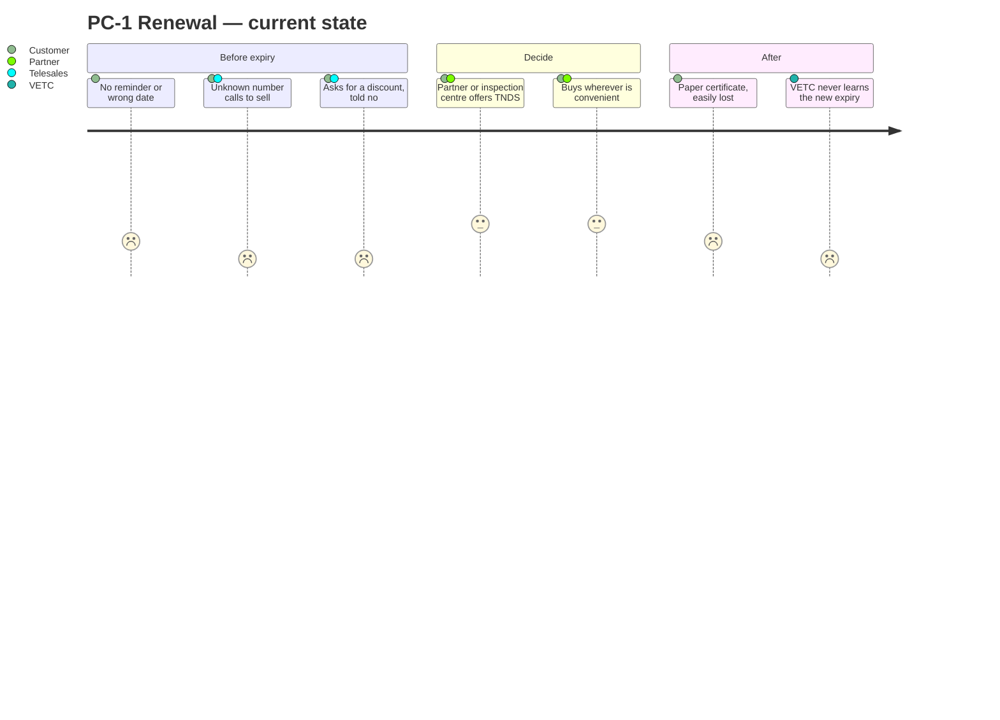
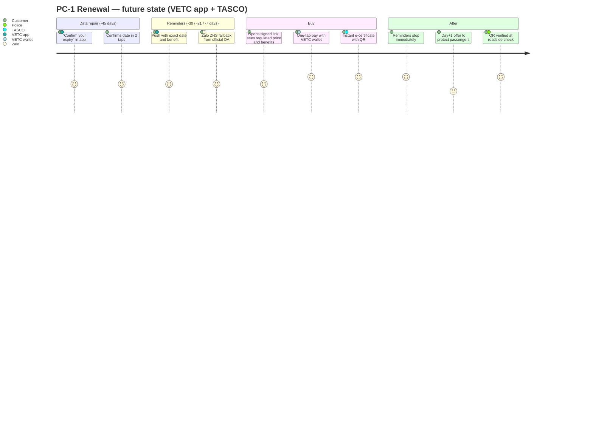
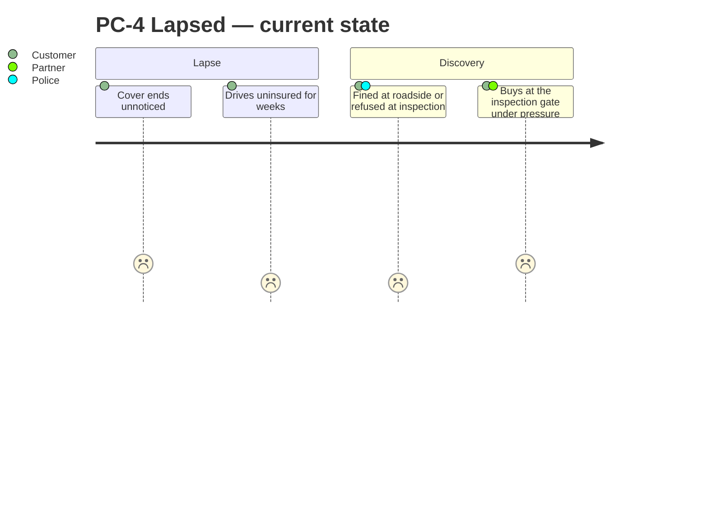
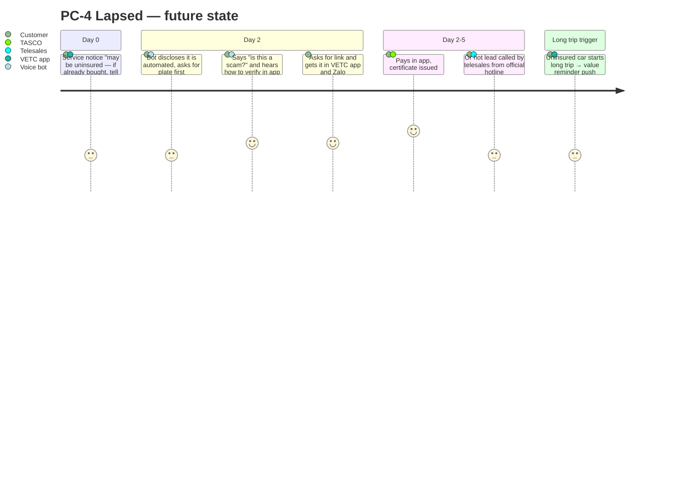
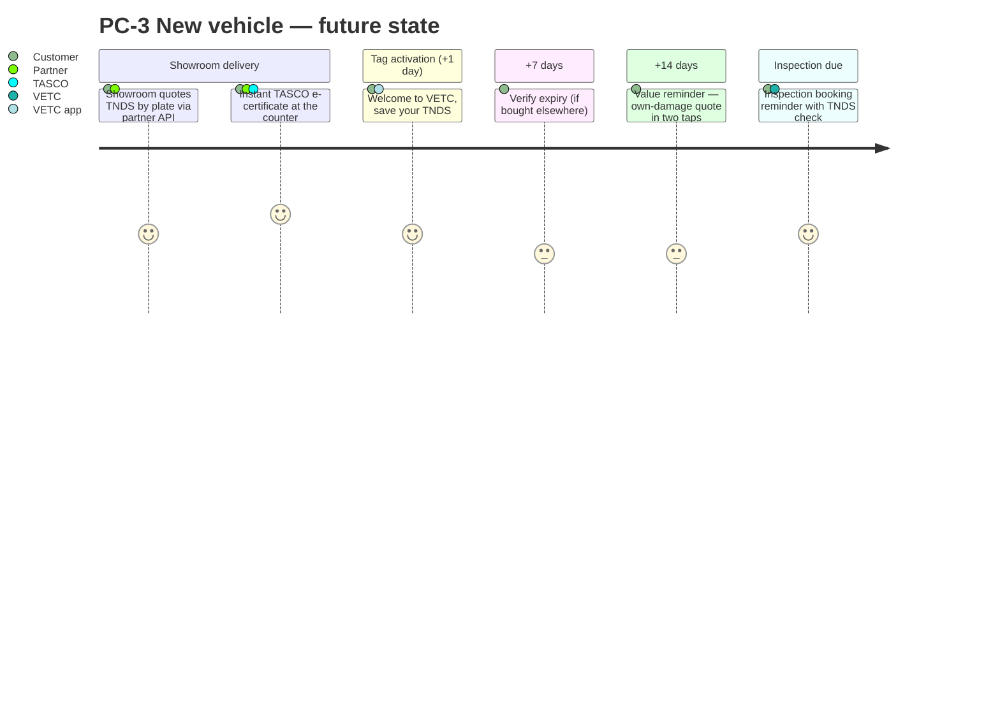
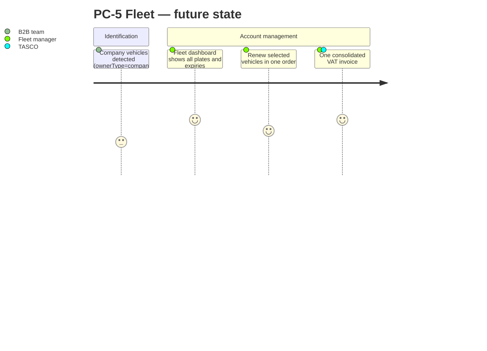
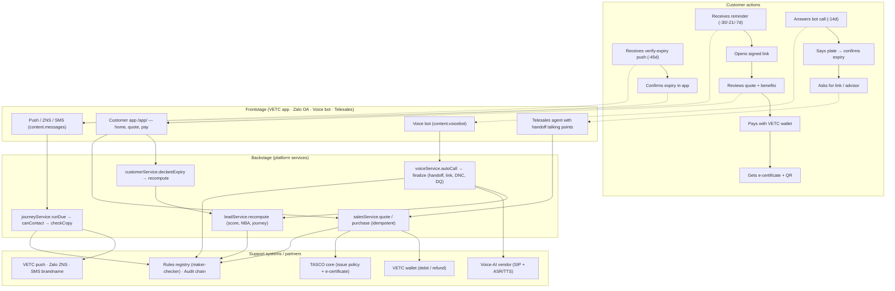
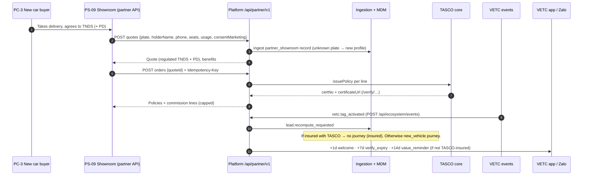

# 06 — Personas, Journey Maps and Service Blueprints

**TASCO Insurance × VETC Motor Insurance Growth Platform** · iorta TechNXT · Version 1.0 · October 2026

> **Evidence base.** The personas are **proto-personas**. They are built from the client brief (6 M drivers, 70–80% app use, a price-discount mindset, distrust of sales calls, partner-led sales, near-zero own-channel renewals) and from the behavioural signals the platform actually uses (`src/domain/leads.js#factsFor`: toll trips, long trips, app sessions, wallet balance, auto top-up, consent, complaints). Names, ages and quotes are **illustrative**. Validate them with 8–12 customer interviews per segment and a review of telesales call recordings in Phase 0.

---

## 1. Persona index

| ID | Persona | Type | Segment (doc 01) | System role (`rbac.json`) |
|---|---|---|---|---|
| PC-1 | Private car owner / commuter | Customer | SEG-3 renewal, SEG-4 conquest | `customer` |
| PC-2 | Long-haul driver | Customer | SEG-3 / SEG-4, roadside-led | `customer` |
| PC-3 | New car buyer | Customer | SEG-2 new vehicle, SEG-7 partner-led | `customer` |
| PC-4 | Lapsed owner | Customer | SEG-1 lapsed / uninsured | `customer` |
| PC-5 | Fleet manager | Customer (B2B) | SEG-6 fleet | *(fleet portal planned)* |
| PS-01 | Telesales agent | Staff | — | `telesales_agent` |
| PS-02 | Telesales supervisor | Staff | — | `telesales_supervisor` |
| PS-03 | Campaign manager | Staff | — | `campaign_manager` |
| PS-04 | Rule author (product) | Staff | — | `rule_author` |
| PS-05 | Compliance approver | Staff | — | `rule_approver`, `compliance_officer` |
| PS-06 | Data steward | Staff | — | `data_steward` |
| PS-07 | Claims handler | Staff | — | `claims_handler` |
| PS-08 | Partner manager | Staff | — | `partner_manager` |
| PS-09 | Partner staff via API (bank or showroom) | External | SEG-7 | `partner_api` |
| PS-10 | Executive | Staff | — | `executive` |
| PS-11 | Support engineer | Staff | — | `support_engineer` |
| PS-12 | Platform admin / security | Staff | — | `admin` |
| PS-13 | Internal auditor | Staff | — | `auditor` |

---

## 2. Customer personas

### PC-1 Private car owner / commuter: "Anh Minh", 38, Hà Nội

| Dimension | Detail |
|---|---|
| Vehicle and use | 5-seat sedan; commutes and makes weekend trips; about 15–25 toll trips per month |
| Digital | Opens the VETC app weekly to check balance and top up; uses Zalo daily |
| Insurance today | Bought TNDS last year from a bank partner bundled with his car loan, or at the inspection centre. Doesn't remember the expiry date or the insurer. |
| Goals | Stay legal at inspection and roadside checks with zero hassle; spend as little time as possible |
| Pain points | "Everyone calls me to sell insurance." Doesn't know when it expires. Paper certificates get lost. Believes he should get "% off". |
| Triggers to act | Inspection booking; wallet top-up; a credible reminder with an exact date |
| What wins him | One tap from a trusted app, an instant e-certificate, no calls, roadside assistance |
| Platform signals | `appSessions30d` medium, `tollTrips30d` medium, `channels.app_push` true, `consent.marketing` true |
| Typical NBA | `verify_expiry` (if confidence < 0.5) → `digital_reminder` |

### PC-2 Long-haul driver: "Chú Hùng", 51, Thanh Hóa ↔ Hà Nội ↔ Hải Phòng

| Dimension | Detail |
|---|---|
| Vehicle and use | 7-seat MPV, often carrying family or passengers; 2,000+ highway km per quarter |
| Digital | Uses the VETC app for wallet auto top-up; prefers calls to reading |
| Goals | Help on the road if the car breaks down; passengers protected |
| Pain points | Breakdowns far from home; unsure what TNDS covers (it does **not** cover his passengers or his own car) |
| What wins him | `roadside_24_7` (relevance driven by `longTripsKm90d`, `tollTrips30d`), `upsell_pa_seat` (seats ≥ 7), `auto_renew` (auto top-up) |
| Platform signals | High `longTripsKm90d`, `autoTopUp` true, wallet ≥ premium |
| Typical NBA | `voice_bot` if hot with call consent; otherwise `digital_reminder` |

### PC-3 New car buyer: "Chị Thảo", 32, TP. Hồ Chí Minh

| Dimension | Detail |
|---|---|
| Moment | Just took delivery; the showroom installed the VETC tag (`vetc.tag_activated`) |
| Insurance today | The showroom sold TNDS (and maybe physical damage) at delivery |
| Goals | Protect a new, expensive car; avoid admin |
| Pain points | Paperwork overload at delivery; unclear what she has bought and until when |
| What wins her | Welcome message that stores her cover in the app (`new_vehicle_welcome`), `upsell_motor_pd` (vehicle age ≤ 5), inspection reminders |
| Channel | Showroom via partner API (SEG-7), then VETC app |
| Typical journey | `new_vehicle`: welcome +1 day, verify +7 days, value reminder +14 days |

### PC-4 Lapsed owner: "Anh Tuấn", 45, Bình Dương

| Dimension | Detail |
|---|---|
| Situation | TNDS expired 3 weeks ago. He forgot, or lets it lapse until inspection. |
| Attitude | Sceptical of calls ("is this a scam?"), price-focused |
| Risk | Fines at roadside checks; inspection refused; personally liable after an accident |
| What wins him | A clear, non-pushy **service** notice (`lapsed_notice`) with an "if you already bought it, tell us" option; a quick fix in the app; a bot that proves legitimacy (plate-first) |
| Typical journey | `lapsed_uninsured`: notice today, bot +2 days (hot/warm), telesales +5 days (hot) |
| Typical NBA | `urgent_recovery` |

### PC-5 Fleet manager: "Ms Lan", 41, logistics SME, 40 vehicles

| Dimension | Detail |
|---|---|
| Situation | Company-owned trucks and vans (`ownerType = company`), each renewing on different dates |
| Goals | No vehicle ever off-road for lack of TNDS; one invoice; one contact |
| Pain points | Spreadsheet tracking; many invoices; individual sales calls to her drivers |
| What wins her | `fleet_dashboard` (one view, consolidated VAT invoice), an account manager (`route_b2b`) |
| Channel | B2B team; partner type `fleet` |
| Note | Must be excluded from B2C robocalls (the campaign route already skips `company`; journeys do not yet, see doc 05 E-07) |

---

## 3. Staff and partner personas

| ID | Persona | Goals | Key pains today | Platform jobs-to-be-done | Primary screens / APIs | Success measure |
|---|---|---|---|---|---|---|
| PS-01 | **Telesales agent** | Close more with fewer calls | Cold lists; customers distrust calls; can't take payment | See hot, verified, interested customers with talking points; send a one-tap link while on the call | Telesales inbox (`/api/handoffs`), Customer 360 | Handoff win rate (K-08); first contact ≤ 2 business hours |
| PS-02 | **Telesales supervisor** | Team productivity and compliance | No visibility of lead quality or script adherence | Assign handoffs; rehearse bot scripts; monitor outcomes | Telesales inbox (assign), Voice bot console | Win rate; SLA adherence |
| PS-03 | **Campaign manager** | Grow policies at a controlled cost | No reliable expiry data; blunt campaigns | Prioritised queue, journeys, bot campaigns, event simulator, economics | Leads, Journeys, Voice campaign, Home dashboard | K-00, K-10 |
| PS-04 | **Rule author (product)** | Change scoring, journeys and copy fast and safely | IT tickets for every change | Draft, validate, simulate, submit | Rules studio (`/api/rules*`) | Rule-change lead time ≤ 1 day |
| PS-05 | **Compliance approver** | Nothing unlawful reaches customers | Manual copy review; opaque bots | Four-eyes approval; copy guard; governance KPIs; DSAR | Rules studio (approve), Audit, governance dashboard | 0 copy-guard breaches; 0 contact-policy breaches |
| PS-06 | **Data steward** | Trustworthy customer data | Duplicates; 1 in 10 records verified | Ingest; DQ queue; lineage; corrections with evidence | Data quality (`/api/dq/*`), Customer 360 lineage | K-01 usable-expiry rate |
| PS-07 | **Claims handler** | Fast, transparent FNOL | Late, incomplete notifications | FNOL queue and status transitions within SLA | Claims queue (`/api/claims`) | % acknowledged within 4 h |
| PS-08 | **Partner manager** | Grow partner sales; settle commission cleanly | Manual statements; disputes | Onboard, keys, suspend, statements | Partners (`/api/partners*`) | Active partners on API; disputes = 0 |
| PS-09 | **Partner staff via API** (bank loan officer, showroom sales) | Close insurance with the main sale | Re-keying data; slow issuance | Quote by plate, bind, instant e-certificate, statement | Partner API (`/api/partner/v1/*`) | Time to certificate < 1 min |
| PS-10 | **Executive** | Growth and ROI visibility | Anecdotal reporting | Growth, channel, economics, adoption | Home dashboard (`/api/dashboard/*`) | K-00, premium, cost per policy |
| PS-11 | **Support engineer** | Stable platform | Silent integration failures | Integration status, jobs, reconciliation | Operations (`/api/ops/*`), `/metrics` | SLOs (doc 03) |
| PS-12 | **Platform admin / security** | Least-privilege access | Shared accounts | Users, roles, regions, MFA | Users (`/api/users`) | 0 orphan accounts; MFA coverage of privileged roles = 100% |
| PS-13 | **Internal auditor** | Evidence on demand | Logs scattered, editable | Audit search; hash-chain verification | Audit (`/api/audit*`) | Chain verifies daily |

---

## 4. Journey maps: current state vs future state

Scores in the journey diagrams are customer sentiment from 1 (very negative) to 5 (very positive). They are **design hypotheses** to validate in research.

### 4.1 PC-1 renewal: current state

### 4.2 PC-1 renewal: future state

### 4.3 PC-4 lapsed recovery: current vs future

### 4.4 PC-3 new vehicle: future state

### 4.5 PC-5 fleet: future state

---

## 5. Service blueprint: renewal (SEG-3) and conquest (SEG-4)

| Stage | Customer action | Frontstage | Backstage | Support system | Fail point → mitigation |
|---|---|---|---|---|---|
| Data repair (−45 days) | Confirms expiry | Push / Zalo `verify_expiry` | `declareExpiry` → recompute | Rules: `nba.fix_data` | Customer ignores it → inference from inspection cycle and tag anniversary; bot asks "which month?" |
| Reminders (−30 / −21 / −7 days) | Reads and opens link | `first_reminder` / `conquest_reminder`, `value_reminder`, `urgent_reminder` | `runDue` → `canContact` → `checkCopy` → send | Push, ZNS, SMS | Cap or hours reached → skipped with reason; next step continues |
| Bot (−14 days, hot/warm for renewal, hot for conquest) | Verifies plate | Voice bot | `autoCall` → `finalize` | Voice vendor | ASR fails → 3 attempts → `unverified`; scam concern → `trust` line |
| Telesales (−3 days, hot) | Talks to advisor | Agent | Handoff queue | — | No payment on the call → link sent |
| Purchase | Pays | Customer app | `quote` → `purchase` | Wallet, TASCO core | Wallet timeout → circuit breaker; issuance failure → refund |
| After sale | Gets certificate | `purchase_confirmation` | `policy.issued` → stop journeys, cross-sell | QR verify page | — |

---

## 6. Service blueprint: new-vehicle onboarding (SEG-2 and SEG-7)

| Stage | Frontstage | Backstage | Rule kinds | KPI |
|---|---|---|---|---|
| Showroom quote | Partner front end | `POST /api/partner/v1/quotes` → ingestion | `products`, `tariff.*`, `rating.motor_pd`, `enrichment` | Quote → bind conversion |
| Bind | Partner front end | `POST /api/partner/v1/orders` | `commission` | Time to certificate |
| Tag activation | — | `handleEcosystemEvent` → recompute | `triggers`, `journeys` | New-vehicle enrolment rate |
| Onboarding messages | VETC app, Zalo | `runDue` | `content.messages`, `contact_policy` | K-07 |
| Cross-sell | VETC app | `cross_sell` touchpoint | `journeys.crossSell`, `benefits` | K-09 |

---

## 7. Pain points → design responses

| PP ID | Pain point | Persona | Design response | FR | Evidence |
|---|---|---|---|---|---|
| PP-01 | "I don't know when my insurance expires." | PC-1, PC-4 | Expiry inference with confidence; app confirmation; exact date in every reminder | FR-005, FR-076, FR-025 | `enrichment.json`, `/api/customer/expiry` |
| PP-02 | "Unknown callers try to sell me things; might be a scam." | PC-1, PC-4 | Bot disclosure, plate-first verification, trust script, official hotline, no payment on calls | FR-031 – FR-035, FR-040 | `content.voicebot.json` |
| PP-03 | "I want a discount." | PC-1, PC-4 | Honest regulated-price answer plus relevant service value; copy guard | FR-035, FR-058, FR-024 | `benefits.json`, `copy_guard.json` |
| PP-04 | "Buying is faster at the partner." | PC-1, PC-3 | One-tap wallet purchase; partner API so partners sell TASCO instantly | FR-077, FR-065 | `/api/customer/orders`, `/api/partner/v1/*` |
| PP-05 | "I lose paper certificates; police doubt screenshots." | PC-1 | E-certificate with public QR verification | FR-050 | `/verify/:certNo` |
| PP-06 | "Too many messages." | All | Caps (1/day, 3/week), hours 08–20, consent centre, journeys stop on purchase | FR-023, FR-078, FR-019 | `contact_policy.json` |
| PP-07 | "TNDS doesn't cover my passengers or my car — I didn't know." | PC-2, PC-3 | Explained cover upgrades and bundles | FR-055, FR-054, FR-028 | `upsell_pa_seat`, `upsell_motor_pd` |
| PP-08 | "My drivers get sales calls; I manage 40 renewals in Excel." | PC-5 | B2B routing; fleet dashboard (planned) | FR-070 | `nba.fleet` |
| PP-09 | Agent: "My leads are cold and I can't close on the phone." | PS-01 | Hot, plate-verified handoffs with talking points; link-based closing | FR-040 – FR-042 | `handoffSummary` |
| PP-10 | Product: "Every change needs IT." | PS-04 | Rules studio with simulation and maker-checker | FR-082 – FR-087 | `/api/rules*` |
| PP-11 | Compliance: "I can't review every script and message." | PS-05 | Copy guard at save and send; versioned scripts; audit chain | FR-024, FR-086, FR-099 | `validators.js`, `auditChain.js` |
| PP-12 | Data: "Only 1 in 10 records is verified." | PS-06 | MDM, DQ queue, lineage, data-repair loop | FR-004 – FR-010 | `enrichment.js` |
| PP-13 | Partner: "Commission statements are late and disputed." | PS-08, PS-09 | Self-service statement, rules-based capped commission | FR-067 – FR-069 | `commission.json` |
| PP-14 | Claims: "Accidents reported late with poor information." | PS-07, PC-1 | In-app FNOL with location, photos and a 4 h SLA | FR-071, FR-072 | `claimsService.js` |

---

## 8. Moments of truth

| MoT ID | Moment | Who | Why it matters | Platform response | Trigger / rule |
|---|---|---|---|---|---|
| MoT-01 | **First 10 seconds of a call** | PC-1, PC-4 | Decides trust or hang-up | Automated-assistant disclosure; "never OTP or payment"; ask for the plate, never say it | `content.voicebot.lines.intro` |
| MoT-02 | **Price question** | PC-1, PC-4 | Where discount expectations meet the law | Truthful regulated-price answer plus value pivot | Line `price`; `copy_guard` |
| MoT-03 | **Tag activation (new car)** | PC-3 | Habit forms in the first weeks | Welcome, then save cover, then reminders | `triggers.tag_activated` → `new_vehicle` |
| MoT-04 | **Inspection booking** | PC-1, PC-4 | Valid TNDS is required at inspection | TNDS check message | `triggers.inspection_booked` |
| MoT-05 | **Wallet top-up** | PC-1, PC-2 | In the app, with funds | One-tap reminder push | `triggers.wallet_topup` |
| MoT-06 | **Starting a long trip uninsured** | PC-2, PC-4 | Risk is salient | Value reminder push | `triggers.long_trip` |
| MoT-07 | **Expiry day** | All | Legal exposure begins | Service notice that bypasses caps | `journeys.renewal` step `expiry_day` |
| MoT-08 | **Payment tap** | All | A double charge or failure destroys trust | Idempotent purchase; automatic refund on issuance failure | FR-047, FR-048 |
| MoT-09 | **Roadside or inspection check** | All | Proof of cover | QR verification page | FR-050 |
| MoT-10 | **Accident** | All | The moment that justifies insurance | In-app FNOL; 4 h acknowledgement SLA | FR-071 |
| MoT-11 | **Saying "stop"** | All | Respect builds long-term trust | Immediate DNC; audited | FR-036, FR-078 |
