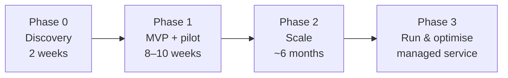

# 07 — Commercials and Engagement Model

**iorta TechNXT proposal to TASCO Insurance × VETC** · Version 1.0 · October 2026 · Client Confidential

> **Important.** All figures in this document are **indicative**, **subject to discovery** and **not a binding offer**. They rest on the assumptions in §9 (including a blended day rate and an FX rate) and must be replaced by iorta TechNXT's formal rate card and statement of work after Phase 0. Currency: USD, with VND shown at **USD 1 = VND 26,000** (assumption C-01). VAT and withholding taxes are excluded.

---

## 1. Engagement summary

| Item | Proposal |
|---|---|
| Objective | Take the TASCO × VETC Growth Platform from a working codebase to a **live pilot in 8–10 weeks**, then scale to the full 6 M-vehicle base and run it as a managed service |
| Starting point | Working platform: 73 API routes, rules-driven lead intelligence, journeys, voice bot dialogue engine, sales and issuance, partner API, rules governance, audit and privacy controls (doc 02 status: 97 of 110 FRs built or built with a noted gap) |
| Phases | **0 Discovery** (2 weeks) → **1 MVP and pilot** (8–10 weeks) → **2 Scale** (about 6 months) → **3 Run and optimise** (managed service) |
| Commercial options | **A.** Fixed-price MVP + T&M scale + managed service · **B.** Outcome-linked: reduced fixed fee + per-transaction success fee (capped) |
| Indicative 3-year TCO (Option A) | **≈ USD 1.80 M (≈ VND 46.8 bn)**, including cloud infrastructure; excludes pass-through usage fees and TASCO/VETC internal costs |

---

## 2. Phases, scope and deliverables

| Phase | Scope | Key deliverables | Exit gate |
|---|---|---|---|
| **0 Discovery** | Data mapping (VETC accounts, partner lists, TASCO core); legal confirmations (tariff, commission caps, contact policy, PDP, data residency); integration contracts; pilot design with a control group; voice-vendor bake-off | Discovery report; signed integration specs; pilot plan; baselined KPIs (doc 01 §11); refined SOW and price | Steering committee sign-off |
| **1 MVP and pilot** | Real adapters for VETC wallet, TASCO core policy admin, VETC push, Zalo ZNS, SMS brandname and one voice-AI vendor; VETC data onboarding; staff console and customer app; security hardening; UAT; pilot for 50k–100k vehicles in 1–2 provinces | Production-ready release; runbooks; trained users; pilot dashboard; security test report | UAT sign-off; go-live; 30 days hypercare |
| **2 Scale** | Full 6 M base with incremental ingestion; Zalo mini app; VETC SSO; live VETC event feed; inspection booking; auto-renew opt-in; fleet dashboard and consolidated invoice; loyalty (if approved); ML score calibration; A/B testing; fixes for engineering notes E-01 – E-22 | Scaled platform; experimentation framework; fleet portal | KPI review against the base case |
| **3 Run** | Managed service: L2/L3 support, SRE, security patching, rule-change support, quarterly enhancement releases | Monthly service report; quarterly business review | SLA compliance |

---

## 3. Team composition and effort

### 3.1 Phase 0 and Phase 1 (MVP)

| Role | Phase 0 (FTE) | Phase 1 (FTE) | Responsibilities |
|---|---:|---:|---|
| Engagement lead / delivery manager | 1.0 | 0.5 | Governance, risk, steering, commercial |
| Product owner proxy / business analyst | 1.0 | 1.0 | Backlog, acceptance criteria (doc 04), UAT |
| Solution architect | 1.0 | 1.0 | Integration design, NFRs, security architecture |
| UX/UI designer | 1.0 | 1.0 | Console and app UX, WCAG 2.2 AA, Vietnamese copy with TASCO |
| Backend engineers | — | 3.0 | Adapters, scale, fixes |
| Frontend engineers | — | 2.0 | Staff console and customer app |
| Data engineer | — | 1.0 | VETC and partner data onboarding, MDM tuning |
| Data scientist | — | 0.5 | Score calibration, pilot measurement design |
| Conversation (voice) designer | — | 0.5 | Vietnamese bot script, ASR tuning with vendor |
| QA automation engineers | — | 2.0 | Unit, integration, API, security and performance suites |
| DevOps / SRE | — | 1.0 | CI/CD, K8s, observability, DR |
| Security engineer | — | 0.25 | ASVS L2 verification, pentest coordination |
| **Total FTE** | **4.0** | **13.75** | |
| **Duration** | 2 weeks (10 days) | 10 weeks (50 days) | |
| **Effort (person-days)** | **40** | **687.5** | **727.5 total** |

### 3.2 Phase 2 (Scale) and Phase 3 (Run)

| Role | Phase 2 FTE (~26 weeks) | Phase 3 FTE (ongoing) |
|---|---:|---:|
| Engagement lead / service manager | 0.5 | 0.5 |
| Business analyst | 1.0 | — |
| Solution architect | 0.5 | — |
| Backend engineers | 2.5 | 1.5 |
| Frontend engineers | 2.0 | — |
| Data engineer | 1.0 | — |
| Data scientist | 1.0 | — |
| Data / rules analyst | — | 0.5 |
| QA automation | 1.0 | 0.5 |
| DevOps / SRE | 0.5 | 1.0 |
| **Total FTE** | **10.0** | **4.0** |
| **Effort** | **1,300 person-days** (130 days) | ≈ 84 person-days per month |

### 3.3 Client-side commitments (not priced)

| TASCO / VETC role | Commitment |
|---|---|
| Business product owner (TASCO) | 0.5 FTE in Phases 0–2 |
| VETC data and integration lead | 0.5 FTE in Phases 0–1 |
| Underwriting, finance, legal reviewers | Sign-off on tariffs, commission caps, copy, consent and PDP within agreed SLAs (≤ 5 business days) |
| Telesales team lead and agents | UAT and pilot participation |
| IT security | Pentest scope, access approvals |

---

## 4. Indicative commercial models

### 4.1 Option A: Fixed-price MVP + T&M scale + managed service (recommended)

| Component | Basis | Indicative price (USD) | ≈ VND |
|---|---|---:|---:|
| Phase 0 + Phase 1 (fixed price) | 727.5 person-days × USD 320 = USD 232,800, plus 10% delivery-risk premium | **256,000** | 6.66 bn |
| Phase 2 (time and materials, capped) | 1,300 person-days × USD 320 | **≤ 416,000** | ≤ 10.82 bn |
| Phase 3 managed service | 4 FTE × 21 days × USD 280 (run rate) | **23,520 / month** (282,240 / year) | 0.61 bn / month |
| Enhancement pool (Phase 3, optional) | Drawdown at the T&M rate | 150,000 / year (budgetary) | 3.90 bn |

### 4.2 Option B: Outcome-linked

Aligns iorta TechNXT's reward with policies issued through the platform.

| Component | Basis | Indicative |
|---|---|---|
| Phase 0 + 1 fixed fee | 70% of the Option A fixed price | **USD 179,200** (VND 4.66 bn) |
| Success fee | **VND 15,000 per successful digital policy transaction** (own channels + partner API) during the pilot and the following 12 months | Capped at **USD 200,000** |
| Phase 2 and 3 | As Option A | As Option A |

**Illustrative success fee using doc 01 §12 policy volumes (year 1 at scale):**

| Scenario | Policies | Success fee (VND) | ≈ USD | vs Option A fixed-fee saving (USD 76,800) |
|---|---:|---:|---:|---|
| Conservative | 54,625 | 0.82 bn | 31,500 | TASCO saves about USD 45k |
| Base | 139,750 | 2.10 bn | 80,600 | About neutral |
| Stretch | 262,132 | 3.93 bn | 151,200 | iorta earns about USD 74k more |

> **Legal note (confirm with TASCO legal).** The success fee must be structured as a **technology service fee per processed transaction**, not as an insurance commission or brokerage fee. Under the Law on Insurance Business 08/2022/QH15, commission may be paid only to licensed intermediaries. The fee must not be passed on as, or create, any premium inducement to customers.

### 4.3 Option comparison

| Criterion | Option A | Option B |
|---|---|---|
| Budget certainty for TASCO | High (fixed MVP, capped T&M) | Medium (fee varies with volume, capped) |
| Shared risk on outcomes | Low | High |
| Upfront cash | Higher | 30% lower in Phases 0–1 |
| Administrative effort | Low | Requires monthly transaction reconciliation (provided by the platform: `GET /api/dashboard/overview` → `sales.byChannel`) |
| Recommended when | Budget approved, priority on speed | Business case uncertain, priority on aligned incentives |

---

## 5. Payment milestones (Phase 0 + 1, fixed price)

| Milestone | Trigger / acceptance evidence | % | Option A (USD) | Option B (USD) |
|---|---|---:|---:|---:|
| M0 Mobilisation | Contract signature, team onboarded | 15% | 38,400 | 26,880 |
| M1 Discovery complete | Discovery report and pilot plan signed (Phase 0 exit) | 15% | 38,400 | 26,880 |
| M2 Integrated build | End-to-end demo on integration sandboxes: wallet debit, TASCO issuance, ZNS send, bot call (week 6) | 20% | 51,200 | 35,840 |
| M3 UAT sign-off | User stories in scope accepted (doc 04); security test with 0 open High/Critical | 30% | 76,800 | 53,760 |
| M4 Pilot live + hypercare | Go-live plus 30 days within SLO | 20% | 51,200 | 35,840 |
| **Total** | | **100%** | **256,000** | **179,200** |

Phase 2 is invoiced monthly in arrears against timesheets, up to the cap. Phase 3 is invoiced monthly in advance. Option B success fees are invoiced quarterly from platform transaction reports.

---

## 6. Run-cost estimate (cloud infrastructure)

Assumptions: Kubernetes (managed) plus managed PostgreSQL, in a hosting location approved by TASCO legal (NFR-030; possibly a Vietnamese cloud provider). Prices are indicative list-price equivalents; the provider is chosen in Phase 0.

| Component | Pilot / Y1 (USD per month) | Full scale Y2+ (USD per month) | Sizing basis |
|---|---:|---:|---|
| Application nodes (K8s) | 600 | 1,200 | 3 → 6 nodes × 4 vCPU / 16 GB; API, journey and ingestion workers |
| PostgreSQL (HA primary + standby) | 1,400 | 2,400 | 8 vCPU / 32 GB → 16 vCPU / 64 GB + read replica for reporting; 1–2 TB |
| Backups and object storage (PITR, 35 days) | 200 | 350 | NFR-051 – NFR-053 |
| Load balancer, WAF, egress | 350 | 450 | Shared rate limiting (E-15) at the edge |
| Observability (metrics, logs, traces) | 400 | 600 | NFR-047 – NFR-049 |
| Non-production (dev, SIT/UAT, on-demand performance) | 900 | 850 | Synthetic data only (NFR-033) |
| Secrets, KMS, miscellaneous | 150 | 150 | Data keys and rotation (NFR-023) |
| **Total infrastructure** | **≈ 4,000** | **≈ 6,000** | |
| **Per year** | **≈ 48,000** | **≈ 72,000** | |

**Usage-based pass-through (not in TCO; paid by TASCO/VETC to providers).** The rates come from `config/rules/costs.json`; volumes are the doc 01 base case.

| Item | Unit cost (VND) | Base-case volume | Annual (VND) |
|---|---:|---:|---:|
| Voice-AI minutes | 1,500 / min × 1.6 min | 497,250 calls | ≈ 1.19 bn |
| Zalo ZNS + SMS | 300 / 700 per message | 5 sends × 2.8 M profiles (mix) | ≈ 2.24 bn |
| App push | 0 | — | 0 |
| Telesales (internal staff time) | 6,000 / min × 4.5 min | 50,000 calls | ≈ 1.35 bn |

---

## 7. Total cost of ownership (Option A, indicative)

| USD | Year 1 | Year 2 | Year 3 | Year 4 | Year 5 |
|---|---:|---:|---:|---:|---:|
| Phase 0 + 1 fixed price | 256,000 | — | — | — | — |
| Phase 2 scale (T&M cap) | 416,000 | — | — | — | — |
| Managed service | 70,560 (3 months) | 282,240 | 282,240 | 290,707 | 299,428 |
| Enhancement pool | — | 150,000 | 150,000 | 154,500 | 159,135 |
| Cloud infrastructure | 48,000 | 72,000 | 72,000 | 74,160 | 76,385 |
| **Total** | **790,560** | **504,240** | **504,240** | **519,367** | **534,948** |
| ≈ VND | 20.55 bn | 13.11 bn | 13.11 bn | 13.50 bn | 13.91 bn |

| Horizon | TCO (USD) | ≈ VND |
|---|---:|---:|
| **3-year** | **1,799,040** | **46.78 bn** |
| **5-year** | **2,853,355** | **74.19 bn** |

Years 4–5 include 3% annual escalation. Under Option B, year-1 cost falls by USD 76,800 and the success fee (capped at USD 200,000) is added.

**Context against the business case (doc 01 §12, illustrative).** In the base case, year-2 platform cost (USD 0.50 M ≈ VND 13.1 bn) is about **15%** of total premium through the platform (VND 86.3 bn). The pilot's control group must confirm incrementality before scale-up (doc 01 §12.4).

---

## 8. Governance and ways of working

| Forum | Cadence | Participants | Purpose |
|---|---|---|---|
| Steering committee | Monthly | TASCO and VETC executives, iorta engagement lead | Scope, budget, KPI review, phase gates |
| Product council | Fortnightly | TASCO product owner, VETC lead, iorta BA and architect | Backlog priority, rule-change requests |
| Sprint review | Every 2 weeks | Product owner, key users | Demo against doc 04 acceptance criteria |
| Change control | As needed | Product owner, engagement lead | Scope changes → impact on price and timeline |
| Compliance checkpoint | Per release | Compliance approver (PS-05) | Copy, consent, PDP, audit evidence |

**Delivery approach.** Two-week sprints. Definition of done = acceptance criteria met, tests at NFR-042 thresholds, lint clean, OpenAPI updated, security checks passed. Business rule changes after go-live go through the **rules studio** (maker-checker) and do not need a release.

**Managed-service SLAs (Phase 3, indicative):**

| Priority | Example | Response | Restore / workaround |
|---|---|---|---|
| P1 | Purchase path down; data breach suspected | 30 min (24×7) | 4 h |
| P2 | Journey run failing; one integration down | 2 business hours | 1 business day |
| P3 | Non-critical defect | Next business day | Next release |
| P4 | Enhancement or question | 3 business days | Planned |

---

## 9. Assumptions

| ID | Assumption |
|---|---|
| C-01 | FX USD 1 = VND 26,000. Prices are quoted in USD; invoicing currency to be agreed. |
| C-02 | Blended day rate USD 320 for build phases and USD 280 for run. **Placeholder** until replaced by the iorta TechNXT rate card. |
| C-03 | 1 FTE-week = 5 person-days; 1 month = 21 person-days. |
| C-04 | VETC and TASCO provide integration sandboxes (wallet, core policy admin, push, ZNS, SMS) by the end of Phase 0 week 2, and production credentials by week 8. |
| C-05 | One voice-AI vendor (SIP + Vietnamese ASR/TTS) is selected in Phase 0 and contracted directly by TASCO/VETC. Per-minute costs are pass-through. |
| C-06 | The pilot cohort is 50k–100k vehicles in 1–2 provinces, with a randomised control group. |
| C-07 | TASCO legal confirms tariff, commission caps, contact policy, PDP basis and data residency in Phase 0. Delays move milestones day for day. |
| C-08 | Hosting on a managed Kubernetes + PostgreSQL platform chosen in Phase 0. Infrastructure is billed at cost to TASCO, or passed through. |
| C-09 | The existing codebase is the baseline. Engineering notes E-01 – E-22 (doc 05) are fixed within Phases 1–2 scope. |
| C-10 | User acceptance is against doc 04 acceptance criteria for in-scope stories. |
| C-11 | English and Vietnamese UI. Customer copy is written or approved by TASCO/VETC. |

## 10. Exclusions

- Licences and usage fees of third-party services: voice-AI minutes, Zalo OA/ZNS, SMS brandname, push providers, cloud marketplace items.
- Changes inside TASCO core policy administration, VETC app native code, VETC wallet or the VETC identity provider, beyond consuming their APIs.
- Claims adjudication, reserving, reinsurance and finance-system integration (accounting entries, VAT e-invoicing beyond the consolidated-invoice feature).
- Third-party penetration test fees (indicatively USD 15k–25k per year), certification or audit fees.
- Data migration of historical TASCO policy archives beyond the expiry-relevant fields.
- Legal, actuarial or regulatory advice. The platform encodes TASCO's decisions; it does not make them.
- Hardware, on-premise hosting, or 24×7 coverage for P2–P4 (available on request).
- Marketing spend, call-centre staffing and customer-communication costs.

## 11. Key commercial risks

| Risk | Mitigation |
|---|---|
| Integration sandboxes late | Sandbox adapters already exist (`mockGateways.js`); milestone M2 relies on them; time-and-materials buffer agreed in the SOW |
| Legal confirmations late (PDP, copy, loyalty) | Conservative defaults in rules; items gated (`legalStatus`, `referral.enabled = false`) |
| Scope growth (fleet portal, loyalty) | Phase 2 capped T&M; change control |
| Outcome fee disputes (Option B) | Fee computed from the platform's audited order records (`order.completed` audit entries, hash-chained) |
