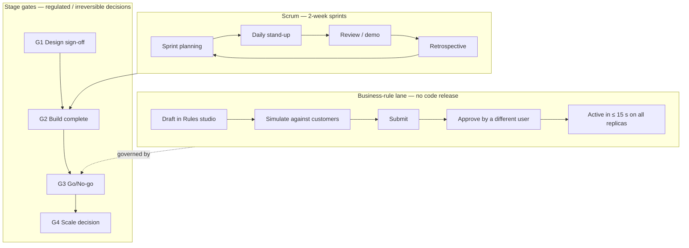
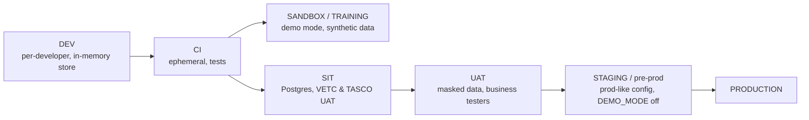

# Delivery Methodology

**Approach:** hybrid agile. We run Scrum for product increments and add **stage gates** for the regulated items that cannot simply be "iterated into production" in an insurance business: tariffs, customer-facing wording, consent, contact policy, partner commission, security and privacy.

The aim is fast, visible progress every two weeks, while every change that affects customers, money or personal data is approved by the right person before it reaches production, with evidence kept in the audit trail.

---

## 1. Why hybrid

| Concern | Pure agile risk | Hybrid answer |
|---|---|---|
| Regulated premiums (TNDS, Decree 67/2023) | Rates changed by a developer in a sprint | Tariffs are **rule sets** with maker-checker approval (`rulesService.approve` refuses self-approval). Underwriting is the checker. |
| Discount prohibition (Law 08/2022/QH15) | Marketing copy shipped without review | Copy guard (`copy_guard.json`) blocks banned phrases at validation **and** at send time. Content changes need a Compliance approver. |
| Anti-spam (Decree 91/2020) and PDP (Decree 13/2023) | Journeys contacting customers too often or without consent | `contact_policy` rule set enforced in `canContact()`. Legal approves policy values at G1 and G3. |
| Integration with VETC and TASCO core | Late surprises | Integration contracts frozen at G1. Sandbox adapters implement the same ports, and contract tests run in CI. |
| Security | Findings discovered after go-live | Security gates in the DoD and at G2/G3. RBAC changes go through code review plus CAB. |

---

## 2. Lifecycle overview

There are three lanes of change, each with its own path to production:

| Lane | Examples | Path | Approver |
|---|---|---|---|
| **Code** | New page, new adapter, bug fix | Pull request → CI quality gates → staging → CAB (for production) | Tech lead (code review) + CAB |
| **Security configuration** | `config/security/rbac.json`, `MFA_REQUIRED_ROLES`, secrets | Pull request with Security review → CAB | CISO delegate |
| **Business rules** | Scoring weights, NBA, journeys, benefits, templates, voice script, tariffs, commission, contact policy, retention | Rules studio: draft → validate → simulate → submit → approve | Rule approver / Compliance officer (four-eyes, enforced in code) |

---

## 3. Scrum framework

### 3.1 Roles
- **Product Owner (TASCO)** owns the backlog and accepts stories.
- **Scrum Master / Delivery Lead (iorta TechNXT)** owns the process, impediments and reporting.
- **Development team (cross-functional):** backend, frontend, data, QA, DevSecOps, UX and BA.
- **Client SMEs** attend refinement and reviews: VETC product, compliance and telesales supervisors.

### 3.2 Ceremonies

| Ceremony | When | Duration | Participants | Output |
|---|---|---|---|---|
| Sprint planning | Day 1 of sprint | 2 h | Team, PO | Sprint goal, committed backlog |
| Daily stand-up | Daily 09:15 ICT | 15 min | Team (PO optional) | Impediments raised |
| Backlog refinement | Weekly, Wed | 1.5 h | PO, BA, Architect, QA, UX | Stories meeting DoR |
| Design review | Weekly, Thu | 1 h | UX, PO, FE, Accessibility champion | Approved designs |
| Sprint review / demo | Last day of sprint | 1.5 h | Team, PO, stakeholders (TASCO, VETC) | Accepted increment, feedback |
| Retrospective | Last day of sprint | 1 h | Team | Two or three improvement actions |
| Rules clinic | Weekly, Tue | 45 min | Rule authors, approvers, BA | Draft rule changes reviewed before submission |
| Integration sync | Twice weekly | 30 min | iorta Integration, VETC IT, TASCO IT | Contract changes, environment issues |
| Release readiness | Before each release | 45 min | DevSecOps, QA, PO, Support | Go/no-go for the release |

### 3.3 Sprint cadence

Sprints last two weeks. A potentially shippable increment is deployed to SANDBOX at the end of each sprint for stakeholder exploration, with demo mode and synthetic data. During Pilot and Scale-out the cadence moves to **weekly releases** with feature flags.

---

## 4. Definition of Ready (DoR)

A story may enter a sprint when **all** of the following are true:

1. It is written as a user story with the persona named (for example, "As a telesales agent…") and refers to a page in `docs/ux/journey-maps-and-information-architecture.md`.
2. Acceptance criteria are written in Given/When/Then, including at least one negative case: permission denied, validation error or business-rule violation.
3. The required permission is identified (for example `handoff:work`) and mapped to roles in `config/security/rbac.json`. Any change to that file is flagged for Security review.
4. UX design is approved, or explicitly "no UI change", with Vietnamese and English copy supplied. The copy is checked against the content style guide (no discount wording).
5. Data needs are known: fields, PII classification and masking rule (`profile:read_pii`).
6. Any integration dependency has a contract in place or a sandbox adapter.
7. Any regulated element is tagged `REG` and has a named approver (Compliance, Underwriting, Legal).
8. The story is estimated and small enough for one sprint.

## 5. Definition of Done (DoD)

A story is done only when **all** applicable items are met:

| # | Criterion | How verified |
|---|---|---|
| 1 | Code merged to main through a pull request reviewed by at least one engineer other than the author | Git host branch protection |
| 2 | Lint clean | `npm run lint` in CI |
| 3 | Unit, integration and API tests written and passing | `npm test` |
| 4 | **Coverage ≥ 80 % lines and functions, ≥ 70 % branches** | `npm run test:coverage` (thresholds enforced by the script) |
| 5 | Security tests pass, with no new critical or high findings | `npm run test:security`, SAST, secret scan, `npm run audit` (high and above fail the build) |
| 6 | DAST baseline scan on SANDBOX for changed endpoints | ZAP baseline in pipeline |
| 7 | Authorisation tested: allowed role succeeds, other roles get 403 | API tests per route |
| 8 | **Accessibility checks:** automated (axe) with zero serious or critical issues, keyboard-only walkthrough, screen-reader smoke test (NVDA or VoiceOver) on changed screens | QA checklist in `docs/ux/ux-standards-and-accessibility.md` |
| 9 | Vietnamese and English strings present; dates `dd/mm/yyyy`; VND formatting | UI review |
| 10 | Performance budget respected (page and API p95, see UX standards) | `npm run test:perf` for API changes, Lighthouse for UI |
| 11 | Audit events emitted for every state change affecting customers, money, access or rules | Test asserts the audit entry |
| 12 | OpenAPI regenerated if routes changed | `npm run job -- openapi` writes `docs/api/openapi.json` |
| 13 | **Documentation updated:** user manuals in `docs/manuals/`, contextual help text, runbooks and ADRs where relevant | PR checklist |
| 14 | Demo data / seed updated if needed (`src/bootstrap/seed.js`) | Sandbox smoke test |
| 15 | PO acceptance in the sprint review | Story status |

**Definition of Done for a business-rule change** (Rules studio lane):

1. Payload validates (`POST /api/rules/validate` returns no errors). This includes JSON Logic and decision-table checks, commission caps and the copy guard.
2. Simulation evidence is recorded (`POST /api/rules/simulate`) on at least five representative customers for the kinds `scoring`, `nba`, `journeys` and `benefits`. The before/after outcome is attached to the change ticket.
3. A description explains the business reason and expected impact.
4. The change is submitted by its author and approved by a **different** user with `rules:approve`.
5. After activation, the expected KPI movement is monitored for 7 days and a rollback plan is known. Rollback creates a new draft that also needs approval.

---

## 6. Quality gates

| Gate | Where | Pass criteria | Blocking? |
|---|---|---|---|
| QG1 Commit | Pre-commit / PR | Lint, unit tests | Yes |
| QG2 Pull request | CI | All tests, coverage thresholds, `npm run audit`, secret scan, SAST | Yes |
| QG3 Integration | Nightly on SIT | Contract tests against VETC/TASCO UAT, Postgres tests (`npm run test:pg`) | Yes for release |
| QG4 Release candidate | Staging | Regression pack, DAST, performance (`npm run test:perf`), accessibility pack, OpenAPI diff reviewed | Yes |
| QG5 Production | CAB | Release notes, rollback plan, runbook updates, on-call confirmed, change window (not in Tết freeze) | Yes |
| QG6 Stage gate | SteerCo | Gate criteria in the project plan | Yes |

Quality metrics are tracked every sprint: escaped defects, defect density, coverage trend, mean time to restore (MTTR), accessibility issues open, security findings by severity and age.

---

## 7. Environments and promotion

Environment rules:
- `DEMO_MODE` is **on** only in DEV, CI and SANDBOX. The demo TOTP endpoint `/api/demo/totp/:username` returns 404 when demo mode is off.
- Production secrets come from the secret manager through the `<NAME>_FILE` convention (`src/shared/config.js`). Production refuses to boot without them.
- Rule sets are promoted **through the Rules studio in each environment**, not by copying the database. Baseline rule files in `config/rules/` seed new environments only (`npm run job -- rules` loads kinds that have no version yet).
- Production data is never copied to lower environments unmasked.

---

## 8. Governance cadence

| Forum | Frequency | Chair | Members | Decides |
|---|---|---|---|---|
| **Steering Committee** | Every 2 weeks (Build to Pilot), monthly after | TASCO Business Owner | VETC Product Director, TASCO CIO, TASCO Head of Compliance, iorta Engagement Director, Delivery Lead | Gates, scope, budget, top risks, escalations |
| Design Authority | Weekly | iorta Solution Architect | TASCO IT architect, VETC IT, Security | Architecture, integration contracts, NFRs, ADRs |
| Rules Governance Board | Fortnightly (and ad hoc) | TASCO Compliance | Product, Underwriting, Marketing, Data Steward | Policy-level rule changes (contact policy, benefits legal status, tariffs), review of rule change log |
| Change Advisory Board | Weekly + emergency | TASCO IT Service Manager | DevSecOps, Support, Security | Production releases, RBAC changes |
| Data Governance Forum | Monthly | TASCO Data Owner | VETC Data, Data Steward, DPO | DQ KPIs, source trust weights (`enrichment.json`), retention, DSAR metrics |
| Pilot war-room | Daily during pilot weeks 1–2, then twice weekly | TASCO Product Owner | Telesales supervisors, Support, iorta | Operational issues, quick fixes |

### Escalation path
Team → Delivery Lead / PO (within 1 day) → Design Authority or Rules Governance Board (within 3 days) → Steering Committee (next session, or ad hoc for red items).

---

## 9. Reporting

| Report | Audience | Frequency | Content |
|---|---|---|---|
| Weekly status | PO, SteerCo members | Weekly (Friday) | RAG by workstream, burn-up, milestones, top 10 risks and issues, decisions needed |
| Sprint report | PO, team | Per sprint | Goal met?, velocity, scope change, quality metrics, demo recording |
| SteerCo pack | SteerCo | Per session | Gate readiness, budget, risk heat map, KPI trend (from `/api/dashboard/overview` and `/api/dashboard/adoption`) |
| Pilot dashboard | SteerCo, business | Live + weekly digest | Funnel by journey and channel, renewals in-app vs telesales, voice outcomes, opt-out and plate-verification failure rates, contact-policy blocks, CSAT |
| Governance report | Compliance, Audit | Monthly | Rule changes with maker and checker, audit-chain verification result (`/api/audit/verify`), DSAR volumes and turnaround, access reviews |
| Service report | TASCO IT | Monthly (BAU) | Availability, incidents, MTTR, job success (`/api/ops/jobs`), integration circuit-breaker trips |

RAG definitions: **Green** means on track. **Amber** means at risk, with a recovery plan owned by the workstream. **Red** means a milestone or gate will be missed without a SteerCo decision.

---

## 10. Tooling

| Purpose | Tool (proposed; adopt client standard where one exists) |
|---|---|
| Backlog and sprints | Jira (or Azure Boards) |
| Source and CI | Git host with branch protection, CI runner executing the `package.json` scripts |
| Documentation | `docs/` in the repository (versioned with the code) + Confluence for meeting notes |
| Design | Figma (design tokens exported to CSS variables, see `docs/ux/design-system.md`) |
| Observability | Prometheus scraping `/metrics`, log aggregation of structured JSON logs (with `requestId`), alerting |
| Test management | Xray / TestRail, with UAT scripts derived from `docs/manuals/` |
