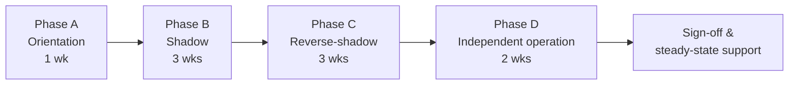

# Knowledge Transfer (KT) Plan

**Goal:** a support team that did not build the platform can run, change and extend it safely **for 10+ years**. That team may be TASCO IT, VETC IT or a different vendor. The platform was designed for this:

- business behaviour lives in **versioned rule sets** (`config/rules/*.json`, then the Rules studio);
- infrastructure lives behind **ports and adapters** (`src/adapters/*`, wired only in `src/bootstrap/container.js`);
- the whole stack is plain Node.js (≥ 22.12) with a single runtime dependency (`pg`) and standard PostgreSQL.

KT must leave the receiving team able to make the common changes **without the original authors**.

---

## 1. KT phases

| Phase | Duration | Who leads | What the receiving team does | Exit criteria |
|---|---|---|---|---|
| **A. Orientation** | 1 week | iorta | Attends architecture and domain sessions, sets up a local environment (`npm install`, `npm run dev`, demo sign-in), reads the documentation set | Every receiving engineer has run the app locally, signed in as each role and run `npm test` |
| **B. Shadow** | 3 weeks | iorta does, receiver observes | Pairs on real tickets, incidents, releases and rule changes. Takes notes into the runbooks. | Receiver has observed at least one of each: release, incident, rule change, ingestion batch, DR drill |
| **C. Reverse-shadow** | 3 weeks | Receiver does, iorta observes and coaches | Handles L2/L3 tickets, makes code changes, runs releases and on-call with iorta as backup | KT exercises (section 4) passed. ≥ 80 % of tickets resolved by the receiver without iorta hands-on help. |
| **D. Independent** | 2 weeks | Receiver | Full ownership. iorta is available for questions only (time-boxed). | No P1/P2 incident needing iorta intervention. Sign-off checklist complete. |

KT starts during Pilot (see [project-plan.md](project-plan.md)) so that the receiving team experiences live operations, and finishes 8 weeks after Wave 2.

---

## 2. Audiences

| Audience | Typical size | Goal |
|---|---|---|
| **Platform engineers** (backend/frontend) | 2–4 | Change and extend the code base |
| **Operations / SRE / support** (L2) | 2–3 | Run, monitor, recover, run jobs |
| **Business configurators** (product analysts, rule authors) | 2–4 | Change behaviour through the Rules studio without code |
| **Rule approvers / compliance** | 2–3 | Govern changes, audit, DSAR |
| **Data stewards** | 1–2 | Data quality, ingestion, lineage |
| **Security** | 1 | Access reviews, key rotation, RBAC changes |

---

## 3. Curriculum per role

Each module lists duration, format and the **actual files** covered.

### 3.1 Architecture foundations (all technical roles, 1 day)

| # | Topic | Files / resources |
|---|---|---|
| 1 | Hexagonal architecture: domain (pure functions), application services, adapters, composition root | `src/domain/*`, `src/application/*`, `src/adapters/*`, `src/bootstrap/container.js` |
| 2 | HTTP layer: route table, auth types (`public`, `staff`, `customer`, `partner`), permission per route, validation schemas, rate limiting, idempotency, error format, OpenAPI | `src/adapters/http/routes.js`, `router.js`, `app.js`, `security.js`, `openapi.js`, `src/shared/validation.js`, `src/shared/errors.js` |
| 3 | Persistence: store abstraction, in-memory vs PostgreSQL, PII encryption codec and blind index, migrations | `src/adapters/persistence/memoryStore.js`, `postgresStore.js`, `codec.js`, `schema.js`, `schemaSql.js`, `query.js`, `db/migrations/001_init.sql` |
| 4 | Events: outbox event bus, subscribers, idempotent handlers | `src/adapters/messaging/outboxEventBus.js`, `registerSubscribers()` in `src/bootstrap/container.js` |
| 5 | Security model: RBAC, ABAC, PII masking, MFA, lockout, JWT, demo mode guard | `config/security/rbac.json`, `config/rules/abac.json`, `src/application/accessPolicy.js`, `src/application/identityService.js`, `src/shared/crypto.js`, `src/shared/config.js` |
| 6 | Audit hash chain | `src/application/auditService.js`, `src/adapters/persistence/auditChain.js` |
| 7 | Configuration (12-factor), secrets via `<NAME>_FILE` | `src/shared/config.js` |
| 8 | Observability: structured logs with request id, `/metrics`, `/health/live`, `/health/ready` | `src/shared/logger.js`, `src/shared/metrics.js`, `src/adapters/http/app.js` |
| 9 | Resilience: circuit breakers per gateway, compensation on issuance failure | `src/shared/resilience.js`, `src/application/salesService.js` (`purchase`) |

### 3.2 Domain walkthrough (engineers, business configurators, 1 day)

| # | Domain area | Files |
|---|---|---|
| 1 | Identity resolution: plates and phones | `src/domain/identity.js` |
| 2 | Enrichment and golden record: survivorship, expiry evidence, corroboration, category inference, DQ score | `src/domain/enrichment.js`, `config/rules/enrichment.json`, `src/application/ingestionService.js` |
| 3 | Lead scoring, tiers, NBA, journey placement, touchpoint planning, benefits relevance | `src/domain/leads.js`, `config/rules/scoring.json`, `nba.json`, `journeys.json`, `benefits.json`, `src/application/leadService.js` |
| 4 | Journeys and moments of truth; contact policy and copy guard | `src/application/journeyService.js`, `src/domain/contactPolicy.js`, `config/rules/contact_policy.json`, `copy_guard.json`, `triggers.json`, `content.messages.json` |
| 5 | Voice bot dialogue state machine and handoff summary | `src/domain/voicebot.js`, `config/rules/content.voicebot.json`, `src/application/voiceService.js`, `src/adapters/integrations/simulatedCaller.js` |
| 6 | Rating and purchase: three rating methods, quote TTL, idempotent purchase, compensation, e-certificate verification | `src/domain/rating.js`, `config/rules/products.json`, `tariff.*.json`, `rating.*.json`, `src/application/salesService.js` |
| 7 | Partners and commission | `src/application/partnerService.js`, `config/rules/commission.json` |
| 8 | Claims FNOL state machine | `src/application/claimsService.js` (`TRANSITIONS`) |
| 9 | Customer self-service and data subject rights | `src/application/customerService.js` |
| 10 | Insights and governance dashboards | `src/application/insightsService.js`, `config/rules/costs.json` |
| 11 | Operations jobs: reconciliation, retention, relay | `src/application/opsService.js`, `src/jobs/cli.js`, `config/rules/retention.json` |

### 3.3 Rules engine deep dive (engineers + business configurators + approvers, 1 day)

1. JSON Logic subset and custom operators (`clamp`, `cat`, `round`, …): `src/rules/jsonLogic.js`.
2. Decision tables with hit policy `first` and a `default`: `src/rules/decisionTable.js`.
3. Validation per kind (embedded logic, tables, commission caps, copy guard for `content.*` and `benefits`): `src/rules/validators.js`.
4. Lifecycle `draft → pending_approval → active → retired` (or `rejected`), four-eyes, rollback-as-new-draft, cache TTL of 15 s with event invalidation: `src/application/rulesService.js`.
5. Simulation: `POST /api/rules/simulate` compares current and candidate evaluation for a customer (`scoring`, `nba`, `journeys`, `benefits`).
6. Hands-on lab: change the hot-tier threshold in `scoring`, simulate on three customers, submit, approve as a second user, watch leads recompute (`POST /api/leads/recompute`).

### 3.4 How-to: adding a product through configuration (business configurators + engineers, half day)

The platform supports three generic rating methods in code: `tariff_table`, `rate_on_sum_insured` and `per_seat`. A product that fits one of these needs **no code**:

1. Create the rate rule set (for example kind `rating.tyre_cover`). Its payload must match the method's inputs; follow `rating.pa_seat.json` or `rating.motor_pd.json`. Kind names must match `^[a-z_]+(\.[a-z_]+)?$`.
2. Create a new version of `products` adding the product entry: `code` (uppercase, matching `^[A-Z][A-Z0-9_]+$`), `name`/`nameVi`, `rating.method`, `rating.ruleKind`, `priceRegulated`, `channels` (a subset of `vetc_app`, `zalo`, `telesales`, `voice_bot`, `partner_api`), `status: "active"`.
3. Optionally add it to a bundle in `products.bundles`, add a benefit item of type `cover_upgrade` in `benefits` (with `legalStatus`), and add a commission rule with a statutory cap in `commission`.
4. Validate, simulate, submit and approve (by Underwriting or Compliance).
5. **Code is needed only if** a new rating method is required (add to `METHODS` in `src/domain/rating.js` with unit tests), or if the product needs new quote options (extend `PRODUCT_LINES.options` in `src/adapters/http/routes.js`).

### 3.5 How-to: adding or changing a journey (business configurators, half day)

1. Journeys are defined in the `journeys` rule set: `id`, `objective`, `priority` (first match wins), `audience` (JSON Logic over lead facts such as `days`, `insurer`, `expiryConfidence`, `tagAgeDays`), `anchor` (`expiry`, `today`, `tagActivatedAt`) and `steps` (offset in days, channels in fallback order, `marketing` flag, `template`, optional `onlyTiers`).
2. Add any new message template to `content.messages` (Vietnamese plus English; placeholders `{{plate}}`, `{{expiry}}`, `{{days}}`, `{{premium}}`, `{{link}}`, `{{benefit}}`). The copy guard validates it.
3. If the journey reacts to an ecosystem event, add a trigger in `triggers` (`event`, `action` = `enrol_journey` or `send`, `when`, `channels`, `template`).
4. Add the NBA rule in `nba` if staff need a new guided action.
5. Simulate with kind `journeys` and `nba`, then submit and approve. **ZNS templates need Zalo approval before activation.**
6. Code is needed only for a new channel type (a new notification port) or a new anchor type (`planTouchpoints` in `src/domain/leads.js`).

### 3.6 How-to: adding a port adapter (engineers, 1 day)

Example: replace the sandbox VETC wallet with the real VETC wallet API.

1. Study the port contract in `src/adapters/integrations/mockGateways.js` (`debit({ idempotencyKey, customerId, amount, description })`, `refund({ transactionId, amount })`, `name`).
2. Implement `src/adapters/integrations/vetcWalletHttp.js` with the same method signatures. Use the idempotency key as the VETC request id, map errors to `errors.upstream`/`errors.validation`, and never log PII.
3. Wire it in `src/bootstrap/container.js` (the **only** place adapters are chosen), keeping the circuit breaker wrapper `breaker('vetc-wallet', …)`.
4. Add configuration through environment variables and secrets through `<NAME>_FILE` in `src/shared/config.js`. Production must fail fast if they are missing.
5. Add contract tests that run against both the mock and the real sandbox.
6. Confirm that the Operations page shows the integration and its circuit state (`GET /api/ops/status`).

The same pattern applies to `createTascoCoreGateway` (policy admin), `createNotificationGateway` (app push, Zalo ZNS, SMS), `createSimulatedCaller` (telephony / voice-AI) and the staff IdP (OIDC federation behind `identityService.authenticate`).

### 3.7 Operations runbooks (ops/SRE, 2 days including drills)

The authoritative runbooks are in [`docs/operations/runbook-and-support-guide.md`](../operations/runbook-and-support-guide.md) (incident runbooks **RB-01 … RB-15** and standard operating procedures **SOP-01 … SOP-09**), together with [`docs/operations/dr-bcp.md`](../operations/dr-bcp.md) and [`docs/operations/monitoring-and-alerting.md`](../operations/monitoring-and-alerting.md). KT covers them as the topics below. The receiving team runs each one hands-on.

| KT topic | Covered by (operations docs) | Hands-on in KT |
|---|---|---|
| Scheduled jobs: journeys, recompute, reconcile, retention, relay (`npm run job -- <name>`) | SOP-09 Re-running scheduled jobs | Run each job and read its summary and job history |
| Database down, readiness failing, restore | RB-01, `dr-bcp.md` §6 | **Drill:** point-in-time restore, `npm run migrate`, verify `/health/ready`, audit chain and reconciliation |
| Integration circuit open (wallet, TASCO core, messaging, voice-AI) | RB-02 … RB-05 | Simulate a gateway failure in SANDBOX and watch the circuit in `/api/ops/status` |
| Outbox backlog | RB-06 | Run relay (`POST /api/ops/jobs/relay`) |
| Journey run skipped many touchpoints | RB-07 | Interpret skip reasons (consent, window, caps, copy guard) |
| Audit chain verification fails | RB-08 | **Drill:** tabletop exercise with Security |
| Lockouts, MFA reset, password reset | RB-09, SOP-08 | Unlock and replace an account in SANDBOX |
| Rule set activated by mistake | RB-10 | Roll back through the Rules studio (new draft plus approval) |
| Payment captured but issuance failed | RB-11 | Reconciliation and refund verification |
| Latency, memory, certificate verification, partner API failures | RB-12 … RB-15 | Read `/metrics` and logs by `requestId` |
| Key and secret rotation | SOP-01 (`DATA_KEYS`), SOP-02 (`JWT_SECRET`) | **Drill:** rotate the data key in SANDBOX |
| Partner key issue, rotation and revocation | SOP-04 | **Drill:** revoke a compromised key |
| DSAR, data correction, outbound kill switch, offboarding | SOP-05, SOP-06, SOP-07, SOP-03 | Walk-through with Compliance and Data |

### 3.8 Business user curricula
These are covered in [change-management-and-training.md](change-management-and-training.md) and the persona manuals in `docs/manuals/`.

---

## 4. KT exercises (practical assessment)

Each receiving engineer must complete these unaided during reverse-shadow:

| # | Exercise | Pass criteria |
|---|---|---|
| E1 | Run the stack locally with PostgreSQL (`DATABASE_URL`), migrate, seed and sign in as `approver` with MFA | Done in < 1 hour |
| E2 | Add a new permission and role mapping for a new read-only "reporting" role through a pull request | Tests prove 403/200 per role. Security review completed. |
| E3 | Add a new product through configuration only (for example a PA variant with different sums insured) | Quote works through `POST /api/quotes`. Copy guard passes. No code change. |
| E4 | Add a new journey step and template, simulate, approve with a second user | Touchpoints scheduled correctly for the test customer |
| E5 | Implement a fake "SMS v2" adapter behind the notification port and wire it in the container | Journeys send through it. The circuit breaker shows in ops status. |
| E6 | Diagnose a seeded incident (for example payment gateway failing, causing `payment_failed` orders) using logs, metrics and reconciliation | Root cause found and documented within 2 hours |
| E7 | Perform a DSAR export and an erasure (on a customer with no active policy) and verify audit entries | Correct audit actions `dsar.access_exported`, `dsar.erased` |
| E8 | Release to staging with the full quality gate (lint, tests, coverage, audit) and roll back | Successful release and rollback |

---

## 5. Code walkthrough plan

Sessions are 90 minutes, recorded and stored with the KT pack.

| Session | Title | Walkthrough path |
|---|---|---|
| CW-1 | Request lifecycle | `src/server.js` → `src/adapters/http/app.js` (`handle`: request id, security headers, CORS, health, rate limit, `authenticate`, permission, validation, idempotency, error mapping) → `router.js` → a handler in `routes.js` |
| CW-2 | Composition root | `src/bootstrap/container.js`: config → logger/metrics/clock → cipher/codec → store → rbac → event bus → audit → rules → gateways with breakers → signed links → services → subscribers |
| CW-3 | From raw record to lead | `POST /api/data/ingest` → `ingestionService.ingest` → `rebuild` → `domain/enrichment.buildProfiles` → event `profiles.rebuilt` → `leadService.recompute` → `domain/leads.evaluateLead` → `planTouchpoints` |
| CW-4 | From touchpoint to message | `journeyService.runDue` → `executeTouchpoint` → `contactPolicy.canContact` → `sendMessage` (template, copy guard, gateway) |
| CW-5 | Voice bot to sale | `voiceService.start/turn` → `domain/voicebot` (states `verify_plate → confirm_expiry → offer`, outcomes) → `finalize` (handoff, link, opt-out, DQ) → `PATCH /api/handoffs/:id` → `POST /api/quotes` → `POST /api/orders` → `salesService.purchase` → `policy.issued` subscribers (confirmation, cross-sell) |
| CW-6 | Rules governance | `routes.js` rules section → `rulesService` lifecycle → `validators.js` → `jsonLogic.js` / `decisionTable.js` → simulate handler |
| CW-7 | Access control | `rbac.json` → `accessPolicy.require/check/maskProfile` → ABAC policies in `abac.json` → handoff and customer routes |
| CW-8 | Customer app and partner API | `/api/customer/*` (session via signed link, `links.verify`) and `/api/partner/v1/*` (`partners.authenticateKey`, onboarding unknown plates) |
| CW-9 | Data at rest | `codec.js` (field encryption, blind index), `postgresStore.js`, `schemaSql.js`, migrations |
| CW-10 | Operations and jobs | `src/jobs/cli.js`, `opsService` (reconcile, retention, DQ, lineage), `insightsService` |
| CW-11 | Front-end (v1 UI) | `public/` staff console, customer app, verify page; i18n dictionaries, design tokens, help content |

---

## 6. KT artefacts (handover pack)

| Artefact | Location | Owner |
|---|---|---|
| Architecture overview and ADRs | `docs/architecture/` | Architect |
| OpenAPI specification (generated) | `GET /api/openapi.json`, `docs/api/openapi.json` (`npm run job -- openapi`) | Engineers |
| Rule catalogue: each kind, purpose, owner, approver | Rules studio + `config/rules/*.json` descriptions | BA |
| Runbooks RB-01 … RB-15 and SOP-01 … SOP-09 | `docs/operations/runbook-and-support-guide.md`, `dr-bcp.md`, `monitoring-and-alerting.md` | DevSecOps |
| Persona manuals | `docs/manuals/` | BA / UX |
| UX design system and standards | `docs/ux/` | UX |
| Test strategy and automated suites | `test/` (unit, integration, api, pg, security, perf) | QA |
| Environment and secrets inventory (no secret values) | Secret manager + inventory sheet | DevSecOps |
| Vendor contacts, contracts and SLAs | Service management tool | Delivery Lead |
| Session recordings (CW-1 … CW-11) | KT repository | Delivery Lead |
| Known issues and technical debt register | Tracker | Architect |

---

## 7. Sign-off criteria

KT is complete when **all** of the following are true and signed by the TASCO IT Head (accountable) and the iorta Delivery Lead:

1. All curriculum modules delivered, attendance ≥ 90 % for the target audience.
2. KT exercises E1–E8 passed by at least **two** receiving engineers each (no single point of knowledge).
3. Each runbook in section 3.7 executed at least once by the receiving team, including the drills marked **Drill** (database restore, audit-chain tabletop, data-key rotation, partner-key revocation).
4. Receiving team resolved ≥ 80 % of tickets in reverse-shadow and 100 % in the independent phase without hands-on iorta help.
5. One production release and one rule change done end-to-end by the receiving team.
6. Handover pack complete and reviewed. Documentation gaps logged and closed.
7. Access transferred: repository admin, CI, secret manager, monitoring, vendor portals. Departing iorta accounts disabled and reviewed (access review).
8. Confidence survey of the receiving team ≥ 4/5 on every component.

## 8. Long-term maintainability (10+ years)

- **Dependencies:** keep the runtime dependency surface minimal (today: `pg` only). Upgrade Node.js LTS on its two-year cycle. `npm run audit` runs in CI.
- **Rules over code:** most change requests (tariff updates, new templates, journey timings, benefits, commission rates) are rule changes with an audit trail, which avoids code drift.
- **Ports isolate vendors:** voice-AI, messaging, payment and core-system changes are adapter swaps.
- **Documentation is part of the DoD:** manuals and help text are updated with every story.
- **Annual architecture health check:** dependency review, security posture, data growth, performance at the base size, and an ADR review.
