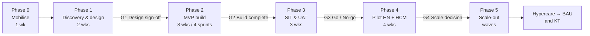
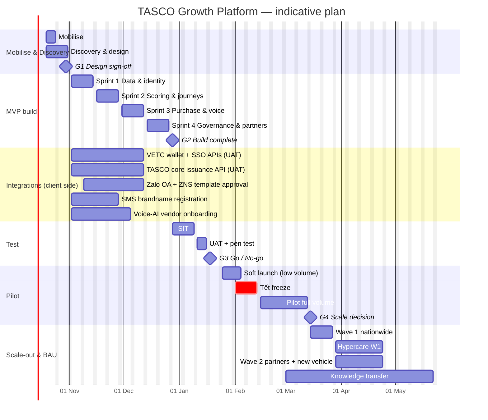

# Project Plan — TASCO Growth Platform (TASCO Insurance × VETC)

| Item | Value |
|---|---|
| Programme | Motor insurance growth platform: new business + renewals through the VETC ecosystem |
| Client | TASCO Insurance (subsidiary of Tasco JSC) with VETC as ecosystem/channel partner |
| Delivery partner | iorta TechNXT |
| Codebase | `tasco-growth-platform` v1.0.0 (Node.js ≥ 22.12, PostgreSQL or in-memory store) |
| Document owner | iorta TechNXT Delivery Lead |
| Status | Baseline v1.0, for Steering Committee approval |

> All dates are **indicative** and assume kick-off on **Monday 19 October 2026**. They are re-baselined at the end of Discovery (Gate G1). The plan explicitly protects the **Tết Nguyên Đán 2027 period (≈ 5–14 February 2027)** with a change freeze: no go-live, no pilot start and no major release in that window.

---

## 1. Objectives and success measures

The business problem the platform addresses:

| Problem today | Platform response | Where in the code |
|---|---|---|
| Near-zero renewals through TASCO's own channels | Renewal and conquest journeys, one-tap renewal in the VETC app / Zalo | `config/rules/journeys.json`, `src/application/journeyService.js`, `/api/customer/*` |
| Weak data — roughly 1 in 10 records carries a valid policy stamp | Data enrichment and master data management (MDM) with survivorship, expiry inference, confidence and lineage; customers and the voice bot confirm expiry | `config/rules/enrichment.json`, `src/application/ingestionService.js`, `POST /api/customer/expiry` |
| Low trust in sales calls | Voice bot discloses it is automated, verifies the **plate first**, never asks for OTP or payment, then hands off to telesales with a summary | `config/rules/content.voicebot.json`, `src/domain/voicebot.js` |
| Discounts are illegal for price-regulated TNDS | Value beyond discount (roadside, e-certificate, auto-renew, inspection, claims fast-lane, add-on covers); copy guard blocks discount wording | `config/rules/benefits.json`, `config/rules/copy_guard.json` |
| Partners close most deals | Partner API with transparent, capped commission | `/api/partner/v1/*`, `config/rules/commission.json` |
| Changing business rules needs code changes | Rules studio with versioning, simulation and maker-checker approval | `src/application/rulesService.js`, `/api/rules/*` |

Programme success measures. All targets are **proposed** and are confirmed at G1:

| KPI | Baseline | Pilot target (proposed) | Scale target (proposed) |
|---|---|---|---|
| Renewal rate of TASCO-insured vehicles in the pilot cohort through own/VETC channels | ≈ 0 % | ≥ 15 % | ≥ 35 % |
| Share of pilot renewals completed in-app (VETC app / Zalo) | n/a | ≥ 50 % | ≥ 65 % |
| Profiles with usable expiry (confidence ≥ 0.5) | ≈ 10 % | ≥ 30 % in pilot cohort | ≥ 50 % of base |
| Taps from renewal link to e-certificate | n/a | ≤ 3 | ≤ 3 |
| Handoff first-contact time (voice bot → telesales) | n/a | ≤ 2 business hours | ≤ 1 business hour |
| Rule change lead time (draft → active) | weeks (code release) | ≤ 1 business day | ≤ 1 business day |
| Blocked messages caused by copy-guard violations reaching customers | n/a | 0 | 0 |

---

## 2. Phases

### Phase 0 — Mobilise (1 week, overlaps Discovery)
- Contract, statement of work, team onboarding, access to TASCO and VETC sandboxes.
- Repository, CI pipeline (`npm run lint`, `npm test`, `npm run test:coverage`, `npm run audit`) and environments DEV and SANDBOX (demo mode) are stood up.
- Kick-off with the Steering Committee and the RACI agreed (see [raci.md](raci.md)).

### Phase 1 — Discovery and design (2 weeks)
| Week | Activities | Outputs |
|---|---|---|
| D1 | Stakeholder interviews (TASCO business, compliance, IT; VETC product, data, call centre); review of current renewal funnel; data-sample profiling of VETC accounts and TASCO core extracts; partner landscape | As-is journey maps, data-quality baseline, regulatory constraints log |
| D2 | To-be journeys; UX prototypes of the staff console and customer app (see `docs/ux/`); integration contracts for the VETC wallet, VETC SSO, TASCO core policy admin, Zalo ZNS, SMS brandname and the voice-AI vendor; rules inventory (all 20 rule kinds in `config/rules/`); NFRs; security threat model | Signed-off designs, integration interface agreements (IIAs), backlog with MVP scope, refined plan |

**Gate G1 — Design sign-off:** UX prototypes accepted, IIAs signed by VETC and TASCO IT, legal positions recorded on (a) benefits wording, (b) contact policy / anti-spam, (c) PDP consent wording, (d) loyalty points and referral (currently `pending_legal_review` in `benefits.json` and `referral.json`).

### Phase 2 — MVP build (8 weeks, 4 two-week sprints; can compress to 6 weeks if VETC APIs are ready at G1)
| Sprint | Goal | Key backlog items |
|---|---|---|
| S1 | **Data foundation and identity** | Postgres store and migrations (`db/migrations/001_init.sql`), ingestion of VETC/TASCO extracts (`POST /api/data/ingest`), golden record and DQ issues, staff sign-in with MFA, RBAC/ABAC, audit chain, staff console shell (navigation, i18n, themes, help drawer) |
| S2 | **Scoring, journeys and messaging** | Explainable lead scoring and NBA, Leads and Customer 360 pages, journey engine with contact policy and copy guard, Zalo ZNS / SMS / push adapters (sandbox → real), Journeys page |
| S3 | **Purchase and voice** | Quote → pay (VETC wallet) → issue (TASCO core) → e-certificate with QR, customer app (`/app/`), public verification (`/verify/<certNo>`), voice bot console and campaign, telesales inbox with handoffs |
| S4 | **Governance, partners, claims, operations** | Rules studio (maker-checker, simulate), partner onboarding and API keys, partner API, commission statements, claims FNOL queue, DSAR, governance and adoption dashboards, Operations page (jobs, integrations status), hardening, performance tests (`npm run test:perf`) |

**Gate G2 — Build complete:** all MVP stories meet the Definition of Done (see [delivery-methodology.md](delivery-methodology.md)); coverage ≥ 80 % lines and functions and ≥ 70 % branches (enforced by `npm run test:coverage`); no open critical or high findings from SAST/DAST or `npm audit`; WCAG 2.2 AA checks passed on the core flows.

### Phase 3 — SIT and UAT (3 weeks)
| Week | Focus |
|---|---|
| T1 | System integration testing against VETC and TASCO UAT endpoints: wallet debit/refund idempotency, policy issuance and compensation, SSO token exchange, ZNS template delivery, telephony. Reconciliation job (`POST /api/ops/jobs/reconciliation`) proven. |
| T2 | User acceptance testing by role, using the persona manuals in `docs/manuals/` as test scripts; usability tests with telesales agents and customers (see `docs/ux/usability-testing-plan.md`); penetration test by an independent party |
| T3 | Defect fixing, regression, operational readiness review (runbooks, on-call, DR test), training of pilot users, data load of the pilot cohort |

**Gate G3 — Go / No-go for pilot:** UAT sign-off by the TASCO business owner; compliance sign-off of scripts, templates and benefits; security sign-off; operational acceptance by the support team; Zalo ZNS templates approved by Zalo.

### Phase 4 — Pilot (4 weeks, Hà Nội + TP. Hồ Chí Minh)
- Proposed cohort: TASCO-insured and conquest vehicles registered in Hà Nội and TP.HCM with expiry in the next 15–60 days, plus lapsed vehicles (≤ 60 days), capped at an agreed volume of **50k–100k vehicles** (consistent with `docs/business/07-commercials-and-engagement-model.md`).
- Two telesales squads (one per city) using the telesales inbox, plus a supervisor per squad. Agents `agent.hn` and `agent.hcm` in the demo data mirror this setup.
- Weekly pilot review covering funnel, contact-policy blocks, voice bot outcomes, plate-verification failure rate, opt-out rate, CSAT and defects.
- A/B design: control group with business-as-usual reminders, test group with full journeys.

**Gate G4 — Scale decision:** pilot KPIs against targets, no unresolved regulatory issue, unit economics from `/api/dashboard/overview` (`economics` block) validated with contracted rates in `config/rules/costs.json`.

### Phase 5 — Scale-out (waves)
| Wave | Scope | Indicative timing |
|---|---|---|
| W1 | All provinces, car TNDS renewal + conquest + lapsed recovery | Pilot end + 2 weeks |
| W2 | Partner API live with the first partners (bank, showroom, inspection centre); new-vehicle journey from `vetc.tag_activated` events | W1 + 4 weeks |
| W3 | Add-on covers at scale (PA per seat, physical damage with inspection flow), motorbike TNDS in the app, loyalty points and referral **only if legally approved** | W2 + 6 weeks |
| W4 | Advanced analytics (ML model behind the scoring port, with bias monitoring), LLM-assisted intent classification behind the NLU port | Roadmap |

Hypercare runs for **4 weeks after each wave**, followed by BAU support and the knowledge transfer described in [kt-plan.md](kt-plan.md).

---

## 3. Milestones

| ID | Milestone | Indicative date | Evidence / gate criteria | Approver |
|---|---|---|---|---|
| M0 | Kick-off | 19 Oct 2026 | Signed SoW, RACI accepted | SteerCo |
| M1 | Discovery complete (G1) | 30 Oct 2026 | Signed designs, IIAs, legal positions log | TASCO Business Owner, VETC Product Owner, Compliance |
| M2 | Sprint 1 demo: data and identity | 13 Nov 2026 | Ingestion of real sample, MFA login, audit chain verifies (`GET /api/audit/verify`) | Product Owner |
| M3 | Sprint 2 demo: scoring and journeys | 27 Nov 2026 | Explainable scores, journey dry run with contact policy | Product Owner |
| M4 | Sprint 3 demo: one-tap purchase and voice | 11 Dec 2026 | End-to-end renewal in ≤ 3 taps, e-certificate QR verifies | Product Owner, VETC App Lead |
| M5 | Build complete (G2) | 25 Dec 2026 | DoD met, quality gates green | Delivery Lead, TASCO IT |
| M6 | SIT complete | 8 Jan 2027 | All integration test cases passed | TASCO IT, VETC IT |
| M7 | UAT sign-off, Go/No-go (G3) | 22 Jan 2027 | UAT, security and compliance sign-offs | SteerCo |
| — | **Tết change freeze** | 1 – 14 Feb 2027 | No production change except emergency fixes | CAB |
| M8 | Pilot start | 25 Jan 2027 (soft launch, low volume) / full volume 15 Feb 2027 | Pilot cohort loaded, squads trained | SteerCo |
| M9 | Pilot review (G4) | 12 Mar 2027 | Pilot report, scale decision | SteerCo |
| M10 | Scale-out W1 live | 29 Mar 2027 | Nationwide car TNDS | SteerCo |
| M11 | Partner API live (W2) | 26 Apr 2027 | First 3 partners transacting | Partner Manager, Compliance |
| M12 | KT complete, BAU handover | W2 + 8 weeks | KT sign-off criteria met | TASCO IT Head |

---

## 4. Gantt chart

---

## 5. Workstreams

| # | Workstream | Lead (accountable) | Scope |
|---|---|---|---|
| WS1 | Product and business change | TASCO Product Owner | Backlog, priorities, business rules content, pilot design, KPIs |
| WS2 | Data and MDM | iorta Data Engineer + VETC Data Lead | Extracts, ingestion, enrichment rules, DQ triage, lineage, data steward process |
| WS3 | Platform engineering | iorta Solution Architect | Backend services, rules engine, journeys, voice bot, purchase flow, partner API |
| WS4 | Experience (UX/UI) | iorta UX Lead | Staff console, customer app, verification page, design system, accessibility |
| WS5 | Integrations | iorta Integration Engineer + TASCO IT + VETC App Lead | VETC wallet, SSO and events; TASCO core; Zalo OA/ZNS; SMS; telephony/voice AI |
| WS6 | Security, privacy and compliance | TASCO CISO + Compliance | Threat model, pen test, PDP (Decree 13/2023/ND-CP), anti-spam (Decree 91/2020/ND-CP), Law on Insurance Business 08/2022/QH15, DPIA |
| WS7 | Quality engineering | iorta QA Lead | Test strategy, automation, performance, accessibility, UAT coordination |
| WS8 | DevSecOps and operations | iorta DevSecOps | CI/CD, environments, observability (`/metrics`, `/health/*`), backups, DR, runbooks |
| WS9 | Change, training and adoption | TASCO Change Lead + iorta BA | Change impact, communications, training, champions (see [change-management-and-training.md](change-management-and-training.md)) |
| WS10 | Partner channel | TASCO Partner Manager | Partner selection, commercial terms, onboarding and API certification |

---

## 6. Dependencies

| ID | Dependency | Provider | Needed by | Impact if late | Mitigation |
|---|---|---|---|---|---|
| D-01 | VETC data extract (accounts, vehicles, tags, toll class, app activity) with a legal basis for processing | VETC Data + Legal | S1 start | No real data for scoring; pilot cohort cannot be selected | Synthetic generator (`src/adapters/integrations/syntheticVetcSource.js`) keeps build moving; data-sharing agreement drafted in Discovery |
| D-02 | VETC wallet debit/refund API with idempotency | VETC IT | S3 | No one-tap payment | Sandbox gateway (`mockGateways.js`) with the same port contract; contract tests |
| D-03 | VETC SSO token exchange for the in-app webview | VETC App | S3 | Customer app limited to signed renewal links | Signed links (`/app/?r=…`) already work independently of SSO |
| D-04 | VETC app release slot (entry point, deep link, push) | VETC App | Pilot | Customers cannot reach the app journey | Zalo OA mini app and SMS links as fallback channels |
| D-05 | VETC ecosystem events (`vetc.tag_activated`, `vetc.inspection_booked`, `vetc.wallet_topped_up`, `vetc.long_trip_started`) | VETC IT | W2 | No moment-of-truth triggers | Batch replay through `POST /api/ecosystem/events` |
| D-06 | TASCO core policy admin issuance API and certificate numbering | TASCO IT | S3 | No issuance | Sandbox issuance; reconciliation job finds mismatches |
| D-07 | Zalo OA verification and **ZNS template approval** (each template in `content.messages.json`) | Zalo / VNG, VETC Marketing | Pilot −2 weeks | No Zalo channel | Submit templates in S2; push and SMS fall back automatically through journey channel order |
| D-08 | SMS brandname registration (VETC / TASCO) with the carriers | SMS vendor, VETC | Pilot −2 weeks | No SMS channel | Use an existing VETC brandname |
| D-09 | Voice-AI vendor (ASR/TTS for Vietnamese northern, central and southern accents), SIP trunk, call recording | Vendor | S3 | Voice bot only in console mode | Console mode (`/api/voice/sessions`) for testing; telesales-only fallback |
| D-10 | Legal opinions: benefits wording, loyalty points, referral, contact frequency, consent text | TASCO Legal / Compliance | G1 (initial), G3 (final) | Features held back | Feature flags via `legalStatus` and `enabled` fields in rules; only `approved` benefits reach customers |
| D-11 | TASCO IdP (Azure AD / Keycloak via OIDC) for staff SSO | TASCO IT | Scale-out | Local accounts with TOTP remain | Token contract unchanged (identity service comment, ADR-007) |
| D-12 | Production hosting, PostgreSQL, secrets (`JWT_SECRET`, `DATA_KEYS`, `BLIND_INDEX_KEY`) | TASCO IT / cloud provider | SIT | No production-like test | Production config refuses to boot without secrets — tested in SIT |
| D-13 | Partner commercial agreements and Ministry of Finance commission caps confirmed | TASCO Finance / Legal | W2 | Partner API cannot go live | Caps enforced in `commission.json` (`statutoryCaps`) and by validators |

---

## 7. Resource plan

### 7.1 iorta TechNXT team (FTE by phase)

| Role | Discovery | Build | SIT/UAT | Pilot | Scale-out / Hypercare |
|---|---|---|---|---|---|
| Delivery Lead | 1 | 1 | 1 | 1 | 0.5 |
| Solution Architect | 1 | 1 | 0.5 | 0.5 | 0.25 |
| Business Analyst | 1.5 | 1 | 1 | 0.5 | 0.5 |
| UX/UI Designer | 1 | 1 | 0.5 | 0.5 | 0.25 |
| Backend Engineers (Node.js) | 1 | 3 | 2 | 1.5 | 1 |
| Frontend Engineers | 0.5 | 2 | 1.5 | 1 | 0.5 |
| Data Engineer | 1 | 1 | 0.5 | 0.5 | 0.5 |
| Integration Engineer | 0.5 | 1 | 1 | 0.5 | 0.25 |
| QA Engineers (manual + automation) | 0.5 | 2 | 2 | 1 | 0.5 |
| DevSecOps Engineer | 0.5 | 1 | 1 | 1 | 0.5 |
| Data Scientist (scoring, bias monitoring) | 0.25 | 0.5 | 0.25 | 0.5 | 0.5 |
| **Total** | **8.75** | **14.5** | **11.25** | **8.5** | **5.25** |

### 7.2 Client-side commitments (minimum)

| Organisation | Role | Commitment |
|---|---|---|
| TASCO | Business Owner (sponsor) | SteerCo, gates |
| TASCO | Product Owner | 100 % during Build to Pilot |
| TASCO | Compliance / Legal | 2 days per week; rule approver role (`rule_approver`, `compliance_officer`) |
| TASCO | IT integration lead and core-system engineer | 50 % during Build and SIT |
| TASCO | CISO / security analyst | Threat model, pen-test scoping, sign-off |
| TASCO | Underwriting / actuarial | Confirms tariffs (`tariff.*`) and illustrative rates (`rating.motor_pd`, `rating.pa_seat`) before go-live |
| TASCO | Claims lead | FNOL process, claims handler role |
| VETC | Product Owner | 50 % |
| VETC | App lead + 2 mobile engineers | Entry point, deep links, SSO, wallet confirmation UX |
| VETC | Data engineer | Extracts, events |
| VETC | Call-centre / telesales manager + 2 supervisors + pilot agents | Training, pilot operations |

### 7.3 Environments

| Env | Purpose | Data | Demo mode |
|---|---|---|---|
| DEV | Developer integration | Synthetic (`SEED_RECORDS`) | On |
| SANDBOX / TRAINING | Demos, training, usability tests | Synthetic, reset nightly with `npm run seed` | On (`/api/demo/totp/:username` available) |
| SIT | Integration with VETC/TASCO UAT | Masked production-like | Off |
| UAT | Business acceptance | Masked production-like | Off |
| PROD | Live | Real | **Off — the server refuses to start with `DEMO_MODE` in production unless explicitly overridden** |

---

## 8. Governance and reporting (summary)

- **Steering Committee** every 2 weeks during Build to Pilot, then monthly. It is chaired by the TASCO Business Owner, with the VETC Product Director, the TASCO CIO and Compliance Head, and the iorta TechNXT Engagement Director.
- **Design Authority** meets weekly and owns architecture decisions, integration contracts and security exceptions.
- **Change Advisory Board (CAB)** owns production changes and RBAC changes (`config/security/rbac.json` is changed only through code review plus CAB). Business rules do **not** go through CAB, because they follow maker-checker in the Rules studio.
- Weekly status report: RAG, burn-up, milestone forecast, top risks from [risk-register.md](risk-register.md), decisions needed.

The full governance model is in [delivery-methodology.md](delivery-methodology.md).

---

## 9. Assumptions and constraints

1. The MVP scope is the capability already present in the v1 codebase. Build effort focuses on productionising: real adapters, UI, hardening, data migration and test automation.
2. TNDS premiums follow Decree 67/2023/ND-CP (`tariff.tnds_car.json`, `tariff.tnds_motorbike.json`). TASCO underwriting confirms the tariffs before go-live.
3. Rates for physical damage and personal accident in the repository are **illustrative** and must be replaced through the Rules studio before sale.
4. No discount, rebate or cashback is offered on price-regulated products. Value comes from services.
5. Loyalty points and referral stay disabled until legal approval.
6. Hosting is in Vietnam or an approved region, in line with data localisation requirements under the PDP decree and the Cybersecurity Law. This is to be confirmed by TASCO Legal.
