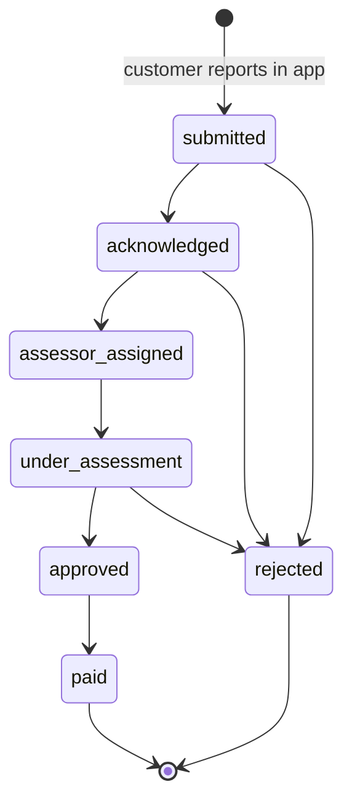

# Claims Handler Manual (FNOL)

**Role:** `claims_handler` · **Demo user:** `claims` · **MFA:** not required by default

**Your permissions:** read and update claims (`claims:read`, `claims:update`), read policies (`policy:read`), view customer records with personal data masked (`profile:read`).

**Your landing page:** **Claims**.

The platform is the **digital front door** for accident reports, or First Notice of Loss (FNOL). Customers report from the VETC app with a description, location and photo count. Full assessment and settlement stay in TASCO's core claims system. Your job here is to **acknowledge quickly**, **move the claim through its status flow** and keep the customer informed.

> Fast, transparent claims handling is the strongest reason customers renew. Treat the **4-hour acknowledgement SLA** as a promise made to the customer in the app.

Read the [Staff User Manual](user-manual.md) first.

---

## 1. The claims queue

1. Open **Claims** ("Claims — first notice of loss").
2. **What you will see:** one row per claim:

| Column | Meaning |
|---|---|
| Claim | Claim ID, for example `CL-3F9A21BC` |
| Policy / Product | Certificate number and product (TNDS, PA_SEAT, MOTOR_PD) |
| Incident | Incident date and description; location and number of photos when provided |
| Status | Current status badge |
| **SLA due** | Deadline for acknowledgement: **4 hours after submission** |

3. Filter by **Status**. Work `submitted` claims in order of **SLA due**, earliest first.

---

## 2. Status flow

Only the transitions shown are allowed. The platform refuses others ("Cannot move claim from X to Y").

| Status | Meaning | Who acts next |
|---|---|---|
| submitted | Customer has reported | You: acknowledge within 4 hours |
| acknowledged | We have contacted the customer and opened the claim in TASCO core | Claims team assigns an assessor |
| assessor_assigned | Assessor (giám định viên) assigned | Assessor visits or reviews photos |
| under_assessment | Assessment in progress | Assessor / adjuster |
| approved | Claim accepted | Finance |
| paid | Settlement paid | Closed |
| rejected | Not covered, or a duplicate or invalid report | Closed. Explain the reason to the customer. |

---

## 3. Acknowledge a new claim (step by step)

1. Open the claim with the earliest **SLA due**.
2. Check the policy and incident:
   - The platform has already checked that the policy belongs to the customer and that the incident date is **within the policy period**.
   - Open the customer (Customer 360) if you need vehicle details. Name and phone are masked for your role. Use TASCO core for contact details according to the claims procedure.
3. Call the customer from the official TASCO claims hotline. Confirm safety first, then the incident facts.
4. Create the claim file in TASCO core and note the core reference.
5. In the platform, choose the new status **acknowledged**. Add a **Note**, for example "Customer contacted 10:42; core claim ref TC-2026-00123; assessor visit requested".
6. Select **Save**.

**What you will see:** the status badge changes, and the history shows the new status, time and your user ID. The change is audited (`claim.status_changed`).

## 4. Progress the claim
Repeat for each step (**assessor_assigned → under_assessment → approved → paid**, or **rejected**), always with a note: the assessor's name or reference, the assessment outcome, the payment reference.

**Rejecting a claim:** select **rejected** with a clear reason, for example "Incident outside cover — PA_SEAT does not cover vehicle damage" or "Duplicate of CL-…". Make sure the customer is told in plain Vietnamese through the agreed channel.

---

## 5. Tips
- Sort by **SLA due** at the start and middle of each shift.
- One note per status change. Notes are part of the regulatory record.
- If a customer reports in the app but you cannot reach them, still acknowledge within SLA and note the attempts.
- Product reminder: **TNDS** covers damage the customer causes to others. **PA_SEAT** covers injury to the driver and passengers. **MOTOR_PD** covers damage to the customer's own car.

## 6. Troubleshooting

| Problem | Fix |
|---|---|
| "Cannot move claim from submitted to under_assessment" | Follow the flow: acknowledged, then assessor_assigned first |
| Claim not in the list | Check the status filter. Only claims reported through the platform appear here. Phone or paper claims stay in TASCO core. |
| Customer name masked | Expected for your role. Use TASCO core for contact. |
| Many claims near SLA breach | Escalate to the claims lead. Overflow goes to the TASCO claims hotline. |

See also: [Staff User Manual](user-manual.md), [Customer App Guide](customer-app-guide.md) (what the customer sees).
