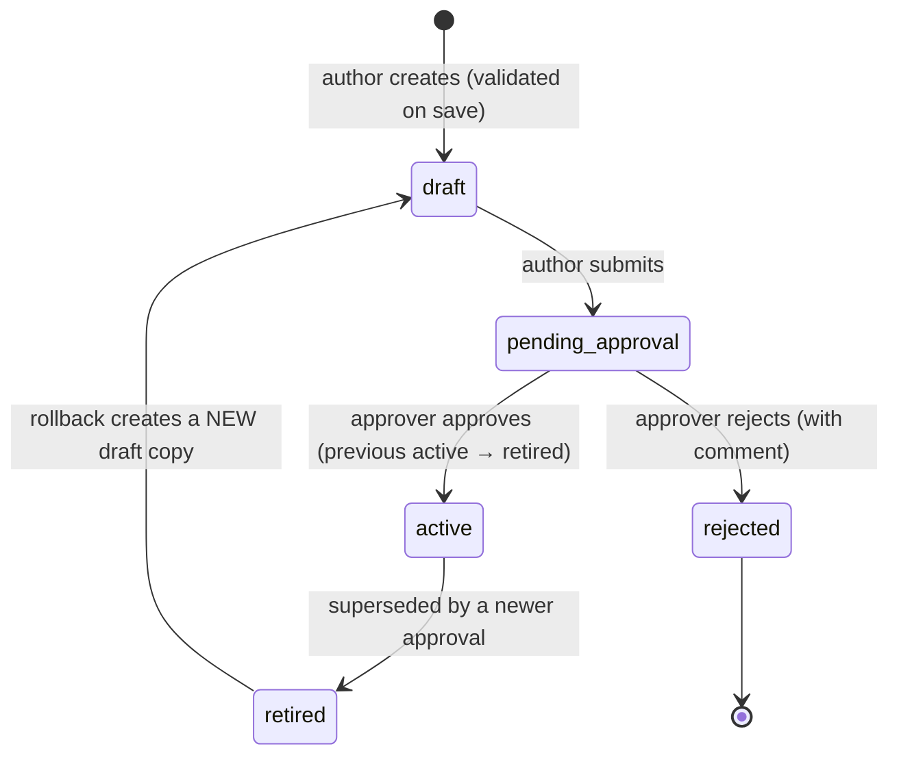

# Rule Author and Rule Approver Manual (Maker-Checker)

| | Rule author (maker) | Rule approver (checker) |
|---|---|---|
| Role | `rule_author` | `rule_approver` (also `compliance_officer`) |
| Demo user | `author` | `approver` (MFA), `compliance` (MFA) |
| Permissions | `rules:read`, `rules:author`, `dashboard:read` | `rules:read`, `rules:approve`, `audit:read`, `dashboard:read` |
| Can | Create drafts, validate, simulate, submit own drafts, create rollback drafts | Simulate, approve or reject drafts submitted by **someone else**, read the audit trail |
| Cannot | Approve or reject | Create or submit drafts |

The platform enforces **four-eyes** control. Only the author can submit a draft, and the person who created a draft **can never approve or reject it**, even if they hold both roles ("Maker-checker: you cannot approve your own change").

Read the [Staff User Manual](user-manual.md) first.

---

## 1. What rules control

All business behaviour is held in **versioned rule sets**. Each **kind** has exactly one **active** version at a time.

| Kind | Controls | Typical approver |
|---|---|---|
| `products` | Product catalogue, channels where each product is sold, bundles | Product + Compliance |
| `tariff.tnds_car`, `tariff.tnds_motorbike` | Regulated TNDS premiums (Decree 67/2023/ND-CP) | **Underwriting** + Compliance |
| `rating.motor_pd`, `rating.pa_seat` | Voluntary product rates (currently **illustrative**, to be replaced with filed rates) | **Underwriting / Actuarial** |
| `commission` | Partner commission by product and partner type, with statutory caps | Finance + Compliance |
| `scoring` | Lead score factors, weights, tier thresholds (hot ≥ 70, warm ≥ 45) | Product / Data |
| `nba` | Next-best-action decision table | Product |
| `journeys` | Journeys, audiences, step timings and channels, cross-sell | Marketing + Compliance |
| `triggers` | Ecosystem-event moments of truth | Marketing + Compliance |
| `content.messages` | Customer message templates (vi/en) | **Compliance** (and Zalo template approval) |
| `content.voicebot` | Voice bot script, disclosure and intent keywords | **Compliance** |
| `benefits` | Value-beyond-discount catalogue, eligibility, relevance, `legalStatus` | **Legal / Compliance** |
| `copy_guard` | Banned phrases for customer copy | **Compliance only** |
| `contact_policy` | Contact hours, frequency caps, consent requirements | **Compliance / Legal** |
| `referral` | Referral programme (disabled pending legal review) | **Legal** |
| `enrichment` | Source trust, expiry evidence weights, vehicle category inference | Data owner |
| `retention` | Data retention periods and actions | **DPO / Compliance** |
| `abac` | Attribute-based access policies (regional data, own handoffs) | **Security** + Compliance |
| `costs` | Unit costs for the economics dashboard | Finance |

> Your organisation's **approval matrix** decides who may approve which kind. The platform checks only that the approver holds `rules:approve` and is not the author, so approvers must follow the matrix above.

### Lifecycle



- A version's ID is `<kind>@<version>`, for example `scoring@3`.
- Approval takes effect on all servers within about **15 seconds**.
- **Rollback** never reactivates an old version directly. It creates a **new draft** with the old content, which goes through approval again.

---

## 2. For the rule author: step by step

### Step 1 — Find the current version
1. Open **Rules studio**.
2. In **Rule sets**, find the kind (for example `scoring`). The active version is marked **Active**.
3. Open it to see the description, checksum, author, approver, activation date and the payload (JSON).

### Step 2 — Create a draft
1. From the active version, edit the payload in the JSON editor. For example, raise the hot threshold:
   ```json
   "tiers": { "hot": 75, "warm": 45 }
   ```
2. Fill **Description** with the business reason and expected impact, for example "Raise hot threshold to 75 to focus voice bot capacity; expected −15 % hot volume."

### Step 3 — Validate
1. Select **Validate**.
2. **What you will see:** "Valid", or a list of errors with JSON paths, for example:
   - `$.factors[2].value: unsupported operator "clampp"`: a typo in a JSON Logic expression.
   - `rule tnds_any: rate 0.08 exceeds statutory cap 0.05 for TNDS_CAR`: commission above the legal cap.
   - `copy guard: "giảm giá" in "Giảm giá 10% khi gia hạn…"`: banned wording in customer copy.
3. Fix and validate again until valid.

### Step 4 — Simulate (scoring, NBA, journeys, benefits)
1. Select **Simulate against a customer**.
2. Enter a customer ID (the plate key, for example `30A12345`) and select **Run simulation**.
3. **What you will see:** **Current** vs **Candidate** side by side: score and reasons, tier, journey, next best action and benefits.
4. Repeat on **at least five representative customers**: hot and warm, TASCO and conquest, lapsed, low-confidence expiry, company-owned. Note the results in the description or your change ticket.

> Simulation is a dry run. It changes nothing.

### Step 5 — Save as a draft
1. Select **Save as new draft**.
2. **What you will see:** a new version `<kind>@<n>` with status **draft**. The payload is validated again on save. An invalid payload cannot be saved.

### Step 6 — Submit for approval
1. Open your draft and select **Submit for approval**.
2. **What you will see:** status **pending_approval** ("Submitted for approval"). Tell your approver, or rely on the Pending list they check daily.

Only the author of a draft can submit it.

### Step 7 — After approval
- Check that the version shows **Active** and the previous one **Retired**.
- For scoring, NBA, journeys or benefits changes, ask the campaign manager to **Recompute** leads (or wait for the nightly recompute).
- Monitor the expected effect for 7 days.

### Rolling back
1. Open the earlier version you want to restore (status **retired**).
2. Select **Roll back to this version**. A **new draft** is created with that content, described "Rollback to `<id>`".
3. Submit it for approval as usual. For urgent rollbacks, call your approver.

---

## 3. For the approver: step by step

### Step 1 — Find pending changes
1. Sign in (MFA required).
2. Open **Rules studio** and filter **Status = pending_approval**.

### Step 2 — Review
For each pending version:
1. Read the **Description**: is the business reason clear?
2. Compare it with the active version (**This version** vs active payload). Check exactly what changed.
3. Check that it is **within your approval authority** (see the table in section 1).
4. Run your own **Simulation** on a few customers (scoring, NBA, journeys, benefits).
5. For customer-facing content, read the Vietnamese text in full:
   - no discount, rebate or cashback wording, and nothing that implies a lower price;
   - no promise of loyalty points or rewards unless the related benefit's `legalStatus` is `approved`;
   - truthful and clear; the voice bot keeps its disclosure ("trợ lý tự động"), recording notice and the "never asks for OTP or payment" line.
6. For `benefits`: items moving to `legalStatus: "approved"` must have a legal sign-off reference.
7. For `contact_policy`: values must not loosen consent or caps without a Legal decision.
8. For tariffs and rates: figures must match the regulation or filed rates.

### Step 3 — Decide
- **Approve:** enter a **Review comment** (for example "Approved per ticket CHG-1234; simulation reviewed on 5 customers") and select **Approve**. The version becomes **Active** and the previous one **Retired**.
- **Reject:** enter the reason and select **Reject**. The version becomes **rejected**. The author must create a new draft.

**What you will see:** a confirmation, and an audit entry (`rules.approved` or `rules.rejected`) with your comment and the superseded version.

> **Approval SLA (proposed):** within 1 business day. Urgent rollbacks within 1 hour.

---

## 4. Worked example: change the conquest first reminder timing

1. **Author** opens `journeys`, finds the journey `conquest` and changes the `first_reminder` step `offset` from `-30` to `-35`.
2. **Validate**: valid.
3. **Simulate** with kind `journeys` on a conquest customer whose expiry is in 33 days. Current: no first reminder due yet. Candidate: first reminder due now.
4. **Save as new draft** (`journeys@2`) with the description "Conquest first reminder D−35 to land before competitors' D−30 calls".
5. **Submit for approval**.
6. **Approver** (Compliance) checks that the cap of 3 marketing contacts per week is still respected, simulates, and approves with a comment.
7. The campaign manager selects **Recompute** so that schedules are rebuilt for affected vehicles.

---

## 5. JSON Logic cheat sheet

Rules use JSON Logic expressions over customer facts.

| Need | Expression |
|---|---|
| Field value | `{ "var": "days" }` |
| Compare | `{ "<=": [{ "var": "days" }, 14] }` |
| And / or / not | `{ "and": [ … ] }`, `{ "or": [ … ] }`, `{ "!": [ … ] }` |
| In list | `{ "in": [{ "var": "category" }, ["car_under6", "car_6_11"]] }` |
| If / else chain | `{ "if": [cond1, value1, cond2, value2, default] }` |
| Arithmetic | `{ "+": [a, b] }`, `{ "/": [a, b] }`, `{ "*": [a, b] }` |
| Clamp to a range | `{ "clamp": [expr, 0, 1] }` |
| Text | `{ "cat": ["expires in ", { "var": "days" }, " days"] }` |
| Round | `{ "round": [expr] }` |
| Min / max | `{ "min": [a, b] }`, `{ "max": [a, b] }` |

Common facts: `days` (days to expiry, negative means lapsed), `expiryConfidence` (0–1), `insurer`, `tier`, `score`, `consent.marketing`, `consent.call`, `consent.dnc`, `channels.app_push`, `channels.zalo_zns`, `channels.sms`, `channels.voice_bot`, `hasPhone`, `ownerType`, `category`, `seats`, `vehicleAge`, `appSessions30d`, `tollTrips30d`, `longTripsKm90d`, `walletBalance`, `autoTopUp`, `premium`, `tagAgeDays`, `journey`.

Decision tables (`nba`, commission, rate tables, category inference) use **hit policy "first"**: rules are evaluated top to bottom and the first match wins, otherwise `default` applies. **Order matters.**

---

## 6. Troubleshooting

| Message | Meaning | Fix |
|---|---|---|
| "Rule set is invalid" + list | Validation errors | Fix each path shown |
| "Only the author can submit a draft" | You are not the creator | Ask the author |
| "Only drafts can be submitted (status: …)" | Already submitted, approved or rejected | Create a new draft |
| "Maker-checker: you cannot approve your own change" | You authored it | Another approver must decide |
| "Only pending rule sets can be approved" | Not submitted, or already decided | Refresh. Check the status. |
| "Missing permission rules:author" | Approver accounts cannot draft | Ask an author |
| Change not visible after approval | Cache refresh (up to 15 s), or leads not recomputed | Wait. Ask for **Recompute**. |

See also: [Compliance Officer Manual](manual-compliance-officer.md), [Campaign Manager Manual](manual-campaign-manager.md).
