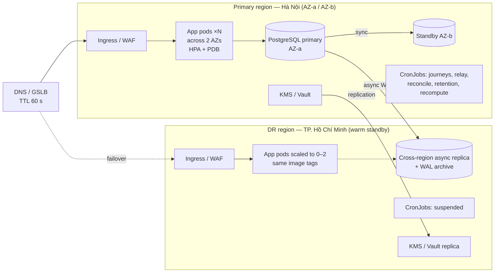
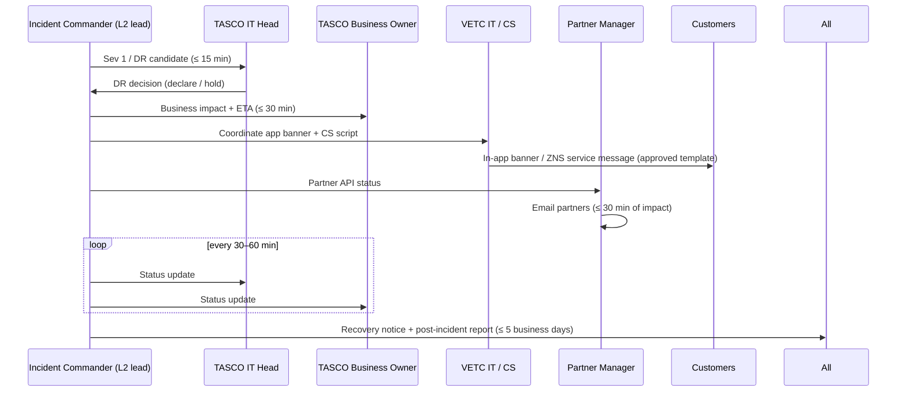

# Disaster Recovery and Business Continuity Plan — TASCO Growth Platform

| Item | Value |
|---|---|
| Owner | TASCO IT Head (accountable); SRE + DBA (responsible) |
| Approvers | TASCO IT Head, TASCO Business Owner, VETC IT Lead, TASCO CISO |
| Related | [Runbook](runbook-and-support-guide.md) · [Monitoring](monitoring-and-alerting.md) · [Readiness checklist](production-readiness-checklist.md) |
| Status | v1.0. **Hosting provider and regions are to be confirmed at G1.** This plan assumes two data centres / regions **in Vietnam** (primary Hà Nội, secondary TP. Hồ Chí Minh) to meet data-localisation expectations for Vietnamese personal data (Decree 53/2022/ND-CP, PDP Law 2025; Legal confirms) |

---

## 1. Scope

| In scope | Out of scope (own DR plans) |
|---|---|
| Application tier (stateless Node.js pods), PostgreSQL database, secrets (`JWT_SECRET`, `DATA_KEYS`, `BLIND_INDEX_KEY`, DB credentials), configuration (rule sets live **in the database**, versioned), CronJobs, ingress/DNS, observability stack | VETC wallet, VETC SSO, VETC app, TASCO core policy admin, Zalo, SMS provider, voice-AI vendor. We plan for **their unavailability** (§8) |

Key architectural facts that make recovery simpler:

- **All state is in PostgreSQL.** This covers profiles, leads, touchpoints, messages, orders, policies, rule sets (all versions), the outbox (`domain_events`) and the hash-chained `audit_log`. The app pods are stateless, apart from per-pod rate-limiter buckets, the token revocation list and the 15 s rule cache, all of which are disposable.
- **Outbox pattern.** Events are written in the same database as the state change, so after a restore the relay re-processes `pending` events. Subscribers are idempotent, with the caveats in RB-06.
- **Encryption keys are part of the backup set.** A database backup is useless without the matching `DATA_KEYS` (every key ID ever active) and `BLIND_INDEX_KEY`. The keys live in the KMS/vault, replicated to the DR region.

## 2. Business impact analysis (BIA)

| Business service | Components | Impact of outage | Tolerable downtime (MTPD) | Tier |
|---|---|---|---|---|
| Customer renewal / purchase (quote → pay → issue → e-certificate) | `/api/customer/*`, `/api/partner/v1/orders`, wallet, TASCO core | Lost premium (renewals on expiry day go to competitors); customer trust; driving uninsured is an offence for the customer | 4 h | **Tier 1** |
| Certificate verification (QR) | `GET /api/public/certificates/:certNo`, `/verify/*` | Customers cannot prove cover at roadside or inspection checks | 4 h | **Tier 1** |
| Partner API | `/api/partner/v1/*` | Partner sales stop; SLA penalties (contractual) | 4 h | **Tier 1** |
| Telesales console and handoffs | `/api/handoffs`, `/api/leads`, `/api/customers/:id`, `/api/quotes` | Hot leads go cold; agents idle | 8 h | Tier 2 |
| Journey engine and messaging | `journeys` CronJob, notify gateways, voice bot | Reminders delayed by a day; recoverable (catch-up of 2 days in planning, `catchUpDays`) | 24 h | Tier 2 |
| Claims FNOL | `/api/customer/claims`, `/api/claims` | Customers use the TASCO hotline instead | 24 h | Tier 2 |
| Rules studio, data steward, DQ, ingestion | `/api/rules`, `/api/dq`, `/api/data/ingest` | Changes deferred; ingestion re-runnable from source extracts | 72 h | Tier 3 |
| Dashboards, insights | `/api/dashboard/*` | Management reporting delayed | 72 h | Tier 3 |
| Audit trail (integrity) | `audit_log` | Regulatory evidence; must never be lost | n/a: **zero tolerated loss of committed entries** within the RPO | Tier 1 (data) |

## 3. RPO / RTO by tier

| Tier | RTO (service restored) | RPO (max data loss) | Mechanism |
|---|---|---|---|
| Tier 1 | **1 h** for an AZ failure (automatic); **4 h** for a region loss (declared DR) | **≤ 5 min** for a region loss; **0** for an AZ failure | Multi-AZ Postgres with a synchronous standby; async cross-region replica; continuous WAL archiving (PITR) |
| Tier 2 | 8 h | ≤ 15 min | Same database. Journeys catch up the next run (catch-up window 2 days) |
| Tier 3 | 72 h | ≤ 24 h | Same database; ingestion re-runnable from source extracts |

Secrets/KMS: RTO 1 h, RPO 0 (replicated vault). Observability: RTO 24 h (rebuild from IaC; metrics history loss accepted).

## 4. Backup strategy

| Asset | Method | Frequency | Retention | Location | Verified by |
|---|---|---|---|---|---|
| PostgreSQL | Managed **PITR**: continuous WAL archiving + daily base backup | Continuous / daily 01:00 ICT | 35 days PITR; monthly snapshot kept 12 months; yearly kept 10 years (financial and audit retention per `retention.json`: orders, certificates and `audit_log` 3,650 days) | Primary region object storage + **cross-region copy** (TP.HCM) | Weekly automated restore test (DR-T1 light) |
| `audit_log` chain head | Export `(seq, hash)` of the latest entry | Nightly | 10 years | WORM bucket (object lock) | Compare with `GET /api/audit/verify` `head` |
| Secrets (`JWT_SECRET`, `DATA_KEYS` all key IDs, `BLIND_INDEX_KEY`, DB, partner-integration credentials) | Vault/KMS with replication + sealed offline escrow (two-person) | On change | All versions **forever for `DATA_KEYS`** (old ciphertext) | KMS in both regions + escrow | Quarterly key-recovery drill |
| Configuration / IaC | Git (`deploy/k8s/*`, `Dockerfile`, CI) | On commit | Forever | Git hosting + mirror | Rebuild drill (DR-T4) |
| Container images | Registry with immutable tags (semver + git SHA) | On release | Last 20 releases | Registry replicated to the DR region | Pull test in DR |
| Rule sets | Inside PostgreSQL (all versions) + defaults in `config/rules/*.json` | — | — | Covered by DB backup | `GET /api/ops/status` checksums vs change log |
| Source extracts (VETC/TASCO) | Landing bucket | Per delivery | 365 days (`source_records` retention) | Primary + DR | Re-ingest test |

Backups are encrypted at rest with provider KMS keys. **PII inside the backup is additionally encrypted at field level** (AES-256-GCM), so restores require the application keys.

## 5. DR topology

| Element | Primary | DR (warm standby) |
|---|---|---|
| App | ≥ 3 replicas across 2 AZs; PDB `minAvailable: 2`; `terminationGracePeriodSeconds` ≥ 30 | Deployment at 0–2 replicas, same image; scaled up on declaration |
| Database | HA primary + synchronous standby (automatic AZ failover) | Async read replica (lag < 30 s, alert ALR-91), promotable |
| CronJobs | Active | **Suspended**. Never run two journey schedulers, or customers get duplicate contact |
| Outbound egress | Allow-listed to VETC, TASCO core, Zalo, SMS, voice | Pre-registered DR egress IPs with every partner (part of the IIAs) |
| DNS | Public hostnames (console, app API, partner API, verify) | GSLB failover record, TTL 60 s |

**Partner allow-lists are the usual DR blocker.** VETC wallet, TASCO core and the SMS provider must allow-list the DR egress IPs **before go-live** (readiness PRC-DR-04).

## 6. Failover and failback procedures

### FO-0 — AZ failure (automatic)

1. The managed Postgres fails over to the synchronous standby (60–120 s). The app's `/health/ready` returns 503 during the switch (RB-01) and the pod pool reconnects.
2. Kubernetes reschedules pods to the healthy AZ; the PDB and HPA keep capacity.
3. L2 verifies: readiness, `GET /api/ops/status`, reconciliation for the window. No customer-facing declaration unless degradation lasts > 15 min.

### FO-1 — Region loss / declared disaster (manual, RTO 4 h)

| Step | T+ | Action | Owner |
|---|---|---|---|
| 1 | 0 | Incident Commander declares DR after confirming the primary region is unrecoverable within RTO (provider status, ≥ 30 min outage, or data-centre loss). Decision by the TASCO IT Head (or delegate) | IC |
| 2 | 0:05 | Communications: war room, TASCO/VETC leadership, VETC CS; customer banner (§9) | Comms |
| 3 | 0:10 | **Freeze writes at the primary** if it is partially alive: scale the primary Deployment to 0, suspend its CronJobs (split-brain prevention) | L2 |
| 4 | 0:15 | **Promote the DR replica** (provider "promote"). Record the last applied LSN/timestamp: this is the **actual RPO** | DBA |
| 5 | 0:30 | Confirm the DR KMS has every `DATA_KEYS` key ID, `BLIND_INDEX_KEY` and the `JWT_SECRET`, and update the DR secrets: `DATABASE_URL` → promoted instance | SRE |
| 6 | 0:45 | Scale the DR Deployment to the production replica count; set `MIGRATE_ON_START=false` (the schema is already current) | SRE |
| 7 | 1:00 | Smoke tests: `/health/ready` (`store:"postgres"`, `db:true`), `GET /api/audit/verify` ok, staff login + MFA, customer session → home → quote, certificate verify, `GET /api/ops/status` (breakers closed: partner allow-lists working) | L2 + QA |
| 8 | 1:15 | **Switch DNS/GSLB** to DR (TTL 60 s) | SRE |
| 9 | 1:30 | Run `POST /api/ops/jobs/relay` (drain `pending`); requeue `processing` events stuck by the crash (RB-06) | L2 |
| 10 | 1:45 | Resume CronJobs in DR (journeys only inside 08:00–20:00 ICT); reconciliation for the loss window: orders between the last replicated LSN and the disaster may have been paid in VETC without a record here. Reconcile with the VETC settlement file (RB-11) | L2 + Finance |
| 11 | 2:00 → 4:00 | Monitor SLOs; partner notifications; formal DR status report | IC |

### FB-1 — Failback to the primary region (planned, low-traffic window)

1. Rebuild the primary-region database as a **replica of the DR primary** (fresh base backup + streaming). Never reuse the old primary's data files (divergence).
2. When the lag is < 5 s, CAB-approved window (after 20:00 ICT): suspend DR CronJobs → scale DR app to 0 (brief outage, ~10 min) → promote the primary-region replica → point secrets → scale up → smoke tests (step 7 above) → DNS back → resume CronJobs.
3. Re-establish the DR replica from the new primary. Reconcile; verify the audit chain.

### FO-2 — Logical corruption / bad data change (PITR)

When data is corrupted by a bad job, a bad manual SQL statement or a defect, but the infrastructure is fine:

1. Stop the source of damage (suspend CronJobs, scale writers down if necessary).
2. Restore by **PITR to a new instance** at T−(just before the event).
3. Choose between **(a) full cut-over** to the restored instance (loses all writes after T; only if the window is small) and **(b) surgical repair**: copy the affected rows from the restored instance into production under a change ticket.
4. The audit chain must be verified after any repair. Rows inserted into `audit_log` are never edited; repairs are recorded as new audit entries or in the change ticket.

## 7. DR test plan and schedule

| ID | Test | Scope | Frequency | Success criteria |
|---|---|---|---|---|
| DR-T1 | **Backup restore** | PITR restore to a new instance in PREPROD at a random point in the last 7 days; app connects; `GET /api/audit/verify` ok; row counts vs source | Weekly automated (light), quarterly full | Restore ≤ 60 min (Tier 1 budget); data consistent to the target time (RPO ≤ 5 min) |
| DR-T2 | **AZ failover** | Force a Postgres failover + drain one AZ's nodes under PERF-S1 load (TC-141, TC-142) | Before G3, then semi-annually | Readiness recovers ≤ 2 min; no lost committed orders; 5xx limited to the switch window |
| DR-T3 | **Region failover drill** | Full FO-1 in PREPROD/DR (or PROD with a planned window after W1) | Before W1 (Mar 2027), then annually | RTO ≤ 4 h, RPO ≤ 5 min demonstrated; partner calls succeed from DR egress IPs |
| DR-T4 | **Rebuild from code** | New cluster from IaC + image registry + secrets escrow | Annually | Platform up from scratch ≤ 8 h |
| DR-T5 | **Key recovery** | Recover `DATA_KEYS` (all IDs) and `BLIND_INDEX_KEY` from escrow; decrypt a sample in an isolated environment | Semi-annually | Two-person procedure completes ≤ 1 h |
| DR-T6 | **Vendor outage tabletop** | Walk through §8 scenarios with VETC CS, the telesales supervisor and the voice vendor | Before pilot, then semi-annually | Roles clear; templates approved; contact lists valid |
| DR-T7 | **Outbox recovery** | Kill pods mid-relay; recover stuck `processing` and dead letters per RB-06 | Before G3 | No lost or duplicated customer messages beyond the documented caveats |

| Window | Tests |
|---|---|
| Jan 2027 (UAT week T3) | DR-T1, DR-T2, DR-T5, DR-T6, DR-T7 (gate G3 evidence) |
| Mar 2027 (before W1) | DR-T3 full region failover |
| Every quarter | DR-T1 full |
| Semi-annual | DR-T2, DR-T5, DR-T6 |
| Annual | DR-T3, DR-T4 |

Every DR test produces a report: date, scenario, actual RTO/RPO, issues, actions, sign-off by the TASCO IT Head.

## 8. Business continuity: telesales and voice vendor outage

| Scenario | Detection | Continuity actions | Customer impact |
|---|---|---|---|
| **Voice-AI vendor outage** (circuit `voice-ai`, RB-05) | ALR-10, `voice_calls_total` flat | 1. Stop launching `/api/voice/campaign`. 2. Journeys: `voice_bot` steps fail. The fallback is a **rule change** (maker-checker) adding `telesales` to the voice step's `channels`, or raising hot-lead prioritisation for agents (`GET /api/leads?tier=hot`). 3. Supervisors add agent shifts. 4. Digital steps (push/ZNS/SMS) continue | Fewer proactive calls; digital reminders continue |
| **Telesales unavailable** (call centre outage, strike, telephony down) | Supervisor report; ALR-83 unworked handoffs | 1. Pause escalation to telesales: rule change removing `telesales` from journey steps, or temporarily suspend journeys (SOP-07) if there is no other channel. 2. The voice bot outcome `hot_handoff` still creates handoffs; switch the bot outcome guidance to `link_sent` (rule change in `content.voicebot`; customers receive the in-app link). 3. Partner channel unaffected | Hot leads served by self-service link |
| **Zalo ZNS or SMS provider outage** | ALR-31, RB-04 | Channel fallback is built in (app push → ZNS → SMS order per step). For a prolonged outage, a rule change reorders channels. Customers with no app and no other channel wait for recovery | Some reminders delayed |
| **VETC wallet outage** | RB-02 | No alternative payment method in scope (by design: pay only in the official app). Banner in the app; telesales collect intent and call back; journeys paused (SOP-07) so reminders do not drive customers into failures | Purchases delayed |
| **TASCO core outage** | RB-03 | Stop sales (pause journeys, hide the renew banner); queue handoffs for callback; **do not take payments** without issuance | Purchases delayed |
| **VETC SSO / app outage** | VETC notification | Zalo mini-app path (signed links) continues if Zalo is up; telesales assist | Partial |
| **Platform total outage** (DR invoked) | §6 | VETC CS scripts; TASCO hotline for claims FNOL; partners informed | Per RTO |

Manual workaround register (kept by L2): approved customer-facing templates per scenario (vi/en), CS scripts, partner notice template, decision log template.

## 9. Communication plan

| Audience | Message owner | Channel | Timing |
|---|---|---|---|
| Executive (TASCO IT Head, Business Owner, VETC IT Lead) | Incident Commander | Phone + email | Within 30 min of declaring Sev 1 / DR; then hourly |
| Staff users (telesales, campaign, claims) | Service desk | Teams/Zalo broadcast | Within 30 min |
| Customers | VETC CS + TASCO Marketing (Compliance-approved templates) | In-app banner, ZNS service message, hotline IVR | When the purchase path is down > 30 min |
| Partners | Partner Manager | Partner status email / portal | Within 30 min of partner API impact |
| Regulators / data subjects (personal data breach) | DPO with Legal | Per statutory process | Per legal deadlines |

## 10. Plan maintenance

- Reviewed after every DR test, every Sev 1, and every architecture change (new region, provider, integration).
- Contact lists verified quarterly.
- Owners: SRE (technical procedures), TASCO IT Head (BIA and tiers), VETC CS (customer communications), Partner Manager (partner communications).
