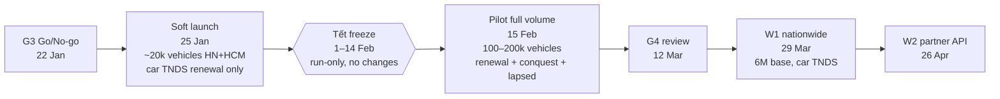
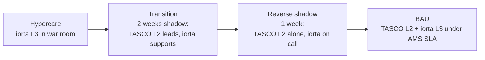

# Go-Live and Hypercare Plan — TASCO Growth Platform

| Item | Value |
|---|---|
| Owner | iorta TechNXT Delivery Lead (cutover manager); TASCO Product Owner (business go-live owner) |
| Decision body | Steering Committee (go/no-go G3); CAB (production changes) |
| Dates (indicative, per [project plan](../delivery/project-plan.md)) | G3 go/no-go **Fri 22 Jan 2027** · pilot soft launch **Mon 25 Jan 2027** (low volume, Hà Nội + TP.HCM) · **Tết change freeze 1–14 Feb 2027** · pilot full volume **Mon 15 Feb 2027** · G4 pilot review **12 Mar 2027** · W1 nationwide **29 Mar 2027** · W2 partner API **26 Apr 2027** |
| Related | [Readiness checklist](production-readiness-checklist.md) · [Runbook](runbook-and-support-guide.md) · [Release and change management](release-and-change-management.md) · [DR and BCP](dr-bcp.md) |

---

## 1. Go-live approach

This is a **greenfield launch**. No legacy system is replaced; current renewal reminders continue in parallel as the control group. Exposure grows in controlled steps, using levers that already exist in the platform:

| Lever | How | Granularity |
|---|---|---|
| **Which vehicles exist in the platform** | Only the pilot cohort is ingested (`POST /api/data/ingest` / batch load) | Cohort-level |
| **Who is targeted by journeys** | Journey `audience` (JSON Logic) in the `journeys` rule set: add `{"in":[{"var":"region"},["Hà Nội","TP. Hồ Chí Minh"]]}` and expiry and category filters. Changes go through maker-checker | Region, category, days to expiry, confidence, tier |
| **Which products and channels are on sale** | `products` rule set: `status` and `channels[]` per product; `bundles[].status` | Product × channel |
| **Which benefits are shown** | `benefits` rule set `legalStatus` (only `approved` reach customers); `referral.enabled` | Item |
| **Contact intensity** | `contact_policy` caps; manual voice campaigns with `limit` | Global |
| **Entry points** | VETC app banner/feature flag (VETC side); Zalo OA menu; partner keys issued only at W2 | Channel |
| **Kill switch** | SOP-07: suspend the journeys CronJob; marketing cap 0 via rules | Global |

> **Percentage roll-out** ("10 % of the base") is **not** expressible today: no fact gives a stable random bucket (KI-24). Use region, category or expiry filters, or the cohort loaded, until a `cohortBucket` fact is added. The pilot A/B control group (project plan) needs that fact, or a control list excluded at load time; decide this at G3.

## 2. Go / no-go criteria (G3)

| # | Criterion | Evidence | Owner |
|---|---|---|---|
| G-1 | Every **P1** item of the [readiness checklist](production-readiness-checklist.md) is `Done` or `Waived` by the SteerCo | Checklist | Delivery Lead |
| G-2 | UAT accepted (overall + every persona); compliance scenarios passed without waiver | UAT sign-off sheet | TASCO Business Owner |
| G-3 | Security sign-off (pen test: no open critical/high) | CISO memo | TASCO CISO |
| G-4 | Compliance and legal sign-offs: content inventory, contact policy, tariffs, ZNS templates approved by Zalo, PDP/DPIA | Memos | Compliance / Legal / DPO |
| G-5 | Sev 1 known issues fixed and regression-tested: **KI-01** (seed guard), **KI-02** (partial issuance/refund), **KI-09** (voice campaign contact policy), **KI-28** (in-memory store in prod) | PRs + TCs | Dev lead |
| G-6 | Partners ready in PROD: VETC wallet + SSO + app deep link + push, TASCO core issuance, Zalo OA/ZNS, SMS brandname, voice vendor; DR egress allow-listed | Partner confirmations | Integration lead |
| G-7 | Operational readiness: on-call live, runbook tabletop done, dashboards and alerts live, synthetics green for 48 h in PROD | Ops sign-off | L2 lead |
| G-8 | Dress rehearsal of cutover and rollback completed in PREPROD within the planned times | Rehearsal report | Cutover manager |
| G-9 | Pilot cohort data loaded in PREPROD with real extracts; counts reconcile | Load report | Data steward |
| G-10 | No open Sev 1/Sev 2 defects (or Sev 2 waived with a fix date before 15 Feb) | Defect report | QA Lead |

**Decision rule:** all of G-1 to G-10 met → **GO**. One or more unmet with a credible fix within 48 h → **GO with conditions** (soft launch delayed to the fix). Otherwise **NO-GO**, with the next decision point set by the SteerCo; **the Tết freeze means the next possible soft launch is 15 Feb**.

## 3. Cutover plan (T-minus schedule)

T0 = **Mon 25 Jan 2027, 08:30 ICT** (first journey run).

| When | Activity | Owner | Exit check |
|---|---|---|---|
| **T−21 d** (Mon 4 Jan) | PROD and DR infrastructure provisioned from IaC; PostgreSQL HA + PITR + cross-region replica; KMS keys created; monitoring stack, dashboards and alerts deployed | SRE, DBA | PRC-DR-01, PRC-OPS-01 |
| **T−14 d** (Mon 11 Jan) | Release candidate `v1.0.0-rc.N` tagged = UAT build; **feature freeze** (fixes only); provisional CAB approval for the go-live change | Release manager | CAB minutes |
| **T−10 d** (Fri 15 Jan) | Partner PROD connectivity: allow-lists (PROD + DR egress), credentials in the vault; Zalo template IDs mapped; SMS brandname live; voice vendor numbers | Integration lead | Connectivity test per partner (no customer traffic) |
| **T−7 d** (Mon 18 Jan) | PROD secrets loaded (`JWT_SECRET`, `DATA_KEYS` with `DATA_KEY_ACTIVE`, `BLIND_INDEX_KEY`, `DATABASE_URL`); migration Job (`npm run migrate`); rule sets seeded (`npm run job -- rules`); **verify no demo users**; named users created; MFA enrolment session | SRE, Admin | `/health/ready` → `store:"postgres"`; `GET /api/ops/status` rule checksums recorded |
| **T−5 d** (Wed 20 Jan) | **Dress rehearsal** in PREPROD: full cutover + rollback, timed; DR-T1, DR-T2, DR-T7 | Cutover manager | Rehearsal report (G-8) |
| **T−3 d** (Fri 22 Jan) | **G3 go/no-go** (SteerCo 14:00); final release tag `v1.0.0`; CAB final approval | SteerCo, CAB | Signed decision |
| **T−2 d** (Sat 23 Jan) 09:00–17:00 | Deploy `v1.0.0` to PROD (migration Job → rollout); smoke tests (§3.1); **journeys CronJob deployed suspended**; load the **soft-launch cohort** (~20 k vehicles HN + HCM, car TNDS, expiry 15–60 days) in batches of ≤ 2,000; DQ review | SRE, Data steward | Counts reconcile (TC-112); reconciliation job clean |
| **T−1 d** (Sun 24 Jan) 10:00 | `POST /api/leads/recompute`; journey **audience rule** restricted to the pilot regions approved (maker-checker); review the next day's due touchpoints (`GET /api/touchpoints?status=scheduled`) per journey/channel with campaign managers; voice campaign limits agreed (≤ 200 calls/day at soft launch) | Campaign manager, Compliance | Volume sign-off |
| **T−1 d** 18:00 | **Final checkpoint** (go/hold): synthetics green 24 h, no open Sev 1/2, on-call staffed, war room booked | Cutover manager | Recorded decision |
| **T0** 08:00 | War room open; dashboards D1–D5 on screen; VETC app entry point enabled (VETC) | All | — |
| **T0** 08:30 | **Unsuspend the journeys CronJob** (or run `npm run job -- journeys` manually for the first day) | L2 | `journey run complete` log reviewed |
| **T0** 09:00–12:00 | Watch the first messages (sent/failed/blocked), first deep-link sessions, first orders end to end (wallet → TASCO core → certificate verify); first voice campaign (`limit` 50) at 10:00 | War room | First order verified via QR |
| **T0** 17:00 | Day-1 review (§5 KPIs); decide day-2 volume | PO | Minutes |
| **T+1 … T+5** | Daily ramp per §4; hypercare routine | War room | — |

### 3.1 Smoke tests after any PROD deployment

1. `GET /health/ready` → 200, `store:"postgres"`, `db:true` on every pod.
2. `GET /api/meta` → `demoMode:false`, correct `version`.
3. `GET /api/demo/totp/admin` → 404.
4. Staff login + MFA (named smoke account); `GET /api/auth/me`.
5. `GET /api/ops/status`: all integrations `closed`; `rules[]` checksums equal the change log; `eventBacklog.dead_letter` unchanged.
6. `GET /api/audit/verify` → `ok:true`.
7. Certificate verification for the synthetic test certificate (SYN-02).
8. (Go-live day only) One real end-to-end purchase on an internal staff vehicle with a VETC wallet, then a check of the certificate QR. Cancel or keep per the TASCO decision.

## 4. Pilot ramp-up

| Period | Scope (journeys/products) | Volume control | Gate to next step |
|---|---|---|---|
| 25–29 Jan (week 1) | Car TNDS **renewal** journey only; app push + ZNS; voice bot ≤ 200 calls/day; telesales squads HN/HCM | ~20 k vehicles loaded; audience = HN + HCM, expiry 15–60 days | Daily KPIs green; no compliance incident |
| **1–14 Feb (Tết freeze)** | **Run only**: no deployments, no rule changes except emergency rollback (RB-10) or kill switch (SOP-07). Journeys continue at low volume; voice campaigns paused 5–14 Feb (holiday) | Same cohort | — |
| 15 Feb → | **Full pilot volume**: renewal + conquest + lapsed recovery; SMS fallback on | Load the rest of the cohort (100–200 k); voice ≤ 2,000 calls/day | Weekly pilot review |
| 12 Mar | **G4**: KPIs vs targets, unit economics (`/api/dashboard/overview` `economics`), no open regulatory issue | — | SteerCo decision on W1 |

## 5. Rollback plan

### 5.1 Triggers (any one → the Incident Commander proposes rollback; the PO and TASCO IT Head decide within 30 min)

| Trigger | Threshold |
|---|---|
| Compliance breach | Any marketing contact outside 08:00–20:00 ICT, any contact with a DNC customer, any customer message with banned wording, any call without consent |
| Money without cover | > 3 orders in a day with captured payment and no policy that are not refunded within 24 h; any confirmed double charge |
| Availability | Purchase path SLO-01 breached for > 2 h, or a Sev 1 not resolved within 4 h |
| Data integrity | Audit chain verification fails; wrong customer data shown to another customer |
| Partner instruction | VETC or TASCO core requests suspension |

### 5.2 Rollback levels

| Level | Action | Time to effect | Data impact |
|---|---|---|---|
| **R1: Stop outbound contact** | SOP-07: suspend the journeys CronJob; stop voice campaigns; marketing cap 0 via rules | Minutes | None |
| **R2: Rule rollback** | Maker-checker rollback of the faulty rule set (RB-10) | ~15 min (two people) | None |
| **R3: Application rollback** | Redeploy the previous image tag (`kubectl rollout undo` or re-apply the previous release manifest). **Database migrations are forward-only and must be backward-compatible (expand/contract)**, so the previous version runs on the new schema | ≤ 15 min | None |
| **R4: Close customer entry points** | VETC disables the app banner/entry point; Zalo OA menu hidden; partner keys suspended (`PATCH /api/partners/:id {status:"suspended"}`) | ≤ 1 h (VETC release process) | None; in-flight quotes expire after 24 h |
| **R5: Full withdrawal of the pilot** | R1 + R4; platform stays up for servicing existing policies (certificate verification, FNOL, DSAR), which must **never** be switched off for customers who already bought | ≤ 2 h | Policies remain valid; reconciliation completes |
| **R6: Data restore** | Only for corruption: PITR per [DR FO-2](dr-bcp.md#fo-2--logical-corruption--bad-data-change-pitr) | Hours | Writes after the restore point need reconciliation |

For the **first** go-live there is no previous application version. R3 is replaced by R1 + R4 (switch off exposure) while a hotfix is prepared.

## 6. Hypercare

### 6.1 Duration and organisation

| Wave | Hypercare window | Notes |
|---|---|---|
| Pilot | **25 Jan → 12 Mar 2027** (≈ 6 weeks, spanning Tết at reduced intensity) | Extended because of the freeze and the low volume during Tết |
| W1 nationwide | 29 Mar → 23 Apr 2027 (4 weeks) | Volume ×20–30 versus pilot |
| W2 partner API | 26 Apr → 21 May 2027 (4 weeks) | Partner onboarding support |

| Element | Arrangement |
|---|---|
| **War room** | Physical (TASCO HQ Hà Nội) + virtual bridge; 08:00–20:00 ICT on weekdays in weeks 1–2, then virtual |
| **Stand-ups** | 08:00 ICT (overnight jobs, alerts, KPIs, plan) and 17:00 ICT (day review, decisions) |
| **Staffing** | iorta: tech lead, 2 developers, QA, SRE (L3 on-call 24×7); TASCO: PO, L2 support, compliance analyst, campaign manager, telesales supervisor; VETC: app/CS liaison |
| **Change policy** | Daily hotfix window 07:00 ICT (before the journey run) for Sev 1/2 fixes via the emergency CAB; rule changes only through maker-checker, with the PO's consent during hypercare |
| **Defect SLAs** | As the runbook severity matrix, with L3 engaged directly for Sev 1/2 |

### 6.2 Daily KPI pack (07:45 ICT, reviewed at the 08:00 stand-up)

| Area | KPI | Source | Threshold for action |
|---|---|---|---|
| Journeys | Touchpoints due / done / skipped / cancelled by journey and channel; skip reasons top 5 | `journey run complete` log, `touchpoints` | Skipped > 30 % (other than consent) → RB-07 |
| Messaging | Sent / failed / **blocked** by channel | `messages_total` | Blocked > 0 → Compliance (ALR-30) |
| Voice | Calls by outcome; plate-verification failure (`plate_mismatch` + `unverified`) %; opt-out % | `voice_calls_total` | Verification failure > 15 % (KI-25); opt-out > 10 % |
| Telesales | Handoffs created / claimed / won / lost; open > 2 business hours | `GET /api/handoffs`, `tasco_db_handoffs_open_older_than_2h` | > 20 aged handoffs |
| Sales funnel | Quotes and orders by channel and journey; conversion; GWP; taps-to-certificate (VETC analytics) | `quotes_total`, `orders_completed_total`, dashboard | Conversion −50 % week-over-week |
| Integrity | `issuance_failed_refunded` / `payment_failed` orders; reconciliation mismatches | `orders`, `GET /api/ops/jobs` | Any → RB-11 |
| Data | New DQ issues by type; customer-confirmed expiries | `GET /api/dq/issues`, audit `customer.expiry_declared` | — |
| Reliability | SLOs (availability, p95), incidents by severity, alerts fired, dead letters | Dashboards D1–D3 | SLO burn > 50 % of weekly budget |
| Compliance | Contacts outside the window (SQL: must be 0), DNC contacts (0), complaints | RB-07 query, CS | Any → Sev 1 |
| Support | Tickets by tier and category; % resolved at L1/L2 | ITSM | L3 share > 30 % in week 3+ |

### 6.3 Hypercare exit criteria (per wave)

| # | Criterion |
|---|---|
| H-1 | No Sev 1 for 14 consecutive days and no open Sev 2 |
| H-2 | SLO-01 – SLO-04 met for the last 14 days |
| H-3 | Journeys complete inside the window daily for the last 10 business days (KI-05 fixed before W1) |
| H-4 | Reconciliation clean (0 unexplained mismatches) for 10 consecutive days |
| H-5 | L2 resolves ≥ 80 % of tickets without L3; runbooks and KEDB updated with every new incident type |
| H-6 | Alert noise: < 5 non-actionable pages per week |
| H-7 | Open Sev 3 defects < 10, each with a planned release |
| H-8 | KT sessions for this wave's features completed (see `docs/delivery/kt-plan.md`) |
| H-9 | Business Owner and TASCO IT Head sign the hypercare exit |

## 7. Transition to BAU

| Item | Hand-over to BAU |
|---|---|
| Support | L2 rota fully TASCO; L3 via the AMS contract with the severity SLAs from the runbook |
| Monitoring | Alert routing switched to TASCO on-call; dashboards owned by TASCO IT ops |
| Releases | Monthly release train via CAB ([release management](release-and-change-management.md)); rule changes are a business-as-usual activity of TASCO rule authors and approvers |
| Knowledge | KT plan completion; runbook, SOPs and readiness evidence archived; open known issues with owners |
| Governance | Monthly service review (SLOs, incidents, capacity, KI burn-down); quarterly DR test reports; quarterly access review |
