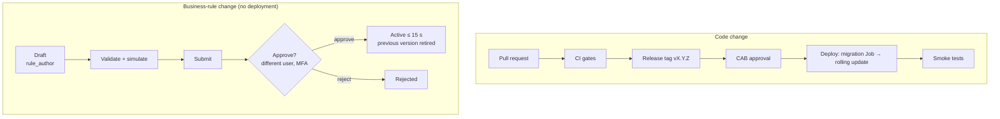
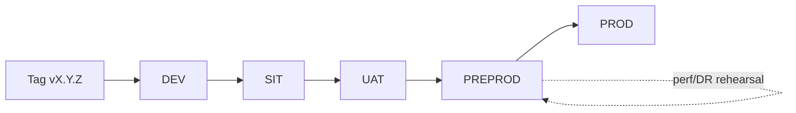

# Release and Change Management — TASCO Growth Platform

| Item | Value |
|---|---|
| Owner | Release Manager (iorta TechNXT during build and hypercare → TASCO IT) |
| Approvers | Change Advisory Board (CAB): TASCO IT Head (chair), TASCO PO, Compliance, Security, VETC IT (for changes affecting VETC interfaces), iorta Tech Lead |
| Related | [Test strategy](../quality/test-strategy.md) (CI gates) · [Go-live plan](go-live-and-hypercare-plan.md) · [Runbook](runbook-and-support-guide.md) |

---

## 1. Two kinds of change

The platform separates **code** from **business rules**. They have different risk profiles and different paths to production.

| | Code / configuration change | Business-rule change |
|---|---|---|
| What | `src/**`, `db/migrations/*.sql`, `config/security/rbac.json` (security config is code), `Dockerfile`, `deploy/**`, environment variables and secrets, dependencies | Any of the 20 rule kinds stored in the `rulesets` table: `scoring`, `nba`, `journeys`, `triggers`, `benefits`, `contact_policy`, `copy_guard`, `content.messages`, `content.voicebot`, `products`, `tariff.*`, `rating.*`, `commission`, `enrichment`, `abac`, `retention`, `costs`, `referral` |
| Path | Git PR → CI gates → release tag → CAB → deployment | Rules studio: draft → validate → simulate → submit → **approve by a different person** (maker-checker) → active within ~15 s on all replicas |
| Who | Developers; release manager deploys | `rule_author` drafts; `rule_approver` or `compliance_officer` (MFA) approves |
| Evidence | PR review, CI results, release notes | Audit trail (`rules.draft_created`, `rules.submitted`, `rules.approved`/`rejected`), checksum, simulation result, approval comment |
| Rollback | Redeploy the previous image tag | `POST /api/rules/<previous-id>/rollback` → new draft → approval |
| CAB? | Yes (standard, normal or emergency) | **No CAB for routine rule changes.** Maker-checker is the control. CAB is notified weekly of activations. **Exceptions needing CAB/Compliance pre-approval:** `contact_policy`, `copy_guard`, `abac`, `commission`, `tariff.*`, `retention`, and enabling anything with `legalStatus: pending_legal_review` |

`config/rules/*.json` in git holds only the **defaults** used to seed an empty database (`npm run job -- rules` loads kinds that have no version yet). Editing those files **does not change production rules** once seeded. Production rules change only through the rules studio. When a production rule change should also become the default for new environments, mirror it into git with a PR that references the rule version and checksum.



## 2. Versioning

- **Semantic versioning** of the application (`package.json` `version`, exposed in `GET /api/meta` and the OpenAPI `info.version`):
  - **MAJOR**: breaking change to a public contract (partner API `/api/partner/v1/*`, customer API used by the VETC app, event payloads consumed outside the platform). The partner API is additionally versioned in the path (`/v1/`), so a breaking partner change means `/v2/` alongside `/v1/` with a deprecation period of ≥ 6 months.
  - **MINOR**: backward-compatible features, new endpoints, new optional fields, new migrations (additive).
  - **PATCH**: bug fixes and security patches, with no contract change.
- **Images** are tagged `vX.Y.Z` and `sha-<gitsha>`. Deployments reference the immutable digest.
- **Rule sets** are versioned independently: `<kind>@<n>` with a SHA-256 checksum (first 16 hex). `GET /api/ops/status` lists the active version and checksum of each kind. The release notes record the rule versions validated with that release.
- **Database schema**: numbered migrations `NNN_description.sql`, recorded in `schema_migrations`.

## 3. Branching

Trunk-based development with short-lived branches.

| Branch | Purpose | Rules |
|---|---|---|
| `main` | Always releasable | Protected; PR with ≥ 1 approving review (2 for `src/application/identityService.js`, `accessPolicy.js`, `shared/crypto.js`, `config/security/*`, `db/migrations/*`); all CI gates green; linear history |
| `feature/<ticket>-<slug>` | Work in progress | Rebased on `main`; lives ≤ 3 days; incomplete features hidden behind rule-based flags (§7) |
| `release/X.Y` | Stabilisation when a release needs a freeze (e.g. go-live, Tết) | Cut from `main`; fixes cherry-picked from `main` |
| `hotfix/X.Y.Z` | Emergency fix on a released version | From the release tag; merged back to `main` |

Commits reference the ticket ID. PR descriptions include the test evidence and, for migrations, the rollback/compatibility note.

## 4. CI/CD pipeline and gates

`.github/workflows/ci.yml` runs on every PR and on tags:

| Stage | Command / tool | Gate |
|---|---|---|
| Install | `npm ci` (lockfile enforced) | — |
| Lint | `npm run lint` | 0 errors |
| Tests + coverage | `npm run test:coverage` (unit + integration + API) | Lines ≥ 80 %, functions ≥ 80 %, branches ≥ 70 % |
| Security tests | `npm run test:security` | All pass |
| Postgres tests | `npm run test:pg` with a Postgres service | All pass |
| SAST | CodeQL | No new high/critical |
| Dependencies | `npm run audit` | No high/critical in production dependencies |
| Secrets | gitleaks | 0 findings |
| Container | Docker build → Trivy image + config scan | No critical (PR); no critical/high (tag) |
| SBOM | CycloneDX | Attached to the release |
| DAST | ZAP baseline against the ephemeral/SANDBOX deployment | No high (tag) |
| Contract | `npm run job -- openapi` → diff against `docs/api/openapi.json` | A diff must be committed. A diff on `/api/partner/v1/*` needs the `partner-contract-change` label and partner notice |
| Migration immutability | Script: fail if any `db/migrations/*.sql` present on `main` changed | Hard fail |
| Perf smoke (tag) | `npm run test:perf` against the ephemeral deployment | p95 within 120 % of the baseline |

Deployment (CD), per environment, promoted with the **same image digest**:



PROD deployment sequence:

1. CAB approval recorded.
2. Migration Job (`npm run migrate`, separate DB role with DDL rights) completes.
3. Rolling update (`maxUnavailable: 0`, `maxSurge: 25 %`). Readiness gates traffic; `SIGTERM` drains old pods (≤ 25 s).
4. Smoke tests ([go-live plan §3.1](go-live-and-hypercare-plan.md#31-smoke-tests-after-any-prod-deployment)).
5. Watch dashboards D1–D3 for 30 min, then close the change.

Deployment windows: **Tue–Thu 21:00–23:00 ICT** (outside the 08:00–20:00 contact window and before the 08:30 journey run). No deployments on the day before public holidays, during Tết (1–14 Feb 2027) or during month-end renewal peaks unless emergency.

## 5. CAB process

| Change type | Examples | Approval | Lead time |
|---|---|---|---|
| **Standard** (pre-approved, low risk, repeatable) | PATCH release passing all gates with no migration; scaling within HPA bounds; certificate renewal; SOP-04 partner key issue/revoke; SOP-03 offboarding | Release manager; logged | Same day |
| **Normal** | MINOR/MAJOR release; any migration; config/secret change (SOP-01, SOP-02); RBAC changes; infrastructure changes; new partner integration | Weekly CAB (Wednesday 14:00 ICT) | ≥ 3 business days |
| **Emergency** | Sev 1/2 fix; security patch for an actively exploited vulnerability | E-CAB: TASCO IT Head + PO (+ Compliance if customer-facing contact is affected), by phone/chat; ratified at the next CAB | Immediate |

The change record contains: description, risk and impact, linked tickets, release notes, test evidence (CI run, SIT/UAT where applicable), migration plan and compatibility, deployment and rollback steps, verification steps, communication plan, and the window.

## 6. Database migration policy

1. **Never edit a migration that has been applied** to any shared environment, even if it is "only whitespace". The file name is the identity in `schema_migrations`, so an edit is silently skipped where already applied and diverges elsewhere. Add a new numbered file instead (`002_…sql`). CI enforces this (§4). The header of `db/migrations/001_init.sql` states the same rule.
2. **Forward-only, expand/contract.** Every migration must be compatible with the **previous** application version, so an application rollback (R3) never needs a schema rollback:
   - *Expand*: add tables, nullable columns and indexes (`CREATE INDEX CONCURRENTLY` in a dedicated migration for large tables. Note that `migrate()` wraps each file in a transaction, so `CONCURRENTLY` must instead go in a manual DBA step referenced by the change).
   - *Migrate data*: in batches via a job, not inside the DDL migration.
   - *Contract* (drop or rename): only in a later release, once no running version uses the old structure.
3. **Schema registry parity:** `src/adapters/persistence/schema.js` (collections, index columns, blind indexes) must match the SQL. A unit test checks parity (`test/unit/schema.test.js`).
4. Migrations are idempotent where possible (`IF NOT EXISTS`), reviewed by the DBA, timed on PERF data (6 M rows), and run by the **migration Job** before the rollout (`MIGRATE_ON_START=false` in Kubernetes, KI-30).
5. Destructive data changes (deletes, PII-touching updates) need a fresh PITR restore point noted in the change record and DPO consultation where personal data is affected.

## 7. Feature flags via rules

The platform has no separate feature-flag service. Exposure is controlled through rule sets, which are versioned, simulated, maker-checker approved and audited:

| Need | Rule kind and field | Example |
|---|---|---|
| Turn a product on/off, or per channel | `products.products[].status`, `.channels[]` | Hide `MOTOR_PD` from `partner_api` until the inspection flow is live |
| Bundles | `products.bundles[].status` | Activate a TNDS + PA bundle |
| Benefits to customers | `benefits.items[].legalStatus` (`approved` only reaches customers) | `loyalty_points` stays `pending_legal_review` until Legal approves |
| Referral programme | `referral.enabled` | Disabled until legal approval |
| Journey targeting / regional rollout | `journeys.journeys[].audience`, `.steps[]`, `onlyTiers` | Pilot: restrict the audience to `region` ∈ {Hà Nội, TP. Hồ Chí Minh} |
| Event triggers | `triggers.triggers[]` | Enable `long_trip` at W2 |
| Contact intensity | `contact_policy` caps | Emergency marketing stop: `maxMarketingContactsPerDay: 0` |
| Voice script | `content.voicebot` | Prompt wording and intents |
| Access attributes | `abac.policies[]` | Regional restriction (CAB-reviewed) |

Code-level features that are not ready are **not merged into `main` enabled**. They are either behind one of the rule switches above or not routed. `demoOnly` routes are disabled whenever `DEMO_MODE=false`.

## 8. Rule change procedure (maker-checker)

| Step | Who | How | Control |
|---|---|---|---|
| 1. Draft | `rule_author` | `POST /api/rules {kind, payload, description}` | Payload validated (`validatePayload`: JSON Logic operators allow-listed, decision tables, kind-specific checks such as weights summing to 100 and commission ≤ statutory cap, plus the **copy guard** on content and benefits). Invalid → 400 |
| 2. Validate / simulate | Author | `POST /api/rules/validate`; `POST /api/rules/simulate {profileId, kind, payload}` for scoring, nba, journeys and benefits on the reference profiles | Evidence attached to the change note |
| 3. Submit | Author only | `POST /api/rules/:id/submit` | Only drafts, only by the author |
| 4. Review and approve | `rule_approver` / `compliance_officer`, **not the author**, with MFA | `POST /api/rules/:id/approve {comment}` or `/reject` | Self-approval → 403 (maker-checker) |
| 5. Activate | System | The previous active version is retired; `rules.activated` event; caches invalidated; all replicas converge ≤ 15 s | Audit `rules.approved` with `supersedes` |
| 6. Verify | Author + approver | `GET /api/ops/status` shows the new version/checksum; monitor D4/D5 for 24 h | — |
| 7. Record | Author | Weekly rule-change log to CAB: kind, version, checksum, purpose, approver | — |

Rule changes affecting customers are made **outside the contact window or before 08:30**, unless urgent, so a full journey run uses one consistent version.

## 9. Release notes template

```markdown
# Release vX.Y.Z — <date>

## Summary
<one-paragraph business summary>

## Changes
| Ticket | Type (feature/fix/security/ops) | Description | Customer/partner impact |
|---|---|---|---|

## API and contract changes
- OpenAPI diff: <none | link>; partner API (/api/partner/v1) impact: <none | details + notice date>
- Event payload changes: <none | details>

## Database migrations
| File | Purpose | Backward compatible with vX.Y.(Z-1)? | Est. duration on PROD volume |
|---|---|---|---|

## Configuration and secrets
- New/changed env vars: <…> (defaults, required in production?)
- Secret rotations: <…>

## Rule sets validated with this release
| Kind | Version | Checksum |
|---|---|---|

## Known issues
- KI-xx: <status / workaround>

## Test evidence
- CI run: <link> (lint, coverage %, security, pg, CodeQL, audit, gitleaks, Trivy, ZAP, SBOM)
- SIT/UAT: <link>; perf smoke: p95 vs baseline <…>

## Deployment
- Window: <date/time ICT>; steps: migration Job → rollout → smoke tests
- Rollback: previous image <tag/digest>; rule rollback: <n/a | ids>

## Approvals
- CAB: <id/date>; Compliance (if customer-facing): <name/date>
```

## 10. Freeze calendar

| Period | Rule |
|---|---|
| Go-live release candidate (11–22 Jan 2027) | Fixes only on `release/1.0` |
| **Tết Nguyên Đán (1–14 Feb 2027)** | No code deployments, no rule changes except emergency rollback (RB-10) or kill switch (SOP-07) |
| Each wave's first week (W1 from 29 Mar, W2 from 26 Apr) | Emergency changes only |
| Month-end (last 2 business days) | No normal changes affecting sales or journeys |
