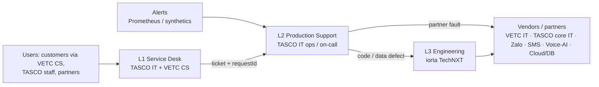

# Runbook and Support Guide — TASCO Growth Platform

| Item | Value |
|---|---|
| Service | `tasco-growth-platform` (log field `service`), Node.js 22, PostgreSQL 16 |
| Owner (BAU) | TASCO IT Production Support (L2), with iorta TechNXT engineering (L3) during hypercare and under the AMS contract |
| Related | [Monitoring and alerting](monitoring-and-alerting.md) · [DR and BCP](dr-bcp.md) · [Release and change management](release-and-change-management.md) · [Known issues KI-xx](../quality/test-strategy.md#appendix-a--known-issues-register-from-code-review-2026-10-07) |
| Status | v1.0 for the pilot (G3). Review after each hypercare week |

> **Sandbox vs production.** Today the integration adapters in the repo are sandboxes (`mockGateways.js`, `simulatedCaller.js`). The procedures below are written for production adapters with the **same names**: `vetc-wallet`, `tasco-core`, `voice-ai`, `app-push`, `zalo-zns` and `sms`. Partner-side contacts and portals are placeholders until the interface agreements (IIAs) are signed.

---

## 1. Support model



| Tier | Who | Hours | Scope | Tools / access |
|---|---|---|---|---|
| **L1 Service Desk** | TASCO IT service desk (staff and partner issues); VETC customer service (customers) | 08:00–20:00 ICT, 7 days; out of hours via the on-call phone for Sev 1 | Intake, triage with the severity matrix, known-error answers (KEDB), password-change guidance, capture of `X-Request-Id` / time / user / route | ITSM tool, this guide §6 (FAQ), read-only dashboards |
| **L2 Production Support** | TASCO IT production support engineers (`support_engineer` role) | 24×7 on-call rota | Runbooks RB-xx and SOP-xx, job reruns, breaker and backlog checks, config changes through CAB, escalation | `GET /api/ops/status`, `GET /api/ops/jobs`, `POST /api/ops/jobs/:kind`, Grafana, log search, `kubectl` (namespace-scoped), read-only DB replica |
| **L3 Engineering** | iorta TechNXT engineers (hypercare, then the AMS contract) | Business hours; 24×7 on-call for Sev 1 during hypercare | Code and data defects, hotfixes, DB data fixes under change control, root-cause analysis (RCA) | Repo, CI/CD, DB via break-glass with approval |
| **Vendors / partners** | VETC IT (wallet, SSO, app, events), TASCO core IT (policy admin), Zalo OA/ZNS, SMS brandname provider, voice-AI vendor, cloud/DB provider | Per contract | Faults in their systems | Their portals and status pages |

### 1.1 Severity matrix and SLAs

| Severity | Definition | Examples | Response (ack) | Update cadence | Restore / workaround | Resolve (permanent fix) |
|---|---|---|---|---|---|---|
| **Sev 1 — Critical** | Production down or core revenue path broken for many users; security or privacy breach; regulatory breach in progress | `/health/ready` failing on all pods; purchases failing > 20 %; customers charged without cover at scale; messages with banned wording sent; contact to DNC customers; audit chain verification fails; PII exposure | **15 min** (24×7) | Every 30 min | **4 h** | 5 business days (RCA within 5 business days) |
| **Sev 2 — High** | Major function degraded; workaround exists; single partner/channel down | Breaker open on `zalo-zns`; journeys not run for the day; partner API down for one partner; dead-letter events growing; telesales queue unavailable in one region | **30 min** (24×7) | Every 2 h | **8 h** | 10 business days |
| **Sev 3 — Medium** | Minor function impaired; low business impact | Dashboard slow; a single customer cannot verify a certificate; one user locked out | **4 business h** | Daily | 3 business days | Next release |
| **Sev 4 — Low** | Cosmetic, question, or request | Label wording, report request | 1 business day | On change | 10 business days | Backlog |

SLA clock: from alert or ticket creation. A Sev 1 or Sev 2 **opens a war room** (Teams/Zalo group "TASCO-GP-INCIDENT") with an Incident Commander (L2 lead), a Communications Lead and the L3 engineer.

### 1.2 On-call

| Item | Arrangement |
|---|---|
| Rota | Weekly, Monday 09:00 ICT handover; primary + secondary L2; L3 secondary from iorta during hypercare (4 weeks after each wave) |
| Paging | Alertmanager → PagerDuty/Opsgenie (or the TASCO equivalent) for `severity: page`; Teams/Zalo channel for `severity: ticket` |
| Handover | Open incidents, alerts silenced (with expiry), pending changes, jobs to watch (journeys at 08:30, reconcile nightly) |
| Escalation | Primary (15 min) → secondary (15 min) → L2 lead → TASCO IT Head (Sev 1 > 1 h) |
| Tools checklist | VPN, `kubectl` context, Grafana, log search, ITSM, this runbook, partner contact list (§9) |

---

## 2. System quick reference

| Item | Value |
|---|---|
| Probes | `GET /health/live` (process up), `GET /health/ready` → `{status, store, db}`; 503 when the DB ping fails, during shutdown, or before the server listens |
| Metrics | `GET /metrics` (Prometheus text). Names in [monitoring-and-alerting.md](monitoring-and-alerting.md) §3 |
| Ops status | `GET /api/ops/status` (perm `ops:read`): `store`, `integrations[{name, circuit: closed\|open\|half_open}]`, `rules[{kind, version, checksum}]`, `eventBacklog{pending, processing, done, dead_letter}`, `auditEntries` |
| Job history | `GET /api/ops/jobs`: last 50 runs with `kind`, `status`, `result`, `error` |
| Run a job (API) | `POST /api/ops/jobs/reconciliation`, `…/retention`, `…/relay` (perm `ops:run_jobs`) |
| Run a job (CLI) | `npm run job -- <migrate\|seed\|rules\|journeys\|recompute\|reconcile\|retention\|relay\|openapi>`. **Never run `seed` in production (KI-01)** |
| Scheduled jobs (CronJobs) | `journeys` (daily **08:30 ICT = 01:30 UTC**), `relay` (every 5 min, as a safety net; every pod also relays every 1 s), `reconcile` (nightly 01:00 ICT), `retention` (nightly 02:00 ICT), `recompute` (weekly Sunday 03:00 ICT) |
| Graceful shutdown | `SIGTERM` → readiness false → stop relay → close server → exit 0; forced exit after 25 s. The pod's `terminationGracePeriodSeconds` must be ≥ 30 |
| Circuit breakers | 5 consecutive failed calls (after 2 retries each, 100 ms jittered backoff, 5 s timeout) → open for 30 s → half-open probe. `voice-ai`: 30 s timeout, no retries |
| Outbox | `domain_events` statuses `pending → processing → done`; on handler failure back to `pending`; after 5 attempts `dead_letter` |
| Key config (env) | `DATABASE_URL`, `DB_POOL_MAX` (10), `JWT_SECRET`, `JWT_TTL_SECONDS` (1800), `DATA_KEYS`, `DATA_KEY_ACTIVE`, `BLIND_INDEX_KEY`, `MFA_REQUIRED_ROLES`, `CORS_ORIGINS`, `RATE_LIMIT_*`, `LOCKOUT_*`, `BODY_LIMIT_BYTES`, `TRUST_PROXY`, `DEMO_MODE` (must be false), `MIGRATE_ON_START` (set false in Kubernetes; the migration Job runs first), `METRICS_TOKEN` (bearer for `/metrics`), `LINK_TTL_DAYS` (30), `TRUST_PROXY_HOPS` (1). Secrets also via `<NAME>_FILE` |

### 2.1 Logs

The service logs one JSON object per line to stdout. PII keys are redacted (`[REDACTED]`).

| Log `msg` | Level | Fields | Meaning |
|---|---|---|---|
| `request` | info | `requestId`, `method`, `route` (e.g. `POST /api/customer/orders`), `status`, `ms` | Every API request (not health, metrics or static) |
| `unhandled error` | error | `requestId`, `path`, `err.message`, `err.stack` | 500 `INTERNAL_ERROR`: always investigate |
| `circuit opened` / `circuit closed` | warn / info | `integration`, `failures` | Breaker transitions |
| `event handler failed` | error | `type`, `handler`, `eventId`, `err` | Outbox subscriber failure (retried) |
| `outbox relay failed` | error | `err` | Relay loop error (usually the DB) |
| `job failed` / `job finished` | error / info | `kind` or `job`, `result` | Jobs |
| `journey run complete` | info | `date`, `due`, `done`, `skipped`, `cancelled`, `byChannel`, `byJourney` | Daily journeys |
| `order completed` | info | `orderId`, `channel` | Sale |
| `batch ingested` | info | `batchId`, `records`, `profiles` | Ingestion |
| `rule set activated` | info | `kind`, `id` | Rule change live |
| `pg pool error` | error | `err` | DB connectivity |
| `shutting down` / `server listening` / `migrations applied` | info | `signal` / `port`, `store` / `applied` | Lifecycle |
| `fatal startup error` | (stderr) | `err` | Boot failure (missing secret, bad `DATA_KEYS`, DB unreachable) |

Log queries (Loki LogQL shown; the `jq` equivalent works on `kubectl logs`):

```logql
# All 5xx in the last 15 min by route
sum by (route) (count_over_time({app="tasco-growth-platform"} | json | msg="request" | status >= 500 [15m]))

# Trace one request end to end
{app="tasco-growth-platform"} | json | requestId="3f2a9c1e-…"

# Slow purchases (> 3 s)
{app="tasco-growth-platform"} | json | msg="request" | route="POST /api/customer/orders" | ms > 3000

# Breaker transitions
{app="tasco-growth-platform"} | json | msg=~"circuit (opened|closed)"

# Failed sign-ins (401 on login)
sum(count_over_time({app="tasco-growth-platform"} | json | route="POST /api/auth/login" | status="401" [5m]))
```

```bash
kubectl logs deploy/tasco-growth-platform --since=15m | jq -c 'select(.msg=="request" and .status>=500) | {ts,requestId,route,status,ms}'
kubectl logs deploy/tasco-growth-platform --since=1h  | jq -c 'select(.level=="error") | {ts,msg,requestId,err:.err.message}'
```

The **audit trail** (DB, hash-chained) holds security and business events such as `auth.login_failed`, `auth.login_locked`, `auth.mfa_failed`, `rules.approved`, `order.issuance_failed`, `consent.withdrawn` and `dsar.erased`. Query it with `GET /api/audit?action=<action>&actor=<id>&entityId=<id>` (perm `audit:read`).

---

## 3. Incident runbooks

Each runbook has **Detect → Diagnose → Remediate → Verify → Follow-up**. Always record the `requestId`(s), timestamps (ICT) and actions in the incident ticket.

### RB-01 — Database down / readiness failing

| | |
|---|---|
| **Detect** | ALR-01 `ReadinessFailing`, ALR-02 `HighErrorRate`; `/health/ready` → 503 `{db:false}`; logs `pg pool error`, `outbox relay failed`; Kubernetes removes pods from Service endpoints |
| **Severity** | Sev 1 when all pods are not ready |
| **Diagnose** | 1. `kubectl get pods -l app=tasco-growth-platform` (Ready 0/1?). 2. `curl -s https://<host>/health/ready` → check `store` is `postgres` (if `memory`: **misconfiguration, KI-28: production is running without `DATABASE_URL`**; treat as Sev 1). 3. DB provider console: instance status, failover events, storage full, CPU, connections. 4. `SELECT count(*), state FROM pg_stat_activity GROUP BY 2;` (connection exhaustion: pods × `DB_POOL_MAX`). 5. Check for expired DB credentials or TLS certificates (`DATABASE_SSL` defaults on in production with `rejectUnauthorized:true`) |
| **Remediate** | **Failover in progress:** wait (managed HA: 60–120 s); the app reconnects by itself, no restart needed. **Storage full:** extend storage; then check for runaway tables (`domain_events`, `audit_log`, KI-13). **Connections exhausted:** scale the deployment down to the HPA minimum, restart the pods holding idle-in-transaction connections, enable or resize PgBouncer. **Credentials/TLS:** rotate the secret (`DATABASE_URL_FILE`), rolling restart. **Primary lost and not recoverable:** invoke [DR procedure FO-1](dr-bcp.md#6-failover-and-failback-procedures) |
| **Verify** | `/health/ready` 200 on every pod; `GET /api/ops/status` responds; `eventBacklog.pending` draining; run `POST /api/ops/jobs/reconciliation` for the outage window |
| **Follow-up** | Reconcile orders created during the outage (RB-11); run any missed journeys (RB-07) inside the contact window |

### RB-02 — Circuit open: VETC wallet (`vetc-wallet`)

| | |
|---|---|
| **Detect** | ALR-10 `CircuitOpen{integration="vetc-wallet"}`; `/api/ops/status` integration `vetc-wallet` `circuit:"open"`; customers get 503 `UPSTREAM_UNAVAILABLE` at payment; orders `payment_failed` |
| **Severity** | Sev 1 if it lasts > 15 min in business hours (revenue path); otherwise Sev 2 |
| **Diagnose** | 1. `sum by (result) (rate(integration_calls_total{integration="vetc-wallet"}[5m]))`: all errors, or timeouts? 2. Logs: `circuit opened`, `unhandled error`, upstream messages ("timed out after 5000ms"). 3. VETC status page / VETC IT bridge. 4. Network: egress allow-list / NetworkPolicy, DNS, mTLS certificate expiry |
| **Remediate** | The breaker is **self-healing**: every 30 s one request probes (half-open). Do **not** restart pods to "reset" it, because that only causes more load on VETC. 1. Raise a Sev 1/2 with VETC IT. 2. Ask VETC CS to post the in-app notice "Thanh toán tạm gián đoạn" if > 15 min. 3. Pause the journey CronJob if the outage is during the 08:30 run, so reminders do not drive customers into a broken payment flow (SOP-07). 4. Telesales: continue quoting and sending quotes (`POST /api/quotes/:id/send`); customers pay once the wallet recovers. Staff cannot take payment (enforced in code) |
| **Verify** | Circuit `closed`; `orders_completed_total` resumes; error ratio < 1 % |
| **Follow-up** | **Debits that timed out on our side may have been captured by VETC (KI-18):** list `payment_failed` orders in the window (RB-11 query) and reconcile them with the VETC settlement file; refund or issue as appropriate |

### RB-03 — Circuit open: TASCO core (`tasco-core`)

| | |
|---|---|
| **Detect** | ALR-10 for `tasco-core`; orders `issuance_failed_refunded`; audit `order.issuance_failed` |
| **Severity** | Sev 1: customers are charged and then refunded, and multi-line orders may be left with partial cover (KI-02) |
| **Diagnose** | As RB-02 for `integration="tasco-core"`; contact TASCO core IT (policy admin) |
| **Remediate** | 1. Pause sales entry points if the outage will last more than 30 min: suspend the journeys CronJob (SOP-07) and ask VETC to hide the renew banner (app config); partners are informed via the partner status channel. 2. Each failed order follows **RB-11** |
| **Verify** | Circuit closed; a test issuance in production with an internal test vehicle (pre-agreed with TASCO core), then cancel it |

### RB-04 — Circuit open: Zalo ZNS (`zalo-zns`), SMS (`sms`) or app push (`app-push`)

| | |
|---|---|
| **Detect** | ALR-10; ALR-31 `MessageFailureRatio`; `messages_total{status="failed",channel=…}` |
| **Severity** | Sev 2 (journeys degrade; customers can still self-serve) |
| **Diagnose** | Zalo: OA token expiry, template disabled or rejected by Zalo, daily quota exceeded. SMS: brandname registration, provider balance. Push: credentials and certificates (FCM/APNs) |
| **Remediate** | Touchpoints automatically **fall back to the next channel** in their step (e.g. `[app_push, zalo_zns, sms]`). If all channels in a step fail, the touchpoint is `skipped` (terminal, KI-05). For long outages, suspend the journeys CronJob (SOP-07) and resume after recovery, then re-queue the skipped touchpoints (RB-07) |
| **Verify** | `messages_total{status="sent"}` resumes for the channel |

### RB-05 — Circuit open or failures: voice-AI (`voice-ai`)

| | |
|---|---|
| **Detect** | ALR-10 for `voice-ai`; `voice_calls_total` flat in business hours; journeys `voice_bot` steps failing |
| **Severity** | Sev 2. BCP: [dr-bcp.md §8](dr-bcp.md#8-business-continuity-telesales-and-voice-vendor-outage) |
| **Remediate** | Vendor bridge. Pause voice campaigns (`POST /api/voice/campaign` is manual, so stop launching it). Journeys: the `voice_bot` steps fail; telesales steps continue. Supervisors raise agent capacity for hot leads from `GET /api/leads?tier=hot` |

### RB-06 — Outbox backlog or dead-letter events

| | |
|---|---|
| **Detect** | ALR-20 `DeadLetterEvents` (`increase(events_processed_total{status="dead_letter"}[15m]) > 0`); ALR-21 `OutboxBacklog`; `GET /api/ops/status` → `eventBacklog` |
| **Severity** | Sev 2 (side effects such as lead recompute, confirmation messages and cross-sell scheduling are delayed or lost) |
| **Diagnose** | 1. `GET /api/ops/status` → `eventBacklog` e.g. `{"done": 812345, "pending": 15000, "processing": 37, "dead_letter": 12}`. 2. Logs: `event handler failed` with `type`, `handler`, `eventId`, `err`. 3. Inspect dead letters (read-only replica):<br>`SELECT id, data->>'type' AS type, data->>'attempts' AS attempts, data->>'lastError' AS last_error, data->'handled' AS handled, occurred_at FROM domain_events WHERE status = 'dead_letter' ORDER BY occurred_at DESC LIMIT 50;`<br>4. Stuck `processing` (a replica died mid-relay): the Postgres relay **re-claims these automatically after 5 minutes**. If any are older than 10 minutes, the relay itself is not running (all pods failing `outbox relay failed`):<br>`SELECT count(*) FROM domain_events WHERE status = 'processing' AND updated_at < now() - interval '10 minutes';`<br>5. Large `pending` with no dead letters: the relay is slow (DB, slow handler such as a full recompute), or every pod is failing to relay (`outbox relay failed`) |
| **Remediate** | **Fix the cause first** (bad rule set, missing profile, DB issue). Then, under a change ticket (L3 + DBA), **re-queue**. There is no API for this yet (KI-03):<br>`-- 1. stuck processing → pending (normally unnecessary: auto re-claim after 5 min)`<br>`UPDATE domain_events SET status='pending', data=jsonb_set(data,'{status}','"pending"'), version=version+1, updated_at=now() WHERE status='processing' AND updated_at < now() - interval '10 minutes';`<br>`-- 2. selected dead letters → pending (attempts reset; already-succeeded handlers in data.handled are skipped)`<br>`UPDATE domain_events SET status='pending', data=jsonb_set(jsonb_set(data,'{status}','"pending"'),'{attempts}','0'), version=version+1, updated_at=now() WHERE status='dead_letter' AND id = ANY(ARRAY['<uuid1>','<uuid2>']::text[]);`<br>Then drain: `POST /api/ops/jobs/relay` (returns `{processed}`) or `npm run job -- relay`. Subscribers are idempotent (upserts, recompute) **except** that `policy.issued → confirmation-and-cross-sell` and `renewal.link_requested → send-link` **send customer messages again** if replayed after a partial success. Check `data.handled` before re-queuing those types |
| **Verify** | `dead_letter` count stable; `pending` returns to < 100 within minutes; for replayed `policy.issued`, confirm one confirmation message per order |
| **Follow-up** | RCA for the failing handler; add a regression test |

### RB-07 — Journey run skipped many touchpoints

| | |
|---|---|
| **Detect** | ALR-33 `JourneySkipSpike`; log `journey run complete` with high `skipped`; audit `journeys.run` details; `GET /api/touchpoints?status=skipped` |
| **Severity** | Sev 2 (lost renewals); Sev 1 if the run was **outside the contact window but marketing still went out** (should be impossible) |
| **Diagnose** | Group skip reasons:<br>`SELECT data->'result'->>'reason' AS reason, count(*) FROM touchpoints WHERE status='skipped' AND (data->>'executedAt')::timestamptz > now() - interval '1 day' GROUP BY 1 ORDER BY 2 DESC LIMIT 20;`<br>Typical causes: **(a)** `outside allowed contact hours`: the run executed before 08:00 or after 20:00 ICT. Check the CronJob schedule is in **UTC** (01:30 UTC = 08:30 ICT) and that nobody passed an `at` value outside the window. **(b)** `daily/weekly contact cap reached`: overlapping journeys and triggers. **(c)** `no marketing consent` or `not reachable on zalo_zns`: data or consent issue (expected). **(d)** `zalo_zns: failed …`: provider outage (RB-04). **(e)** `due` = 5,000 exactly: the run hit its **5,000 limit** (KI-05), so the remainder waits for the next run |
| **Remediate** | (a)/(d): touchpoints skipped only for **transient** reasons may be re-queued (change ticket, L3):<br>`UPDATE touchpoints SET status='scheduled', channel=NULL, data=jsonb_set((data - 'result' - 'executedAt') \|\| '{"channel":null}', '{status}', '"scheduled"'), version=version+1, updated_at=now() WHERE status='skipped' AND due_date >= CURRENT_DATE - 2 AND data->'result'->>'reason' NOT SIMILAR TO '%(consent\|do-not-contact\|cap reached\|not reachable)%';`<br>Then re-run **inside the window at the real current time**: `POST /api/journeys/run {}` (omit `at`). **Never pass an `at` value that differs from the real time in production**, because `at` overrides the contact-window check (KI-33; the same applies to `POST /api/voice/campaign`). (e): run the journeys job again (each run takes the next 5,000) until `due` < 5,000; schedule extra runs (e.g. 09:30, 11:00, 14:00 ICT) until KI-05 is fixed. (b) and (c) are expected behaviour; review caps with Compliance if volumes look wrong |
| **Verify** | Re-run summary `done` increases; no marketing message with `sentAt` outside 01:00–13:00 UTC:<br>`SELECT count(*) FROM messages WHERE (data->>'marketing')::boolean AND (extract(hour from sent_at AT TIME ZONE 'Asia/Ho_Chi_Minh') < 8 OR extract(hour from sent_at AT TIME ZONE 'Asia/Ho_Chi_Minh') >= 20);` → 0 |

### RB-08 — Audit chain verification fails

| | |
|---|---|
| **Detect** | ALR-40 (synthetic hourly `GET /api/audit/verify` → `ok:false`); the governance dashboard shows the chain broken |
| **Severity** | **Sev 1, treated as a security incident until proven otherwise.** Notify the TASCO CISO and the DPO |
| **Diagnose** | 0. `audit_log` is protected by DB triggers that reject UPDATE, DELETE (`trg_audit_log_immutable`) and TRUNCATE (`trg_audit_log_no_truncate`), so a break implies someone with owner or superuser rights disabled a trigger, or a restore went wrong. Check `SELECT tgname, tgenabled FROM pg_trigger WHERE tgrelid = 'audit_log'::regclass;` (`O` = enabled). 1. The result has `{ok:false, brokenAt:<index>, reason:"prev hash mismatch"\|"hash mismatch"}`. `brokenAt` is the 0-based position in `ORDER BY seq`. 2. `SELECT seq, id, at, actor, action, entity_type, entity_id, prev_hash, hash FROM audit_log ORDER BY seq OFFSET GREATEST(<brokenAt>-2,0) LIMIT 5;` 3. `hash mismatch` → that row's content (details, actor, action…) changed after writing. `prev hash mismatch` → a row was deleted or inserted out of band, or a partial restore happened. 4. Compare with the latest backup/PITR copy of `audit_log`. 5. Check DB audit logs (pgaudit or provider logs) for direct `UPDATE`/`DELETE` on `audit_log` and who did it |
| **Remediate** | **Do not "repair" the chain.** Preserve evidence: snapshot the DB, export `audit_log` to WORM storage. Revoke any compromised DB credentials. Follow the security incident procedure (containment, legal assessment of notification duties under the PDP rules). Under the CISO's direction, the original rows may be restored from backup into a forensic copy |
| **Verify** | A forensic report identifies the affected range; `verify` passes on the restored forensic copy |
| **Prevent** | Keep the immutability triggers enabled; `audit_log` INSERT/SELECT-only for the app role (no UPDATE/DELETE/TRUNCATE grants, no table ownership); pgaudit enabled (logs `ALTER TABLE … DISABLE TRIGGER`); nightly export of the chain head hash to an external store |
| **Note** | `verify` reads the whole table into memory (KI-12). At very large volumes run it on a read replica during off-peak hours |

### RB-09 — Login lockouts / sign-in failure spikes

| | |
|---|---|
| **Detect** | ALR-50 `LoginFailureSpike` (`status="401"` on `POST /api/auth/login`); ALR-51 lockouts (`status="423"`); ALR-52 login 429s; audit `auth.login_failed`, `auth.login_locked`, `auth.mfa_failed` |
| **Diagnose** | `GET /api/audit?action=auth.login_failed&limit=200`: look at `details.reason` (`unknown_user`, `bad_password`, `inactive`) and `details.ip`. **Many usernames from few IPs** → credential stuffing: Sev 2 security. **One user, many failures** → forgotten password. **Many 429 from the office NAT IP at shift start** → the per-IP login limit (10/min) is shared by agents behind one egress IP |
| **Remediate** | Lockout counts failures on **both** the password and the TOTP step. Credential stuffing: block the IPs at the WAF, confirm MFA is enforced for privileged roles, notify Security. Single user: the lock **expires after 15 min** (`LOCKOUT_MINUTES`). There is **no admin unlock API (KI-27)**; for urgent cases use SOP-08. Shift-start NAT: raise `RATE_LIMIT_LOGIN_MAX` through CAB, or make sure `TRUST_PROXY=true` and the gateway passes the real client IP |
| **Verify** | 401/423 rates back to baseline |

### RB-10 — Rule set activated by mistake → rollback

| | |
|---|---|
| **Detect** | Business report (wrong scores, wrong template, journey volumes jump); log `rule set activated`; audit `rules.approved`; `GET /api/ops/status` → `rules[]` version/checksum changed |
| **Severity** | Sev 1 if it causes customer harm (wrong price display, wrong wording, contacting the wrong audience); otherwise Sev 2 |
| **Remediate** | 1. **Contain outbound contact immediately** if the rule affects messaging or journeys: SOP-07 (suspend the journeys CronJob; do not launch voice campaigns). 2. Identify the last good version: `GET /api/rules?kind=<kind>` → the `retired` version with `supersededBy` = the bad id. 3. **Rollback is maker-checker too:** a `rule_author` calls `POST /api/rules/<good-id>/rollback` → creates a new draft `<kind>@N+1` with the good payload → `POST /api/rules/<kind>@N+1/submit` → a **different** user with `rule_approver` (MFA) calls `POST /api/rules/<kind>@N+1/approve {comment:"Incident INC-…"}`. Keep the on-call author and approver pair reachable for emergency rollbacks. 4. All replicas pick up the new active version within **≤ 15 s** (cache TTL; also invalidated by the `rules.activated` event). 5. If leads or journeys were affected: `POST /api/leads/recompute` (or `npm run job -- recompute`) to re-score and re-plan touchpoints |
| **Verify** | `GET /api/ops/status` shows the new version and checksum equal to the good one; spot-check `POST /api/rules/simulate` on 3 profiles; resume the journeys CronJob |
| **Follow-up** | Messages already sent cannot be recalled: Compliance assesses whether customer communication is needed |

### RB-11 — Payment captured but issuance failed (and other order mismatches)

| | |
|---|---|
| **Detect** | Audit `order.issuance_failed`; orders with status `issuance_failed_refunded`; nightly reconciliation result (`GET /api/ops/jobs` → `reconciliation` → `mismatches`); customer complaint "charged, no certificate" |
| **Severity** | Sev 1 if more than a handful, or if any refund failed |
| **Diagnose** | `SELECT id, status, data->>'paymentRef' AS payment_ref, data->'policies' AS issued, data->>'error' AS error, data->>'amount' AS amount, created_at FROM orders WHERE status IN ('issuance_failed_refunded','payment_failed','pending_payment') AND created_at > now() - interval '2 days' ORDER BY created_at;`<br>For each order: **(1)** In the VETC wallet back-office, check the debit `paymentRef` and whether the **refund** posted. Our code ignores refund errors (KI-02), so a refund may never have happened. **(2)** If `issued` is non-empty, those policies are **active** although the full amount was refunded (KI-02): `SELECT id, product, status FROM policies WHERE data->>'orderId' = '<orderId>';` **(3)** For `payment_failed`, check VETC for a capture anyway (timeout after capture, KI-18). **(4)** `pending_payment` > 1 h is flagged by reconciliation as "stuck" |
| **Remediate** | Decide with TASCO Finance per order: (a) **Customer still wants cover**: the quote is still `open`; the customer (or agent) retries with a **new** `Idempotency-Key` (re-using the old key returns the failed order, KI-31); a new quote is needed after the 24 h quote expiry. (b) **Partial policies issued and full refund done**: ask TASCO core ops to cancel those policies (port `cancelPolicy`), or recover the premium; record the decision in the ticket. (c) **Refund missing**: initiate the refund in the VETC back-office; record the refund ID in the ticket. (d) **Captured but `payment_failed`**: refund via VETC, or complete issuance manually with TASCO core and inform the customer. Then run `POST /api/ops/jobs/reconciliation` |
| **Verify** | Reconciliation `mismatches` = 0 for the window; the daily settlement report agrees (finance) |
| **Customer comms** | VETC CS template "Giao dịch chưa hoàn tất – đã hoàn tiền" (Compliance-approved) |

### RB-12 — High latency

| | |
|---|---|
| **Detect** | ALR-03 `LatencySLOBreach` (p95 per route); synthetics slow |
| **Diagnose** | 1. Which routes? `histogram_quantile(0.95, sum by (le, route) (rate(http_request_duration_seconds_bucket[5m])))`. 2. **Only routes that drain events inline** (`POST /api/*orders`, `POST /api/partner/v1/quotes`, `POST /api/data/ingest`, `POST /api/voice/sessions/:id/turns`, `PUT /api/customer/consent`, `POST /api/customer/expiry`, `POST /api/journeys/run`, `POST /api/ecosystem/events`, `POST /api/voice/campaign`)? With `eventBacklog.pending` high, they are doing the global backlog's work (KI-04): drain via `POST /api/ops/jobs/relay` or scale out, and find out why the backlog built up (e.g. a full recompute triggered by a big ingest). 3. **Orders only**: integration latency (`integration_calls_total` retries; vendor status). 4. **Everything**: DB (CPU, locks, `pg_stat_statements` top), pod CPU throttling, GC/memory (RB-13). 5. **Dashboards** are heavy at scale (KI-12); limit their use or move them to a read replica. 6. **Login** slow at shift start: scrypt CPU; scale out |
| **Remediate** | Scale out (`kubectl scale` or raise the HPA minimum via CAB emergency change); kill long-running ad-hoc queries; postpone `recompute` and `ingest` batches to off-peak hours |
| **Verify** | p95 back under SLO for 30 min |

### RB-13 — Memory growth / suspected leak

| | |
|---|---|
| **Detect** | ALR-60 `MemoryHigh` (`process_resident_memory_bytes` > 80 % of the container limit); OOMKilled restarts (ALR-61, `resets(process_uptime_seconds[1h])`) |
| **Diagnose** | 1. **Check the store first**: `/health/ready` → `store`. If `memory`, the pod is holding all data in RAM (KI-28): Sev 1 misconfiguration. 2. Growth correlated with traffic from many IPs → rate-limiter buckets (cleaned only above 50,000 keys). 3. Large requests: `POST /api/data/ingest` (5,000 records), dashboards and DSAR exports load large arrays. 4. `GET /api/audit/verify` loads the whole audit log (KI-12). 5. Take a heap snapshot on one pod: run with `NODE_OPTIONS=--heapsnapshot-signal=SIGUSR2` (set via CAB), `kill -USR2 1` in the container, copy the snapshot out, and hand it to L3 |
| **Remediate** | Rolling restart as a temporary measure (graceful: readiness drops first); raise the memory limit through CAB; L3 fix |
| **Verify** | RSS flat over 6 h |

### RB-14 — Certificate verification failures

| | |
|---|---|
| **Detect** | Complaints from customers, traffic police or inspection centres; `GET /api/public/certificates/:certNo` returning `valid:false`; 429s on that route; synthetic check ALR-71 |
| **Diagnose** | 1. `{"valid":false,"reason":"not_found"}` → no `policies` row with that certificate number. Check the order (RB-11): issuance may have failed after TASCO core issued the policy. 2. `valid:false, state:"not_yet_in_force"` → **expected for early renewals**: cover starts the day after the current expiry; the page shows the start date; explain this to the caller. `state:"expired"` → the policy has ended. Any other `state` (e.g. `cancelled`) is the policy status. 3. Valid in the API but the page fails → front-end/static issue: `/verify/<certNo>` serves `public/verify.html`; check the release image and the CSP (`script-src 'self'`). 4. 429 → per-IP limits (each verification costs 2 tokens, so 150/min per IP); inspection centres behind one NAT IP can hit it: allow-list them at the gateway or raise the limit |
| **Remediate** | As per the cause; for a missing policy row after successful TASCO core issuance, L3 inserts the policy from the TASCO core record (data fix under change control) |
| **Verify** | The QR scan shows a valid certificate |

### RB-15 — Partner API failures

| | |
|---|---|
| **Detect** | Partner reports; 401 spikes on `/api/partner/v1/*`; `quotes_total{channel="partner_api"}` flat |
| **Diagnose** | 401 → wrong or revoked key, or partner `suspended` (`GET /api/partners`); keys must start with `tpk_`. 404 "Quote not found" on bind → the quote belongs to another partner, or a typo. 422 → quote expired or converted. 200 with `status:"payment_failed"` on retry → KI-31 (use a new key) |
| **Remediate** | Re-issue the key (SOP-04); unsuspend through the partner manager (`PATCH /api/partners/:id {status:"active"}`) |

---

## 4. Standard operating procedures

### SOP-01 — Rotate the PII data-encryption key (`DATA_KEYS`)

Format: `DATA_KEYS="k1:<base64 32 bytes>,k2:<base64 32 bytes>"`. `DATA_KEY_ACTIVE` selects the key for new writes; it defaults to the **last** listed key. Ciphertext carries its key ID (`enc:v1:<keyId>:…`), so any key still listed can decrypt it.

| Step | Action | Owner |
|---|---|---|
| 0 | CAB standard change; schedule off-peak (22:00 ICT) | L2 |
| 1 | Generate the key in the vault/KMS: `openssl rand -base64 32` → store as `k2`. Never put it in git or tickets | Security |
| 2 | **Phase 1: distribute without activating.** Update the secret to `DATA_KEYS=k1:…,k2:…` **and set `DATA_KEY_ACTIVE=k1` explicitly**. Rolling restart of the Deployment **and** update of the CronJob/Job pods (they read the same secret) | L2 |
| 3 | Verify every pod runs with the new secret (`kubectl rollout status`; no `unknown data key` errors in logs) | L2 |
| 4 | **Phase 2: activate.** Set `DATA_KEY_ACTIVE=k2`; rolling restart. Skipping phase 1 lets old pods meet `k2` ciphertext they cannot decrypt (`unknown data key k2` → 500s) | L2 |
| 5 | Verify new writes use k2: `SELECT count(*) FROM profiles WHERE data::text LIKE '%enc:v1:k2:%';` grows | DBA |
| 6 | **Never remove k1** while any row still contains `enc:v1:k1:`. Rows are re-encrypted only when rewritten; there is no re-encryption job yet (KI-19) | Security |
| Rollback | Set `DATA_KEY_ACTIVE=k1` (keep k2 listed) | L2 |

`BLIND_INDEX_KEY` (phone search index) **must not be rotated** without a full rebuild of `profiles.phone_bidx` (no tooling, KI-19). Treat it as long-lived and protect it in the KMS.

### SOP-02 — Rotate `JWT_SECRET`

| Step | Action |
|---|---|
| Impact | There is a single HS256 secret with no key ID. Rotation **immediately invalidates**: all staff sessions (re-login + MFA), all customer sessions (1 h tokens), pending MFA challenges, **and every signed renewal link already sent** (the link HMAC key is derived from `JWT_SECRET`, KI-08; links otherwise expire after `LINK_TTL_DAYS`, default 30). Customers opening older reminders see "Link invalid or expired" and must open the app directly |
| Planned rotation | Every 90 days, or on staff turnover with secret access. Schedule **after 20:00 ICT** (no sends), ideally the evening before a journey run so that new links are generated the next morning. Announce to staff 24 h ahead |
| Steps | 1. Generate ≥ 48 random bytes in the KMS. 2. Update the `JWT_SECRET` secret. 3. Roll out fast (`maxSurge` 100 %) to minimise the mixed period in which tokens signed by new pods fail on old pods. 4. Verify login works; `GET /api/auth/me` 200 |
| Emergency (compromise) | Rotate immediately regardless of the time; Sev 1; disable affected users; review `auth.login` audit entries since the suspected exposure |

### SOP-03 — User offboarding

1. The HR/line-manager ticket triggers it (same day; within 1 h for involuntary exits).
2. Admin: `PATCH /api/users/<id> {"status":"disabled"}`. **Effective on the next request**: `authenticate()` reloads the user and rejects non-active users, so existing tokens stop working immediately.
3. Supervisor: reassign the user's open or claimed handoffs: `GET /api/handoffs?status=claimed` (filter `assignedTo`), then `PATCH /api/handoffs/<id> {"assignTo":"<new user>"}`.
4. If the user was a `rule_author`, review their drafts and pending rule sets (`GET /api/rules?status=pending_approval`) and reject or re-own them.
5. Remove VPN, IdP and console access. Rotate any shared secret the user knew (SOP-01/02/04).
6. Evidence: audit `user.updated`; attach it to the ticket. Quarterly access review: `GET /api/users`, signed by each line manager.

### SOP-04 — Partner API key issue, rotation and revocation

| Action | Procedure |
|---|---|
| Issue | Partner manager: `POST /api/partners/<partnerId>/keys`. The response contains `apiKey` (`tpk_…`) **once**; only its SHA-256 is stored. Deliver it through a secure channel (split delivery: key by encrypted email, password by SMS). Record `keyId` and `prefix` |
| Rotate | Issue a new key → the partner deploys it → revoke the old key. Both are valid in between |
| Revoke | `DELETE /api/partners/keys/<keyId>` → **immediate** (keys are looked up on every request). Unknown `keyId`? There is no list endpoint; find it in the audit trail: `GET /api/audit?action=partner.api_key_issued&entityId=<partnerId>` → `details.keyId`, `details.prefix` |
| Suspend a partner | `PATCH /api/partners/<id> {"status":"suspended"}`: all of the partner's keys stop working |
| Leak suspected | Revoke immediately (Sev 2 security); review `GET /api/partner/v1/policies` activity and orders by `partnerId` since the exposure |

### SOP-05 — Data subject requests (DSAR)

| Step | Detail |
|---|---|
| Intake | Via the TASCO hotline/email or VETC CS → ITSM "DSAR" ticket. Verify identity per the TASCO procedure (no processing before verification). Legal clock per the PDP Law 2025 and Decree 13/2023/ND-CP (**Legal confirms deadlines**; internal target: acknowledge within 1 business day, complete access within 72 h) |
| Locate | The data subject is identified by vehicle: profile id = canonical plate key (e.g. `30A12345`). A staff user with `profile:read` can confirm it via `GET /api/customers/<id>` (PII visible only with `profile:read_pii`) |
| Access / portability | `compliance_officer` (MFA): `POST /api/dsar/<id>/export` → JSON with profile, lead, policies, messages, source records and voice sessions. Deliver as an encrypted archive. The customer can also self-serve via `GET /api/customer/data-export` |
| Erasure | `POST /api/dsar/<id>/erase`. **422 "Active policy in force …"** → reply with the legal basis (insurance records retained until expiry plus the statutory period) and diarise erasure for after expiry. On success: name, phone and alt phones are nulled, the profile is DNC, the lead deleted, messages blanked, transcripts emptied and source PII nulled; future re-ingests do not re-identify it. Handoffs (name, masked phone, notes) and claims (description, location) are also cleared (KI-29 fixed). Policies and orders are retained under the legal obligation, linked by plate only |
| Objection / withdraw consent | The customer uses the consent centre (`PUT /api/customer/consent`) or the voice bot ("đừng gọi nữa" → DNC). Staff cannot edit consent via API; via CS, record it in the ticket and have the customer use the app, or L3 applies it as a data fix |
| Other systems | Forward the request to VETC (app, wallet) and TASCO core (policy admin), which have their own records |
| Close | Attach the audit entries `dsar.access_exported` / `dsar.erased` to the ticket |

### SOP-06 — Data correction by the data steward

| Case | Procedure |
|---|---|
| Wrong policy expiry date | `data_steward` (MFA): `PATCH /api/customers/<id>/expiry {"expiryDate":"YYYY-MM-DD","insurer":"…","evidence":"<document reference>"}`. Evidence is mandatory and lands in the audit (`profile.expiry_corrected`); the lead is recomputed at once |
| DQ queue | `GET /api/dq/issues?type=<type>` → fix at the source → `POST /api/dq/issues/<id>/resolve {"resolution":"…"}`. If the next ingest detects it again, it reopens |
| Wrong name or phone | No direct edit API (data minimisation). Correct it in the **authoritative source** (VETC account, TASCO core) and let the next extract update it, or ingest the corrected record from that source: `POST /api/data/ingest {"source":"vetc_account","records":[…]}`. Survivorship takes the higher-trust source |
| Plate mismatch / wrong person from the voice bot | DQ issue types `plate_mismatch` / `wrong_person`: confirm with VETC CS, then correct the phone in the source system |
| Bulk correction | Change ticket + CSV → ingest in batches of ≤ 2,000 records (KI-16); check the response's `rejected` and `profilesTouched` |

### SOP-07 — Emergency stop of outbound contact (kill switch)

There is no single application flag. Use these levers, from fastest:

1. **Suspend the journeys CronJob:** `kubectl patch cronjob <journeys-cronjob> -p '{"spec":{"suspend":true}}'`, using the CronJob name from `deploy/k8s/` (no scheduled reminders, calls or telesales tasks).
2. **Stop manual runs:** instruct campaign managers not to use `POST /api/journeys/run` or `POST /api/voice/campaign`; optionally remove `journeys:run` from roles via CAB.
3. **Block marketing in rules** (maker-checker, ~15 s to converge): approve a `contact_policy` version with `maxMarketingContactsPerDay: 0` → every marketing contact is blocked by the cap. Service messages (confirmations, lapsed notice) still flow.
4. **Event triggers** (`POST /api/ecosystem/events`) still send service messages and `wallet_topup` marketing (subject to caps); to stop them, pause the VETC event feed at the source.

Resume in reverse order; re-queue the touchpoints skipped during the stop if appropriate (RB-07).

### SOP-08 — Unlock a user / reset MFA / reset password (until KI-27 is fixed)

Under a change ticket approved by the TASCO IT security lead (break-glass DB access, L3 + DBA):

```sql
-- unlock (non-PII fields of users.data)
UPDATE users SET data = data || '{"failedLogins":0,"lockedUntil":null}', version = version + 1, updated_at = now() WHERE id = 'U-xxxxxxxx';
```

MFA reset and password reset need application-side crypto (scrypt hash, AES-encrypted `totpSecret`). Do **not** edit them by hand. L3 runs a one-off script that generates a **new** TOTP secret and sets `mfaEnrolled:false`, so the user self-enrols again at the next sign-in; only flipping `mfaEnrolled` would leave the lost device valid. For a password reset the script sets a temporary password with `mustChangePassword:true`. Record everything in the ticket, because these DB edits bypass the application audit trail.

### SOP-09 — Re-running scheduled jobs

| Job | How | Safe to re-run? |
|---|---|---|
| `relay` | `POST /api/ops/jobs/relay` or `npm run job -- relay` | Yes |
| `reconcile` | `POST /api/ops/jobs/reconciliation` | Yes (read-only) |
| `retention` | `POST /api/ops/jobs/retention` | Yes (idempotent deletes by cutoff) |
| `journeys` | `npm run job -- journeys` / `POST /api/journeys/run {}` | Yes, **only between 08:00 and 20:00 ICT** at the real time; already-executed touchpoints are not re-sent |
| `recompute` | `npm run job -- recompute` / `POST /api/leads/recompute` | Yes; heavy (hours at 6 M, KI-12): off-peak only |
| `migrate` | Migration Job before rollout | Yes (applied migrations are skipped) |
| `rules` | `npm run job -- rules` | Yes: only seeds kinds that have no version yet |
| `seed` | **Never in PROD** (KI-01) | — |

---

## 5. Health-check routine (daily, L2)

| Time (ICT) | Check | Pass |
|---|---|---|
| 08:00 | `GET /api/ops/status`: all integrations `closed`; `eventBacklog.dead_letter` unchanged; `rules[]` checksums match the change log | ✔ |
| 08:00 | Last night's `reconciliation`, `retention`: `GET /api/ops/jobs` → `succeeded`, `mismatches` = 0 | ✔ |
| 09:00 | Journeys run at 08:30: `journey run complete` log; `due` < 5,000 (else schedule extra runs, KI-05); skip reasons normal | ✔ |
| 09:00 | Audit chain: synthetic `verify` ok | ✔ |
| 12:00 / 17:00 | Business KPIs: quotes and orders in line with the same weekday last week ([monitoring](monitoring-and-alerting.md) §6) | ✔ |
| Weekly | Access review delta; secret ages; certificate expiries; backup restore test result ([DR](dr-bcp.md)) | ✔ |

## 6. L1 known-error quick answers (KEDB)

| Symptom reported | Likely cause | L1 action |
|---|---|---|
| "Account temporarily locked" | 5 failed sign-ins | Wait 15 min; escalate to L2 only if urgent (SOP-08) |
| First sign-in shows a QR code / must change password | Normal: self-enrolment of the authenticator and initial password change | Guide the user through enrolment (scan with an authenticator app) |
| Lost or replaced phone (authenticator) | No admin MFA-reset API yet (KI-27) | Ticket to L2 → SOP-08 |
| "Too many sign-in attempts — wait a minute" | Login rate limit per IP | Wait 60 s; if the whole office is affected → L2 (RB-09) |
| Customer: "Link invalid or expired" | Link from before a JWT rotation, or a mistyped link | Ask the customer to open the VETC app directly → Insurance |
| Customer: "Quote expired — please re-quote" | Quote older than 24 h | Re-quote in the app |
| Customer charged, no certificate | Issuance failure | Sev 2 ticket to L2 with time, plate and order reference (RB-11) |
| Agent asks how to take payment | Staff never take payment: quotes are sent to the customer's app (`POST /api/quotes/:id/send`) | Explain the assisted-sale flow; the customer pays in the VETC app |
| QR says not valid but the customer just renewed | Cover starts the day after the old policy ends | Explain the start date |
| Agent cannot open a customer | Region restriction (ABAC) | Expected; the supervisor reassigns |
| Error with "quote the request id" | Unexpected 500 | Ticket to L2 with the `requestId` |

## 7. Incident communication

| Audience | Channel | Owner | When |
|---|---|---|---|
| War room | Teams/Zalo "TASCO-GP-INCIDENT" bridge | Incident Commander | Sev 1/2 start |
| TASCO IT Head, Business Owner | Phone + email | Communications Lead | Sev 1 within 30 min; then hourly |
| VETC IT / CS | Shared incident channel | Communications Lead | Any customer-facing impact |
| Customers | In-app banner / ZNS service message (Compliance-approved templates) | VETC CS + TASCO Marketing | Sev 1 > 30 min on the purchase path |
| Partners | Partner status email | Partner Manager | Partner API impact > 15 min |
| Regulator / data subjects | Per Legal / DPO | DPO | Personal data breach (statutory timelines) |

Post-incident: blameless RCA within 5 business days for Sev 1/2, with actions tracked to closure and runbook updates.

## 8. Escalation contacts (to be completed at G3)

| Party | Role | Contact | Hours |
|---|---|---|---|
| TASCO IT Production Support | L2 on-call | (rota tool) | 24×7 |
| iorta TechNXT | L3 engineering on-call | (rota tool) | 24×7 in hypercare |
| VETC IT | Wallet / SSO / app / events | TBD in IIA | 24×7 |
| TASCO core IT | Policy admin | TBD | Business hours + Sev 1 on-call |
| Zalo | OA / ZNS account manager | TBD | Business hours |
| SMS brandname provider | NOC | TBD | 24×7 |
| Voice-AI vendor | NOC | TBD | 24×7 during campaign hours |
| Cloud / DB provider | Support | TBD | 24×7 |
| TASCO CISO / DPO | Security and privacy incidents | TBD | 24×7 for Sev 1 |
