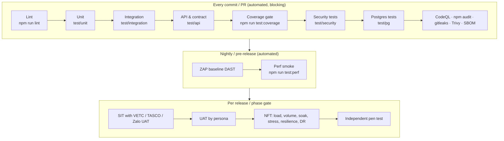
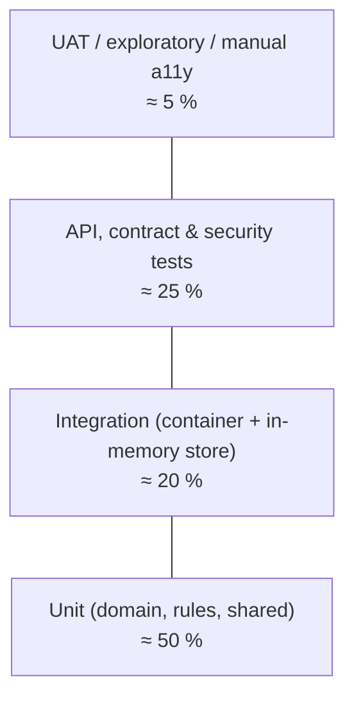
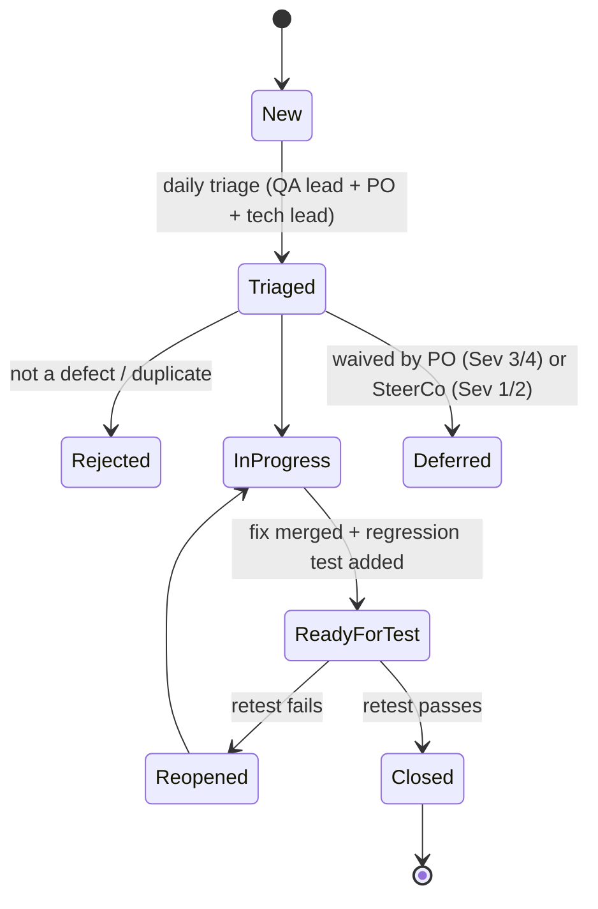

# Test Strategy — TASCO Growth Platform

| Item | Value |
|---|---|
| System under test | `tasco-growth-platform` v1.0.0 (Node.js ≥ 22.12, PostgreSQL 16 or in-memory store) |
| Client | TASCO Insurance, with VETC as ecosystem and channel partner |
| Delivery partner | iorta TechNXT |
| Document owner | iorta TechNXT QA Lead |
| Approvers | TASCO IT Head, TASCO Business Owner, TASCO Compliance, VETC IT Lead |
| Status | Baseline v1.0, aligned with [project plan](../delivery/project-plan.md) gates G2 (build complete), G3 (go/no-go) and G4 (scale) |
| Related | [Test case catalogue](test-case-catalogue.md) · [Performance and capacity plan](performance-and-capacity-test-plan.md) · [UAT plan](uat-plan.md) · [Operations docs](../operations/README.md) |

> **Sandbox and production.** The repository ships **sandbox adapters only** for the outbound integrations: the VETC wallet, TASCO core policy administration, Zalo ZNS, SMS, app push (`src/adapters/integrations/mockGateways.js`) and the voice-AI caller (`src/adapters/integrations/simulatedCaller.js`). Synthetic VETC source data comes from `syntheticVetcSource.js`. Unit, integration, API, security and performance tests in this repository run against those sandboxes. **SIT against the real VETC, TASCO and Zalo UAT endpoints needs the production adapters**, which are on the Sprint 2–3 backlog. SIT cases are written now so they can run as soon as the adapters exist. Do not read any result in this document as evidence about real partner behaviour unless it is labelled SIT or later.

---

## 1. Scope

### 1.1 In scope

| Area | Components (code) | Main risks tested |
|---|---|---|
| HTTP pipeline and platform | `src/adapters/http/app.js`, `router.js`, `security.js`, `openapi.js`; `/health/live`, `/health/ready`, `/metrics`, `/api/openapi.json` | Wrong status codes, missing security headers, request-size abuse, CORS bypass, contract drift |
| Identity and access | `identityService.js`, `accessPolicy.js`, `config/security/rbac.json`, `config/rules/abac.json`, `shared/crypto.js` | Broken authentication, MFA bypass, privilege escalation, IDOR, PII leakage |
| Data enrichment and MDM | `ingestionService.js`, `domain/enrichment.js`, `domain/identity.js`, `config/rules/enrichment.json` | Wrong golden record, plate and phone normalisation errors, lost customer declarations, DQ issues not raised |
| Lead scoring and NBA | `leadService.js`, `domain/leads.js`, `config/rules/scoring.json`, `nba.json`, `benefits.json` | Mis-prioritised leads, unexplainable scores, benefits pending legal review reaching customers |
| Journey engine | `journeyService.js`, `domain/contactPolicy.js`, `journeys.json`, `triggers.json`, `contact_policy.json`, `copy_guard.json`, `content.messages.json` | Spam, contact outside 08:00–20:00 ICT, contact with DNC customers, banned discount wording, missed touchpoints |
| Voice bot and telesales | `voiceService.js`, `domain/voicebot.js`, `content.voicebot.json`; `/api/voice/*`, `/api/handoffs/*` | Plate disclosure, opt-out not honoured, wrong handoffs, agents seeing other agents' work |
| Sales | `salesService.js`, `domain/rating.js`, tariffs, `products.json`, `commission.json` | Wrong premium, double charge, quote reuse after expiry, payment without policy, commission above the statutory cap |
| Partner channel | `partnerService.js`, `/api/partner/v1/*` | Key leakage, cross-partner IDOR, unknown-plate onboarding abuse |
| Claims FNOL | `claimsService.js` | Illegal state transitions, claims against other customers' policies |
| Rules governance | `rulesService.js`, `rules/validators.js`, `jsonLogic.js`, `decisionTable.js` | Self-approval, invalid rule activated, cache not refreshed across replicas |
| Privacy and audit | `customerService.js` (DSAR), `auditService.js`, `persistence/auditChain.js`, `persistence/codec.js` | Erasure with an active policy, PII in clear at rest, audit tampering not detected |
| Operations | `opsService.js`, `outboxEventBus.js`, `src/jobs/cli.js`, `src/server.js`, `shared/resilience.js`, `shared/metrics.js`, `shared/logger.js` | Lost events, dead letters, unreconciled orders, unsafe shutdown, missing telemetry |
| Persistence | `memoryStore.js`, `postgresStore.js`, `db/migrations/*.sql`, `schema.js` | Adapter drift between memory and Postgres, migration failures, SQL injection |
| Front-ends | Staff console, customer app (`/app/`), public verification page (`/verify/<certNo>`) under `public/` (UX workstream) | Accessibility, localisation, usability |
| Deployment assets | `Dockerfile`, `docker-compose.yml`, `deploy/k8s/*`, `railway.json`, `.github/workflows/ci.yml` | Image vulnerabilities, probe misconfiguration, missing CronJobs |

### 1.2 Out of scope (tested by the owning party)

- Internal behaviour of TASCO core policy administration, the VETC wallet ledger, VETC SSO, Zalo ZNS delivery, the SMS brandname gateway and the voice-AI vendor's ASR/TTS. We test **our contract with them** in SIT, not their internals.
- Claims adjudication. The platform is the FNOL front door only.
- The TASCO enterprise IdP (Azure AD or Keycloak via OIDC, see the comment in `identityService.js`). Federation is tested in SIT once it is configured.

---

## 2. Test levels and types

### 2.1 Unit tests — `test/unit/*.test.js` (`npm run test:unit`)

- **Target:** pure domain and shared modules. Examples: `domain/identity.js` (plate and phone normalisation, spoken-plate extraction), `domain/enrichment.js`, `domain/leads.js` (facts, journey assignment, scoring, NBA, benefits, touchpoint planning), `domain/rating.js` (three rating methods, cover start date, commission cap), `domain/contactPolicy.js`, `domain/voicebot.js` (dialogue state machine), `rules/*` (JSON Logic, decision tables, validators), `shared/*` (crypto, validation, resilience, metrics, logger redaction, config) and `persistence/*` (codec, audit chain, query semantics, schema ↔ migration parity).
- **Runner:** `node:test` (built into Node 22). No third-party test framework, consistent with the platform's minimal-dependency policy (one runtime dependency: `pg`).
- **Rules:** deterministic (inject `clock` and `SIM_TODAY`, and seed the RNG with `SEED`); no network; no real time unless the test is about time (TOTP windows, circuit-breaker reset).

### 2.2 Integration tests — `test/integration/*.test.js`

- **Target:** application services wired through `createContainer(config)` with the **in-memory store** and sandbox gateways. Examples: ingest → rebuild → `profiles.rebuilt` event → lead recompute → touchpoints; purchase → `policy.issued` → confirmation message and cross-sell touchpoints; rule approve → `rules.activated` → cache invalidation.
- Faults are injected by replacing a gateway `port`, for example a wallet that throws `errors.upstream`, or a policy admin that fails on the second line.

### 2.3 API and contract tests — `test/api/*.test.js` (`npm run test:api`)

- **Target:** every route in `src/adapters/http/routes.js` (76 at the time of writing: 6 public, 57 staff, 9 customer, 4 partner; tests derive the list from the route table so the count can change) over real HTTP. Each test starts `createHttpApp(container)` on an ephemeral port.
- **Contract:** `GET /api/openapi.json` is generated from the route table, so contract tests check that the document:
  - lists every route;
  - declares `security` per audience (`bearerAuth` or `partnerApiKey`);
  - marks `Idempotency-Key` as required on the two order routes (`/api/customer/orders`, `/api/partner/v1/orders`);
  - sets `additionalProperties: false` on request bodies.
- `npm run job -- openapi` writes `docs/api/openapi.json`. CI diffs it against the committed copy, and partners get a change notice when it differs (see [release and change management](../operations/release-and-change-management.md)).
- **Authorisation matrix:** for every route × every role in `rbac.json`, the expected outcome (2xx, 401 or 403) is asserted table-driven from the `perm` field. The matrix covers every route × 15 roles (76 × 15 at the time of writing).
- **Negative paths:** 400 (validation, unknown property), 404, 405, 409, 413, 415, 422, 423 and 429.

### 2.4 System integration testing (SIT) — VETC, TASCO and Zalo sandboxes

| Interface (port) | Counterparty environment | Key SIT scenarios | Prerequisite |
|---|---|---|---|
| PaymentGateway `debit` / `refund` | VETC wallet UAT | Debit idempotency on `orderId`; timeout then retry returns the same `transactionId`; refund after an issuance failure; insufficient balance → 4xx (non-retryable, so the breaker does not count it) | Real VETC wallet adapter, test wallets with balances |
| Customer SSO token exchange | VETC identity UAT | VETC SSO token → `POST /api/customer/session`; expired token, wrong audience | Production verification in place of the sandbox `issueCustomerToken` |
| PolicyAdministration `issuePolicy` | TASCO core UAT | Issue TNDS car or motorbike, MOTOR_PD and PA_SEAT; certificate URL and QR; multi-line order with a failure on line 2 (compensation, see KI-02) | TASCO core adapter, product mapping signed off |
| NotificationChannel `zalo_zns` | Zalo ZNS sandbox / OA test | Approved template IDs per `templateKey`; parameter mapping; delivery receipts | Zalo template approval (readiness item PRC-COMP-05) |
| NotificationChannel `sms` | SMS brandname test account | Brandname registered; Vietnamese diacritics and length | Brandname registration |
| NotificationChannel `app_push` | VETC app push (FCM/APNs) test project | Deep link `…/app/?r=<signed>&j=<journey>` opens one-tap renewal | VETC app build with deep-link handler |
| Telephony `runCall` | Voice-AI vendor test SIP trunk | ASR text turns into the dialogue engine; plate-first verification; opt-out; transfer to telesales | Vendor contract and test numbers |
| Ecosystem events | VETC event feed (staging) | `vetc.tag_activated`, `vetc.inspection_booked`, `vetc.wallet_topped_up`, `vetc.long_trip_started` → `POST /api/ecosystem/events` | Event feed or webhook relay |
| Batch extracts | VETC accounts and TASCO core policy extracts (masked) | `POST /api/data/ingest` with batches of ≤ 5,000 records; reject handling; lineage | Data-sharing agreement, masking pipeline |

SIT runs on the **SIT environment** (Postgres, `DEMO_MODE=false`, real adapters pointing at partner UAT). Exit: all SIT cases P1/P2 passed, interface defects closed or waived by both parties (milestone M6, 8 Jan 2027).

### 2.5 User acceptance testing (UAT)

Business scenarios by persona: campaign manager, telesales agent and supervisor, rule author and approver, compliance officer, data steward, claims handler, partner manager, partner API consumer, customer (VETC app and Zalo), executive, auditor, admin and production support. The detailed plan, scenarios and sign-off sheet are in [uat-plan.md](uat-plan.md). The persona manuals in `docs/manuals/` are the step-by-step scripts.

### 2.6 Non-functional testing (NFT)

| Type | Objective | Approach | Owner | Detail |
|---|---|---|---|---|
| Performance (load) | Meet the p95 SLOs at expected peak | `npm run test:perf` (`test/perf/load.js`, reports p50/p95/p99 and RPS); k6 optional for distributed load | Perf engineer | [Perf plan](performance-and-capacity-test-plan.md) §5 |
| Volume | 6M vehicle profiles; incremental rebuild by plate; lead recompute at full scale | Synthetic generator at 6M (`SEED_RECORDS`), Postgres PERF environment | Perf engineer + Data | Perf plan §5 PERF-S7–S9 |
| Stress | Find the breaking point and confirm graceful degradation (429 and 503, no 500 storm, no data corruption) | Ramp to 2–3× peak | Perf engineer | Perf plan PERF-S10 |
| Soak | No memory growth or connection leaks over 8–24 h | Constant 60 % peak, watch `process_resident_memory_bytes` | Perf engineer | Perf plan PERF-S11 |
| Security — SAST | Code-level flaws | CodeQL (CI), ESLint | DevSecOps | §2.7 |
| Security — dependencies | Known CVEs | `npm run audit` (`--omit=dev --audit-level=high`), SBOM (CycloneDX) | DevSecOps | §2.7 |
| Security — secrets | No secrets in git | gitleaks (CI) | DevSecOps | §2.7 |
| Security — container | Image CVEs and misconfiguration | Trivy image + config scan (CI) | DevSecOps | §2.7 |
| Security — DAST | Runtime flaws | OWASP ZAP baseline against the SANDBOX deployment (CI, nightly); authenticated ZAP full scan before G3 | DevSecOps | §2.7 |
| Security — abuse cases | IDOR, JWT tampering, lockout, MFA, rate limits, traversal, injection | `test/security/*.test.js` (`npm run test:security`) | QA + DevSecOps | Catalogue §SEC |
| Penetration test | Independent assurance | Third-party test (grey-box, OWASP ASVS L2 scope) in UAT week T2 | TASCO Security | Readiness PRC-SEC-08 |
| Resilience / chaos | Circuit breakers, outbox retries, DB failover, pod loss | Fault injection (§2.8) | SRE | Catalogue §RES |
| DR | RPO/RTO achievable | Restore from PITR; regional failover drill | SRE + DBA | [dr-bcp.md](../operations/dr-bcp.md) §7 |
| Accessibility | WCAG 2.2 AA | axe-core automated scan on every page + manual screen reader (NVDA/Windows, VoiceOver/iOS, TalkBack/Android) + keyboard-only | QA + UX | §2.9 |
| Usability | Agents and customers complete key tasks | Moderated sessions per `docs/ux/usability-testing-plan.md` | UX | UAT plan §7 |
| Localisation | Vietnamese is primary, English secondary | §2.10 | QA + TASCO Business | Catalogue §L10N |
| Compliance | Regulatory controls in code and rules | §2.11 | QA + Compliance | Catalogue §COMP |
| Data quality and reconciliation | Golden record and financial integrity | §2.12 | Data steward + QA | Catalogue §DATA, §OPS |
| Migration | Schema and data migrations safe and repeatable | §2.13 | DBA + QA | Catalogue §PG |

### 2.7 Security testing

| Control | Tool / test | Gate |
|---|---|---|
| Static analysis | CodeQL (`javascript` queries, security-extended) | No new high or critical alerts on the PR |
| Lint | `npm run lint` (ESLint 9 flat config) | Zero errors |
| Dependencies | `npm run audit` | No high or critical issues in production dependencies |
| SBOM | CycloneDX SBOM attached to each release | Generated for every tagged build |
| Secrets | gitleaks over the full history on PRs | Zero findings (false positives allow-listed with justification) |
| Container | Trivy (`image`, `config`) | No critical findings; high findings need a waiver with expiry |
| DAST | ZAP baseline (passive) nightly on SANDBOX; authenticated active scan pre-G3 | No high-risk alerts; mediums triaged |
| Abuse cases | `test/security/*.test.js` | All pass |
| Pen test | Independent vendor | No open critical or high findings at G3; mediums have a dated plan |

Abuse-case coverage maps to concrete controls in the code:

| Control in code | Abuse case IDs (catalogue) |
|---|---|
| `verifyJwt` rejects `alg` other than HS256, bad signature, expired, wrong audience; tokens issued before a password, role or status change are rejected (`tokensValidAfter`) | TC-013–TC-016, TC-011 |
| Lockout after `LOCKOUT_MAX_FAILURES` (5) failures across password and TOTP steps, for `LOCKOUT_MINUTES` (15) → 423 `ACCOUNT_LOCKED`; TOTP replay rejected | TC-005, TC-006, TC-020 |
| Login rate limit `RATE_LIMIT_LOGIN_MAX` (10/min per IP) → 429 with `Retry-After: 60` | TC-121 |
| Global rate limit `RATE_LIMIT_MAX` (300/min per IP; certificate verification costs 2) → 429 | TC-122 |
| Body limit `BODY_LIMIT_BYTES` (1 MiB) → 413; non-JSON content type → 415 | TC-118, TC-119 |
| Static path traversal guard (`file.startsWith(PUBLIC_DIR + sep)`) | TC-120 |
| Allow-list validation (unknown property → 400) | TC-117 |
| Parameterised SQL + `assertColumns` filter allow-list | TC-123, TC-124 |
| Ownership checks on customer and partner quotes | TC-071, TC-081 |
| Maker-checker | TC-090, TC-091 |
| PII encryption at rest (AES-256-GCM) and log redaction | TC-108, TC-109 |

### 2.8 Resilience and chaos testing

| Fault | Injection method | Expected behaviour (from code) |
|---|---|---|
| VETC wallet slow or down | Sandbox port with delay > 5 s or errors | Timeout 5 s, 2 retries with jittered backoff (`baseDelayMs` 100), circuit opens after 5 consecutive failed calls and short-circuits for 30 s (`integration_short_circuit_total{integration="vetc-wallet"}`); order goes to `payment_failed`; API returns 503 `UPSTREAM_UNAVAILABLE` |
| TASCO core down after capture | Policy admin port throws | Compensation: refund attempted, order goes to `issuance_failed_refunded`, audit `order.issuance_failed` (see KI-02) |
| Zalo ZNS or SMS down | Notification port throws | Message stored `status:"failed"`; the next channel in the step is tried; `messages_total{status="failed"}` rises |
| Voice-AI down | Telephony port throws | Breaker `voice-ai` (timeout 30 s, no retries); touchpoint execution errors |
| Event handler failure | Subscriber throws | Event goes back to `pending`, `attempts` increments; after 5 attempts → `dead_letter`; `events_processed_total{status="dead_letter"}` |
| Process crash mid-relay | `kill -9` during relay | Postgres: events left in `processing` are re-claimed after 5 min and handlers already completed (`handled[]`) are skipped; in-memory store: no re-claim (dev only) |
| Postgres primary failover | Managed failover / `pg_terminate_backend` | `/health/ready` → 503 while `SELECT 1` fails; pool reconnects; no 500 storm after recovery |
| Pod termination | `kubectl delete pod` under load | `SIGTERM` → readiness false → server closes in ≤ 25 s → exit 0; no failed in-flight requests if `terminationGracePeriodSeconds` ≥ 30 |
| Replica scale-out during relay | 3 replicas relaying | Postgres `FOR UPDATE SKIP LOCKED` prevents double claim; handlers are idempotent |

### 2.9 Accessibility (WCAG 2.2 AA)

- **Automated:** axe-core scan of every staff console page, the customer app and `/verify/<certNo>`, in light and dark themes and in `vi` and `en`. Zero serious or critical violations.
- **Manual:** keyboard-only pass (focus order, visible focus, no traps, *2.4.11 Focus Not Obscured*); screen readers NVDA + Firefox, VoiceOver + iOS Safari and TalkBack + Android Chrome on the customer app; *2.5.8 Target Size* (24×24 CSS px minimum) on the mobile app; *3.3.8 Accessible Authentication* (MFA allows paste and password managers); status messages announced (quote ready, payment result).
- **Content:** Vietnamese diacritics read correctly (`lang="vi"`); currency read as "đồng".

### 2.10 Localisation (vi / en)

- Customer-facing copy is Vietnamese-first. `content.messages.json` and `content.voicebot.json` carry `vi` (sent) and `en` (staff review gloss).
- Tests check that placeholders resolve (`{{plate}}`, `{{expiry}}`, `{{premium}}`, `{{link}}`, `{{benefit}}`, `{{days}}`), that dates print as `dd/mm/yyyy` (`viDate`), that currency prints in the `vi-VN` locale with `đ`, and that SMS length after diacritics stays within the agreed segment count.
- The voice bot keyword NLU uses diacritic-stripped matching (`stripDiacritics`). Tests use both accented and unaccented utterances.

### 2.11 Compliance testing

| Control | Source of truth | Test focus | Catalogue |
|---|---|---|---|
| Copy guard (no discount, rebate or cashback wording for price-regulated products) | `copy_guard.json`; `validatePayload` on content and benefits; `checkCopy` at send time | Draft with banned phrase rejected (with and without diacritics); runtime block → `status:"blocked"` | TC-060, TC-061, TC-095 |
| Contact window 08:00–20:00 ICT (UTC+7) for marketing | `contact_policy.json`, `inContactWindow` | Boundary values 07:59, 08:00, 19:59, 20:00 ICT | TC-050–TC-052 |
| Consent (marketing, call) and DNC | `consentRequired`, `consent.dnc` | No marketing without consent; no calls without `call` consent; DNC suppresses everything | TC-053–TC-055 |
| Frequency caps | 1 per day and 3 per week for marketing; 2 call attempts per week | Cap boundaries; service messages bypass caps (`serviceMessagesBypassCaps`) | TC-056–TC-058 |
| Maker-checker and separation of duties | `rulesService.approve/reject`; `rbac.json` `separationOfDuties` (e.g. `rule_author` + `rule_approver`/`compliance_officer`, `admin` + business roles cannot be combined) | Author cannot approve or reject own draft; only the author can submit; conflicting role combinations refused | TC-090–TC-092 |
| Commission caps | `commission.json` `statutoryCaps`; validator + runtime `commissionFor` | Draft above cap rejected; runtime caps applied | TC-084, TC-085 |
| PII masking and minimisation | `maskProfile`, `profile:read_pii`, handoff summary, public certificate verification | Masked for roles without PII permission; certificate verification shows masked plate and no name | TC-031, TC-074 |
| Benefits pending legal review | `benefits.json` `legalStatus`, `benefitsFor(audience)` | `loyalty_points` never reaches customers; staff see it flagged | TC-041 |
| Data subject rights | `/api/dsar/*`, `/api/customer/data-export` | Export complete; erasure blocked while a policy is active | TC-105–TC-107 |
| Voice bot disclosure and plate-first | `content.voicebot.json`, `voicebot.js` | Bot never reads the full plate; discloses automation; opt-out honoured | TC-064–TC-069 |
| Staff never take payment | `salesService.purchase` (customer actor only, or partner-collected) | Staff cannot debit a wallet; assisted sales send the quote to the customer's app | TC-156, TC-157 |
| No time override in production | `at` parameter on journeys and voice campaign | Contact window evaluated on the real clock (KI-33) | TC-162 |

### 2.12 Data quality and reconciliation testing

- **Golden record:** survivorship by `sourceTrust`, expiry inference by evidence weight, corroboration boost, and protection of `customer_declared`, `voice_bot` and `tasco_issued` facts against later rebuilds (`ingestionService.rebuild`).
- **DQ issues:** `invalid_plate`, missing fields, `conflicting_phone`, `wrong_person` and `plate_mismatch` raised once, and re-raised only after resolution.
- **Reconciliation:** `POST /api/ops/jobs/reconciliation` (or `npm run job -- reconcile`) flags completed orders without a payment reference, missing policies, and orders stuck in `pending_payment` for more than 1 h. Reconciliation SIT also compares against VETC wallet settlement files and TASCO core issuance reports. The comparison is manual until a settlement adapter exists (KI-18).
- **Counts:** after each ingest batch, `records = upserted source_records`, `rejected = invalid_plate DQ issues`, and `profilesTouched = distinct valid plate keys`.

### 2.13 Migration testing

- `db/migrations/*.sql` is applied by `store.migrate()` in a transaction per file, recorded in `schema_migrations`. Tests:
  1. Fresh database: all migrations apply.
  2. Re-run is a no-op.
  3. Schema parity: every collection, index column and blind-index column in `schema.js` exists in the SQL (`test/unit/platform.test.js`, "schema drift guard").
  4. Upgrade from the previous release's schema with production-like volume (PERF environment) within the maintenance budget.
  5. **Applied migration files are immutable.** CI fails if a file already in `main` changes (see release policy).
  6. Concurrency and integrity: two migrators started together are serialised by advisory lock 724002, and the objects from `002_integrity_hardening.sql` exist (one active rule set per kind; `audit_log` TRUNCATE blocked).
- **Data migration (initial load):** the pilot cohort and later the full 6M base are loaded through `POST /api/data/ingest` or a batch job using the same `ingestionService`. Counts and samples are reconciled against source extracts (catalogue TC-112).

---

## 3. Regression and automation strategy

### 3.1 Test pyramid (target distribution)

### 3.2 CI gates (`.github/workflows/ci.yml`)

| Gate | Command / tool | Blocking on PR | Blocking on release tag |
|---|---|---|---|
| Lint | `npm run lint` | Yes | Yes |
| Unit + integration + API + security | `npm test` (now also runs `test/security`) | Yes | Yes |
| Coverage | `npm run test:coverage`: lines ≥ 80 %, functions ≥ 80 %, branches ≥ 70 % (excludes `src/jobs/cli.js`, `src/server.js`, `postgresStore.js`, which `test:pg` covers) | Yes | Yes |
| Postgres tests | `npm run test:pg` against a Postgres service container (`TEST_DATABASE_URL`) | Yes | Yes |
| Security tests | `npm run test:security` | Yes | Yes |
| CodeQL | GitHub CodeQL | Yes (new high/critical) | Yes |
| Dependency audit | `npm run audit` | Yes | Yes |
| Secrets | gitleaks | Yes | Yes |
| Container | Trivy | Yes (critical) | Yes (critical/high) |
| DAST | ZAP baseline | No (nightly report) | Yes (no high) |
| SBOM | CycloneDX | — | Yes (artefact) |
| Perf smoke | `npm run test:perf` against an ephemeral deployment | No | Yes (p95 within 120 % of baseline) |

### 3.3 Regression approach

- **Every PR:** full automated suite. It runs in minutes because the in-memory store needs no infrastructure.
- **Rule changes** go through maker-checker, not code release. The rules studio's `POST /api/rules/validate` and `POST /api/rules/simulate` are the regression tools for business rules. A rule change that affects scoring, NBA, journeys or benefits must include a simulation on a reference set of profiles (listed in the UAT plan) as approval evidence.
- **Release candidate:** automated suite + SIT smoke (wallet debit and refund, issue, ZNS send, SSO) + targeted manual regression of the changed area.
- **Defect-driven tests:** every fixed defect of Sev 1–2 gets an automated regression test that references the defect ID in the test name.

---

## 4. Environments

| Env | Purpose | Store | `DEMO_MODE` | Integrations | Data | Access |
|---|---|---|---|---|---|---|
| LOCAL / CI | Dev and automated tests | In-memory (Postgres service for `test:pg`) | true (tests choose) | Sandbox adapters | Synthetic (`SEED`=20261007) | Developers, CI |
| DEV | Integration of features | Postgres | true | Sandbox | Synthetic 2,500–50,000 records | Delivery team |
| SANDBOX (demo) | Stakeholder demos, ZAP baseline | Postgres or memory | true | Sandbox | Synthetic | Stakeholders (no real data) |
| SIT | Integration with partners | Postgres | **false** | **Real adapters → VETC, TASCO and Zalo UAT** | Synthetic + partner test accounts | Delivery + partner IT |
| UAT | Business acceptance | Postgres | false (seed via `npm run job -- seed` **only** in this env, see KI-01) | Real adapters → partner UAT | Synthetic and masked samples; **no production PII** | Business users (named) |
| PERF | Load, volume, soak, stress | Postgres sized like PROD | false | Sandbox adapters with latency injection | Synthetic 6M profiles | Perf team |
| PREPROD | Release rehearsal, DR drills | Postgres (PITR) | false | Partner UAT/prod-like | Synthetic | Ops |
| PROD | Live | Postgres HA (PITR) | **false** (startup refuses `DEMO_MODE` unless `ALLOW_DEMO_IN_PRODUCTION`) | Production adapters | Real | Least privilege |

Production configuration guards that are tested (`shared/config.js`): with `NODE_ENV=production`, the process refuses to boot without `JWT_SECRET`, `BLIND_INDEX_KEY` and `DATA_KEYS`, and with `DEMO_MODE` set. `DATABASE_SSL` and `TRUST_PROXY` default to on.

## 5. Test data management

- **Synthetic first.** `syntheticVetcSource.generate({ count, seed, today })` reproduces the real data problems: about 1 in 10 verified policies, dirty plates and phones, duplicates across sources, and partner-owned policies. It is deterministic per `SEED`. Use `SEED_RECORDS` to size it (2,500 by default; 6,000,000 for volume tests in batches).
- **No production PII outside PROD.** SIT and UAT use synthetic profiles and partner-issued test identities (test wallets, test SIM numbers for voice and SMS, test Zalo accounts). Production extracts used for data profiling during Discovery are masked: names replaced, phones replaced with the synthetic generator, plates kept only where needed and only in the PERF/UAT environments under a data-sharing agreement.
- **Time control.** `SIM_TODAY` pins the business date, so journey tests (offsets −45 to 0 days) and quote expiry (24 h TTL) are reproducible.
- **Demo users** (`seed.js`): 14 staff users, one per role, sharing the demo password, with MFA for admin, approver, compliance and steward. They exist **only** in LOCAL, DEV, SANDBOX and UAT. The demo TOTP helper `GET /api/demo/totp/:username` is `demoOnly` and must return 404 when `DEMO_MODE=false` (TC-012).
- **Reset.** `store.reset()` (tests), or dropping and re-creating the database followed by `npm run migrate` and `npm run seed` (lower environments only).

## 6. Entry and exit criteria

| Level | Entry | Exit |
|---|---|---|
| Unit / integration / API | Story in progress; acceptance criteria defined | All pass; coverage gate met; no lint errors |
| SIT | Build complete (G2); production adapters deployed to SIT; partner UAT endpoints and credentials available; IIAs signed | 100 % of P1 and ≥ 95 % of P2 SIT cases passed; no open Sev 1/2 interface defects; reconciliation proven end to end |
| UAT | SIT exit met; UAT environment loaded; users trained; persona scripts issued | See [uat-plan.md](uat-plan.md) §4: business sign-off sheet complete |
| NFT | Feature-complete build in PERF; monitoring in place | SLOs met (perf plan §8); soak shows no leak; DR drill within RPO/RTO |
| Security | Feature-complete build | No open critical/high (SAST, DAST, dependencies, container, pen test); mediums with dated plan |
| Go-live (G3) | All of the above | [Production readiness checklist](../operations/production-readiness-checklist.md) all "Done" or waived by SteerCo |

## 7. Defect management

### 7.1 Severity definitions

| Severity | Definition | Examples in this system | Fix expectation (test phases) |
|---|---|---|---|
| **Sev 1 — Critical** | Data loss, security breach, regulatory breach, money taken without cover, or a core flow down with no workaround | Customer charged and no policy (and no refund); PII exposed to unauthorised role; message with discount wording sent to customers; contact with DNC customer; audit chain cannot be verified; maker approves own rule | Fix before the next build; blocks the gate |
| **Sev 2 — High** | Major function broken, workaround exists but costly; compliance risk | Journeys skip a whole cohort; partner commission wrong; voice bot opt-out not persisted; lockout not enforced | Fix before gate exit |
| **Sev 3 — Medium** | Function impaired, reasonable workaround | Lead filter wrong; dashboard count off; 500 instead of 400 on malformed input | Fix or plan before go-live; can be waived |
| **Sev 4 — Low** | Cosmetic or minor | Label typo, minor layout issue | Backlog |

Priority (P1–P4) is set separately by the Product Owner for business urgency.

### 7.2 Workflow

Each defect records: environment, build/commit, `X-Request-Id` (the API returns it in every response and every error body), route, persona, steps, expected/actual, severity, priority, and for data defects the profile id (never PII in the ticket).

## 8. Metrics

| Metric | Target |
|---|---|
| Automated pass rate on `main` | 100 % (flaky tests quarantined within 24 h) |
| Coverage (lines / functions / branches) | ≥ 80 / 80 / 70 % (gate) |
| Requirements → test traceability | 100 % of MVP stories have ≥ 1 test case |
| Defect detection percentage (pre-prod vs total, 30 days after go-live) | ≥ 90 % |
| Open Sev 1/2 at gate | 0 |
| Defect reopen rate | < 10 % |
| Mean time to fix Sev 1 / Sev 2 (test phases) | < 1 day / < 3 days |
| SIT pass rate (P1) | 100 % |
| a11y serious/critical violations | 0 |

## 9. Roles and responsibilities

| Role | Organisation | Responsibilities |
|---|---|---|
| QA Lead | iorta TechNXT | Owns this strategy, catalogue, triage, reporting, gate evidence |
| Test engineers (2) | iorta TechNXT | Automated suites (`test/*`), SIT execution, regression |
| Performance engineer | iorta TechNXT | Perf, volume, soak, stress; capacity model |
| DevSecOps engineer | iorta TechNXT | CI security gates, ZAP, Trivy, pen-test coordination |
| SRE | iorta TechNXT → TASCO IT (BAU) | Resilience and DR tests, monitoring |
| Product Owner | TASCO | Acceptance criteria, defect priority, UAT coordination |
| Business testers | TASCO (telesales, campaign, claims, partners), VETC (app, CX) | UAT execution and sign-off |
| Compliance officer | TASCO | Compliance test sign-off: copy guard, contact policy, consent, scripts, benefits |
| Data steward | TASCO | Data-quality acceptance, reconciliation sign-off |
| VETC IT / TASCO core IT / Zalo account manager | Partners | SIT endpoints, test data and accounts, interface defect fixing |
| Independent pen tester | Third party | Penetration test and report |

---

## Appendix A — Known issues register (from code review, 2026-10-07)

These items were found while deriving the tests. The code was being changed in parallel while this register was written. Statuses were re-verified against the working tree at the time of writing ("Fixed in working tree" = fixed but not yet released), and the QA lead re-verifies them at each release. They are logged as defects (Sev as proposed) and referenced by test cases, runbooks and the readiness checklist. IDs are stable.

| ID | Sev (proposed) | Area | Finding | Evidence | Recommendation |
|---|---|---|---|---|---|
| KI-01 | 1 | Security | `npm run job -- seed` (`src/jobs/cli.js` → `seedDemo`) is **not guarded by `DEMO_MODE`**. Run against a production DB, it creates 14 demo users with the published demo password. | `cli.js` `JOBS.seed`; the `seed.js` header claims a guard that only `server.js` applies | Refuse in `cli.js` unless `config.demoMode`; add a CI test; exclude the `seed` CronJob/Job from prod manifests |
| KI-02 | 1 | Sales | On a multi-line order where issuance fails after line 1, the **full amount is refunded but already-issued policies stay `active`**. The refund error is swallowed (`.catch(() => {})`) and the refund bypasses the circuit breaker. Partner orders (`partner_collected`) are not refunded at all, so the partner holds the premium for a failed order. Reconciliation does not inspect `issuance_failed_refunded` or `payment_failed` orders. | `salesService.purchase` compensation block; `opsService.reconcile` | Cancel issued lines via `cancelPolicy` or refund only the unissued part; record refund failure (`refund_failed` status); extend reconciliation; see RB-11 |
| KI-03 | 3 (partly fixed) | Events | Originally events claimed as `processing` by a crashed replica were never reclaimed. The Postgres store now re-claims `processing` events older than 5 minutes (index `ix_domain_events_status_occurred`, migration 002); the in-memory store does not. `dead_letter` events still have **no replay tool**: the relay only claims `pending` | `claimEvents`; `outboxEventBus.relay` | Add an ops endpoint/job to requeue dead letters; interim SQL in RB-06 |
| KI-04 | 2 | Performance | HTTP handlers call `c.events.drain()` inline (orders, partner quotes, ingest, voice turns, consent, expiry, journeys run, ecosystem events). `drain` processes **the global backlog** (up to 50 × 500 events), so one request's latency depends on everybody's events. | `routes.js` | Drain only the events published by the request (by correlation id), or rely on the background relay; perf plan PERF-S5 measures the impact |
| KI-05 | 2 | Journeys | `runDue` handles **at most 5,000 touchpoints per run**. At 6M vehicles the steady state is about 115k touchpoints/day. Touchpoints blocked by the contact window are marked `skipped` **permanently** (not deferred). A CronJob scheduled in UTC outside 01:00–13:00 UTC skips all marketing steps. | `journeyService.runDue`, `executeTouchpoint`, `inContactWindow` | Page through all due items; defer window-blocked items; schedule runs at 08:30 ICT; see RB-07 and the perf plan capacity model |
| KI-06 | — **Fixed in working tree** | Security | Originally `POST /api/auth/mfa` did not check `lockedUntil` or `status`, so a holder of a valid 5-minute `mfaToken` could keep guessing codes. The current `verifyMfa` checks status and lock, counts failures across both factors and rejects TOTP replay (`lastTotpStep`) | `identityService.verifyMfa` | Regression TC-020 |
| KI-07 | 3 | Security / scale | Token revocation (`logout`) and rate limiting are **in-process per replica** (documented in code). With N replicas the effective limits are N×, and a logged-out token stays valid on other replicas until `exp` (30 min). | `identityService` `revoked` Map; `security.createRateLimiter` | Shared cache (Redis) or gateway/WAF rate limits; short JWT TTL |
| KI-08 | 4 (partly fixed) | Security | Signed renewal links now carry an expiry (`LINK_TTL_DAYS`, default 30) but are still keyed from `JWT_SECRET`. Rotating the JWT secret invalidates every link already sent | `container.js` `links` | Separate `LINK_KEY` |
| KI-09 | 1 → **Fixed in working tree** | Compliance | Originally `POST /api/voice/campaign` checked only `consent.call`, `dnc`, phone and owner type, **bypassing `canContact`** (contact window, call cap). The current code routes each call through `voice.canCall` (consent, DNC, window, caps), records the call as a marketing contact, and returns `skipped` reasons. Residual: the new `at` body parameter overrides the clock (KI-33) | `routes.js` voice campaign, `voiceService.canCall` | Keep TC-135 as a regression test |
| KI-10 | 3 (partly fixed) | Access control | ABAC region checks now apply to `GET /api/customers/:id`, `GET /api/customers/:id/lineage`, `PATCH /api/customers/:id/expiry` and `POST /api/quotes/:id/send`. These still skip it: `POST /api/voice/sessions` (any region), `GET /api/voice/sessions/:id` (any transcript), `GET /api/policies?profileId=` and `GET /api/claims`. The ABAC policy `customer_self` is defined but unused (ownership is enforced in code) | `routes.js`, `abac.json` | Apply `access.check` consistently; remove or use `customer_self` |
| KI-11 | — **Fixed in working tree** | API | A malformed percent-encoding in a path parameter used to return 500; the router now returns 400 "Malformed path parameter" | `router.match`, `app.js` | Regression TC-129 |
| KI-12 | 3 | Performance | Full scans: `GET /api/audit/verify` loads the whole `audit_log`. `insights.sumOrders`, `leads.recompute(all)` and `ops.reconcile` page with `OFFSET` (O(n²) at 6M rows). | `postgresStore.audit.verify`, `insightsService`, `leadService`, `opsService` | Incremental verification checkpoint; keyset pagination; SQL aggregates |
| KI-13 | 2 | Compliance | Retention: only `source_records` and `voice_sessions` deletes are executed. Profile anonymisation, message, order and certificate archival are "executed by archival pipeline", which does not exist yet. `domain_events`, `job_runs` and `quotes` have no retention rule. | `opsService.applyRetention`, `retention.json` | Build the archival job or record a legal waiver before go-live |
| KI-14 | 4 (mitigated) | Security | `/metrics` can now be protected with `METRICS_TOKEN` (bearer); when unset it is open. `/api/openapi.json` is public by design | `app.js` | Set `METRICS_TOKEN` in every environment and still block `/metrics` at ingress |
| KI-15 | — **Resolved** | Front-end | At first review `public/` lacked `index.html`, `app/` and `verify.html`, so `/verify/<certNo>` (the QR target) returned 404. The UX workstream has since added them; confirm in the release image (PRC-FUNC-04) | `public/` | Smoke test SYN-09 |
| KI-16 | 4 | API | `POST /api/data/ingest` allows 5,000 records, but the body limit is 1 MiB: large batches get 413. | `routes.js`, `config.bodyLimitBytes` | Document a ≤ 2,000-record batch size or raise the limit per route |
| KI-17 | 4 | Observability | `/metrics` has no `# TYPE`/`# HELP` lines and no gauges for circuit state, outbox backlog or DB pool. Counters are per process and reset on restart. | `shared/metrics.js` | Add gauges; alert rules use `rate()`/`increase()` (see monitoring doc) |
| KI-18 | 2 | Sales | A wallet debit that **times out on our side but is captured by VETC** leaves the order in `payment_failed` with no refund. There is no settlement-file reconciliation adapter. | `salesService.purchase`; sandbox wallet has no statement API | Daily settlement reconciliation against the VETC statement; see RB-11 |
| KI-19 | 3 | Security ops | `DATA_KEYS` rotation is supported for new writes, but **there is no re-encryption job**, so old key IDs must be retained indefinitely. `BLIND_INDEX_KEY` cannot be rotated without rebuilding `phone_bidx` (no tooling). | `shared/crypto.js`, `codec.js` | Build a re-encrypt/re-index job; see SOP-01 |
| KI-20 | 4 | Sales | Two **concurrent** purchases with the same `Idempotency-Key` race on `orders.insert`. The loser gets **409 `CONFLICT`**, not an idempotent replay. A sequential retry correctly replays. | `salesService.purchase` | Return the stored order on conflict |
| KI-21 | 4 | Rules | The commission validator checks caps only for rules whose `when` names the product literally. Runtime `commissionFor` still caps (flag `capped`). Products absent from `statutoryCaps` get a **0 % cap** (silently zero commission). | `validators.js` `commission`; `rating.commissionFor` | Validate every product × partner type combination |
| KI-22 | 4 | Security | The request body is read and parsed **before** authentication, so an unauthenticated caller can make the server buffer up to 1 MiB. A wrong content type returns 415 before 401. | `app.js` `handle` order | Authenticate before reading the body for non-public routes |
| KI-23 | 4 | Security | Customer tokens (1 h) cannot be revoked by the customer (no customer logout). Erased data subjects lose their sessions (checked in `authenticate`) | `customerService.issueCustomerToken` | Add revocation, or a short TTL with refresh |
| KI-24 | 4 | Rollout | Journey audiences can target `region`, `category` and other facts, but **no fact supports a percentage cohort** (e.g. a hash bucket of the plate), so "% of base" rollout needs a code change. | `domain/leads.factsFor` | Add a `cohortBucket` fact (0–99) |
| KI-25 | 2 | Voice bot | `extractPlateFromSpeech` cannot parse Vietnamese tens words ("mươi", "trăm"), yet the bot's own `plateRetry` line tells customers to say "ba mươi A, một hai ba bốn năm". Verified: that utterance returns `null`, while "ba không A …" and "30A 123 45" work. Real callers following the prompt fail verification → `unverified` outcomes. | `domain/identity.js`, `content.voicebot.json` | Support tens and hundreds in the number parser, or change the prompt to digit-by-digit; SIT with real ASR (TC-154) |
| KI-26 | 3 | Compliance | The copy guard matches substrings literally after lowercasing and diacritic stripping. Whitespace and punctuation variants ("giảm  giá", "cash back", "chiết-khấu") pass. | `contactPolicy.checkCopy`, `validators.copyViolations` | Normalise whitespace and punctuation before matching; extend the banned list |
| KI-27 | 3 | Identity ops | There is **no admin API to unlock an account, reset MFA (lost authenticator) or reset a forgotten password**. `PATCH /api/users/:id` only changes roles, region and status. Support needs direct DB changes (SOP-08). | `routes.js`, `identityService.update` | Add admin unlock and MFA-reset endpoints with audit; in production federate to the TASCO IdP (ADR-007) |
| KI-28 | 1 | Configuration | With `NODE_ENV=production` and **no `DATABASE_URL`**, the server boots on the **in-memory store** (verified). All data is lost on restart, and replicas do not share state. `/health/ready` still returns 200 with `store:"memory"`. | `shared/config.js`, `bootstrap/container.js` | Refuse to boot in production without `DATABASE_URL` (unless an explicit override is set); readiness check PRC-OPS-02 |
| KI-29 | — **Fixed in working tree** | Privacy | DSAR erasure originally skipped handoffs and claims. The current `customerService.erase` also clears handoff `name`/`phoneMasked`/notes, claim `description`/`location` and voice-session signals. Quotes keep the plate (non-PII on its own; legal to confirm) | `customerService.erase` | Regression TC-107 |
| KI-30 | — **Fixed in working tree** | Deployment | Concurrent `MIGRATE_ON_START` on several replicas used to race on `schema_migrations`; `migrate()` now takes advisory lock 724002. Running migrations from a dedicated Job before rollout remains the recommended practice | `postgresStore.migrate` | Keep `MIGRATE_ON_START=false` in Kubernetes |
| KI-31 | 3 | Sales | Re-sending a purchase with the **same `Idempotency-Key` after a failure** returns HTTP 200 with the failed order (`idempotentReplay:true`, `status:"payment_failed"` or `"issuance_failed_refunded"`). Verified. A client that checks only the HTTP status shows success. The quote stays `open`, so a **new** key is needed to retry. | `salesService.purchase` | Return the original error on replay of a failed order; document in the partner API guide |
| KI-32 | 4 | Access control | `POST /api/quotes/:id/send` calls `sales.markSent` (updates the quote, writes audit `quote.sent_to_customer`) **before** the ABAC region check. An out-of-region agent gets 403, but the quote is already marked as sent. | `routes.js` quote send | Authorise before mutating |
| KI-33 | 2 | Compliance | `POST /api/journeys/run` and `POST /api/voice/campaign` accept an `at` timestamp that **replaces the real clock for the contact-window check**. An operator can send marketing or place calls at 21:00 ICT by passing a daytime `at`. | `journeyService.runDue`, voice campaign handler | Accept `at` only when `DEMO_MODE` or in tests; production uses the real clock |
