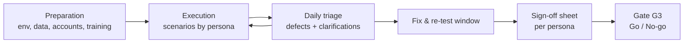

# User Acceptance Test (UAT) Plan — TASCO Growth Platform

| Item | Value |
|---|---|
| Owner | TASCO Product Owner (accountable), iorta TechNXT QA Lead (facilitation) |
| Sign-off authority | TASCO Business Owner (overall); TASCO Compliance (compliance scenarios); VETC Product Owner (customer app and VETC channels) |
| Window | **11 – 19 January 2027** (project plan Phase 3, week T2, plus re-test), sign-off by **22 January 2027** (gate G3) |
| Environment | UAT (Postgres, `DEMO_MODE=false`, real adapters pointing at VETC, TASCO and Zalo UAT endpoints; synthetic and partner test identities; **no production PII**) |
| Scripts | Persona manuals in `docs/manuals/` + scenarios below; test cases in [test-case-catalogue.md](test-case-catalogue.md) |

---

## 1. Approach

UAT confirms that the platform supports TASCO's and VETC's business processes end to end and is fit for the pilot in Hà Nội and TP. Hồ Chí Minh. The method is **scenario-based**, per persona:

- Real users of each role run business scenarios: telesales agents from the pilot squads, campaign managers, compliance, data stewards, claims handlers, partner managers, a partner's integration developer, and VETC CX staff acting as customers on test devices.
- Each scenario has explicit acceptance criteria and maps to automated test cases. UAT does not repeat automated functional testing; it confirms the business outcome.
- The business date is **pinned** with `SIM_TODAY` on the UAT environment for the journey scenarios, so reminders fall due on the planned days. Contact-window scenarios use the `at` parameter of `POST /api/journeys/run`.
- Usability observation runs alongside, per `docs/ux/usability-testing-plan.md` (task success, time on task, SUS questionnaire).

### 1.1 UAT user accounts

UAT has **named** accounts created by the admin through `POST /api/users`, not the demo users. MFA is mandatory for `admin`, `rule_approver`, `compliance_officer` and `data_steward` (`MFA_REQUIRED_ROLES`). Each user self-enrols their authenticator at first sign-in and must change the initial password. Regions follow the pilot: telesales agents and supervisors are region-bound (`Hà Nội`, `TP. Hồ Chí Minh`).

### 1.2 UAT data

| Data set | Source | Volume |
|---|---|---|
| Vehicle base | Synthetic generator (`SEED` fixed per UAT cycle) + **reference profiles** (below) | 50,000 |
| Reference profiles (UAT-REF-01 … 12) | Hand-crafted for deterministic scenarios | 12 |
| Customer test identities | VETC test accounts with test wallets, Zalo test accounts, test SIMs | 20 |
| Partner keys | `P-BANK-UAT`, `P-SHOWROOM-UAT`, issued in UAT | 2 |

| Ref | Profile characteristics | Used in |
|---|---|---|
| UAT-REF-01 | HN car < 6 seats, TASCO-insured, expiry today + 30, verified, all consents | UAT-CM-01, UAT-CU-01 |
| UAT-REF-02 | HCM car, other insurer, expiry today + 14, confidence 0.7, call consent | UAT-TS-01, UAT-VB-01 |
| UAT-REF-03 | HN, expiry unknown (confidence < 0.5) | UAT-CU-02, UAT-DS-01 |
| UAT-REF-04 | HN, lapsed 10 days | UAT-CM-02 |
| UAT-REF-05 | DNC customer | UAT-CO-03 |
| UAT-REF-06 | No marketing consent, call consent only | UAT-CO-02 |
| UAT-REF-07 | Company-owned fleet vehicle | UAT-CM-03 |
| UAT-REF-08 | Expired policy, no active cover, has messages and calls (erasure candidate) | UAT-CO-05 |
| UAT-REF-09 | Active TASCO policy (DSAR erasure must be refused) | UAT-CO-05 |
| UAT-REF-10 | New ETC tag activated 3 days ago | UAT-CM-04 |
| UAT-REF-11 | Conflicting phones across two sources | UAT-DS-02 |
| UAT-REF-12 | Unknown plate (not in base), for partner onboarding | UAT-PA-01 |

## 2. Business scenarios by persona

Status values in the execution log: Not run / Pass / Pass with minor defects / Fail / Blocked.

### 2.1 Campaign manager (`campaign_manager`)

| ID | Scenario | Acceptance criteria | Related TCs |
|---|---|---|---|
| UAT-CM-01 | Review the renewal pipeline for the pilot cities and understand why a lead is hot | Lead queue filters by tier, journey and expiry; score reasons are understandable without technical help; benefits shown match the customer's usage | TC-042, TC-049 |
| UAT-CM-02 | Run the daily journeys at 08:30 and review results | `POST /api/journeys/run` summary (done, skipped, cancelled by channel and journey) matches expectations for the reference profiles; skipped reasons are clear | TC-050–TC-059 |
| UAT-CM-03 | Confirm fleet and company vehicles are routed to B2B and not called | NBA `route_b2b`; excluded from voice campaigns | TC-045 |
| UAT-CM-04 | A VETC ecosystem event (tag activated, inspection booked) triggers the right journey or message | Correct template; service versus marketing classification agreed with Compliance | TC-063 |
| UAT-CM-05 | Read the overview dashboard and economics block | KPIs reconcile with the scenario actions performed; costs use `costs.json` values | — |

### 2.2 Telesales agent (`telesales_agent`) and supervisor (`telesales_supervisor`)

| ID | Scenario | Acceptance criteria | Related TCs |
|---|---|---|---|
| UAT-TS-01 | Agent claims a hot handoff from the voice bot, reads the summary and talking points, calls the customer and sends the one-tap link | Summary has a masked phone, plate verified by the customer, and price and trust signals; the claim sets `assignedTo`; the note is saved; status moves to `won` after purchase | TC-070, TC-025 |
| UAT-TS-02 | Agent quotes TNDS + PA per seat over the phone and **sends the quote** to the customer's VETC app / Zalo; the customer confirms and pays in the app while on the call | Regulated TNDS premium exact; no discount wording anywhere; the agent has no way to take payment; the customer pays once (idempotent on double tap); e-certificate QR verifies | TC-072, TC-073, TC-074, TC-156, TC-157 |
| UAT-TS-03 | Agent in Hà Nội tries to open a TP.HCM customer | Access denied with a clear message | TC-024 |
| UAT-TS-04 | Supervisor reassigns work between agents and sees the whole squad queue | Assignment works for the supervisor only; audit entry created | TC-026 |
| UAT-TS-05 | Agent runs a console voice-bot session to rehearse the script | Script is disclosure-first and plate-first; the transcript shows vi + en gloss | TC-064, TC-148 |

### 2.3 Voice bot campaign (operated by the campaign manager, observed by Compliance)

| ID | Scenario | Acceptance criteria | Related TCs |
|---|---|---|---|
| UAT-VB-01 | Campaign over 20 hot leads with the real voice vendor on test SIMs | Calls only within 08:00–20:00 ICT and only with call consent (enforced via `voice.canCall`, KI-09 fixed; operators must not pass `at`, see KI-33); outcomes recorded; handoffs created | TC-135, TC-154 |
| UAT-VB-02 | Tester says a wrong plate | Call ends politely; no personal data disclosed; DQ issue raised | TC-066 |
| UAT-VB-03 | Tester asks to stop calls | Opt-out confirmed by the bot; the profile becomes DNC; no further calls or marketing | TC-068 |
| UAT-VB-04 | Tester says the plate the way the bot instructs ("ba mươi A, …") | Verified (**KI-25 must be fixed**) | TC-065 |

### 2.4 Customer (VETC app / Zalo mini app; VETC CX testers on test devices)

| ID | Scenario | Acceptance criteria | Related TCs |
|---|---|---|---|
| UAT-CU-01 | Receive a renewal reminder (push or ZNS), open the link and renew in ≤ 3 taps with the VETC wallet | Link opens the right vehicle; premium matches the regulation; payment once; e-certificate shown; confirmation message received; reminders stop | TC-073, TC-059, TC-150 |
| UAT-CU-02 | Confirm the current expiry date (the "fix data" flow) | Expiry saved; `needsConfirmation` cleared; lead re-evaluated | TC-035 |
| UAT-CU-03 | Change consent in the consent centre (marketing off, calls off) | Takes effect immediately; no marketing or calls afterwards; service messages still allowed | TC-053, TC-054 |
| UAT-CU-04 | Report an accident (FNOL) with photos | Claim reference shown; status visible; SLA communicated | TC-100 |
| UAT-CU-05 | Download my data | Export complete and readable | TC-105 |
| UAT-CU-06 | Scan the certificate QR as a third party (traffic police) | Validity, product, period and masked plate shown; no name or phone | TC-074 |
| UAT-CU-07 | Accessibility walk-through with a screen reader on iOS and Android | Flow completable; WCAG 2.2 AA issues logged | TC-145 |

### 2.5 Rule author (`rule_author`), rule approver (`rule_approver`) and compliance officer (`compliance_officer`)

| ID | Scenario | Acceptance criteria | Related TCs |
|---|---|---|---|
| UAT-RU-01 | Author changes the scoring weights, simulates on UAT-REF-01..04, submits; the approver approves | Simulation shows current versus candidate; approval activates the new version; the previous version is retired; audit trail complete; replicas pick it up within 15 s | TC-093, TC-097, TC-099 |
| UAT-RU-02 | Author tries to add "giảm giá" or "hoàn tiền" wording to a template or benefit | Rejected with a clear copy-guard error | TC-095 |
| UAT-RU-03 | Admin tries to give one person both author and approver roles; author tries to approve their own change | Role combination refused (separation of duties); approval refused (no permission / maker-checker) | TC-027, TC-090 |
| UAT-RU-04 | Wrong rule activated → rollback | Rollback creates a draft that needs approval; the old behaviour returns after approval | TC-094 |
| UAT-RU-05 | Commission rule above the statutory cap | Rejected | TC-084 |

### 2.6 Compliance officer — regulatory controls

| ID | Scenario | Acceptance criteria | Related TCs |
|---|---|---|---|
| UAT-CO-01 | Review every active customer-facing template, voice script and benefit text (vi) | Signed content inventory; no discount, rebate or cashback language; disclosures present | TC-147, TC-061 |
| UAT-CO-02 | Marketing contact attempted at 07:30 and 20:15 ICT, and to a customer without marketing consent | Blocked with the correct reasons | TC-050, TC-052, TC-053 |
| UAT-CO-03 | Any contact with a DNC customer | Blocked on every channel; voice session refused | TC-055 |
| UAT-CO-04 | Frequency caps | No more than 1 marketing message per day and 3 per week; ≤ 2 call attempts per week | TC-056, TC-057 |
| UAT-CO-05 | DSAR: erasure request for UAT-REF-09 (active policy) and UAT-REF-08 | REF-09 refused with the legal-obligation message; REF-08 anonymised; audit entries present | TC-106, TC-107 |
| UAT-CO-06 | Audit trail review and chain verification | `GET /api/audit/verify` → ok; actions traceable to named users | TC-110 |
| UAT-CO-07 | Benefits pending legal review do not reach customers | `loyalty_points` not visible in the app | TC-041 |

### 2.7 Data steward (`data_steward`)

| ID | Scenario | Acceptance criteria | Related TCs |
|---|---|---|---|
| UAT-DS-01 | Correct a customer's expiry with evidence | Saved with evidence in the audit; lead recomputed | TC-037 |
| UAT-DS-02 | Work the DQ queue (conflicting phone, invalid plate, plate mismatch from the bot) | Issues visible by type; resolution recorded | TC-034, TC-038 |
| UAT-DS-03 | Ingest a partner extract (masked) and review lineage | Counts reconcile; lineage visible per field | TC-032, TC-040, TC-112 |

### 2.8 Partner manager (`partner_manager`) and partner integration developer

| ID | Scenario | Acceptance criteria | Related TCs |
|---|---|---|---|
| UAT-PA-01 | Onboard a partner, issue a key, and let the partner quote an unknown plate and bind it | Key shown once; quote and order succeed; the policy appears in the partner's list | TC-083, TC-086 |
| UAT-PA-02 | Partner tries to bind another partner's quote | Refused (not found) | TC-081 |
| UAT-PA-03 | Commission statement for a period | Totals match orders and capped rates; agreed by TASCO Finance | TC-085 |
| UAT-PA-04 | Suspend the partner / revoke the key | Next call refused immediately | TC-089 |
| UAT-PA-05 | Partner developer integrates from the OpenAPI document alone | Integration completed without undocumented behaviour | TC-133 |

### 2.9 Claims handler (`claims_handler`)

| ID | Scenario | Acceptance criteria | Related TCs |
|---|---|---|---|
| UAT-CL-01 | Work the FNOL queue: acknowledge → assessor assigned → … → paid | Only valid transitions allowed; history visible to the customer | TC-103, TC-104 |

### 2.10 Executive, auditor, admin and production support

| ID | Scenario | Acceptance criteria | Related TCs |
|---|---|---|---|
| UAT-EX-01 | Executive reviews growth and adoption dashboards | Figures reconcile with the UAT activity log; read-only | — |
| UAT-AU-01 | Auditor searches the audit trail by entity, actor and action | Results complete; no PII in audit details | TC-110 |
| UAT-AD-01 | Admin creates, changes and disables users (offboarding) | Disabled user locked out immediately; admin cannot see customer PII | TC-011, TC-022 |
| UAT-OP-01 | Support engineer checks `/api/ops/status`, runs reconciliation and the relay, reads job history | Matches the runbook; results understandable | TC-113 |

## 3. Entry criteria

| # | Criterion | Evidence |
|---|---|---|
| E1 | SIT exit met (all P1 SIT cases passed; no open Sev 1/2 interface defects) | SIT report (M6, 8 Jan 2027) |
| E2 | UAT environment deployed from a release candidate tag; `/health/ready` 200; `GET /api/audit/verify` ok | Deployment record |
| E3 | UAT data loaded, including reference profiles; `SIM_TODAY` set and documented | Data load checklist |
| E4 | Named accounts created, MFA enrolled, region assignments confirmed | Admin export of `GET /api/users` |
| E5 | Testers trained (1 h per persona) on the manuals | Attendance list |
| E6 | Known issues KI-01, KI-02, KI-25, KI-28 and KI-33 fixed, or explicitly accepted by the Business Owner for UAT (KI-06, KI-09 and KI-29 already fixed: regression only) | KI register |
| E7 | Zalo ZNS templates approved for UAT (or a test OA in use); VETC test wallets funded | Partner confirmations |

## 4. Exit criteria

| # | Criterion |
|---|---|
| X1 | 100 % of scenarios executed; ≥ 95 % passed |
| X2 | 0 open Sev 1 and 0 open Sev 2 defects (or Sev 2 waived in writing by the Business Owner with a fix date before pilot full volume on 15 Feb 2027) |
| X3 | All compliance scenarios (UAT-CO-*, UAT-RU-02/03/05, UAT-VB-01/03) passed. **No waiver possible** |
| X4 | Usability: task success ≥ 90 % on UAT-TS-01/02 and UAT-CU-01; SUS ≥ 70 |
| X5 | Sign-off sheet (§6) signed by every persona lead and the Business Owner |

## 5. Defect triage

- **Daily triage at 16:30 ICT** (30 min): TASCO PO (chair), QA lead, tech lead, VETC representative, Compliance when a compliance defect is open.
- Severity follows [test-strategy.md §7.1](test-strategy.md#71-severity-definitions). Business priority is set by the PO.
- Defects carry the `X-Request-Id` from the screen or API response, the persona, the scenario ID and the reference profile, **never customer PII**.
- Fix deployments to UAT: at most **one per day**, at 08:00 ICT, with release notes listing the defects fixed. Re-test the same day.
- Change requests (behaviour working as specified but not as wanted) go to the PO backlog. They are not UAT defects.

| Severity | Response in UAT | Fix target |
|---|---|---|
| Sev 1 | Same day; testing of the affected scenario stops | Next daily build |
| Sev 2 | Next triage | Within 2 business days |
| Sev 3 | Next triage | Before go-live or waived |
| Sev 4 | Backlog | BAU |

## 6. Sign-off sheet

| Persona / area | Scenarios | Executed | Passed | Open defects (Sev) | Waivers | Persona lead (name) | Decision (Accept / Accept with conditions / Reject) | Signature & date |
|---|---|---|---|---|---|---|---|---|
| Campaign manager | UAT-CM-01 – 05 | | | | | | | |
| Telesales agent and supervisor | UAT-TS-01 – 05 | | | | | | | |
| Voice bot campaign | UAT-VB-01 – 04 | | | | | | | |
| Customer (VETC app / Zalo) | UAT-CU-01 – 07 | | | | | VETC Product Owner | | |
| Rules (author / approver) | UAT-RU-01 – 05 | | | | | | | |
| Compliance | UAT-CO-01 – 07 | | | | **None permitted** | TASCO Compliance Officer | | |
| Data steward | UAT-DS-01 – 03 | | | | | | | |
| Partners | UAT-PA-01 – 05 | | | | | | | |
| Claims | UAT-CL-01 | | | | | | | |
| Executive / auditor / admin / ops | UAT-EX-01, UAT-AU-01, UAT-AD-01, UAT-OP-01 | | | | | | | |
| **Overall UAT acceptance** | 46 scenarios | | | | | **TASCO Business Owner** | | |

Conditions attached to an "Accept with conditions" decision are copied to the [production readiness checklist](../operations/production-readiness-checklist.md) with an owner and due date.

## 7. Schedule

| Date (2027) | Activity |
|---|---|
| Thu 7 – Fri 8 Jan | UAT environment prepared; data load; accounts; entry criteria review (E1–E7) |
| Mon 11 Jan | Kick-off (09:00); training sessions per persona; start of execution |
| Mon 11 – Fri 15 Jan | Execution: day 1 campaign, rules and compliance; day 2 telesales and voice; day 3 customer app (VETC CX) and partners; day 4 data steward, claims and ops; day 5 catch-up and usability sessions |
| Mon 18 – Tue 19 Jan | Fix and re-test window; regression of fixed areas |
| Wed 20 Jan | Final triage; sign-off sheet completed per persona |
| Thu 21 Jan | UAT report to the PO and Business Owner |
| Fri 22 Jan | **Gate G3** go/no-go at SteerCo (UAT, security and compliance sign-offs) |

## 8. Roles

| Role | Name / organisation | Responsibility |
|---|---|---|
| UAT manager | TASCO PO | Plan owner, triage chair, sign-off coordination |
| UAT facilitator | iorta TechNXT QA Lead | Environment, data, scripts, defect logging, daily report |
| Persona leads | TASCO business units, VETC CX | Execute scenarios, sign per persona |
| Compliance reviewer | TASCO Compliance | Compliance scenarios and content inventory sign-off |
| Support on call | iorta TechNXT dev + ops | Fix deployment, environment issues (via [runbook](../operations/runbook-and-support-guide.md)) |
