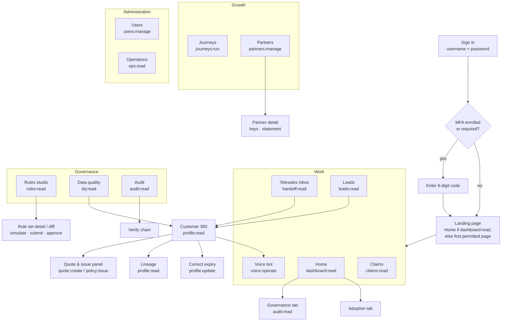
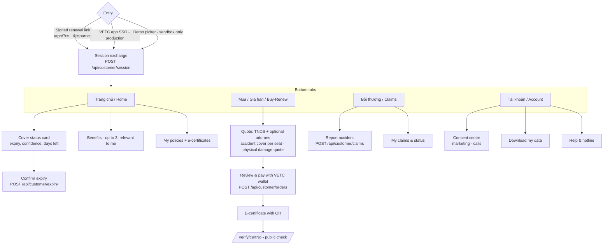
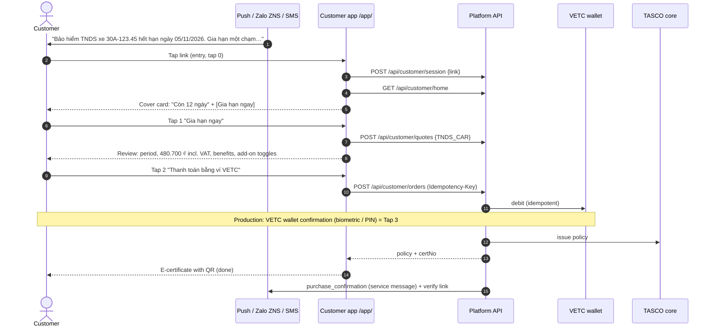

# Journey Maps and Information Architecture (v1 UI)

This document defines **where things live** (information architecture and sitemaps), **how key tasks flow** (task flows with click counts) and **how people experience the end-to-end journeys** (journey maps). It reflects the v1 UI: staff console at `/`, customer app at `/app/`, certificate check at `/verify/<certNo>`.

---

## 1. Information architecture — staff console (`/`)

Navigation is grouped and **filtered by permission**. The server enforces the same permission on every API call. Routes are hash-based (for example `#/leads`, `#/customer/<id>`).

**Global elements** on every page: skip link, top bar (logo, page title, VI/EN, theme, "?" help drawer, user menu with roles/region and sign out), and the left navigation.

### 1.1 Page inventory

| Page | Purpose | Main API | Permission | Primary users |
|---|---|---|---|---|
| Home | Role-relevant KPIs: base, leads by tier and journey, DQ, engagement, sales (GWP, by channel and journey), claims, economics. Tabs: Overview, Adoption, Governance (needs `audit:read`). | `GET /api/dashboard/overview`, `/adoption`, `/governance` | `dashboard:read` | Exec, campaign, supervisor, author, approver, compliance, steward, partners, auditor, admin |
| Telesales inbox | Handoff queue: filter by status and "mine", claim, notes, outcome, assign (supervisor) | `GET/PATCH /api/handoffs` | `handoff:read` (+ `handoff:work`, `handoff:assign`) | Agents, supervisors, campaign (read) |
| Leads | Prioritised list: filters tier/journey/action/region/days/score, sort by score or expiry. Recompute (campaign). | `GET /api/leads`, `POST /api/leads/recompute` | `leads:read` (+ `leads:recompute`) | Campaign, agents, supervisors, stewards |
| Customer 360 | Golden record, lead score breakdown, NBA, touchpoints, messages, policies, voice sessions, benefits, activity. Quote/issue panel. Lineage. Expiry correction. | `GET /api/customers/:id`, `/lineage`, `PATCH /expiry`, `POST /api/quotes`, `POST /api/orders` | `profile:read` (+ `profile:read_pii`, `quote:create`, `policy:issue`, `profile:update`) | Agents, supervisors, campaign, stewards, compliance, claims |
| Voice bot | Console session (type customer utterances as ASR text), transcript with Vietnamese and English gloss, outcome and handoff link | `POST /api/voice/sessions`, `/turns`, `GET /:id` | `voice:operate` | Campaign, agents, supervisors |
| Claims | FNOL queue with SLA countdown and status transitions | `GET/PATCH /api/claims` | `claims:read` / `claims:update` | Claims handlers |
| Journeys | Journey definitions (read-only view of the active rule set), scheduled and executed touchpoints, "Run due touchpoints", inject ecosystem event, voice campaign | `GET /api/touchpoints`, `POST /api/journeys/run`, `POST /api/ecosystem/events`, `POST /api/voice/campaign` | `journeys:run` | Campaign managers |
| Partners | List and onboard partners, suspend or activate, issue and revoke API keys, commission statement | `/api/partners*` | `partners:manage` | Partner managers |
| Rules studio | All rule kinds and versions, detail, JSON editor with validation, simulate, submit, approve/reject, rollback | `/api/rules*` | `rules:read` (+ `rules:author`, `rules:approve`) | Authors, approvers, compliance, auditors, campaign/admin (read) |
| Data quality | Open DQ issues by type, resolve, batch ingestion, open the affected customer | `/api/dq/issues*`, `POST /api/data/ingest` | `dq:read` (+ `dq:resolve`, `data:ingest`) | Data stewards |
| Audit | Search by entity, actor and action. Verify hash chain. DSAR actions (export/erase) on a customer. | `GET /api/audit`, `/verify`, `POST /api/dsar/:id/*` | `audit:read` (+ `dsar:manage`) | Compliance, approvers, auditors, admin |
| Users | List, create (with roles, region, MFA), change roles, region or status | `/api/users*` | `users:manage` | Admin |
| Operations | Store, integration circuits, active rule checksums, event backlog, audit count. Job history. Run reconciliation, retention or relay. | `GET /api/ops/status`, `/jobs`, `POST /api/ops/jobs/:kind` | `ops:read` (+ `ops:run_jobs`) | Admin, support |

### 1.2 Navigation by role (what each demo user sees)

| Role (demo user) | Home | Inbox | Leads | Voice | Claims | Journeys | Partners | Rules | DQ | Audit | Users | Ops |
|---|---|---|---|---|---|---|---|---|---|---|---|---|
| admin (`admin`) | ✓ | | | | | | | ✓ (read) | | ✓ | ✓ | ✓ |
| executive (`exec`) | ✓ | | | | | | | | | | | |
| campaign_manager (`campaign`) | ✓ | ✓ (read) | ✓ | ✓ | | ✓ | | ✓ (read) | | | | |
| telesales_agent (`agent.hn`, `agent.hcm`) | | ✓ (lands here) | ✓ | ✓ | | | | | | | | |
| telesales_supervisor (`supervisor`) | ✓ | ✓ | ✓ | ✓ | | | | | | | | |
| rule_author (`author`) | ✓ | | | | | | | ✓ (author) | | | | |
| rule_approver (`approver`) | ✓ | | | | | | | ✓ (approve) | | ✓ | | |
| compliance_officer (`compliance`) | ✓ | | | | | | | ✓ (approve) | | ✓ (+DSAR) | | |
| data_steward (`steward`) | ✓ | | ✓ | | | | | | ✓ | | | |
| claims_handler (`claims`) | | | | | ✓ (lands here) | | | | | | | |
| partner_manager (`partners`) | ✓ | | | | | | ✓ | | | | | |
| auditor (`auditor`) | ✓ | | | | | | | ✓ (read) | | ✓ | | |
| support_engineer (`support`) | | | | | | | | | | | | ✓ (lands here) |

Customer 360 has no menu entry. It opens from Leads, the Telesales inbox, Data quality or a search, for roles with `profile:read`.

---

## 2. Information architecture — customer app (`/app/`) and certificate check

**Certificate check** (`/verify/<certNo>`) is public, has no sign-in and shows no personal data. It shows valid or not valid, status, certificate number, product, **masked plate**, insurer, start and end dates (`GET /api/public/certificates/:certNo`).

---

## 3. Key task flows with click counts

Counting convention: a **tap/click** is a deliberate activation (button, link, toggle). Typing into a field is not counted but is listed. Opening the link from a notification counts as entry (tap 0).

### 3.1 Customer: renew TNDS in ≤ 3 taps (target)

| Step | Taps | What the customer sees |
|---|---|---|
| Open link | 0 | Cover status card with plate, expiry, days left, one primary button |
| "Gia hạn ngay" | 1 | Review card: product (Bảo hiểm TNDS bắt buộc ô tô), period (starts the day after current expiry), premium incl. VAT ("Phí theo quy định Nhà nước, giống mọi nơi"), up to 3 benefits, optional add-on toggles |
| "Thanh toán bằng ví VETC" | 2 | Payment progress |
| Wallet confirmation (VETC app, production) | 3 | E-certificate with QR, "Đã cấp giấy chứng nhận", "Lưu vào ứng dụng" |

**With add-on** (accident cover per seat): +1 toggle tap on the review card, for **4 taps** total. Physical damage shows a quote (sum insured input); binding in production goes through the inspection flow, so it is not part of the one-tap path.

**If expiry is uncertain** (confidence < 0.75, `needsConfirmation`): the cover card first asks "Ngày hết hạn bảo hiểm hiện tại của bạn là 05/11/2026?", with [Đúng] / [Sửa ngày]. Confirming is 1 tap and repairs the data (`customer.expiry_declared`). Renewal then continues as above.

### 3.2 Telesales agent: claim → call → quote → issue (or send link)

| # | Action | Clicks | Notes |
|---|---|---|---|
| 1 | Open Telesales inbox (landing page for agents) | 0 | Open handoffs in the agent's region, newest first, hot first |
| 2 | **Claim** on the handoff card | 1 | Status `open → claimed`, assigned to the agent. Card shows talking points, trust/price flags, verified plate. |
| 3 | **Open customer** (Customer 360) | 2 | Full record (PII visible for agents), score breakdown, benefits, history |
| 4 | **Call** from the official hotline (click-to-call through the telephony integration, or dial manually in v1) | 3 | Reference the assistant call. Never ask for OTP or payment details. |
| 5 | **Quote**: TNDS pre-selected; tick add-on (PA per seat) if accepted | 4 (+1 per add-on) | `POST /api/quotes` (channel `telesales`) |
| 6a | **Send one-tap link** (preferred) | 5 | Customer pays in their VETC app |
| 6b | or **Issue** (only if the customer confirms the payment in their VETC app) | 5 | `POST /api/orders` with Idempotency-Key. Certificate number shown. |
| 7 | **Record outcome**: Won / Lost / Callback with a note | 6 | Stops or reschedules journeys |

Target: **≤ 6 clicks** from inbox to recorded outcome, and handoff first contact ≤ 2 business hours (proposed).

### 3.3 Rule change (maker-checker)

| # | Actor | Action | Clicks |
|---|---|---|---|
| 1 | Author | Rules studio → select kind (for example `scoring`) → **New draft** (copy of active) | 2 |
| 2 | Author | Edit JSON → **Validate** (inline errors with JSON paths) | 1 |
| 3 | Author | **Simulate** → choose customer → see current vs candidate (score, tier, NBA, journey, benefits) | 2 |
| 4 | Author | **Save draft** (description required) → **Submit** | 2 |
| 5 | Approver | Rules studio → Pending tab → open the draft → review diff and simulation | 2 |
| 6 | Approver | **Approve** (comment) → confirm; the previous version is retired automatically | 2 |

Target lead time from draft to active: ≤ 1 business day (proposed).

### 3.4 Other flows (summary)

| Flow | Actor | Clicks (target) |
|---|---|---|
| Resolve a DQ issue with expiry correction | Data steward | Data quality → issue → Open customer → Correct expiry (date + evidence) → Save → Resolve (≈ 5) |
| Acknowledge a claim | Claims handler | Claims → claim → **Acknowledge** → confirm (3) |
| Onboard a partner and issue a key | Partner manager | Partners → New → fill → Save → Issue key → Copy → "Tôi đã lưu khóa" (≈ 6) |
| DSAR access export | Compliance | Audit → search customer → DSAR → Export → Download (≈ 4) |
| Report accident | Customer | Bồi thường → Báo tai nạn → choose policy, date, description → Gửi (3) |
| Change consent | Customer | Tài khoản → toggle → Lưu (3) |
| Verify a certificate | Anyone | Scan QR → page opens (0) |

---

## 4. Journey maps

### 4.1 Customer — TASCO renewal (retention journey)

Journey definition: `renewal` in `config/rules/journeys.json` (anchor: expiry date).

| Stage | D−45 Verify | D−30 First reminder | D−21 Value | D−14 Voice bot | D−7 Urgent | D−3 Telesales | D0 Expiry day |
|---|---|---|---|---|---|---|---|
| **Touchpoint** | Push/ZNS `verify_expiry` (service) | Push/ZNS/SMS `first_reminder` | ZNS/push `value_reminder` | AI call (hot, warm) | Push/ZNS/SMS `urgent_reminder` | Human call (hot) | Push/ZNS/SMS `expiry_day` (service) |
| **Customer doing** | Confirms or corrects expiry in app | Notices; may tap to renew | Learns benefits | Verifies plate, asks price, chooses link or advisor | Renews in app | Talks to advisor | Last chance |
| **Thinking / feeling** | "Is this real? How do they know?" → reassured by the VETC app context | "Convenient — I'm already in the app" | "Same price everywhere — what else do I get?" | Suspicion → trust (disclosure, never asks OTP) | Mild urgency | Wants help or reassurance | Worry about fines |
| **Pain points** | Wrong date erodes trust | Too many messages (capped: 1/day, 3/week) | Generic benefits | ASR mishears plate | Payment friction | Feels like a sales call | |
| **Opportunities / design response** | Data repair in 1 tap | One-tap renew, ≤ 3 taps | Relevant benefits ("why for you") | Plate-first, max 3 attempts, link option | Wallet one-tap, idempotent | Talking points, trust script | Clear lapse message, no scare tactics |
| **Metrics** | Confirmation rate | Click-through, conversion | Conversion | Outcomes, opt-out rate | Conversion | Win rate | Lapse rate |

All steps stop once the vehicle has an active TASCO TNDS policy (the touchpoint is cancelled with reason "already insured with TASCO").

### 4.2 Customer — conquest (insured elsewhere / unknown insurer)

Steps at D−45, −30, −21, −14 (voice bot, hot only) and −7. The `conquest_reminder` template mentions renewing "lần này" (this time) in the VETC app with TASCO, plus the top benefit. **Emotional curve:** indifferent ("I always renew at the inspection centre") → curious (convenience, roadside assistance) → decisive at D−7 if the wallet covers the premium. **Key moment of truth:** the `vetc.wallet_topped_up` trigger (customer is in the app with funds, within 30 days of expiry) sends `first_reminder` by push.

### 4.3 Customer — uninsured vehicle recovery (lapsed ≤ 60 days)

D0 service notice `lapsed_notice` ("may be driving without compulsory TNDS — if you already bought it, update us"), D+2 voice bot (hot/warm), D+5 telesales (hot). Trigger `vetc.long_trip_started` sends `value_reminder` when an uninsured vehicle starts a long highway trip. **Design note:** tone is helpful, never accusatory. The first action offered is "I already bought it", which repairs the data and stops the reminders.

### 4.4 Customer — new vehicle onboarding

Trigger `vetc.tag_activated` (new ETC tag ≈ new car) enrols the vehicle. D+1 welcome (`new_vehicle_welcome`), D+7 verify expiry, D+14 value reminder. **Opportunity:** the dealer or showroom partner may have sold the TNDS. The partner record raises expiry confidence and suppresses unnecessary pitching.

### 4.5 Customer — cross-sell after purchase

After a TNDS-only purchase **with marketing consent**, the D+1 `cross_sell` message notes that TNDS only protects third parties and offers accident cover per seat or physical damage. It is never sent if add-ons were already bought.

### 4.6 Telesales agent — a day with the platform

| Time | Activity | Platform support | Emotion |
|---|---|---|---|
| 08:00 | Sign in, check inbox | Agent lands on Telesales inbox, filtered to own region | Neutral |
| 08:15 | Claim first hot handoff | Card shows verified plate, "customer asked price", talking points | Confident: "this person asked for me" |
| 08:20 | Call | Trust script, official hotline | Relief: the customer is expecting the call |
| 08:30 | Quote + send link | Quote panel, benefits list, one-tap link | Efficient |
| 08:35 | Record outcome | Won / Callback with note | Accomplished |
| 11:00 | Callback due | Status `callback` items | In control |
| 17:00 | Review | Supervisor dashboard, wins recorded | Recognised |

### 4.7 Rule author and approver — changing the scoring

Author: idea ("long-distance drivers convert better") → draft → validate → simulate on 5 customers → submit with description → wait. Approver: notified → reviews the diff and simulation → approves with comment → active within seconds → leads recompute. **Pain points designed out:** no IT ticket, no release, no spreadsheets. Self-approval is impossible, and everything is in the audit trail.

---

## 5. Content hierarchy rules
1. One primary action per view (customer) or per card (staff).
2. Status first, then action, then detail (progressive disclosure: talking points, lineage and JSON are collapsed by default).
3. Explanations sit next to the thing they explain (score reasons, blocked reasons).
4. Personal data is shown only where needed for the task, and masked otherwise.
