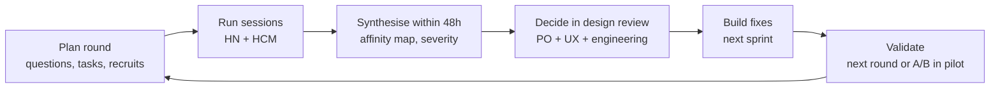

# Usability Testing Plan

**Purpose:** prove, with real users, that the v1 UI meets its usability goals before the pilot, and keep improving it during the pilot. The goals are renewal in ≤ 3 taps, agents moving from claim to outcome in ≤ 6 clicks, rule changes without IT help, and a trustworthy experience for customers who are wary of insurance calls.

| Item | Value |
|---|---|
| Owner | iorta TechNXT UX Lead |
| Co-owners | TASCO Product Owner, VETC Product (customer app), VETC call-centre manager (agents) |
| Rounds | R0 prototype (Discovery wk 2) · R1 MVP (Sprint 3) · R2 release candidate (UAT wk T2) · R3 pilot in-field (pilot wk 2–3) |
| Locations | Hà Nội and TP. Hồ Chí Minh (VETC/TASCO offices, call-centre floors, and customer intercepts at VETC service points and inspection centres), plus remote sessions |
| Environment | SANDBOX with `DEMO_MODE=true`, synthetic data and seeded demo users; customer app via demo picker or signed links on test phones |

---

## 1. Research questions

1. Can customers renew from a reminder in ≤ 3 taps without help, and do they trust it?
2. Do customers understand the cover status card (expiry, "estimated" vs "verified") and are they willing to confirm or correct their expiry?
3. Do customers understand benefits without any discount framing, and do the benefits influence their choice?
4. Can telesales agents claim, call, quote and record outcomes quickly? Do they use the talking points?
5. Do agents and supervisors understand the explainable score and the next best action, and do they trust them?
6. Can rule authors draft, validate and simulate a change, and can approvers review it confidently?
7. Can compliance find audit evidence and execute a DSAR without guidance?
8. Are the staff console and customer app accessible to users with low vision or who rely on a keyboard or screen reader?

---

## 2. Methods

| Method | Rounds | Participants | What we learn |
|---|---|---|---|
| **Moderated task-based tests** (think-aloud, 45–60 min) | R0–R2 | Customers, agents, supervisors, campaign, authors/approvers, compliance, stewards | Task success, errors, time on task, comprehension, trust |
| **System Usability Scale (SUS)** | R1–R3 | All moderated participants + pilot users | Comparable usability score per role |
| **Single Ease Question (SEQ)** after each task (1–7) | R1–R2 | All moderated participants | Perceived difficulty per task |
| **First-click testing** (remote, unmoderated) | R0–R1 | 40+ customers, 20+ staff | Navigation and label clarity |
| **Tree testing** of the staff console IA | R0 | 20 staff across roles | Findability of pages (labels VI/EN) |
| **Field observation / contextual inquiry** | R0, R3 | 6–8 agents per city | Real call-floor conditions, headsets, multitasking |
| **Accessibility usability sessions** | R2 | 3–5 users: low vision, screen-reader user, older drivers (60+) | Real-world accessibility beyond automated checks |
| **Analytics + in-app feedback** | R3 | All pilot users | Taps-to-renew, drop-off per step, help-drawer usage |
| **A/B test** (pilot) | R3 | Pilot cohort | Variant performance of cover card and benefit framing (copy-guard compliant) |

---

## 3. Recruitment

| Segment | # per city (HN / HCM) | Criteria | Recruitment channel | Incentive |
|---|---|---|---|---|
| Customers — VETC app users with car TNDS due in ≤ 90 days | 6 / 6 | Mix of ages (25–40, 40–55, 55+), genders, TASCO and non-TASCO insured, Android and iOS | VETC in-app invitation (with consent), service-point intercepts | VETC service voucher (non-cash, not tied to premium; approved by Compliance) |
| Customers — lapsed or unknown expiry | 3 / 3 | Expiry unknown or lapsed ≤ 60 days | VETC data (consented research panel) | Same |
| Customers — fleet / company vehicles (secondary) | 1 / 1 | Company-owned | B2B team | Same |
| Telesales agents | 5 / 5 | Mix of tenure (< 6 months, > 2 years) | Call-centre manager | Time in lieu |
| Telesales supervisors | 1 / 1 | | Call-centre manager | — |
| Campaign managers | 2 (either city) | | TASCO/VETC marketing | — |
| Rule authors / approvers / compliance | 2 / 2 / 2 | | TASCO product and compliance | — |
| Data stewards | 2 | | Data team | — |
| Claims handlers | 2 | | TASCO claims | — |
| Accessibility participants | 3–5 | Low vision, screen-reader user, 60+ | Disability organisations, VETC customer panel | Honorarium |

Five to six participants per segment per round find most usability problems. Quantitative benchmarks (SUS, time on task) are aggregated across rounds R2 and R3.

**Ethics and privacy:** informed consent (Vietnamese) covering recording and data use. Sessions use **synthetic data only**. Real customer data is never shown in tests. Recordings are stored for 90 days and then deleted. Participants may stop at any time.

---

## 4. Test scripts

### 4.1 Session structure (moderated, 60 min)
1. Welcome and consent (5 min). "We are testing the product, not you."
2. Background questions (5 min): current renewal habits, VETC app use, attitudes to insurance calls (customers); current tools and pain points (staff).
3. Tasks (35–40 min), think-aloud, with SEQ after each task.
4. SUS questionnaire (Vietnamese version) (3 min).
5. Debrief (7 min): trust, what was confusing, what they'd tell a friend or colleague.

### 4.2 Customer tasks (customer app, test phone)

| # | Scenario (read aloud in Vietnamese) | Success criteria | Target |
|---|---|---|---|
| C1 | "Bạn vừa nhận tin nhắn từ VETC rằng bảo hiểm TNDS xe của bạn sắp hết hạn. Hãy gia hạn bảo hiểm." (You received a VETC message that your TNDS is expiring. Please renew.) | Reaches e-certificate | ≥ 90 % success, ≤ 3 taps, ≤ 60 s |
| C2 | "Ứng dụng hỏi ngày hết hạn bảo hiểm hiện tại. Ngày đúng là 20/11/2026. Hãy cập nhật." | Correct date submitted | ≥ 90 %, ≤ 45 s |
| C3 | "Bạn muốn thêm bảo hiểm cho người ngồi trên xe. Hãy xem phí và thêm vào." | Add-on included in the order | ≥ 80 % |
| C4 | "Cảnh sát giao thông muốn kiểm tra bảo hiểm của bạn. Hãy cho họ xem." | Shows the e-certificate QR; the verification page shows "valid" | ≥ 90 % |
| C5 | "Bạn không muốn nhận cuộc gọi tư vấn nữa. Hãy thay đổi." | Call consent off and saved | ≥ 90 % |
| C6 | "Bạn vừa bị va chạm nhẹ. Hãy báo tai nạn." | FNOL submitted, and the participant understands the 4-hour callback | ≥ 85 % |
| C7 | "Bạn muốn tải dữ liệu cá nhân của mình." | Data export downloaded | ≥ 80 % |
| C8 (comprehension) | "Theo bạn, mua qua VETC có rẻ hơn không? Bạn được gì?" (Is it cheaper via VETC? What do you get?) | States that the price is the same and names ≥ 1 benefit | ≥ 80 % |
| C9 (trust, voice) | Listen to a recorded voice bot call (synthetic). "Bạn có tin cuộc gọi này không? Vì sao?" | Mentions the disclosure, no-OTP promise or plate check | Qualitative |

### 4.3 Telesales agent tasks (staff console, desktop + headset)

| # | Scenario | Success | Target |
|---|---|---|---|
| A1 | Sign in as `agent.hn` and find the most urgent customer who wants a call back | Claims the right handoff (hot, oldest) | ≥ 90 %, ≤ 30 s |
| A2 | Prepare for the call: what should you mention, and what concerns did the customer raise? | Names ≥ 2 talking points and the trust or price flag | ≥ 90 % |
| A3 | The customer wants TNDS plus accident cover for 7 seats. Quote it. | Correct quote with PA_SEAT | ≥ 85 %, ≤ 90 s |
| A4 | The customer prefers to pay in their app. Complete the sale. | Sends the one-tap link, not issuing over the phone | ≥ 90 % |
| A5 | The customer asks "Can you give me a discount?" How does the screen help you answer? | Uses the regulated-price explanation and value benefits | ≥ 90 % |
| A6 | Record that the customer will decide tomorrow | Status `callback` with note | ≥ 95 % |
| A7 | Explain why this customer has a score of 82 | Reads the factor reasons correctly | ≥ 80 % |

### 4.4 Supervisor, campaign, rules, compliance, data, claims tasks (abridged)

| Role | Tasks |
|---|---|
| Supervisor | Reassign a handoff from an absent agent. Find how many handoffs are older than one day. |
| Campaign manager | Find hot leads expiring within 14 days in TP.HCM. Run due touchpoints and explain why 3 were skipped. Simulate a wallet top-up event for a customer. |
| Rule author | Raise the hot threshold from 70 to 75, validate, simulate on a given customer, and submit. Try to add "giảm giá" to a template and explain the rejection. |
| Rule approver | Review and approve the author's change. Try to approve your own draft (expect it to be refused). |
| Compliance | Find who approved the last scoring change. Verify the audit chain. Export a customer's data for a DSAR. Attempt erasure on a customer with an active policy and explain the outcome. |
| Data steward | Resolve a `plate_mismatch` issue. Correct an expiry with evidence. |
| Claims handler | Acknowledge the claim closest to breaching its SLA. Move a claim to assessor assigned. |

---

## 5. Metrics and targets (proposed)

| Metric | Customer app | Staff console (agents) | Staff console (other roles) |
|---|---|---|---|
| Task success (unassisted) | ≥ 90 % core tasks (C1, C2, C4, C5) | ≥ 90 % core tasks (A1, A3, A4, A6) | ≥ 85 % |
| Time on task | Renew (C1) median ≤ 60 s | Claim → outcome ≤ 4 min excluding call time | Rule change draft → submit ≤ 10 min |
| Taps / clicks | Renew ≤ 3 | Claim → outcome ≤ 6 | — |
| Error rate | ≤ 1 non-critical error per task. 0 critical errors (wrong purchase, wrong customer). | Same | Same |
| SEQ (1–7) | ≥ 5.5 average | ≥ 5.5 | ≥ 5.0 |
| SUS | ≥ 75 (R2), ≥ 80 (R3) | ≥ 70 (R2), ≥ 75 (R3) | ≥ 70 |
| Comprehension: "same price everywhere" | ≥ 80 % | ≥ 95 % (agents) | — |
| Trust rating ("I trust this is really VETC/TASCO", 1–5) | ≥ 4.2 | — | — |
| Accessibility participants core task success | ≥ 80 % | ≥ 80 % | — |

**Severity scale for findings:**

| Severity | Definition | Action |
|---|---|---|
| S1 Critical | Prevents task completion or causes a wrong financial or privacy outcome | Fix before the next release. Blocks G3. |
| S2 Major | Significant delay or frustration; most users recover | Fix within the current or next sprint |
| S3 Minor | Small irritation or cosmetic issue | Backlog, prioritised by frequency |
| S4 Suggestion | Enhancement idea | Product backlog |

---

## 6. Iteration loop

1. **Synthesis within 48 hours:** notes tagged by task and severity, with highlight clips (synthetic data only).
2. **Findings report** with problem, evidence (quotes, metrics), severity, recommendation and owner, shared in the sprint review.
3. **Decisions** in the weekly design review. S1/S2 items go into the next sprint. Content changes that are rule content (templates, voice lines, benefit wording) go through the Rules studio with Compliance approval.
4. **Re-test** of every S1/S2 fix in the next round.
5. **Track** the metrics trend per round in the SteerCo pack.

---

## 7. Schedule

| Round | When | Sessions | Deliverable |
|---|---|---|---|
| R0 | Discovery wk 2 | 8 customers, 6 agents (clickable prototype), tree test 20 staff | Prototype findings, IA decisions (G1 input) |
| R1 | Sprint 3 (end) | 12 customers, 8 agents, 6 other roles | MVP findings, first SUS |
| R2 | UAT wk T2 | 18 customers incl. accessibility, 10 agents, 10 other roles | Benchmark report (G3 input) |
| R3 | Pilot wk 2–3 | Field observation + analytics + A/B + SUS survey of all pilot users | Pilot UX report (G4 input) |

---

## 8. Roles in a session

| Role | Responsibility |
|---|---|
| Moderator (UX researcher, Vietnamese native speaker) | Runs the session, stays neutral |
| Note-taker (BA) | Records observations, timings and errors in the template |
| Observer (PO, engineers, VETC/TASCO stakeholders) | Watches remotely or in an observation room, does not interrupt, writes sticky notes |
| Technical support | Resets the sandbox, test phones and demo users between sessions |
