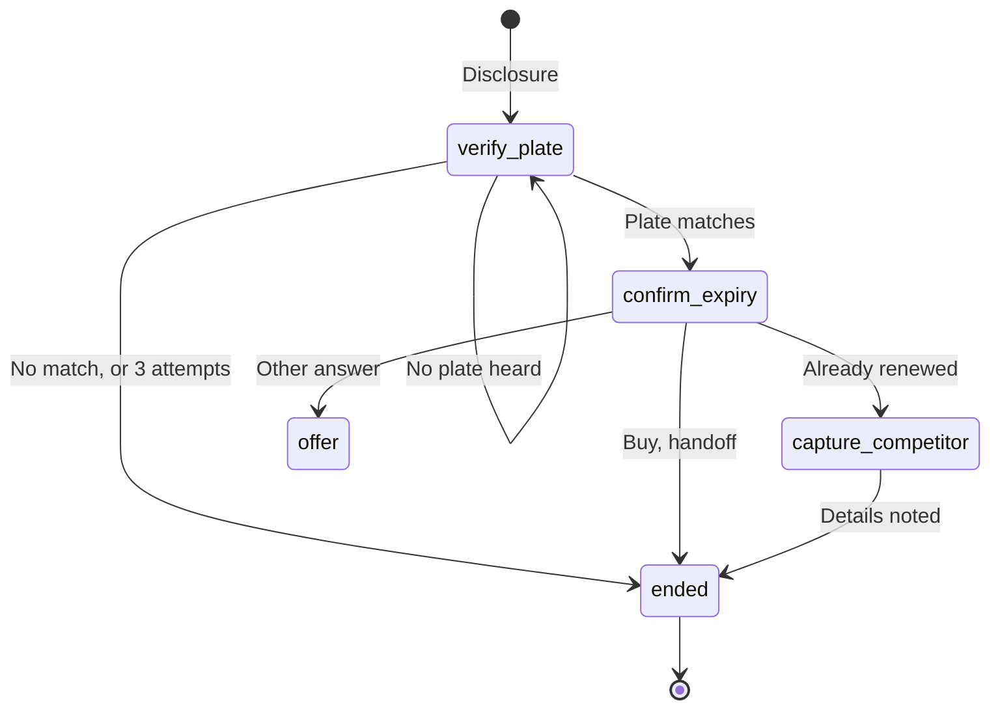
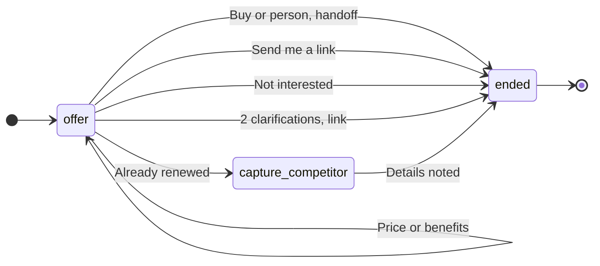
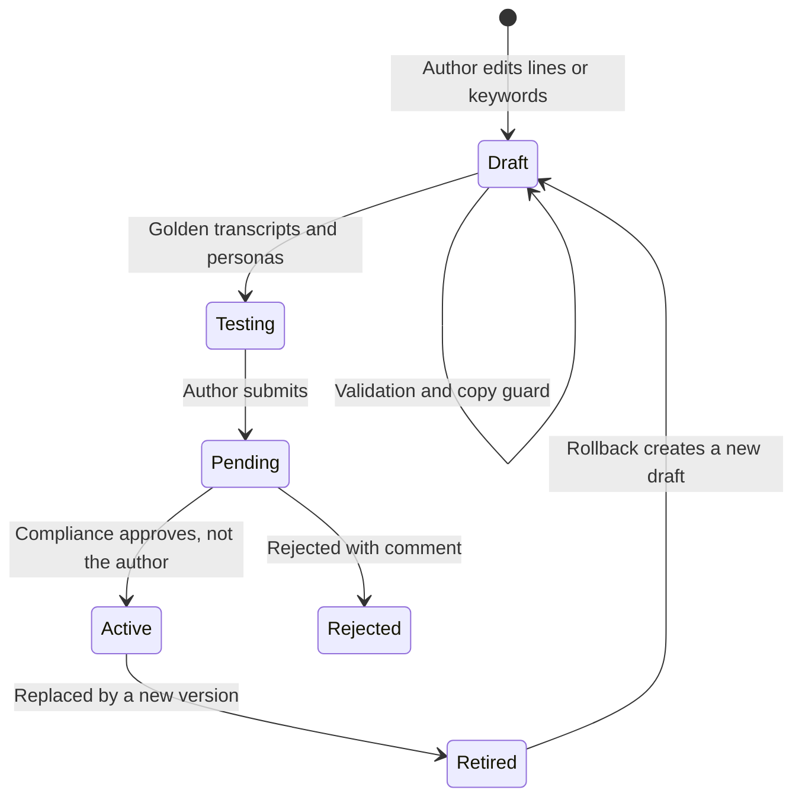

# Introduction

## Purpose

This document sets out how automated decisions and AI components on the TASCO Growth Platform are designed, approved, tested, monitored and corrected. It is the reference for compliance, model risk and customer experience teams when they approve a script, a scoring change or a new model.

## Scope

Every automated component that affects customers: the voice assistant (dialogue, intent recognition and the vendor's speech services), the lead score, next-best action and journey assignment, the inference of policy expiry and vehicle category, benefit selection, quick-renewal eligibility, and any future language model or machine-learning model. Regulatory points are to be confirmed by TASCO legal.

## Audience

TASCO compliance, model risk, legal and data protection; the VETC customer experience lead; the TASCO product owner; the iorta TechNXT team.

## Related documents

| ID | Title | Relationship |
|---|---|---|
| TGP-ARC-01 | Solution Architecture | Rules engine and maker-checker |
| TGP-ARC-02 | Integration Architecture | Voice vendor contract and handoff sequence |
| TGP-ARC-03 | Data Architecture | Golden record and expiry inference |
| TGP-ARC-04 | Security Architecture | Access control and incident response |
| TGP-ARC-07 | Architecture Decision Records | ADR-003 rules engine, ADR-009 voice dialogue |

# AI inventory and risk tiering

No component on the platform today uses a generative or trained machine-learning model of its own. The voice assistant follows a fixed dialogue with an approved script, and scoring and inference are explainable rules. The vendor's speech recognition and text to speech are the only machine-learning components in the customer path.

| Component | Type | Customer impact | Risk tier | Owner |
|---|---|---|---|---|
| Voice assistant dialogue | Fixed state machine with a governed script | Speaks to customers, records opt-outs, hands off to sales | High: direct interaction, scam context | CX lead |
| Intent recognition | Keyword matching; language model optional in future | A wrong intent takes a wrong path; a missed opt-out is critical | High | CX lead and model risk |
| Speech recognition and synthesis | Vendor machine learning (Vietnamese) | Mis-transcription can cause a plate mismatch or wrong intent | Medium | Vendor and CX lead |
| Lead score and tier | Weighted rules with reasons | Who is contacted, how often and on which channel | Medium | Growth analytics |
| Next-best action and journey | Decision tables | Channel choice, suppression, routing of company vehicles to B2B | Medium | Campaign |
| Expiry inference | Evidence-weighted inference | Timing of reminders and quote start date | Medium | Data office |
| Vehicle category inference | Decision table | Category drives the regulated premium if not confirmed | High for pricing | Data office and underwriting |
| Benefit selection | Relevance rules | Which value-added services are shown; only approved and available items | Low | Product |
| Quick-renewal eligibility | Fixed conditions with settings in the service levels rule set | Whether the 3-step quick renewal is offered; the full flow is always available and the declaration stays explicit | Low | Product and Compliance |
| Future language model or propensity model | Machine learning | Assessed before introduction | To be assessed | Model risk |

# Voice assistant

## Design principles

Each principle is enforced in code or in governed content, not left to the vendor.

| Principle | How it is enforced |
|---|---|
| Disclose automation and recording at the start | The opening line says the caller is VETC's automated assistant and that the call is recorded. Wording to be confirmed by TASCO legal. |
| Never ask for a one-time password, card or payment | Stated in the opening and trust lines; no dialogue state collects such data; payment happens only in the customer app |
| Customer proves the plate; the bot never reads it out | The customer must say the plate, which must match the record. A mismatch ends the call; three failed attempts end it as unverified. Afterwards the bot refers only to a masked plate. |
| Truthful about price | The price line states the regulated premium including VAT and moves on to service value. The copy guard rejects discount and rebate language in any form, including spacing and punctuation tricks. |
| Respect opt-out at once | Opt-out is checked before anything else in every state. It ends the call, sets call consent off and do-not-contact, survives data rebuilds, is audited and drops the lead score to zero. |
| Safety first | "Driving" or "busy" ends the call politely with a drive-safely line |
| Answer scam concerns | A scam concern gets the trust line: how to verify the call, and that payment is only in the app |
| Hand off to a person on request | Wanting to buy or talk to a person ends the call as a handoff with minimal data |
| Keep the conversation short | Two clarifications at most, then a link is sent instead of looping; each utterance is capped at 500 characters |
| Call only when allowed | Every automated call passes the contact policy: call consent, do-not-contact, 08:00 to 20:00, at most two call attempts a week. Company vehicles are skipped. A national do-not-call register check is planned (to be confirmed by TASCO legal). |
| Every call improves data, nothing more | Outcomes update the expiry, raise data quality issues or record consent. No hidden profiling attributes are kept. |

## Dialogue

The dialogue is a fixed state machine in code (ADR-009). The two diagrams show its states and transitions: an unverified call ends after three attempts to hear a matching plate, and after two clarifications in the offer the assistant sends the renewal link and ends the call.

Four intents are checked in every state before the state's own logic: opt-out, wrong person and call me later end the call; a scam concern plays the trust line and moves to the offer.

## Script lifecycle

The script (bot lines in Vietnamese with an English gloss, intent keywords and their order, attempt and clarification limits) is a rule set governed by maker-checker. The state machine itself is code and changes through code review and a release.

Before approving, the compliance approver checks that:

1. the disclosure and recording notice are unchanged, or have been re-approved by legal;
2. no line asks for a one-time password, card, password or payment;
3. price statements match the active tariff and say the premium is the same at every insurer;
4. no line implies a discount, even without a banned phrase;
5. the opt-out keyword list has not been narrowed without a recorded reason;
6. the intent order has been reviewed, because a short "yes" keyword can capture "không có" ("I don't have it");
7. golden-transcript results are attached, with 100% pass on opt-out, plate mismatch, scam concern and price;
8. tone and form of address suit Vietnamese customers, with a regional dialect check.

Testing uses the simulated caller personas (eager, self-serve, price shopper, sceptic, already renewed, busy, opt-out, wrong plate) and the interactive voice console. A labelled utterance set and an automated regression run for each script version are planned. Prompts for any future language model follow the same lifecycle under their own rule kind, approved by compliance and model risk.

# Lead scoring and inference

## Model card: lead score

| Item | Value |
|---|---|
| Purpose | Prioritise outreach: who, when and on which channel. It does not affect price, eligibility or claims. |
| Method | Weighted sum of five factors, each between 0 and 1, damped by expiry confidence (60% plus 40% of the confidence); zero when the customer is on do-not-contact |
| Factors and weights | Urgency 35 (days to expiry or lapse), expiry confidence 15, engagement 20 (app sessions, toll trips), reachability 15 (push, Zalo, call consent, SMS), affinity 15 (prior VETC purchase, TASCO customer, wallet covers the premium, auto top-up, fewer complaints) |
| Tiers | Hot from 70, warm from 45, otherwise nurture |
| Explainability | Each lead stores its factor reasons sorted by contribution; each next-best action stores its rule id. Both are shown in the customer 360 view. |
| Excluded attributes | Name, gender, age and date of birth are not collected. Region and owner type are available but not used by any factor. |
| Proxy risks | Wallet balance (affluence), province (through facts), complaints (reduce affinity) |
| Validation | Weights must add up to 100 and hot must exceed warm; simulation compares current and candidate scores per profile before approval |
| Limitations | Weights are set by hand, not fitted. Calibration needs production outcomes; synthetic data only today. |

## Controls

| Control | Method | Cadence | Status |
|---|---|---|---|
| Explainability | Factor reasons and rule ids on every lead | Every evaluation | Built |
| Change control | Maker-checker with simulation; model-risk sign-off for scoring, next-best action and journeys | Every change | Built; sign-off procedural |
| Reproducibility | Store the rule set versions used for each lead | Every evaluation | Planned |
| Calibration | Conversion within 30 days of first contact by tier; hot above warm above nurture | Monthly | Planned |
| Fairness | Contact rate, tier mix and conversion by province group, owner type and vehicle category; contact-rate ratio of at least 0.8 against the reference group unless explained by urgency | Quarterly and on each scoring change | Planned |
| Feature guard | Validator rejects scoring factors that use region, owner type or a demographic field without a model-risk waiver | On save | Recommended |
| Drift | Population stability index on the score (alert above 0.2) and key inputs; weekly tier mix | Weekly | Planned |
| Outcome review | Compare factor contributions with outcomes; propose new weights as a draft; champion and challenger with hold-out groups | Quarterly | Planned; needs an experiment flag |
| Human oversight | Telesales see reasons and can close leads with a note; supervisors reassign | Continuous | Built |

## Inference of expiry and category

| Inference | Risk | Control |
|---|---|---|
| Policy expiry | A wrong date means early or late reminders, and a quote start date that overlaps or leaves a gap in cover | Measure accuracy against later verified certificates and TASCO issuance (share within 21 days, per method); tune evidence confidences through maker-checker; reminders ask the customer to confirm the date |
| Vehicle category | A wrong category means a wrong regulated premium if not corrected | Measure accuracy against TASCO-issued categories. The customer app asks the customer to confirm use and seats before quoting in the full flow, and quick renewal requires a confirmation by TASCO core, a matching TASCO policy or the customer within 365 days. The same check is recommended on the server for telesales and partner quotes when category confidence is below 0.8. |

The confidences for customer, steward and voice-assistant facts are governed in the service levels rule set. Three thresholds are still fixed in code (TASCO issuance 1.0, voice "expiry known" at 0.5, app confirmation prompt below 0.75) and will move into a rule set.

# Language model policy

The platform uses no language model today. This policy applies before any language model or other generative model is introduced.

## Permitted and prohibited uses

| Permitted, with approval | Prohibited |
|---|---|
| Intent recognition behind the classifier interface; output limited to the script's intent names or "unknown" | Generating customer-facing speech or messages that were not pre-approved |
| Agent assistance: summarising call outcomes for telesales from structured signals | Quoting prices, eligibility, cover terms or legal advice |
| Data quality assistance: suggesting clean-ups of free text for steward review | Deciding consent, claims, underwriting or anything with legal effect without a person |
| Drafting rule logic as a draft only, still subject to validation and maker-checker | Collecting or processing one-time passwords, card data or national ids |

## Data protection

Only the current utterance (at most 500 characters) and the intent list are sent, with digit sequences and known names masked; no profile data, transcript history or ids. No personal data goes to an external model provider without a DPA, a processing record, a transfer impact assessment and confirmation that cross-border transfer rules are met (to be confirmed by TASCO legal). An in-country or self-hosted model is preferred for anything that touches customer speech. The provider must not train on customer data, and zero retention is required where offered. The platform logs the intent, confidence, model id and prompt version, but not raw prompts or completions.

## Evaluation and guard-rails

| Suite | Content | Pass criteria |
|---|---|---|
| Intent evaluation | At least 2,000 labelled Vietnamese utterances across Northern, Central and Southern dialects, speech without diacritics, mixed Vietnamese and English, noise, numbers in words | Better than keyword matching by 5 points of macro F1; opt-out recall at least 0.99; scam concern recall at least 0.95; buy-now precision at least 0.9 |
| Plate extraction | Spoken plates in many styles, including Vietnamese tens and motorbike plates | At least 98% exact match on clear transcripts |
| Red team | Prompt injection by speech, discount requests, impersonation, abuse, attempts to extract other customers' data | No policy violations: output stays within the intent list and no personal data is echoed |
| Regression | Golden transcripts for each script version | 100% on critical paths |
| Latency | Classification time, 95th percentile | 300 ms or less, otherwise fall back to keywords |

At run time the output is checked against the intent list, a timeout falls back to keyword matching, the keyword opt-out check always runs first and overrides the model, and a flag per campaign allows gradual rollout.

# Monitoring

The governance dashboard (permission to read the audit trail) shows call volumes and outcomes, the plate verification failure rate, the opt-out rate, the disclosure statement, rule set counts by status and the audit-chain verification result.

| Measure | Threshold and action |
|---|---|
| Opt-out rate | Above 8% in a week: review script and targeting. Above 15%: pause the campaign. |
| Plate verification failure | Above 25%: check speech recognition quality and data accuracy |
| Wrong-person rate | Above 5%: data quality incident with the VETC data office |
| Unknown intent and clarification rate | Above 20%: review intent keywords (metric planned) |
| Complaints about the assistant | Any scam-related complaint: incident (section 7) |
| Messages blocked by the copy guard at send | Any: template defect to fix |
| Contact-policy suppressions | Monthly trend review of consent health |
| Score drift and fairness | Population stability index above 0.2 or contact-rate ratio below 0.8: model-risk review |
| Handoff conversion | Below target: review talking points and scoring |

# AI incident handling

| Incident | Examples | Immediate containment | Follow-up |
|---|---|---|---|
| Harmful or incorrect speech | Wrong price, implied discount, rude wording | Roll back the script to the previous version (rollback, then approve); pause automated calls | Root cause; new golden transcript; compliance review |
| Missed opt-out | Customer said stop and was called again | Pause campaigns; set do-not-contact for affected customers; review consent withdrawals in the audit trail | Add utterances to the evaluation set; widen keywords; regulator and customer communication if required (to be confirmed by TASCO legal) |
| Scam wave using VETC's name | Customers report fake "VETC insurance" calls | Service message by push and Zalo to affected regions that VETC never asks for one-time passwords or payment by phone; strengthen the trust line | Coordinate with VETC security and the authorities |
| Speech recognition degradation | Vendor accuracy drops; plate failures rise | The voice circuit breaker opens on errors; otherwise reduce concurrency or pause | Vendor service level escalation |
| Scoring defect | A bad weights version contacts the wrong customers | Roll back scoring or next-best action; re-score leads | Simulation evidence required on the next change |

Today, pausing automated calls means suspending the journeys job and stopping voice campaigns. A single operational switch that stops all automated calls at once, with its own permission and audit entry, will be added before go-live.

# Roles and responsibilities

R is responsible, A accountable, C consulted and I informed.

## Business and control functions

| Activity | TASCO product owner | VETC CX lead | Compliance officer | Legal and DPO | Model risk |
|---|---|---|---|---|---|
| Voice script change | A | R | C | C | I |
| Disclosure and recording wording | C | C | R | A | None |
| Dialogue state machine change | A | C | C | I | I |
| Scoring, next-best action or journey change | A | C | C | I | R |
| Fairness and drift review | I | I | C | C | A and R |
| New language model or prompt | A | C | C | R | R |
| Opt-out and consent handling | I | R | A | C | None |
| AI incident response | A | R | R | C | C |
| Monthly governance dashboard review | A | R | R | I | R |
| Category and expiry inference accuracy | A | None | I | None | R |

## Delivery and operations

| Activity | TASCO information security | Rule author | Rule approver | iorta TechNXT engineering | Telesales operations |
|---|---|---|---|---|---|
| Voice script change | I | R | R (approves) | I | C |
| Dialogue state machine change | C | None | None | R | I |
| Scoring, next-best action or journey change | None | R | R (approves) | I | C |
| New language model or prompt | R (security review) | None | R (approves prompt) | R (integration) | I |
| Opt-out and consent handling | None | None | None | R (code) | I |
| AI incident response | C | None | None | R | I |
| Category and expiry inference accuracy | None | C | C | C | None |

# Regulatory alignment

All of the following are to be confirmed by TASCO legal before production:

- the lawful basis for processing and the disclosure of automated calls (Decree 13/2023/ND-CP; Personal Data Protection Law 91/2025/QH15 and its implementing decree);
- marketing calls and messages: hours, frequency and the do-not-call register (Decree 91/2020/ND-CP);
- consumer protection and the call recording notice (Law on Protection of Consumers' Rights 2023);
- the prohibition of discounts or rebates on compulsory TNDS cover (Law on Insurance Business 08/2022/QH15; Decree 67/2023/ND-CP);
- data residency (Cybersecurity Law 2018; Decree 53/2022/ND-CP).

The defaults on the platform are conservative and configurable through the contact policy, copy guard and retention rule sets, so legal positions can be applied as approved rule changes rather than code changes.
