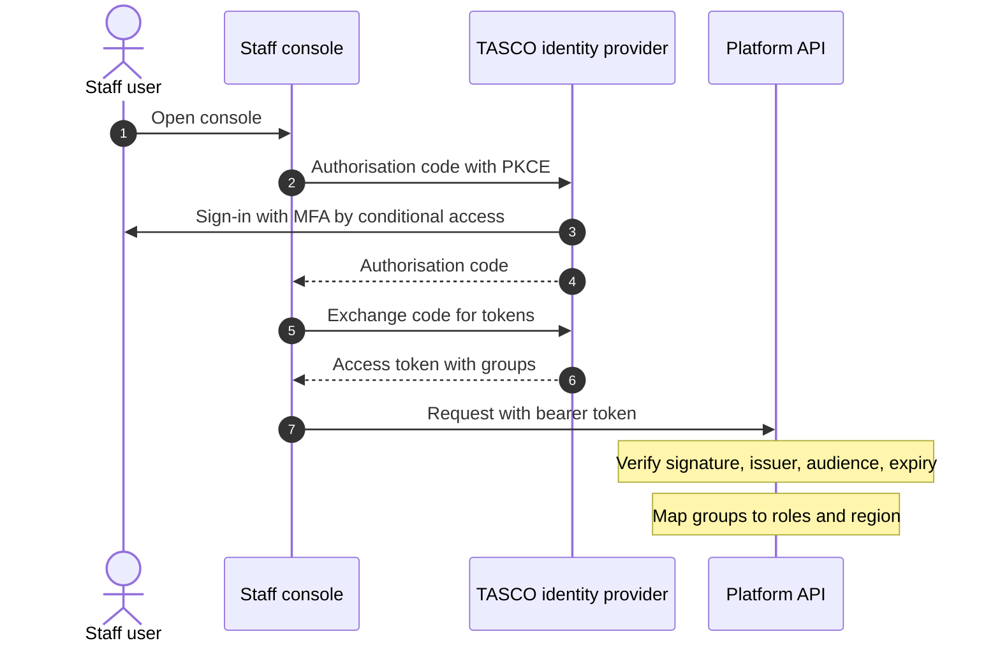

# Introduction

## Purpose

This document records the significant architecture decisions behind the TASCO Growth Platform: the context of each decision, what drove it, the options considered, what was decided and what follows from it, good and bad. It lets TASCO's architects review the reasoning behind the design and lets future teams change a decision knowingly rather than by accident.

## Scope and format

Fourteen decisions are recorded, from the overall structure to TASCO core's role as master for products and rating and the rules for quick renewal. Each record has the same five parts: context, decision drivers, options considered, decision and consequences. Consequences include the known limitations and the planned follow-up, so the trade-off is visible. A decision is changed by a new record that supersedes the old one; records are not rewritten.

Status values: Accepted means the decision is in force and implemented. Accepted (interim) means the decision is in force for the pilot and UAT, and the record defines the target that replaces it.

## Audience

TASCO IT architecture and information security, VETC technical leads, internal audit and the iorta TechNXT delivery team.

## Related documents

| ID | Title | Relationship |
|---|---|---|
| TGP-ARC-01 | Solution Architecture | The architecture these decisions shape |
| TGP-ARC-02 | Integration Architecture | Ports, adapters and TASCO core integration |
| TGP-ARC-03 | Data Architecture | Persistence and data model |
| TGP-ARC-04 | Security Architecture | Identity, encryption, audit |
| TGP-ARC-05 | Deployment and Infrastructure Architecture | Containers, Kubernetes, pipeline |
| TGP-ARC-06 | AI Governance | Voice assistant and scoring governance |

## Index

| ID | Decision | Status | Date |
|---|---|---|---|
| ADR-001 | Ports and adapters architecture | Accepted | 07/10/2026 |
| ADR-002 | Node.js 22 with one runtime dependency | Accepted | 07/10/2026 |
| ADR-003 | Rules engine with maker-checker governance | Accepted | 07/10/2026 |
| ADR-004 | PostgreSQL documents with indexed columns | Accepted | 07/10/2026 |
| ADR-005 | Transactional outbox, broker later | Accepted | 07/10/2026 |
| ADR-006 | Field-level encryption with a blind index | Accepted | 07/10/2026 |
| ADR-007 | Local sign-in with TOTP now, OIDC as target | Accepted (interim) | 07/10/2026 |
| ADR-008 | Hash-chained, append-only audit trail | Accepted | 07/10/2026 |
| ADR-009 | Fixed voice dialogue with a governed script | Accepted | 07/10/2026 |
| ADR-010 | Route table that generates OpenAPI | Accepted | 07/10/2026 |
| ADR-011 | Framework-free front end with design tokens | Accepted | 07/10/2026 |
| ADR-012 | Containers on Kubernetes, Railway for UAT | Accepted | 07/10/2026 |
| ADR-013 | TASCO core as master for products and rating | Accepted | 07/10/2026 |
| ADR-014 | Quick renewal decided by rules, with an explicit declaration | Accepted | 08/10/2026 |

# ADR-001 Ports and adapters architecture

## Context

At the start, most systems the platform must call were not available to integrate with: the VETC wallet and data feed, TASCO core policy administration, Zalo ZNS, the SMS provider, app push, a Vietnamese voice vendor and the TASCO identity provider. The business logic (golden record, scoring, journeys, contact policy, rating and dialogue) still had to be demonstrable, testable and auditable from day one, and swapping in each real system later must not touch that logic.

## Decision drivers

- The pilot must run end to end on sandbox integrations, and production must swap adapters without regression.
- Domain logic must be deterministic and testable without input or output; the business date is injected.
- Regulated logic (tariff, copy guard, consent) needs one obvious place to review.
- The structure must be simple enough for a small team to keep consistent.

## Options considered

| Option | Assessment |
|---|---|
| Ports and adapters (hexagonal), single composition root | Isolates business logic; one place to swap adapters |
| Layered MVC | Familiar, but persistence and HTTP concerns leak into business logic, and sandbox switching spreads across the code |
| Microservices per capability | Independent scaling, but the team and pilot do not justify distributed transactions, several pipelines and databases yet |

## Decision

Ports and adapters, in five rings with dependencies pointing inward: shared kernel (standard library only), domain and rules (shared kernel only), application services (ports arrive as constructor arguments), adapters (HTTP, persistence, messaging, integrations) and one composition root, `src/bootstrap/container.js`, which is the only place that picks adapters. Each outbound integration is wrapped in a circuit breaker when the container is built.

## Consequences

- A sandbox adapter is replaced by a real one in one place.
- The domain modules are pure functions, so compliance and model risk can review scoring, golden record and dialogue rules in isolation.
- Ports are duck-typed JavaScript with no compile-time check, so contract tests per adapter are needed (planned for SIT).
- A few HTTP handlers still hold small amounts of orchestration (partner onboarding, steward expiry correction, voice campaign loop, global search); these will move into application services.
- The platform is one deployable, a modular monolith. Each service owns its collections, so it can be split along those lines later if scale or team structure requires it.

# ADR-002 Node.js 22 with one runtime dependency

## Context

The platform processes personal data on about 6 million vehicle owners and moves money through the VETC wallet. Software supply-chain compromise (typosquatting, maintainer takeover, vulnerable transitive packages) is a top risk, and insurers and their regulators expect a defensible software bill of materials and patch cadence. The team also needs fast delivery and easy onboarding.

## Decision drivers

- Small attack surface and few transitive dependencies.
- A long-term-support runtime.
- Fast start-up and low memory for containers and jobs.
- One language across server, jobs and front end.

## Options considered

| Option | Assessment |
|---|---|
| Node.js 22 LTS, standard library first, PostgreSQL driver as the only runtime dependency, JavaScript with JSDoc | Very small SBOM; every primitive reviewable |
| Node.js with TypeScript and a framework stack | Better typing and ergonomics, but hundreds of transitive packages to patch |
| Java and Spring Boot | Mature in insurance IT, but heavier runtime, slower pilot iteration and a different skill set from the front end |

## Decision

Node.js 22 LTS with `pg` as the only runtime dependency, loaded only when PostgreSQL is used. HTTP server and routing, cryptography (AES-GCM, HMAC, scrypt, signed tokens, TOTP), validation, metrics and tests use the Node.js standard library. Development dependencies are limited to linting.

## Consequences

- The SBOM is very small, dependency audits stay meaningful and scanner noise stays low.
- Hand-written primitives are short enough to review line by line and are pinned to standards (RFC 7519, RFC 6238, OWASP ASVS). They carry implementation risk, mitigated by tests with standard test vectors, an external penetration test that covers authentication, and the move of staff token issuance to the identity provider (ADR-007).
- There is no compile-time type safety; JSDoc, linting and high test coverage compensate, and type checking can be enabled in CI without changing the runtime.
- Framework conveniences such as streaming body parsing and HTTP/2 are absent, which is acceptable for a JSON API behind an ingress.
- Any new runtime dependency needs a new decision record.

# ADR-003 Rules engine with maker-checker governance

## Context

Much of the platform's behaviour changes more often than code is released, and much of it is regulated: tariffs, commission and statutory caps; scoring, journeys and next-best actions; message templates, the voice script and banned phrases; consent, contact policy, access attributes and retention. Business owners need to change these values safely, with validation, four-eyes approval, an audit trail, simulation and rollback, and without a code deployment.

## Decision drivers

- No code execution from data.
- An invalid rule must be impossible to activate.
- Author and approver must be different people.
- Every score and next-best action must be explainable by rule id and reason.
- All pods must pick up an approved change quickly.

## Options considered

| Option | Assessment |
|---|---|
| Safe JSON Logic subset, decision tables, per-kind validators and a maker-checker workflow in the platform | Small, auditable, no dependency |
| External business rules engine (Drools, Camunda DMN, FICO Blaze) | Powerful authoring, but licence cost, another runtime to secure and integration latency; excessive for the rule volume |
| Rules as code with feature flags | Strong typing, but every tariff or template change becomes a release |
| Full JSON Logic library | More operators, but a dependency and operators that are not wanted |

## Decision

A built-in rules engine: an evaluator with an operator allow-list that forbids prototype access; decision tables whose results carry a rule id; validators for every embedded expression plus checks per kind (for example weights adding to 100, commission within statutory caps, the copy guard on every customer-facing string). Rule sets move from draft to pending approval to active, then retired, or are rejected. Only the author submits; the approver must be someone else; restricted kinds (commission, copy guard, contact policy, access attributes, retention) need a compliance officer. Approval retires the old version and activates the new one in one transaction, with a database index that allows one active version per kind. Rollback creates a new draft that is approved again. Each version stores a checksum. Active rules are cached for 15 seconds in each pod. Simulation compares current and candidate outcomes for a real profile before submission.

## Consequences

- Business change takes hours, not a release cycle, with a target of one working day from draft to active.
- Rules are data: they can be compared by checksum, audited and exported for regulators.
- JSON Logic is verbose for authors; the rules studio adds forms, validation and simulation, with an advanced view for technical users.
- The commission cap check matches products by text; payouts are still capped at run time, and the validator will evaluate each row per capped product.
- There is no limit on expression size beyond the 1 MiB request limit; a node-count limit will be added.
- Tariffs can be approved by any rule approver; adding them to the restricted kinds is an option for TASCO.

# ADR-004 PostgreSQL documents with indexed columns

## Context

The aggregates are document-shaped and evolve quickly: a golden profile nests vehicle, policy, engagement, channel, consent, lineage and expiry evidence, and leads, quotes and call sessions are similar. Queries filter on a small, known set of attributes such as tier, score, region, expiry date and status. The platform also needs transactions, row locking for the outbox, point-in-time recovery, a managed high-availability option acceptable to TASCO information security, field-level encryption of personal data and a dependency-free store for tests and demonstrations.

## Decision drivers

- Flexible document schema with typed, indexed filtering.
- Injection-proof querying by construction.
- One encryption and indexing code path for every store.
- Managed PostgreSQL available from every target provider.

## Options considered

| Option | Assessment |
|---|---|
| One PostgreSQL table per collection: id, version, document, typed indexed columns, timestamps; an in-memory store sharing the same codec | Flexible and typed; one code path |
| Normalised relational schema with an ORM | Strong integrity, but heavy migrations for every attribute, more dependencies and awkward mapping of encrypted fields |
| Document database | Natural fit, but a second database to operate, since PostgreSQL is still needed for the outbox, audit and reporting |
| JSONB with general indexes only | Simpler, but weaker typed comparisons and harder to restrict filtering to declared fields |

## Decision

One table per collection with a document column and typed columns extracted from it, declared in a single registry (`schema.js`) of 20 collections, each listing its indexed columns, encrypted fields and blind-index columns. A shared codec encrypts personal fields, computes blind indexes and extracts column values for both stores. Every statement uses bind parameters; identifiers come only from the registry; filtering and sorting are limited to declared columns; result size is capped at 5,000. Updates use optimistic locking on a version number. Migrations are numbered SQL files applied in order under an advisory lock.

## Consequences

- Changes inside the document need no migration; a new filter column needs a migration and a registry entry.
- SQL injection is excluded by construction.
- Tests run against the in-memory store, and a separate suite runs against real PostgreSQL in CI.
- Data is duplicated between the document and its columns; columns are recomputed on every write, so they cannot drift.
- There are no foreign keys; referential integrity is enforced in the services and checked by reconciliation.
- Purchase is protected by an atomic quote claim and saga compensation rather than one transaction; erasure, and state change with event publication, still use separate writes. Passing a transactional store into these use cases is planned.
- Offset paging in batch jobs will move to keyset paging before the base reaches millions of rows.

# ADR-005 Transactional outbox, broker later

## Context

Several reactions should not run inside the caller's request: re-scoring after ingestion, consent change or a call outcome; stopping journeys and sending confirmations after a policy is issued; sending a renewal link the customer asked for; refreshing the rules cache. These reactions must not be lost if a pod or downstream system fails. TASCO and VETC do not yet operate a message broker for this workload, and adding one for the pilot adds infrastructure to run and secure.

## Decision drivers

- At-least-once delivery that survives restarts.
- Safe operation on several pods without a leader.
- No new infrastructure for the pilot.
- Publishers must not change when a broker is introduced.

## Options considered

| Option | Assessment |
|---|---|
| Outbox table in PostgreSQL, relay claiming with `FOR UPDATE SKIP LOCKED`, named subscribers, dead letter after five attempts | Durable, no new infrastructure, broker can be added behind it |
| Kafka or a managed broker from day one | Durable and replayable, but heavy for pilot volumes and still needs an outbox to avoid dual writes |
| In-process event emitter | Trivial, but events are lost on a crash and it does not work across pods |
| PostgreSQL notifications | Low latency but not durable; usable later as a wake-up hint |

## Decision

Events are written to `domain_events` as pending. A relay claims a batch in a short transaction with `FOR UPDATE SKIP LOCKED`, reclaiming rows left in processing for more than five minutes after a crash. Each subscriber is named; successful subscribers are recorded so a retry runs only the failed ones. After five attempts the event becomes a dead letter. The relay runs every second in each API pod, as a scheduled job every five minutes, and at the end of interactive requests that need to read their own writes.

## Consequences

- No broker to operate; the relay scales with the pods and the backlog is visible in the operations view.
- When a broker arrives, the relay forwards events to topics and subscribers become consumers; publishers do not change.
- The event insert is not yet in the same transaction as the business change, so a crash between them can lose an event; a transactional event bus bound to the store transaction is planned.
- Retries have no backoff, so five attempts can be used within seconds during a short outage; a next-attempt time with exponential backoff is planned.
- Ordering is guaranteed only within a claimed batch; current handlers recompute from state and do not depend on order.
- Completed events are not purged yet; a 30-day retention rule or monthly partitions are planned.
- Some message-sending handlers create a new message id on each run, so a replay after partial failure could send twice; message ids derived from the event are planned.

# ADR-006 Field-level encryption with a blind index

## Context

The platform holds personal data on millions of Vietnamese vehicle owners: names, phones, call transcripts, claim descriptions and locations, and staff authenticator seeds. Vietnam's personal data protection rules require appropriate technical protection (Decree 13/2023/ND-CP and the Personal Data Protection Law 91/2025/QH15, to be confirmed by TASCO legal). Disk encryption alone does not protect against a database operator reading data, leaked backups or replicas, or exfiltration through a compromised read path. Exact search by phone is still needed, for example to find a customer from a call.

## Decision drivers

- Personal data unreadable without the application key, including in backups, replicas and extracts.
- Keys rotatable without downtime.
- Exact search on selected fields without decryption.
- No third-party cryptography library (ADR-002).

## Options considered

| Option | Assessment |
|---|---|
| Application-level AES-256-GCM per field with key ids, plus HMAC-SHA256 blind-index columns | Protects against operator and backup exposure; rotation without downtime |
| Storage encryption only | Transparent, but no protection against database access or logical dumps |
| Encryption functions in the database | Keys travel in SQL statements and appear in logs; couples code to PostgreSQL |
| KMS call per record | Strongest custody, but latency and cost per field at millions of records; kept for the key-encryption key only |

## Decision

AES-256-GCM per field with a random IV and the key id in each value, in addition to storage encryption and TLS. Several data keys can be loaded with one active; decryption picks the key by its id, so a new key can be activated without downtime and old values re-encrypt on their next write, with a re-key job planned to finish the rotation. Encrypted fields: source record phone and name; profile name, phone and other phones; message recipient; call transcript; handoff name; claim description and location; data-subject request note; staff display name and authenticator seed. The phone blind index is an HMAC with its own key, used by the console's global search.

## Consequences

- Database dumps, replicas and logs contain ciphertext for personal data; the logger also redacts personal keys.
- No range, prefix or partial search on encrypted fields; search is by plate or exact phone.
- The blind index is deterministic, so equal phones are linkable inside the database, and the small mobile number space could be brute-forced if the blind-index key leaked; that key is protected like the data keys.
- Keys live in process memory; wrapping them with a KMS key is the production target.
- The plate is the match key and is stored in clear. Whether a plate is personal data is to be confirmed by TASCO legal and the DPO; if it is, a keyed pseudonym becomes the id and the display plate is encrypted.

# ADR-007 Local sign-in with TOTP now, OIDC as target

## Context

Four kinds of principal call the platform: staff in 13 roles using the console; customers in the customer app, hosted in the VETC app, TASCO's app and website or a Zalo Mini App; partner systems; and batch jobs. The TASCO identity provider and VETC app sign-on could not be integrated in the pilot timeframe, yet privileged roles need MFA from day one and joiners, movers and leavers must be controlled.

## Decision drivers

- MFA for privileged roles from day one.
- The principal contract (id, roles, region, customer id) must not change when the identity provider arrives.
- Short-lived tokens and lockout against guessing.
- Revocable machine credentials for partners.

## Options considered

| Option | Assessment |
|---|---|
| Local accounts with scrypt, TOTP and short-lived signed tokens now; OIDC, VETC sign-on and OAuth for partners as the target | Unblocks the pilot with strong controls and a stable contract |
| Identity provider before the pilot | Best end state, but blocks the pilot on enterprise onboarding |
| Server-side sessions with cookies | Easy revocation, but needs shared session storage and CSRF protection, and suits partners and app embedding less well |

## Decision

Staff sign in with a password (scrypt) and, for privileged roles, a TOTP code; they self-enrol at first sign-in and administrators never see seeds. Codes cannot be reused, lockout covers both steps, and new users must change their password at first sign-in. Staff tokens last 30 minutes; the user is reloaded on every request, and password, MFA, role, status or region changes revoke earlier tokens. Customers arrive through a signed renewal link that expires after 30 days and receive a one-hour token. Partners use API keys stored as hashes, with scopes enforced per route.

The target state replaces local staff sign-in with OIDC, as the sequence shows.

Customers will exchange their VETC app sign-on token for a platform customer token, and partners will move to OAuth 2.0 client credentials or mutual TLS at the gateway.

## Consequences

- Privileged roles are protected by MFA today, without administrators handling seeds, and the principal contract stays stable through the migration.
- No session state on the server; tokens are short-lived.
- One signing secret serves staff, customer and MFA tokens, separated by audience; asymmetric tokens from the identity provider remove this.
- Logout revokes a token only on the pod that handled it until the token expires; credential and role changes revoke on all pods. A shared revocation list or identity provider session revocation is the target.
- The MFA step token is not single-use within its five minutes; lockout and code replay protection limit the impact, and a nonce is planned.
- Renewal links carry the plate key; a nonce and a pseudonymous id are planned.
- Demonstration sign-in helpers exist only in demo mode, which production refuses.

# ADR-008 Hash-chained, append-only audit trail

## Context

Regulators, TASCO internal audit and the DPO need to know who did what, when and to which record, with assurance that the record was not changed afterwards. This covers rule approvals, sign-ins and MFA failures, profile views with or without personal data, consent and data subject actions, orders, claims and partner keys. Ordinary logs can be edited or deleted by anyone with access to the database or the log store.

## Decision drivers

- Tampering must be detectable, not only prevented.
- Append-only at the database level.
- Cheap verification available to auditors in the product.
- No personal data in audit details.

## Options considered

| Option | Assessment |
|---|---|
| Hash chain in PostgreSQL with triggers that forbid change and serialised appends | Queryable in the product, verifiable, no new vendor |
| Logs to SIEM or write-once storage only | Strong retention, but not queryable in the product and integrity depends on another system; kept as a second copy |
| Ledger database or blockchain | Strong guarantees, but a new vendor, data-residency questions and unnecessary at this scale |

## Decision

Each audit entry stores the previous entry's hash and its own SHA-256 hash over a canonical form of its fields. Appends are serialised with a database advisory lock, so the chain stays linear across pods. Triggers reject update, delete and truncate on the audit table. The audit trail can be searched and verified in the product by users with audit permission, and the governance dashboard shows the chain status. Details hold ids, counts, reasons and checksums, never names or phones; sign-in records include the client IP.

## Consequences

- Editing or deleting any entry breaks verification at that point; inserting a forged entry means recomputing every later hash, which an external anchor exposes.
- Both stores share the chain code, so the property is unit-tested.
- The table owner can still disable triggers; in production the application role must not own the table and holds only insert and select on it.
- A database superuser could rewrite the whole chain undetected from inside the database; anchoring the chain head hourly to write-once storage is the target.
- Verification reads the whole table; at millions of rows it becomes incremental from verified checkpoints.
- Audit writes are not in the same transaction as the business change, so a crash can leave a change without its entry.
- Audit entries are kept for 10 years and never deleted early; the archival pipeline is planned.

# ADR-009 Fixed voice dialogue with a governed script

## Context

Outbound renewal calls at scale are much cheaper with a voice assistant than with telesales, but Vietnamese customers are wary of insurance calls and scams that use VETC's name. The call must build trust (disclose automation, never ask for a one-time password or payment, verify without reading out the customer's data), say only approved words (regulated pricing, no discount language), respect opt-out immediately and hand over to a person with a minimal summary. A generative dialogue can invent prices, promise discounts or leak data, and is hard to approve under maker-checker.

## Decision drivers

- Every customer-facing line pre-approved, versioned and checked by the copy guard.
- Predictable, testable behaviour.
- Replaceable vendor speech services.
- Intent recognition improvable without touching the script or the flow.

## Options considered

| Option | Assessment |
|---|---|
| Fixed state machine in code, governed script as a rule set, pluggable intent classifier (keywords by default, language model optional) | Exact words approved by compliance; testable per state |
| Generative agent with a system prompt | Natural conversation, but content cannot be approved in advance, prices may be invented and personal data flows to the model |
| Vendor's own bot builder | Fast start, but the script lives outside maker-checker and audit, with vendor lock-in |

## Decision

A fixed dialogue (`src/domain/voicebot.js`) with the states and transitions shown in TGP-ARC-06 AI Governance. Lines, intent keywords and limits live in the voice script rule set and change only through maker-checker with the copy guard. The customer must say the plate, which must match the record; the bot speaks only a masked plate. The intent classifier is injected; any language-model classifier must return one of the script's intent names and never generates speech. Call outcomes update the platform: handoff, link, opt-out, already renewed, or a data quality issue. The vendor streams recognised text through the telephony port.

## Consequences

- No risk of invented speech; compliance approves the exact words, and behaviour is tested per state.
- A language model can later improve intent recall with model-risk sign-off, without re-approving the dialogue.
- Conversations are rigid and keyword matching misses paraphrases. Short "yes" keywords can misfire, for example on "không có" ("I don't have it"); a labelled evaluation set and keyword-order review mitigate this.
- Transcripts are stored encrypted; recordings stay with the vendor under a data processing agreement, kept 180 days.
- The recording notice wording is to be confirmed by TASCO legal.

# ADR-010 Route table that generates OpenAPI

## Context

Many consumers depend on the API: the staff console and customer app, partners integrating server to server, VETC and TASCO integration teams, and security testers whose dynamic scans need a specification. Documentation that drifts from code causes integration defects and security blind spots such as undocumented endpoints or missing authorisation.

## Decision drivers

- One source of truth for path, method, audience, permission and input schema.
- Authorisation impossible to forget on a new route.
- The published contract must match behaviour.

## Options considered

| Option | Assessment |
|---|---|
| Routes as data: one table drives the router, the request pipeline and the OpenAPI generator | Contract cannot drift; one table to review |
| Design-first OpenAPI with code generation | Strong for external contracts, but two artefacts to keep in step or more dependencies |
| Framework annotations | Concise, but needs a framework (conflicts with ADR-002) |

## Decision

Each route declares its method, path, audience, permission, partner scope, body and query schemas, idempotency requirement, rate cost and handler. The pipeline enforces, in order: rate limit; body reading (1 MiB, JSON objects only) and path parameter checks; authentication for the declared audience; permission and partner scope; schema validation that rejects unknown fields; the idempotency key format; then the handler. The generator emits OpenAPI 3.1 with the audience and permission of each operation, strict request schemas and a uniform error body. The specification is served by the API and committed to the repository, and CI fails if they differ. The API has 103 routes: 6 public, 82 staff, 11 customer and 4 partner, published as 92 OpenAPI paths.

## Consequences

- The contract cannot drift, and the dynamic scan in CI imports the generated specification.
- A security reviewer reads one table to see every endpoint's exposure.
- Response schemas are generic; partner-facing responses will get explicit schemas first.
- Record-level and ownership checks live in handlers and services, not in the table; a declarative field for them is planned.
- The specification and service information are public; production may restrict them to internal networks.
- The partner API is versioned in the path; a breaking change runs as a new version alongside the old one for at least six months. Internal APIs version with the front end, which ships in the same deployable.

# ADR-011 Framework-free front end with design tokens

## Context

The front end has three parts: the staff console, the customer app (embedded in the VETC app and, later, TASCO's app and website and a Zalo Mini App), and the public certificate check. It must be fast on mid-range Android phones, accessible and bilingual for staff, carry TASCO's brand, and resist cross-site scripting and supply-chain risk, because staff sessions can see personal data.

## Decision drivers

- A strict Content Security Policy with no inline script or style.
- No build chain and no front-end package tree.
- A consistent look across the three surfaces.

## Options considered

| Option | Assessment |
|---|---|
| Standard JavaScript modules, CSS design tokens and small shared helpers, served by the API | Near-zero supply chain; strict CSP works |
| React, Vue or Angular with a bundler | Rich ecosystem, but hundreds of development dependencies and often CSP relaxations |
| Server-rendered templates | Less JavaScript, but more round trips for an interactive console and more templating to review |

## Decision

JavaScript modules with design tokens (colour, spacing, type, radius, dark mode) and shared component styles; third-party code is vendored and reviewed (a QR code generator for certificates); no scripts load from a CDN. The policy allows scripts, styles, fonts and connections only from the platform's own origin, denies framing and sets the usual protective headers, with HSTS in production. Rendering goes through helpers that set text content; inserting HTML built from data is prohibited by code review.

## Consequences

- Almost no front-end supply chain, and an effective policy against injected scripts.
- Fast load with no framework start-up cost.
- More hand-written interface code; shared helpers, a component style layer and tokens keep it consistent. The current interface redesign (grouped navigation, global search, notifications, business-language labels, bottom tab bar in the customer app) follows this decision.
- Framing is denied, which is correct if the VETC app opens the customer app as a top-level web view; if it must embed it in a frame, the policy is relaxed for the customer app and the VETC origins only.
- Cross-origin callers must be on an allow-list; the platform's own pages are always allowed.
- The access token is sent as a bearer header, not a cookie, so there is no cross-site request forgery exposure.

# ADR-012 Containers on Kubernetes, Railway for UAT

## Context

TASCO and VETC need production hosting that meets insurer security requirements (network segmentation, secrets management, high availability, audit) and keeps data in Vietnam (to be confirmed by TASCO legal). For UAT and stakeholder demonstrations a low-effort platform is valuable. The same artefact must run in both.

## Decision drivers

- Build once and run anywhere: laptop, CI, hosted UAT, Kubernetes.
- Non-root, read-only, minimal images.
- Horizontal scaling and zero-downtime releases.
- Portability between Vietnamese providers and private clouds.

## Options considered

| Option | Assessment |
|---|---|
| One container image; Kubernetes in production; Railway for UAT; Docker Compose locally | One artefact everywhere; Kubernetes gives the controls security expects |
| Virtual machines with configuration management | Familiar, but slower to scale, weaker immutability and more patching |
| Serverless functions | Scales to zero, but cold starts, connection storms, the long-running relay and residency limits make it a poor fit |

## Decision

A multi-stage image on `node:22-alpine` with production dependencies only, running as the image's non-root `node` user (uid 1000) without an init process. Kubernetes manifests cover the namespace, configuration, external secrets, deployment with probes and a hardened security context, service and ingress with TLS and WAF rules, autoscaler and disruption budget, default-deny network policy, scheduled jobs and the migration job. Railway hosts the live UAT from the same Dockerfile, with migrations as a pre-deploy command and two replicas. The CI pipeline builds, tests, scans and documents the image.

## Consequences

- One immutable, scanned artefact is promoted from SIT to production.
- Kubernetes provides autoscaling, disruption budgets, network policy and secret-store integration; a managed control plane is recommended to limit operating effort.
- Railway has no network policy and limited control of residency, so it holds synthetic data only and is not used for production personal data.
- The in-process rate limiter and logout list are per pod, so production adds gateway rate limits and a shared revocation list.
- Kubernetes runs migrations from a job, not at pod start; the advisory lock makes an accidental concurrent run safe.
- The read-only file system works because the application writes nothing to disk.

# ADR-013 TASCO core as master for products and rating

## Context

TASCO core holds the product catalogue, tariffs and rating, and issues every policy. The first version of the platform rated quotes locally from versioned rule sets, which suits a sandbox but creates two sources of truth in production. A premium shown in the customer app must be exactly the premium TASCO core binds and issues, and product or tariff changes must be made once, in core.

## Decision drivers

- One source of truth for products and premiums, with no re-keying.
- A customer never pays a price core has not confirmed.
- A core outage must not cause a wrong price; TASCO decides the trade-off between availability and certainty.
- Minimal personal data sent to core.
- Sandbox and UAT keep working without a core connection.

## Options considered

| Option | Assessment |
|---|---|
| Two ports, rating and product catalogue, with a production REST client for TASCO core and a simulated core for sandbox, selected by configuration | Core is the single authority; sandbox unchanged |
| Keep local rating and reconcile against core after issue | Simple, but a mismatch is found only after the customer has paid; rejected |
| Replicate core's tariff tables nightly and rate locally | Works without a rating API, but duplicates rating logic; kept as the interim path only |

## Decision

| Element | Decision |
|---|---|
| Ports | Rating returns per-line premium, VAT, total, a core quote reference, a rating version and validity. The catalogue port returns products and versions. |
| Production adapter | `tascoCoreRatingClient.js`: REST over HTTPS, OAuth 2.0 client credentials with token caching, ready for mutual TLS, idempotency key and request id on every call, timeouts, retries and circuit breakers, schema-checked responses, core errors mapped to clear outcomes. Paths and payloads are assumptions until TASCO's specification arrives. |
| Sandbox adapter | `simulatedTascoCore.js`: same contract, priced from the approved local rule sets |
| Modes | `rules` (development; refused in production unless explicitly allowed), `core` (fails closed when core is down), `core_with_fallback` (indicative local price, blocked from payment until core re-rates it) |
| Binding | Payment rejects indicative quotes; issuance passes the core quote reference, so core binds exactly the price it quoted |
| Data minimisation | Rating requests carry risk attributes only; plate and holder name go to core only at issuance |
| Catalogue | A nightly job at 01:00 Vietnam time (or on demand) proposes a new products rule set for approval, with the differences audited; never activated automatically, and the sync user cannot approve its own proposal |
| Visibility | An integration status view shows the rating mode, circuit states and the last catalogue sync |

## Consequences

- Core is the only authority on price, and each quote records which system rated it and with which version.
- TASCO chooses availability (indicative fallback) or certainty (fail closed) by configuration; the production manifests set fail closed.
- Sandbox, UAT and the automated tests run unchanged against the simulated core.
- The customer journey depends on core latency; a rating response of 1 second or less at the 95th percentile must be agreed with TASCO.
- Policy issuance still uses a sandbox adapter; the real adapter is built against TASCO's specification.
- If core cannot expose a rating API in time, the replicated-tariff option becomes the interim path, with core re-rating at issue and rejecting any mismatch.

# ADR-014 Quick renewal decided by rules, with an explicit declaration

## Context

Most renewals are simple: the same vehicle, compulsory TNDS cover, a regulated premium and a customer who already holds a TASCO policy. The full purchase flow takes 6 steps, and the non-functional target is a median renewal of 60 seconds or less. Some cases are not simple: physical damage cover needs an inspection, an unconfirmed vehicle can carry the wrong tariff category, a core outage gives only an indicative price, and a short wallet balance fails at payment. The customer's declaration must stay explicit for compliance.

## Decision drivers

- Fewer steps where the case allows it, without a second purchase path to secure and test.
- No wrong premium and no failed payment caused by a shortcut.
- The declaration remains an explicit, recorded act by the customer.
- Business owners can tune or switch off the rule without a release.

## Options considered

| Option | Assessment |
|---|---|
| Server-side eligibility from settings in the service levels rule set; the quick path reuses the normal quote and purchase services | One purchase path; the decision is explainable and governed |
| A shorter flow for every customer | Simplest, but sells with unconfirmed vehicle data and fails on physical damage cover and low balances |
| Eligibility decided in the app | Fast to build, but cannot be trusted or audited, and differs between hosts |
| Pre-ticked or implied declaration | One step fewer, but weakens the customer's consent; rejected |

## Decision

A pure domain function (`src/domain/quickRenewal.js`) decides eligibility from facts gathered by the customer service and the `quickRenewal` settings: enabled, journeys, require a confirmed vehicle, confirmation age of 365 days, add-ons not allowed, require a sufficient wallet balance. The home screen returns the result with reasons, and a quick quote request is checked again on the server and priced by TASCO core like any other quote. The quick path is 3 steps: open, tick the declaration, confirm payment. The full 6-step flow is always available as "Tùy chỉnh gói bảo hiểm".

## Consequences

- Eligible customers renew in 3 steps; NFR-035 is restated to match (quick renewal in 3 steps where the case allows, the full flow in 6, median 60 seconds or less).
- The settings change through maker-checker; switching the rule off sends everyone to the full flow.
- Each refusal carries a reason in Vietnamese and a reason code, so the share of customers who miss the quick path, and why, can be measured.
- The wallet check uses the last known balance from VETC data, which can be out of date; the payment itself remains the real check.
- Quick renewal covers TNDS only today; adding personal accident cover is a setting (`allowAddOns`) that needs a product decision.
