# Introduction

## Purpose

This document describes how the TASCO Growth Platform stores, structures, protects and governs data: the storage pattern, the data model, classification, the golden record built for every vehicle, data quality, lineage, retention and erasure, data migration and the analytics feed.

## Scope

All data held by the platform in PostgreSQL, the feeds that bring data in and the extracts that take it out. The authoritative sources are the collection registry (`src/adapters/persistence/schema.js`), the database migrations (`db/migrations`), the field codec (`codec.js`), the enrichment domain (`src/domain/enrichment.js`) and the enrichment, service level and retention rule sets.

## Audience

TASCO data office and data protection officer, data stewards, BI and data warehouse teams, VETC data office, and the iorta TechNXT engineering team.

## Related documents

| ID | Title | Relationship |
|---|---|---|
| TGP-ARC-01 | Solution Architecture | Services that read and write this data |
| TGP-ARC-02 | Integration Architecture | Data feeds from VETC and TASCO core, outbound extracts |
| TGP-ARC-04 | Security Architecture | Encryption, masking, access control |
| TGP-ARC-07 | Architecture Decision Records | ADR-004 persistence, ADR-006 field encryption, ADR-008 audit |
| TGP-OPS-03 | Disaster Recovery and Business Continuity Plan | Backups and restore |

# Data principles

| Principle | Application |
|---|---|
| One record per vehicle | The normalised licence plate is the match key; every source record about a vehicle feeds one golden profile. |
| Every fact has a source and a confidence | Each profile field records where it came from, how confident the platform is and which rule produced it. |
| Facts captured on the platform are not lost | A customer's declared expiry, a steward's correction or a TASCO-issued policy survives the next rebuild from source data. |
| Collect the minimum | National id, address and date of birth are not accepted. Partners cannot submit marketing consent. |
| Personal data is encrypted at the field level | Names, phones, call transcripts, claim descriptions and staff authenticator seeds are encrypted before they reach the database. |
| No decrypted personal data leaves for analytics | Extracts are pseudonymised with a separate key. |

# Storage pattern

Each of the 19 collections is a PostgreSQL table with the same shape: an identifier, a version number for optimistic locking, the document as `jsonb` with personal fields encrypted, typed columns extracted from the document for filtering and sorting, blind-index columns where needed, and creation and update timestamps.

```text
id text primary key | version integer | data jsonb | <indexed columns> | <blind-index columns> | created_at | updated_at
```

Only declared indexed columns, plus id and the timestamps, can be filtered or sorted, so a query can never reach an unindexed or personal field. The `audit_log` table is separate: append-only, hash-chained, with database triggers that block update, delete and truncate. Applied migrations are recorded in `schema_migrations`. ADR-004 in TGP-ARC-07 Architecture Decision Records explains the choice of this pattern.

Relationships between collections are logical. They are enforced in the application services and checked by the nightly reconciliation; there are no database foreign keys. This keeps the document schema free to evolve without heavy migrations.

# Data model

## Subject areas

| Subject area | Collections | Purpose |
|---|---|---|
| Customer and vehicle | `source_records`, `lineage`, `profiles`, `dq_issues`, `leads` | Golden record per vehicle, its evidence, data quality and score |
| Engagement | `touchpoints`, `messages`, `voice_sessions`, `handoffs` | Planned and executed contacts, calls and telesales handoffs |
| Commerce | `quotes`, `orders`, `policies`, `claims` | Quotes, payments, issued policies and first notice of loss |
| Partners | `partners`, `api_keys` | Partner organisations and their API credentials |
| Governance | `users`, `rulesets`, `domain_events`, `job_runs`, `audit_log` | Staff accounts, rule versions, event outbox, job history, audit trail |

The diagrams below show the key entities by subject area. Each shows the identifier, the indexed columns that relate entities and the main encrypted fields.

## Customer and vehicle

Source records from VETC, partners and telesales lists are grouped by plate into one profile. Each profile has at most one lead and any number of open data quality issues.

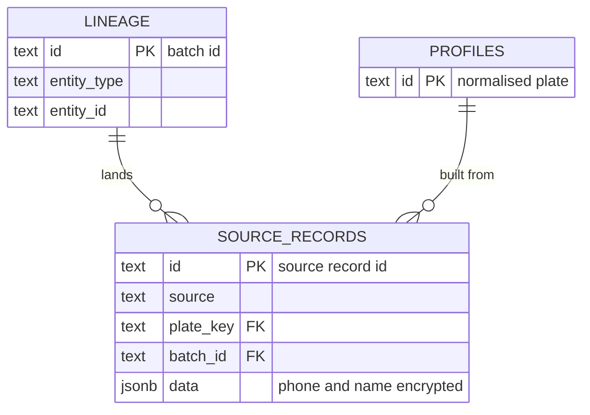

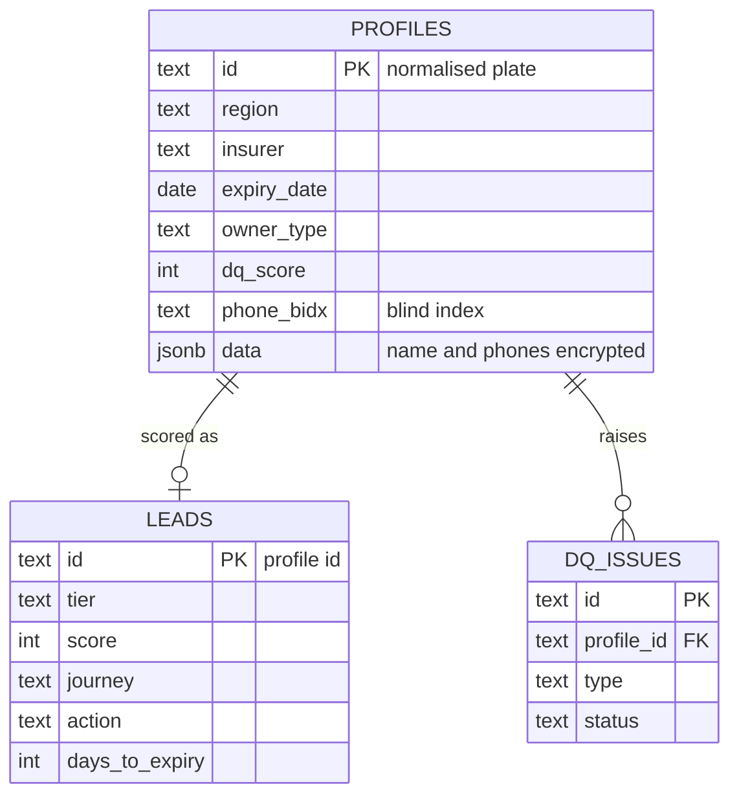

## Engagement

Touchpoints are planned from a lead's journey and executed as messages or calls. A call that ends with a request to speak to a person creates one handoff, which a telesales user can be assigned.

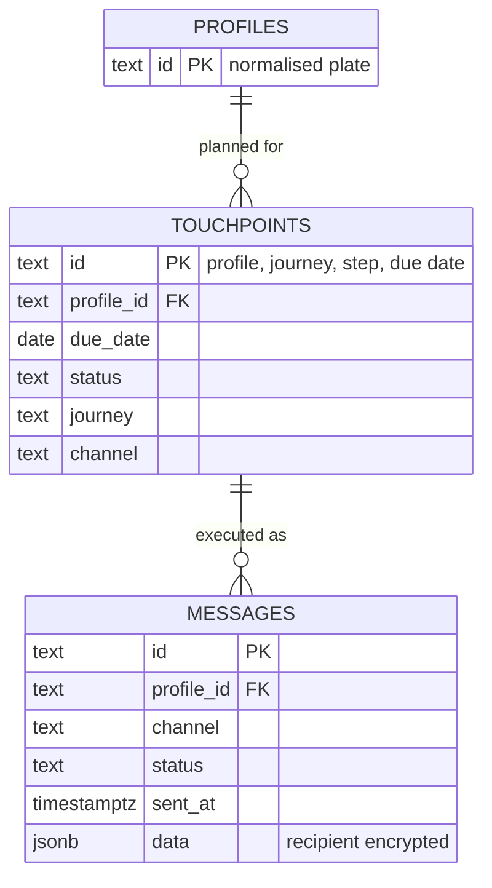

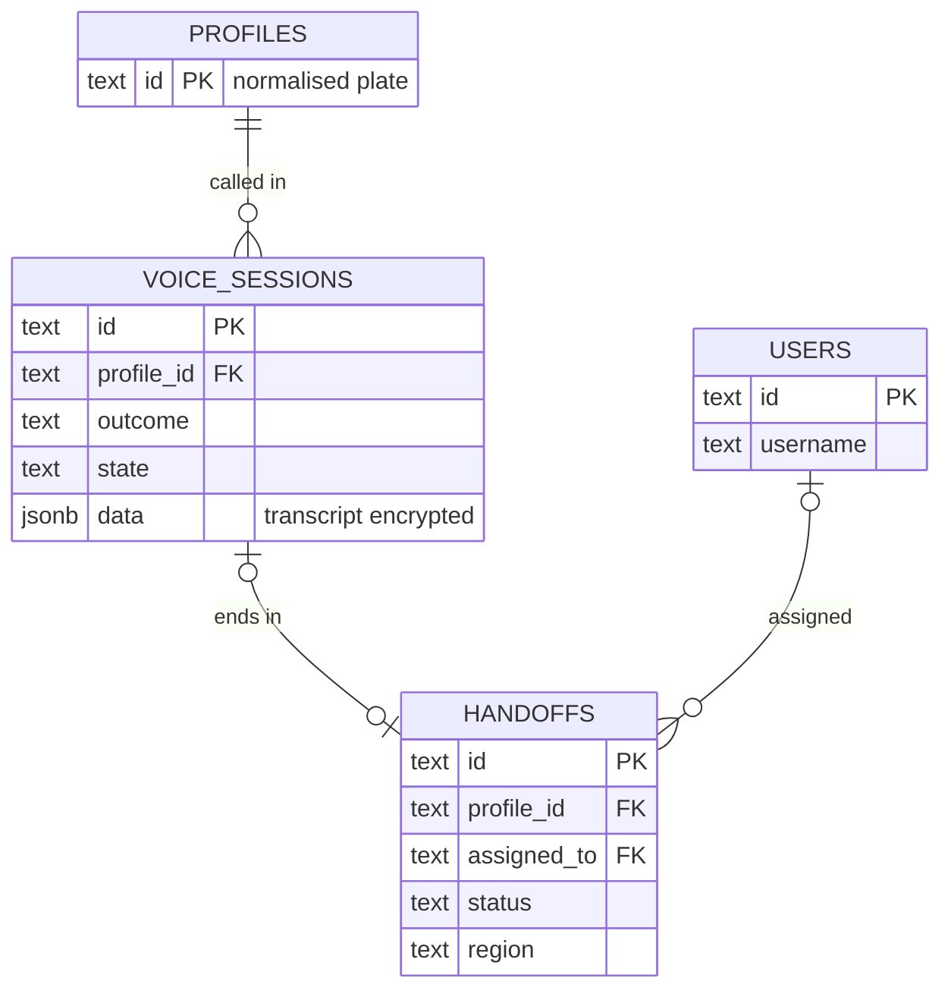

## Commerce and partners

A quote becomes at most one order, and a completed order holds one policy per quote line. Claims attach to policies. Partner quotes, orders and policies carry the partner id.

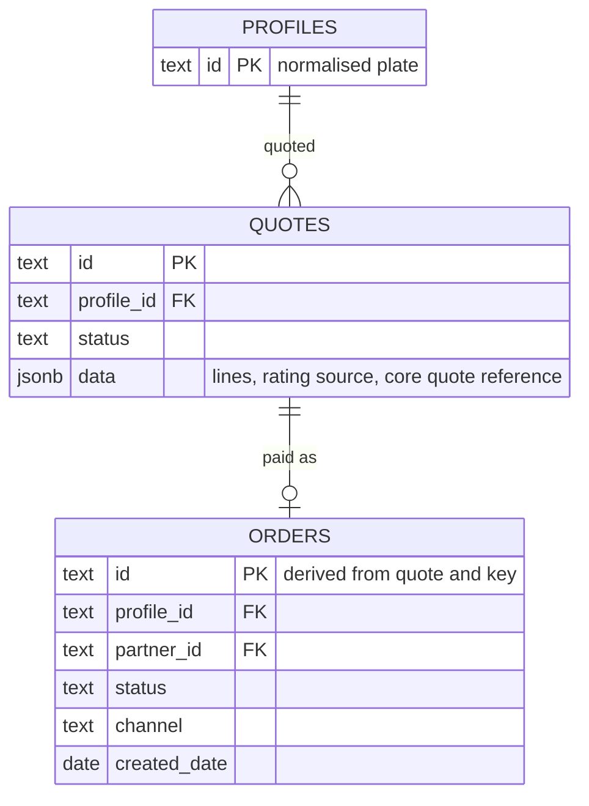

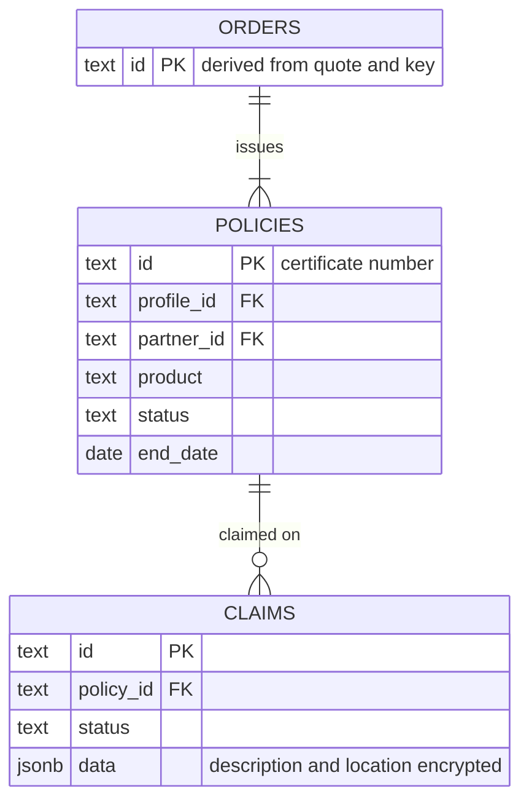

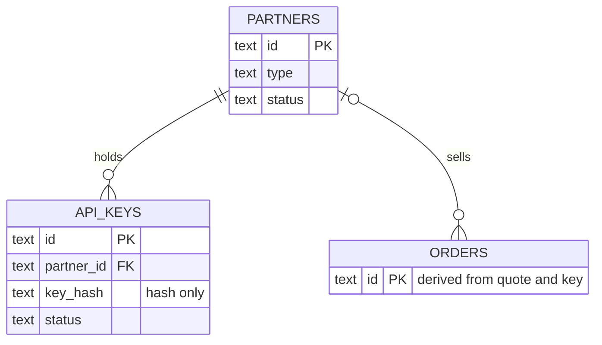

## Governance

Staff users author and approve rule set versions and appear as actors in the audit trail. Domain events and job runs stand alone.

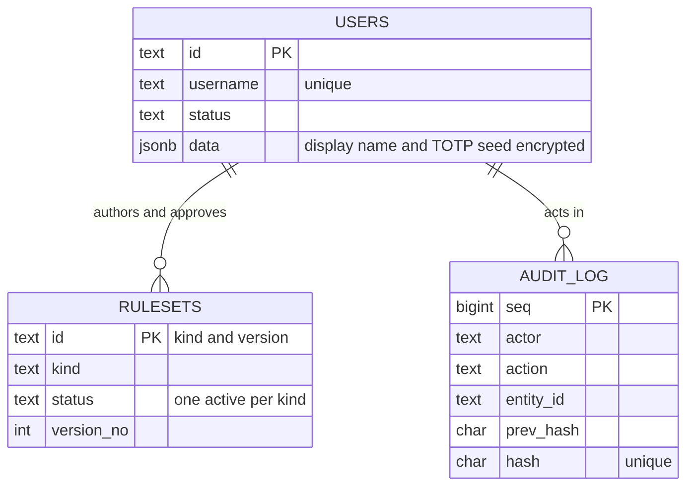

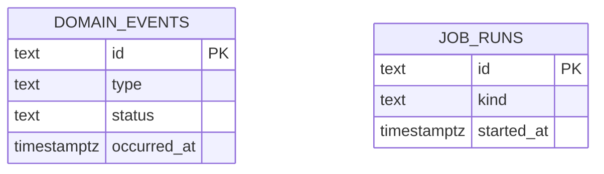

# Data classification

| Class | Examples | Controls |
|---|---|---|
| Restricted, personal | Customer name and phone, call transcript, claim description and location, staff authenticator seed | Field encryption (AES-256-GCM); masked unless the user may see personal data; redacted in logs; included in DSAR export and erasure |
| Confidential, linked to a person | Licence plate, policy expiry and insurer, engagement metrics, wallet balance, consent flags, IP addresses in the audit trail | Stored in clear for matching and filtering; role and attribute-based access; pseudonymised in analytics. Whether the plate is personal data is to be confirmed by TASCO legal and the DPO. |
| Confidential, business | Quotes, orders, commission, tariffs and scoring rules, partner data | Role-based access; audited |
| Internal | Metrics, job runs, data quality counts | Staff access |
| Public | Certificate validity with a masked plate | Rate-limited; no personal data |

# Data dictionary

## Profiles (golden record)

One profile per vehicle. "Indexed" fields are extracted columns that can be filtered; all others live in the document.

| Field | Column | Indexed | Personal | Encrypted | Description |
|---|---|---|---|---|---|
| Id | `id` | Key | Linked | No | Normalised plate, for example `30A12345` |
| Plate | Document | No | Linked | No | Display plate, for example `30A-123.45` |
| Province | `region` | Yes | No | No | Province from the plate prefix |
| Name | Document | No | Yes | Yes | Survivor name from the most trusted source |
| Phone | Document and `phone_bidx` | Blind index | Yes | Yes | Survivor mobile number; blind index for exact search |
| Other phones | Document | No | Yes | Yes | Other valid numbers; more than one raises a data quality issue |
| Owner type | `owner_type` | Yes | No | No | Individual or company; company vehicles are routed to B2B |
| Vehicle | Document | No | No | No | Toll class, seats, usage, category with confidence and basis, first registration year |
| Policy expiry | `expiry_date` | Yes | Linked | No | Best expiry estimate with method, confidence and candidates |
| Insurer | `insurer` | Yes | No | No | TASCO, another named insurer, other, or unknown |
| Competitor note | Document | No | Yes | No | Customer's words about another insurer from a call; cleared on erasure |
| Engagement | Document | No | Linked | No | App sessions, toll trips, long trips, wallet balance, auto top-up, prior purchase, complaints |
| Channels | Document | No | No | No | Reachability by push, Zalo, SMS, voice and telesales |
| Consent | Document | No | Yes | No | Marketing, call and do-not-contact flags, with platform overrides that survive rebuilds |
| Data quality score | `dq_score` | Yes | No | No | 0 to 100, with the list of missing facets |
| Lineage | Document | No | No | No | Field, source, confidence, rule and time for each derived value |
| Anonymised | Document | No | No | No | Erasure marker; a rebuild never re-identifies an anonymised profile |

## Other collections

| Collection | Indexed columns | Encrypted fields | Notes |
|---|---|---|---|
| `source_records` | Source, plate key, batch id | Raw phone, full name | Upserted by record id. Synthetic test data carries a hidden ground-truth block that must never appear in production feeds and is stripped from DSAR export. |
| `leads` | Tier, score, journey, action, days to expiry, region | None | One per profile. Stores factor reasons, the next-best action with its rule id, benefits and the TNDS premium. Tiers: hot from 70, warm from 45. |
| `touchpoints` | Profile, due date, status, journey, channel | None | Deterministic id makes planning idempotent. A step blocked only by the contact window stays scheduled. |
| `messages` | Profile, channel, status, sent at | Recipient | Status sent, failed or blocked; contact history for frequency caps. Text holds the plate and a renewal link. |
| `voice_sessions` | Profile, outcome, state | Transcript | Free-text signals (competitor information, expiry statement) are stored in clear and cleared on erasure. Retained 180 days. |
| `handoffs` | Status, assigned user, region, profile | Name | Minimal data for telesales: masked phone, confirmed plate, expiry, premium, talking points. |
| `quotes` | Profile, status | None | Lines with premium and VAT, rating source, rating version, core quote reference, indicative flag, inspection result, expiry. Status open, paying, converted. |
| `orders` | Profile, status, channel, partner, journey, created date | None | Payment reference, policies, commission lines, refund and cancellation results, core quote reference. |
| `policies` | Profile, product, status, end date, partner | None | Keyed by certificate number. Financial and legal record, archived for 10 years. |
| `claims` | Profile, status, policy | Description, location | First notice of loss with acknowledgement deadline. Adjudication happens in TASCO's claims system. |
| `partners` | Type, status | None | Bank, showroom, agent, fleet or inspection centre |
| `api_keys` | Partner, key hash (unique), status | None (hash only) | Plain key returned once at issue; scopes stored with the key |
| `users` | Username (unique), status | Display name, authenticator seed | Password hash, lockout counters, last accepted code step, token revocation time, forced password change flag |
| `rulesets` | Kind, status, version number | None | Payload, checksum, author, approver, comments, activation and retirement. One active version per kind, enforced by a unique index. |
| `domain_events` | Type, status, occurred at | None | Outbox; payloads carry profile ids only |
| `dq_issues` | Profile, type, status | None | Raised by ingestion, profile build and calls; resolved by stewards |
| `lineage` | Entity id, entity type | None | Batch lineage: source, record count, rejected count, time |
| `job_runs` | Kind, started at | None | Job history and results, including catalogue sync outcomes |
| `audit_log` | Sequence, actor, action, entity | None | Details hold ids, reasons and IP addresses, never names or phones |

# Golden record

## Building the profile

Every ingestion batch rebuilds the profiles of the plates it touched. The diagram shows the steps.

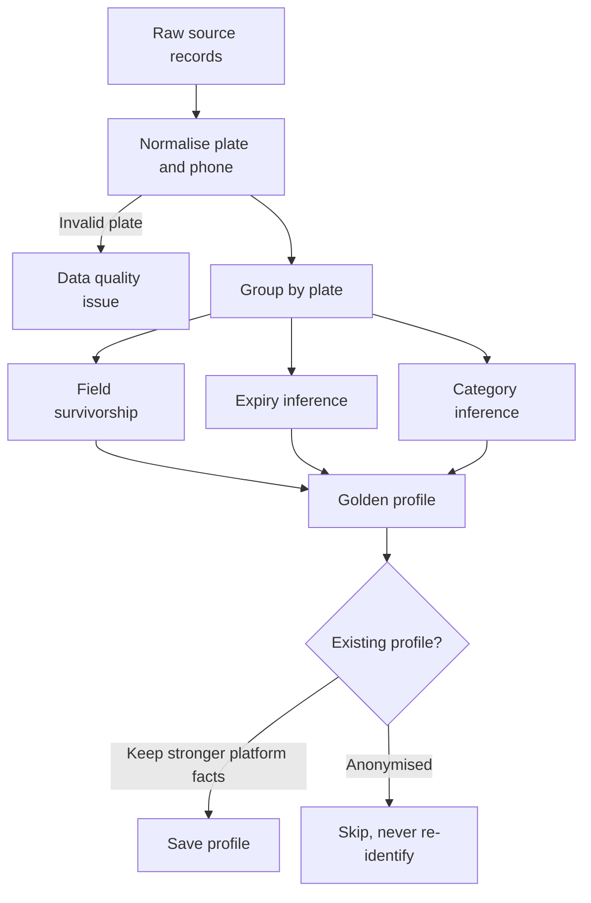

The match key is the normalised plate: two digits, one or two letters and four or five digits with a valid province code. The normaliser accepts common forms such as `30a-123.45`, `30A 12345` and `30A.123.45`, and the legacy four-digit form. Matching is exact on the key, with no fuzzy matching, because a plate is a legal identifier. Wrong-person and plate-mismatch outcomes from calls are fed back as data quality issues.

## Survivorship

The most trusted non-empty value wins for each field. Source trust is set in the enrichment rule set.

| Source | Trust |
|---|---|
| TASCO core | 1.00 |
| VETC app purchase | 0.95 |
| VETC account | 0.85 |
| Customer declared | 0.75 |
| Partner inspection centre | 0.65 |
| Partner bank, showroom or fleet | 0.60 |
| Partner agent | 0.50 |
| Telesales list and unknown sources | 0.40 |

Ownership type, tag activation, engagement, channels and consent come from the VETC account record, which is the system of record for the account. The vehicle category comes from a decision table over seats, toll class and commercial use, with a confidence and a basis.

## Expiry inference

The expiry date is the most important fact on the profile, because it decides when to contact a customer. It is inferred from the best available evidence.

| Evidence | Confidence |
|---|---|
| Verified certificate | 1.0 |
| Customer declared | 0.75 |
| Partner policy record | Up to 0.7, scaled by partner trust |
| Inspection cycle (last inspection plus one year) | 0.5 |
| Tag activation anniversary | 0.25 |

Each different method that agrees within 21 days adds 0.15, up to 0.95. An expiry is usable for journeys from a confidence of 0.5. Facts captured on the platform carry confidences governed in the service levels rule set: customer 0.75, data steward 0.9, voice assistant (renewed elsewhere) 0.6. A TASCO-issued policy sets confidence 1.0. On rebuild, a platform-captured expiry with higher confidence is kept, so a steward's correction survives the next feed.

# Data quality

Each profile has a score from 0 to 100: half for completeness of phone, name, reliable expiry, vehicle category and current insurer, 35% for expiry confidence and 15% for category confidence. The weights are part of the enrichment rule set.

| Dimension | Measure | Issue types | Raised by |
|---|---|---|---|
| Validity | Plate and phone format, province | Invalid plate | Ingestion |
| Completeness | Mandatory facets present | Missing phone, name or insurer | Profile build |
| Reliability | Expiry confidence at least 0.5, category confidence at least 0.6 | Unreliable expiry, uncertain category | Profile build |
| Consistency | One phone per vehicle | Conflicting phone | Profile build |
| Accuracy | Customer contradicts the data on a call | Wrong person, plate mismatch, unverified renewal claim | Voice service |
| Uniqueness | Duplicates merged per plate | Count of merged duplicates | Profile build |
| Timeliness | Freshness of the source feed | Stale source (planned) | Feed monitoring |

Data stewards work open issues in the staff console and resolve them or correct the expiry with evidence; every correction is audited. Customers correct their own expiry in the app, and calls correct data too. A resolved issue reopens if the next rebuild detects it again. The dashboard shows open issues by type and the number of profiles with usable data.

# Lineage, metadata and reconciliation

Lineage is recorded at four levels, so any value or decision can be traced back to its source.

| Level | Where it is held | How it is viewed |
|---|---|---|
| Batch | Lineage collection; batch id on each source record | Customer lineage view |
| Record to profile | Record ids and sources on the profile | Customer lineage view |
| Field | Lineage entries on the profile: field, source, confidence, rule, time | Customer lineage view |
| Decision | Lead factor reasons and next-action rule id; quote rate rules; order commission rule ids; quote rating source and core quote reference | Customer 360 and lead list |

Technical metadata is machine-readable in the collection registry (collections, indexed columns, encrypted and blind-index fields) and can be exported to a data catalogue with the classification above. Each rule set version carries its kind, description, checksum, author, approver and activation time; the rule descriptions seed the business glossary.

| Reconciliation check | Status |
|---|---|
| Ingestion: records in equal records landed plus rejected; profiles equal distinct valid plates | Built, per batch |
| Orders: completed orders have a payment reference and every policy exists; stuck, failed and uncompensated orders flagged | Built, nightly |
| Event backlog and dead letters | Built, operations status view |
| Audit chain integrity | Built, on demand and hourly probe |
| Wallet settlement against orders; TASCO core policy register against policies; partner commission against finance | Planned |

# Retention, erasure and backup

## Retention

Retention is a rule set under maker-checker, approved only by a compliance officer. The periods below are the current defaults, to be confirmed by TASCO legal.

| Entity | Retain | Action | Executed by |
|---|---|---|---|
| Source records | 365 days | Delete | Nightly retention job |
| Voice sessions | 180 days | Delete recordings and transcripts | Nightly retention job |
| Profiles | 5 years without an active policy or activity | Anonymise | Archival pipeline (planned) |
| Messages | 365 days | Archive | Archival pipeline (planned) |
| Orders | 10 years | Archive (financial records) | Archival pipeline (planned) |
| Policies and certificates | 10 years | Archive | Archival pipeline (planned) |
| Audit trail | 10 years | Archive, never deleted early | Archival pipeline (planned) |

## Erasure and export

A data subject can request export or erasure through a compliance officer, and a customer can download their own data in the app. Erasure is refused while an active policy exists, because the policy must be retained by law. Otherwise erasure:

- removes the profile's name, phones and competitor note, marks it anonymised and sets do-not-contact with no consent;
- deletes the lead;
- removes personal data from the source records;
- removes message recipients and text;
- empties call transcripts and free-text call signals;
- clears handoff names, masked phones and notes;
- replaces claim descriptions and locations;
- ends the customer's sessions and invalidates renewal links;
- writes an audit entry.

Export includes the profile, lead, policies, messages, source records, call sessions, quotes, orders, claims and telesales handoffs. VETC must also be told of an erasure through a suppression list, or the next feed lands the contact data again; the profile itself stays anonymised because a rebuild skips anonymised profiles. Claim records follow claims retention, to be confirmed by TASCO legal.

## Backup

Production uses managed point-in-time recovery for 35 days, monthly snapshots kept for 12 months and yearly snapshots kept for 10 years, encrypted with the key management service and stored in Vietnam with a cross-region copy (TGP-OPS-03 Disaster Recovery and Business Continuity Plan). Personal fields stay encrypted inside backups, so data keys are retained for as long as any backup needs them. A restored backup re-applies erasures recorded in the audit trail before it is used.

# Data migration

## Schema migrations

Schema changes are numbered SQL files applied in order, each in its own transaction, under a database advisory lock so that two runners cannot race. An applied file is never edited. In Kubernetes a single migration job runs before each release; replicas do not migrate on start. Changes inside the document need no migration: readers tolerate missing fields, additive changes are preferred, and breaking changes use a backfill job with keyset paging. Releases follow expand and contract, so old and new code can run side by side.

## Initial data load

| Source | Approach | Trust |
|---|---|---|
| VETC account base (about 6 million) | Bulk file load to staging, then parallel rebuild (TGP-ARC-02 Integration Architecture) | 0.85 |
| TASCO core in-force and expired TNDS policies | Policy register as source TASCO core with verified certificates, so renewal journeys are accurate from day one | 1.0 |
| VETC app past insurance purchases | Source VETC app purchase | 0.95 |
| Partner and telesales lists | Only with a documented lawful basis, to be confirmed by TASCO legal | 0.4 to 0.65 |
| Consent and do-not-contact registers | Loaded before any journey is enabled; platform overrides take precedence | Not applicable |

The migration runs in eight steps: profile the source data, agree the mapping with data owners, run trial loads in SIT with masked data, reconcile counts and samples with the business, rehearse in the performance environment, load production in a freeze window, run the post-load data quality report, and enable journeys region by region.

# Analytics and data warehouse feed

Reporting and model development use a pseudonymised copy of the data, never the operational tables. The diagram shows the path.

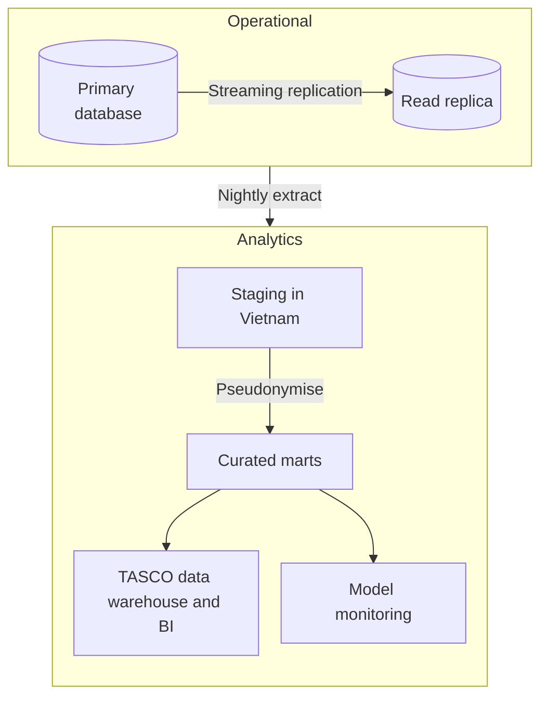

No decrypted personal data leaves the platform for analytics. The plate is replaced by a keyed pseudonym that uses its own key (never the blind-index key), names and phones are dropped, and wallet balances are banded. Join keys are stable pseudonyms. Reports shared outside the data office suppress cells with fewer than 10 records. Event-level facts (messages, touchpoints, call outcomes, orders) support attribution from journey to order. The in-product dashboards cover operational figures; heavier analysis belongs in the marts.

# Appendix

## Known data gaps and planned treatment

| Gap | Effect | Treatment | Phase |
|---|---|---|---|
| Leads and quotes do not record the rule set versions that produced them | A past decision cannot be replayed exactly | Store a rules snapshot (kind, version, checksum) on leads, quotes and orders | Before go-live |
| No legal hold flag | A held record could be deleted by retention | Add a legal hold flag to profiles, claims and orders; retention skips held records | Before go-live |
| Events, touchpoints, data quality issues and job runs have no retention rule | Unbounded table growth | Add rules: 30 days for completed events, 90 days for executed touchpoints, 365 days for resolved issues and job runs | Scale phase |
| Source record age counts from first landing | A record refreshed daily is still deleted after 365 days | Base retention on last update, or keep the latest version per source | Before go-live |
| Free-text call signals stored in clear | Personal data outside field encryption | Encrypt the signals or keep structured values only | Before go-live |
| Archival pipeline not built | Archive actions are recorded but not executed | Build the archival pipeline to write-once storage in Vietnam | Scale phase |
