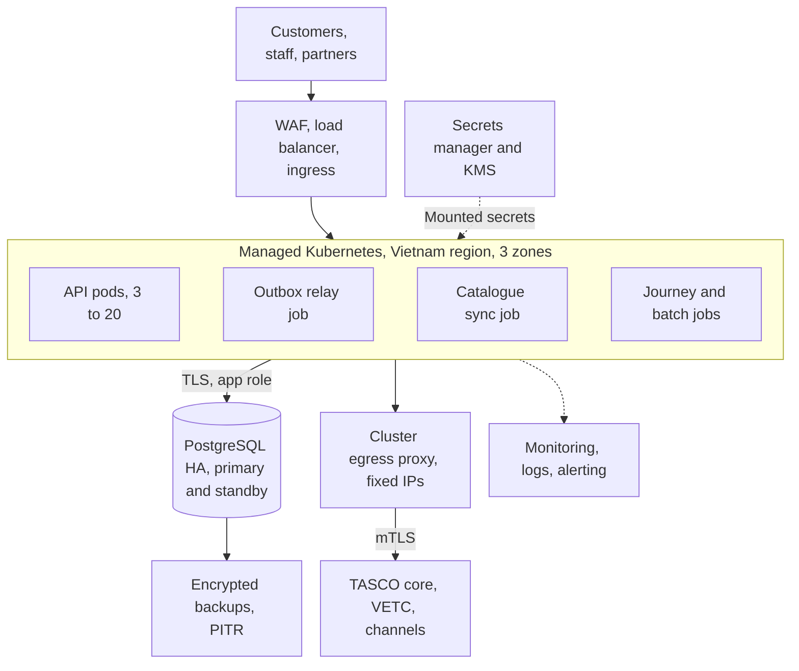
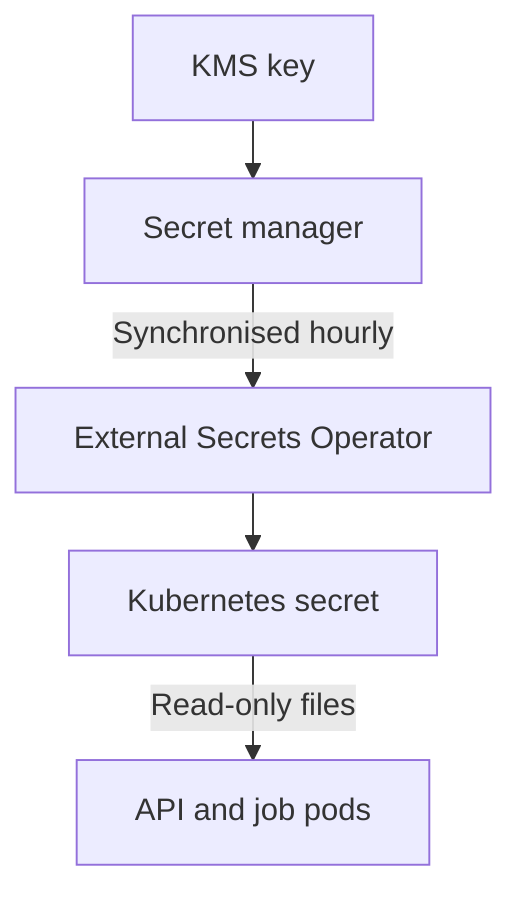
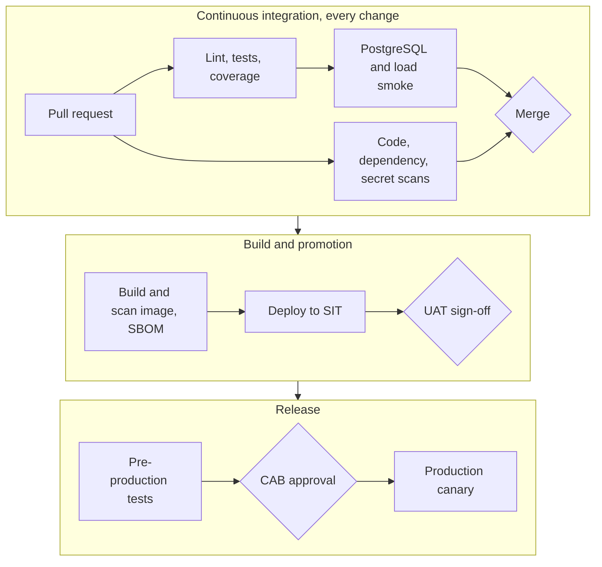

# Introduction

## Purpose

This document describes how the TASCO Growth Platform is built, deployed and run: the environments, the production topology in Vietnam, the Kubernetes workloads and scheduled jobs, network and ingress controls, PostgreSQL high availability, configuration and secrets, the delivery pipeline, release strategies, capacity, resilience and observability.

## Scope

The deployment assets in the repository (`Dockerfile`, `docker-compose.yml`, `deploy/k8s/`, `railway.json` and `.github/workflows/ci.yml`) and the production design they implement. Where a value in this document differs from a manifest, the manifest is what is deployed and a change is raised to bring the two back in line.

## Audience

TASCO IT infrastructure and operations, information security, the platform and site reliability engineers of iorta TechNXT, and TASCO finance for the sizing sections.

## Related documents

| ID | Title | Relationship |
|---|---|---|
| TGP-ARC-01 | Solution Architecture | Runtime processes and quality targets |
| TGP-ARC-04 | Security Architecture | Trust boundaries, secrets and pipeline controls |
| TGP-ARC-07 | Architecture Decision Records | ADR-012 containers and Kubernetes |
| TGP-OPS-01 | Runbook and Support Guide | Day-to-day operation |
| TGP-OPS-02 | Monitoring and Alerting | Dashboards and alert rules |
| TGP-OPS-03 | Disaster Recovery and Business Continuity Plan | Recovery tiers, failover and drills |
| TGP-OPS-06 | Release and Change Management | Release process and change control |
| TGP-QA-03 | Performance and Capacity Test Plan | Capacity validation |

# Deployment principles

| Principle | Application |
|---|---|
| One immutable artefact | The same image, pinned by digest, is promoted from SIT to production and DR. Only configuration differs. The hosted UAT builds the same Dockerfile from the same commit. |
| Twelve-factor processes | Configuration from the environment and secrets from mounted files; JSON logs on standard output; stateless processes with state in PostgreSQL; API and jobs share one image with different commands. |
| Least privilege | Containers run as the image's non-root `node` user (uid 1000) with a read-only root file system, all Linux capabilities dropped and the default seccomp profile. Network policy denies by default. The database has separate owner and application roles. |
| Fail safe | Production refuses to start without its secrets or a database, or with demo mode on. Readiness stays false until the database answers. On shutdown the pod drops readiness first, drains and exits within 25 seconds. |
| Data residency | Production personal data is stored and processed in Vietnam (to be confirmed by TASCO legal under the Cybersecurity Law 2018, Decree 53/2022/ND-CP, Decree 13/2023/ND-CP and the Law on Personal Data Protection 2025). |

# Hosting in Vietnam

Production is hosted in Vietnam on a managed Kubernetes service and a managed PostgreSQL service from a local cloud provider (for example Viettel IDC, VNG Cloud or FPT Cloud), or on TASCO's or the Tasco group's private cloud if preferred. The choice is confirmed in discovery against TASCO's data-residency position and existing contracts. The platform is containerised and uses standard Kubernetes and PostgreSQL features, so it is not tied to a provider. If no managed PostgreSQL option meets residency, PostgreSQL runs on Kubernetes with an operator such as CloudNativePG, or on virtual machines with Patroni.

# Environments

| Environment | Purpose | Hosting | Data | Integrations | Promotion gate |
|---|---|---|---|---|---|
| Development | Daily engineering | Laptop: Docker Compose, or in-memory store | Synthetic | Sandbox adapters | None |
| CI | Automated tests on every change | GitHub Actions with a PostgreSQL service container | Synthetic | Sandbox | All checks pass |
| UAT (live) | Business acceptance and training | Railway with Railway PostgreSQL | Synthetic only | Sandbox adapters, simulated TASCO core | Product owner approval |
| SIT | Integration with TASCO and VETC test systems | Kubernetes namespace in the production provider | Synthetic plus provider test accounts | Real adapters to provider sandboxes | Automatic on merge |
| Pre-production | Performance, soak, resilience and security tests; release rehearsal | Namespace sized like production | Masked or synthetic at 6 million scale | Sandbox with fault injection, or provider test systems | Performance report signed off |
| Production | Live service | Managed Kubernetes in Vietnam, three zones | Real, encrypted | Production providers | CAB approval and change window |
| DR | Warm standby | Second Vietnamese region or data centre | Replica of production | Production providers | DR drill twice a year |

The hosted UAT runs at `https://tasco-growth-api-uat.up.railway.app` with demo mode on, which enables demonstration sign-in helpers, simulated dates and the seed job. Its password is distributed in the access workbook and never written in documents. SIT, pre-production, production and DR run in production mode with demo mode off; the Kubernetes configuration sets both, and production refuses to start otherwise.

# Production topology

The diagram shows the production deployment in one Vietnamese region. Customers, staff and partners reach the platform through the WAF; the API pods and the scheduled jobs share one PostgreSQL cluster; all outbound calls leave through the egress proxy.

The outbox relay runs in two places: every API pod relays pending events once a second, and the relay job drains anything left every five minutes as a safety net. A read replica for reporting and a cross-region replica for DR are described in section 7 and section 14.

## API deployment

| Item | Setting |
|---|---|
| Image | `tasco-growth-platform`, pinned by digest |
| Command | `node src/server.js` |
| Replicas | 3, spread across zones; autoscaler from 3 to 20 on CPU (65%) and memory (75%); scale-down stabilisation 300 s |
| Resources | Request 250m CPU and 256 MiB; limit 1 CPU and 512 MiB; Node heap 384 MiB |
| Probes | Liveness `/health/live` every 10 s; readiness `/health/ready` every 5 s with a database check; start-up allowance 60 s |
| Security context | Non-root uid 1000, read-only root file system, no privilege escalation, all capabilities dropped, default seccomp, no service account token |
| Writable paths | `/tmp` only (64 MiB) |
| Disruption | Pod disruption budget of at least 2 available; rolling updates with no unavailable pod |
| Termination | 30 s grace period; the application forces exit at 25 s |

The image has no init process; the server handles termination signals itself.

## Scheduled jobs

All jobs run the same image with `node src/jobs/cli.js <job>`, never overlap (`concurrencyPolicy: Forbid`) and retry once. Schedules are set in UTC; the table shows Vietnam time.

| Job | Vietnam time | What it does |
|---|---|---|
| `journeys` | 08:15 daily | Runs all due touchpoints inside the 08:00 to 20:00 contact window; steps blocked only by the window stay scheduled |
| `recompute` | 00:30 daily | Re-scores all leads so time-dependent facts move on |
| `sync-catalogue` | 01:00 daily | Fetches TASCO core's product catalogue and proposes changes for maker-checker approval; never activates them |
| `reconcile` | 02:00 daily | Flags completed orders without payment reference or policy, stuck payments, failed payments and failed compensations |
| `retention` | 03:00 daily | Deletes source records after 365 days and call sessions after 180 days; other entities go to the archival pipeline |
| `relay` | Every 5 minutes | Drains the event outbox as a safety net for the in-pod relay |
| `migrate` | Before each release | Applies database migrations under an advisory lock |

Job outcomes are recorded in the job history (visible in the staff console) and in the logs. Failed jobs raise an alert from the Kubernetes job metrics. Journey runs can be added hourly within the contact window if volumes require it.

# Network and edge

## Network controls

Network zones and trust boundaries are described in TGP-ARC-04 Security Architecture. The table lists how they are enforced in the cluster.

| Control | Implementation |
|---|---|
| Default deny | Network policy with no ingress or egress in the application namespace, then allow-lists: ingress from the ingress controller and monitoring to port 8080; egress to the PostgreSQL subnet on 5432, DNS and the egress proxy on 3128 |
| Workload identity | Separate service accounts for the API, each job and migrations, with no token mounted; the migrator owns the schema and the application role has data rights only |
| Encrypted connections | TLS to PostgreSQL with certificate verification; mTLS to providers through the egress proxy |
| Administrative access | No SSH to nodes; cluster access through SSO with MFA and just-in-time roles; database break-glass through a bastion with session recording |
| Service mesh | Optional, for pod-to-pod mTLS if more services are added |

## Ingress and WAF

| Control | Setting |
|---|---|
| TLS | TLS 1.2 or higher (1.3 preferred) with modern ciphers; certificates from cert-manager; HSTS also set by the application |
| Client address | The application takes the client IP from the right-most trusted forwarded hop (`TRUST_PROXY_HOPS`, one hop by default, two with a CDN in front) |
| Rate limiting | 50 requests per second per client IP at the ingress, shared across pods; stricter limits for sign-in and customer session at the gateway; per-partner quotas at the gateway. The in-process limiter (300 per minute, 10 sign-ins per minute per IP) is a per-pod second line. |
| Body size | 1 MiB |
| Path rules | Metrics blocked from outside the cluster; the API description and staff APIs can be restricted to TASCO and VETC corporate addresses |
| WAF | ModSecurity with the OWASP core rule set, paranoia level 2 on the API, tuned for rule payloads; bot management on customer and public endpoints |
| Partner mTLS | Target: a separate partner host with client certificate verification |

# PostgreSQL

| Aspect | Design |
|---|---|
| Service | Managed PostgreSQL 16 in a Vietnamese region |
| High availability | Primary with a synchronous standby in another zone; automatic failover in about 30 to 60 seconds. The connection pool reconnects; failed requests return 5xx and idempotent retries are safe. |
| Backups | Continuous WAL archiving and daily base backups, encrypted with the KMS; point-in-time recovery for 35 days; monthly snapshots kept 12 months; restore tested quarterly |
| Read replica | Asynchronous replica for dashboards, BI extracts and analytics feeds |
| DR | Cross-region asynchronous replica, promoted in a declared disaster |
| Connections | Pool of 10 per process; with 20 API pods and the jobs that is about 260 connections, so a transaction-mode connection pooler sits in front |
| Parameters | Statement timeout 15 s (set by the application); idle-in-transaction timeout 60 s; slow-query log from 500 ms; query statistics enabled |
| Roles | Owner role for migrations, tables and triggers; application role with data rights and insert and select only on the audit log, no truncate or schema rights; read-only role for the replica |
| Encryption | Storage encryption with the KMS; TLS enforced; personal fields additionally encrypted by the application |
| Partitioning | Messages, touchpoints and domain events partitioned by month at scale, through a new numbered migration |

# Configuration

All settings are read by `src/shared/config.js`. Non-secret values sit in a configuration map; secrets are mounted files referenced by `<NAME>_FILE`.

| Setting | Default | Production |
|---|---|---|
| `NODE_ENV` | `development` | `production` |
| `PORT` | 3000 | 8080 |
| `PUBLIC_BASE_URL` | Local address | The platform's public address, used in links and certificate URLs |
| `DATABASE_URL` (file) | In-memory store outside production | Required |
| `DATABASE_SSL`, `DB_POOL_MAX` | On in production, 10 | `true`, 10 |
| `JWT_SECRET` (file) | Random in development | Required, at least 48 random bytes |
| `JWT_TTL_SECONDS` | 1,800 | 1,800 |
| `MFA_REQUIRED_ROLES` | Administrator, rule approver, compliance officer, data steward | Add telesales supervisor, partner manager, support engineer (recommended) |
| `DATA_KEYS`, `DATA_KEY_ACTIVE` (file) | Random development key | Required; explicit active key |
| `BLIND_INDEX_KEY` (file) | Random in development | Required, 32 bytes |
| `RATING_SOURCE` | `rules` | `core` or `core_with_fallback`, as TASCO decides |
| `TASCO_CORE_BASE_URL` | Empty (simulated core) | TASCO core API gateway, HTTPS |
| `TASCO_CORE_CLIENT_ID`, `TASCO_CORE_CLIENT_SECRET` (file) | Empty | Required when the core address is set |
| `TASCO_CORE_TOKEN_URL`, `TASCO_CORE_SCOPE` | Core address plus `/oauth2/token`; rating and product scopes | As agreed with TASCO core |
| `TASCO_CORE_TIMEOUT_MS` | 5,000 | 5,000 |
| `ALLOW_LOCAL_RATING` | `false` | `false` |
| `CORS_ORIGINS` | Same origin only | VETC and Zalo origins only if they call cross-origin |
| `RATE_LIMIT_MAX`, `RATE_LIMIT_LOGIN_MAX` | 300, 10 per minute | Keep; the edge enforces global limits |
| `LOCKOUT_MAX_FAILURES`, `LOCKOUT_MINUTES` | 5, 15 | Keep |
| `TRUST_PROXY`, `TRUST_PROXY_HOPS` | On in production, 1 | `true`, number of proxies in front |
| `METRICS_TOKEN` (file) | Unset | Required |
| `LINK_TTL_DAYS` | 30 | 30 |
| `MIGRATE_ON_START` | Runs unless `false` | `false`; the migration job runs instead |
| `DEMO_MODE` and UAT demo settings | Off, unset | Off and unset |

# Secrets management

Secrets are created in the secret store, synchronised into the cluster and mounted into pods as read-only files. The diagram shows the path.

| Secret | Rotation | Procedure |
|---|---|---|
| Data keys | Yearly or on suspicion | Add a new key, make it active, restart, run the re-key job (planned), remove the old key after verification |
| Token secret | Every 90 days | Rotation ends all sessions and unexpired renewal links; schedule out of hours until multi-key verification or identity provider tokens are in place |
| Blind-index key | Only on compromise | Recompute the phone index (planned job) |
| Database credentials | 30 to 90 days | Dynamic credentials from the secret manager where possible |
| TASCO core and provider credentials | Per provider policy | Mounted files, read at start-up; restart to rotate |
| Partner API keys | At most 12 months | Issue a new key, partner switches, revoke the old key |

No secret is placed in images, Git, configuration maps or environment literals in Kubernetes. Secret scanning runs on every change.

# Delivery pipeline

Every change passes the same pipeline before it can reach production. The diagram shows the stages; TGP-ARC-04 Security Architecture lists the security gates and TGP-OPS-06 Release and Change Management the approvals.

| Stage | Gate |
|---|---|
| Lint, tests, coverage | Any failure; coverage below 80% lines, 70% branches or 80% functions; OpenAPI drift |
| PostgreSQL and load smoke | Any failure; 95th percentile budget exceeded |
| Code, dependency and secret scans | New high or critical static analysis finding; high or above dependency finding; any secret |
| Image | Fixable high or critical vulnerability; image running as root; missing SBOM; high dynamic scan alert |
| SIT | Health, sign-in with MFA, and quote, send and customer payment with provider test accounts |
| Production | Signed image digest only (admission policy, target); CAB ticket reference |

Promotion is GitOps: the pipeline records the new image digest in the environment's configuration and the cluster reconciles itself. The pipeline never applies changes to production directly.

# Release strategies

| Strategy | When | How |
|---|---|---|
| Rolling (default) | Backward-compatible code and configuration | One extra pod at a time, none unavailable, readiness-gated |
| Canary | Behaviour changes to journeys or purchase | Traffic split 5%, 25%, 100%, with automated checks on error rate, latency, integration errors and completed orders |
| Blue-green | Database-affecting or major releases | Two deployments; switch after smoke tests. Database changes follow expand and contract. |

Three points are specific to this platform. The outbox relay runs in every pod, including canary pods, so event handler changes must stay backward compatible or use a new event type. Scheduled jobs are updated in the same release, after the API rollout succeeds. Rule changes are data, not deployments: they go through maker-checker, not the release process, and reach every pod within 15 seconds.

# UAT and local environments

The live UAT runs on Railway from the same Dockerfile: start command `node src/server.js`, migrations as a pre-deploy command, health check on `/health/ready`, restart on failure, two replicas, Railway PostgreSQL. Secrets are Railway variables, because Railway does not mount files. Railway has no network policy and is hosted outside Vietnam, so it holds synthetic data only and is not used for production personal data (to be confirmed by TASCO legal).

Locally, Docker Compose runs the application and PostgreSQL 16 with demo data and local-only secrets. Without Compose, the application runs on the in-memory store and needs no database.

# Capacity and sizing

## Assumptions

These assumptions are validated in pre-production (TGP-QA-03 Performance and Capacity Test Plan).

| ID | Assumption |
|---|---|
| A1 | 6.0 million vehicles and about 7.8 million source records |
| A2 | Expiries spread evenly: about 16,400 vehicles reach expiry each day |
| A3 | About 30% of vehicles in an active journey; about 5 sends per expiring vehicle |
| A4 | Voice assistant used for about 20% of expiring vehicles: about 3,300 calls a day |
| A5 | About 15% of expiring vehicles buy through the platform: about 2,500 orders a day |
| A6 | About 300 staff users, mostly telesales; customer traffic peaks after push waves |

## Storage, year one

| Data | Rows | Size |
|---|---|---|
| Profiles and leads | 6 million each | About 40 GB with indexes |
| Source records | 7.8 million | About 11 GB with indexes |
| Touchpoints | About 7 million live, 42 million executed a year | About 30 GB a year before purging |
| Messages | About 30 million a year | About 24 GB a year |
| Call sessions | About 1.2 million a year, 180-day retention | About 2.5 GB steady |
| Quotes, orders, policies | About 2.7, 0.9 and 1.1 million a year | About 10 GB a year |
| Audit trail | About 18 million entries a year | About 7 GB a year |
| Total | | About 120 to 130 GB; provision 500 GB with automatic growth |

## Throughput

| Workload | Estimate | Implication |
|---|---|---|
| API | 10 to 20 requests per second normally; about 150 for 15 minutes after a push wave | Three pods are ample: one process sustained 337 requests per second (95th percentile 103 ms, no errors) in the load smoke |
| Journey runs | About 115,000 touchpoint evaluations a day | 15 to 25 minutes per run with providers at 100 ms; parallel workers and asynchronous calls are needed before full scale |
| Nightly re-scoring | 6 million profiles | Sharded workers with keyset paging to finish in about an hour |
| Orders | About 2,500 a day, peak about 1 per second | Bound by wallet and core latency |
| Audit appends | About 50,000 a day, peak about 20 per second | Well within serialised append capacity |

Production database sizing: primary of 8 vCPU, 32 GB memory and 500 GB SSD (at least 6,000 IOPS) with a standby of the same size, and a read replica of 4 vCPU and 16 GB. The working set of profile, lead and touchpoint indexes, about 10 GB, fits in memory.

## Sizing by environment

| Environment | API | Jobs | PostgreSQL |
|---|---|---|---|
| SIT | 2 pods | On demand | 2 vCPU, 8 GB, single zone, 7-day recovery |
| Pre-production | 3 to 20 pods | Sharded workers | 8 vCPU, 32 GB, only during test windows |
| Production | 3 pods baseline, up to 20 | About 5 pod-hours a day | Primary and standby 8 vCPU, 32 GB; replica 4 vCPU, 16 GB |
| DR | 0 or 1 warm pod, scaled on failover | None until failover | Asynchronous replica 4 vCPU, 16 GB |

At scale, per-message channel costs outweigh infrastructure costs; the next-best action prefers push over Zalo over SMS over voice over telesales. Purging or partitioning high-churn tables and running reporting on the replica keep the database on a smaller tier.

# Resilience and disaster recovery

| Measure | Target |
|---|---|
| Availability of the customer purchase path | 99.9% monthly |
| Recovery point objective | 15 minutes or less |
| Recovery time objective | 4 hours or less |
| Backups | Encrypted, point-in-time recovery for 35 days, restore tested quarterly |
| Application | At least two replicas across zones (three in the manifests), rolling deployments, pod disruption budget |

The design is expected to do better than these targets in most failures: a zone failure is absorbed by the synchronous standby with no data loss and automatic failover, and a region loss is recovered from the cross-region replica with a few minutes of data loss. DR uses a warm standby: manifests are kept in step by GitOps with replicas at zero or one, and the database replica runs in the DR region. Failover promotes the replica, points the database secret at it, scales up the API and jobs, switches DNS and verifies health, the audit chain and the outbox backlog. Providers are told the DR egress addresses in advance. TGP-OPS-03 Disaster Recovery and Business Continuity Plan holds the recovery tiers, procedures and drill schedule.

# Observability

| Signal | Design |
|---|---|
| Logs | One JSON object per line with time, level, message and service; personal and secret keys redacted; every API request logged with request id, route, status and duration. Kept 30 days online and one year in archive. |
| Metrics | Prometheus format at `/metrics`, inside the cluster only and protected by a token: request latency and counts by route and status, integration calls and short circuits, events published and processed, messages by channel and status, quotes, orders, compensations, calls by outcome, core rating results and indicative quotes |
| Alerts | Availability burn rate, latency, open circuit on wallet or core, dead-letter events, outbox lag, sign-in anomalies, reconciliation mismatches, audit-chain probe failure, job failure |
| Tracing | Request ids today, accepted from the caller or generated, echoed in responses and logs. OpenTelemetry tracing with propagation to providers and into events is planned for the scale phase. |

Short-lived job pods are not scraped; their results are in the job history and logs. An outbox backlog gauge and database pool metrics are planned. TGP-OPS-02 Monitoring and Alerting defines the dashboards and alert rules.

# Appendix

## Kubernetes manifests

| File | Contents |
|---|---|
| `00-namespace.yaml` | Application namespace |
| `10-configmap.yaml` | Non-secret settings, including production mode, demo mode off, `RATING_SOURCE=core` and the TASCO core address |
| `15-external-secret.yaml` | Synchronisation of secrets from the secret store |
| `20-deployment.yaml` | API deployment, probes, resources, security context, zone spread |
| `30-service-ingress.yaml` | Service and ingress with TLS, WAF rules, body limit and edge rate limit |
| `40-hpa-pdb.yaml` | Autoscaler (3 to 20) and disruption budget (at least 2) |
| `50-networkpolicy.yaml` | Default deny and allow-lists |
| `60-jobs.yaml` | Migration job and the six scheduled jobs |
| `kustomization.yaml` | Assembly of the above |
