# Introduction

## Purpose

This document defines how the TASCO Growth Platform exchanges data with every external system: TASCO core, the TASCO payment gateway, VETC, Zalo ZNS, the SMS provider, the voice AI vendor, partners and the TASCO data warehouse. For each integration it gives the contract, the pattern, security, idempotency, failure behaviour and the current build status. Integration teams at TASCO, VETC and each vendor build against it.

## Scope

All integration touchpoints of the MVP and the scale phase. Every external system is reached through a port, an interface that the application calls without knowing which system sits behind it. The platform ships sandbox adapters for systems that are not yet available, so the full journey can be demonstrated and tested. This document is explicit about which adapters are production-ready and which are sandboxes.

## Audience

TASCO core and IT architecture teams, VETC integration and payment teams, Zalo, SMS and voice vendors, partner technical teams and the iorta TechNXT integration engineers.

## Related documents

| ID | Title | Relationship |
|---|---|---|
| TGP-ARC-01 | Solution Architecture | Overall structure and ports |
| TGP-ARC-03 | Data Architecture | Data model, golden record, feeds |
| TGP-ARC-04 | Security Architecture | Authentication, secrets, data protection |
| TGP-ARC-05 | Deployment and Infrastructure Architecture | Egress, network policy, settings |
| TGP-ARC-07 | Architecture Decision Records | ADR-013 TASCO core as master for rating |
| TGP-MAN-03 | Partner API Integration Guide | Step-by-step guide for partner developers |

# Integration principles and standards

## Principles

TASCO core owns products, prices and policies; the platform asks and binds, it never decides a premium in production. Each integration has one port and one adapter, so a provider can change without touching business logic. Every state-changing call carries an idempotency key and is safe to retry. Every call has a timeout, a bounded retry and a circuit breaker, so a slow system cannot slow the platform down. Each integration is reconciled daily, and differences raise an alert.

## Transport and identity

| Concern | Standard |
|---|---|
| Transport | TLS 1.2 or higher (1.3 preferred), certificate validation on. Private connectivity to TASCO core and VETC where available. |
| Client authentication | OAuth 2.0 client credentials with short-lived tokens; mutual TLS for TASCO core and the VETC wallet where required. Static keys only where a provider offers nothing else. |
| Inbound webhooks | HMAC-SHA256 signature with a timestamp and a five-minute replay window. |
| Egress | All outbound traffic leaves through an egress proxy with fixed IP addresses that providers can allow-list. |
| Secrets | Mounted as files from the secret store, never in images or environment literals (TGP-ARC-05 Deployment and Infrastructure Architecture). |
| Data minimisation | Each provider receives only the fields it needs. The platform never sends one-time passwords and never handles card data. |
| Tracing | `X-Request-Id` on every call. Payloads are not logged; the logger redacts names, phones and tokens. |

## Resilience defaults

Every outbound port is wrapped in a circuit breaker when the application starts. The defaults below apply unless an integration overrides them.

| Parameter | Default | Override |
|---|---|---|
| Timeout per attempt | 5,000 ms | Voice calls 30,000 ms |
| Retries | 2 (three attempts) | Voice calls 0, because a retry would ring a person twice |
| Backoff | Exponential with jitter, from 100 ms | TASCO core client from 200 ms |
| Retried errors | Network errors, timeouts, HTTP 5xx and 429 | Business errors (4xx) are never retried |
| Circuit opens | After 5 consecutive failed calls | None |
| Circuit half-open | After 30 seconds; the next success closes it | None |
| When open | Immediate HTTP 503 with error code `UPSTREAM_UNAVAILABLE` | None |

Production adapters must also cancel the underlying request on timeout (the TASCO core client already does this with an abort signal), map provider errors to platform errors so that retry decisions are correct, and send an idempotency key the provider de-duplicates on. Providers with strict quotas need a concurrency limit per provider, because the half-open state admits concurrent calls.

# Integration context

The diagram shows each external system and what it exchanges with the platform. The table that follows lists every touchpoint with its pattern and current status.

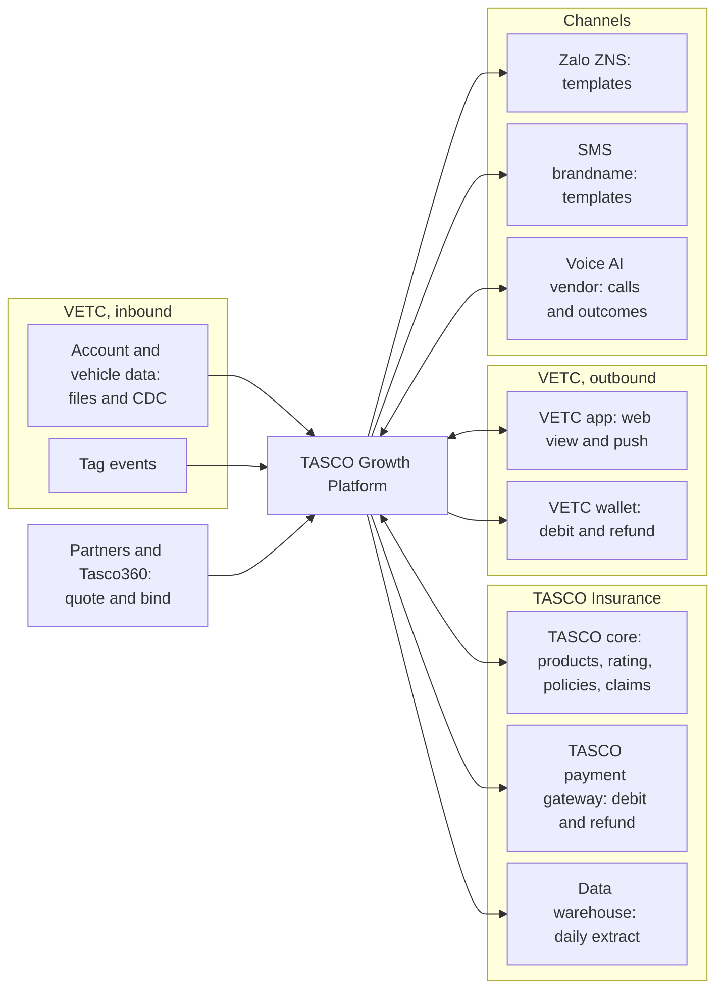

| Touchpoint | Direction | Pattern | Adapter today | MVP |
|---|---|---|---|---|
| TASCO core: product catalogue | Core to platform | Nightly sync, proposed for approval | Production client built (paths assumed); simulated core in UAT | Yes |
| TASCO core: rating | Platform to core | Real-time REST | Production client built (paths assumed); simulated core in UAT | Yes |
| TASCO core: bind and issue | Platform to core | Real-time REST, idempotent | Sandbox | Yes |
| TASCO core: policy extract | Core to platform | Daily file, then incremental | Ingestion API built; feed to be agreed | Yes |
| TASCO core: claims notification | Platform to core | Staff queue in MVP; system to system later | Claim intake built; core interface planned | Queue only |
| VETC account and vehicle data | VETC to platform | Initial file load, then CDC or daily delta | Ingestion API and synthetic source | Yes |
| VETC tag events | VETC to platform | Event stream or signed webhook | Staff-authenticated event API | Tag activation |
| VETC app web view and push | Both | Signed deep links; push through VETC | Signed links built; push sandbox | Yes |
| VETC wallet | Platform to VETC | Real-time REST plus daily settlement file | Sandbox | Yes |
| TASCO payment gateway | Platform to TASCO | Real-time REST, same contract as the wallet | Sandbox | Scale module S3 |
| Zalo ZNS and SMS | Platform to provider | Provider API, approved templates | Sandbox | Yes |
| Voice AI vendor | Both | SIP and streaming API | Simulated caller | One vendor |
| Partners | Partner to platform | Partner API with key scopes | Built | One partner |
| Tasco360 partner app | Tasco360 to platform | Partner API with key scopes | Built (partner API) | Candidate first partner |
| TASCO e-commerce site (e.baohiemtasco.vn) | Site to platform | Shared core rating; optional enquiry feed with consent | Ingestion API built; feed to be agreed | Scale phase |
| TASCO data warehouse | Platform to DWH | Daily pseudonymised extract | Planned | Scale phase |

# TASCO core

TASCO core owns the product catalogue and rating, and the platform uses them instead of duplicating them (ADR-013). This is the most important integration in the programme.

## Touchpoints

| Touchpoint | Purpose | Pattern |
|---|---|---|
| Product catalogue | Products, versions, eligibility, add-ons, on-sale status | Scheduled sync; changes become a draft that TASCO approves |
| Rating and quotation | Price a policy for a vehicle and term; core returns premium, VAT, quote reference and validity | Real-time REST call |
| Bind and issue | After payment, bind the quote core priced and issue the policy and e-certificate | Real-time REST call, idempotent |
| Policy book | Active and expiring TASCO policies, to drive renewals and avoid selling to insured customers | Daily extract, then incremental |
| Cancellation and claims notification | Cancel or refund where allowed; pass first notice of loss to the claims system | REST or file; claims by staff queue in the MVP |

Each quote records which system rated it, the core quote reference and the rating version. Rating requests carry only the risk attributes core needs: vehicle category, usage, seats, first registration year, holder type and term. The plate and the holder's name go to core only at issuance, with the quote reference, so core binds exactly the price it quoted.

## Rating modes

TASCO chooses in discovery how the platform behaves when core is unavailable. The setting is `RATING_SOURCE`.

| Mode | Behaviour when core is available | Behaviour when core is unavailable | Use |
|---|---|---|---|
| `core` | Core prices every quote | No quote is shown; the customer is asked to retry (HTTP 503) | Production, safest |
| `core_with_fallback` | Core prices every quote | An indicative price from the approved tariff tables, clearly marked; payment blocked until core re-rates it | Production, if TASCO prefers availability |
| `rules` | Local rule sets price the quote | Not applicable | Sandbox and testing; refused in production unless explicitly allowed |

Business answers from core (declined, referred to an underwriter, product inactive) are never replaced by a local price in any mode. The production configuration in the Kubernetes manifests sets `core`. A production start with `rules`, or with a core mode but no core address, is refused unless `ALLOW_LOCAL_RATING` is set.

## Rating and issuance sequence

The first sequence shows a customer quote priced, declined or referred by core; the second shows what happens when core is down, in each rating mode; the third shows the re-rating of an indicative quote and issuance after payment. Payment itself is shown in section 5.

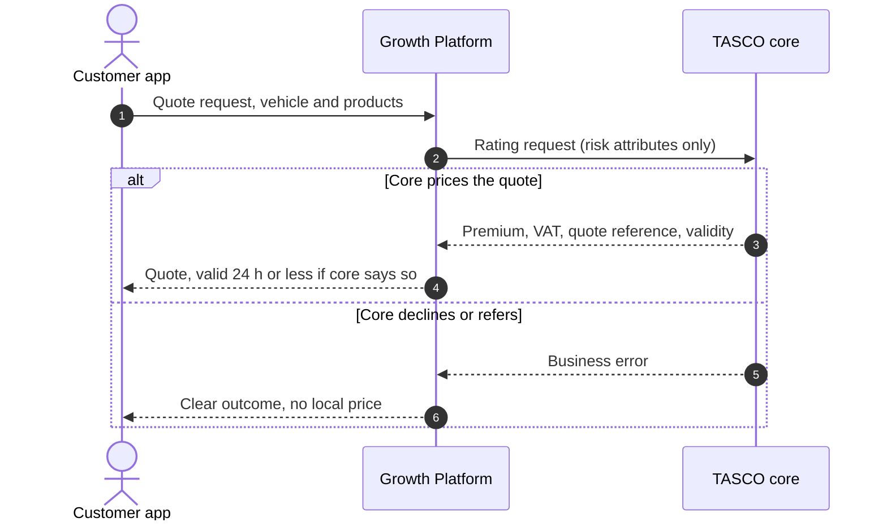

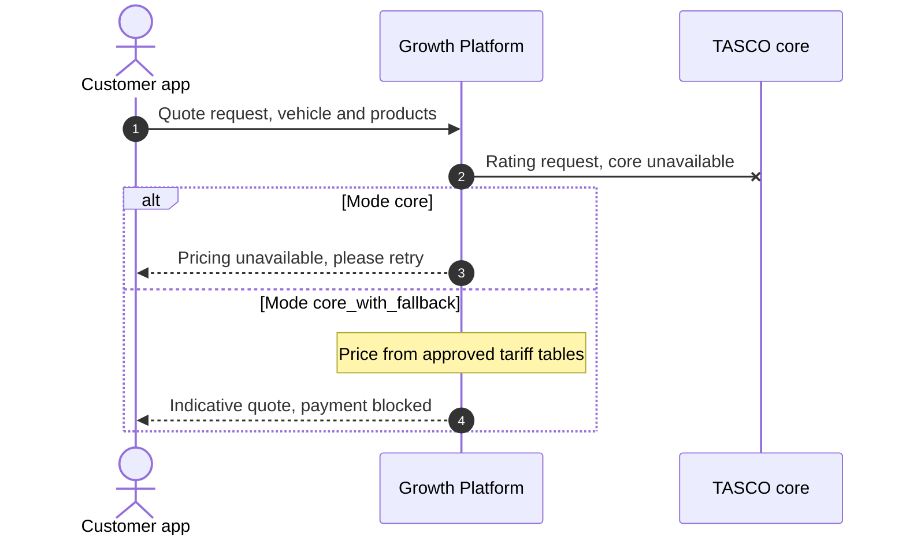

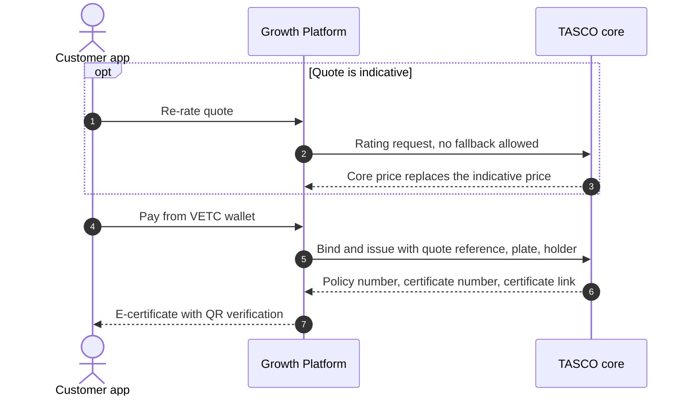

Staff and customers can both re-rate an indicative quote (`POST /api/quotes/:id/rerate` and `POST /api/customer/quotes/:id/rerate`). Re-rating requires a core answer; the previous indicative total is kept on the quote for audit. The bind-and-issue call uses the sandbox policy administration adapter today; the real adapter is built against TASCO's specification in SIT.

## Port contracts

The contracts below use TypeScript notation for readability; the code is JavaScript.

```ts
interface CoreRating {
  quote(req: {
    idempotencyKey: string; requestId: string; channel: string; partnerId: string | null;
    quoteDate: string; startDate: string; termYears: number;
    holder: { type: 'individual' | 'company' };
    vehicle: { category: string; usage: string; seats: number; firstRegisteredYear: number };
    lines: { product: string; options?: object }[];
  }): Promise<{
    coreQuoteRef: string; ratingVersion: string; validUntil: string;
    lines: { product: string; premiumNet: number; vat: number; total: number;
             startDate: string; endDate: string; termDays: number; ratingRef: string }[];
  }>;
}

interface ProductCatalogue {
  fetchCatalogue(): Promise<{ catalogueVersion: string; publishedAt?: string;
    products: { code: string; version: string; name: string; status: 'active' | 'inactive' | 'withdrawn';
                compulsory?: boolean; priceRegulated?: boolean; requiresInspection?: boolean; ratingMethod?: string }[] }>;
}

interface PolicyAdministration {
  issuePolicy(req: { product: string; plate: string; holderName: string | null; startDate: string; endDate: string;
                     premiumNet: number; vat: number; orderId: string; coreQuoteRef: string | null; coreLineRef: string | null })
    : Promise<{ policyNo: string; certNo: string; certificateUrl: string; issuedAt: string }>;
  cancelPolicy(req: { policyNo: string; reason: string }): Promise<{ policyNo: string; status: 'cancelled' }>;
}
```

## Contract details

| Aspect | Contract |
|---|---|
| Production adapter | `tascoCoreRatingClient.js`: `POST /rating/v1/quotes` and `GET /products/v1/catalogue`. These paths and payloads are assumptions until TASCO's interface specification is received; only the mapping inside the adapter changes. |
| Sandbox adapter | `simulatedTascoCore.js`: same contract, priced from the approved local rule sets, returning core-style references. Used whenever `TASCO_CORE_BASE_URL` is empty. |
| Authentication | OAuth 2.0 client credentials (`TASCO_CORE_CLIENT_ID`, secret from a mounted file). Token cached until shortly before expiry; a 401 forces a new token. HTTPS only in production. Mutual TLS by client certificate or at the egress proxy. |
| Resilience | 5,000 ms per call (`TASCO_CORE_TIMEOUT_MS`), cancelled on timeout; two retries with backoff; one circuit breaker for rating and one for catalogue. Business errors are not retried and do not open the circuit. |
| Idempotency | `Idempotency-Key` on every rating call (the quote id, or the quote id with a re-rate suffix). Issuance must de-duplicate on order and product: the production adapter sends `Idempotency-Key` as order id plus product. |
| Response checks | Responses are schema-validated. Missing or malformed required fields are treated as core unavailable (503), never as a price. |
| Error mapping | Core codes such as `UNDERWRITING_DECLINED`, `REFER_TO_UNDERWRITER`, `PRODUCT_INACTIVE` and `QUOTE_EXPIRED` become business outcomes (HTTP 422 or 409). Authentication failures, throttling and timeouts become 503. Core error messages are never echoed. |
| Quote validity | The platform quote expires after 24 hours or at core's validity, whichever comes first. |
| Monitoring | `GET /api/integrations/status` shows the rating mode, core endpoint, circuit states and the last catalogue sync. Metrics count core rating calls, unavailability and indicative quotes. |
| Proposed service level | Rating at or under 1 second at the 95th percentile; 99.9% availability in contact hours (to be agreed with TASCO core). |

## Catalogue sync with maker-checker

TASCO core is authoritative for which products exist, their version and whether they are on sale. The platform stays authoritative for distribution: channels, bundles and local indicative rates. The nightly job proposes changes; a person approves them.

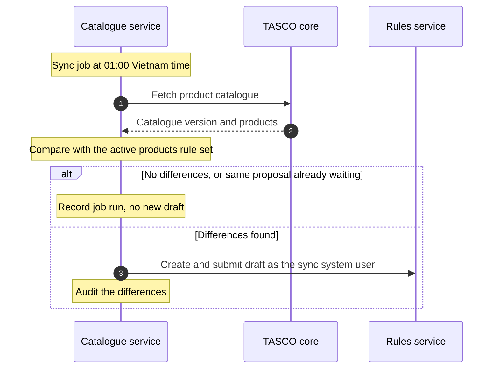

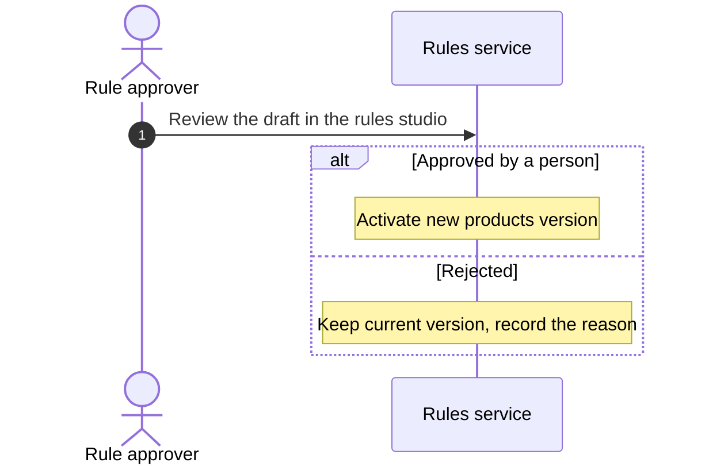

New products from core arrive with no sales channels, so nothing goes on sale until the business configures them. Products missing from core are marked withdrawn but kept, so history and renewals still resolve. The sync user holds only the rule author role and cannot approve its own proposal. The job can also be run on demand (`POST /api/ops/jobs/catalogue-sync`, permission to run jobs).

## Policy book extract

TASCO's in-force and expired policies are loaded through the same ingestion path as VETC data, as source `tasco_core` with verified certificates. This source carries the highest trust (1.0), so renewal journeys for TASCO customers are accurate from day one and vehicles already insured with TASCO are not offered new business. The extract format (plate, certificate number, cover period, holder) is agreed in discovery; a daily delta follows the initial load.

## Claims notification

When a customer reports a claim in the app, the platform records it, sets the acknowledgement deadline from the service levels (4 hours) and sends the customer an acknowledgement. In the MVP, claims handlers work the claims queue in the staff console and register the claim in TASCO's claims system. In the scale phase a subscriber to the claim event calls the TASCO core claims API with the claim id as idempotency key and stores the core claim number. Photos are counted only today; uploads will use pre-signed object storage with malware scanning.

## Interim path without a rating API

If TASCO core cannot expose a rating API in time, the platform rates from tariff tables synchronised from core and approved by TASCO, and core re-rates at the moment of issue, rejecting any mismatch. The path is confirmed in the first two weeks of discovery.

# VETC

## Account and vehicle data

VETC supplies plates, vehicle class, seats, owner name and phone, engagement signals and consent flags for its account base. Records arrive through the SourceFeed port or the ingestion API and are upserted by record id, so re-sending a batch is safe.

| Aspect | Contract |
|---|---|
| Entry points | `POST /api/data/ingest` (up to 5,000 records per call, field allow-list), the bulk loader for files and the CDC consumer |
| Match key | Normalised plate. Invalid plates are landed but excluded from the golden record and raise a data quality issue. |
| Personal data | Phone and name are encrypted at rest. National id, address and date of birth are not accepted. |
| Consent | Consent and do-not-contact changes must take effect before the next contact: target 15 minutes end to end, through a dedicated topic or webhook |
| Deletes | Account closure or erasure at VETC anonymises the profile unless an active policy requires retention |

The initial load of the full base runs once per environment, as the diagram shows.

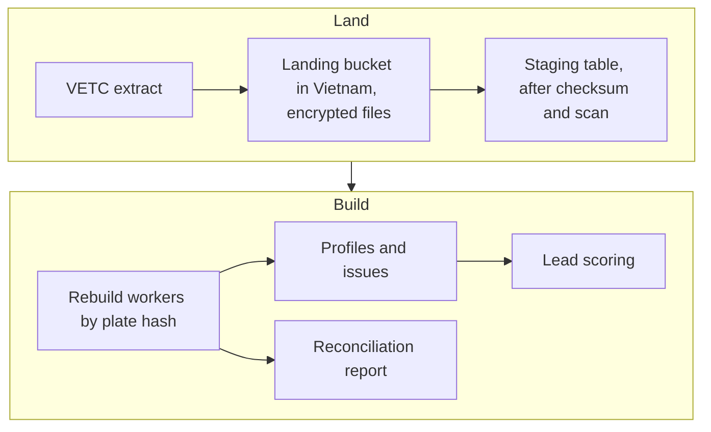

| Item | Design |
|---|---|
| Volume | About 6 million VETC account records plus partner and telesales records, about 7.8 million source records in total |
| Format | Parquet preferred, or UTF-8 CSV with a header; manifest with row count, checksum and schema version; plates and phones sent raw |
| Security | PGP-encrypted files, landing bucket in Vietnam (to be confirmed by TASCO legal), files deleted seven days after a successful load |
| Validation | Row counts and checksum against the manifest; abort if more than 5% of plates are invalid |
| Steady state | CDC from VETC (preferred) into micro-batches of up to 5,000 records or 5 seconds; otherwise a nightly delta file between 00:00 and 05:00 ICT |

## Tag and ecosystem events

VETC events trigger timely actions: a tag activation enrols a new vehicle; an inspection booking, a wallet top-up or a long trip near the expiry date prompts a message. Each event is matched against the trigger rules and passes the contact policy before any message is sent.

| Aspect | Contract |
|---|---|
| Event types | `vetc.tag_activated`, `vetc.inspection_booked`, `vetc.wallet_topped_up`, `vetc.long_trip_started` |
| Today | `POST /api/ecosystem/events` with a staff token holding the journeys permission |
| Production transport | Preferred: a topic consumed by a platform worker (at least once, committed after handling). Alternative: an HTTPS webhook with HMAC signature, a dedicated machine identity and a dedicated permission. |
| Idempotency | Each event carries a unique event id; processed ids are kept for seven days |
| Volume | Top-ups and trips can reach millions per day; VETC should pre-filter to vehicles near expiry or newly tagged |

## App web view and push

The customer app runs inside the VETC app as a web view. Customers arrive through a signed renewal link that expires after 30 days (`LINK_TTL_DAYS`) and receive a customer session of one hour. In the scale phase VETC app sign-on replaces the link: the VETC token is exchanged for a platform customer token bound to the VETC account id.

Push notifications go through VETC's push service, addressed by account, never by phone. The deep link in each push is the signed renewal link. If the VETC app embeds the customer app in an iframe rather than a top-level web view, the frame policy for the customer app must be relaxed for the VETC origins only.

## Wallet payment with saga refund

Only the customer can trigger a wallet debit, from the customer app. Staff send quotes but never take payment, and partner sales never touch the wallet. The first sequence shows the payment; the second shows issuance and the compensation path when issuance fails after the money is taken.

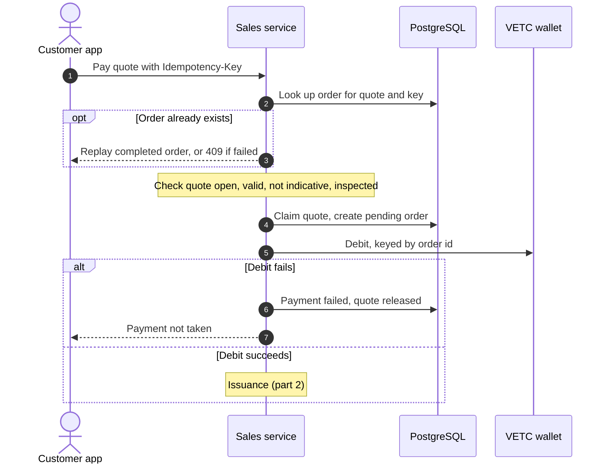

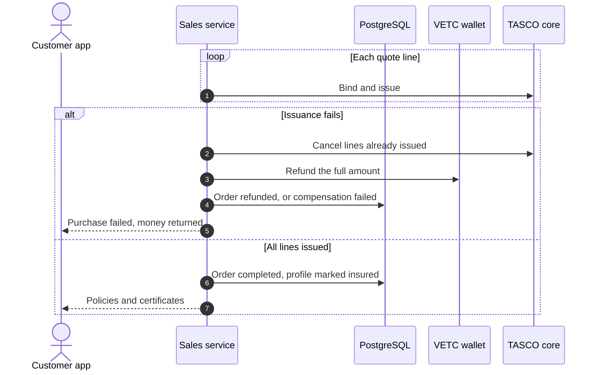

The quote is claimed with an optimistic version check before payment, so two purchases of the same quote cannot both debit the wallet; the second receives HTTP 409. If a refund or a cancellation fails, the order is set to `compensation_failed` and the nightly reconciliation flags it for manual action. Automatic refund retry through the outbox is planned before go-live.

| Aspect | Contract |
|---|---|
| Debit | `debit({ idempotencyKey, customerId, amount, description })`. The wallet must return the original result for a repeated key, so a retry after a timeout is safe. |
| Refund | `refund({ transactionId, amount })`, called only by the compensation step, through the same circuit breaker |
| Customer identity | Today the profile id; in production the VETC account id resolved from the golden record. The plate is not sent. |
| Customer confirmation | VETC should confirm the debit with the wallet holder (push, PIN or biometrics) under its payment rules. If confirmation is asynchronous, the adapter returns a pending status and completes through a signed webhook. To be agreed with VETC. |
| Errors | Insufficient balance or a blocked account (4xx) fails the payment without retry and releases the quote. Timeouts and 5xx are retried twice, then return 503. |
| Reconciliation | Nightly: completed orders without a payment reference or policy, orders pending for more than an hour, failed payments to confirm no capture, failed compensations. The daily wallet settlement file match is planned. |

# Messaging channels

## Notification contract

App push, Zalo ZNS and SMS share one port. The journey service is the only send path, used by journey steps, ecosystem triggers, quote sending, renewal links, purchase confirmations and claim acknowledgements.

```ts
interface NotificationChannel {
  name: 'app_push' | 'zalo_zns' | 'sms';
  send(req: { to: string; text: string; templateKey: string; idempotencyKey: string })
    : Promise<{ providerMessageId: string; status: 'accepted' }>;
}
```

| Aspect | Contract |
|---|---|
| Checks before sending | Reachable channel, do-not-contact, consent per channel and purpose, 08:00 to 20:00 window and daily and weekly caps for marketing, then template rendering and the copy guard. A message failing the copy guard is blocked and never sent. |
| Fallback | A step lists channels in priority order; the first accepted send wins, and a failure tries the next channel |
| Idempotency | The message id is the idempotency key, mapped to each provider's de-duplication field |
| Delivery receipts | Planned: signed provider webhooks update the message status. Today the status reflects provider acceptance. |
| Address | Push uses the VETC account; Zalo and SMS use the phone number |

## Zalo ZNS template governance

Zalo ZNS sends only pre-approved templates with typed parameters, through TASCO's Official Account "Bảo hiểm Tasco". The production adapter therefore sends a template id and parameters, never free text; the sandbox accepts free text, which is not how ZNS works. The flow below keeps the platform's wording and Zalo's templates in step.

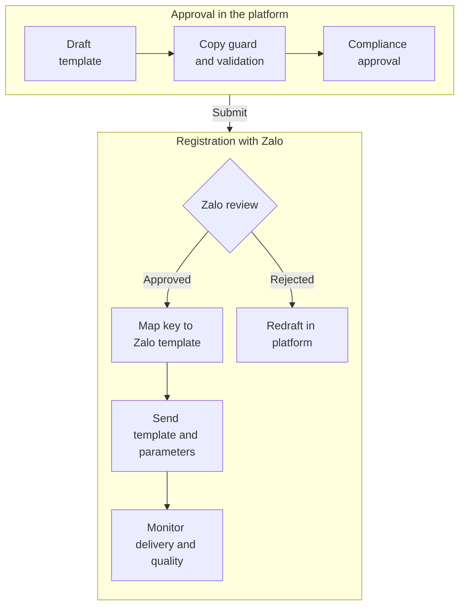

The message content rule set holds the canonical wording, and the Zalo template must match it word for word apart from parameters. The mapping from template key to Zalo template id is itself configuration under maker-checker, and a key without an approved mapping is rejected by the production adapter. A wording change needs a new rule version and a new Zalo template; the old mapping stays until the new template is approved. Service messages (purchase confirmation, quote ready, claim received) are distinct from promotional ones, and the journey's marketing flag must match the Zalo template class. Zalo's template rules, quotas and pricing change from time to time and must be confirmed with Zalo and TASCO legal before go-live.

## SMS

Messages go out under a registered TASCO brandname through an SMS aggregator, under the anti-spam and advertising rules of Decree 91/2020/ND-CP (to be confirmed by TASCO legal). Vietnamese diacritics force UCS-2 encoding at 70 characters per segment, so templates are checked for segment count before approval.

# Voice AI vendor

The platform keeps the dialogue policy: which line to say next and what each answer means. The vendor provides dialling, speech recognition, text to speech of the exact approved lines and call recording. TGP-ARC-06 AI Governance covers the governance of the script and the dialogue.

| Aspect | Contract |
|---|---|
| Port | `runCall(dialogue, session, plateDisplay)`: the vendor streams recognised text turns into the dialogue and speaks the returned lines until the session ends |
| Callers | Journey voice steps and voice campaigns, each checked against the contact policy; company-owned vehicles are skipped and routed to B2B |
| Production shape | Streaming session (WebSocket or gRPC); per-turn timeout plus an overall call cap of about four minutes; the call result returns through a webhook |
| Data sent | Phone number to dial and the approved line text. The bot speaks a masked plate and never reads out the customer's data. |
| Recording | Vendor recordings need a DPA, storage in Vietnam, deletion after 180 days and deletion on DSAR. Disclosure wording to be confirmed by TASCO legal. |
| Caller id | A registered official number only. The approved script currently introduces the assistant as VETC's; the caller identity is agreed with TASCO and VETC before go-live. |
| Sandbox | Simulated caller with weighted personas (eager, self-serve, price shopper, sceptic, already renewed, busy, opt-out, wrong plate) |

## Voice handoff sequence

The first sequence shows an automated renewal call up to the offer; the second shows the handoff to a person and the other call outcomes.

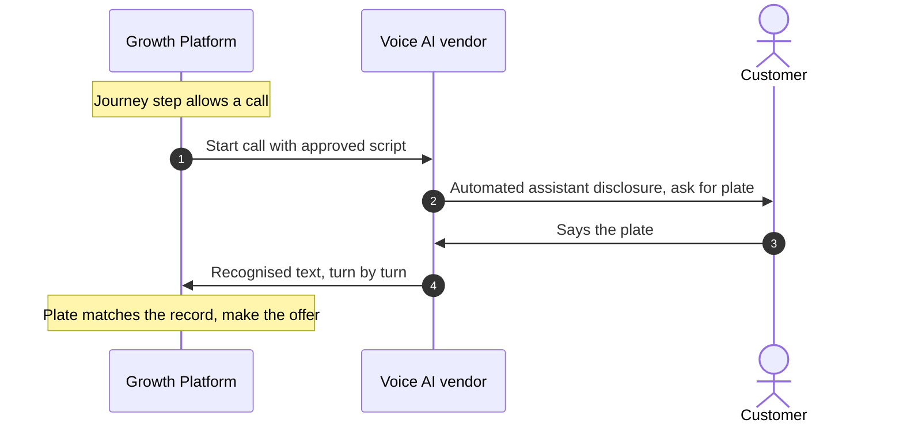

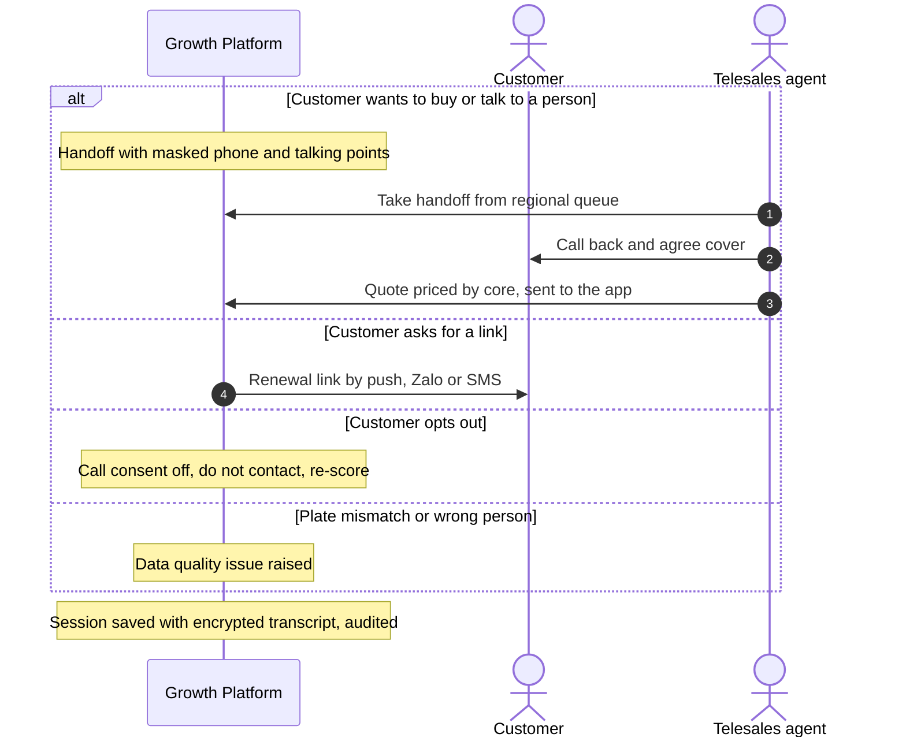

A handoff carries only what the agent needs: a masked phone, the plate the customer confirmed, the expiry date, the premium and talking points. Agents see handoffs in their own region, and an agent sees only handoffs assigned to them or unassigned. The handoff event has no subscriber yet; a dialler or CTI queue is the target. The customer then pays in the app as shown in section 5.

# Partners

Banks, showrooms, agents, fleets and inspection centres sell TASCO cover through the Partner API. The partner collects the premium from its customer and remits it to TASCO under the partner agreement; the platform records the sale and computes commission. TGP-MAN-03 Partner API Integration Guide is the developer guide.

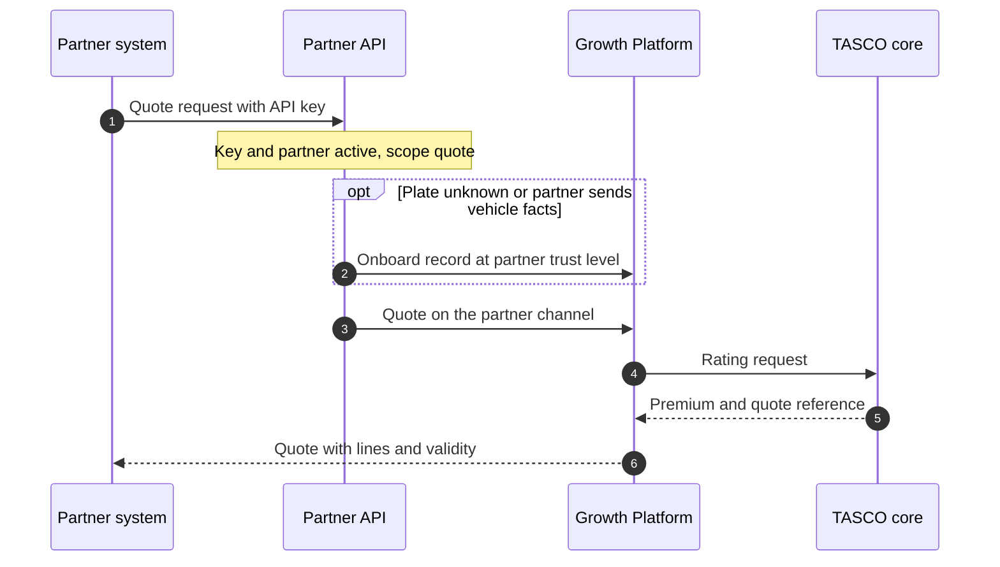

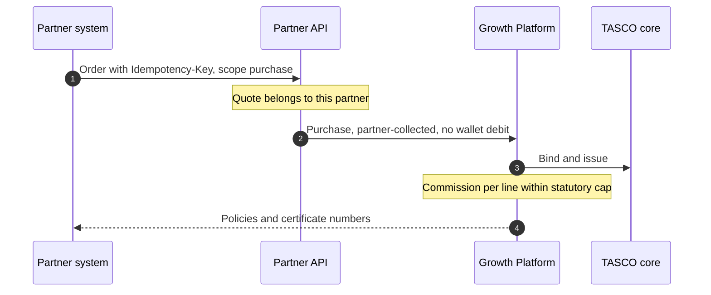

| Aspect | Contract |
|---|---|
| Base path | `/api/partner/v1`, versioned in the path; a breaking change runs as v2 alongside v1 for at least six months |
| Operations | Quote (scope `quote`), order (scope `purchase`), policies and commission statement (scope `policies:read`) |
| Authentication | `X-Api-Key`, issued once by the partner manager and stored only as a hash. OAuth 2.0 client credentials or mutual TLS at the API gateway is the production target. |
| Ownership | A partner can order only its own quotes and sees only its own policies and statements |
| Payment | Partner-collected; the order payment reference starts with `PARTNER-` and is reconciled through the commission statement |
| Commission | Computed per line at bind time from the commission rule set and capped at the statutory cap (figures to be confirmed with TASCO finance and legal) |
| Errors | Uniform error body with code, message and request id: 400, 401, 403, 404, 409, 422, 429 and 503 |

Three exposure controls apply before external partners go live. A quote for a plate already on the platform must not reveal the vehicle's current expiry date through the cover start date; partner quotes for existing profiles will use partner-supplied facts or return only the price. Partner-supplied facts merge into the golden record at lower trust than VETC and TASCO sources, and partner phone numbers will be held until verified. Partners cannot submit marketing consent; consent is captured by VETC or by the customer in the app.

# Reuse of existing assets

The platform reuses the systems TASCO and VETC already run and builds only what is missing between them.

| Existing asset | Owner | What the platform reuses | How it connects | MVP |
|---|---|---|---|---|
| Core system | TASCO | Products, tariffs, rating, policy issuance, e-certificates, claims | Catalogue sync, live rating, bind and issue, daily policy extract; claims by staff queue first | Yes |
| Customer app and website (e.baohiemtasco.vn) | TASCO | Customer accounts, brand, online payment gateway | The same renewal and purchase journeys, opened as a web view or called through the customer API; payment through TASCO's own gateway; sales recorded against the TASCO channel | Scale module S3, from March 2027 |
| Tasco360 | TASCO | The app partners and agents already use | Partner API: quote by plate, bind, statements | Candidate first partner |
| Zalo Official Account | TASCO | Followers, approved ZNS templates, chat | ZNS reminders and service messages; OA chat linked from the app; the same journeys as a Zalo Mini App later | ZNS yes; Mini App in scale module S4 |
| Hotline 1900 1562 and contact centre | TASCO | Agents, caller identity customers recognise | Telesales inbox and handoffs; outbound calls from a registered TASCO number | Yes |
| VETC app | VETC | Reach to about 6 million drivers, push | Web view with signed links; push for reminders; single sign-on later | Yes |
| VETC wallet | VETC | Card-free payment | Debit, refund and daily reconciliation | Yes |
| VETC data and events | VETC | Vehicles, owners, tag activation | Initial file, daily changes, activation events | Yes |

The customer API is host-neutral. `POST /api/customer/session` accepts the host channel (`vetc_app`, `zalo_mini_app`, `tasco_app`, `tasco_web`) and writes it into the customer token. Quotes and orders are attributed to that channel. Payment uses the VETC wallet port for the VETC app and the Zalo Mini App, and the TASCO payment gateway port for TASCO's app and website. Products list the channels they may be sold on, so a new front door is enabled by configuration and approval.

# TASCO digital channels

TASCO already sells and serves customers through its own digital channels. The platform shares the same core with them and does not duplicate them.

| Channel | Today | Integration with the platform |
|---|---|---|
| e.baohiemtasco.vn | Online purchase of compulsory TNDS for cars; asks business use, vehicle type, seats and phone. Physical damage is marked "coming soon". | Same core catalogue and rating, so premiums match across channels. The customer app asks the same vehicle questions through `POST /api/customer/vehicle`, which records the answer as evidence from the customer with source trust 0.9 and recalculates the tariff category. An enquiry feed (phone left without purchase, with consent) can enter through the ingestion API; scope to be agreed. |
| Tasco360 | Mobile app for partners and stakeholders: consultation, sales and after-sales | Calls the partner API as a partner of type agent: quote by plate, bind, own policies and commission statement. Needs an API key with `quote` and `purchase` scopes. |
| Contact centre and chat | Hotline 1900 1562, info@baohiemtasco.vn, Zalo, Messenger and website chat | The customer app reads the official contacts from configuration through `GET /api/meta`: hotline 1900 1562, info@baohiemtasco.vn, baohiemtasco.vn, the Facebook page and Messenger (m.me/tasco.baohiem), and the Zalo Official Account "Bảo hiểm Tasco", which customers find by searching in Zalo until TASCO provides a direct OA link. An unset channel is hidden. Voice handoffs and telesales callbacks present a registered TASCO caller identity. |

## TASCO payment gateway

When the customer app runs in TASCO's app or website (`tasco_app` or `tasco_web`), payment goes through a second payment port backed by TASCO's existing online payment gateway, the one behind e.baohiemtasco.vn. The port has the same `debit` and `refund` contract, idempotency, circuit breaker and saga refund as the wallet, so the payment and refund sequences in section 5 apply unchanged. The sales service chooses the port from the host channel in the customer's session; the VETC app and the Zalo Mini App always use the VETC wallet. Today the port is a sandbox adapter; the real adapter is built against TASCO's gateway specification with scale module S3, and card data never passes through the platform.

# Data warehouse and outbound feeds

| Feed | Consumer | Content | Cadence |
|---|---|---|---|
| Analytics extract | TASCO data warehouse | Leads, journeys, sales and outcomes, pseudonymised; no decrypted personal data | Daily (scale phase) |
| Policy register delta | TASCO core and finance | Policies and orders with payment reference and commission | Daily |
| Commission statements | Partners and TASCO finance | Partner sales and commission per line | Monthly |
| Data quality feedback | VETC data office | Invalid plates, conflicting phones, wrong-person outcomes by record id | Weekly |

TGP-ARC-03 Data Architecture describes the pseudonymisation rules for the analytics extract.

# Identity integrations

| Principal | Today | Target |
|---|---|---|
| Staff | Local accounts, password plus TOTP for privileged roles, 30-minute tokens | OIDC authorisation code with PKCE against the TASCO identity provider; groups mapped to platform roles; MFA by conditional access |
| Customers | Signed renewal link, then a one-hour customer token | VETC app sign-on, exchanged for a platform customer token |
| Partners | API key with enforced scopes | OAuth 2.0 client credentials or mutual TLS at the gateway |

ADR-007 in TGP-ARC-07 Architecture Decision Records records this decision and its migration path.

# Proposed service levels

These figures are proposals for the integration agreements; each is confirmed with the provider.

| Integration | Availability | Latency (95th percentile) | Peak throughput | Behaviour when breached |
|---|---|---|---|---|
| TASCO core rating | 99.9% in contact hours | 1 s | 10 per second | Fail closed or indicative price, per rating mode |
| TASCO core issuance | 99.9% | 3 s per line | 10 per second | Cancel and refund, then reconciliation |
| VETC wallet | 99.95% | 2 s | 5 per second | Payment returns 503, quote released, no partial state |
| TASCO payment gateway | 99.95% | 2 s | 5 per second | As for the VETC wallet |
| App push | 99.9% | 500 ms to accept | 200 per second | Next channel in the step |
| Zalo ZNS | Provider terms | 1 s to accept | 50 per second (quota) | Next channel in the step |
| SMS | Provider terms | 1 s to accept | 50 per second | Next channel or next run |
| Voice AI vendor | 99.5% | Recognition 300 ms, speech 400 ms | 100 concurrent calls (pilot 20) | Step retried in the next run within caps |
| VETC CDC feed | 99.5% | Data within 15 minutes | 1 to 2 million changes per day | Backfill from the daily delta file |

# Integration testing

| Level | Scope | Where |
|---|---|---|
| Automated suite | Domain, services and HTTP API with sandbox gateways, including idempotency, compensation and circuit breakers | `npm test` in CI |
| TASCO core client | Request mapping, token caching, error mapping, timeouts and schema checks against a mocked core | `npm test` in CI |
| PostgreSQL | Store behaviour on real PostgreSQL: `SKIP LOCKED`, optimistic locking, audit chain | `npm run test:pg` in CI |
| Contract | A shared suite per port run against the sandbox and the real adapter | Planned, SIT |
| System integration | TASCO core UAT, VETC wallet sandbox, TASCO payment gateway test account, Zalo test account, SMS test brandname, voice vendor test trunk | SIT environment |
| Resilience | Fault injection on sandbox gateways and a network fault proxy in SIT | SIT and performance environment |
| Load | Load smoke in CI (194 requests per second, 95th percentile 210 ms, no errors on one process) and simulated caller personas | CI and performance environment |

# Appendix

## Platform error codes

| Code | HTTP status | Meaning |
|---|---|---|
| `VALIDATION_FAILED` | 400 | Request does not match the schema |
| `UNAUTHENTICATED` | 401 | Missing or invalid credentials |
| `FORBIDDEN` | 403 | Permission, scope or ownership check failed |
| `NOT_FOUND` | 404 | Resource does not exist or is not visible to the caller |
| `CONFLICT` | 409 | Concurrent update, quote already being paid, or reused key of a failed attempt |
| `BUSINESS_RULE_VIOLATION` | 422 | Business rule stops the action, for example an indicative quote or a missing inspection |
| `RATE_LIMITED` | 429 | Too many requests |
| `UPSTREAM_UNAVAILABLE` | 503 | An external system is unavailable or its circuit is open |

## Message templates in use

Verify expiry, first reminder, conquest reminder, value reminder, urgent reminder, expiry day, lapsed notice, new vehicle welcome, inspection check, cross-sell, purchase confirmation, quote ready and claim received. Each needs an approved Zalo template and a registered SMS template before go-live.
