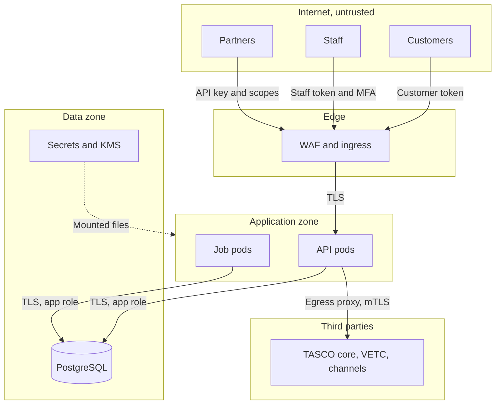
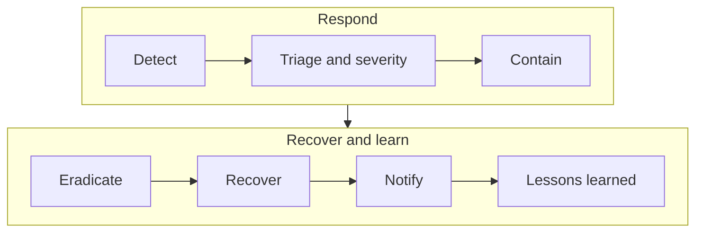

# Introduction

## Purpose

This document describes how the TASCO Growth Platform protects personal data, money movement, regulated rules and the audit trail. It sets out the assets and threats, the trust boundaries and zero-trust controls, identity and access control, cryptography and secrets, application security, monitoring, the secure delivery pipeline and the residual risks with their treatment.

## Scope

The application, its data and its integrations, and the infrastructure controls it relies on in production. Controls delivered by Kubernetes, the WAF, managed PostgreSQL and the CI pipeline are marked as infrastructure controls. Regulatory references are to be confirmed by TASCO legal.

## Audience

TASCO Insurance Chief Information Security Officer and information security team, VETC security, penetration testers and internal audit.

## Related documents

| ID | Title | Relationship |
|---|---|---|
| TGP-ARC-01 | Solution Architecture | Structure and principles |
| TGP-ARC-02 | Integration Architecture | Integration security and data minimisation per provider |
| TGP-ARC-03 | Data Architecture | Classification, encryption, retention, erasure |
| TGP-ARC-05 | Deployment and Infrastructure Architecture | Network policy, secrets delivery, CI/CD gates |
| TGP-ARC-07 | Architecture Decision Records | ADR-006 encryption, ADR-007 identity, ADR-008 audit |
| TGP-OPS-02 | Monitoring and Alerting | Security alert rules |
| TGP-DEL-04 | Risk Register | Programme-level risks |

# Assets and security objectives

| Asset | Why it matters | Primary objective |
|---|---|---|
| Personal data of about 6 million vehicle owners | Personal data protection law and customer trust (to be confirmed by TASCO legal) | Confidentiality, lawful processing |
| Money movement: wallet debits, refunds, partner commission | Fraud and double charging | Integrity, non-repudiation |
| Regulated rules: tariffs, copy guard, commission caps, consent policy | Mis-selling and unlawful discounts on compulsory cover | Integrity, four-eyes control |
| Policies and e-certificates | Legal proof of compulsory cover | Integrity, availability |
| Audit trail | Accountability to regulators and auditors | Tamper evidence |
| Credentials and keys | Compromise means full breach | Confidentiality |

# Trust boundaries and zero trust

## Trust boundaries

Every request that crosses a trust boundary is authenticated, validated and minimised. The diagram shows the boundaries and the credential used at each crossing.

Personal data crosses into third parties only where a provider needs it: phone numbers to the messaging and voice providers, plate and holder name to TASCO core at issuance, and inbound records from VETC. The public certificate check returns a masked plate and no personal data.

## Zero-trust controls

| Principle | Control | Status |
|---|---|---|
| Verify explicitly | Token verified on every request; the staff user is reloaded on every request, so a password, role, status or region change applies at once. Partner key and partner status are checked per request. | Built |
| Least privilege | 29 permissions across 15 roles; attribute-based checks on region and ownership; personal data masked without explicit permission; database application role without schema rights | Built and infrastructure |
| Assume breach | Field-level encryption, so a database or backup theft yields ciphertext; hash-chained audit trail; default-deny network policy; 30-minute staff tokens; separate keys for encryption and search | Built and infrastructure |
| No implicit network trust | TLS to the database with certificate verification; mTLS to providers; metrics endpoint protected by a bearer token and network rules | Partly built; mTLS with real adapters |
| Device and session posture | Managed devices for roles that see personal data, through identity provider conditional access | Planned with OIDC (ADR-007) |
| Continuous monitoring | Audit trail, metrics, security alerts | Built and infrastructure |

# Threat model

The threat model follows STRIDE. The table lists the main threats per component, the key controls and the residual risk after those controls. Residual risks rated Medium are tracked in section 11.

| Component | Main threats | Key controls | Residual risk |
|---|---|---|---|
| Edge and HTTP pipeline | IP spoofing against rate limits; oversized or malformed requests; error leakage | Client IP from the right-most trusted proxy hop; JSON only, 1 MiB limit; malformed path parameters rejected; generic errors with a request id | Low; per-replica limiter (SR-02) |
| Staff identity | Password guessing; code replay; privilege escalation | Password and TOTP for privileged roles; lockout covers both steps; codes cannot be reused; no self role or status change; separation of duties | Medium (SR-01) |
| Customer session | Link forgery; link reuse; session after erasure | HMAC-signed links that expire after 30 days; customer tokens cannot reach staff routes; erased customers lose sessions | Medium (SR-05) |
| Partner API | Stolen key; scope abuse; data exposure; data poisoning | Hashed keys, scopes per route, ownership checks, partner status check; partner data at lower trust | Medium (SR-03) |
| Rules engine | Code injection through rules; approving one's own change | No code evaluation, operator allow-list, prototype keys forbidden; four-eyes approval; restricted kinds need a compliance officer; transactional activation | Low (SR-09) |
| Sales and payment | Staff debiting a wallet; double charging; paying an unconfirmed price | Only the customer can pay; atomic quote claim; idempotent orders; indicative quotes blocked; saga refund | Low (SR-11) |
| Journeys and messaging | Unlawful or misleading messages; double sends | Contact policy, consent and caps; copy guard at approval and at send; overlapping runs prevented | Low (SR-10) |
| Voice assistant | Vishing; disclosure of customer data on a call | Customer says the plate, bot never reads data; disclosure and trust line; transcript encrypted | Medium (SR-07) |
| Persistence | SQL injection; data theft from database or backups | Parameterised SQL only, column allow-list, field encryption, TLS with certificate verification | Low |
| Audit trail | Tampering or deletion | Hash chain; triggers block update, delete and truncate; verification on demand | Medium (SR-06) |
| Outbound integrations | Provider impersonation; duplicate side effects; slow providers | TLS and mTLS through the egress proxy; idempotency keys; timeouts and circuit breakers | Low (SR-12) |
| Front end | Cross-site scripting; clickjacking | Strict CSP with no inline script, rendering by text content only, frame embedding denied | Low |
| Configuration | Running production with demo features or missing secrets | Production refuses to start without secrets or a database, or with demo mode on | Low |
| Supply chain | Malicious or vulnerable dependency | One runtime dependency; lockfile; dependency, secret and container scanning; SBOM | Medium (SR-13) |

# Identity and authentication

| Item | Current design | Target |
|---|---|---|
| Staff sign-in | Username and password (scrypt), then a TOTP code for privileged roles (administrator, rule approver, compliance officer, data steward) and any enrolled user. Users created by an administrator must change their password at first sign-in. | OIDC with PKCE to the TASCO identity provider; MFA by conditional access |
| MFA enrolment | Self-enrolment at first sign-in: the QR code is shown only to the user who has just proved the password. Administrators never see authenticator seeds and can force re-enrolment. | WebAuthn for administrators |
| Code verification | 6-digit TOTP with one step of tolerance; a code cannot be reused; failures count towards lockout | Single-use MFA step token |
| Lockout | 5 failures lock the account for 15 minutes, covering password and code; audited. The service desk can unlock; nobody can unlock their own account. | Progressive delays and spray detection |
| Staff token | Signed token for staff only, with roles, region and a unique id; 30 minutes | Asymmetric tokens from the identity provider |
| Revocation | Password change, MFA reset and role, status or region change revoke earlier tokens on every pod. Logout revokes the token on the pod that handled it. | Shared revocation list |
| Customer | Signed renewal link, then a one-hour customer token | VETC app sign-on exchanged for a customer token |
| Partner | API key stored as a hash, revocable, with scopes for quote, purchase and policy reading | OAuth 2.0 client credentials or mTLS at the gateway |

MFA is recommended for the telesales supervisor, partner manager and support engineer roles as well, and for all staff once the identity provider is in place. The hosted UAT uses demonstration sign-in settings that work only in demo mode, which production refuses. The UAT password is distributed in the access workbook and is never written in documents.

# Authorisation

Authorisation runs in two steps: role-based permissions first, then attribute-based policies on the specific record. The role mapping lives in `config/security/rbac.json` and changes only through code review and the change advisory board; it is deliberately not a business rule.

## Roles and capabilities

| Role | Main capabilities | Sees personal data | MFA required |
|---|---|---|---|
| Administrator | Manage users, run operational jobs, view operations, audit and rules | No | Yes |
| Executive | View dashboards | No | No |
| Campaign manager | View and re-score leads, run journeys and voice campaigns, view handoffs and rules | Masked | No |
| Telesales agent | Work own handoffs, view customers, create and send quotes, view policies, run voice sessions | Yes, own region | No |
| Telesales supervisor | As telesales agent, plus assign handoffs and view dashboards | Yes, own region | Recommended |
| Rule author | Draft, simulate and submit rule changes | No | No |
| Rule approver | Approve or reject rule changes, view audit | No | Yes |
| Compliance officer | Approve rule changes including restricted kinds, view audit, handle data subject requests | Masked | Yes |
| Data steward | Resolve data quality issues, correct customer data, load data | Yes, own region | Yes |
| Claims handler | View and update claims, view policies and customers | Masked | No |
| Partner manager | Manage partners and API keys, view statements and policies | No | Recommended |
| Auditor | View audit trail, rules and dashboards; read only | No | No |
| Support engineer | View operations status, run operational jobs | No | Recommended |
| Customer | Own data, quotes, payments, consent and claims | Own only | Not applicable |
| Partner system | Quote, order, own policies and statements, within key scopes | Own sales only | Not applicable |

No role can take payment. Telesales create a quote and send it to the customer, who confirms and pays inside the VETC app.

## Permissions

| Permission | Allows | Held by |
|---|---|---|
| `users:manage` | Create, update, unlock and reset staff users | Administrator |
| `ops:read`, `ops:run_jobs` | View operations and integration status; run reconciliation, retention, relay and catalogue sync | Administrator, support engineer |
| `audit:read` | Search and verify the audit trail; governance dashboard | Administrator, rule approver, compliance officer, auditor |
| `dashboard:read` | Business dashboards | Most staff roles |
| `rules:read`, `rules:author`, `rules:approve` | View, draft and approve rule sets | Rule roles, compliance; no role holds both author and approve |
| `leads:read`, `leads:recompute` | View leads and touchpoints; re-score | Campaign, telesales, data steward |
| `journeys:run` | Run journeys, ecosystem events and voice campaigns | Campaign manager |
| `voice:operate` | Run voice sessions | Campaign, telesales |
| `handoff:read`, `handoff:work`, `handoff:assign` | View, work and assign telesales handoffs | Campaign (read), telesales, supervisor (assign) |
| `profile:read`, `profile:read_pii`, `profile:update` | View customers, see unmasked personal data, correct data | Several roles; unmasked view for telesales and data steward |
| `quote:create` | Create, re-rate, inspect and send quotes | Telesales agent and supervisor |
| `policy:read` | View issued policies | Telesales, claims, partner manager |
| `claims:read`, `claims:update` | View and progress claims | Claims handler |
| `dq:read`, `dq:resolve`, `data:ingest` | Data quality and data loading | Data steward |
| `partners:manage` | Partners, keys and statements | Partner manager |
| `dsar:manage` | Data subject export and erasure | Compliance officer |
| `customer:self`, `partner:transact` | Customer and partner channels | Customer, partner system |

## Separation of duties

- Forbidden role combinations are enforced when users are created or changed: the administrator cannot also hold a rule, compliance, data steward, telesales, campaign or partner role, and a rule author cannot also be a rule approver or compliance officer.
- Nobody can change their own roles or status, and an administrator cannot reset their own account.
- The rules service blocks self-approval even if roles were misconfigured.
- Restricted rule kinds (commission, copy guard, contact policy, access attributes, retention) can be approved only by a compliance officer.
- The administrator cannot see customer personal data or author or approve rules.

## Attribute-based policies

| Policy | Applies to | Allow condition |
|---|---|---|
| Own handoffs | Telesales agents reading or updating handoffs | Assigned to the user or unassigned, and in the user's region (or the user covers all regions) |
| Regional data | Telesales agents, supervisors and data stewards reading or updating customers | The user's region is all regions or matches the customer's province |
| Customer self | Customers | Ownership enforced on every customer route by the customer id in the token |

A policy applies to anyone holding one of its roles, unless another role held by the same user independently grants the permission; adding an unrelated role never widens access. Profile-level checks run on the customer 360 view, lineage, global search, expiry correction, quote creation and sending, and voice sessions.

## Masking

Without permission to see personal data, names become initials and phones are masked (for example `0912***678`). Handoffs carry only a masked phone, the voice assistant speaks a masked plate, and the public certificate check returns a masked plate. Every customer 360 view is audited with whether personal data was visible.

# Data protection and cryptography

| Purpose | Algorithm | Key | Rotation |
|---|---|---|---|
| Personal data at rest | AES-256-GCM per field, random 96-bit IV, key id in each value | Data keys from the secret store, one active | Yearly or on suspicion; old keys kept until re-encryption completes |
| Exact search on phone | HMAC-SHA256 blind index | Separate blind-index key | On compromise only; index recomputed |
| Staff passwords | scrypt with per-user salt, constant-time comparison | Not applicable | Rehash when parameters change (planned) |
| Tokens | HMAC-SHA256 signed tokens, algorithm pinned, audience separated | Token signing secret | 90 days; target asymmetric keys from the identity provider |
| Renewal links | HMAC-SHA256, 132-bit tag, signed expiry | Derived from the token secret | With the token secret; separate key planned (SR-05) |
| Partner API keys | 24 random bytes, stored as SHA-256 | Not applicable | At most 12 months; revoke on demand |
| Authenticator seeds | TOTP (RFC 6238), 160-bit seed | Encrypted at rest per user | Re-enrol on device loss |
| Audit chain | SHA-256 over canonical JSON | Not applicable | External anchoring planned (SR-06) |
| Transport | TLS 1.2 or higher; TLS to PostgreSQL with verification | Certificates from cert-manager or corporate CA | Automated |

Keys are mounted as read-only files from the secret store and held in process memory. The production target wraps data keys with a KMS key and unwraps them at start-up through workload identity, with key use logged by the KMS and keys kept in a Vietnamese region (to be confirmed by TASCO legal).

Secrets are delivered as files, never in images, Git or configuration maps (TGP-ARC-05 Deployment and Infrastructure Architecture). Production refuses to start if the token secret, blind-index key or data keys are missing, if a data key is not 32 bytes, if the database URL is missing or if demo mode is on. Outside production, a missing secret is replaced by an ephemeral value with a start-up warning. Secret scanning runs in CI, and the logger redacts secrets, tokens, keys and authorisation headers.

# Application security

## Input, data access and output

Every route declares an allow-list schema: unknown fields are rejected, strings and arrays are bounded, enumerations, patterns, integer ranges and dates are checked, and malformed path parameters return 400. Bodies must be JSON objects of at most 1 MiB. Rule payloads go through the validator for their kind. Plates and phones are normalised before use, and customer speech is capped in length. Data access uses only parameterised statements with columns from the registry. Responses are JSON with `Cache-Control: no-store`, and the front end renders text only.

## OWASP Top 10 (2021)

| ID | Risk | Main controls | Open items |
|---|---|---|---|
| A01 | Broken access control | Every route declares audience and permission; attribute-based checks; ownership for customers and partners; partner scopes; token audiences separated | SR-01, SR-04 |
| A02 | Cryptographic failures | AES-256-GCM field encryption with key ids; scrypt; hashed API keys; TLS to the database; HSTS; fail-fast on missing keys | KMS envelope; re-key job |
| A03 | Injection | Parameterised SQL; column allow-list; rule interpreter without code evaluation; allow-list validation; text-only rendering | SR-13 |
| A04 | Insecure design | Threat model; maker-checker; customer-only payment; atomic quote claim; idempotent purchase; saga compensation; contact policy; copy guard | SR-11 |
| A05 | Security misconfiguration | Strict security headers and CSP; production fail-fast; demo mode off by default; non-root read-only container; network policy | None |
| A06 | Vulnerable components | One runtime dependency; dependency audit and review; container scan; SBOM; Node.js 22 LTS | Monthly base image rebuild |
| A07 | Authentication failures | Length-based password policy; scrypt; lockout on both steps; TOTP with replay protection; forced first change; token revocation | SR-02, SR-08 |
| A08 | Integrity failures | Rule validation, four-eyes, checksums, one active version; hash-chained audit with triggers; lockfile; CI gates | SR-06, image signing |
| A09 | Logging and monitoring failures | Hash-chained audit of sign-in, consent, data subject requests, rules, quotes, orders and profile views; JSON logs with request ids and redaction | SIEM forwarding |
| A10 | SSRF | No user-controlled outbound addresses; providers from configuration; egress allow-list | None |

## OWASP ASVS Level 2 summary

| Chapter | Status | Evidence | Open items |
|---|---|---|---|
| V1 Architecture | Partial | This threat model; one authentication pipeline; route table as a single control point | Threat model review each release |
| V2 Authentication | Partial | 12 to 128 character passwords; scrypt; lockout; TOTP with self-enrolment and replay protection | Breached-password check; federation |
| V3 Session management | Partial | 30-minute stateless tokens with unique ids; revocation on credential and role changes; no cookies | Shared logout list; idle timeout in the console |
| V4 Access control | Partial | Deny by default; RBAC and attribute checks; server-side ownership; masking; separation of duties | SR-01, SR-04 |
| V5 Validation and encoding | Implemented | Allow-list schemas; JSON only; parameterised SQL; safe rule interpreter | SR-13 |
| V6 Stored cryptography | Partial | AES-256-GCM with key ids; scrypt; secrets from files | KMS-wrapped keys; re-key and index rotation jobs |
| V7 Errors and logging | Implemented | Generic errors with request id; JSON logs; redaction; audit chain | SIEM integration |
| V8 Data protection | Partial | Field encryption; masking; no-store; DSAR export and erasure; retention rules | SR-07; legal hold flag |
| V9 Communication | Infrastructure | TLS at ingress; HSTS; TLS to the database | mTLS to providers |
| V10 Malicious code | Implemented | Minimal dependencies; static analysis; dependency and secret scanning | None |
| V11 Business logic | Implemented | Maker-checker; customer-only payment; idempotency; quote validity; inspection gate; caps; copy guard | SR-09 |
| V12 Files | Implemented | No uploads today; path traversal guard; body limit | Claim photo uploads with scanning (planned) |
| V13 API | Partial | OpenAPI generated from code; content-type enforcement; strict request schemas; versioned partner API with scopes | Per-key quotas; response schemas |
| V14 Configuration | Implemented | Security headers; production fail-fast; non-root read-only container; SBOM; secrets as files | None |

# Security logging, monitoring and audit

The audit trail is append-only and hash-chained (ADR-008). It records:

- sign-in, failures, lockouts, MFA enrolment and password changes;
- user and partner changes, key issue and revocation;
- rule drafts, submissions, approvals, rejections and catalogue sync proposals;
- data loads, profile views (with whether personal data was visible), corrections, consent changes, data subject exports and erasures, data quality resolutions;
- quotes, re-rates, inspections, quotes sent to customers, completed and failed orders, claims and claim status changes;
- call outcomes, handoff updates, journey runs, ecosystem events, re-scoring and jobs.

Audit details hold ids, reasons and IP addresses, never names or phones. Security monitoring alerts on sign-in failure and lockout spikes, unusual 401, 403 and 429 rates, partner key misuse, a failed audit-chain probe, high erasure volume, rule approvals out of hours, every user management action, an open payment circuit and orders whose compensation failed. TGP-OPS-02 Monitoring and Alerting holds the alert rules. In production, logs, periodic audit exports and the hourly chain-head anchor are forwarded to the TASCO SIEM and to write-once storage.

# Secure delivery pipeline

| Control | Tool | Gate |
|---|---|---|
| Lint, including unsafe-code rules | ESLint 9 | Any error fails |
| Unit, integration, API, security and functional tests with coverage | Node.js test runner; gates 80% lines, 70% branches, 80% functions | Any failure fails |
| PostgreSQL behaviour | Separate suite against a PostgreSQL service container | Any failure fails |
| OpenAPI contract | Generated specification compared with the committed one | Drift fails |
| Performance smoke | Load smoke with a 95th percentile budget | Breach fails |
| Static analysis | CodeQL for JavaScript | New high or critical finding fails |
| Dependencies | `npm audit` for production dependencies; dependency review | High or above fails |
| Secrets | gitleaks | Any finding fails |
| Container | Trivy (operating system and packages) | Fixable high or critical fails |
| Dynamic scan | OWASP ZAP baseline driven by the OpenAPI document | High alerts fail |
| SBOM | CycloneDX attached to the build | Must exist |

The latest recorded run, on 08/10/2026, executed 255 tests: 252 passed, none failed and 3 are marked to-do (manual or roadmap scenarios). Coverage was 99.41% of lines, 88.25% of branches and 97.12% of functions, and ESLint reported no errors. The PostgreSQL suite of 8 tests runs separately. Results are recorded in the test cases and results workbook (TGP-QA-02 Test Case Catalogue). Changes to cryptography, the HTTP pipeline, security configuration and migrations require a security reviewer; a code-owners file will enforce this.

# Security controls and residual risks

The table lists the residual risks that remain after the controls in this document, with the treatment, owner and target. Risks are reviewed at each release and before go-live.

| ID | Residual risk | Control in place | Treatment | Owner | Target |
|---|---|---|---|---|---|
| SR-01 | One administrator can grant a privileged role | No self role change; forbidden role pairs; all changes audited | Second approver and alert for privileged grants | iorta TechNXT | Before go-live |
| SR-02 | Logout and in-process rate limits are per pod | Shared edge rate limit; credential and role changes revoke tokens on all pods | Shared revocation list; per-partner quotas at the gateway | iorta TechNXT, TASCO IT | Before go-live |
| SR-03 | A partner quote can reveal a known vehicle's expiry; partner data can influence the golden record | Scopes and ownership; lower partner trust; no partner marketing consent | Price-only quotes for existing plates; hold partner phones until verified | iorta TechNXT | Before partner go-live |
| SR-04 | A few staff routes lack record-level checks (policy list, voice turns, rule simulation) | Role permissions; region checks on customer routes | Declarative attribute check in the route table | iorta TechNXT | Scale phase |
| SR-05 | Renewal links carry the plate key and share the token secret | 30-day signed expiry; 132-bit tag; erased customers lose sessions | Pseudonymous id, separate link key, single-use nonce | iorta TechNXT | Scale phase |
| SR-06 | A database superuser could rewrite the audit chain; audit write is not in the business transaction | Hash chain; triggers block update, delete and truncate | Separate owner and app roles; hourly external anchor; transactional audit | TASCO IT, iorta TechNXT | Before go-live (roles) |
| SR-07 | Free-text call signals are stored in clear | Cleared on erasure; transcript encrypted | Encrypt signals or store structured values only | iorta TechNXT | Before go-live |
| SR-08 | One signing secret for all token audiences | Audience separation; algorithm pinning | Asymmetric tokens from the identity provider | TASCO IT, iorta TechNXT | Scale phase |
| SR-09 | Commission cap validation matches text; no rule size limit | Runtime cap on every payout; 1 MiB body limit | Evaluate each row per capped product; node-count limit | iorta TechNXT | Scale phase |
| SR-10 | Outbox retries have no backoff; an event replay can resend a message | Five-attempt limit; lease reclaim; contact caps | Backoff on retries; message ids derived from the event | iorta TechNXT | Scale phase |
| SR-11 | A failed refund needs manual action | Compensation failure flagged by nightly reconciliation and alerted | Automatic refund retry through the outbox | iorta TechNXT | Before go-live |
| SR-12 | Sandbox adapters do not cancel a timed-out request | TASCO core client cancels on timeout; circuit breakers | Cancellation in every real adapter | iorta TechNXT | With real adapters |
| SR-13 | Ingested record values are key-checked but not type-checked; images are not yet signed | Field allow-list; container scanning; SBOM | Typed record schema; image signing with admission control | iorta TechNXT, TASCO IT | Before go-live |
| SR-14 | VETC events use a staff credential | Permission check; contact policy on every send | Machine identity and signed webhook or topic consumer | iorta TechNXT, VETC | Before go-live |

The automated-call kill switch is tracked in TGP-ARC-06 AI Governance.

# Penetration test readiness

The independent penetration test runs in SIT before go-live. Preparation covers:

- SIT configured as production: production mode, demo mode off, real TLS, behind the production ingress and WAF, with a WAF bypass for the testers' addresses;
- test accounts for every role, MFA-enrolled where required, two partners (active and suspended) with keys, and customer links for three profiles in different regions;
- the OpenAPI document and the permission tables in section 6;
- a synthetic dataset of at least 50,000 profiles with known markers to detect leakage;
- sandbox gateways with fault injection for compensation and idempotency tests;
- focus areas: authentication and MFA, record-level access, purchase concurrency and idempotency, partner scopes and data exposure, rule injection and maker-checker bypass, link forgery and expiry, audit-chain tampering, front-end scripting, completeness of data subject requests;
- out of scope: provider systems (VETC wallet, TASCO core, Zalo, telecom operators);
- the security operations team informed of the test window, with tester actions visible in the audit trail and logs;
- this document's residual risk table shared in advance, so test time goes to unknowns.

# Security incident response

The response follows a standard sequence, adapted to the platform's controls.

| Step | Platform actions |
|---|---|
| Detect | Security alerts, audit anomalies, reports from partners or customers |
| Contain | Revoke partner keys or suspend a partner; disable a user (effective on the next request); force MFA re-enrolment; suspend the journeys job; rotate the token secret to end all sessions and links; roll back a rule set |
| Investigate | Audit search by actor and action; audit-chain verification; request-id correlation across logs; messages and call sessions for customer impact |
| Recover | Point-in-time restore if needed; verify the audit chain; reconcile orders |
| Personal data breach | Scope from the audit trail (profile views with personal data, data subject actions). Notify the competent authority within 72 hours of discovery and affected individuals where required, under Decree 13/2023/ND-CP and the 2025 law's implementing rules (deadlines and channel to be confirmed by TASCO legal). |
| Evidence | Preserve the audit-chain head hash, logs in write-once storage, a database snapshot and cluster events, with chain of custody |
| Communication | Pre-approved customer statement that VETC never asks for one-time passwords or payment by phone |

# Appendix

## Regulatory references

All references are to be confirmed by TASCO legal before production.

| Topic | Reference |
|---|---|
| Personal data protection | Decree 13/2023/ND-CP; Law on Personal Data Protection 2025 and its implementing decree |
| Data residency | Cybersecurity Law 2018; Decree 53/2022/ND-CP |
| Insurance business and compulsory cover | Law on Insurance Business 08/2022/QH15; Decree 67/2023/ND-CP |
| Marketing messages and calls | Decree 91/2020/ND-CP |
| Consumer protection | Law on Protection of Consumers' Rights 2023 |
