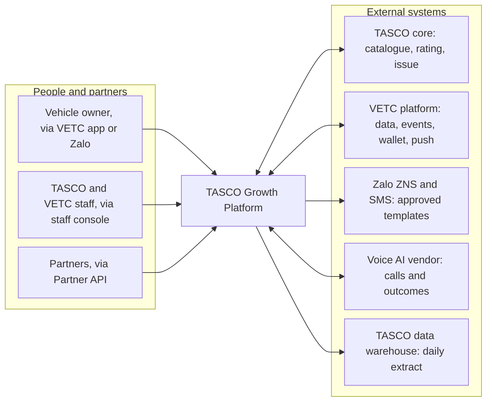
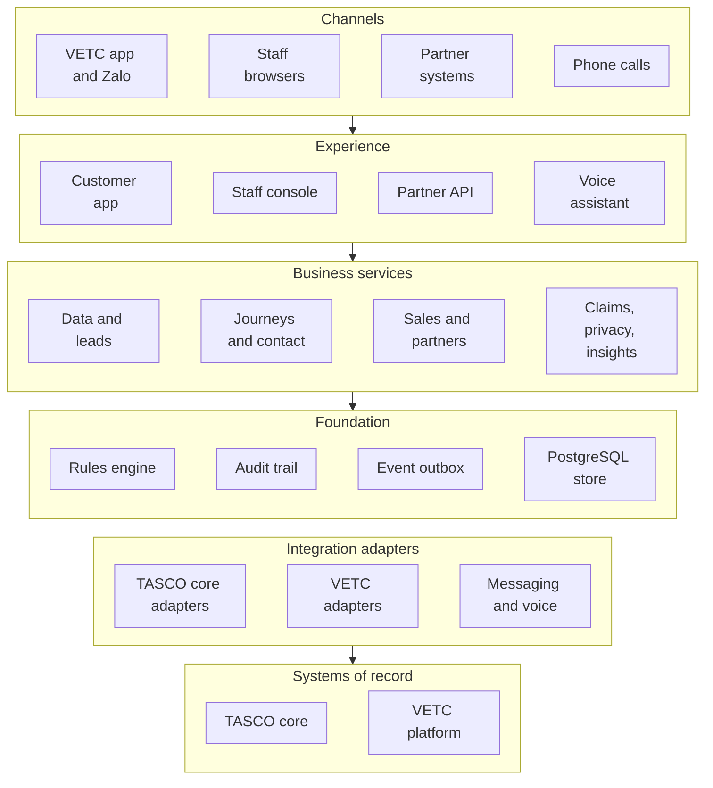
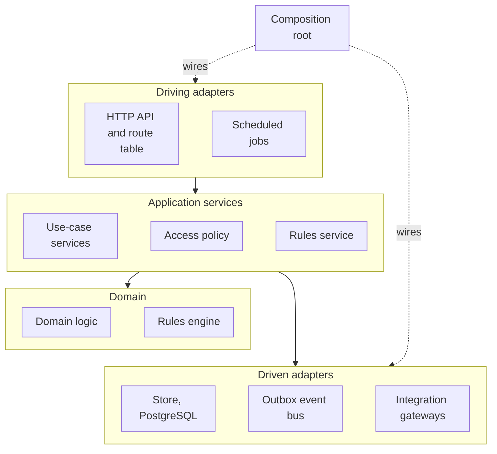
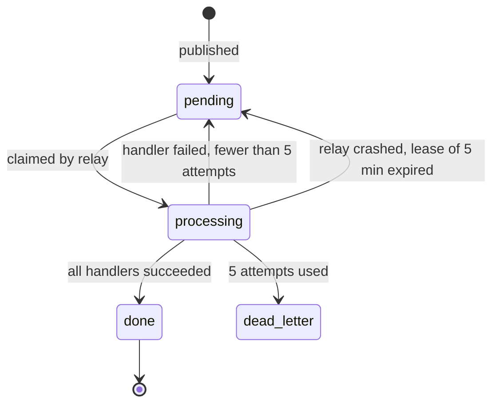
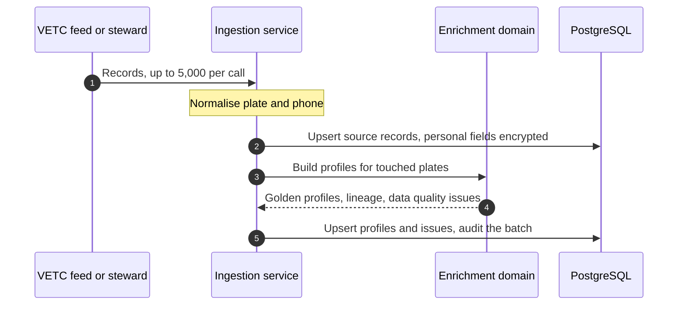
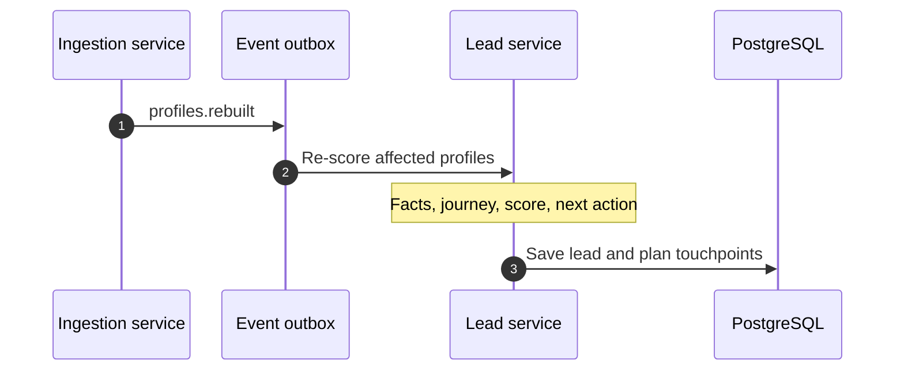
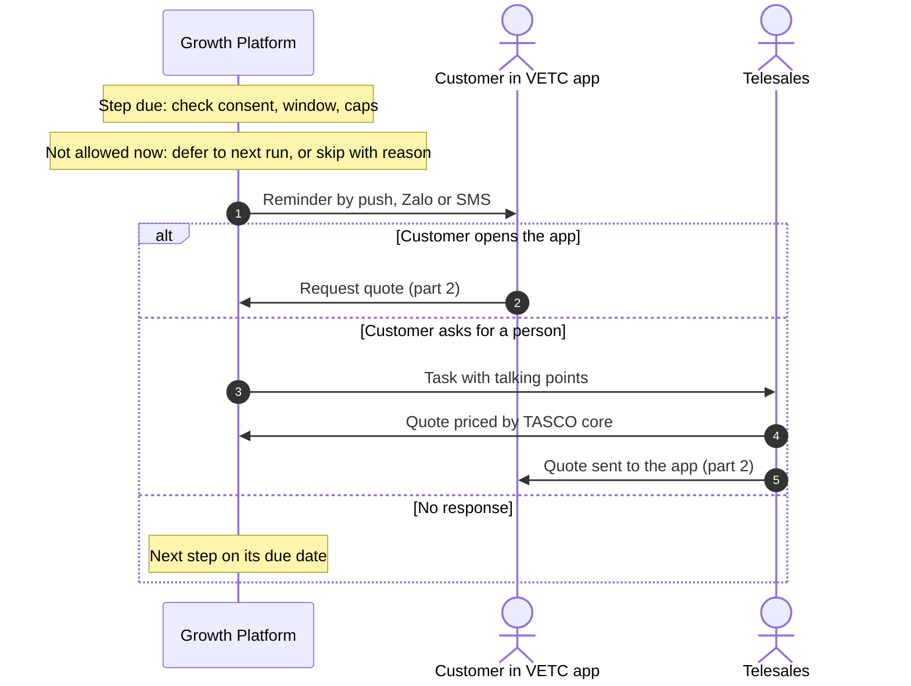
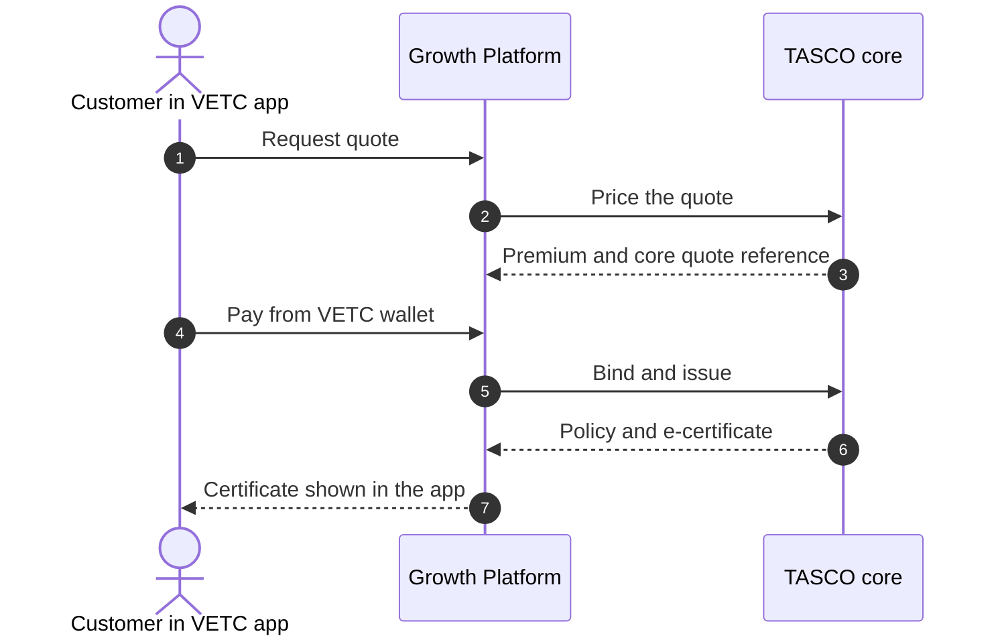
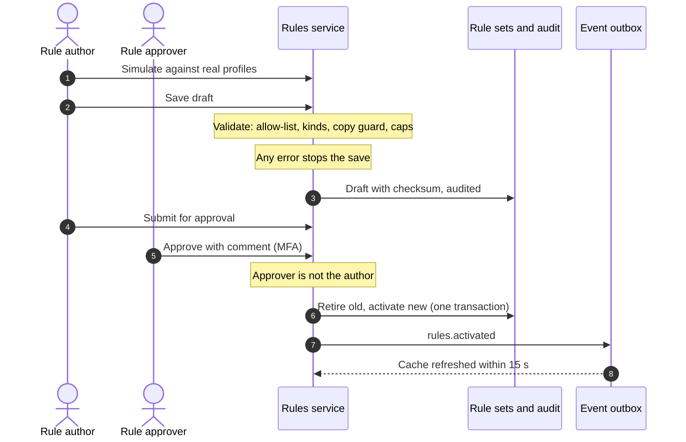

# Introduction

## Purpose

This document describes the architecture of the TASCO Growth Platform: the principles it follows, the context it operates in, its functional and technical structure, the main runtime flows and the quality targets it is built to meet. It is the entry point to the architecture set; the other architecture documents go deeper into one concern each.

## Scope

The scope is the platform as built in the codebase delivered with this submission (the application under `src/`, business rules under `config/`, database migrations under `db/`), together with the production design for TASCO's hosting in Vietnam. Where an external system is reached through a sandbox adapter today, this document says so. Business requirements and commercial terms are out of scope and are covered by the business documents.

## Audience

TASCO Insurance IT architecture, information security and delivery leads; VETC technical leads; the iorta TechNXT delivery team.

## Related documents

| ID | Title | Relationship |
|---|---|---|
| TGP-BUS-02 | Functional Requirements Specification | What the platform must do |
| TGP-BUS-03 | Non-Functional Requirements | Quality targets referenced in section 7 |
| TGP-ARC-02 | Integration Architecture | Contracts and sequences for every external system |
| TGP-ARC-03 | Data Architecture | Data model, golden record, retention |
| TGP-ARC-04 | Security Architecture | Threat model, access control, cryptography |
| TGP-ARC-05 | Deployment and Infrastructure Architecture | Environments, Kubernetes, PostgreSQL, CI/CD |
| TGP-ARC-06 | AI Governance | Voice assistant and scoring governance |
| TGP-ARC-07 | Architecture Decision Records | The decisions behind this design |

# Architecture principles

The platform follows eight principles. Each one is enforced by something concrete in the code or the delivery process, not only by intent.

| Principle | What it means in practice |
|---|---|
| TASCO core is the system of record | Products, rating and policies belong to TASCO core. The platform requests a price from core for every bindable quote and binds exactly that quote. It never sets a premium on its own authority in production. |
| Business rules are configuration | Tariffs, scoring, journeys, message templates, the voice script, consent policy and retention are versioned rule sets. A change is validated, approved by a second person and audited, without a software release. |
| Integrations sit behind ports | Each external system is reached through a defined interface with its own adapter. Replacing a voice vendor or an SMS provider means writing one adapter. |
| Every decision is explainable | Each lead score carries its factor reasons, each next-best action carries the rule that chose it, and each journey step records why a message was or was not sent. |
| Reuse before build | One set of customer services serves every front door: the VETC app, TASCO's app and website, a Zalo Mini App and partners such as Tasco360. TASCO core, the VETC wallet, TASCO's payment gateway, Zalo and the contact centre are reused through ports, not rebuilt. |
| Security and privacy by design | Deny by default, least privilege, field-level encryption of personal data, consent checks before every contact and a tamper-evident audit trail. |
| Small supply chain | One runtime dependency (the PostgreSQL driver). HTTP, cryptography, validation and metrics use the Node.js standard library. |
| Same behaviour everywhere | One container image for every environment. The in-memory store used in development shares encryption, filtering and audit-chain code with the PostgreSQL store. |

# Context

## Business context

VETC operates electronic toll collection for about 6 million vehicles and holds a plate, a phone number and engagement signals for each of them. Only about one record in ten carries a verified motor insurance certificate. TASCO Insurance wants to use this base to win new TNDS business, retain its own customers and work with the banks, showrooms, agents, fleets and inspection centres that close most TNDS sales today.

The TNDS premium is set by regulation, so price cannot be the lever (to be confirmed by TASCO legal against Decree 67/2023/ND-CP). The platform competes on data quality, timing, channel and service value, and it keeps every customer contact within consent and contact-policy limits.

## System context

The platform sits between the vehicle owner, TASCO and VETC staff, partners and the systems that hold products, policies, payments and channels. The diagram below shows who and what the platform talks to.

| Actor or system | Interaction with the platform |
|---|---|
| Vehicle owner | Uses the customer app inside the VETC app (web view) or from a Zalo message: checks cover, declares an expiry date, reviews and pays quotes from the VETC wallet, manages consent, reports a claim. |
| TASCO and VETC staff | Use the staff console across 13 roles: telesales, campaign, rules, compliance, data stewardship, claims, partner management, audit, operations and administration. Staff quote and send quotes; they never take payment. |
| Partners | Call the Partner API to quote and bind for their own customers. The partner collects the premium. |
| TASCO core | Master for the product catalogue and rating; binds and issues policies; supplies the policy book; receives claim notifications. |
| VETC platform | Supplies account and vehicle data and tag events, hosts the customer app as a web view, delivers push notifications and debits the VETC wallet with the customer's confirmation. |
| Zalo ZNS and SMS | Deliver pre-approved service and marketing templates. |
| Voice AI vendor | Places automated calls, provides Vietnamese speech recognition and text to speech, and speaks only approved script lines. |
| TASCO data warehouse | Receives a daily pseudonymised extract for reporting (scale phase). |

# Functional architecture

## Layered view

The platform is organised in six layers, from the channels customers and staff use down to the systems of record. Each row in the diagram is one layer.

## Capabilities

| Capability | What it does | Main components |
|---|---|---|
| Customer data and golden record | Lands records from VETC, partners and telesales lists, normalises plates and phones, and builds one profile per vehicle with field lineage and a data quality score | Ingestion service, enrichment domain |
| Lead intelligence | Scores each vehicle (explainable factors), assigns a journey and a next-best action, and selects relevant benefits | Lead service, leads domain |
| Journeys and contact policy | Plans and runs touchpoints on app push, Zalo ZNS, SMS, voice and telesales, within consent, contact window and frequency caps, with a copy guard on every message | Journey service, contact policy domain |
| Voice assistant | Runs governed automated calls with plate-first verification and hands interested customers to telesales | Voice service, dialogue domain |
| Sales | Quotes through TASCO core, sends quotes to the customer, takes payment only from the customer in the VETC app, issues policies and e-certificates | Sales, rating and catalogue services |
| Partners and commission | Onboards partners, issues API keys with scopes, records partner sales and computes commission within statutory caps | Partner service |
| Claims intake | Captures first notice of loss from the customer app and acknowledges it within the service level | Claims service |
| Identity, consent and privacy | Staff sign-in with MFA, role and attribute-based access, consent centre, data subject export and erasure | Identity service, access policy, customer service |
| Rules governance | Versioned rule sets with validation, simulation, maker-checker approval and rollback | Rules service, rules engine |
| Insights and operations | Business and governance dashboards, reconciliation, retention, job history and integration status | Insights and operations services |

# Technical architecture

## Ports and adapters

The application follows a hexagonal (ports and adapters) design, recorded in ADR-001 (TGP-ARC-07 Architecture Decision Records). Business logic sits at the centre and knows nothing about HTTP, databases or vendors. Application services coordinate that logic and reach the outside world only through ports. A single composition root decides which adapter implements each port.

The dependency rule is strict. Domain modules (`src/domain`) and the rules engine (`src/rules`) depend only on the shared kernel; they perform no input or output and read no clock, so they are tested deterministically. Application services (`src/application`) receive the store, rules, audit, event bus, clock and gateways as constructor arguments and never load an adapter themselves. Only `src/bootstrap/container.js` chooses adapters, for example the PostgreSQL store when a database URL is set.

## Layers and technology

| Layer | Contents | Technology |
|---|---|---|
| Presentation | Staff console, customer app, public certificate check | HTML5 and JavaScript modules, no third-party runtime, strict content security policy, design tokens. Console in Vietnamese and English, customer app in Vietnamese. |
| API | REST operations described in OpenAPI 3.1, generated from the route table; rate limiting, idempotency keys, input validation | Node.js 22 standard HTTP server |
| Application | Ingestion, leads, journeys, voice, sales, rating, catalogue, partners, claims, customers, identity, rules, insights, operations, audit | Node.js 22 |
| Domain | Plate and phone normalisation, golden record, scoring, rating fallback, contact policy, dialogue | Pure JavaScript, no dependencies |
| Rules | JSON Logic subset and decision tables; 21 rule kinds, validated, simulated and approved before use | Built in, no code evaluation |
| Persistence | One table per collection: document column plus typed indexed columns; optimistic locking; AES-256-GCM field encryption; blind index for phone search | PostgreSQL 16 |
| Messaging | Transactional outbox with a relay that claims events using `FOR UPDATE SKIP LOCKED` | PostgreSQL |
| Integration | Adapters with timeouts, retries, circuit breakers and idempotency keys | REST over TLS, OAuth 2.0 client credentials, mutual TLS where required |
| Operations | Health checks, Prometheus metrics, JSON logs, scheduled jobs | Kubernetes CronJobs |

The API exposes 81 operations at the time of writing: 6 public, 61 staff, 10 customer and 4 partner. Every non-public operation declares its audience and permission in the route table, and the OpenAPI document is generated from the same table (ADR-010).

## Ports and current adapters

The table lists each port, the adapter used in development and UAT today, and the production adapter. TGP-ARC-02 Integration Architecture gives the full contracts.

| Port | Purpose | Adapter today | Production adapter | Status |
|---|---|---|---|---|
| CoreRating | Price a quote | Simulated TASCO core | TASCO core REST client | Client built; paths assumed |
| ProductCatalogue | Fetch products | Simulated TASCO core | TASCO core REST client | Client built; paths assumed |
| PolicyAdministration | Bind, issue, cancel | Sandbox core gateway | TASCO core API | Sandbox |
| PaymentGateway | Wallet debit and refund | Sandbox VETC wallet | VETC wallet API | Sandbox |
| NotificationChannel | Push, Zalo ZNS, SMS | Sandbox gateways | VETC push, Zalo, SMS provider | Sandbox |
| Telephony | Automated calls | Simulated caller | Voice AI vendor | Sandbox |
| SourceFeed | VETC data | Synthetic source and ingest API | VETC files and CDC | API built |
| Store | Persistence | PostgreSQL (in-memory for development) | Managed PostgreSQL | Built |
| EventBus | Domain events | PostgreSQL outbox | Same, broker later | Built |

## Runtime processes

All processes run from one container image with different commands.

| Process | Command | Responsibility | Scaling |
|---|---|---|---|
| API server | `node src/server.js` | All synchronous APIs, static front end, health and metrics endpoints; runs the outbox relay every second | Stateless, horizontal (autoscaled) |
| Scheduled jobs | `node src/jobs/cli.js <job>` | Journeys, nightly re-scoring, reconciliation, retention, outbox relay safety net, catalogue sync | One pod per run, no overlap |
| Migration job | `node src/jobs/cli.js migrate` | Applies numbered SQL migrations under an advisory lock before each release | One pod per release |

## Event-driven reactions

Reactions that must not slow the caller, such as re-scoring, confirmations and cache refresh, run as domain events through a transactional outbox (ADR-005). An event is written to the `domain_events` table and a relay in each API pod claims pending events with `FOR UPDATE SKIP LOCKED`, so several pods can relay safely. Each subscriber is named; on a retry only the failed subscribers run again. After five failed attempts the event moves to a dead letter state and raises an alert. Delivery is at least once, so every handler is written to be safe on repeat.

The diagram shows the states an event moves through.

| Event | Raised when | Reactions |
|---|---|---|
| `profiles.rebuilt` | An ingestion batch rebuilds profiles | Re-score the affected leads |
| `lead.recompute_requested` | Consent change, declared expiry, opt-out, ecosystem trigger | Re-score the lead and re-plan its journey |
| `policy.issued` | An order completes | Stop renewal journeys; send the purchase confirmation; plan cross-sell if marketing consent exists |
| `renewal.link_requested` | A customer asks for a link on a call | Send the renewal link (push, then Zalo, then SMS) |
| `handoff.created` | A call ends with a request to talk to a person | None yet; target is a dialler or CTI queue |
| `claim.submitted` | A customer reports a claim | Send the claim acknowledgement with the service level; target is the TASCO core claims notification |
| `rules.activated` | A rule set is approved | Refresh the rules cache |

## Configurability

Business behaviour lives in 21 rule kinds, seeded from `config/rules` as version 1 and changed only through the rules studio with maker-checker approval (ADR-003). Code changes are needed only for a new rating method, a new dialogue state, a new rule operator or a new integration. Role-to-permission mapping is deliberately not a rule kind: it changes through code review and the change advisory board.

| Rule kind | What it controls | Business owner | Approver |
|---|---|---|---|
| Products | Catalogue, channels, rating method, bundles | Product | Rule approver |
| Tariffs (TNDS car, TNDS motorbike) | Regulated premiums and VAT, used only as the indicative fallback | Underwriting and Compliance | Rule approver |
| Rating (physical damage, personal accident per seat) | Illustrative voluntary rates for sandbox and fallback | Actuarial | Rule approver |
| Commission | Partner commission and statutory caps | Finance and Legal | Compliance officer only |
| Enrichment | Source trust, expiry evidence, category table, data quality weights | Data office | Rule approver |
| Scoring | Factor weights, tiers, damping | Growth analytics | Rule approver with model-risk review |
| Next-best action | Decision table for the next action | Campaign | Rule approver |
| Journeys | Audiences, steps, channels, cross-sell | Campaign | Rule approver |
| Triggers | VETC events to journey actions | Campaign | Rule approver |
| Benefits | Service value catalogue; only legally approved items reach customers | Product and Legal | Rule approver |
| Message content | Message templates in Vietnamese and English | Marketing and Compliance | Rule approver |
| Voice script | Bot lines and intent keywords | Customer experience and Compliance | Rule approver |
| Copy guard | Banned phrases such as discounts or rebates on regulated products | Compliance | Compliance officer only |
| Contact policy | Contact window, frequency caps, consent per channel | Compliance and DPO | Compliance officer only |
| Access attributes | Region and ownership policies | Information security | Compliance officer only |
| Retention | Retention period and action per entity | DPO and Legal | Compliance officer only |
| Service levels | Quote validity (24 h), claim acknowledgement (4 h), evidence confidences | Operations and Data office | Rule approver |
| Referral | Referral programme, disabled pending legal review | Product and Legal | Rule approver |
| Costs | Unit costs for the business case dashboard | Finance | Rule approver |

Validators reject a rule set before it can be saved if, for example, scoring weights do not add up to 100, a commission rate exceeds its statutory cap or a customer-facing string contains a banned phrase. The database allows only one active version per kind, and approval swaps versions in a single transaction. Each API pod caches active rules for 15 seconds.

# Key flows

This section shows the flows that cross several services. The system-level sequences with external systems (rating and issuance through TASCO core, wallet payment with refund, catalogue sync, partner quote and bind, and voice handoff) are in TGP-ARC-02 Integration Architecture.

## From data to next-best action

A VETC batch, a partner record or a steward correction lands as source records, rebuilds the affected profiles and re-scores their leads. The two sequences show one ingestion batch: first the profile rebuild, then the re-scoring that the rebuild triggers.

The rebuild is incremental by plate, in chunks of 500. Facts captured on the platform (a customer's declared expiry, a steward's correction, a TASCO-issued policy) survive a rebuild when they carry higher confidence. A vehicle with an active TASCO policy gets the action "insured" and its renewal journey is cleared.

## Renewal journey, end to end

The sequences show a renewal from the first reminder to an issued policy, with the three paths a customer can take: buy in the app, ask for a person, or not respond. The first shows the reminder and the response; the second shows the quote, payment and issuance that both buying paths end in.

Each journey step is checked against consent, the do-not-contact flag, the 08:00 to 20:00 contact window and the daily and weekly caps. A step blocked only by the window stays scheduled for the next run. The voice assistant can stand in for the telesales call when the customer has call consent; its handoff path is in TGP-ARC-02 Integration Architecture.

## Rule change with maker-checker

Every rule change is validated, submitted by its author and approved by a different person before it takes effect.

Restricted kinds (commission, copy guard, contact policy, access attributes and retention) can be approved only by a compliance officer. Rollback creates a new draft from an earlier version, which goes through approval again.

## VETC ecosystem events

VETC events such as a tag activation, an inspection booking, a wallet top-up or a long trip are matched against the trigger rules. A tag activation enrols the vehicle in the new-vehicle journey; the other triggers send a service or marketing message when the vehicle is near expiry, always through the contact policy and copy guard. Today the events arrive through a staff-authenticated API; the production transport is described in TGP-ARC-02 Integration Architecture.

# Quality attributes

## Targets

| Attribute | Target | How the design meets it |
|---|---|---|
| Availability of the purchase path | 99.9% monthly | At least two API pods across zones, pod disruption budget, readiness gated on the database, graceful drain on shutdown |
| API response time | 95th percentile under 300 ms for reads; purchase dominated by wallet and core latency | Indexed column filters, 15 s statement timeout, integration timeouts and circuit breakers |
| Recovery point and time | RPO 15 minutes or less, RTO 4 hours or less | Managed PostgreSQL with synchronous standby, point-in-time recovery, cross-region replica; detail in TGP-OPS-03 Disaster Recovery and Business Continuity Plan |
| Rule change lead time | One working day from draft to active | Rules studio with validation, simulation and maker-checker |
| Explainability | Every score carries factor reasons; every next action carries its rule | Leads domain stores reasons and rule identifiers |
| Auditability | Every state-changing action audited; chain verifiable on demand | Hash-chained audit trail with database triggers (ADR-008) |
| Price integrity | No payment against a price TASCO core has not confirmed | Indicative quotes blocked until re-rated; core quote reference passed at issuance (ADR-013) |

## Scalability

The application tier is stateless, so capacity grows by adding pods. The database is the main scaling concern and has been designed for: indexed columns for every query path, paging for large result sets, batch ingestion in chunks, background jobs for journeys and events, and a read replica for reporting at full scale.

| Measure | Today (single instance) | Pilot target | Full-scale target |
|---|---|---|---|
| API throughput | 337 requests per second | 50 per second sustained | 300 per second sustained |
| API response time, 95th percentile | 103 ms | Under 300 ms | Under 300 ms |
| Vehicles under management | Synthetic test set | 100,000 | 6 million |
| Daily journey evaluations | Not measured | 100,000 | 6 million |
| Ingestion | 5,000 records per batch | Initial load within one day | Full base within one weekend |

The load smoke test was run on 08/10/2026 with one process and 25 concurrent clients: 3,063 requests, p95 195 ms against a 300 ms budget, with no errors. Full-scale capacity will be proven in pre-production during the scale phase (TGP-QA-03 Performance and Capacity Test Plan).

The following changes are planned before the base grows beyond the pilot. None of them changes the public interfaces.

| Concern | Today | Before full scale |
|---|---|---|
| Golden record build | Incremental rebuild by plate in 500-plate chunks | Initial load through a staging table with parallel workers partitioned by plate hash |
| Nightly re-scoring | Offset paging over all leads | Keyset paging, sharded across workers, limited to profiles whose journey window changes |
| Journey execution | Pages through all due touchpoints; runs must not overlap | Workers claim touchpoints with `SKIP LOCKED`; automated calls become asynchronous |
| Table growth | Indexed columns per collection | Monthly partitions for messages, touchpoints and events; purge of completed events after 30 days |
| Reporting load | Dashboards on the primary | Dashboards and extracts on a read replica; incremental audit-chain verification |
| Outbound volume | One circuit breaker per channel | Per-channel queues with provider rate limits |

# Constraints and assumptions

| ID | Constraint or assumption | Impact | Owner |
|---|---|---|---|
| CA-01 | TASCO core rating and catalogue paths in the production client are assumptions until TASCO's interface specification arrives | Only the adapter mapping changes | TASCO IT Architecture |
| CA-02 | Policy issuance, VETC wallet, push, Zalo ZNS, SMS and voice use sandbox adapters until provider test systems are available | Real adapters are built and tested in SIT | iorta TechNXT with each provider |
| CA-03 | If TASCO core cannot expose a rating API in time, the platform rates from tariff tables synchronised from core and core re-rates at issue, rejecting any mismatch | Interim path, confirmed in the first two weeks | TASCO IT Architecture |
| CA-04 | Production personal data is hosted and processed in Vietnam | Hosting choice; UAT on Railway holds synthetic data only | TASCO IT, to be confirmed by TASCO legal |
| CA-05 | VETC confirms wallet debits with the wallet holder according to its payment rules | May make payment confirmation asynchronous | VETC |
| CA-06 | Staff authenticate locally with MFA until the TASCO identity provider is integrated | OIDC federation in the scale phase (ADR-007) | TASCO IT |
| CA-07 | Regulatory positions (TNDS premium, consent, call rules, data transfer) follow current law | Positions applied as rule changes once confirmed | To be confirmed by TASCO legal |

# Evolution path

The platform is designed to grow in stages without changing its core structure.

| Phase | Main changes | What stays the same |
|---|---|---|
| Pilot and UAT (now) | Sandbox adapters behind ports; local sign-in with TOTP; outbox in PostgreSQL; keyword intent matching for the voice assistant; Railway UAT | Ports, rule kinds, data model |
| Production go-live | Real adapters for TASCO core, VETC wallet and push, Zalo ZNS, SMS and the voice vendor; Kubernetes in Vietnam; shared logout list and partner quotas at the gateway; automatic refund retry | Application and domain code |
| Scale phase | VETC CDC feed; monthly partitions and read replica; OIDC to the TASCO identity provider and VETC SSO; data warehouse feed; message broker behind the event bus port; tracing | Event publishers and subscribers |
| Intelligence | Optional language-model intent classifier behind the classifier port; propensity model alongside the rules-based score, with fairness and drift monitoring (TGP-ARC-06 AI Governance) | Governed script and dialogue state machine |

# Appendix

## Source map

| Layer | Path | Contents |
|---|---|---|
| Shared kernel | `src/shared/` | Configuration, logger with PII redaction, cryptography, validation, resilience, metrics, errors, clock |
| Rules engine | `src/rules/` | JSON Logic subset, decision tables, per-kind validators |
| Domain | `src/domain/` | Identity, enrichment, leads, rating, contact policy, voice dialogue |
| Application | `src/application/` | One service per use-case area, access policy, rules service |
| Composition root | `src/bootstrap/container.js` | Adapter selection, wiring, event subscribers |
| Persistence | `src/adapters/persistence/` | Collection registry, codec, PostgreSQL and in-memory stores, audit chain |
| Messaging | `src/adapters/messaging/` | Outbox event bus |
| Integrations | `src/adapters/integrations/` | TASCO core REST client, simulated core, sandbox gateways, simulated caller, synthetic VETC source |
| HTTP | `src/adapters/http/` | Request pipeline, route table, router, OpenAPI generator, security headers |
| Processes | `src/server.js`, `src/jobs/cli.js` | API server and batch jobs |
| Configuration | `config/rules/`, `config/security/rbac.json` | Rule kinds; roles, separation of duties, restricted rule kinds |
| Schema | `db/migrations/` | Collection tables, audit log, integrity hardening |
| Deployment | `Dockerfile`, `deploy/k8s/`, `railway.json`, `.github/workflows/ci.yml` | Image, manifests, UAT hosting, pipeline |
