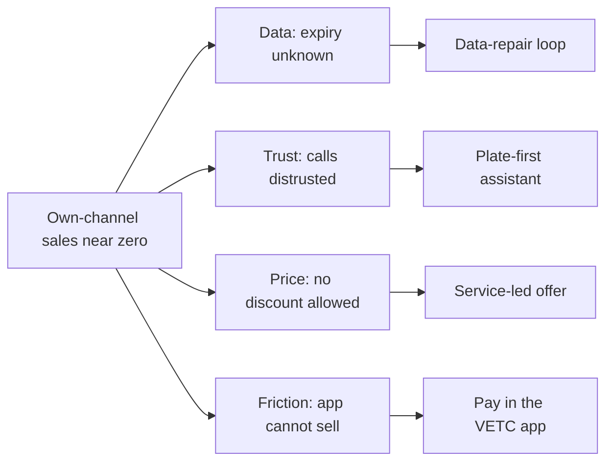
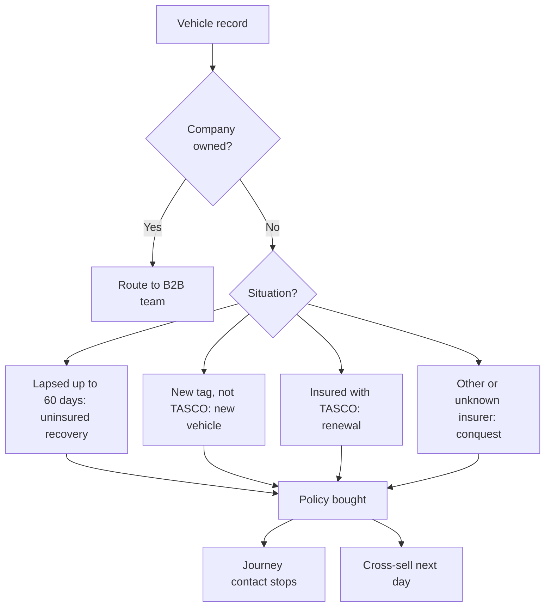
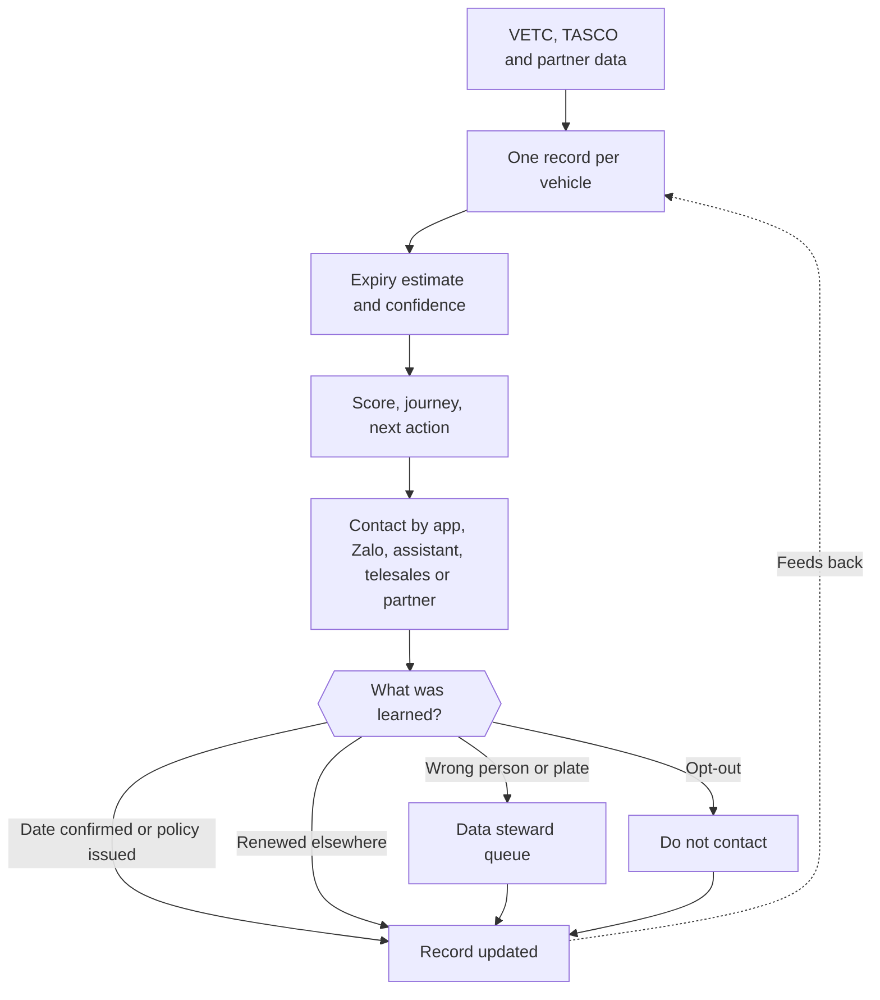
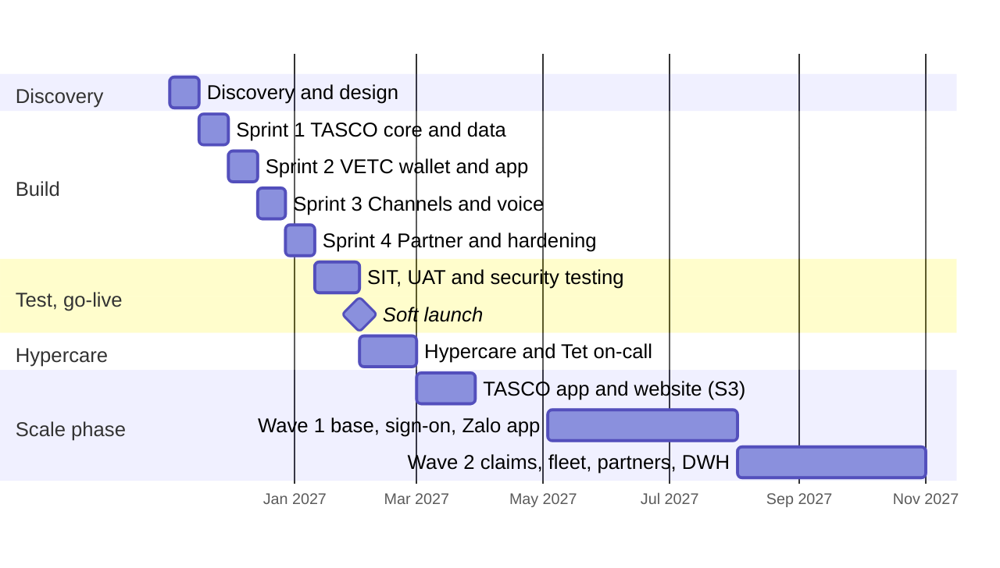
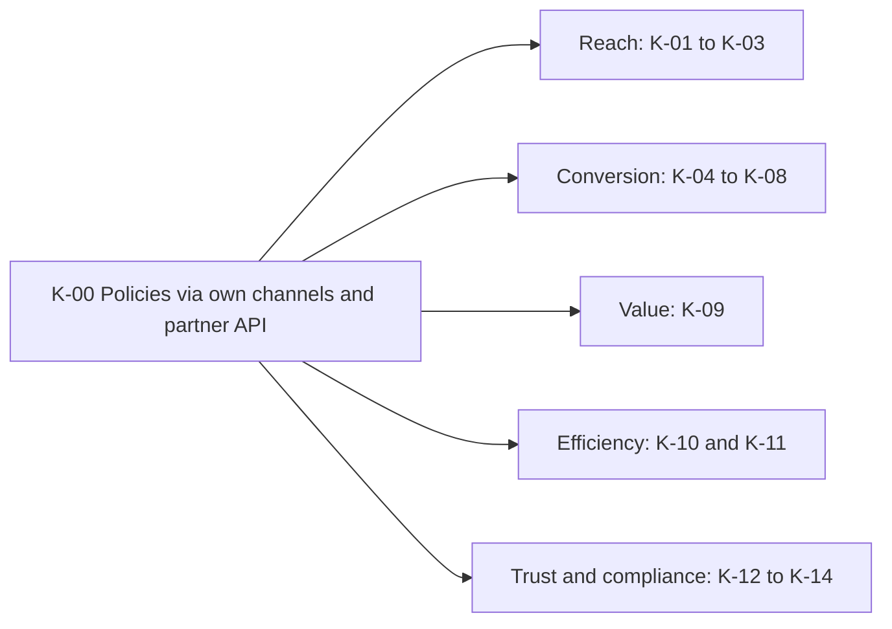

# Introduction

## Purpose

This document sets out why TASCO Insurance sells almost no motor policies through its own channels today, and the growth strategy the TASCO Growth Platform is built to deliver. It covers the target segments, the channel, value, trust and data strategies, the roadmap, the KPIs and an illustrative business case.

## Scope

The strategy covers compulsory motor third-party liability insurance (TNDS) for cars and motorbikes, personal accident cover per seat and physical damage cover, sold to the VETC driver base through the VETC app, Zalo, SMS, an AI voice assistant, telesales and partners. It covers new business as well as renewals. Claims handling beyond the first notice of loss stays in TASCO core.

Statements about TASCO, VETC and the market come from the client brief. Statements about the platform describe the software running today in the UAT environment. Every other figure is an assumption, labelled A-nn and listed in the Assumptions register section. All financial figures are illustrative until replaced with TASCO data during discovery.

## Audience

TASCO Insurance and VETC executives, the steering committee, the TASCO product owner and the distribution, finance and compliance teams.

## Related documents

| ID | Title |
|---|---|
| TGP-BUS-02 | Functional Requirements Specification |
| TGP-BUS-03 | Non-Functional Requirements |
| TGP-BUS-05 | Requirements Traceability Matrix |
| TGP-BUS-06 | Personas and Customer Journeys |
| TGP-BUS-07 | Commercials and Engagement Model |
| TGP-ARC-02 | Integration Architecture |
| TGP-DEL-04 | Risk Register |

# Executive summary

VETC, the electronic toll collection operator of the Tasco group, serves about 6 million car drivers, and 70 to 80% of them use the VETC app. Every one of those drivers must hold TNDS cover. Today TASCO sells motor insurance mainly through agents, banks, car showrooms and corporate partners. Its own channels (app push and telesales) are small, and no renewals have been closed through them this year.

Demand is not the problem. TNDS is compulsory and drivers need a valid certificate at inspection (đăng kiểm) and at roadside checks. Own-channel sales are close to zero for four reasons that reinforce each other:

1. Data. Only about one record in ten carries a reliable expiry date, so TASCO does not know when most drivers need to renew.
2. Trust. Drivers screen out unknown callers offering insurance.
3. Price. TNDS premiums are set by regulation and discounts are not permitted, yet most customers wait for one.
4. Channel friction. The VETC app cannot complete a purchase, so a partner closes the sale.

The TASCO Growth Platform addresses all four together. It competes on data, trust and service, never on price, and it covers new business as well as retention.

| Lever | What the platform does |
|---|---|
| Data-repair loop | Merges records from all sources into one profile per plate, estimates the expiry date with a stated confidence and improves the record with every contact |
| Explainable prioritisation | Scores every vehicle from 0 to 100 with plain-language reasons and chooses a next best action and journey |
| Trust-first contact | The voice assistant says it is automated, asks the driver to state the plate before anything else and never takes payment |
| Purchase in the VETC app | A signed link opens a quote priced by TASCO core; the customer pays from the VETC wallet and receives the e-certificate within seconds |
| Value beyond discount | Roadside assistance, a QR-verifiable e-certificate, inspection reminders, accident reporting in the app and multi-year cover |
| Partners as a channel | A partner API to quote and bind by plate, with commission capped by rule; partners collect the premium and remit it to TASCO |

In the illustrative base case, own channels and the partner API issue about 140,000 TNDS policies in the first year at full scale, worth about VND 79.4 billion of net premium (USD 3.05 million). Cross-sell adds about VND 6.9 billion. The voice assistant does the qualifying work for about VND 1.2 billion, against about VND 13.4 billion for the same calls by telesales.

We recommend a fixed-price MVP of USD 94,800 within TASCO's USD 100,000 budget, live with a pilot cohort 13 weeks after contract signature. The pilot should cover 50,000 to 100,000 vehicles in one or two provinces, measured against a control group, so that the decision to scale rests on measured conversion, data repair and trust.

# Market and context

## The parties

| Party | Role | Relevance to the strategy |
|---|---|---|
| TASCO Insurance | Non-life insurer, subsidiary of Tasco Joint Stock Company, which acquired Groupama Vietnam General Insurance in 2022 | Carries the risk, owns products, tariffs, rating, policies and claims |
| Tasco JSC | Group parent | Owns both TASCO Insurance and VETC, so the group already holds a captive distribution opportunity |
| VETC | Electronic toll operator with a wallet. About 6 million car drivers; 70 to 80% use the app | Owns the driver relationship, the app, the wallet, trip signals and tag activation events |
| Other insurers on VETC | VETC is a multi-insurer platform (TASCO, PVI and PTI through ADD Solutions) | TASCO must earn the customer's choice through service and respect VETC's neutrality |
| Partners | Agents, banks, car showrooms, corporate and fleet accounts | Close most sales today; the strategy equips them rather than displacing them |

## Product and regulatory frame

TNDS is compulsory and its price is regulated. The platform's tariff tables carry the annual premiums from Decree 67/2023/ND-CP Appendix I, for example VND 437,000 plus 10% VAT, VND 480,700, for a non-commercial car under 6 seats. In production TASCO core prices every quote; the platform's tables are used only for indicative quotes when core is unavailable and for testing. TASCO underwriting must confirm the figures before go-live.

Premium discounts and rebates are prohibited under the Law on Insurance Business 08/2022/QH15, so the platform competes on service and convenience. Partner commission is capped by law; the platform holds caps per product (for example 5% of net premium for TNDS), to be confirmed by TASCO finance and legal.

Contact and privacy obligations come from the advertising and spam rules (Decree 91/2020/ND-CP), Decree 13/2023/ND-CP on personal data protection and the Personal Data Protection Law 91/2025/QH15, effective 1 January 2026. The platform applies them conservatively through its contact policy and retention rules. Each position is to be confirmed by TASCO legal.

## Strategic assets

| Asset | Owner | How the platform uses it |
|---|---|---|
| 6 million driver relationships, 70 to 80% app reach | VETC | Primary reach; an app push costs nothing to send |
| ETC tag activation events | VETC | Signals a new vehicle and starts the new-vehicle journey |
| Toll trips, long trips, app sessions | VETC | Drive the engagement score and the relevance of benefits |
| VETC wallet and auto top-up | VETC | Payment in the app; "wallet covers the premium" is a buying signal |
| Inspection booking | VETC service | A moment when a valid TNDS certificate is required |
| Products, rating, policies, e-certificates, claims | TASCO core | Every quote is rated and every policy issued by core; certificates are QR-verifiable |
| Partner network | VETC and TASCO | Partner API, commission statements |

## TASCO's digital channels today

| Channel | What it does today | Role in the strategy |
|---|---|---|
| e.baohiemtasco.vn | Online TNDS purchase for cars; asks business use, vehicle type, seats and phone. Physical damage is marked "coming soon". | Stays the open web channel. It prices from the same core, so premiums match the VETC app. Physical damage with inspection, delivered in the MVP, can be offered there later. |
| Tasco360 | TASCO's app for partners and stakeholders: consultation, sales and after-sales | Becomes a consumer of the partner API, so partners quote by plate with VETC vehicle data and receive instant certificates |
| Hotline 1900 1562, info@baohiemtasco.vn, Zalo, Messenger, website chat | Claims, support and enquiries | The same official contacts appear in the customer app, so every touchpoint speaks with one TASCO voice |

These channels serve customers who come looking for TASCO. What they cannot do is find the right VETC driver at the right moment. That is the job of the platform.

# Why own-channel sales are close to zero

## Symptoms reported in the brief

- Only about one record in ten has a valid policy stamp.
- No renewals were closed through own channels this year.
- Telesales converts poorly: customers distrust sales calls, discounts are illegal, partners close faster and the app cannot renew.
- Most customers look for a percentage discount.

## Root causes and design responses

The diagram below links each of the four causes to the platform's main response.

| Ref | Root cause | Design response |
|---|---|---|
| RC-1 | Expiry date unknown or unreliable for most vehicles | Expiry estimated from evidence with a confidence score; vehicles below the usable threshold are asked to confirm their expiry before any selling |
| RC-2 | Duplicate, inconsistent records from many sources | Plate and phone normalisation; one record per plate; the most trusted source wins; field-level lineage |
| RC-3 | No way to capture what customers tell us | Customer confirms expiry in the app; the assistant records "already renewed", the insurer and the next date; a TASCO issuance sets confidence to 1.0 |
| RC-4 | Distrust of calls | Automated-assistant disclosure, plate-first verification, a "VETC never asks for OTP or payment" statement, a scam-concern script, payment only in the app |
| RC-5 | No independent proof of cover | Public certificate verification by QR, with no personal data shown |
| RC-6 | Price-only mindset | Benefits ranked by relevance to each driver; the assistant answers price truthfully and moves to service value |
| RC-7 | Buying is harder than through a partner | Signed link, quote priced by TASCO core, VETC wallet payment, e-certificate; telesales send quotes to the app for the customer to pay |
| RC-8 | Partners hold the point of sale | Partner API to quote and bind by plate, with transparent commission |

# Growth strategy

TASCO asked us not to limit the scope to TNDS renewals. The strategy therefore treats the VETC base as a portfolio of segments, each with its own objective, journey and economics. Each vehicle is placed in the first matching journey by priority, and all contact stops as soon as the vehicle is insured with TASCO.

## Segments

| Ref | Segment | Definition | Objective | Journey |
|---|---|---|---|---|
| SEG-1 | Uninsured or lapsed | Expiry passed within the last 60 days, confidence at least 0.5 | New business | Uninsured recovery (priority 1) |
| SEG-2 | New vehicle | Tag activated in the last 60 days, insurer not TASCO | New business | New vehicle (priority 2) |
| SEG-3 | TASCO renewal | Current insurer is TASCO | Retention | Renewal, TASCO book (priority 3) |
| SEG-4 | Conquest | Insured elsewhere or insurer unknown | New business | Conquest, other insurer (priority 4) |
| SEG-5 | Cross-sell | Bought TNDS only and gave marketing consent | Cross-sell | Cross-sell, one day after purchase |
| SEG-6 | Fleet | Company-owned vehicle | New business and retention | Routed to the B2B team |
| SEG-7 | Partner-led | Sold by a bank, showroom, agent, fleet operator or inspection centre | New business | Partner API |

The diagram shows how a vehicle reaches a journey. Separately, a vehicle whose expiry confidence is below 0.5 receives "Ask customer to confirm expiry" as its next best action, so data repair comes before selling.

## Plays by segment

| Segment | Why they buy here | Lead message | Channel order | Escalation |
|---|---|---|---|---|
| SEG-1 Lapsed | Legal exposure; inspection blocked without TNDS | Lapsed notice (service) | Push, Zalo, SMS | Assistant at day 2 (hot or warm); telesales at day 5 (hot) |
| SEG-2 New vehicle | First weeks in the ecosystem | Welcome; confirm expiry | Push, Zalo | Value reminder at day 14 |
| SEG-3 Renewal | Already a TASCO customer | First, urgent and expiry-day reminders | Push, Zalo, SMS | Assistant at 14 days before expiry (hot or warm); telesales at 3 days (hot) |
| SEG-4 Conquest | Same regulated price, better service | Conquest and value reminders | Push, Zalo, SMS | Assistant at 14 days before expiry (hot only) |
| SEG-5 Cross-sell | TNDS covers only third parties | Cross-sell | Push, Zalo | None; marketing consent required |
| SEG-6 Fleet | One view and one VAT invoice | Account management | B2B team | None |
| SEG-7 Partner | Partner closes faster with VETC data | Partner's own front end | Partner API | Commission |

## Moments of truth from the VETC ecosystem

Calendar reminders are reinforced by VETC events, when a driver is most receptive.

| VETC event | Condition | Action | Marketing |
|---|---|---|---|
| Tag activated | None | Enrol in the new-vehicle journey | No |
| Inspection booked | Expiry less than 60 days away | TNDS check message by push or Zalo | No (service) |
| Wallet topped up | Expiry within 30 days either side | First reminder by push while the customer is in the app with funds | Yes |
| Long trip started | Lapsed up to 60 days | Value reminder by push | Yes |

In the MVP the tag-activation event is connected live; the other events are handled by the platform and can be simulated from the staff console until VETC's live event feed is connected in the scale phase.

# Channel strategy

## Principle

Partners close most TNDS sales because they are present at the moment of need: a car purchase, a loan, an inspection. Competing with them at that moment is slow and damages the relationship. TASCO should own the moments partners do not see (renewal timing, in-app moments, lapsed vehicles) and equip partners with VETC data and instant TASCO issuance for the moments they do own.

## Channel roles

| Channel | Role | Cost per contact | Consent needed |
|---|---|---|---|
| VETC app push | Primary reminder; purchase in the app | VND 0 | Marketing consent for marketing messages |
| Zalo ZNS | Secondary reminder from the official account | VND 300 | Marketing consent for marketing messages |
| SMS brandname | Fallback for phone-only contacts | VND 700 | Marketing consent for marketing messages |
| AI voice assistant | Qualify, verify the plate, capture data, hand off or send a link | VND 2,400 per call (VND 1,500 a minute, 1.6 minutes) | Call consent (and marketing) |
| Telesales | Close hot leads by sending the quote to the VETC app | VND 27,000 per call (VND 6,000 a minute, 4.5 minutes) | Call consent (and marketing) |
| Partner API, including Tasco360 | Partner-originated new business | Commission (TNDS 5% of net premium) | Obtained by the partner |

Service messages, such as the lapsed notice, the expiry-day notice, a purchase confirmation or a link the customer asked for, are exempt from frequency caps but still respect do-not-contact and channel availability. Marketing contact is limited to 08:00 to 20:00 Vietnam time, one message a day and three a week, with at most two call attempts a week. A touchpoint blocked only by the contact window is deferred to the next run inside the window, not skipped.

## Channel waterfall

For each touchpoint the platform tries the step's channels in order and sends on the first permitted channel that succeeds. It records why any channel was blocked. Low-cost digital channels therefore always go first, and calls are reserved for hot and warm leads.

## Partner enablement

| Capability | Business value |
|---|---|
| Onboard a partner by type: bank, showroom, agent, fleet, inspection centre | Partner growth without IT projects |
| Issue or revoke an API key, shown once and stored only as a hash | Secure system-to-system integration |
| Quote by plate; unknown vehicles join the base as new business | Every partner sale also enriches the VETC base |
| Bind a quote; the partner collects the premium, no VETC wallet debit | Instant e-certificate at the counter |
| Partner's own policies and commission statement | Transparent commission, fewer disputes |
| Commission by product and partner type, capped at the statutory cap | Compliance by construction |

# Value beyond discount

Price cannot move, so the proposition is built from service, convenience and relevant cover. The platform ranks benefits by relevance to each driver, explains why in plain language and shows customers at most three. Only benefits approved by TASCO legal and available today reach customers. Roadmap items and items pending legal review are shown to staff only, and are flagged.

| Benefit | Type | Personalisation signal | Status |
|---|---|---|---|
| 24/7 roadside assistance (Cứu hộ giao thông 24/7) | Service | Long trips over 90 days, toll trips | Approved |
| Instant e-certificate with QR check | Service | All customers | Approved |
| Inspection reminder and booking | Service | Expiry inferred from the inspection cycle | Approved; booking integration in the scale phase |
| Claims fast lane: accident reporting in the app | Service | Toll trips | Approved |
| Multi-year cover (two or three years at the regulated pro-rata premium) | Convenience | Wallet balance above VND 1 million; individuals only | Approved |
| Protect your passengers (personal accident cover per seat) | Cover upgrade | Seven seats or more | Approved |
| Cover damage to your own car (physical damage cover) | Cover upgrade | Vehicle five years old or less | Approved; inspection required before payment |
| Never-lapse auto renewal, confirm before debit | Service | Wallet auto top-up | Roadmap; staff view only |
| Fleet renewal dashboard and consolidated VAT invoice | Service | Company owner | Roadmap; staff view only |
| VETC loyalty points (non-cash) | Loyalty | App sessions | Pending review by TASCO legal |

Three guardrails apply. First, a copy guard blocks discount language in every customer message: "giảm giá", "chiết khấu", "hoàn tiền", "khuyến mãi phí", "rẻ hơn", "discount", "cashback", "rebate", "% off", "cheaper", "lower premium" and "price cut". It runs when content rules are saved and again at send time, and it ignores diacritics, extra spaces and punctuation, so "giảm  giá" and "cash back" are also caught. Second, loyalty points and referral rewards stay switched off until TASCO legal approves them, and must never be promised to customers before then. Third, bundles (Safe Drive: TNDS plus personal accident cover per seat; Full Motor: TNDS, physical damage and personal accident cover) are priced as the sum of their parts. A bundle is a convenience, not a discount.

# Trust strategy

| Principle | How the platform applies it |
|---|---|
| Prove legitimacy before asking anything | The assistant says it is VETC's automated assistant, that the call is recorded and that VETC never asks for an OTP or payment by phone |
| Plate first | The customer says the plate; the assistant compares it with the record and never reads it out. A mismatch ends the call politely. At most three attempts |
| Mask data on calls | Plate and phone are masked in summaries (for example 30A-***.45) |
| No payment on calls | The assistant and telesales send a link or a quote; payment happens only in the VETC app from the wallet. Staff have no way to take payment |
| Handle the scam objection | A customer who asks "is this a scam?" hears how to verify the call and is offered a notice in the app |
| Independent proof of cover | The QR on the e-certificate opens a public page showing the masked plate, validity and insurer, with no personal data |
| Branded channels only | Messages come from the VETC app and VETC's official Zalo account. Links are signed, contain no guessable identifiers and expire after 30 days by default |
| Respect "no" | An opt-out on a call sets do-not-contact and withdraws call consent, and is audited. Customers manage consent in the app |
| Honest price talk | "TNDS premiums are set by regulation and are the same at every insurer" |

# Data strategy

## The data-repair loop

Every contact either confirms or improves what TASCO knows about a vehicle. The diagram shows how outcomes flow back into the record.

## Expiry evidence and confidence

| Evidence | Confidence |
|---|---|
| Verified certificate, including a TASCO issuance | 1.0 |
| Steward correction with written evidence | 0.9 |
| Customer declaration in the app | 0.75 |
| Partner policy record | Up to 0.7 |
| Assistant call: "already renewed elsewhere" (next date estimated) | 0.6 |
| Inspection cycle | 0.5 |
| Tag anniversary | 0.25 |

When independent methods agree within 21 days, confidence rises by 0.15 per agreement, up to 0.95. An expiry is usable for selling at a confidence of 0.5 or more. Below that, the next best action is to ask the customer to confirm the date.

## Data-quality model

The platform raises data-quality issues for a missing phone, name, reliable expiry, vehicle category or current insurer, and for conflicting phones, invalid plates, wrong-person calls and plate mismatches. Each record carries a data-quality score: 100 × (0.5 × completeness + 0.35 × expiry confidence + 0.15 × category confidence). Facts captured by the platform (customer declarations, assistant findings, TASCO issuances and consent changes) are not overwritten by weaker data in later source loads.

## Data governance principles

1. Lineage for every field: its source, confidence and the rule that set it.
2. Minimum necessary data: telesales handoffs carry only what is needed to call; personal data is masked unless the role is allowed to see it.
3. Encryption of personal data at rest: name, phone, transcripts and claim descriptions; phone search uses a blind index.
4. Retention by rule: retention periods are set per data type and changed only through approval.

# Roadmap

The plan assumes contract signature by 30 October 2026 and a start on 2 November 2026. Week 13 falls just before Tết, when vehicles are inspected and insurance is checked at the roadside. We propose a controlled soft launch in week 13, a change freeze with 24-hour on-call cover over the holiday, and a ramp-up to the full pilot cohort afterwards.

| Stage | Duration | Scope | Exit criteria |
|---|---|---|---|
| Discovery | 2 weeks | Reuse inventory of TASCO and VETC assets; core integration path (catalogue, rating, issuance); data extract and mapping; legal confirmations; channel contracts; pilot design with a control group | Signed pilot design; data-sharing agreement; sandbox access |
| Build and integrate | 8 weeks | Production connectors for TASCO core, VETC wallet, app web view and push, Zalo ZNS from TASCO's Official Account, SMS and one voice vendor; Tasco360 on the partner API; TASCO branding; hardening | End-to-end demonstration on sandboxes |
| Test and go-live | 3 weeks | System integration, UAT, security testing, rehearsed cut-over | UAT sign-off; no open critical or high security findings |
| Hypercare | 4 weeks | Delivery team on hand during the first weeks of live operation | Four weeks within service levels |
| Scale (optional) | About 6 months | Ten modules (TGP-BUS-07): full 6 million base; VETC sign-on and live events; TASCO app and website; Zalo Mini App; claims integration; inspection and fleet; further partners; data warehouse; calibration and A/B testing; full-scale assurance | Base-case KPIs on track; cost per policy at or below target (K-10) |
| Run | Ongoing | Managed service; rule tuning by the business through maker-checker; new products by configuration | Service levels met (TGP-BUS-03) |

Thirteen weeks to go-live is credible because the business logic already exists and is driven by rules: scoring, journeys, next best actions, benefits, contact policy and wording are configuration. Every external system sits behind an interface with a sandbox connector. The staff console, customer app, more than 250 automated tests, delivery pipeline, container image and deployment manifests already exist, and a UAT environment is live. MVP effort therefore goes to integration, data onboarding, testing and the pilot.

# KPIs

## KPI structure

The north-star measure is the number of TASCO motor policies issued through VETC-owned channels and the partner API. Five groups of measures explain it.

## Definitions and targets

Targets are proposed for the pilot and the first year at scale, and are re-baselined after discovery. "TBM" means to be measured in discovery.

| KPI | Definition | Baseline | Pilot target | Scale target, year 1 |
|---|---|---|---|---|
| K-00 | Policies issued through own channels and partner API | 0 own-channel renewals this year | At least 2,000 in the cohort | About 140,000 |
| K-01 | Share of profiles with expiry confidence of 0.5 or more | About 10% | 35% | 50% |
| K-02 | Share of profiles reachable by push or Zalo | TBM (70 to 80% app users) | 60% | 65% |
| K-03 | Expiry confirmations per 1,000 profiles per month | 0 | 30 | 50 |
| K-04 | TASCO renewal rate (SEG-3) | TBM | 15% | 25% |
| K-05 | Conquest conversion (SEG-4) | TBM | 1% | 2% |
| K-06 | Lapsed recovery (SEG-1) | TBM | 3% | 6% |
| K-07 | New-vehicle conversion (SEG-2) | TBM | 2% | 4% |
| K-08 | Assistant hot-handoff rate; handoff win rate | Telesales conversion poor | 8% / 20% | 10% / 25% |
| K-09 | Attach rate of personal accident / physical damage cover | TBM | 4% / 0.25% | 8% / 0.5% |
| K-10 | Variable acquisition cost per policy | TBM | VND 55,000 or less | VND 40,000 or less |
| K-11 | Assistant cost as a share of the telesales-equivalent cost | Not applicable | 10% or less | 10% or less (8.9% at current unit costs) |
| K-12 | Assistant opt-out rate; plate-verification failure rate | Not applicable | 5% or less; 10% or less | 4% or less; 8% or less |
| K-13 | Copy-guard blocks in production; complaints per 10,000 contacts | Not applicable | 0 blocks after go-live; TBM | 0; TBM |
| K-14 | Audit trail verifies | Not applicable | 100% daily | 100% daily |

The pilot should hold out a randomly selected control group of about 10% of the cohort that receives business as usual. Only then can policies the platform genuinely adds be separated from policies partners would have sold anyway.

# Business case

All figures in this section are illustrative. Unit costs are the contracted channel costs held in the platform, TNDS premiums are the regulated tariff, and personal accident and physical damage rates are illustrative rates to be replaced by TASCO's filed rates. Every other input is an assumption. The exchange rate is USD 1 = VND 26,000 (A-01).

## Model

| Element | Calculation |
|---|---|
| Actionable vehicles (A) | VETC car base (about 6,000,000) × share with an expiry event in the year (A-02) × usable-expiry rate after data repair (A-03) |
| Segment volumes | A × segment share for TASCO book, elsewhere or unknown, and lapsed (A-04) |
| Own-channel TNDS policies | Sum of each segment volume × its conversion rate, plus new vehicles per year (A-05) × new-vehicle conversion (A-06) |
| Partner-API policies | Assumption A-07 |
| TNDS net premium | (Own-channel + partner policies) × average net premium (A-08) |
| Cross-sell premium | Own-channel policies × (personal accident attach × premium + physical damage attach × premium) (A-09) |
| Messaging cost | (A + new vehicles) × sends per profile × channel mix of 60% push, 30% Zalo, 10% SMS (A-10) |
| Assistant cost | A × share called (A-11) × 1.3 attempts × VND 1,500 × 1.6 minutes |
| Telesales cost | Telesales calls (A-12) × VND 6,000 × 4.5 minutes |
| Partner commission | Partner policies × average net premium × 5% |
| Acquisition cost per policy | (Messaging + assistant + telesales + commission) ÷ total policies |

Average premiums used:

- TNDS: 70% cars under 6 seats at VND 437,000, 25% cars of 6 to 11 seats at VND 794,000 and 5% at VND 1,270,000, giving VND 567,900 net (VND 624,690 including VAT).
- Personal accident cover per seat: 5 seats × VND 20,000,000 × 0.1% = VND 100,000, exempt from VAT.
- Physical damage cover: VND 700,000,000 sum insured × 1.5% (vehicle 0 to 3 years) × (1 − 10% deductible relief) = VND 9,450,000 net.

## Scenario inputs

| Input | Conservative | Base | Stretch |
|---|---|---|---|
| Share with an expiry event (A-02) | 85% | 85% | 85% |
| Usable-expiry rate (A-03) | 35% | 50% | 65% |
| TASCO book / elsewhere / lapsed (A-04) | 10 / 85 / 5% | 10 / 85 / 5% | 10 / 85 / 5% |
| New tags per year (A-05) | 250,000 | 250,000 | 250,000 |
| Renewal / conquest / lapsed / new conversion (A-06) | 15 / 1 / 3 / 2% | 25 / 2 / 6 / 4% | 35 / 3 / 10 / 6% |
| Partner-API policies (A-07) | 5,000 | 15,000 | 30,000 |
| Personal accident / physical damage attach (A-09) | 4% / 0.25% | 8% / 0.5% | 12% / 1% |
| Sends per profile per year (A-10) | 5 | 5 | 5 |
| Share of A called by the assistant (A-11) | 10% | 15% | 20% |
| Telesales calls per year (A-12) | 25,000 | 50,000 | 80,000 |

## Outputs, year 1 at full scale

| Output | Conservative | Base | Stretch |
|---|---:|---:|---:|
| Actionable vehicles | 1,785,000 | 2,550,000 | 3,315,000 |
| SEG-3 renewals | 26,775 | 63,750 | 116,025 |
| SEG-4 conquest | 15,172 | 43,350 | 84,532 |
| SEG-1 lapsed recovered | 2,678 | 7,650 | 16,575 |
| SEG-2 new vehicles | 5,000 | 10,000 | 15,000 |
| SEG-7 partner API | 5,000 | 15,000 | 30,000 |
| Total TNDS policies | 54,625 | 139,750 | 262,132 |
| TNDS net premium (VND) | 31.0 bn | 79.4 bn | 148.9 bn |
| TNDS net premium (USD) | 1.19 M | 3.05 M | 5.73 M |

| Output | Conservative | Base | Stretch |
|---|---:|---:|---:|
| Personal accident policies / premium (VND) | 1,985 / 0.20 bn | 9,980 / 1.00 bn | 27,856 / 2.79 bn |
| Physical damage policies / premium (VND) | 124 / 1.17 bn | 624 / 5.89 bn | 2,321 / 21.94 bn |
| Total premium including cross-sell (VND) | 32.4 bn | 86.3 bn | 173.6 bn |
| Messaging cost (VND) | 1.63 bn | 2.24 bn | 2.85 bn |
| Assistant calls / cost (VND) | 232,050 / 0.56 bn | 497,250 / 1.19 bn | 861,900 / 2.07 bn |
| Same calls by telesales (VND) | 6.27 bn | 13.43 bn | 23.27 bn |
| Telesales cost (VND) | 0.68 bn | 1.35 bn | 2.16 bn |
| Partner commission (VND) | 0.14 bn | 0.43 bn | 0.85 bn |
| Variable acquisition cost (VND) | 3.00 bn | 5.21 bn | 7.93 bn |
| Per policy (VND) | 54,955 | 37,276 | 30,261 |
| As a share of TNDS net premium | 9.7% | 6.6% | 5.3% |

## Reading the numbers

The voice assistant gives the clearest saving. At current unit costs an assistant call costs 8.9% of a telesales call (VND 2,400 against VND 27,000). In the base case that is about VND 12.2 billion a year of qualifying work not done by people.

Own-channel acquisition cost per policy, 6.6% of premium in the base case, is above the 5% TNDS commission benchmark. Own channels do not win on cost per TNDS policy in the first year. They win on volume that partners do not reach (lapsed vehicles, in-app moments), on data ownership (next year's renewals need less verification and more free push), on cross-sell premium (physical damage alone adds about 7% to base-case premium) and on retention of the TASCO book, which today renews nothing through own channels. K-10 tracks the path towards parity.

Some own-channel policies would have been sold by partners anyway, and the pilot control group measures how many. The platform cost (TGP-BUS-07: about USD 0.32 million in year 1 including the scale phase, then about USD 0.17 million a year) must be covered by the technical margin on genuinely new premium. TASCO finance should test its own margin against: break-even margin = (platform cost + acquisition cost) ÷ incremental premium. In base-case year 2, with all premium incremental, this is (VND 4.5 billion + VND 5.2 billion) ÷ VND 86.3 billion, about 11%. At 70% incrementality (A-13) it rises to about 16%. This is why the pilot must prove incrementality before scale.

## Sensitivity

| Driver changed | Effect on TNDS net premium, base case |
|---|---|
| Usable-expiry rate ± 10 points | ± VND 13.0 billion |
| Renewal conversion ± 5 points | ± VND 7.2 billion |
| Conquest conversion ± 1 point | ± VND 12.3 billion |
| Partner-API policies ± 10,000 | ± VND 5.7 billion |

The usable-expiry rate and conquest conversion dominate the result. That is why the strategy puts data repair ahead of selling.

# Assumptions register

| Ref | Assumption | Value used | Validated by |
|---|---|---|---|
| A-01 | Exchange rate | USD 1 = VND 26,000 | TASCO Finance |
| A-02 | Share of the base with a TNDS expiry in the year (the rest hold multi-year cover or are unknown) | 85% | Discovery data review |
| A-03 | Usable-expiry rate achievable after data repair | 35% / 50% / 65% | Pilot |
| A-04 | Split of actionable base: TASCO book / elsewhere or unknown / lapsed | 10% / 85% / 5% | Discovery data review |
| A-05 | New car tag activations per year | 250,000 | VETC |
| A-06 | Segment conversion rates | See scenario inputs | Pilot control group |
| A-07 | Partner-API policies in year 1 | 5,000 / 15,000 / 30,000 | Partner managers |
| A-08 | TNDS category mix | 70% / 25% / 5% | Discovery data review |
| A-09 | Cross-sell attach rates and average physical damage sum insured (VND 700 million) | See scenario inputs | TASCO Product and Actuarial |
| A-10 | Sends per profile per year; channel mix 60% push, 30% Zalo, 10% SMS | 5 | Campaign manager |
| A-11 | Share of actionable vehicles called by the assistant; 1.3 attempts per call | 10% to 20% | Campaign manager |
| A-12 | Telesales calls per year | 25,000 / 50,000 / 80,000 | Telesales lead |
| A-13 | Incrementality against the partner channel | 70% (sensitivity) | Pilot control group |
| A-14 | Tariff, commission caps and contact policy as configured in the platform | As configured | TASCO Underwriting, Finance and Legal |

# Key risks

The full risk register, with owners and dates, is in TGP-DEL-04 Risk Register.

| Ref | Risk | Likelihood | Impact | Mitigation |
|---|---|---|---|---|
| R-01 | VETC data-sharing or consent basis is not sufficient for marketing use | Medium | High | Legal review in discovery; consent captured per channel; service messages separated from marketing |
| R-02 | Multi-insurer neutrality: VETC promoting TASCO over other insurers on its platform | Medium | High | Group governance decision; regulated price presented as the same everywhere; service-based benefits; legal review of wording |
| R-03 | Partners see VETC as a competitor | Medium | Medium | Partner API with instant issuance and transparent commission; own channels focus on moments partners do not see |
| R-04 | Speech recognition of Vietnamese plates and dialects | Medium | Medium | Plate-first with three attempts; fallback to a link; vendor comparison in discovery; K-12 monitoring |
| R-05 | Regulatory change to tariff or commission caps | Low | Medium | All held as rules with maker-checker; caps validated on save |
| R-06 | Low incrementality against partners | Medium | High | Control group; focus on lapsed vehicles and in-app moments |
| R-07 | Loyalty or referral not approved by legal | Medium | Low | Already switched off pending legal review |
| R-08 | Company vehicles enter consumer journeys | Low | Medium | Closed: consumer journeys exclude company vehicles, which are routed to the B2B team |
| R-09 | Data residency requirements for personal data | Medium | High | Production hosting in Vietnam; to be confirmed by TASCO legal (TGP-BUS-03, NFR-030) |
| R-10 | TASCO core does not expose a rating interface in time | Medium | High | Interim path: approved tariff tables synchronised from core, with core re-rating at issue; decision in week 2 |

# Appendix

## Mapping to the four challenge tracks

| Track | What the brief asked | What the platform does | Beyond the brief | Requirements |
|---|---|---|---|---|
| T1 AI voice assistant | Call interested and expiring leads, confirm the plate first, hand hot leads to telesales | Disclosure, plate-first verification, expiry confirmation, 12 intents, honest price answer, 9 outcomes, structured handoff, campaigns, governance KPIs | Outcomes write back to the record; scripts are versioned and copy-guarded | FR-031 to FR-039 |
| T2 Lead scoring and enrichment | Build profiles from incomplete records; rank who to call first | One record per vehicle, expiry estimation, category inference, explainable five-factor score, next best action | Lineage, data-quality queue, steward corrections, simulation before rule changes | FR-001 to FR-019, FR-085 |
| T3 Renewal engine | Automatic reminders; simple purchase in the VETC app and Zalo | Journeys, contact policy, copy guard, signed links, wallet purchase, e-certificate, rating by TASCO core | New-business journeys, ecosystem triggers, partner API | FR-020 to FR-030, FR-045 to FR-052, FR-074 to FR-077, FR-111 to FR-115 |
| T4 Value beyond discount | Roadside, loyalty and bundles instead of price cuts | Benefits with legal gating, relevance and reasons, bundles, multi-year cover, cover upgrades, accident reporting | Copy guard enforcement, QR verification, fleet proposition | FR-053 to FR-062, FR-071 to FR-073 |

## Fit with TASCO's evaluation criteria

| Criterion | How the proposal responds |
|---|---|
| Impact | Addresses all four causes (data, trust, price, friction) across seven segments; base case about 140,000 policies and VND 86.3 billion of premium |
| Fit | Built on Tasco group assets (VETC app, wallet, tag events, inspection, TASCO core); respects regulated pricing, partner economics and VETC's multi-insurer model |
| Speed | Working platform with 97 API endpoints, a staff console, a customer app, rules-driven logic and more than 250 automated tests; pilot live 13 weeks after signature; rule changes in hours through maker-checker without a release |
| Cost | Free push first; assistant calls at 8.9% of the telesales cost; open-source runtime with one dependency; no licensed rules engine |

## Additions beyond the brief

| Addition | Why it matters |
|---|---|
| New-business journeys: uninsured recovery, new vehicle, conquest | Growth beyond the small TASCO book |
| Ecosystem moments: tag activation, inspection booking, wallet top-up, long trip | Contact when the driver is receptive and in the app |
| Partner API and commission statements | Equips the channel that already closes most sales |
| Multi-product catalogue and bundles | Raises value per customer without discounting |
| Public QR certificate verification | Trust and proof of cover at roadside checks |
| Accident reporting in the app | Trust is earned at claim time |
| Rules governance with simulation, maker-checker and rollback | The business changes scoring, journeys and wording safely without a release |
| Copy guard | Discount language cannot reach customers |
| Contact policy engine (consent, do-not-contact, hours, caps) | Compliance with the spam rules by design |
| Data lineage, data-quality queue and steward corrections | Data repair becomes an operational process |
| Tamper-evident audit trail | Accountability that stands up to a regulator |
| Data-subject rights: export, erasure, consent centre | Readiness for the Personal Data Protection Law |
| Economics on the dashboard | Cost per order and the assistant's saving visible every day |
| Multi-year cover aligned with the inspection cycle | Fewer renewals to win; convenience for the driver |
| TASCO core as master for products and rating | No duplicated tariffs; the premium quoted is the premium issued |
