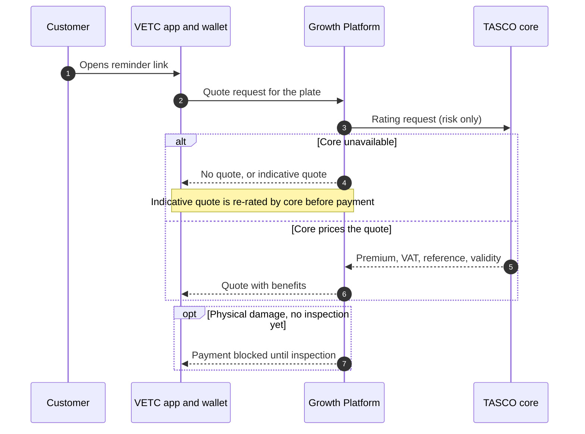
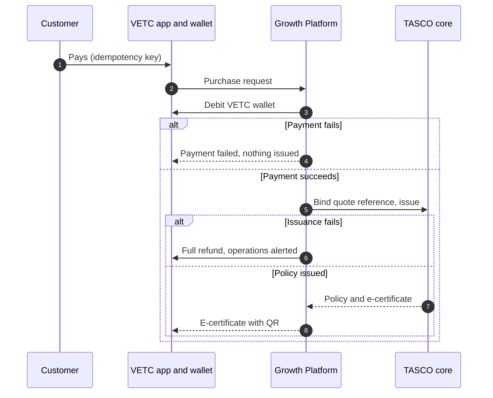
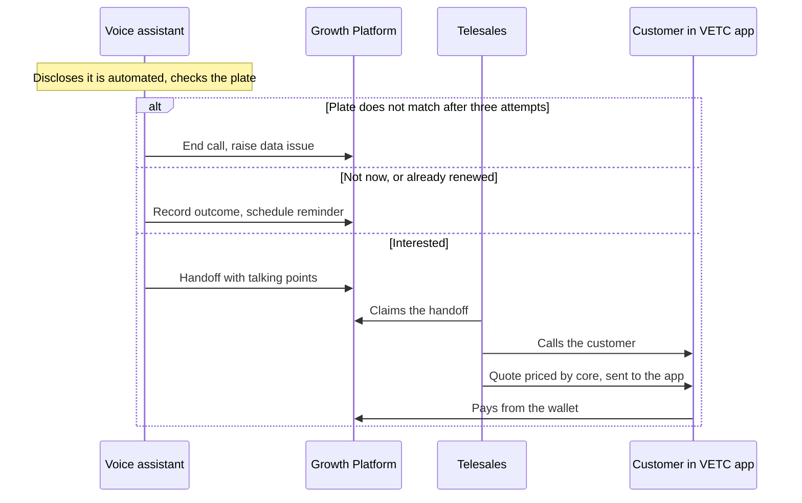
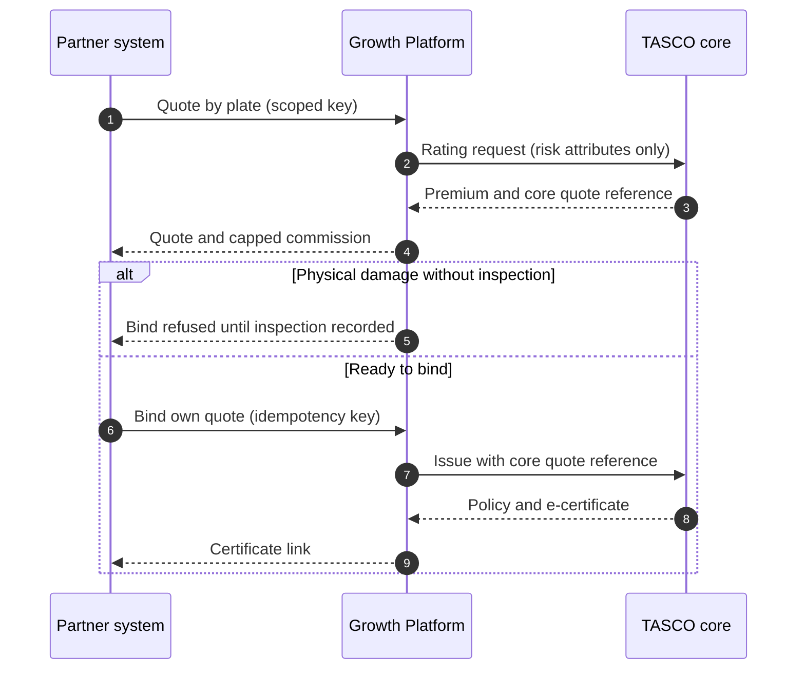
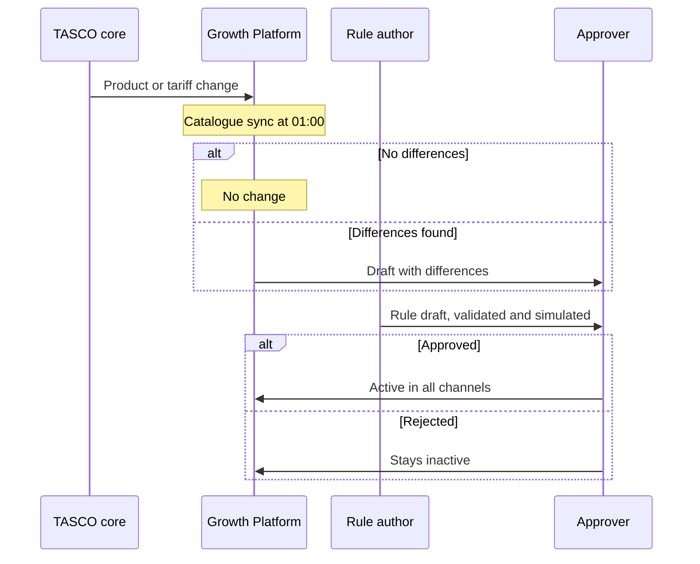

# Introduction

## Purpose

This specification states what the TASCO Growth Platform must do. Each functional requirement has a stable identifier, the business rules that govern it, a priority, the challenge track it serves and its build status. TGP-BUS-04 User Stories and Acceptance Criteria states how each requirement is accepted, and TGP-BUS-05 Requirements Traceability Matrix links each one to stories, tests and components.

## Scope

The specification covers 119 requirements in 16 capability areas: data, lead intelligence, journeys, the voice assistant, telesales, sales and issuance, products and rating, benefits, partners and fleet, claims first notice, customer self-service and privacy, rules governance, identity and access, audit, operations and user interfaces, and the TASCO core integration. Non-functional requirements are in TGP-BUS-03.

## Audience

The TASCO product owner and business teams, the VETC integration lead, TASCO compliance, and the iorta TechNXT delivery and QA teams.

## Related documents

| ID | Title |
|---|---|
| TGP-BUS-01 | Business Context and Growth Strategy |
| TGP-BUS-03 | Non-Functional Requirements |
| TGP-BUS-04 | User Stories and Acceptance Criteria |
| TGP-BUS-05 | Requirements Traceability Matrix |
| TGP-BUS-06 | Personas and Customer Journeys |
| TGP-ARC-02 | Integration Architecture |
| TGP-MAN-01 | Staff Console User Manual |
| TGP-MAN-02 | Customer App Guide |

## Conventions

| Item | Convention |
|---|---|
| Identifier | FR-nnn. Identifiers are stable and are used in TGP-BUS-04 and TGP-BUS-05 |
| Priority | MoSCoW. M: must for the MVP. S: should, in the MVP if capacity allows, otherwise the scale phase. C: could, scale phase or later. W: won't in this release |
| Track | T1 voice assistant. T2 lead scoring and enrichment. T3 renewal engine. T4 value beyond discount. NB new business. PL platform, governance and compliance |
| Status | Built: implemented and tested; a note may name the production connector still to be built. Partial: implemented with a gap noted. Planned: on the roadmap |
| Rule set | Business configuration that governs a behaviour, versioned and changed only through maker-checker approval (FR-082 to FR-088). Rule sets are named as they appear in the rules studio |

# Business concept and process overview

## Responsibilities of each party

The platform orchestrates; it does not take over what TASCO core or VETC own. TASCO core prices every quote and issues every policy. VETC hosts the customer experience and collects payment. Staff never take payment.

| Step | Customer | VETC | TASCO core | Growth Platform | Telesales or partner |
|---|---|---|---|---|---|
| Bring data together | | Accounts, vehicles, tag events | Policies and expiry dates | Matches, cleans, records lineage | Partners supply leads |
| Decide | | | | Scores, segments, chooses journey and channel | |
| Contact | Receives a message or call | Delivers app notifications | | Checks consent, timing, limits and wording | Telesales calls warm leads |
| Quote | Reviews the quote | Hosts the purchase screen | Rates and returns a quote reference | Requests the quote, adds benefits | Telesales send the quote to the app |
| Pay | Confirms and pays | Debits the VETC wallet | | Orchestrates; refunds if issuance fails | Never take payment; partners collect their own |
| Issue | Receives the e-certificate | Shows it in the app | Binds the quote and issues the policy | Stores the certificate, updates the record | |
| Serve | Uses benefits, reports accidents | | Handles claims | Takes the first notice, sends reminders | |

## Users and roles

| Role | Main use of the platform |
|---|---|
| Telesales agent | Works warm handoffs, prepares quotes and sends them to the customer's app |
| Telesales supervisor | Assigns handoffs, rehearses assistant scripts, monitors outcomes |
| Campaign manager | Leads, journeys, assistant campaigns, dashboards |
| Rule author | Drafts, validates and simulates rule changes |
| Rule approver and compliance officer | Approve rule changes; compliance alone approves restricted rule sets and handles data-subject requests |
| Data steward | Ingests data, works the data-quality queue, corrects records with evidence |
| Claims handler | Works the accident-report queue |
| Partner manager | Onboards partners, issues keys, reviews statements |
| Executive | Dashboards |
| Auditor | Audit search and verification |
| Support engineer | Integration status, jobs, reconciliation |
| Admin | Users, roles and regions; cannot author or approve rules or see customer personal data |
| Customer | Customer app inside the VETC app; later also TASCO's app and website and a Zalo Mini App (FR-117) |
| Partner system | Partner API, authenticated by key |

## Capability areas

| Area | Capability | Requirements |
|---|---|---|
| A | Data and master data management | FR-001 to FR-011 |
| B | Lead intelligence | FR-012 to FR-019 |
| C | Journeys and messaging | FR-020 to FR-030 |
| D | AI voice assistant | FR-031 to FR-039 |
| E | Telesales | FR-040 to FR-044 |
| F | Sales and issuance | FR-045 to FR-052 |
| G | Products and rating | FR-053 to FR-057 |
| H | Value and benefits | FR-058 to FR-062 |
| I | Partners and fleet | FR-063 to FR-070 |
| J | Claims first notice | FR-071 to FR-073 |
| K | Customer self-service and privacy | FR-074 to FR-081, FR-116 to FR-119 |
| L | Rules governance | FR-082 to FR-088 |
| M | Identity and access | FR-089 to FR-096 |
| N | Audit | FR-097 to FR-099 |
| O | Operations, reporting and user interfaces | FR-100 to FR-110 |
| P | TASCO core integration | FR-111 to FR-115 |

# Process flows

## Purchase in the VETC app

The customer opens a reminder, receives a quote priced by TASCO core and pays in the VETC app. Each lane is one party. The alternative blocks show what happens when core is unavailable, when physical damage cover still needs an inspection, when payment fails and when issuance fails.

Each purchase carries an idempotency key, and the quote is claimed atomically, so a double tap or a lost connection never produces a second charge. When the core is unavailable the platform either shows no quote or shows an indicative quote that cannot be paid, depending on the mode TASCO chooses (FR-112).

## Assisted sale: voice assistant and telesales

The assistant qualifies the customer and hands warm leads to telesales. The agent never takes payment; the quote goes to the customer's VETC app.

## Partner sale

A partner quotes and binds through the API. The partner collects the premium, so no VETC wallet is debited.

## Product and rule changes

TASCO core is the master for products. The nightly catalogue sync never activates a change by itself; every change, from core or from a rule author, goes through four-eyes approval.

# Functional requirements

## A. Data and master data management

| ID | Requirement | Key rules | Pri | Track | Status |
|---|---|---|---|---|---|
| FR-001 | Batch ingestion. Accept batches of up to 5,000 source records from an authorised user or partner channel, each tagged with a batch ID, source name and lineage entry. Keep only allow-listed fields: record ID, source, plate, phone, full name, toll class, seats, usage, owner type, tag activation date, policy, last inspection date, declared expiry, partner ID, first registration year | Record ID mandatory; unknown fields dropped; personal data encrypted at rest | M | T2 | Built |
| FR-002 | Plate normalisation. Normalise Vietnamese plates from inconsistent formats (30a-123.45, 30A 12345) to a key (30A12345) and display form (30A-123.45); derive the province. Reject invalid plates and raise an invalid-plate issue | Two-digit province, series of one or two letters or letter and digit for motorbikes (59X1-123.45), four or five digits; province must be known | M | T2 | Built |
| FR-003 | Phone normalisation. Normalise Vietnamese mobiles (+84, 84, missing leading zero, spaces) to 0XXXXXXXXX and international format. Ignore invalid numbers when choosing the best value | Prefixes 03, 05, 07, 08, 09; ten digits | M | T2 | Built |
| FR-004 | One record per vehicle. Merge all records for a plate into one profile. Choose name and phone by source trust; keep alternative phones, the source list and record IDs | Source trust, for example TASCO core 1.0, VETC account 0.85, partner agent 0.5, telesales list 0.4 | M | T2 | Built |
| FR-005 | Expiry estimation with confidence. Estimate the current TNDS expiry from a verified certificate, partner policy record, customer declaration, inspection cycle (+365 days) or tag anniversary. Roll dates forward a year at a time until within 60 days of today. Pick the best evidence; raise confidence when independent methods agree within 21 days; keep all candidates | +0.15 per agreement, capped at 0.95; usable at 0.5 or more | M | T2 | Built |
| FR-006 | Vehicle category inference. Infer the tariff category (11 car categories) from declared seats, usage, owner type and toll class with a first-match decision table; record confidence and basis | Default: car under 6 seats at 0.3 | M | T2 | Built |
| FR-007 | Data-quality score and issue queue. Score each profile from 0 to 100 and raise issues for missing phone, name, reliable expiry, vehicle category and current insurer, and for conflicting phones. Assistant outcomes add wrong-person and plate-mismatch issues; ingestion adds invalid-plate issues. Stewards list issues by type and status and resolve them with a written resolution | Weights 0.5 completeness, 0.35 expiry confidence, 0.15 category confidence; minimum category confidence 0.6 | M | T2 | Built |
| FR-008 | Field-level lineage. Show authorised staff the source, confidence and rule behind each derived field (phone, name, category, expiry), the contributing records and recent ingestion batches | None | S | T2 | Built |
| FR-009 | Steward expiry correction. A data steward can set the expiry date and insurer with mandatory evidence text. The change is audited and the lead is recomputed at once | Correction confidence 0.9 | M | T2 | Built |
| FR-010 | Data-repair loop. Facts captured by the platform update the profile and survive later source loads when they carry higher confidence: customer-declared expiry, assistant "already renewed" (next expiry and competitor note), TASCO issuance (confidence 1.0) and consent changes | Customer declarations, assistant findings, TASCO issuances and consent overrides survive rebuilds | M | T2 | Built |
| FR-011 | Incremental rebuild. Rebuild only the profiles whose plates appear in a batch, in chunks of 500 plates, then re-score only the affected leads | Event-driven | M | T2 | Built |

## B. Lead intelligence

| ID | Requirement | Key rules | Pri | Track | Status |
|---|---|---|---|---|---|
| FR-012 | Fact model. Derive one set of facts per vehicle and use it in every rule set: days to expiry, days lapsed, expiry confidence and method, insurer, tag age, owner type, region, category, seats, usage, vehicle age, reachable channels, consent, premium and engagement | None | M | T2 | Built |
| FR-013 | Journey assignment. Place each vehicle in the first journey, by priority, whose audience matches: uninsured recovery (1), new vehicle (2), renewal (3), conquest (4) | Journeys rule set | M | T3, NB | Built |
| FR-014 | Explainable lead score. Score 0 to 100 as the weighted sum of five factors: urgency 35, data confidence 15, engagement 20, reachability 15, relationship 15. Multiply by (0.6 + 0.4 × expiry confidence); set to zero for do-not-contact. Tiers: hot at 70 or more, warm at 45 or more, otherwise nurture. Each factor shows points, maximum and a plain reason | Weights must total 100 and hot must exceed warm, checked on save | M | T2 | Built |
| FR-015 | Next best action. Choose one action per vehicle with a first-match table: do not contact; route to fleet or B2B team (company); ask customer to confirm expiry (confidence below 0.5); welcome new vehicle; schedule reminders (more than 45 days away); urgent: vehicle uninsured (lapsed); AI voice assistant then telesales (hot, call consent, phone); renewal link by app or Zalo; SMS reminder; default find a contact channel. Each action has a label and a reason | Next best action rule set | M | T2 | Built |
| FR-016 | Benefits per lead. Rank eligible benefits by relevance and attach the top three, each with a reason | At most 3 shown | M | T4 | Built |
| FR-017 | Prioritised lead queue. Staff list leads filtered by tier, journey, action, region, maximum days to expiry and minimum score, sorted by score or expiry, at most 500 per page. Users without dashboard access who have a region see only their region | Regional data policy | M | T2 | Built |
| FR-018 | Recompute. Recompute leads on demand by a campaign manager, on events (profiles rebuilt, recompute requested, policy issued) and on a schedule. Re-plan touchpoints when the journey or tier changes | None | M | T2 | Built |
| FR-019 | Insured suppression. A vehicle with an active TASCO TNDS policy beyond today has no journey and the action "insured"; scheduled touchpoints are cancelled when they fall due | None | M | T3 | Built |

## C. Journeys and messaging

| ID | Requirement | Key rules | Pri | Track | Status |
|---|---|---|---|---|---|
| FR-020 | Journey catalogue. Configurable journeys, each with an objective (retention, new business, cross-sell), audience, anchor date (expiry, tag activation, today) and timed steps (offset, channels, marketing flag, template, optional tier). Supplied: uninsured recovery, new vehicle, renewal, conquest and post-purchase cross-sell | Unique IDs, valid anchor and at least one channel, checked on save | M | T3, NB | Built |
| FR-021 | Touchpoint planning. Plan each lead's touchpoints from the journey steps. Skip steps more than two days in the past and omit tier-gated steps for other tiers. Planning can be repeated safely | Catch-up window 2 days | M | T3 | Built |
| FR-022 | Execute due touchpoints. On a schedule or on demand, execute every touchpoint due up to a date, paging through all of them. Try the step's channels in order and record the outcome (done, skipped with reasons, cancelled) with totals by channel and journey. A touchpoint blocked only by the contact window is deferred to the next run inside the window. Simulated run dates apply only in demo mode. An assistant step starts a call; a telesales step creates a handoff | None | M | T3 | Built |
| FR-023 | Contact policy gate. Every outbound contact passes a check: channel reachable; not do-not-contact; consent present (marketing for marketing, call for the assistant and telesales); marketing only from 08:00 to 20:00 Vietnam time; at most one marketing contact a day and three a week; at most two call attempts a week. Service messages are exempt from frequency caps | Contact policy rule set | M | PL | Built for journeys, triggers and assistant campaigns |
| FR-024 | Copy guard. Customer wording never contains banned discount or rebate phrases. The check runs when message, benefit or assistant-script rules are saved (the draft is rejected) and again at send time (the message is blocked). Matching ignores diacritics, extra spaces and punctuation ("giảm  giá", "cash back") | Copy guard rule set | M | T4, PL | Built |
| FR-025 | Templated messages. Render messages from templates in Vietnamese for customers, with English for staff review. Placeholders: plate, expiry (dd/mm/yyyy), days, premium, top benefit, signed renewal link, certificate number | 13 templates | M | T3 | Built |
| FR-026 | Ecosystem triggers. Accept VETC events for tag activated, inspection booked, wallet topped up and long trip started. A matching trigger enrols the vehicle in a journey or sends a message at once, subject to its condition and the contact policy | Triggers rule set | S | NB, T3 | Built; live VETC event feed in the scale phase (tag activation in the MVP) |
| FR-027 | Purchase confirmation. After issuance send a service message with certificate number, plate, expiry and verification link by app push or Zalo, whichever is available first | Message content | M | T3 | Built |
| FR-028 | Post-purchase cross-sell. After a TNDS-only purchase by a customer with marketing consent, schedule a cross-sell message for the next day by push or Zalo, highlighting cover the customer does not hold | Cross-sell step | S | NB, T4 | Built |
| FR-029 | Touchpoint schedule. Staff list touchpoints by profile and status: scheduled, done, skipped, cancelled | None | S | T3 | Built |
| FR-030 | Journey integrity. Cancel a touchpoint when the profile is missing or anonymised, the vehicle is insured with TASCO, or the lead's journey changed since planning | None | M | T3 | Built |

## D. AI voice assistant

| ID | Requirement | Key rules | Pri | Track | Status |
|---|---|---|---|---|---|
| FR-031 | Disclosure. Every call opens by saying it is VETC's automated assistant, that the call is recorded and that VETC never asks for an OTP or payment by phone. It then asks for the plate | Assistant script | M | T1 | Built |
| FR-032 | Plate-first verification. Extract the plate from the customer's speech (Vietnamese and English digits, Vietnamese tens such as "ba mươi", motorbike plates) and compare it with the record. Never read the plate out. No plate recognised: retry, up to three attempts, then "not verified". Mismatch: end politely as "plate mismatch" and raise a data issue | Maximum 3 attempts | M | T1 | Built |
| FR-033 | Expiry confirmation. After verification state the expiry on file using the masked plate. Three variants: known (confidence 0.5 or more), lapsed, unknown ("which month does it end?"). Capture the answer | Assistant script | M | T1, T2 | Built |
| FR-034 | Intent recognition. Classify each utterance into one of 12 intents: opt out, scam concern, ask for a person, already renewed, price, call back later, send link, buy now, wrong person, benefits, yes, no. Accent-insensitive keyword matching; a vendor language model or NLU classifier can be plugged in through the same interface | Assistant script | M | T1 | Built (keywords); vendor NLU planned |
| FR-035 | Honest price answer. When asked about price, say TNDS premiums are set by regulation and identical at every insurer, give the customer's premium including VAT and move to service value. Never offer a discount | Assistant script; copy guard | M | T1, T4 | Built |
| FR-036 | Outcomes and write-back. Each call ends in exactly one outcome. Hot handoff: telesales handoff. Link sent: renewal link as a service message by app, Zalo or SMS. Already renewed: next expiry = previous + 365 days at confidence 0.6, insurer "other", competitor note. Opted out: do-not-contact and call consent withdrawn, audited. Wrong person or plate mismatch: data issue. Call back later, not interested, not verified: logged | Service levels rule set | M | T1, T2 | Built |
| FR-037 | Interactive console. Authorised staff start a session for a customer (refused for do-not-contact), type customer utterances and see the bilingual transcript. Used for rehearsal, QA and supervised calls | None | S | T1 | Built |
| FR-038 | Automated campaign. A campaign manager runs assistant calls over the top leads of a tier (hot or warm, up to 200 calls). Company vehicles are excluded and every call passes the full contact policy (call and marketing consent, not do-not-contact, 08:00 to 20:00, weekly call cap). A summary of outcomes and skip reasons is returned | Contact policy | M | T1 | Built |
| FR-039 | Assistant governance KPIs. Report call volume, outcomes, plate-verification failure rate, opt-out rate and the disclosure statement | None | S | T1, PL | Built |

## E. Telesales

| ID | Requirement | Key rules | Pri | Track | Status |
|---|---|---|---|---|---|
| FR-040 | Structured handoff. A hot call creates a handoff with only what the agent needs: plate, plate-verified flag, name, masked phone, journey, expiry, days to expiry, premium, score, outcome, price-asked and trust-concern flags, and talking points. Talking points: call from the official hotline, never take payment by phone, the regulated-price message, the top benefits, close by sending the quote to the app | Data minimisation | M | T1 | Built |
| FR-041 | Work queue. Agents see open and assigned handoffs, filtered by status, "mine" and region, with paging. Agents see only unassigned handoffs and their own | Own-handoff and region policies | M | T1 | Built |
| FR-042 | Handoff lifecycle. Open to claimed, callback, won or lost. Claimed to won, lost, callback or open. Callback to claimed, won or lost. Won and lost are final. Claiming assigns the handoff; notes record author and time; version control prevents lost updates | None | M | T1 | Built |
| FR-043 | Supervisor assignment. A supervisor can assign or reassign any handoff | Role permission | M | T1 | Built |
| FR-044 | Journey escalation. A journey telesales step creates a handoff (reason: journey escalation) with talking points for hot customers who have not responded to digital reminders | Hot tier only | M | T3 | Built |

## F. Sales and issuance

| ID | Requirement | Key rules | Pri | Track | Status |
|---|---|---|---|---|---|
| FR-045 | Product catalogue. Show active products (TNDS car, TNDS motorbike, physical damage cover, personal accident cover per seat) with their channels, and the Safe Drive and Full Motor bundles | Product catalogue rule set, synchronised from TASCO core (FR-113) | M | NB | Built |
| FR-046 | Quotation. Quote one to five product lines for a profile and channel, checking each product is sold on that channel. Cover starts the day after current expiry, or today if lapsed or unknown. Each line shows net premium, VAT, total, dates and breakdown. Attach benefits, detect a matching bundle; the quote expires after 24 hours. Telesales and supervisors send a staff quote to the customer's VETC app or Zalo as a service message; the customer sees it in the app | Quote validity 24 hours; priced by TASCO core (FR-111) | M | T3, NB | Built |
| FR-047 | Pay and issue. Only the customer (in the VETC app) or a partner can pay; staff never take payment. A purchase needs an idempotency key: a retry returns the original result, and reusing the key of a failed attempt is refused (HTTP 409). The quote is claimed atomically so concurrent purchases cannot double-charge. Flow: debit the VETC wallet (partner sales are partner-collected), TASCO core binds the core quote reference and issues each line, store the policy with certificate number and verification link, mark the quote converted | Indicative quotes cannot be paid (FR-112); physical damage needs an inspection (FR-054) | M | T3 | Built against sandbox wallet and core; production connectors in the MVP |
| FR-048 | Failure compensation. Payment failure: order marked "payment failed". Issuance failure after payment: cancel any issued lines and refund in full through the circuit breaker; order marked "issuance failed, refunded", or "compensation failed" if the refund itself fails, which reconciliation flags. All outcomes audited | None | M | PL | Built |
| FR-049 | Record update on issuance. A TNDS issuance sets the profile's expiry to the policy end date with confidence 1.0, insurer TASCO, verified | None | M | T2 | Built |
| FR-050 | Public certificate verification. Anyone with a certificate number or QR can check validity, status, product, masked plate, insurer and period, with no personal data. Rate-limited | None | M | T4, PL | Built (service and public page) |
| FR-051 | Policy listing. Staff list policies by profile and product | None | M | T3 | Built |
| FR-052 | Reconciliation. A job checks that every completed order has a payment reference and that each referenced policy exists, and flags orders awaiting payment for more than one hour, failed payments and failed compensations | None | M | PL | Built |

## G. Products and rating

| ID | Requirement | Key rules | Pri | Track | Status |
|---|---|---|---|---|---|
| FR-053 | Regulated TNDS tariff. Annual premium by category excluding VAT, pro-rata by days over 365; term one to three years; VAT 10%. Car and motorbike tariffs per Decree 67/2023/ND-CP, to be confirmed by TASCO underwriting. Used by TASCO core rating and, locally, only for indicative quotes and testing | VAT between 0 and 0.2; positive whole premiums, checked on save | M | T3 | Built |
| FR-054 | Physical damage cover. Premium = sum insured × rate (by usage and vehicle age) × (1 − deductible relief), minimum VND 1,000,000. Sums insured above VND 5 billion are referred to an underwriter. Deductibles VND 0, 500,000 or 1,000,000. A recorded vehicle inspection (passed, with evidence) is required before payment; purchase is blocked until then | Illustrative rates | S | NB | Built |
| FR-055 | Personal accident cover per seat. Premium = seats (1 to 60) × sum insured per seat (VND 10, 20, 50 or 100 million) × rate per seat. Exempt from VAT | Illustrative rates | S | NB | Built |
| FR-056 | No-discount pricing. Quotes for price-regulated products carry no discount field and state "Premium fixed by regulation, identical at every insurer" | Price-regulated flag | M | T4, PL | Built |
| FR-057 | Products by configuration. Add a product by configuration: code, rating method (tariff table, rate on sum insured, per seat), rate rule set, channels and status. Unknown methods, duplicate codes and bundles of unknown products are rejected | Product catalogue rule set | S | PL | Built |

## H. Value and benefits

| ID | Requirement | Key rules | Pri | Track | Status |
|---|---|---|---|---|---|
| FR-058 | Benefits catalogue with legal gating. Each benefit has a type (service, loyalty, convenience, cover upgrade), provider, bilingual title and description, eligibility, relevance and reason. Only benefits approved by legal reach customers. Unavailable (roadmap) benefits are shown to staff only, flagged, as are pending ones | Benefits rule set | M | T4 | Built |
| FR-059 | Relevance and explanation. Rank benefits by a per-customer relevance score (0 to 1) with a plain reason, for example "drives 1,850 km on highways per quarter" | Benefits rule set | M | T4 | Built |
| FR-060 | Loyalty points and referral. Non-cash VETC points for renewal or data verification, and a referral programme (200 points per referral, at most five a month). Both switched off pending legal approval | Referral disabled | C | T4 | Planned (gated) |
| FR-061 | Auto-renew opt-in. The customer opts in once, is reminded seven days before expiry and is renewed from the VETC wallet only after confirming | Benefit unavailable today | S | T3, T4 | Planned; staff view only |
| FR-062 | Inspection reminder and booking. Track the inspection date, remind the customer and help book a slot. Use the inspection-booked event to check TNDS validity | Triggers rule set | S | T4, NB | Partial: trigger built; booking integration in the scale phase |

## I. Partners and fleet

| ID | Requirement | Key rules | Pri | Track | Status |
|---|---|---|---|---|---|
| FR-063 | Partner onboarding and status. A partner manager onboards partners of type bank, showroom, agent, fleet or inspection centre with a region, and activates or suspends them. A suspended partner's keys stop working | None | M | NB | Built |
| FR-064 | Partner API keys. Issue keys (prefix tpk_) shown once and stored only as SHA-256 hashes, with scopes quote, purchase and policies-read. Keys can be revoked | Scopes enforced | M | NB, PL | Built |
| FR-065 | Partner quote by plate. A partner quotes by plate, holder name, phone, seats, usage, current expiry, owner type and marketing consent. An unknown plate, or new facts, create a partner source record so the vehicle joins the base. Quotes are tagged with the partner and the partner channel | Channel eligibility; partner source trust | M | NB | Built; residual risk E-11 |
| FR-066 | Partner bind. A partner binds only its own quotes, with an idempotency key. Partner sales are partner-collected: no VETC wallet debit, payment reference prefixed PARTNER-, premium remitted to TASCO under the partner agreement | None | M | NB | Built |
| FR-067 | Partner reporting. A partner lists the policies it sold and its commission statement for a date range | None | M | NB | Built |
| FR-068 | Commission. Commission per policy line = net premium × rate, from a first-match table by product and partner type, capped at the statutory cap. A rule above the cap is rejected | TNDS 5%; physical damage 10% showroom, 8% others; personal accident 15%; caps to be confirmed by TASCO finance and legal | M | NB, PL | Built |
| FR-069 | Partner statement for staff. A partner manager views any partner's statement: completed orders, lines and total | None | M | NB | Built |
| FR-070 | Fleet and B2B. Route company vehicles to the B2B team, exclude them from consumer journeys and assistant campaigns, and offer a fleet renewal dashboard with a consolidated VAT invoice | Next best action, journey audiences | S | NB | Partial: routing and exclusion built; fleet dashboard and invoice in the scale phase |

## J. Claims first notice

| ID | Requirement | Key rules | Pri | Track | Status |
|---|---|---|---|---|---|
| FR-071 | Report an accident. A customer reports an incident against their own policy: date (within the policy period), description, location and photo count. Claim ID CL-XXXXXXXX. An acknowledgement due time of four hours is set and an acknowledgement message is sent to the customer | Acknowledgement within 4 hours | S | T4 | Built; photo count only, photo upload planned |
| FR-072 | Claims queue. Claims handlers list claims by status and move them through submitted, acknowledged, assessor assigned, under assessment, approved and paid; rejected is allowed from early states. Each transition is recorded in history and the audit trail | None | S | T4 | Built |
| FR-073 | My claims. A customer sees the status of their own claims | None | S | T4 | Built |

## K. Customer self-service and privacy

| ID | Requirement | Key rules | Pri | Track | Status |
|---|---|---|---|---|---|
| FR-074 | Customer session. The customer app, in whichever host it runs (FR-117), exchanges a signed renewal link (HMAC, no guessable IDs) or a VETC single sign-on token for a one-hour session limited to one vehicle. Links expire after 30 days by default. Sign-in is rate-limited | Customer can see only their own vehicle | M | T3 | Built (signed link); VETC SSO in the scale phase |
| FR-075 | Cover status home. Show vehicle, cover (expiry, confidence, insurer, verified, days to expiry, and "please confirm" when confidence is below 0.75), regulated premium, TASCO policies with certificate links, top approved benefits and consent | Benefits rule set | M | T3, T4 | Built |
| FR-076 | Confirm my expiry. The customer declares the expiry date and insurer; the record is updated at confidence 0.75 and recomputed | Customer-declared confidence 0.75 | M | T2 | Built |
| FR-077 | Purchase with add-ons. The customer gets a quote (TNDS, optionally personal accident or physical damage cover, term one to three years) and pays with an idempotency key, from the VETC wallet or through TASCO's payment gateway depending on the host (FR-117). Renewal has two paths: quick renewal in three steps when the case allows it (FR-119), and the full six-step flow, which is always available as "Tùy chỉnh gói bảo hiểm". Quotes sent by telesales appear for confirmation. Physical damage needs a recorded inspection first. An indicative quote must be re-rated before payment. The e-certificate with QR is shown at once | Product channels by host | M | T3 | Built |
| FR-078 | Consent centre. The customer switches marketing and call consent on or off. Changes are audited, survive data reloads and trigger recompute | Consent required per purpose | M | PL | Built |
| FR-079 | Download my data. The customer downloads all data held about their vehicle: profile, lead, policies, quotes, orders, claims, telesales tasks, messages, source records and assistant sessions | Right of access | M | PL | Built |
| FR-080 | Export and erasure by staff. A compliance officer exports a data subject's data and erases it by anonymisation, normally from a logged request in the data-request register (FR-118). Erasure is refused while a policy is in force. Messages, transcripts, assistant signals, handoffs and claim text are scrubbed, source personal data is removed and the subject's sessions end | Retention rule set | M | PL | Built |
| FR-081 | Masking by permission. Customer 360 masks name and phone unless the viewer may see personal data. Every profile view is audited with a visibility flag | Role permissions | M | PL | Built |
| FR-116 | Confirm vehicle use and seats. Before quoting, the customer confirms whether the vehicle is used for commercial transport and how many seats it has, as on e.baohiemtasco.vn. The answer is stored as customer evidence (source trust 0.9), the vehicle category is recalculated and the TNDS price follows | Data enrichment rule set | M | T3, PL | Built |
| FR-117 | Same journeys in every host app. The customer journeys run inside the VETC app, a Zalo Mini App, TASCO's own app and the TASCO website. The session records the host; quotes and orders are attributed to it; payment uses the VETC wallet in VETC and Zalo hosts and TASCO's payment gateway in TASCO hosts. Products list the hosts they may be sold in | Product channels in the products rule set | M | T3, PL | Built (TASCO payment gateway on a sandbox connector) |
| FR-118 | Data-subject request register. Compliance logs every access or erasure request with the customer (found by plate, phone or profile), the channel (hotline, email, app, branch or letter) and the time received. The due time is the received time plus the response time in the service levels rule set (72 hours, to be confirmed by TASCO legal). Statuses: received, in progress, completed, refused. Identity must be recorded as verified before any export or erasure. Export downloads a file named TASCO-data-plate-date.json. Erasure needs a reason and the typed plate, and is refused, with the reason recorded, while a policy is in force. A refusal always carries a reason. The "Data requests" screen in the Governance group shows open requests, those due within 24 hours, overdue requests and those completed in the last 30 days, and a timeline for each request. The customer's own download in the app (FR-079) is recorded as a completed access request on channel app. Every action is audited | Service levels rule set; permission to manage data requests (compliance officer only) | M | PL | Built |
| FR-119 | Quick renewal. The server decides, case by case, whether the customer app offers quick renewal ("Gia hạn nhanh"): open, tick the declaration, then "Xác nhận thanh toán". The declaration stays an explicit step. Otherwise, or whenever the customer prefers, the full flow applies: "Gia hạn ngay", "Xem phí bảo hiểm", "Tiếp tục", declaration, "Thanh toán", "Xác nhận thanh toán". A customer qualifies when the journey is renewal or they are renewing a TASCO TNDS policy; the vehicle is not already renewed; vehicle use and seats are confirmed by TASCO core, a matching TASCO policy or the customer within 365 days (FR-116); the cover is TNDS with no physical damage; the product is sold in the host; the price will not be indicative; and, in VETC hosts, the wallet covers the premium. The home screen states whether the customer qualifies and, if not, why, in plain Vietnamese. The server sets the cover; the app cannot change it | Quick renewal settings in the service levels rule set | S | T3 | Built |

## L. Rules governance

| ID | Requirement | Key rules | Pri | Track | Status |
|---|---|---|---|---|---|
| FR-082 | Versioned rule registry. Every rule set is stored as numbered versions with status draft, pending approval, active, retired or rejected, plus checksum, author, approver and times. Authorised staff list versions and view content | All rule sets | M | PL | Built |
| FR-083 | Draft with validation. A rule author can save a draft only if it passes validation: every expression and decision table, the checks specific to the rule set (FR-014, FR-020, FR-053, FR-057, FR-068, contact window) and the copy guard for wording and benefits | None | M | PL | Built |
| FR-084 | Validate without saving. Authors can check a draft and see the list of errors | None | S | PL | Built |
| FR-085 | Simulate. Staff run a candidate lead scoring, next best action, journeys or benefits rule set against a real customer and compare current and candidate results (journey, score, tier, reasons, action, benefits) before submitting | Four rule sets | S | T2, PL | Built |
| FR-086 | Maker-checker approval. Only the author submits a draft. Only a different user with approval rights approves or rejects it, with a comment. Restricted rule sets (attribute access policies, copy guard, contact policy, commission, data retention) can be approved only by a compliance officer. Approval retires the previous version and activates the new one in one transaction; only one version per rule set can be active. All servers pick up the change within about 15 seconds | Restricted rule sets | M | PL | Built |
| FR-087 | Rollback. Rolling back creates a new draft copied from an earlier version, which still needs approval | None | M | PL | Built |
| FR-088 | Default rules. On first start each rule set is loaded from the delivered defaults (copy guard first) as version 1, validated and audited | None | M | PL | Built |

The rules studio presents each rule set as a form in business language, with an Advanced (JSON) view for technical users.

## M. Identity and access

| ID | Requirement | Key rules | Pri | Track | Status |
|---|---|---|---|---|---|
| FR-089 | Staff sign-in with lockout. Username and password. After five failures (password or code) the account is locked for 15 minutes (configurable). Timing is equalised for unknown users. Every attempt is audited | Lockout settings | M | PL | Built |
| FR-090 | Two-factor authentication. Required for enrolled users and mandatory for admin, rule approver, compliance officer and data steward. These users self-enrol at first sign-in by QR, shown only to them; administrators never see the secret. Codes cannot be reused | Mandatory MFA roles | M | PL | Built |
| FR-091 | Sessions. Access tokens last 30 minutes by default and carry roles, region and sign-in method. Sign-out revokes the token; a password change or a change of role, status or region revokes all of the user's tokens | None | M | PL | Partial: sign-out revocation is per server (E-15) |
| FR-092 | Role-based access. 15 roles (13 staff roles, the customer and the partner system) mapped to permissions, deny by default. Forbidden role pairs (for example admin with rule approver, rule author with rule approver) enforce separation of duties. The admin cannot author or approve rules or see customer personal data | Security configuration | M | PL | Built |
| FR-093 | Attribute-based access. Checked after roles: agents see only their own or unassigned handoffs; telesales see profiles in their region; customers see only their vehicle. Adding an unrelated role never widens access | Attribute access policies | M | PL | Built |
| FR-094 | User administration. An admin creates users (password policy, roles, region), changes roles, region or status, lists users, clears a lockout or forces two-factor re-enrolment. New users change their password at first sign-in. An admin cannot reset their own account or change their own roles or status | None | M | PL | Built |
| FR-095 | Partner and customer authentication. Partners authenticate with an API key and act as the partner role. Customer sessions are limited to one profile | None | M | PL | Built |
| FR-096 | Password management. Users change their password after re-entering the current one. Policy: 12 to 128 characters (OWASP ASVS V2.1) | None | M | PL | Built |

## N. Audit

| ID | Requirement | Key rules | Pri | Track | Status |
|---|---|---|---|---|---|
| FR-097 | Audit every change. Record actor, action, entity and details for sign-in, user, rule, data, lead, journey, assistant, handoff, quote, order, partner, claim, consent, data-subject request, data-quality and job events, and every profile view with its personal-data visibility | None | M | PL | Built |
| FR-098 | Audit search. Auditors and compliance staff search by entity, actor and action, with paging | None | M | PL | Built |
| FR-099 | Tamper evidence. Audit entries are hash-chained, each hash covering the previous one. Verification reports "intact" or the entry where the chain breaks | None | M | PL | Built |

## O. Operations, reporting and user interfaces

| ID | Requirement | Key rules | Pri | Track | Status |
|---|---|---|---|---|---|
| FR-100 | Growth dashboard. Base size, expiring in 30 days, lapsed, usable-data profiles; leads by tier, journey and action; data issues by type; messages by channel and status; assistant outcomes; handoffs; orders and premium by journey and channel; active policies by product; claims; economics (assistant cost, telesales-equivalent cost, saving, messaging cost, cost per order) | Channel costs | M | PL | Built; scaling note E-16 |
| FR-101 | Adoption dashboard. Active users, sign-ins, failed sign-ins, handoff actions, actions by type, and adoption targets: weekly active telesales 90% or more, three clicks or fewer to renew, first contact on a handoff within two business hours, rule-change lead time one day or less | None | S | PL | Built |
| FR-102 | Governance dashboard. Assistant governance (FR-039), rule sets by status and audit-trail verification | None | S | PL | Built |
| FR-103 | Operational status. Store type, circuit state of each integration (wallet, core, telephony, push, Zalo, SMS), active rule versions with checksums, event backlog and audit entry count | None | M | PL | Built |
| FR-104 | Jobs. Support engineers run reconciliation, retention, event relay and catalogue sync and view job history. The same jobs run on a schedule | None | M | PL | Built |
| FR-105 | Retention. Apply retention by data type: source records deleted after 365 days, assistant sessions after 180 days, profiles anonymised after 1,825 days of inactivity, and messages, orders, certificates and audit archived after their stated periods. A legal hold overrides deletion | Data retention rule set | M | PL | Partial (E-09) |
| FR-106 | Health, metrics and API description. Liveness and readiness checks (readiness checks the database), operational metrics and an OpenAPI 3 description generated from the route table | None | M | PL | Built |
| FR-107 | Demo and UAT environment. Demo users (one per role), five demo partners and a synthetic VETC base that reproduces the brief's data problems (about one in ten verified). Demo mode is off by default and is required for demo seeding and the demo authenticator. UAT-only switches manage demo accounts. Production refuses to start without a database | Demo mode off by default | S | PL | Built |
| FR-108 | Staff console. Sign-in with two-factor authentication; grouped sidebar, global search, notifications and user menu; role-based home; lead queue with explainable score and action; Customer 360 (lineage, journey, messages, policies, benefits, Sell tab); voice assistant console; telesales inbox; journeys and event simulator; rules studio and approvals; partners; claims; data quality; audit; data requests; users; operations; contextual help | Business-language labels | M | All | Built |
| FR-109 | Customer app. Bottom tab bar (Home, Buy and renew, Claims, Account); cover status card; confirm expiry; confirm vehicle use and seats; quick renewal or the full purchase flow with add-ons; payment by VETC wallet or TASCO's payment gateway, depending on the host; e-certificate with QR; benefits; consent centre; accident reporting; download my data. Public certificate verification page | Vietnamese for customers | M | T3, T4 | Built |
| FR-110 | Language and themes. Vietnamese and English in the staff console, Vietnamese in the customer app; light and dark themes; dates dd/mm/yyyy | None | M | PL | Built |

## P. TASCO core integration

| ID | Requirement | Key rules | Pri | Track | Status |
|---|---|---|---|---|---|
| FR-111 | Core rates every quote. In production TASCO core prices every quote through the core rating interface. Each quote records the rating source, core quote reference, validity and rating version. Rating requests carry only risk attributes (vehicle category, use, seats, age, term); plate and holder name go to core only at issuance, with the core quote reference, so core binds the price it quoted. A decline or referral from core is never replaced by a local price | Rating mode set by TASCO (FR-112) | M | T3, PL | Built; production connector paths to be confirmed against TASCO's specification; UAT uses a simulated core |
| FR-112 | Rating mode and indicative quotes. TASCO chooses one mode: core only (no quote while core is unavailable); core with indicative fallback (a price from the approved tariff tables, clearly marked indicative, used only when core is unavailable); local rating (sandbox and testing only). An indicative quote cannot be paid until staff or the customer re-rate it with core. Production refuses local rating unless TASCO approves it explicitly | Three modes | M | T3, PL | Built |
| FR-113 | Product catalogue sync. Nightly at 01:00 Vietnam time, or on demand, read core's catalogue. Core is authoritative for name, line, compulsory flag, price regulation, inspection requirement, status and version; the platform keeps channels and bundles. New products arrive with no channels until the business configures them; products removed in core are withdrawn. Differences become a draft submitted for maker-checker approval, never activated automatically, and are audited | Maker-checker (FR-086) | M | PL | Built against the simulated core |
| FR-114 | Integration status. Support staff see the rating mode, the circuit state of rating and catalogue connections and the time of the last catalogue sync | None | S | PL | Built |
| FR-115 | TASCO policy book. Load active and expiring TASCO policies daily so that renewals are driven from core data and insured customers are not sold to | TASCO core source trust 1.0 | M | T3 | Partial: TASCO policy records are accepted as verified evidence; scheduled extract from core in the MVP |

# Screen design and prototype

The staff console and the customer app use business-language labels throughout. Screenshots are in TGP-MAN-01 Staff Console User Manual and TGP-MAN-02 Customer App Guide; navigation is described in TGP-UX-03 Information Architecture and Navigation.

## Staff console

The console has a grouped sidebar, a global search by plate or phone, notifications (rule changes awaiting approval, new hot leads, claims near their acknowledgement time, open data issues, data requests due within 24 hours or overdue) and a user menu for language, theme, password and sign-out.

| Screen | Main users | Purpose | Requirements |
|---|---|---|---|
| Dashboard | Executive, campaign manager, supervisors | Growth, channels, economics, governance | FR-100 to FR-102 |
| Telesales inbox | Agents, supervisors | Claim, call, record outcome | FR-040 to FR-044 |
| Leads | Campaign manager, agents, stewards | Prioritised queue with score, action and reason | FR-012 to FR-019 |
| Customer 360 | Agents, stewards, compliance, claims | Overview, data and lineage, journey, messages, Sell tab (quote, record inspection, re-rate, send to the customer's app), activity | FR-008, FR-009, FR-046, FR-081 |
| Voice assistant | Campaign manager, supervisors | Console sessions and campaigns | FR-031 to FR-039 |
| Journeys | Campaign manager | Journeys, scheduled touchpoints, event simulator | FR-020 to FR-030 |
| Business rules and Approvals | Rule authors, approvers, compliance | Form-based editing with an Advanced (JSON) view; validate, simulate, submit, approve, roll back | FR-082 to FR-088 |
| Partners | Partner manager | Onboard, keys, suspend, statements | FR-063 to FR-069 |
| Claims | Claims handlers | Accident-report queue and status changes | FR-072 |
| Data quality | Data stewards | Issue queue and resolution | FR-007 |
| Audit | Compliance, auditors | Search and chain verification | FR-097 to FR-099 |
| Data requests | Compliance | Log, verify identity, export, erase or refuse; due times and timeline | FR-080, FR-118 |
| Users and Operations | Admin, support engineer | Users, integration status, jobs | FR-094, FR-103, FR-104, FR-114 |

Workflow actions use verbs: Claim, Send to customer, Record inspection, Submit for approval, Approve, Reject, Roll back, Log request, Export data, Erase personal data.

## Customer app

| Tab or page | Purpose | Requirements |
|---|---|---|
| Home | Quotes waiting for confirmation, cover status, confirm expiry, "Gia hạn nhanh" when the customer qualifies, benefits, my policies | FR-075, FR-076, FR-119 |
| Buy and renew | Confirm vehicle use and seats, TNDS with optional add-ons, review, pay with the VETC wallet or TASCO's payment gateway, e-certificate | FR-077, FR-116, FR-117 |
| Claims | Report an accident, track my claims | FR-071, FR-073 |
| Account | Consent centre, download my data, sign out | FR-078, FR-079 |
| Certificate verification (public) | QR check with masked plate and no personal data | FR-050 |

# Appendix

## Rule sets and the requirements they govern

| Rule set | Requirements |
|---|---|
| Data enrichment | FR-004 to FR-007, FR-116 |
| Lead scoring | FR-014 |
| Next best action | FR-015, FR-070 |
| Journeys | FR-013, FR-020, FR-021, FR-028, FR-044, FR-070 |
| Ecosystem triggers | FR-026, FR-062 |
| Contact policy | FR-023, FR-038, FR-078 |
| Copy guard | FR-024, FR-035, FR-056 |
| Message content | FR-025, FR-027, FR-046, FR-071 |
| Voice assistant script | FR-031 to FR-035 |
| Benefits | FR-016, FR-058 to FR-062 |
| Product catalogue | FR-045, FR-046, FR-057, FR-113, FR-117 |
| TNDS car and motorbike tariffs | FR-053, FR-112 |
| Physical damage and seat accident rating | FR-054, FR-055 |
| Commission | FR-068 |
| Referral | FR-060 |
| Data retention | FR-080, FR-105 |
| Channel costs | FR-100 |
| Service levels | FR-009, FR-036, FR-046, FR-071, FR-076, FR-118, FR-119 |
| Attribute access policies | FR-017, FR-041, FR-093 |
| Roles and separation of duties (security configuration, changed through code review) | FR-086, FR-092 |

## Out of scope for this release

- Claims adjudication, reserving and payment, which stay in TASCO core; the platform is the digital front door (FR-071 to FR-073).
- Underwriting of physical damage cover above VND 5 billion sum insured, which is referred to an underwriter.
- Changes to regulated TNDS premiums. These are set by regulation; the platform applies them.
- Cash or premium-reducing incentives of any kind, which are prohibited.
