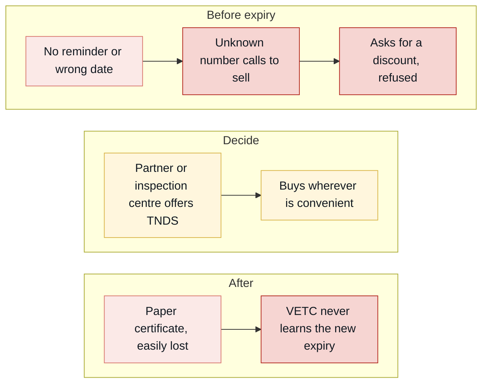
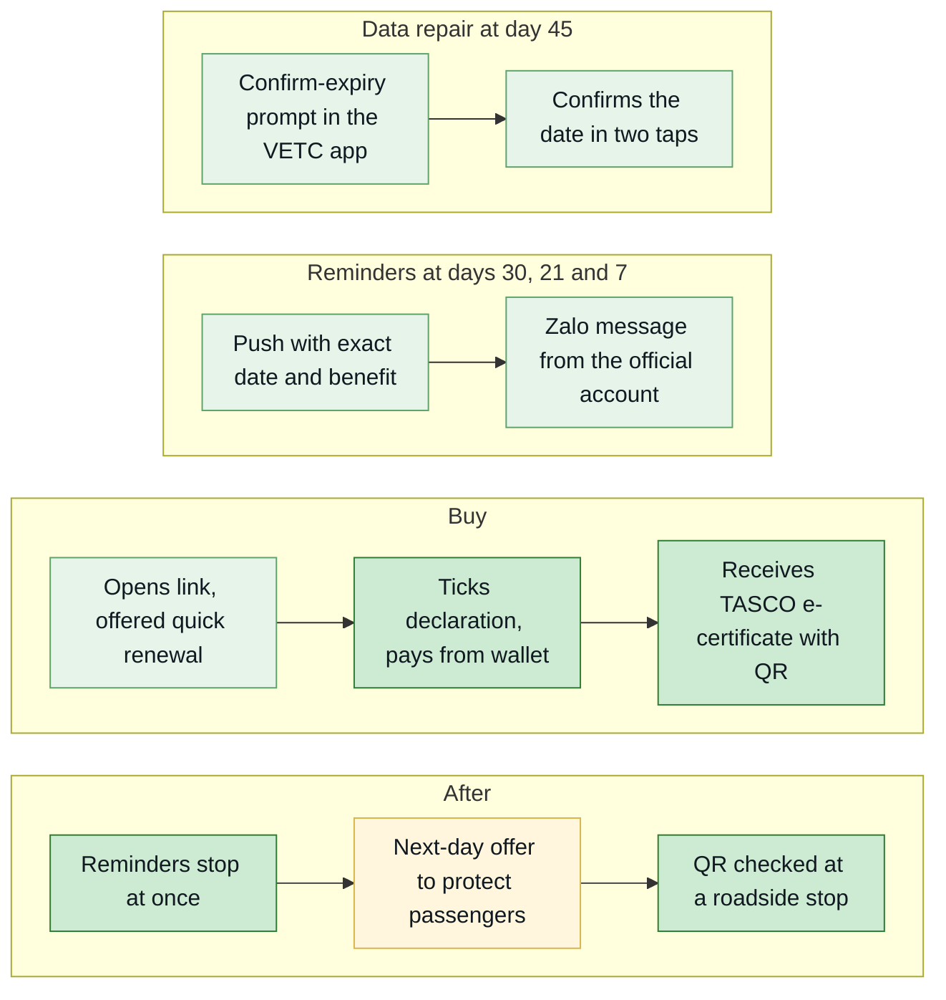
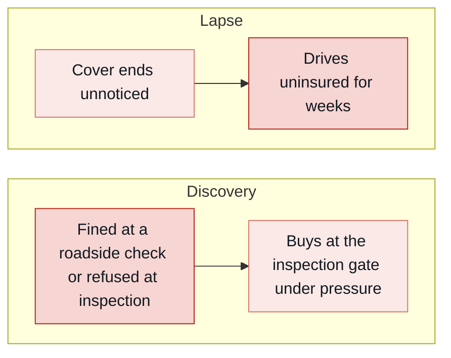
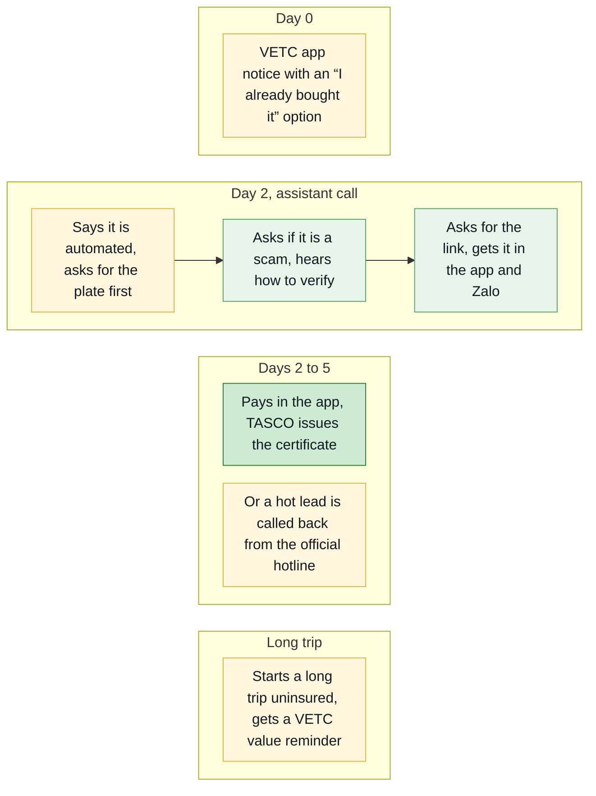
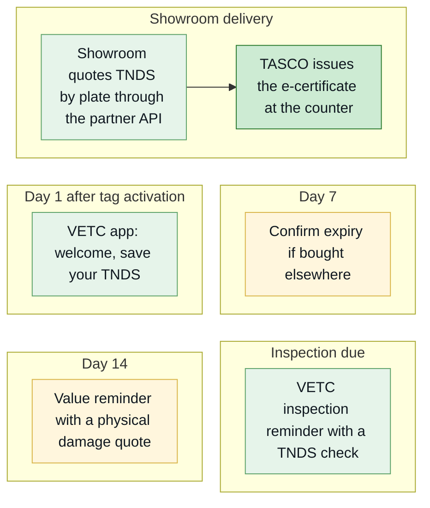
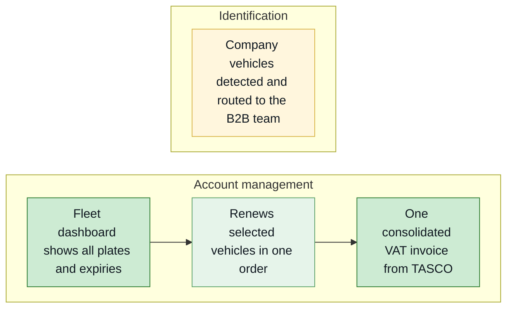
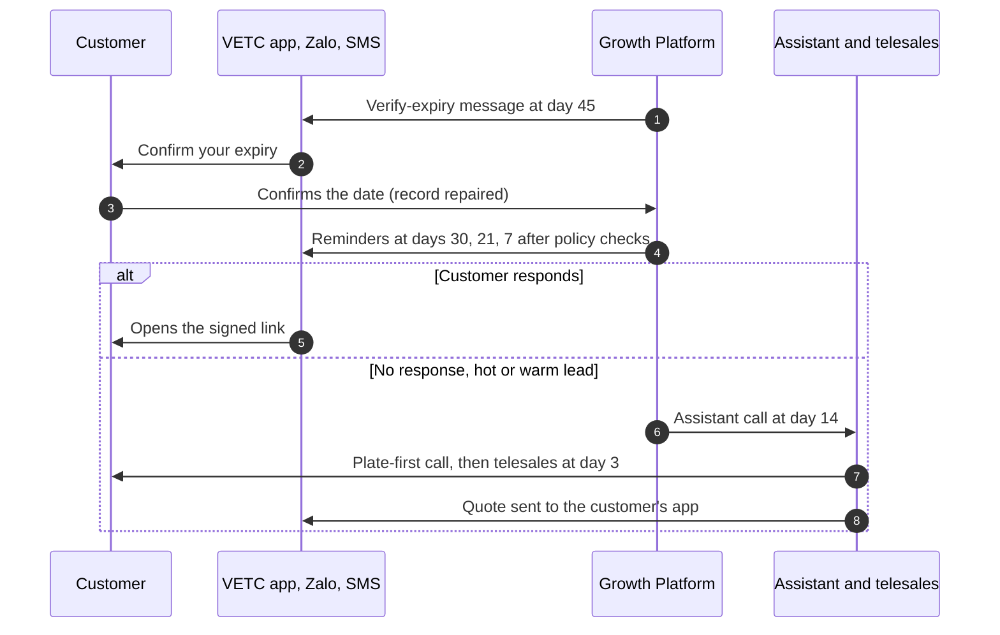
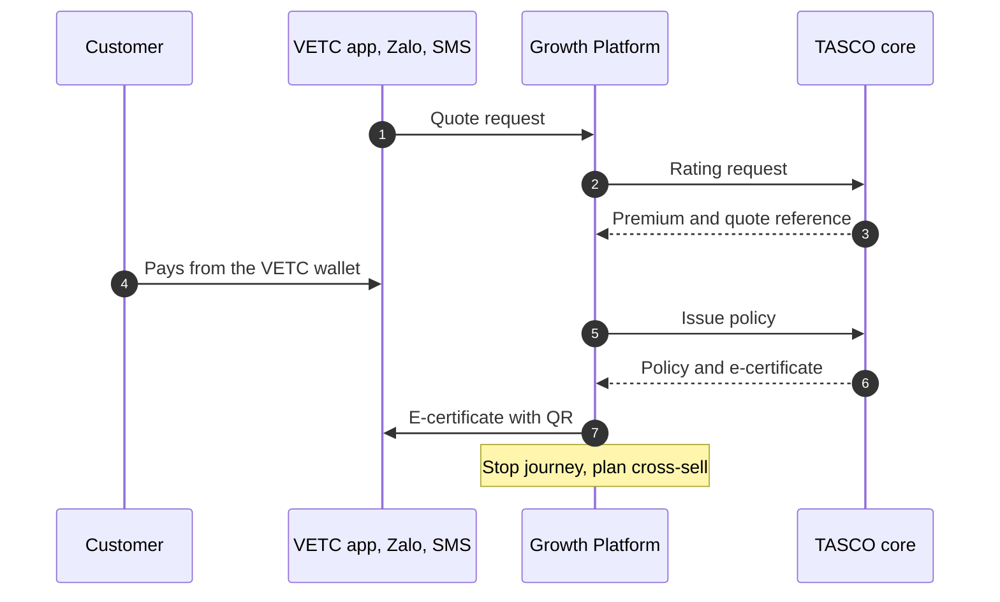
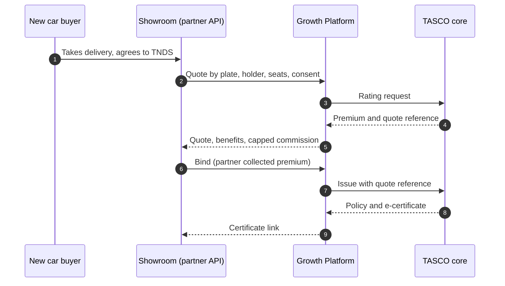
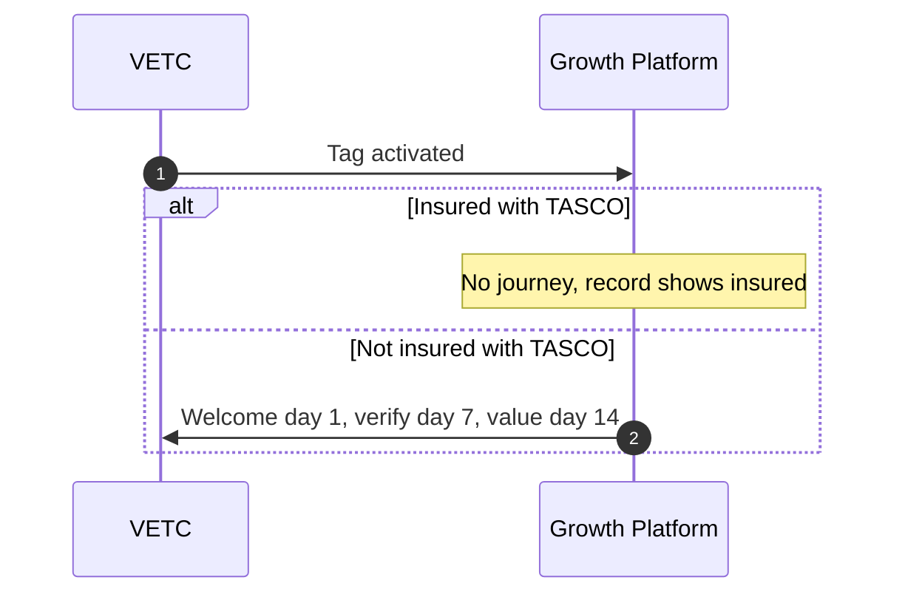

# Introduction

## Purpose

This document describes the people the TASCO Growth Platform serves and the journeys it gives them. It sets out five customer personas and thirteen staff and partner personas, compares today's journeys with the future journeys, shows how the service works behind each journey, and lists the pain points and moments of truth the design responds to.

## Scope

Customer journeys for renewal, conquest, uninsured recovery, new-vehicle onboarding, cross-sell and fleet, and the working journeys of telesales agents, rule authors and approvers. Screen navigation and task flows belong to TGP-UX-03 Information Architecture and Navigation.

The personas are proto-personas. They are built from the client brief (6 million drivers, 70 to 80% app use, a discount mindset, distrust of sales calls, partner-led sales, near-zero own-channel renewals) and from the behavioural signals the platform uses: toll trips, long trips, app sessions, wallet balance, auto top-up, consent and complaints. Names, ages and quotes are illustrative and are validated with customer interviews and telesales call reviews in discovery. Sentiment scores in the journey diagrams run from 1 (very negative) to 5 (very positive) and are design hypotheses.

## Audience

The TASCO product owner, campaign managers, the telesales lead, compliance, and the iorta TechNXT business analysis and UX team.

## Related documents

| ID | Title |
|---|---|
| TGP-BUS-01 | Business Context and Growth Strategy |
| TGP-BUS-02 | Functional Requirements Specification |
| TGP-BUS-04 | User Stories and Acceptance Criteria |
| TGP-UX-03 | Information Architecture and Navigation |
| TGP-UX-04 | Usability Testing Plan |

# Persona index

| ID | Persona | Type | Segment (TGP-BUS-01) | Platform role |
|---|---|---|---|---|
| PC-1 | Private car owner, commuter | Customer | SEG-3 renewal, SEG-4 conquest | Customer |
| PC-2 | Long-haul driver | Customer | SEG-3 or SEG-4, roadside-led | Customer |
| PC-3 | New car buyer | Customer | SEG-2 new vehicle, SEG-7 partner-led | Customer |
| PC-4 | Lapsed owner | Customer | SEG-1 lapsed or uninsured | Customer |
| PC-5 | Fleet manager | Customer (B2B) | SEG-6 fleet | Fleet portal in the scale phase |
| PS-01 | Telesales agent | Staff | None | Telesales agent |
| PS-02 | Telesales supervisor | Staff | None | Telesales supervisor |
| PS-03 | Campaign manager | Staff | None | Campaign manager |
| PS-04 | Rule author (product) | Staff | None | Rule author |
| PS-05 | Compliance approver | Staff | None | Rule approver, compliance officer |
| PS-06 | Data steward | Staff | None | Data steward |
| PS-07 | Claims handler | Staff | None | Claims handler |
| PS-08 | Partner manager | Staff | None | Partner manager |
| PS-09 | Partner staff using the API (bank or showroom) | External | SEG-7 | Partner system |
| PS-10 | Executive | Staff | None | Executive |
| PS-11 | Support engineer | Staff | None | Support engineer |
| PS-12 | Platform admin and security | Staff | None | Admin |
| PS-13 | Internal auditor | Staff | None | Auditor |

# Customer personas

## PC-1 Anh Minh, 38, Hà Nội: private car owner and commuter

| Dimension | Detail |
|---|---|
| Vehicle and use | Five-seat sedan; commutes and makes weekend trips; 15 to 25 toll trips a month |
| Digital habits | Opens the VETC app weekly to check his balance and top up; uses Zalo daily |
| Insurance today | Bought TNDS last year from a bank partner with his car loan, or at the inspection centre. Does not remember the expiry date or the insurer |
| Goals | Stay legal at inspection and roadside checks with no effort |
| Pain points | "Everyone calls me to sell insurance." Does not know when his cover ends. Paper certificates get lost. Believes he should get a percentage off |
| Triggers to act | Inspection booking; wallet top-up; a credible reminder with an exact date |
| What wins him | Purchase in a trusted app, an instant e-certificate, no calls, roadside assistance |
| Signals the platform sees | Medium app sessions and toll trips; app push enabled; marketing consent given |
| Typical next best action | Ask customer to confirm expiry (if confidence is below 0.5), then a one-tap renew link by app or Zalo |

## PC-2 Chú Hùng, 51: long-haul driver between Thanh Hóa, Hà Nội and Hải Phòng

| Dimension | Detail |
|---|---|
| Vehicle and use | Seven-seat MPV, often carrying family or passengers; more than 2,000 highway km a quarter |
| Digital habits | Uses the VETC app for wallet auto top-up; prefers calls to reading |
| Goals | Help on the road if the car breaks down; passengers protected |
| Pain points | Breakdowns far from home; unsure what TNDS covers (it does not cover his passengers or his own car) |
| What wins him | 24/7 roadside assistance, made relevant by his long trips and toll use; personal accident cover per seat for seven seats; later, never-lapse auto renewal (roadmap) |
| Signals the platform sees | Many highway kilometres over 90 days, auto top-up on, wallet balance above the premium |
| Typical next best action | AI voice assistant then telesales if hot with call consent; otherwise a one-tap renew link |

## PC-3 Chị Thảo, 32, TP. Hồ Chí Minh: new car buyer

| Dimension | Detail |
|---|---|
| Moment | Has just taken delivery; the showroom fitted the VETC tag, which sends a tag-activated event |
| Insurance today | The showroom sold TNDS, and possibly physical damage cover, at delivery |
| Goals | Protect a new and expensive car; avoid paperwork |
| Pain points | Paperwork overload at delivery; unclear what she bought and until when |
| What wins her | A welcome message that stores her cover in the app; physical damage cover for a car five years old or less; inspection reminders |
| Channel | Showroom through the partner API, then the VETC app |
| Typical journey | New vehicle: welcome at day 1, confirm expiry at day 7, value reminder at day 14 |

## PC-4 Anh Tuấn, 45, Bình Dương: lapsed owner

| Dimension | Detail |
|---|---|
| Situation | His TNDS expired three weeks ago. He forgot, or lets it lapse until inspection |
| Attitude | Suspicious of calls ("is this a scam?"); focused on price |
| Risk | Fines at roadside checks; inspection refused; personally liable after an accident |
| What wins him | A clear, unpressured service notice with an "I already bought it, tell us" option; a quick fix in the app; an assistant that proves it is genuine by asking for his plate first |
| Typical journey | Uninsured recovery: notice today, assistant call at day 2 (hot or warm), telesales at day 5 (hot) |
| Typical next best action | Urgent: vehicle uninsured |

## PC-5 Chị Lan, 41: fleet manager at a logistics company with 40 vehicles

| Dimension | Detail |
|---|---|
| Situation | Company-owned trucks and vans, each renewing on a different date |
| Goals | No vehicle off the road for lack of TNDS; one invoice; one contact |
| Pain points | Spreadsheet tracking; many invoices; individual sales calls to her drivers |
| What wins her | An account manager in the B2B team now; a fleet dashboard with one view and a consolidated VAT invoice in the scale phase |
| Channel | B2B team; partner type fleet |
| Treatment | Excluded from consumer journeys and assistant campaigns |

# Staff and partner personas

## Goals and pains

| ID | Persona | Goals | Pains today |
|---|---|---|---|
| PS-01 | Telesales agent | Close more with fewer calls | Cold lists; customers distrust calls; cannot take payment |
| PS-02 | Telesales supervisor | Team productivity and compliance | No view of lead quality or script adherence |
| PS-03 | Campaign manager | Grow policies at a controlled cost | No reliable expiry data; blunt campaigns |
| PS-04 | Rule author (product) | Change scoring, journeys and wording quickly and safely | An IT ticket for every change |
| PS-05 | Compliance approver | Nothing unlawful reaches a customer; every data request answered on time | Manual review of wording; opaque automated calls; no single record of data requests |
| PS-06 | Data steward | Customer data the business can trust | Duplicates; one record in ten verified |
| PS-07 | Claims handler | Fast and complete first notices | Late, incomplete notifications |
| PS-08 | Partner manager | Grow partner sales; settle commission cleanly | Manual statements; disputes |
| PS-09 | Partner staff using the API | Close insurance with the main sale | Re-keying data; slow issuance |
| PS-10 | Executive | Visible growth and return on investment | Anecdotal reporting |
| PS-11 | Support engineer | A stable platform | Silent integration failures |
| PS-12 | Platform admin and security | Least-privilege access | Shared accounts |
| PS-13 | Internal auditor | Evidence on demand | Scattered, editable logs |

## What they do on the platform

| ID | Jobs on the platform | Main screens | Success measure |
|---|---|---|---|
| PS-01 | Work hot, verified, interested customers with talking points; send the quote to the customer's VETC app during the call | Telesales inbox, Customer 360 | Handoff win rate (K-08); first contact within 2 business hours |
| PS-02 | Assign handoffs; rehearse assistant scripts; monitor outcomes | Telesales inbox, Voice assistant | Win rate; service-level adherence |
| PS-03 | Prioritised queue, journeys, assistant campaigns, event simulator, economics | Leads, Journeys, Voice assistant, Dashboard | K-00, K-10 |
| PS-04 | Draft, validate, simulate and submit rule changes | Business rules | Rule-change lead time of one day or less |
| PS-05 | Four-eyes approval; copy guard; governance KPIs; log data requests, verify identity, export or erase, or refuse with a reason | Approvals, Audit, Data requests, governance dashboard | No copy-guard or contact-policy breaches; no overdue data request |
| PS-06 | Ingest data; work the data-quality queue; lineage; corrections with evidence | Data quality, Customer 360 | K-01 usable-expiry rate |
| PS-07 | Accident-report queue and status changes within the acknowledgement time | Claims | Share acknowledged within 4 hours |
| PS-08 | Onboard partners, issue keys, suspend, review statements | Partners | Active partners on the API; no disputes |
| PS-09 | Quote by plate, bind, instant e-certificate, statement | Partner API | Time to certificate under one minute |
| PS-10 | Growth, channels, economics, adoption | Dashboard | K-00, premium, cost per policy |
| PS-11 | Integration status, jobs, reconciliation | Operations | Service levels (TGP-BUS-03) |
| PS-12 | Users, roles, regions, lockout and two-factor reset | Users | No orphan accounts; two-factor coverage of privileged roles 100% |
| PS-13 | Audit search; hash-chain verification | Audit | Chain verifies daily |

# Customer journeys

In the journey diagrams, each row is a stage and the fill colour shows how the customer feels at each step, on a scale from 1 (dark red, very poor) through 3 (amber, neutral) to 5 (dark green, very good).

## Renewal of a TASCO policy (PC-1)

Today Anh Minh receives no reminder from TASCO, or one with the wrong date. The diagram shows how that feels.

With the platform, the renewal starts in the app he already uses, at the right time, and ends in a purchase without a phone call.

| Stage | Touchpoint | Customer doing and feeling | Pain point | Design response | Measure |
|---|---|---|---|---|---|
| Day 45: verify | Verify-expiry service message by push or Zalo | Confirms or corrects expiry; "how do they know?" is answered by the VETC app context | A wrong date erodes trust | Data repair in ten seconds | Confirmation rate |
| Day 30: first reminder | First reminder by push, Zalo or SMS | Notices it; may renew straight away | Too many messages | Caps of one a day and three a week; quick renewal in three steps when he qualifies | Click-through, conversion |
| Day 21: value | Value reminder | "Same price everywhere, so what else do I get?" | Generic benefits | Benefits chosen for this driver, with the reason | Conversion |
| Day 14: assistant | Assistant call (hot or warm) | Suspicion turns to trust; verifies plate, asks price, chooses link or adviser | Plate misheard | Plate first, three attempts, link option | Outcomes, opt-out rate |
| Day 7: urgent | Urgent reminder | Mild urgency; renews in the app | Payment friction | Wallet payment, idempotent | Conversion |
| Day 3: telesales | Telesales call (hot) | Wants help or reassurance | Feels like a sales call | Talking points, trust script, quote sent to the app, no payment by phone | Win rate |
| Day 0: expiry | Expiry-day service message | Worried about fines | None | Clear lapse message, no scare tactics | Lapse rate |

Anh Minh is offered quick renewal ("Gia hạn nhanh") when nothing needs to change: his vehicle use and seats were confirmed in the last year, the cover is TNDS only and his wallet covers the premium. He opens the link, ticks the declaration and taps "Xác nhận thanh toán". If he wants to add personal accident cover, or the app needs him to confirm his vehicle first, he uses the full six-step flow, which is always one tap away as "Tùy chỉnh gói bảo hiểm" (FR-119).

All steps stop as soon as the vehicle has an active TASCO TNDS policy; any touchpoint that falls due afterwards is cancelled with the reason "already insured with TASCO". The target is a median renewal time of 60 seconds or less (NFR-035).

## Conquest: insured elsewhere or insurer unknown (PC-1, PC-2)

Steps run at 45, 30, 21, 14 (assistant call, hot leads only) and 7 days before expiry. The conquest reminder invites the driver to renew "lần này" (this time) in the VETC app with TASCO, together with the top benefit for that driver. The emotional curve moves from indifference ("I always renew at the inspection centre") to curiosity (convenience, roadside assistance), and the decision often comes at day 7 if the wallet covers the premium. The key moment is a wallet top-up within 30 days of expiry: the customer is in the app with funds, and the first reminder arrives by push.

## Uninsured recovery (PC-4)

Today the lapse goes unnoticed until a roadside check or an inspection.

With the platform, Anh Tuấn hears about it first from VETC, in a helpful tone, and can fix it in the app.

The recovery journey applies to vehicles lapsed up to 60 days: a lapsed notice on day 0, an assistant call on day 2 (hot or warm) and a telesales call on day 5 (hot). The first action offered is "I already bought it", which repairs the data and stops the reminders. The tone is helpful, never accusatory.

## New vehicle onboarding (PC-3)

A new tag usually means a new car, so the tag-activated event enrols the vehicle. If the showroom sold the TNDS through the partner API, the partner record raises the expiry confidence and the platform does not pitch TNDS again. Physical damage cover can be quoted at once but is paid only after a vehicle inspection has been recorded.

## Cross-sell after purchase

The day after a TNDS-only purchase, and only with marketing consent, the customer receives a message that TNDS protects only third parties, with an offer of personal accident cover per seat or physical damage cover. It is never sent if add-ons were already bought.

## Fleet (PC-5)

Routing to the B2B team and exclusion from consumer journeys are in place today. The fleet dashboard and consolidated invoice are in the scale phase.

# Staff journeys

## A telesales agent's day

| Time | Activity | Platform support | Feeling |
|---|---|---|---|
| 08:00 | Signs in | Lands on the telesales inbox, filtered to her region | Neutral |
| 08:15 | Claims the first hot handoff | Verified plate, "customer asked about price", talking points | Confident: this customer asked for a call |
| 08:20 | Calls | Trust script; official hotline | Relief: the customer expects the call |
| 08:30 | Prepares a quote and sends it to the customer's app | Sell tab with benefits; quote priced by TASCO core; "Send to customer" | Efficient: the customer pays in the app while still on the line |
| 08:35 | Records the outcome | Won or callback, with a note | Accomplished |
| 11:00 | Calls back | Handoffs in callback status | In control |
| 17:00 | Reviews the day | Supervisor dashboard; wins recorded | Recognised |

## Rule author and approver changing the scoring

The author has an idea ("long-distance drivers convert better"), drafts the change in the rules studio, validates it, simulates it on five customers and submits it with a description. The approver receives a notification, reviews the differences and the simulation, and approves with a comment. The change is active within seconds and leads are recomputed. There is no IT ticket, no release and no spreadsheet. Self-approval is impossible, and every step is in the audit trail.

## Compliance officer answering a data request

A customer writes to TASCO asking for all the data held about her car. The compliance officer logs the request in "Data requests" with the channel (letter) and the date received, and the platform sets the due time from the service levels, 72 hours, to be confirmed by TASCO legal. She checks the customer's identity, records the check, and exports the data file to send back by a secure channel. The request closes as completed, with its timeline in the audit trail. An erasure request is handled the same way, except that the platform refuses it, with the reason recorded, while a policy is still in force. Requests due within 24 hours or overdue appear in her notifications.

# Service blueprints

## Renewal and conquest

The lanes show who acts at each stage, from the data-repair prompt to the e-certificate, and what happens when the customer does not respond to digital reminders. The first diagram covers data repair and reminders, the second the purchase.

| Stage | Customer action | Frontstage | Behind the scenes | Fail point and mitigation |
|---|---|---|---|---|
| Data repair (day 45) | Confirms expiry | Verify-expiry message by push or Zalo | Record updated at confidence 0.75; lead recomputed | Customer ignores it: expiry estimated from inspection cycle and tag anniversary; the assistant asks "which month?" |
| Reminders (days 30, 21, 7) | Reads and opens the link | First or conquest reminder, value reminder, urgent reminder | Contact policy and copy guard checked before sending | Cap reached: skipped with the reason. Outside hours: deferred to the next run inside the window |
| Assistant (day 14; hot or warm for renewal, hot for conquest) | Verifies the plate | Voice assistant | Outcome written back to the record | Plate not recognised: three attempts, then "not verified". Scam concern: trust script |
| Telesales (day 3, hot) | Talks to an adviser | Telesales agent | Handoff, quote priced by TASCO core, quote sent to the app | Staff never take payment; the quote goes to the app |
| Purchase | Pays: quick renewal in three steps, or the full flow | Customer app | Quote claimed, wallet debited, TASCO core issues | Wallet slow: circuit breaker. Issuance fails: automatic refund. Core unavailable: no payable quote until re-rated |
| After sale | Receives the certificate | Purchase confirmation message | Journeys stop; cross-sell planned | None |

## New-vehicle onboarding through a showroom

The first sequence shows the showroom sale through the partner API; the second shows the tag activation that starts the new-vehicle journey.

| Stage | Frontstage | Behind the scenes | KPI |
|---|---|---|---|
| Showroom quote | Partner front end | Quote priced by TASCO core; unknown plate joins the base | Quote-to-bind conversion |
| Bind | Partner front end | Partner-collected premium; commission capped by rule; physical damage only after inspection | Time to certificate |
| Tag activation | None | Event re-evaluates the vehicle | New-vehicle enrolment rate |
| Onboarding messages | VETC app, Zalo | Contact policy checked | K-07 |
| Cross-sell | VETC app | Next-day cross-sell step | K-09 |

# Pain points and design responses

| Ref | Pain point | Persona | Design response | Requirements |
|---|---|---|---|---|
| PP-01 | "I don't know when my insurance expires." | PC-1, PC-4 | Expiry estimate with confidence; confirmation in the app; exact date in every reminder | FR-005, FR-076, FR-025 |
| PP-02 | "Unknown callers try to sell me things; it might be a scam." | PC-1, PC-4 | Disclosure, plate first, trust script, official hotline, no payment on calls | FR-031 to FR-035, FR-040 |
| PP-03 | "I want a discount." | PC-1, PC-4 | Honest regulated-price answer, relevant service value, copy guard | FR-035, FR-058, FR-024 |
| PP-04 | "Buying is faster at the partner." | PC-1, PC-3 | Wallet purchase in the app; partner API so partners sell TASCO instantly | FR-077, FR-065 |
| PP-05 | "I lose paper certificates; police doubt screenshots." | PC-1 | E-certificate with public QR verification | FR-050 |
| PP-06 | "Too many messages." | All | Caps of one a day and three a week, hours 08:00 to 20:00, consent centre, journeys stop on purchase | FR-023, FR-078, FR-019 |
| PP-07 | "I didn't know TNDS doesn't cover my passengers or my car." | PC-2, PC-3 | Explained cover upgrades and bundles | FR-055, FR-054, FR-028 |
| PP-08 | "My drivers get sales calls; I manage 40 renewals in a spreadsheet." | PC-5 | B2B routing; exclusion from consumer journeys; fleet dashboard in the scale phase | FR-070 |
| PP-09 | Agent: "My leads are cold and I can't close on the phone." | PS-01 | Hot, plate-verified handoffs with talking points; quote sent to the app for the customer to pay | FR-040 to FR-042 |
| PP-10 | Product: "Every change needs IT." | PS-04 | Rules studio with simulation and maker-checker | FR-082 to FR-087 |
| PP-11 | Compliance: "I can't review every script and message." | PS-05 | Copy guard on save and send; versioned scripts; audit chain | FR-024, FR-086, FR-099 |
| PP-12 | Data: "Only one record in ten is verified." | PS-06 | One record per vehicle, data-quality queue, lineage, data-repair loop | FR-004 to FR-010 |
| PP-13 | Partner: "Commission statements are late and disputed." | PS-08, PS-09 | Self-service statement; commission capped by rule | FR-067 to FR-069 |
| PP-14 | Claims: "Accidents are reported late with poor information." | PS-07, PC-1 | Accident reporting in the app with location and photos; acknowledgement within 4 hours | FR-071, FR-072 |
| PP-15 | Compliance: "Data requests arrive by phone, email and letter, and I can't show we answered each one in time." | PS-05 | One register of data requests with due times, identity checks and a timeline for each | FR-118 |

# Moments of truth

| Ref | Moment | Who | Why it matters | Platform response |
|---|---|---|---|---|
| MoT-01 | First 10 seconds of a call | PC-1, PC-4 | Decides trust or hang-up | Automated-assistant disclosure; "VETC never asks for OTP or payment"; asks for the plate and never says it |
| MoT-02 | The price question | PC-1, PC-4 | Where discount expectations meet the law | Truthful regulated-price answer, then service value |
| MoT-03 | Tag activation of a new car | PC-3 | Habits form in the first weeks | Welcome, save cover, reminders |
| MoT-04 | Inspection booking | PC-1, PC-4 | Valid TNDS is required at inspection | TNDS check message |
| MoT-05 | Wallet top-up | PC-1, PC-2 | The customer is in the app with funds | Renewal reminder by push |
| MoT-06 | Starting a long trip uninsured | PC-2, PC-4 | Risk is front of mind | Value reminder by push |
| MoT-07 | Expiry day | All | Legal exposure begins | Service notice that ignores marketing caps |
| MoT-08 | The payment tap | All | A double charge or a failure destroys trust | Idempotent purchase; quote claimed once; automatic refund if issuance fails (FR-047, FR-048) |
| MoT-09 | Roadside or inspection check | All | Proof of cover | QR verification page (FR-050) |
| MoT-10 | An accident | All | The moment that justifies insurance | Accident reporting in the app; acknowledgement message; acknowledgement within 4 hours (FR-071) |
| MoT-11 | Saying "stop" | All | Respect builds long-term trust | Immediate do-not-contact, audited (FR-036, FR-078) |
