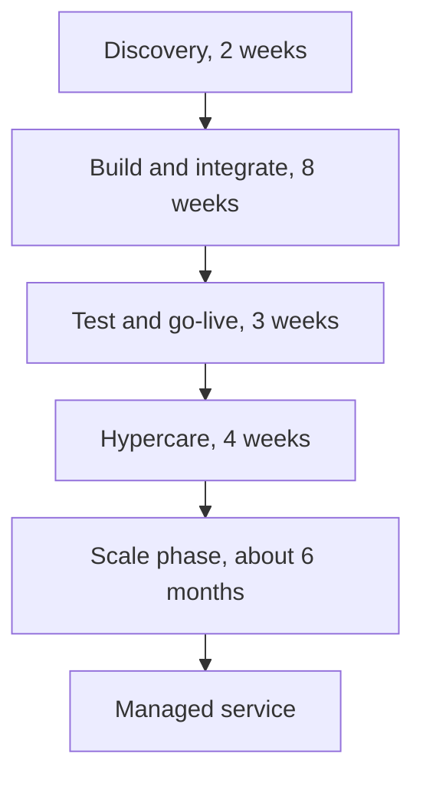

# Introduction

## Purpose

This document sets out the commercial terms and the engagement model for the TASCO Growth Platform: what is delivered in each stage, the team and effort, the prices and payment milestones, run costs, total cost of ownership, governance, assumptions and exclusions. The figures are the same as in the Proposal for the TASCO Motor Insurance Growth Platform (reference ITN-TASCO-2026-001).

## Scope

The MVP, the optional scale phase and the optional managed service. Prices are in US dollars; Vietnamese dong is shown at USD 1 = VND 26,000 (C-01). Prices exclude VAT and any foreign contractor tax. Business-case figures referred to here are illustrative.

## Audience

TASCO procurement and finance, the programme sponsor and the steering committee.

## Related documents

| ID | Title |
|---|---|
| TGP-BUS-01 | Business Context and Growth Strategy |
| TGP-BUS-03 | Non-Functional Requirements |
| TGP-BUS-04 | User Stories and Acceptance Criteria |
| TGP-BUS-05 | Requirements Traceability Matrix |
| TGP-DEL-01 | Project Plan |
| TGP-DEL-03 | RACI Matrix |

# Engagement summary

| Item | Proposal |
|---|---|
| Objective | Take the existing TASCO Growth Platform to a live pilot integrated with TASCO core and VETC's channels, within TASCO's MVP budget of USD 100,000; then, if the pilot succeeds, scale to the full VETC base and run it as a managed service |
| Starting point | A working platform in UAT: 103 API routes, a staff console for 13 roles in Vietnamese and English, a customer app in Vietnamese built to run inside the VETC app, TASCO's app and website, and a Zalo Mini App, and 271 automated tests |
| MVP stages | Discovery (2 weeks), build and integrate (8 weeks), test and go-live (3 weeks), hypercare (4 weeks): pilot live 13 weeks after contract signature |
| After the MVP | Scale phase (about six months, optional) and managed service (optional) |
| MVP price | USD 94,800 fixed, about VND 2.46 billion. A change reserve of USD 5,200 is held by TASCO, so the total is USD 100,000 |
| Commercial options | A: fixed-price MVP (recommended). B: lower fixed price plus a capped technology service fee per policy issued digitally |
| Indicative three-year TCO at full scale | USD 663,558, about VND 17.25 billion, including the scale phase, managed service, enhancement pool and cloud infrastructure; excluding usage fees and TASCO and VETC internal costs |

# Stages, scope and deliverables

| Stage | Scope | Deliverables | Exit |
|---|---|---|---|
| Discovery | TASCO core integration path (catalogue, rating, issuance); data mapping (VETC accounts, partner lists, TASCO policy book); legal confirmations; channel contracts; pilot design with a control group; voice vendor selection support | Discovery report; signed integration specifications; pilot plan; baselined KPIs (TGP-BUS-01) | Steering committee sign-off |
| Build and integrate | Four two-week sprints: TASCO core and data; VETC wallet and app; channels and voice; partner and hardening. Each ends with a demonstration on the integration sandboxes | Integrated build; rules configured with TASCO's product team | End-to-end demonstration on sandboxes |
| Test and go-live | System integration, UAT, security testing, rehearsed cut-over; pilot of 50,000 to 100,000 vehicles | Production release; runbooks; trained users; pilot dashboard; security test report; test-case workbook | UAT sign-off; go-live |
| Hypercare | Delivery team on hand for the first four weeks of live operation, including on-call cover over Tết | Hypercare report | Four weeks within service levels |
| Scale phase (optional) | Ten priced modules, S1 to S10: full base, VETC sign-on and live events, TASCO app and website, Zalo Mini App, claims integration, inspection and fleet, further partners, data warehouse, calibration and testing, full-scale assurance | Scaled platform; new front doors on the same journeys; fleet portal | KPI review against the base case |
| Managed service (optional) | Support, monitoring, security patching, rule-change support, monthly releases | Monthly service report; quarterly business review | Service levels met |

## MVP scope

| In scope for the MVP | Not in the MVP (scale phase or later) |
|---|---|
| TASCO core: catalogue sync, live rating, bind and issue, daily policy extract | Claims system-to-system integration (first notice handled by queue in the MVP) |
| VETC: initial data load and daily changes, tag-activation events, app web view with signed links, push, wallet debit and refund, reconciliation | VETC single sign-on and live feed of all VETC events (S2) |
| Zalo ZNS from TASCO's existing verified Official Account, and SMS brandname, for approved templates | Additional messaging channels |
| One voice AI vendor, Vietnamese script, plate-first verification, telesales handoff | Multiple voice vendors, outbound voice at full scale |
| Journeys: renewal, conquest, new vehicle, lapsed recovery, cross-sell | A/B testing framework, machine-learning score calibration |
| Products: TNDS (one to three years), personal accident cover per seat, physical damage cover with inspection | Further products |
| Tasco360 live on the partner API as the first partner (or another partner chosen in discovery) | Further partners and partner self-onboarding (S7) |
| Staff console (Vietnamese and English) and customer app (Vietnamese) in TASCO's brand, with TASCO's official contacts | Fleet portal and consolidated invoicing (S6) |
| Customer journeys ready for TASCO's app and website, tested against a sandbox of TASCO's payment gateway | Live in TASCO's app and website (S3) and as a Zalo Mini App (S4) |
| Production hardening, security testing, runbooks, training, cut-over and four weeks of hypercare | Data warehouse feed |
| Pilot cohort of 50,000 to 100,000 vehicles with a control group | Full 6 million vehicle base |

# Timeline and milestones

The plan assumes contract signature by 30 October 2026 and a start on 2 November 2026. Week 13 falls in late January 2027, just before Tết. We propose a controlled soft launch to the first part of the cohort in week 13, a change freeze with 24-hour on-call cover over the holiday, and a ramp-up to the full pilot cohort after Tết. The detailed plan is in TGP-DEL-01 Project Plan.

| Milestone | Week | Date (indicative) | Evidence |
|---|---|---|---|
| M0 Mobilisation | 0 | 30/10/2026 | Contract signed; team onboarded |
| M1 Discovery complete | 2 | 13/11/2026 | Discovery report, integration specifications and pilot design signed off |
| M2 Integrated build | 10 | 08/01/2027 | End-to-end demonstration on sandboxes: core rating and issuance, wallet debit, Zalo message, voice call |
| M3 Acceptance | 13 | 26/01/2027 | UAT signed off; no open critical or high security findings |
| M4 Pilot live and hypercare complete | 17 | 26/02/2027 | Pilot live; four weeks within service levels |

The pilot read-out, with conversion measured against the control group, is planned for early May 2027.

## After the pilot

| Period (indicative) | Release | Content |
|---|---|---|
| 27 January to 26 February 2027 | MVP live, hypercare | Pilot in the VETC app; Zalo ZNS from TASCO's Official Account; voice assistant; Tasco360 on the partner API |
| March 2027 (optional) | S3 TASCO app and website | The same journeys in TASCO's app and website with TASCO's payment gateway |
| Early May 2027 | Pilot read-out | Conversion against the control group; decision to scale |
| May to July 2027 | Scale wave 1 | Full base in province waves (S1); VETC sign-on and live events (S2); Zalo Mini App (S4); score calibration (S9) |
| August to October 2027 | Scale wave 2 | Claims integration (S5); inspection booking and fleet portal (S6); further partners (S7); data warehouse (S8); full-scale assurance (S10) |

# Team and effort

## MVP team

The team is small and senior, with an engagement manager accountable to TASCO for the whole delivery. The business analyst also acts as insurance subject-matter expert and works alongside TASCO's product owner. Discovery and go-live are run on site in Hà Nội; build sprints are delivered from our offshore centre with daily overlap during Vietnam business hours. Effort is in person-days.

| Role | Discovery | Build | Test and go-live | Hypercare | Total |
|---|---:|---:|---:|---:|---:|
| Engagement manager | 5 | 20 | 7.5 | 2 | 34.5 |
| Solution architect | 10 | 20 | 3.75 | | 33.75 |
| Business analyst and insurance SME | 10 | 40 | 15 | 5 | 70 |
| UX and conversation designer | 5 | 10 | | | 15 |
| Senior engineer (integration lead) | 5 | 40 | 15 | 10 | 70 |
| Engineers (backend and frontend) | | 80 | 15 | 10 | 105 |
| QA engineer | | 40 | 22.5 | | 62.5 |
| DevSecOps engineer | | 20 | 7.5 | 5 | 32.5 |
| Total | 35 | 270 | 86.25 | 32 | 423.25 |
| Duration | 2 weeks | 8 weeks | 3 weeks | 4 weeks | 17 weeks |

Because the platform already exists, effort goes to integration, data onboarding, configuration, hardening and the pilot, not to building the console, the customer app or the business logic.

## After the MVP

| Stage | Basis |
|---|---|
| Scale phase | Ten modules, S1 to S10, capped at 566 person-days in total over about six months |
| Managed service | Fixed monthly fee including 40 hours of minor enhancements a month; larger changes drawn from the enhancement pool at the rate card |

## What we need from TASCO and VETC

| Role | Commitment |
|---|---|
| TASCO product owner | About half time throughout; decisions on scope, rules and acceptance |
| TASCO core system lead | Interface specifications, sandbox, support during integration testing |
| VETC data and integration lead | Data extract, events, app, push and wallet interfaces; about half time in discovery and build |
| TASCO compliance and legal | Confirmation of regulatory positions; approval of customer wording and the voice script; sign-offs within five business days |
| TASCO telesales lead and agents | UAT and pilot participation |
| TASCO IT security | Security requirements, access approvals, penetration test scope |

# Commercial options and prices

## MVP price

| Item | USD |
|---|---:|
| Delivery effort at the standard rate card (423.25 person-days) | 107,485 |
| Accelerator credit for reuse of the existing TASCO Growth Platform | (12,685) |
| MVP fixed price (Option A) | 94,800 |
| Perpetual licence for TASCO's use, including source code | Included |
| Up to three on-site visits to Hà Nội (discovery, UAT and go-live) | Included |
| 90-day warranty from go-live | Included |
| Change reserve held by TASCO, used only with TASCO's approval | 5,200 |
| Total within TASCO's MVP budget | 100,000 |

The MVP fixed price is about VND 2.46 billion.

## Option B: shared outcome

Both options deliver the same scope and timeline. Option B lowers the fixed price and links part of the cost to results.

| Component | Basis | Price |
|---|---|---|
| MVP fixed price | Same scope and timeline as Option A | USD 74,800 |
| Technology service fee | VND 10,000 per policy issued digitally through the platform (own channels and partner API) for 12 months after go-live, invoiced quarterly from audited transaction records | Capped at USD 50,000 |
| Scale phase and managed service | As Option A | As Option A |

Option B costs TASCO more than Option A only if more than 52,000 policies are issued through the platform in the 12 months after go-live (USD 20,000 × 26,000 ÷ VND 10,000). That is well above the expected pilot volume, so the option mainly suits a fast roll-out.

The fee must be structured as a technology service fee per processed transaction, not as insurance commission or brokerage. Under the Law on Insurance Business 08/2022/QH15, commission may be paid only to licensed intermediaries. The fee must not be passed on to customers or affect the premium. This structure is to be confirmed by TASCO legal.

## After the MVP (optional, priced now for transparency)

| Module | Scope | Reuses | Person-days | USD |
|---|---|---|---:|---:|
| S1 Full base roll-out | 6 million vehicles in province waves, with a capacity test before each wave | VETC data feed; MVP platform | 90 | 22,500 |
| S2 VETC sign-on and live events | VETC single sign-on; trips, inspections and top-ups as live events | VETC identity and event stream | 70 | 17,500 |
| S3 TASCO app and website | The same journeys inside TASCO's app and e.baohiemtasco.vn, TASCO account sign-in, TASCO payment gateway | TASCO app, website and payment gateway | 26 | 6,500 |
| S4 Zalo Mini App | The same journeys as a Zalo Mini App with Zalo sign-in | TASCO's verified Zalo Official Account | 40 | 10,000 |
| S5 Claims integration | First notice of loss passed system to system to TASCO core | TASCO core claims | 60 | 15,000 |
| S6 Inspection and fleet | Inspection booking; fleet portal with consolidated invoicing | VETC inspection service | 90 | 22,500 |
| S7 Further partners | Partner waves and partner self-onboarding | Partner API; Tasco360 | 50 | 12,500 |
| S8 Data warehouse | Daily feed and management reporting | TASCO data warehouse | 40 | 10,000 |
| S9 Calibration and testing | Score calibration from pilot outcomes; A/B testing | Pilot data | 60 | 15,000 |
| S10 Full-scale assurance | Performance and security retest at full scale | MVP test assets | 40 | 10,000 |
| **Total** | | | **566** | **141,500** |

Each module is priced on its own at a blended USD 250 per person-day and capped, so TASCO can take the modules in the order that suits it. Reuse keeps them small: the Zalo Mini App and TASCO's app and website are new front doors on journeys that already exist, and partners such as Tasco360 use the partner API delivered in the MVP. S3 can start straight after go-live, at a fixed USD 6,500, if TASCO wants its own app and website live before the pilot read-out.

| Service | Basis | Price (USD) |
|---|---|---:|
| Managed service | Monthly, 12-month initial term, includes 40 hours of minor enhancements a month | 6,900 per month |
| Enhancement pool | Drawn down at the rate card by work order | 48,000 per year (budgetary) |

## Rate card

The rate card applies to change requests, the scale phase and the enhancement pool.

| Role | Daily rate (USD) |
|---|---:|
| Engagement manager | 380 |
| Solution architect | 360 |
| Business analyst and insurance SME | 260 |
| Senior engineer or DevSecOps engineer | 260 |
| UX and conversation designer | 230 |
| Engineer | 210 |
| QA engineer | 190 |

## Option comparison

| Criterion | Option A | Option B |
|---|---|---|
| Budget certainty for TASCO | High: fixed price | Medium: fee varies with volume, capped |
| Shared risk on outcomes | Low | Higher |
| Upfront cost | USD 94,800 | USD 74,800 |
| Administration | Low | Quarterly reconciliation from audited order records |
| Best when | The budget is approved and certainty matters | TASCO prefers to link cost to results |

# Payment milestones

| Milestone | Trigger | Share | Option A (USD) | Option B (USD) |
|---|---|---:|---:|---:|
| M0 Mobilisation | Contract signed, team onboarded (week 0) | 15% | 14,220 | 11,220 |
| M1 Discovery complete | Discovery report and pilot design signed off (week 2) | 15% | 14,220 | 11,220 |
| M2 Integrated build | End-to-end demonstration on sandboxes (week 10) | 25% | 23,700 | 18,700 |
| M3 Acceptance | UAT signed off; no open critical or high security findings (week 13) | 25% | 23,700 | 18,700 |
| M4 Pilot live | Go-live plus four weeks of hypercare within service levels (week 17) | 20% | 18,960 | 14,960 |
| Total | | 100% | 94,800 | 74,800 |

Invoices are payable within 30 days. The scale phase is invoiced monthly in arrears against timesheets, up to the cap. The managed service is invoiced monthly in advance. Option B fees are invoiced quarterly from the platform's transaction records.

# Run cost

## Cloud infrastructure in Vietnam

The estimate assumes managed Kubernetes and managed PostgreSQL from a provider in Vietnam, for example Viettel IDC, VNG Cloud or FPT Cloud, or the Tasco group's private cloud. The provider is chosen in discovery and TASCO pays for infrastructure directly.

| Component | Pilot (USD a month) | Full scale (USD a month) | Sizing basis |
|---|---:|---:|---|
| Application nodes (Kubernetes) | 450 | 900 | 3 to 6 nodes of 4 vCPU and 16 GB |
| PostgreSQL HA primary and standby | 600 | 1,400 | 8 vCPU and 32 GB, rising to 16 vCPU and 64 GB plus a reporting replica |
| Backups and object storage (35-day PITR) | 80 | 150 | NFR-051 to NFR-053 |
| Load balancer, WAF and egress | 150 | 250 | Rate limiting at the edge |
| Monitoring, logs and traces | 150 | 300 | NFR-047 to NFR-049 |
| Non-production environments | 200 | 350 | Synthetic or masked data only (NFR-033) |
| Secrets, key management and other | 20 | 50 | Key rotation (NFR-023) |
| Total | about 1,650 | about 3,400 | |

## Usage costs

Usage costs are paid by TASCO or VETC directly to the providers and are not in the TCO. Rates are the channel costs configured in the platform; volumes are the base case at full scale from TGP-BUS-01.

| Item | Unit cost (VND) | Base-case volume | Per year (VND) |
|---|---:|---:|---:|
| Voice AI minutes | 1,500 a minute × 1.6 minutes | 497,250 calls | about 1.2 billion |
| Zalo ZNS and SMS | 300 and 700 a message | 5 sends to each of about 2.8 million profiles | about 2.2 billion |
| App push | 0 | Not applicable | 0 |
| Telesales (internal staff time, for reference) | 6,000 a minute × 4.5 minutes | 50,000 calls | about 1.35 billion |

# Total cost of ownership

The table shows the expected cost to TASCO over three years with Option A if the pilot succeeds and the platform is scaled to the full base. Year 1 runs from November 2026 to October 2027. The scale phase starts only after a successful pilot read-out.

| USD | Year 1 | Year 2 | Year 3 | Three years |
|---|---:|---:|---:|---:|
| MVP (fixed price) | 94,800 | | | 94,800 |
| Scale phase, modules S1 to S10 (capped) | 141,500 | | | 141,500 |
| Managed service | 55,200 | 82,800 | 85,284 | 223,284 |
| Enhancement pool (optional) | | 48,000 | 48,000 | 96,000 |
| Cloud infrastructure in Vietnam | 25,150 | 40,800 | 42,024 | 107,974 |
| Total | 316,650 | 171,600 | 175,308 | 663,558 |
| About VND | 8.23 bn | 4.46 bn | 4.56 bn | 17.25 bn |

Year 3 includes a 3% annual increase on the managed service and infrastructure. If TASCO stops after the pilot and keeps the platform running at pilot scale, the year-1 cost is about USD 168,150: the MVP, eight months of managed service and eleven months of pilot infrastructure.

In the illustrative base case (TGP-BUS-01), the year-2 platform cost of about VND 4.46 billion is about 5% of the premium through the platform (VND 86.3 billion). The voice assistant's saving on qualifying calls alone, about VND 12.2 billion a year against telesales, is larger than the annual platform cost. The pilot's control group must confirm how much of the premium is genuinely new before scale-up.

For comparison, building an equivalent platform from scratch would typically take 12 to 15 months and cost USD 450,000 to 650,000 before running costs. A global CRM and marketing-cloud stack licensed for six million contacts usually costs more each year in licences alone than this three-year TCO. These are indicative market ranges. Reuse also keeps the running cost down: TASCO does not license or maintain a second core, payment system or customer app.

# Governance and service levels

## Governance forums

| Forum | Frequency | Participants | Purpose |
|---|---|---|---|
| Steering committee | Monthly | TASCO and VETC sponsors, iorta TechNXT engagement lead | Direction, budget, milestones, risks, pilot results |
| Product council | Every two weeks | TASCO product owner, VETC lead, iorta TechNXT analyst and architect | Priorities, rule changes, scope decisions |
| Sprint review | Every two weeks | Product owner and key users | Demonstration against the acceptance criteria in TGP-BUS-04 |
| Change control | As needed | Product owner and engagement lead | Changes to scope, price or time |
| Compliance checkpoint | Each release | TASCO compliance | Customer wording, consent, privacy, audit evidence |

Delivery runs in two-week sprints. A story is done when its acceptance criteria are met, tests meet the NFR-042 thresholds, lint is clean, the API description is updated and security checks pass. After go-live, business rule changes go through the rules studio with maker-checker approval and need no release.

## Managed service levels

Business hours are 08:00 to 17:30 Vietnam time, Monday to Friday, excluding public holidays. Support is provided in English and Vietnamese. The service includes monitoring and alerting, security patching, monthly releases, rule-change support, a quarterly restore test, a monthly service report and a quarterly business review.

| Priority | Example | Response | Restoration or workaround |
|---|---|---|---|
| P1 Critical | Customers cannot buy; suspected data breach | 30 minutes, 24 hours a day, 7 days a week | 4 hours |
| P2 High | A journey run fails; one integration is down | 2 business hours | 1 business day |
| P3 Medium | A defect with a workaround | Next business day | Next scheduled release |
| P4 Low | A question or small enhancement | 3 business days | Planned |

# Licence, warranty and exit

TASCO receives a perpetual, royalty-free licence to use, modify and run the platform for the business of TASCO Insurance and the Tasco group, with the complete source code and documentation. iorta TechNXT keeps ownership of the underlying platform and may improve it for other clients, without ever using TASCO data. TASCO owns its data, its rule sets and configuration, its content and branding, and the adapters written specifically for TASCO's and VETC's systems.

For 90 days after go-live, iorta TechNXT fixes at its own cost any defect where the platform does not meet the accepted acceptance criteria. If TASCO moves support to its own team or another partner, iorta TechNXT provides a structured knowledge transfer at the rate card, and all data can be exported in open formats.

# Assumptions

| Ref | Assumption |
|---|---|
| C-01 | Exchange rate USD 1 = VND 26,000. Prices are quoted in USD; invoices can be issued in USD or VND at a rate agreed at contract |
| C-02 | The rate card applies to change requests, the scale phase and the enhancement pool |
| C-03 | One FTE-week is five person-days; one month is 21 person-days |
| C-04 | TASCO provides core interface documentation (catalogue, rating, issuance) and a sandbox, or agrees the interim rating path, by the end of week 2; VETC provides sandboxes for wallet, push and the app web view by the same date; production access is available by week 10 |
| C-05 | One voice AI vendor (telephony with Vietnamese ASR and TTS) is selected in discovery and contracted directly by TASCO or VETC; per-minute costs are passed through |
| C-06 | The pilot cohort is 50,000 to 100,000 vehicles in one or two provinces, with a randomised control group |
| C-07 | TASCO legal confirms tariff, commission caps, contact policy, the PDP basis and data residency in discovery; delays move milestones day for day |
| C-08 | Hosting is in Vietnam on managed Kubernetes and PostgreSQL chosen in discovery; TASCO pays for it directly |
| C-09 | The existing platform is the baseline. Open engineering findings (TGP-BUS-05 appendix) that affect MVP scope are closed in the MVP; the rest in the scale phase |
| C-10 | Acceptance is against the agreed acceptance criteria in TGP-BUS-04 for the stories in MVP scope |
| C-11 | The console is in English and Vietnamese and the customer app in Vietnamese. Customer wording is written or approved by TASCO and VETC |
| C-12 | ZNS messages are sent from TASCO's existing verified Zalo Official Account. TASCO and VETC contract the voice AI vendor and the SMS brandname directly; iorta TechNXT helps with selection and integration |
| C-13 | Reuse first: TASCO core, TASCO's app and website, the Zalo Official Account, Tasco360, the contact centre, and VETC's app, wallet and data are used through their existing interfaces. Each reuse decision is recorded in the discovery report |
| C-14 | If module S3 is taken up, TASCO provides a sandbox of its payment gateway and confirms that its app can open the journeys in a web view |

# Exclusions

- Licences and usage fees of third-party services: voice AI minutes, Zalo official account and ZNS, SMS brandname, push providers and cloud infrastructure.
- Changes inside TASCO core, the VETC app's native code, the VETC wallet or the VETC identity provider, beyond consuming their APIs.
- Claims adjudication, reserving, reinsurance and finance-system integration (accounting entries, VAT e-invoicing).
- Independent penetration testing by a third party (recommended; indicatively USD 6,000 to 10,000 in Vietnam), certification and audit fees.
- Migration of historical TASCO policy archives beyond the fields needed for expiry.
- Legal, actuarial or regulatory advice. The platform applies TASCO's decisions; it does not make them.
- On-premise hardware, and 24-hour cover for P2 to P4 incidents (available on request).
- Marketing spend, call-centre staffing and customer communication costs.

# Commercial risks

The full risk register is in TGP-DEL-04 Risk Register.

| Risk | Mitigation |
|---|---|
| TASCO core does not expose a rating interface in time | Interim path: approved tariff tables synchronised from core, with core re-rating at issue; decision in week 2 |
| Integration sandboxes or credentials are late | Simulated connectors already exist, so the build continues; milestone dates move day for day by agreement |
| Legal confirmations take time (data sharing, consent wording, loyalty) | Conservative defaults; features stay switched off until approved |
| Scope grows during the MVP | Clear MVP boundary; change control; USD 5,200 reserve under TASCO's control |
| TASCO's app, website or payment gateway cannot host the journeys as planned | Capability checked in discovery; the journeys also work as a link from TASCO's site; S3 is outside the MVP critical path |
| Dispute over Option B fees | Fee computed from the platform's audited, hash-chained order records |
