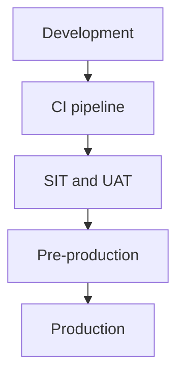
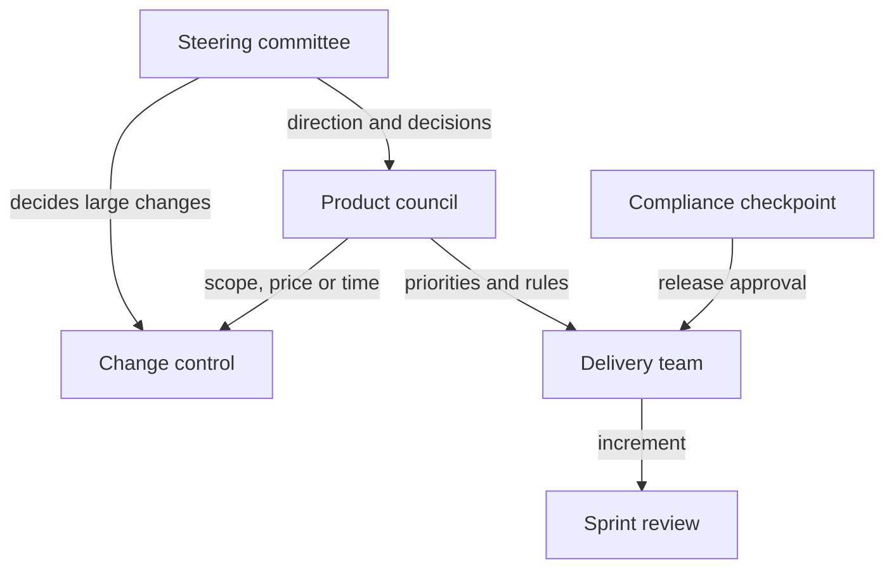

# Introduction

This document describes how iorta TechNXT runs the delivery of the TASCO Growth Platform (the platform): the sprint cadence, the definitions of ready and done, the quality gates, the environments, and the governance forums through which TASCO Insurance and VETC steer the work.

It applies to the MVP described in TGP-DEL-01 Project Plan, from discovery to the end of hypercare, and to releases made during the pilot.

The audience is the TASCO product owner, the delivery team, TASCO IT and the members of the steering committee and product council.

Related documents:

| ID | Title | Relationship |
|---|---|---|
| TGP-DEL-01 | Project Plan | Stages, sprints and milestones |
| TGP-DEL-03 | RACI Matrix | Roles for each activity |
| TGP-DEL-04 | Risk Register | Risks reviewed in the forums below |
| TGP-QA-01 | Test Strategy | Test levels and coverage targets |
| TGP-OPS-06 | Release and Change Management | Production release process |
| TGP-ARC-07 | Architecture Decision Records | Where design decisions are recorded |

# Approach

We run two-week sprints for the build and use the contract milestones M1 to M4 as stage gates. Each sprint ends with a working demonstration on the integration sandboxes, so TASCO sees progress every two weeks.

Some changes cannot simply be iterated into production in an insurance business: premiums for TNDS, customer wording, consent, contact rules, partner commission, security and personal data. For these, the platform enforces approval by a named second person before the change takes effect, and the approval is kept in the audit trail.

Most business behaviour lives in rule sets, not in code. Scoring weights, journey timings, message wording and benefits are configured with TASCO's product team in the rules studio during the sprints, rather than specified on paper and handed over.

# Lanes of change

Every change reaches production through one of three lanes.

| Lane | Examples | Path to production | Approver |
|---|---|---|---|
| Code | New adapter, defect fix, screen change | Pull request, CI quality gates, pre-production, release | Peer reviewer; TASCO change advisory board for production |
| Security configuration | Roles and permissions, MFA settings, secrets | Pull request with security review, then release | TASCO IT security |
| Business rules | Scoring, journeys, benefits, message templates, voice script, commission, contact rules | Rules studio: draft, check, simulate, submit, approve | A different user with approval rights; compliance officer for restricted rule types |

The platform refuses self-approval of a rule change. Contact rules, wording controls, access policies, commission and retention can only be approved by a compliance officer. Product changes from TASCO core arrive through the catalogue sync at 01:00 Vietnam time as a proposed change and go through the same approval. In production, the price a customer pays is set by TASCO core.

# Sprint cadence

## Roles

| Role | Held by | Responsibility |
|---|---|---|
| Product owner | TASCO | Owns the backlog, sets priorities, accepts stories |
| Engagement manager | iorta TechNXT | Runs the delivery, removes impediments, reports status |
| Business analyst and insurance SME | iorta TechNXT | Writes stories and acceptance criteria; configures rules with TASCO |
| Delivery team | iorta TechNXT | Architecture, integration, engineering, QA, DevSecOps, UX |
| Client experts | TASCO and VETC | Attend refinement and reviews: core system, VETC integration, compliance, telesales |

## Ceremonies

| Ceremony | When | Length | Participants | Output |
|---|---|---|---|---|
| Sprint planning | First day of sprint | 2 hours | Delivery team, product owner | Sprint goal and committed stories |
| Daily stand-up | Daily, 09:15 Vietnam time | 15 minutes | Delivery team | Impediments raised |
| Backlog refinement | Weekly | 90 minutes | Product owner, analyst, architect, QA | Stories that meet the definition of ready |
| Integration sync | Twice a week | 30 minutes | Integration lead, TASCO IT, VETC integration lead | Interface questions and sandbox issues resolved |
| Rules workshop | Weekly | 60 minutes | Analyst, TASCO product team, compliance | Rule changes drafted and simulated |
| Sprint review | Last day of sprint | 90 minutes | Product owner, key users, delivery team | Increment demonstrated against acceptance criteria |
| Retrospective | Last day of sprint | 60 minutes | Delivery team | Two or three improvement actions |

During hypercare and the pilot, releases move to a weekly cadence outside the Tết change freeze.

# Definition of ready

A story enters a sprint when:

1. It names the user role and the screen or interface it affects.
2. Its acceptance criteria are written as Given/When/Then scenarios, including at least one failure case (permission refused, invalid input or rule violated).
3. The permission it needs is identified. Any change to roles and permissions is flagged for security review.
4. The design is approved, or marked "no screen change", with Vietnamese and English text supplied.
5. The personal data it touches is identified, with its masking rule.
6. Any integration it depends on has an agreed specification or a simulated adapter.
7. Any regulated element has a named approver (compliance, underwriting or legal).
8. It is estimated and fits in one sprint.

# Definition of done

A story is done when every applicable item is met.

| Criterion | How it is checked |
|---|---|
| Code reviewed and merged by someone other than the author | Branch protection |
| Lint clean | `npm run lint` in CI |
| Automated tests written and passing, including one functional test per acceptance scenario | `npm test` |
| Coverage at least 80% of lines and functions and 70% of branches | `npm run test:coverage` |
| No new critical or high security findings | Security tests, SAST, dependency audit, secret scan |
| Permission tested: the allowed role succeeds, others are refused | API tests |
| Accessibility: no serious automated findings; keyboard walkthrough on changed screens | QA checklist from TGP-UX-02 UX Standards and Accessibility |
| Vietnamese and English text present; dates as DD/MM/YYYY; amounts in VND | UI review |
| Audit event recorded for every change affecting customers, money, access or rules | Test asserts the audit entry |
| API specification regenerated if routes changed | OpenAPI job |
| User documentation and runbooks updated | Pull request checklist |
| Accepted by the product owner at the sprint review | Story status |

A rule change is done when it passes the platform's checks, simulation results on representative customers are attached to the change request for scoring, journeys, next best action and benefits, a different user has approved it, and the expected effect is monitored for seven days after activation. Rollback creates a new draft that also needs approval.

Today the platform has 271 automated tests (268 pass, 0 fail, 3 to-do for manual or roadmap scenarios), with 99.4% line, 88.1% branch and 97.2% function coverage. A separate suite of 8 tests runs against PostgreSQL.

# Quality gates

| Gate | Where | Pass criteria | Blocks |
|---|---|---|---|
| Pull request | CI | All tests, coverage thresholds, dependency audit, secret scan, SAST | Merge |
| Integration | SIT, nightly | Contract tests against TASCO core and VETC sandboxes; PostgreSQL suite | Release candidate |
| Release candidate | Pre-production | Regression, DAST, performance, accessibility, API change review | Production release |
| Production | TASCO change advisory board | Release notes, rollback plan, runbooks updated, on-call confirmed, outside the change freeze | Deployment |
| Milestone | Steering committee | Evidence for M1 to M4 in TGP-DEL-01 Project Plan | Next stage and payment |

Each sprint report tracks escaped defects, coverage trend, open security findings by severity and age, and open accessibility issues.

# Environments

Releases move through four environments, as in the proposal, section 13.2. The diagram shows the promotion path.

| Environment | Purpose | Data | Demo mode |
|---|---|---|---|
| Development | Daily engineering | Synthetic only | On |
| SIT and UAT | Integration with TASCO and VETC sandboxes; user acceptance; training | Synthetic or masked | On in UAT only, for named demo accounts |
| Pre-production | Performance and security testing, release rehearsal | Masked | Off |
| Production | Live service | Real, encrypted | Off |

The hosted UAT used for the proposal walk-through already runs on PostgreSQL. UAT credentials are issued in the access workbook and are never written in documents. Production refuses to start without a database connection, refuses demo mode, and refuses local rating unless TASCO approves it explicitly. Rule sets are promoted through the rules studio in each environment, not by copying databases. Production data is never copied to a lower environment unmasked.

# Governance

## Forums

The governance forums are those in the proposal, section 22. The diagram shows how decisions flow from the steering committee to the delivery team; feedback from each sprint review goes back to the product council.

| Forum | How often | Who attends | Purpose |
|---|---|---|---|
| Steering committee | Monthly, and at each milestone | TASCO and VETC sponsors, iorta TechNXT engagement manager | Direction, budget, milestones, risks, pilot results |
| Product council | Every two weeks | TASCO product owner, VETC lead, iorta TechNXT analyst and architect | Priorities, rule changes, scope decisions |
| Sprint review | Every two weeks | Product owner and key users | Demonstration against acceptance criteria |
| Change control | As needed | Product owner and engagement manager | Assess and approve changes to scope, price or time |
| Compliance checkpoint | Each release | TASCO compliance | Customer wording, consent, privacy, audit evidence |

Production releases also pass TASCO's change advisory board, as described in TGP-OPS-06 Release and Change Management. Architecture decisions are recorded in TGP-ARC-07 Architecture Decision Records and reviewed with TASCO IT in the integration sync.

## Change control

A change request states the change, the reason, the effect on scope, price and time, and the proposed funding. The engagement manager assesses it within five business days. The product owner and engagement manager decide on it in change control. The USD 5,200 change reserve is held by TASCO and is used only with TASCO's approval; a change that exceeds the reserve or moves a milestone goes to the steering committee. Approved changes are priced at the rate card in TGP-BUS-07 Commercials and Engagement Model.

## Escalation

| Level | Who | Time to respond |
|---|---|---|
| 1 | Engagement manager and TASCO product owner | One business day |
| 2 | Product council | Next session, or within three business days |
| 3 | Steering committee | Next session, or an extraordinary session for red items |

# Reporting

| Report | Audience | Frequency | Content |
|---|---|---|---|
| Status report | Product owner, steering committee members | Weekly, Friday | RAG status, milestone forecast, top risks and issues, decisions needed |
| Sprint report | Product owner, product council | Each sprint | Sprint goal met or not, scope change, quality measures |
| Steering pack | Steering committee | Monthly | Milestones, budget and change reserve, risk summary, pilot measures |
| Pilot report | Steering committee | Weekly digest during the pilot; full report at the read-out | Pilot measures against targets and the control group |

Green means on track. Amber means at risk, with a recovery plan owned by the responsible lead. Red means a milestone will be missed without a steering committee decision.

# Tooling

| Purpose | Tool |
|---|---|
| Backlog and sprints | Jira or Azure Boards, or the TASCO standard |
| Source code and CI | Git repository with branch protection; CI pipeline running lint, tests, coverage and security checks |
| Test management | Test-case workbook (TGP-QA-02 Test Case Catalogue), handed over at acceptance |
| Documentation | Word documents listed in TGP-00 Document Register |
| Monitoring | Prometheus metrics, structured logs, alerting, as in TGP-OPS-02 Monitoring and Alerting |
