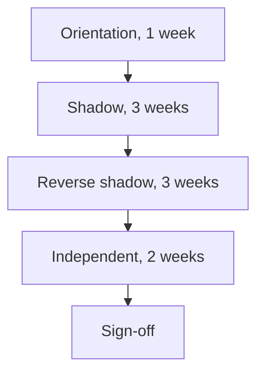

# Introduction

This plan describes how iorta TechNXT hands over the knowledge needed to run, change and extend the TASCO Growth Platform (the platform). The receiving team may be TASCO IT, VETC IT or another partner chosen by TASCO.

It covers two things. The first is the technical handover that is part of the MVP: two days of handover in weeks 12 and 13, followed by shadowing during hypercare. The second is a full transition of support, which TASCO can request at any time under the exit terms in the proposal, section 30, and which is priced at the rate card.

The audience is TASCO IT, the future support team and the iorta TechNXT solution architect and engagement manager. User training for business roles is covered in TGP-DEL-06 Organisational Change and Training Plan.

Related documents:

| ID | Title | Relationship |
|---|---|---|
| TGP-DEL-01 | Project Plan | Timing of the handover and hypercare |
| TGP-ARC-01 | Solution Architecture | Architecture taught in the foundation module |
| TGP-ARC-02 | Integration Architecture | TASCO core and VETC interfaces |
| TGP-ARC-07 | Architecture Decision Records | Design decisions behind the code |
| TGP-QA-01 | Test Strategy | Test levels and the automated suites |
| TGP-OPS-01 | Runbook and Support Guide | Incident runbooks and procedures practised in this plan |
| TGP-OPS-03 | Disaster Recovery and Business Continuity Plan | Restore and failover drills |

# Approach

The platform was built to be handed over. Business behaviour lives in versioned rule sets that are changed in the rules studio. Every external system sits behind a port with a replaceable adapter, wired in one place (`src/bootstrap/container.js`). The runtime is plain Node.js with one production dependency (`pg`) and standard PostgreSQL. The receiving team therefore needs to learn one code base, one database and one rules engine.

## MVP handover

| When | Activity | Outcome |
|---|---|---|
| Weeks 12 and 13 | Technical handover, two days: architecture, deployment, monitoring, runbooks, incident handling | TASCO IT can operate the platform with iorta TechNXT support |
| Weeks 14 to 17 | Shadowing during hypercare: TASCO IT joins incident calls, releases and job runs | TASCO IT has seen each runbook used live |
| M4 (26/02/2027) | Handover pack delivered (section 8) | Documentation and access complete |

## Full transition (optional)

If TASCO moves support to its own team or another partner, the transition runs in four phases. The durations are a guide and are confirmed when the transition is requested.

| Phase | Who leads | What the receiving team does | Exit |
|---|---|---|---|
| Orientation | iorta TechNXT | Attends the foundation sessions, runs the platform locally, reads the document set | Every receiving engineer has run the tests and signed in as each role |
| Shadow | iorta TechNXT does, receiver observes | Pairs on tickets, incidents, releases and rule changes | Receiver has seen a release, an incident, a rule change, a data load and a restore drill |
| Reverse shadow | Receiver does, iorta TechNXT coaches | Handles second and third-line tickets, code changes, releases and on-call | Exercises in section 6 passed; 80% of tickets resolved without hands-on help |
| Independent | Receiver | Full ownership; iorta TechNXT answers questions only | No P1 or P2 incident needing iorta TechNXT intervention |

# Audiences

| Audience | Typical size | Goal |
|---|---|---|
| Platform engineers | 2 to 4 | Change and extend the code |
| Operations and support | 2 to 3 | Run, monitor and recover the platform; run jobs |
| Business configurators | 2 to 4 | Change behaviour through the rules studio without code |
| Rule approvers and compliance | 2 to 3 | Approve changes, use the audit trail, handle data subject requests |
| Security | 1 | Access reviews, key rotation, role changes |

# Curriculum

## Architecture foundations (all technical roles, one day)

| Topic | Where in the code |
|---|---|
| Layers: domain, application services, adapters, composition root | `src/domain`, `src/application`, `src/adapters`, `src/bootstrap/container.js` |
| HTTP layer: 97 routes (6 public, 76 staff, 11 customer, 4 partner), permissions, validation, rate limits, idempotency, OpenAPI | `src/adapters/http/routes.js`, `app.js`, `openapi.js` |
| Persistence: PostgreSQL store, field encryption and blind indexes, migrations with an advisory lock | `src/adapters/persistence`, `db/migrations` |
| Events: transactional outbox and relay | `src/adapters/messaging/outboxEventBus.js` |
| Security: roles and separation of duties, attribute-based access, MFA self-enrolment, lockout, token revocation, scoped partner keys | `config/security/rbac.json`, `src/application/identityService.js`, `accessPolicy.js` |
| Audit trail: hash chain and verification | `src/application/auditService.js` |
| Configuration and secrets | `src/shared/config.js` |
| Resilience: timeouts, retries, circuit breakers, saga compensation on failed issuance | `src/shared/resilience.js`, `src/application/salesService.js` |

## TASCO core integration (engineers and operations, half a day)

TASCO core is the master for products and rating. This module covers how the platform uses it.

| Topic | Where in the code |
|---|---|
| CoreRating and ProductCatalogue ports, and how the container chooses the real client or the simulated core | `src/bootstrap/container.js` (`coreGateways`) |
| Rating source setting: `rules`, `core` or `core_with_fallback`; production refuses local rating without explicit approval | `src/application/ratingService.js`, `src/shared/config.js` |
| Production REST client: OAuth 2.0 client credentials, idempotency key and request id on every call, response checks. Endpoint paths are assumptions until TASCO's specification arrives. | `src/adapters/integrations/tascoCoreRatingClient.js` |
| Simulated core used in sandbox and UAT | `src/adapters/integrations/simulatedTascoCore.js` |
| Data minimisation: rating requests carry risk attributes only; identity goes to core at issuance with the core quote reference | `src/application/salesService.js` |
| Indicative quotes: cannot be paid until re-rated through `POST /api/quotes/:id/rerate` or `POST /api/customer/quotes/:id/rerate` | `src/application/salesService.js` (`rerate`) |
| Catalogue sync job `sync-catalogue` at 01:00 Vietnam time: proposes product changes as a draft for maker-checker approval, never activates them | `src/application/catalogueService.js`, `src/jobs/cli.js`, `deploy/k8s/60-jobs.yaml` |
| Integration status: rating source, circuit states, last catalogue sync | `GET /api/integrations/status` |
| Policy issuance: still a sandbox adapter until TASCO's issuance interface is specified | `src/adapters/integrations/mockGateways.js` (`createTascoCoreGateway`) |

## Domain walkthrough (engineers and business configurators, one day)

| Area | Where in the code |
|---|---|
| Vehicle identity and golden record | `src/domain/identity.js`, `src/domain/enrichment.js`, `src/application/ingestionService.js` |
| Lead scoring, next best action and journey placement | `src/domain/leads.js`, `src/application/leadService.js` |
| Journeys, contact rules and wording control | `src/application/journeyService.js`, `src/domain/contactPolicy.js` |
| Voice assistant dialogue and telesales handoff | `src/domain/voicebot.js`, `src/application/voiceService.js` |
| Quote, inspection for physical damage cover, customer payment, issuance, e-certificate | `src/domain/rating.js`, `src/application/salesService.js` |
| Partners and commission | `src/application/partnerService.js` |
| Claims first notice | `src/application/claimsService.js` |
| Customer self-service and data subject rights | `src/application/customerService.js` |
| Operations jobs: reconciliation, retention, relay | `src/application/opsService.js`, `src/jobs/cli.js` |

## Rules engine (engineers, configurators and approvers, one day)

1. Rule logic and decision tables: `src/rules/jsonLogic.js`, `src/rules/decisionTable.js`.
2. Checks per rule type, including commission caps and the wording control: `src/rules/validators.js`.
3. Lifecycle from draft to approval, rollback as a new draft, and transactional activation with one active version per type: `src/application/rulesService.js`.
4. Simulation of a change against real customers before submission.
5. Hands-on: change a scoring threshold, simulate it on three customers, submit it, approve it as a second user and watch leads recompute.

## Common changes (configurators and engineers, one day)

| Change | Code needed | How |
|---|---|---|
| New product that uses an existing rating method | No | New version of the product rule set, approved by underwriting or compliance; the product must also exist in TASCO core |
| New or changed journey step and message template | No | Journey and template rule sets; Zalo templates need Zalo approval first |
| New adapter for an external system (for example the production VETC wallet) | Yes | Implement the port, wire it in the container with a circuit breaker, add configuration and contract tests |
| New rating method or quote option | Yes | Domain rating code and route options, with unit tests |

## Operations (operations and support, two days including drills)

The runbooks and procedures are in TGP-OPS-01 Runbook and Support Guide, TGP-OPS-02 Monitoring and Alerting and TGP-OPS-03 Disaster Recovery and Business Continuity Plan. The receiving team runs each topic below hands-on.

| Topic | Hands-on |
|---|---|
| Scheduled jobs, including the catalogue sync | Run each job and read its history |
| Database failure and restore | Drill: point-in-time restore, migrate, check readiness, audit chain and reconciliation |
| Circuit open on TASCO core, VETC wallet, messaging or voice | Simulate a failure in the sandbox and watch the integration status |
| TASCO core unavailable under `core_with_fallback` | Create an indicative quote, confirm payment is blocked, re-rate after recovery |
| Payment taken but issuance failed | Follow reconciliation and refund checks |
| Rule activated by mistake | Roll back through the rules studio |
| Account lockout and MFA reset | Unlock an account and reset MFA in the sandbox |
| Key rotation and partner key revocation | Drill: rotate the data key; revoke a partner key |
| Data subject request and data correction | Walk-through with compliance and the data stewards |

# Automated tests

The test suites are the safety net for every change the receiving team makes. `npm test` runs 255 tests: 252 pass and 3 are to-do items for manual or roadmap scenarios. Coverage is 99.41% of lines, 88.25% of branches and 97.12% of functions.

| Folder | What it covers |
|---|---|
| `test/unit` | Domain and shared code: identity, rule logic, platform, rules domain, stores, voice assistant, and the TASCO core REST client (`tascoCoreRatingClient.test.js`) |
| `test/integration` | Services working together: TASCO core rating and catalogue sync (`coreRating.test.js`), governance, journeys, sales, and regression checks for fixed defects |
| `test/api` | HTTP routes, permissions and error formats |
| `test/security` | OWASP Top 10 checks: access control, encryption, injection, configuration, authentication, audit integrity, rate limits, double-charge protection |
| `test/functional` | One test per Given/When/Then scenario in TGP-BUS-04 User Stories and Acceptance Criteria (124 scenarios, three of them manual or roadmap) |
| `test/pg` | PostgreSQL store, 8 tests, run separately with `npm run test:pg` |
| `test/perf` | Load smoke test (`load.js`): 337 requests per second, p95 103 ms, no errors on a single instance |

The CI pipeline runs lint, the test suites, coverage gates and the dependency audit on every change. The test-case workbook is described in TGP-QA-02 Test Case Catalogue.

# Practical exercises

Each receiving engineer completes these without help during the reverse-shadow phase.

| No. | Exercise | Pass criteria |
|---|---|---|
| E1 | Run the platform locally on PostgreSQL, migrate, seed and sign in as an approver with MFA | Done within one hour |
| E2 | Add a read-only reporting role through a pull request | Tests prove allowed and refused access; security review done |
| E3 | Add a product variant through configuration only | Quote works and can be sent to the customer; no code change |
| E4 | Add a journey step and template, simulate and approve with a second user | Contacts scheduled correctly for a test customer |
| E5 | Run the catalogue sync against the simulated core, review the proposed change and approve it as a second user | Product change active; diff recorded in the audit trail |
| E6 | Switch the rating source to `core_with_fallback`, stop the simulated core, and re-rate an indicative quote after recovery | Payment refused while indicative; accepted after re-rating |
| E7 | Implement a test adapter behind the notification port and wire it in the container | Journeys send through it; its circuit shows in the integration status |
| E8 | Diagnose a seeded issuance failure from logs, metrics and reconciliation | Root cause found and written up within two hours |
| E9 | Release to pre-production through the full quality gate, then roll back | Release and rollback both succeed |

# Code walkthroughs

Each walkthrough lasts 90 minutes and is recorded for the handover pack.

| No. | Title | Path through the code |
|---|---|---|
| CW-1 | Request lifecycle | `src/server.js`, `app.js`, `router.js`, a handler in `routes.js` |
| CW-2 | Composition root | `src/bootstrap/container.js` from configuration to services and event subscribers |
| CW-3 | From raw record to lead | Ingestion, golden record rebuild, lead scoring, touchpoint planning |
| CW-4 | From touchpoint to message | Journey run, contact rules, wording control, channel fallback |
| CW-5 | From voice call to sale | Voice dialogue, handoff, quote, send to the customer, customer payment, issuance |
| CW-6 | TASCO core rating and catalogue | Rating service, REST client, re-rate, catalogue sync and approval |
| CW-7 | Rules governance | Rules service lifecycle, validators, simulation |
| CW-8 | Access control | Roles, attribute-based policies, masking of personal data |
| CW-9 | Customer app and partner API | Signed links, customer routes, scoped partner keys, partner-collected orders |
| CW-10 | Operations and jobs | Job runner, reconciliation, retention, integration status |

# Handover pack

| Item | Where |
|---|---|
| Architecture and design decisions | TGP-ARC-01 to TGP-ARC-07 |
| API specification | `openapi.json`, also served by the platform |
| Rule catalogue: each rule type, purpose, owner and approver | Rules studio and `config/rules` |
| Runbooks and procedures | TGP-OPS-01 to TGP-OPS-06 |
| User documentation | TGP-MAN-01 to TGP-MAN-03 |
| Test strategy, suites and results | TGP-QA-01 to TGP-QA-04, the `test` folders and the test-case workbook |
| Environment and secrets inventory, without secret values | Secrets manager and inventory sheet |
| Vendor contacts and service levels | Service management tool |
| Walkthrough recordings CW-1 to CW-10 | Knowledge transfer repository |

# Sign-off criteria

The MVP handover is complete at M4 when the handover pack is delivered, TASCO IT has attended the two-day handover, and access to the repository, CI pipeline, secrets manager, monitoring and vendor portals has been transferred.

A full transition is complete when all of the following are true, signed by the head of TASCO IT and the iorta TechNXT engagement manager:

1. All curriculum modules delivered, with at least 90% attendance of the target audience.
2. Exercises E1 to E9 passed by at least two receiving engineers each.
3. Each drill in the operations module run at least once by the receiving team.
4. The receiving team resolved at least 80% of tickets in reverse shadow and all tickets in the independent phase without hands-on help.
5. One production release and one rule change carried out end to end by the receiving team.
6. Departing iorta TechNXT accounts disabled and confirmed in an access review.

# Long-term maintainability

- Keep the dependency surface small and upgrade Node.js on its long-term support cycle; the dependency audit runs in CI.
- Prefer rule changes to code changes: tariff references, templates, journey timings, benefits and commission rates are all rule sets with an audit trail.
- Replace vendors by replacing adapters behind the existing ports.
- Update user documentation and runbooks as part of the definition of done.
- Hold an annual architecture review covering dependencies, security, data growth and performance at full base size.
