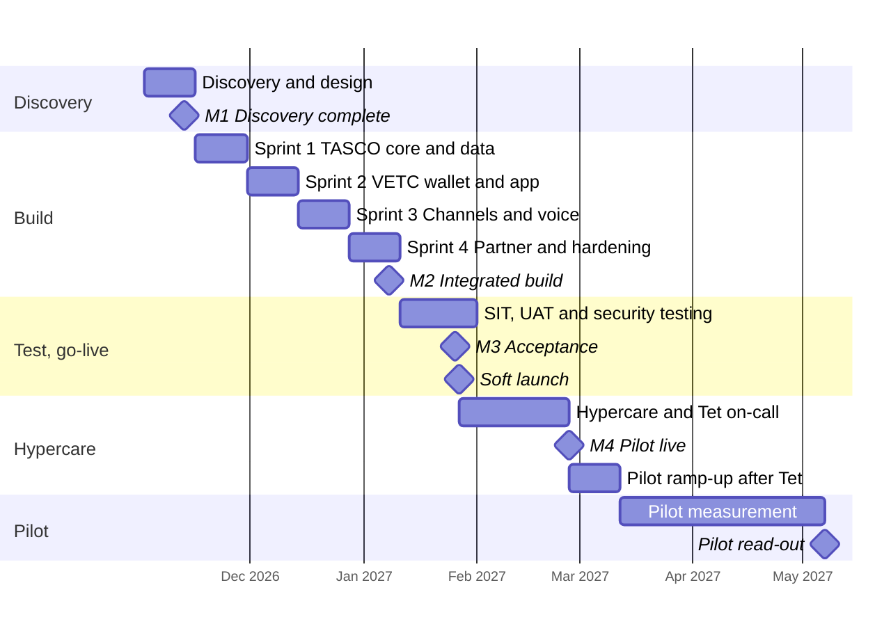

# Introduction

This plan sets out how iorta TechNXT will deliver the minimum viable product (MVP) of the TASCO Growth Platform (the platform) for TASCO Insurance, with the VETC app as the first distribution host. It covers the 17-week MVP from discovery to the end of hypercare, the pilot read-out that follows, and the optional scale phase.

The plan is the delivery view of the proposal. Dates, milestones, team effort and client commitments are the same as in the proposal, sections 16 to 23 and 28 to 29. All dates are indicative until the contract is signed and are re-baselined at milestone M1.

The audience is the steering committee, the TASCO product owner, the TASCO and VETC integration leads and the iorta TechNXT delivery team.

Related documents:

| ID | Title | Relationship |
|---|---|---|
| TGP-DEL-02 | Delivery Methodology | How sprints, quality gates and governance forums run |
| TGP-DEL-03 | RACI Matrix | Who does what for each activity in this plan |
| TGP-DEL-04 | Risk Register | Delivery risks and their owners |
| TGP-DEL-05 | Knowledge Transfer Plan | Technical handover to TASCO IT |
| TGP-DEL-06 | Organisational Change and Training Plan | Training schedule and adoption measures |
| TGP-BUS-07 | Commercials and Engagement Model | Price, payment milestones and options |
| TGP-OPS-05 | Go-Live and Hypercare Plan | Cut-over and hypercare in detail |

# Objectives and scope

The MVP has one aim: to prove, in a controlled pilot, that the platform increases own-channel motor sales, repairs vehicle data and earns customer trust. The pilot covers 50,000 to 100,000 vehicles in one or two provinces, with a randomly selected control group of about 10% that receives business as usual.

The platform already exists and runs in UAT. Sprint effort therefore goes into adapters for TASCO core and VETC, data loading, configuration with TASCO's product team and production hardening, not into building screens.

| In the MVP | After the MVP (scale phase) |
|---|---|
| TASCO core: catalogue sync, live rating, bind and issue, daily policy extract | Claims system-to-system integration |
| VETC: data load and daily changes, tag-activation events, app web view, push, wallet debit and refund, reconciliation | VETC single sign-on, Zalo mini app, live feed of all VETC events |
| Zalo ZNS and SMS brandname for approved templates | Further messaging channels |
| One voice AI vendor with a Vietnamese script and telesales handoff | More voice vendors, outbound voice at full scale |
| Renewal, conquest, new vehicle, lapsed recovery and cross-sell journeys; quick renewal in 3 steps where the case allows it, with the full flow always available | A/B testing framework, score calibration |
| Data requests register for TASCO compliance (access and erasure, with response-time tracking) | Further data-subject rights as TASCO legal requires |
| TNDS (one to three years), personal accident cover per seat, physical damage cover with inspection | Further products |
| One partner live on the partner API | Partner onboarding at scale, fleet portal |
| Pilot cohort of up to 100,000 vehicles | Full base of about 6 million vehicles |

The full scope is in TGP-BUS-02 Functional Requirements Specification. Acceptance is against the user-story acceptance criteria in TGP-BUS-04 User Stories and Acceptance Criteria.

# Plan overview

The MVP runs for 17 weeks in four stages. Week 1 starts on Monday 2 November 2026, which assumes contract signature by 30 October 2026.

| Stage | Weeks | Dates | Exit |
|---|---|---|---|
| Discovery and design | 1 to 2 | 02/11/2026 to 13/11/2026 | M1 Discovery complete |
| Build and integrate (four sprints) | 3 to 10 | 16/11/2026 to 08/01/2027 | M2 Integrated build |
| SIT, UAT and security testing | 11 to 13 | 11/01/2027 to 26/01/2027 | M3 Acceptance, then soft launch |
| Hypercare with Tết on-call | 13 to 17 | 27/01/2027 to 26/02/2027 | M4 Pilot live and hypercare complete |
| Pilot ramp-up after Tết | 18 to 19 | 01/03/2027 to 12/03/2027 | Full pilot cohort active |
| Pilot measurement and read-out | to about week 27 | to early May 2027 | Scale decision by the steering committee |

The timeline below shows the same plan. Week 13 falls just before Tết (Lunar New Year, 6 February 2027), so the launch is a controlled soft launch to the first part of the cohort, followed by a change freeze over the holiday and the ramp-up after Tết.

# Stages

## Discovery and design (weeks 1 and 2)

Discovery is run on site in Hà Nội. It confirms the decisions that only TASCO and VETC can make, so that the sprints can start on firm ground.

| Topic | Output | Decided by |
|---|---|---|
| TASCO core integration path | Live rating through TASCO core, or the interim path (approved tariff tables with core re-rating at issue). Decision in week 2. | TASCO core system lead |
| Rating behaviour when TASCO core is unavailable | Core only, or core with indicative fallback (payment blocked until re-rated) | TASCO product owner |
| Interface specifications | TASCO core catalogue, rating, bind and issue, policy extract; VETC data, events, web view, push and wallet | TASCO IT, VETC integration lead |
| Data sharing | Legal basis and field list for VETC data, to be confirmed by TASCO legal | TASCO legal, VETC |
| Regulatory positions | Positions in proposal section 2.3, to be confirmed by TASCO legal | TASCO compliance and legal |
| Pilot design | Provinces, cohort, control group, success criteria | TASCO product owner, steering committee |
| Infrastructure | Hosting provider in Vietnam | TASCO IT |

The production connector for TASCO core already exists. Its endpoint paths are assumptions until TASCO's specification arrives, and policy issuance still runs on a sandbox adapter. Discovery replaces these assumptions with the agreed specification.

## Build and integrate (weeks 3 to 10)

Four two-week sprints, delivered from our offshore centre with daily overlap during Vietnam business hours. Each sprint ends with a demonstration on the integration sandboxes. Business rules (scoring weights, journey timings, message wording, benefits) are configured with TASCO's product team in the rules studio during the sprints.

| Sprint | Weeks and dates | Goal | Main content |
|---|---|---|---|
| 1 | 3 to 4, 16/11 to 27/11/2026 | TASCO core and data | Catalogue sync, live rating, bind and issue against the core sandbox; daily policy extract; VETC initial data load and daily changes; data-quality baseline for the cohort |
| 2 | 5 to 6, 30/11 to 11/12/2026 | VETC wallet and app | Wallet debit, refund and reconciliation; app web view with signed links; push; tag-activation events; customer app in TASCO branding |
| 3 | 7 to 8, 14/12 to 25/12/2026 | Channels and voice | Zalo ZNS and SMS brandname templates; voice AI vendor, Vietnamese script, plate-first verification, telesales handoff; the five MVP journeys configured |
| 4 | 9 to 10, 28/12/2026 to 08/01/2027 | Partner and hardening | One partner on the partner API; physical damage inspection flow; performance and security scanning; runbooks; M2 demonstration |

## Test and go-live (weeks 11 to 13)

System integration testing covers the end-to-end flows across TASCO core, VETC wallet, push, Zalo, SMS and voice. UAT is run by TASCO users against the acceptance criteria, and training for pilot users takes place in the same weeks. Security testing includes static, dynamic, dependency and container scanning with focused manual testing of authentication, payment and the partner API; an independent penetration test is recommended. The cut-over is rehearsed before M3.

The test stages and exit criteria are in TGP-QA-01 Test Strategy and TGP-QA-04 User Acceptance Test Plan. The cut-over plan is in TGP-OPS-05 Go-Live and Hypercare Plan.

## Hypercare (weeks 14 to 17)

The platform goes live as a soft launch to the first part of the pilot cohort after M3. The delivery team stays on hand for four weeks. A change freeze applies over the Tết holiday, with 24-hour on-call cover; only emergency fixes are released in that window. M4 is reached when the pilot is live and the service has run four weeks within service levels.

## Pilot ramp-up and read-out (weeks 18 to about 27)

After Tết the pilot is extended to the full cohort over two weeks. The pilot read-out, with conversion measured against the control group, is planned for early May 2027. That covers a full 45-day renewal cycle and gives the conquest and new-vehicle journeys time to show results.

| Pilot measure | Target (to be confirmed in discovery) |
|---|---|
| Vehicles with a usable expiry date | From about 10% to at least 35% of the cohort |
| Own-channel TNDS conversion | Significantly above the control group (statistically tested) |
| Policies bought in the app | At least 60% of own-channel sales |
| Median renewal time in the app (quick renewal where eligible, full flow otherwise) | 60 seconds or less |
| Time from "Xác nhận thanh toán" to e-certificate | Under 60 seconds for 95% of purchases |
| Complaints about contact | Fewer than 1 per 1,000 customers contacted |
| Compliance breaches (copy, consent, contact window) | Zero |
| Availability of the purchase path | 99.9% |

## Scale phase (optional, after the read-out)

If the pilot meets its targets, the steering committee decides on the scale phase at the read-out. It runs for about six months as ten priced modules, S1 to S10, capped at 566 person-days and USD 141,500 in total (TGP-BUS-07). It extends the base province by province, with a capacity test before each step, and opens further front doors on the same journeys: TASCO's app and website with TASCO's payment gateway (S3, which can start in March 2027), and a Zalo Mini App (S4). It also adds VETC single sign-on and live events, claims integration, inspection booking and the fleet portal, further partners, the data warehouse feed, score calibration and A/B testing. The scale phase is planned in detail before the decision.

| Period (indicative) | Release | Content |
|---|---|---|
| 27 January to 26 February 2027 | MVP live, hypercare | Pilot in the VETC app; Zalo ZNS from TASCO's Official Account; voice assistant; Tasco360 on the partner API |
| March 2027 (optional) | S3 TASCO app and website | The same journeys in TASCO's app and website with TASCO's payment gateway |
| Early May 2027 | Pilot read-out | Conversion against the control group; decision to scale |
| May to July 2027 | Scale wave 1 | Full base in province waves (S1); VETC sign-on and live events (S2); Zalo Mini App (S4); score calibration (S9) |
| August to October 2027 | Scale wave 2 | Claims integration (S5); inspection booking and fleet portal (S6); further partners (S7); data warehouse (S8); full-scale assurance (S10) |

# Milestones

| Milestone | Week | Date (indicative) | Evidence |
|---|---|---|---|
| M0 Mobilisation | 0 | 30/10/2026 | Contract signed; team onboarded |
| M1 Discovery complete | 2 | 13/11/2026 | Discovery report, integration specifications and pilot design signed off |
| M2 Integrated build | 10 | 08/01/2027 | End-to-end demonstration on sandboxes: core rating and issue, wallet debit, Zalo message, voice call |
| M3 Acceptance | 13 | 26/01/2027 | UAT signed off; no open critical or high security findings |
| M4 Pilot live and hypercare complete | 17 | 26/02/2027 | Pilot live; four weeks within service levels |
| Pilot read-out | about 27 | early May 2027 | Pilot report against the control group; scale decision |

M0 to M4 are the payment milestones. Their shares and amounts are in TGP-BUS-07 Commercials and Engagement Model.

# Team and effort

The MVP team is small and senior. The engagement manager is accountable to TASCO for the whole delivery. The business analyst also acts as insurance subject-matter expert and works alongside TASCO's product owner. Discovery and go-live are run on site in Hà Nội.

| Role | Discovery | Build | Test and go-live | Hypercare | Total person-days |
|---|---:|---:|---:|---:|---:|
| Engagement manager | 5 | 20 | 7.5 | 2 | 34.5 |
| Solution architect | 10 | 20 | 3.75 | | 33.75 |
| Business analyst and insurance SME | 10 | 40 | 15 | 5 | 70 |
| UX and conversation designer | 5 | 10 | | | 15 |
| Senior engineer (integration lead) | 5 | 40 | 15 | 10 | 70 |
| Engineers (backend and frontend) | | 80 | 15 | 10 | 105 |
| QA engineer | | 40 | 22.5 | | 62.5 |
| DevSecOps engineer | | 20 | 7.5 | 5 | 32.5 |
| Total | 35 | 270 | 86.25 | 32 | 423.25 |

# Client responsibilities

| Role | Commitment |
|---|---|
| TASCO product owner | About half time throughout; decisions on scope, rules and acceptance |
| TASCO core system lead | Interface specifications, sandbox, support during integration testing |
| VETC data and integration lead | Data extract, events, app, push and wallet interfaces; about half time in discovery and build |
| TASCO compliance and legal | Confirmation of regulatory positions; approval of customer wording and the voice script |
| TASCO telesales lead and agents | UAT and pilot participation |
| TASCO IT security | Security requirements, access approvals, penetration test scope |

Other TASCO and VETC roles that take part in specific activities are listed in TGP-DEL-03 RACI Matrix.

# Dependencies

| Dependency | Provided by | Needed by | If late |
|---|---|---|---|
| TASCO core interface specifications and sandbox (or agreement on the interim path) | TASCO IT | End of week 2 (13/11/2026) | Build continues on the simulated core; dates move day for day by agreement |
| TASCO core production access | TASCO IT | Week 10 (08/01/2027) | SIT and cut-over rehearsal delayed |
| VETC data extract for the pilot cohort, tag-activation events, web view, push, wallet sandbox | VETC | End of week 2 (13/11/2026) | Build continues on synthetic data and simulated adapters |
| Voice AI vendor, Zalo official account and SMS brandname contracted | TASCO | Start of Sprint 3 (14/12/2026) | Channel held back; journeys fall back to app push |
| Regulatory positions confirmed | TASCO legal | M1 (13/11/2026) | Features stay switched off until approved |
| Hosting provider chosen and production environment available | TASCO IT | Chosen at M1; available before SIT (week 11) | SIT and security testing delayed |
| Sign-offs and decisions | TASCO and VETC | Within five business days | Milestones move by the delay |

# Governance

The steering committee meets monthly and at each milestone. The product council meets every two weeks, and each sprint ends with a sprint review. Changes to scope, price or time go through change control. Each release passes a compliance checkpoint. The forums, reporting and escalation path are described in TGP-DEL-02 Delivery Methodology.

# Assumptions

1. TASCO provides access to its core catalogue, rating and issuance interfaces (or agrees the interim path) and a sandbox by the end of week 2, with production access by week 10.
2. VETC provides a data extract for the pilot cohort, tag-activation events, the app web view and push, and wallet debit and refund interfaces with a sandbox by the end of week 2.
3. TASCO contracts the voice AI vendor, Zalo official account and SMS brandname directly; iorta TechNXT helps with selection and integration.
4. TASCO legal confirms the regulatory positions during discovery.
5. TASCO and VETC provide decision-makers within agreed turnaround times (five business days for sign-offs).
6. The pilot cohort is no larger than 100,000 vehicles in one or two provinces.
7. The infrastructure provider is chosen in discovery, and TASCO pays for it directly.
8. Acceptance is against the agreed user-story acceptance criteria for the MVP scope.

# Appendix

## Week calendar

| Week | Monday | Friday | Stage |
|---|---|---|---|
| 1 | 02/11/2026 | 06/11/2026 | Discovery |
| 2 | 09/11/2026 | 13/11/2026 | Discovery (M1) |
| 3 to 4 | 16/11/2026 | 27/11/2026 | Sprint 1 |
| 5 to 6 | 30/11/2026 | 11/12/2026 | Sprint 2 |
| 7 to 8 | 14/12/2026 | 25/12/2026 | Sprint 3 |
| 9 to 10 | 28/12/2026 | 08/01/2027 | Sprint 4 (M2) |
| 11 | 11/01/2027 | 15/01/2027 | SIT, security testing |
| 12 | 18/01/2027 | 22/01/2027 | UAT, training |
| 13 | 25/01/2027 | 29/01/2027 | UAT sign-off and go/no-go on 26/01 (M3); soft launch on 27/01/2027 |
| 14 to 17 | 01/02/2027 | 26/02/2027 | Hypercare with Tết on-call; ramp-up after Tết (M4) |
| 18 to 19 | 01/03/2027 | 12/03/2027 | Pilot ramp-up |
