# Introduction

## Purpose

This guide explains what customers see and do in the TASCO customer app: checking their cover, renewing or buying motor insurance, paying, keeping the e-certificate, reporting an accident, managing consent and contacting TASCO. It is written for TASCO and VETC customer service, telesales and training staff, who answer customers' questions, and for the teams that approve the customer wording.

## Scope

The app is in Vietnamese only. Screen labels are quoted exactly as they appear in the app, in bold, with an English explanation where it helps. Amounts in the examples come from the sandbox: TNDS premiums follow the regulated tariff, and the seat accident and physical damage rates are illustrative until TASCO's filed rates are loaded.

The staff side of the same journeys (quotes sent by telesales, claims handling, data corrections) is described in TGP-MAN-01 Staff Console User Manual.

## Audience

TASCO and VETC customer service and telesales staff, trainers, the TASCO product owner and compliance.

## Related documents

| ID | Title |
|---|---|
| TGP-BUS-06 | Personas and Customer Journeys |
| TGP-UX-03 | Information Architecture and Navigation |
| TGP-MAN-01 | Staff Console User Manual |
| TGP-MAN-03 | Partner API Integration Guide |

# Where the app runs

The same app runs in four places. The content and steps are identical; the branding and the payment method follow the host.

| Host | How the customer opens it | Branding | Payment method |
|---|---|---|---|
| VETC app | The Insurance section, or a renewal link in a VETC notification, Zalo message or SMS | TASCO × VETC | **Ví VETC** (VETC wallet) |
| Zalo Mini App | The VETC mini app inside Zalo | TASCO × VETC | **Ví VETC** |
| TASCO app | The insurance section of TASCO's own app | TASCO | **Thanh toán qua cổng TASCO** (TASCO payment gateway: domestic ATM card, international card or bank QR) |
| TASCO website | A link from baohiemtasco.vn | TASCO | **Thanh toán qua cổng TASCO** |

The host opens the app with a signed link that identifies the customer's vehicle; the customer does not create a password. A renewal link is valid for 30 days. If the link has expired, the app says "Liên kết đã hết hạn hoặc không hợp lệ" (the link has expired or is not valid) and asks the customer to open it again from the host app.

Messages in the app name the host, for example "Mở lại từ ứng dụng VETC" or "Mở lại từ website Bảo hiểm TASCO".

# Safety messages for customers

Two messages appear at the foot of the main screens and should be repeated by every staff member who talks to customers.

- **Phí bảo hiểm TNDS bắt buộc theo quy định của Bộ Tài chính.** The TNDS premium is set by the Ministry of Finance and is the same at every insurer. TASCO offers no discount on it; the value is in the service.
- **VETC và TASCO không bao giờ yêu cầu mã OTP qua điện thoại.** Neither VETC nor TASCO ever asks for an OTP code, wallet PIN or card details by phone or message. Payment is made only inside the app.

# Getting around

The bottom tab bar has four tabs.

| Tab | What it is for |
|---|---|
| **Trang chủ** (Home) | Cover status, a quote waiting for payment, quick actions and the benefits that come with the cover |
| **Bảo hiểm của tôi** (My insurance) | Policies and e-certificates with their QR codes |
| **Bồi thường** (Claims) | Report an accident and follow claims |
| **Tài khoản** (Account) | Consent choices, personal data, support contacts and sign-out |

Task flows (buying, reporting an accident, confirming the expiry date) open full screen with a back arrow at the top left and the main button fixed at the bottom.

The round support button (headset icon) at the bottom right of the tab pages opens the support sheet. It is hidden during checkout so that it cannot interrupt a payment.

# Home

The home screen greets the customer by first name and shows a card for the vehicle: the plate, the vehicle type, the year of first registration, the province, and a ring counting the days of cover left.

The status chip on the card and the main button depend on the cover:

| Chip | Meaning | Main button |
|---|---|---|
| **Đang hiệu lực** | In force | **Xem giấy chứng nhận** (view certificate) |
| **Sắp hết hạn** | Expires within 45 days | **Gia hạn ngay** (renew now) |
| **Đã hết hạn** | Lapsed; the card warns that the vehicle has no compulsory TNDS cover | **Mua bảo hiểm ngay** (buy now) |
| **Chưa rõ hạn bảo hiểm** | The expiry date is unknown | **Cập nhật ngày hết hạn** (update the expiry date) and **Mua bảo hiểm mới** |
| **Đã gia hạn** | Renewed; the new policy starts on the date shown | None |

Under the vehicle card:

- **Báo giá đang chờ bạn xác nhận** (a quote waiting for your confirmation) appears when a TASCO telesales advisor has sent a quote. It shows each product, the period, **Tổng thanh toán** (total to pay) and when the quote expires. **Xem và thanh toán** opens it at the review step.
- **Ngày hết hạn đã chính xác chưa?** asks the customer to confirm the expiry date when TASCO's record is uncertain. **Xác nhận ngay** opens the confirmation form.
- Quick actions: **Cứu hộ 24/7** (calls the hotline for roadside help), **Báo tai nạn** (report an accident), **Giấy chứng nhận** (certificates) and **Mua bảo hiểm** (buy insurance).
- **Quyền lợi đi kèm**: the service benefits that come with the cover, such as roadside assistance, the e-certificate with QR code and inspection reminders. Swipe sideways to see more.

::: {custom-style="Figure"}
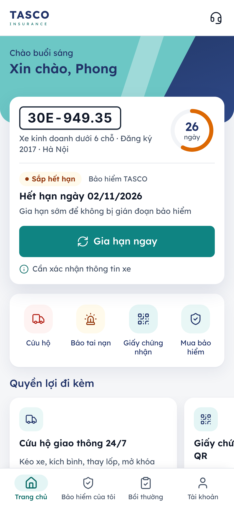{width=4.5cm} 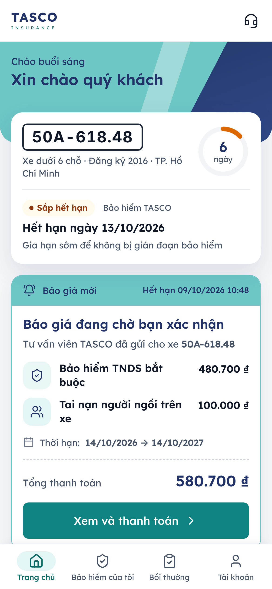{width=4.5cm} 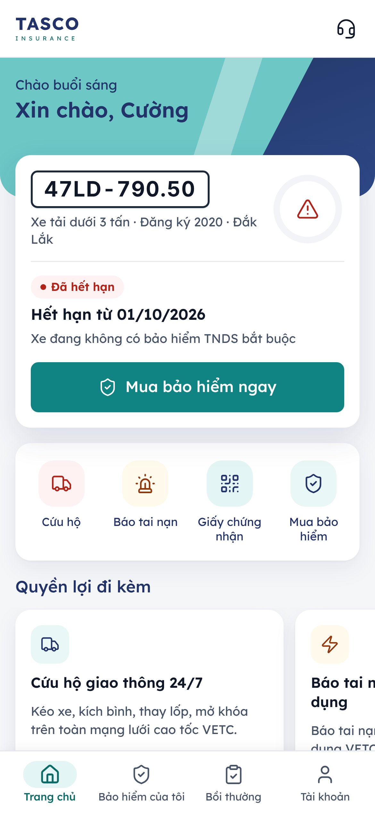{width=4.5cm}
:::

::: {custom-style="Caption"}
Figure 1 – Home: renewal due, a quote sent by telesales, and a vehicle without cover
:::

## Confirm the expiry date

TASCO often knows a vehicle's expiry date only by estimate. When the customer confirms it, reminders arrive at the right time.

1. Tap **Xác nhận ngay** or **Cập nhật ngày hết hạn** on the home screen.
2. Under **Ngày hết hạn**, type the date shown on the current TNDS certificate as day/month/year, for example 07/10/2026.
3. Under **Công ty bảo hiểm hiện tại**, choose the current insurer: TASCO, PVI, PTI, Bảo Việt, PJICO, BIC, MIC or **Khác** (other).
4. Tap **Lưu thông tin**.

The app thanks the customer: "Cảm ơn bạn! Chúng tôi sẽ nhắc gia hạn đúng hạn." The information is used only for reminders.

::: {custom-style="Figure"}
::: {custom-style="Figure"}
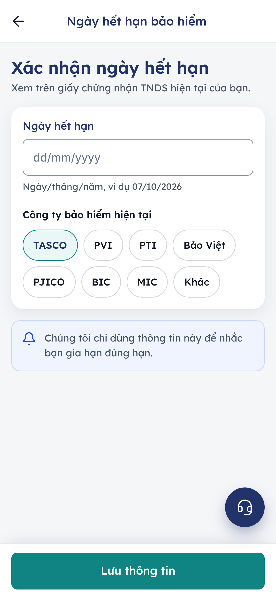{width=6cm}
:::

::: {custom-style="Caption"}
Figure 2 – 
:::
:::

::: {custom-style="Caption"}
Figure 3 – Confirming the expiry date
:::

# Buy or renew

The purchase flow has three steps shown in a stepper at the top: **Chọn gói** (choose cover), **Xác nhận** (review) and **Thanh toán** (pay).

## Step 1: choose cover

The form is titled **Bảo hiểm TNDS bắt buộc xe ô tô** and shows the plate and vehicle.

1. Answer **Xe có kinh doanh vận tải không?** (is the vehicle used for commercial transport?): **Không** or **Có**.
2. Check **Loại xe** (vehicle type, read-only, taken from the registration) and enter **Số chỗ ngồi** (number of seats, 1 to 60).
3. Choose **Thời hạn bảo hiểm** (term): **1 năm**, **2 năm** or **3 năm**. The line underneath shows the regulated annual premium, for example 480.700 ₫/năm for a car under six seats.
4. Under **Bảo vệ thêm** (optional extra cover), switch on what the customer wants:
   - **Tai nạn người ngồi trên xe**: accident cover for the driver and passengers, 20 million đồng per person.
   - **Vật chất xe**: physical damage cover for the customer's own car. Enter **Giá trị xe hiện tại** (current market value, at least 100.000.000 ₫). A note says **Cần giám định xe**: a TASCO assessor must inspect the vehicle before this cover can be issued.
5. Tap **Xem phí bảo hiểm** (see the premium).

The compulsory premium depends on the vehicle's use and number of seats, so changes to these answers are saved to the vehicle's record and the price is recalculated.

::: {custom-style="Figure"}
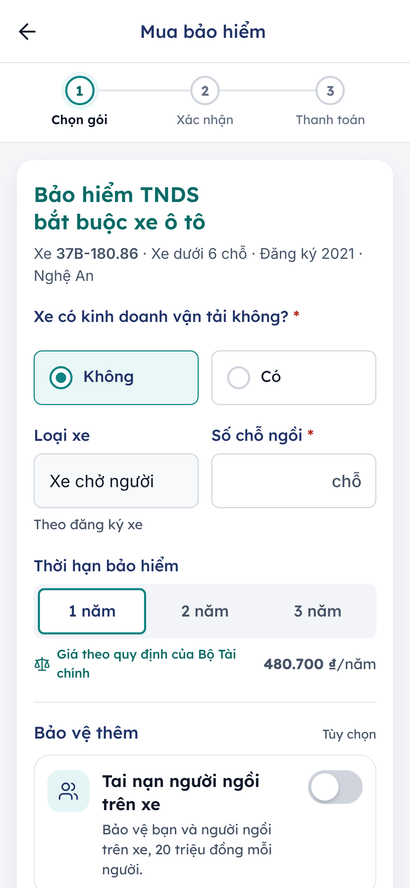{width=4.5cm} 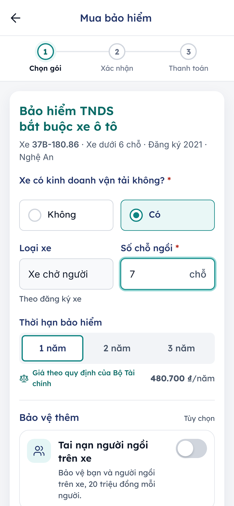{width=4.5cm} 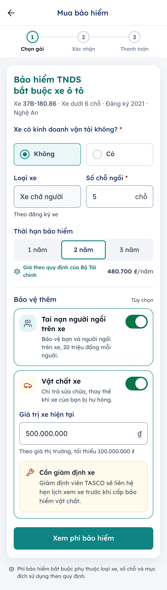{width=4.5cm}
:::

::: {custom-style="Caption"}
Figure 4 – Step 1: the quote form, the vehicle questions and the optional extra cover
:::

## Step 2: review

The review screen shows:

- the **Thông tin xe** (vehicle details) card, described below;
- **Chi tiết phí** (premium details): each product with its period, the premium and VAT, and the note **Giá theo quy định của Bộ Tài chính** on TNDS; then **Phí bảo hiểm (chưa VAT)**, **Thuế VAT** and **Tổng thanh toán**. Accident cover for people carries no VAT, and the screen says so;
- **Quyền lợi đi kèm**, the benefits included;
- **Báo giá có hiệu lực đến …**, when the quote expires (24 hours after it was made).

Tap **Tiếp tục** (continue) to go to payment.

### The vehicle confirmation card

The **Thông tin xe** card asks the customer to confirm the details the compulsory premium depends on: **Xác nhận để tính đúng phí bảo hiểm bắt buộc**. It shows the plate and vehicle, the question **Xe có kinh doanh vận tải không?** and **Số chỗ ngồi**, and the button **Xác nhận thông tin xe**.

Once confirmed, the card collapses to one line, for example "Không kinh doanh vận tải · 5 chỗ ngồi", with a **Sửa** (edit) button. If the customer changes an answer, the app saves it, recalculates the quote and says "Đã cập nhật thông tin xe và tính lại phí."

The customer cannot continue to payment until the vehicle details are confirmed; **Tiếp tục** then shows "Vui lòng xác nhận thông tin xe trước khi tiếp tục." This matters most for quotes sent by telesales, which open directly at this step: the customer confirms the business use and seats before paying.

::: {custom-style="Figure"}
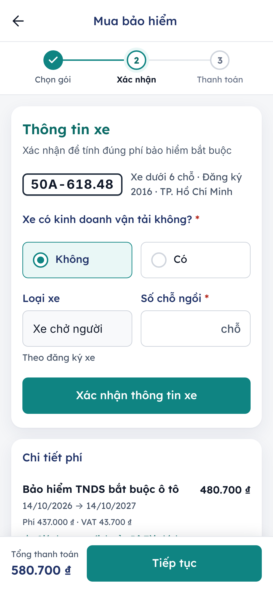{width=4.5cm} 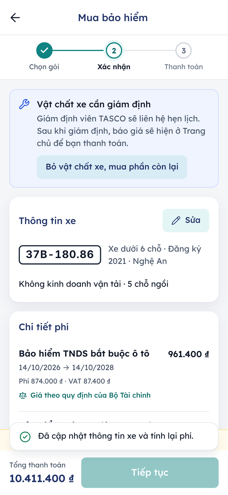{width=4.5cm} 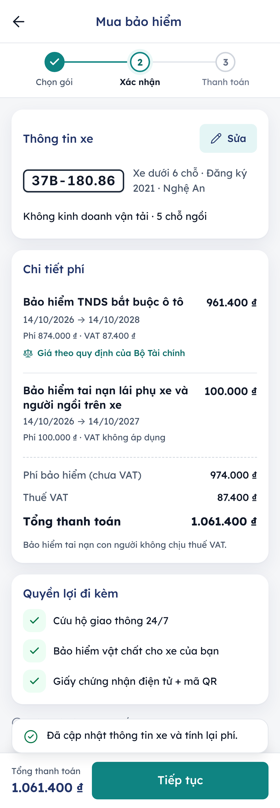{width=4.5cm}
:::

::: {custom-style="Caption"}
Figure 5 – Step 2: a telesales quote opening at the review step, the confirmed vehicle card and the premium details
:::

### When the customer cannot pay yet

Two notices can block payment. The bar at the bottom then explains why, and **Tiếp tục** does nothing.

- **Đây là giá tạm tính** (this is an indicative price): TASCO's rating system was busy, so the price is provisional. Tap **Xác nhận giá chính thức** to get the confirmed price. If it differs, the app shows both: "Giá chính thức: … (giá tạm tính …)".
- **Vật chất xe cần giám định** (physical damage cover needs an inspection): a TASCO assessor will call to arrange it. After the inspection the quote appears on the home screen for payment. To buy the rest now, tap **Bỏ vật chất xe, mua phần còn lại** (drop physical damage and buy the rest).

## Step 3: pay

1. Check **Phương thức thanh toán** (payment method). Inside the VETC app or the Zalo Mini App it is **Ví VETC**, with the wallet balance. In the TASCO app or on the TASCO website it is **Thanh toán qua cổng TASCO** (domestic ATM card, international card or bank QR). If the VETC wallet balance is too low, the notice **Số dư ví chưa đủ** says the host app will help the customer top up when confirming.
2. Check **Thông tin thanh toán**: **Đơn vị nhận** (payee) Bảo hiểm TASCO, **Nội dung** (for example "Bảo hiểm xe 30E-949.35"), **Số sản phẩm**, **Phí giao dịch** (fee) **Miễn phí** (free) and **Tổng thanh toán**.
3. Tick **Tôi xác nhận thông tin xe chính xác và đồng ý với quy tắc bảo hiểm của TASCO.** Without it, the app says "Vui lòng xác nhận trước khi thanh toán."
4. Tap **Thanh toán** followed by the amount.
5. The sheet **Xác nhận thanh toán** shows the amount, method, payee and description. Tap **Xác nhận thanh toán**, or **Để sau** to stop.

::: {custom-style="Figure"}
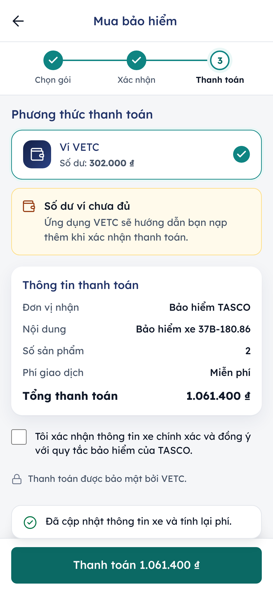{width=4.5cm} 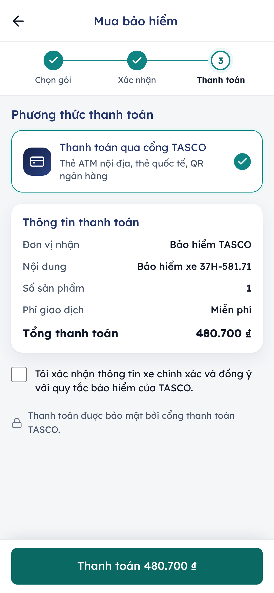{width=4.5cm} 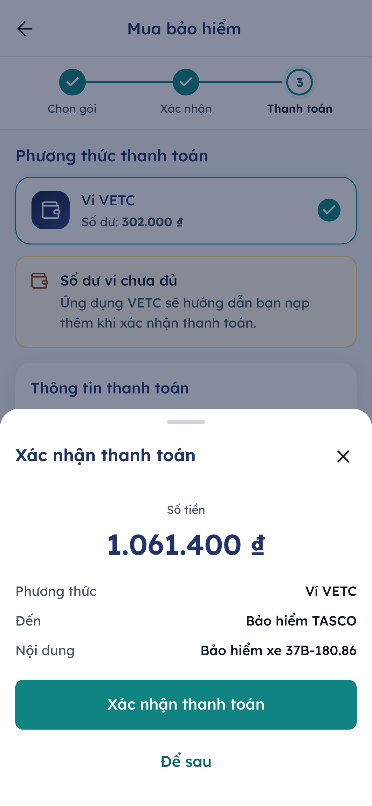{width=4.5cm}
:::

::: {custom-style="Caption"}
Figure 6 – Step 3: payment with the VETC wallet, payment on the TASCO website, and the confirmation sheet
:::

While the payment is processed, the screen reads **Đang xử lý thanh toán** and asks the customer not to close the app. A payment is processed once only: tapping twice or a network retry never charges twice.

When it succeeds, **Thanh toán thành công** shows the amount, **Mã giao dịch** (transaction reference), the time, the policy numbers and the e-certificate card with its QR code. **Lưu chứng nhận** saves the certificate as an image; **Về trang chủ** returns home.

If it fails, **Thanh toán chưa thành công** explains the reason in plain Vietnamese and adds "Bạn chưa bị trừ tiền" (you have not been charged). **Thử lại** tries again. If issuance fails after the money was taken, the platform refunds it automatically.

::: {custom-style="Figure"}
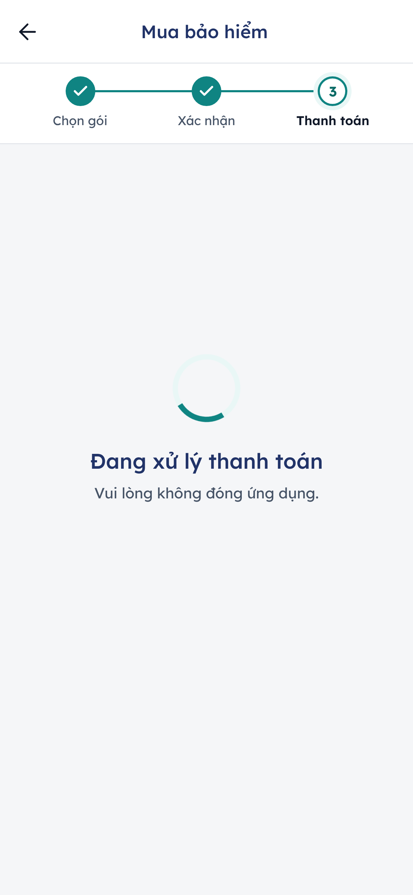{width=6cm} 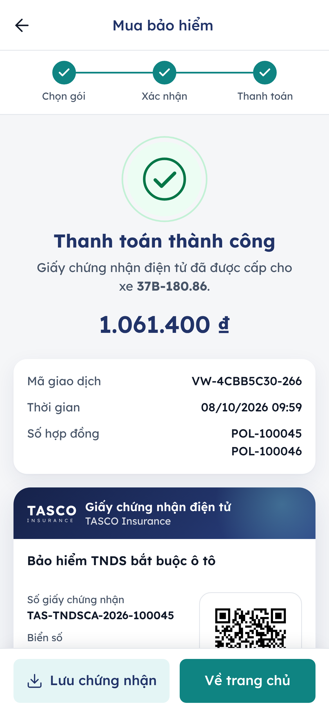{width=6cm}
:::

::: {custom-style="Caption"}
Figure 7 – Payment in progress and the success screen with the e-certificate
:::

## Example premiums

| Cover | Premium | VAT | Total |
|---|---|---|---|
| TNDS, car under 6 seats, not commercial, 1 year | VND 437,000 | VND 43,700 | VND 480,700 |
| Accident cover, 5 seats, VND 20 million each (illustrative rate) | VND 100,000 | None | VND 100,000 |
| Both together | VND 537,000 | VND 43,700 | VND 580,700 |

# My insurance and the e-certificate

**Bảo hiểm của tôi** lists the vehicle's policies. Each card shows the product, **Số GCN** (certificate number), a status chip (**Đang hiệu lực**, **Sắp hết hạn**, **Chưa đến ngày hiệu lực**, **Hết hạn** or **Đã hủy**), **Từ ngày** and **Đến ngày** with a bar of the time used, the days left and **Phí đã thanh toán** (premium paid). Expired and cancelled policies are grouped under **Đã hết hạn hoặc đã hủy**.

Each card offers:

- the QR code with **Phóng to** (enlarge): the QR opens full screen with the certificate number, plate and period, and the hint **Xuất trình mã này khi được cơ quan chức năng kiểm tra** (show this code when checked by the authorities);
- **Giấy chứng nhận điện tử**: opens the online verification page;
- **Lưu giấy chứng nhận**: saves the certificate as a PNG image with the QR code, for use without a connection.

A customer without policies sees **Chưa có hợp đồng với TASCO** and a **Mua bảo hiểm** button.

Anyone, such as traffic police or an inspection centre, can scan the QR code. The verification page shows **Giấy chứng nhận hợp lệ** (valid certificate) with the product, a masked plate and the period, or a clear message when the certificate has expired, been cancelled or is not found. It shows no personal data.

::: {custom-style="Figure"}
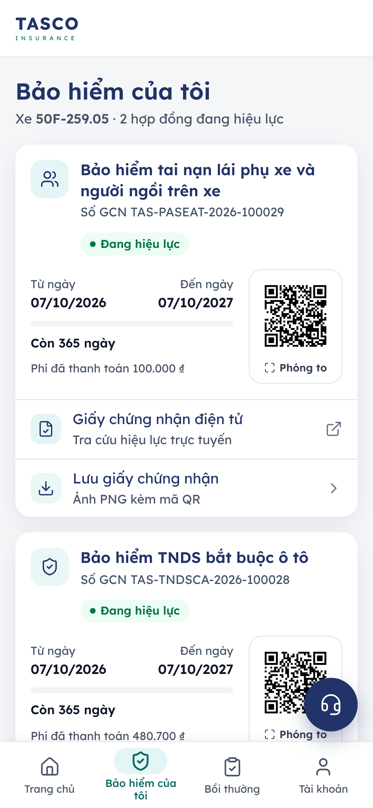{width=4.5cm} 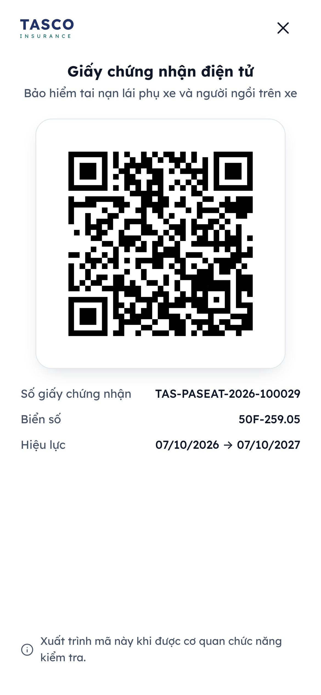{width=4.5cm} 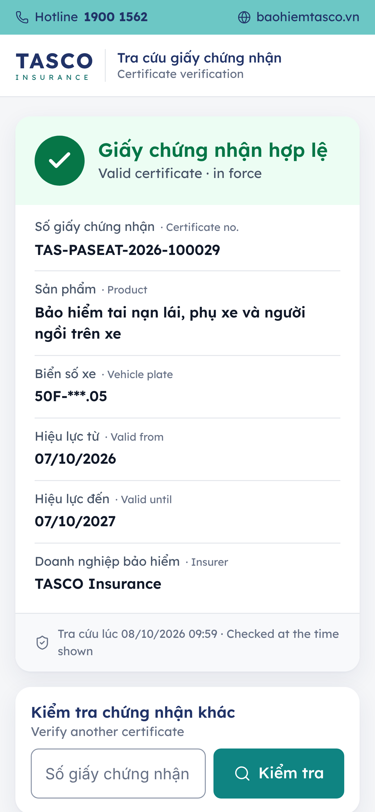{width=4.5cm}
:::

::: {custom-style="Caption"}
Figure 8 – My insurance, the full-screen QR code and the public verification page
:::

# Report an accident

## In an emergency

Safety comes first.

- If anyone is injured, call **115** (ambulance) at once. The **Bồi thường** tab and the accident form both have a **Gọi 115** button.
- Call **113** for the police if needed, and **114** for fire and rescue.
- For roadside help, call the TASCO hotline **1900 1562** (the **Cứu hộ 24/7** quick action on the home screen).
- Report the accident in the app when it is safe to do so.

## The claims tab

The **Bồi thường** tab shows:

- **Báo tai nạn**, to start a report (only when the vehicle has a TASCO policy in force; otherwise the notice **Chưa có hợp đồng đang hiệu lực** offers **Mua bảo hiểm**);
- the emergency buttons **Cấp cứu 115** (for injuries) and the hotline **1900 1562** (**Tổng đài 24/7**), and the support e-mail for claim questions;
- **Yêu cầu của tôi** (my claims), each with its reference, status chip, product, incident date and place, a progress track and a line saying what happens next. **Chi tiết yêu cầu** shows the description, the number of photos and the history.

The progress track has five stages: **Đã gửi** (sent), **Tiếp nhận** (acknowledged), **Giám định** (assessment), **Duyệt** (approved) and **Chi trả** (paid). A rejected claim shows **Từ chối** at the decision stage and asks the customer to call the hotline for an explanation.

## Submit a report

The form has five steps, shown as "Bước 1/5" with a progress bar.

1. **Chọn hợp đồng**: choose the policy concerned.
2. **Thời gian và địa điểm**: **Ngày xảy ra** (date, with shortcuts **Hôm nay** and **Hôm qua**; it must fall within the policy period and not in the future), **Giờ xảy ra** (time, optional) and **Địa điểm** (place, for example "Cao tốc Hà Nội – Hải Phòng, km 35").
3. **Sự việc**: choose the **Loại sự việc** (collision with another vehicle, collision with an obstacle, scratches and dents, flood or natural disaster, theft of parts, other), answer **Có người bị thương không?** and describe the event under **Diễn biến sự việc** (at least 10 characters). A red notice repeats: call 115 first if anyone is injured.
4. **Hình ảnh**: take or choose up to nine photos: the whole scene, the plates of the vehicles involved and close-ups of the damage. Photos are optional (**Bỏ qua và tiếp tục**); the assessor collects the originals when they call.
5. **Xem lại và gửi**: check each block, use **Sửa** to change one, tick **Tôi cam đoan thông tin trên là đúng sự thật** and tap **Gửi yêu cầu bồi thường**.

The confirmation **Đã gửi yêu cầu bồi thường** gives the claim reference and **TASCO liên hệ trước** (TASCO will contact you before), which is four hours after the report. The notice **Giữ máy điện thoại** asks the customer to keep the phone at hand for the assessor's call.

::: {custom-style="Figure"}
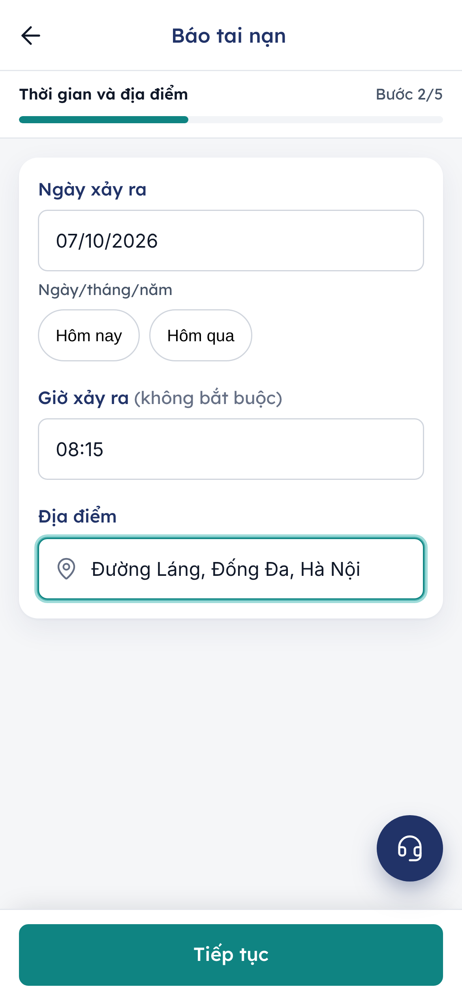{width=4.5cm} 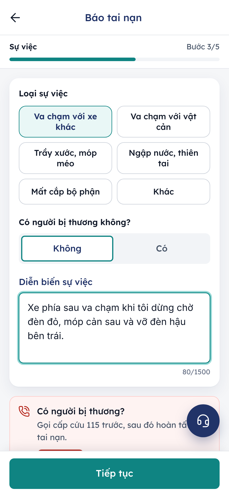{width=4.5cm} 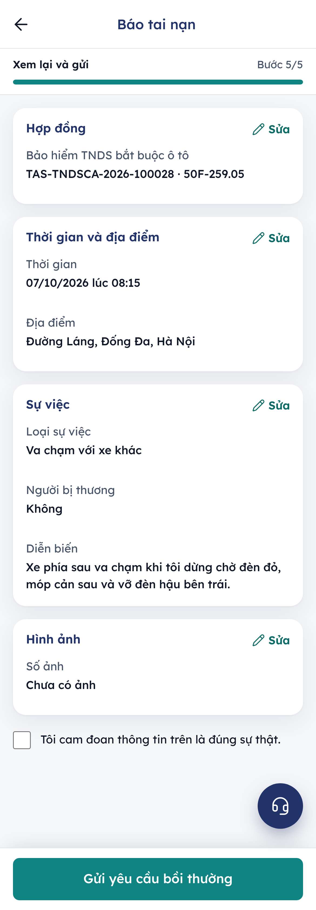{width=4.5cm}
:::

::: {custom-style="Caption"}
Figure 9 – Reporting an accident: when and where, what happened, and the review
:::

::: {custom-style="Figure"}
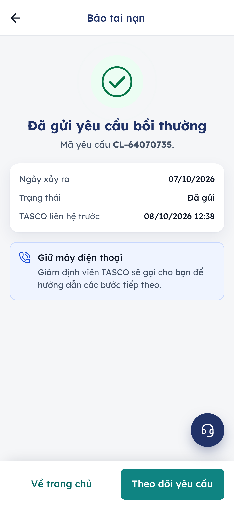{width=6cm} 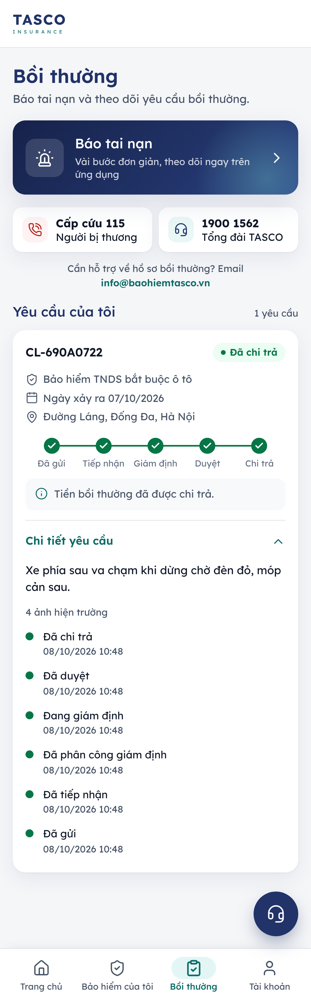{width=6cm}
:::

::: {custom-style="Caption"}
Figure 10 – The claim confirmation and the claim progress in the claims tab
:::

Claims for policies bought from another insurer are handled by that insurer.

# Account

The **Tài khoản** tab has four groups.

**Quyền riêng tư và liên lạc** (privacy and contact) holds the consent switches. Each change is saved at once and confirmed with "Đã lưu lựa chọn của bạn".

| Switch | Meaning |
|---|---|
| **Ưu đãi và thông tin sản phẩm** | Offers and product information by app notification, Zalo and SMS |
| **Cuộc gọi tư vấn** | TASCO advisers and the voice assistant may call |
| **Thông báo hiệu lực bảo hiểm** | Notices about the validity of the cover; always on to protect the customer |

A customer can also tell the voice assistant "đừng gọi nữa" (don't call again); the request takes effect at once.

**Dữ liệu cá nhân** (personal data) has **Tải dữ liệu của tôi**, which downloads a copy of the data TASCO holds about the customer: vehicle, policies, quotes, orders, claims, messages and calls. Requests to erase data go through the hotline; data for a policy still in force is kept as the law requires.

**Hỗ trợ** (support) lists the same channels as the support sheet (see the next chapter) and **Ngôn ngữ**: the app follows the host's language and is in Vietnamese.

**Thoát** signs the customer out of the insurance section. In demo environments only, **Đổi khách hàng demo** switches between demo customers; it never appears in production.

::: {custom-style="Figure"}
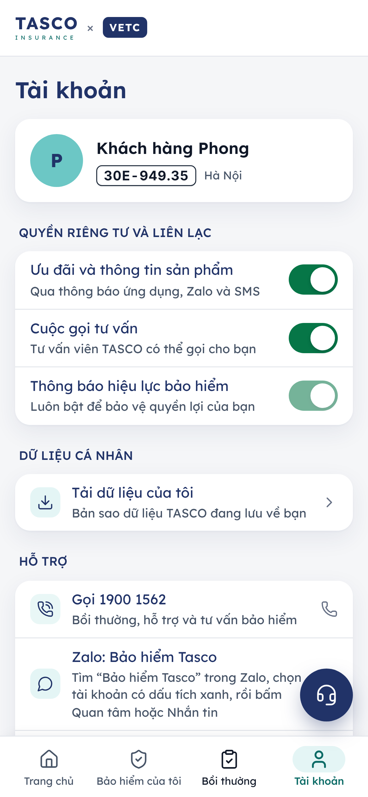{width=6cm} 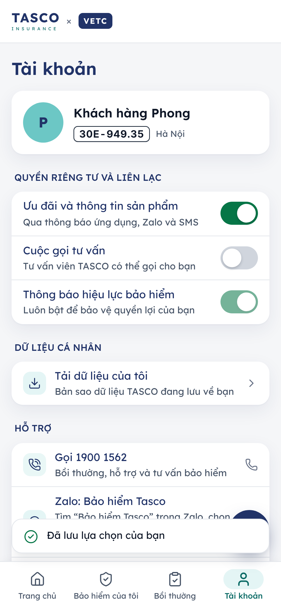{width=6cm}
:::

::: {custom-style="Caption"}
Figure 11 – The account tab and a saved consent choice
:::

# Contact TASCO

The support sheet (the headset button) and the **Hỗ trợ** group in the Account tab list TASCO's official channels. A channel that is not configured is not shown.

| Row in the app | Channel | Use |
|---|---|---|
| **Gọi 1900 1562**, Tổng đài hỗ trợ 24/7 | Hotline 1900 1562 | The primary line for claims, roadside help, general support and insurance questions |
| **Zalo: Bảo hiểm Tasco** | Zalo Official Account | Messages through Zalo |
| **Nhắn tin qua Messenger** | m.me/tasco.baohiem | Messages through Facebook Messenger |
| **Fanpage Bảo hiểm TASCO** | facebook.com/tasco.baohiem | TASCO's Facebook page |
| **Gửi email** | info@baohiemtasco.vn | Written questions, documents |
| **Trang web Bảo hiểm TASCO** | baohiemtasco.vn | Product information and TASCO's own channels |

TASCO's Zalo Official Account has no direct link. The row explains what to do: "Tìm "Bảo hiểm Tasco" trong Zalo, chọn tài khoản có dấu tích xanh, rồi bấm Quan tâm hoặc Nhắn tin". In English: search for "Bảo hiểm Tasco" in Zalo, choose the account with the blue verified tick, then tap **Quan tâm** (follow) or **Nhắn tin** (message). Tapping the row copies the account name and confirms "Đã sao chép tên tài khoản Zalo", so the customer can paste it into Zalo's search.

The hotline also appears on the home screen (**Cứu hộ 24/7**), in the claims tab and in the footer of the Account tab, with the e-mail address and the website.

::: {custom-style="Figure"}
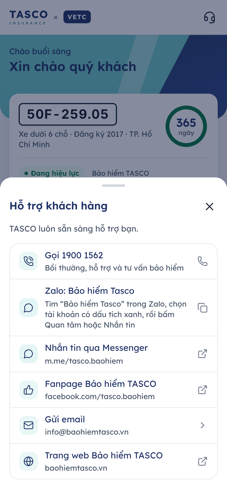{width=6cm} 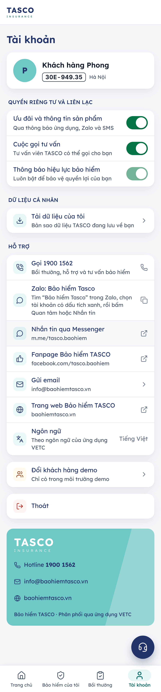{width=6cm}
:::

::: {custom-style="Caption"}
Figure 12 – The support sheet and the support group in the Account tab
:::

# Messages the customer may see

| Message | Meaning | What to tell the customer |
|---|---|---|
| Phiên làm việc đã hết hạn. Vui lòng mở lại từ … | The session ended | Open the insurance section again from the host app |
| Liên kết đã hết hạn hoặc không hợp lệ … | The renewal link is older than 30 days or damaged | Open it from the host app or the latest message |
| Báo giá đã hết hạn. Vui lòng xem lại phí để nhận báo giá mới. | Quotes are valid for 24 hours | Start the purchase again to get a new quote |
| Báo giá này đã được thanh toán hoặc đang xử lý. | The quote is already paid or being paid | Check **Bảo hiểm của tôi** before trying again |
| Giá tạm tính cần được xác nhận trước khi thanh toán. | Indicative price | Tap **Xác nhận giá chính thức** |
| Bảo hiểm vật chất xe cần giám định xe trước khi thanh toán. | Inspection not yet done | Wait for the assessor, or buy without physical damage cover |
| Ngày xảy ra nằm ngoài thời hạn bảo hiểm của hợp đồng đã chọn. | The accident date is outside the policy period | Check the date or the policy chosen |
| Hệ thống TASCO đang bận. Vui lòng thử lại sau ít phút. | A TASCO system is temporarily unavailable | Try again in a few minutes; nothing was charged |
| Bạn thao tác quá nhanh. Vui lòng thử lại sau ít phút. | Too many requests in a short time | Wait a moment |
| Không có kết nối mạng. Vui lòng kiểm tra và thử lại. | No network connection | Check the connection |

# Frequently asked questions

## Is the call from the automated assistant genuine?

Yes. The assistant always says it is automated, asks the customer to read the plate (it never reads the plate first) and never asks for an OTP or payment by phone. The customer can ask for a link and check everything in the app.

## Is it cheaper to buy in the app?

No. The TNDS premium is set by regulation and is the same everywhere. Buying in the app is faster, the e-certificate arrives at once, and the cover comes with roadside assistance and reminders.

## A telesales advisor sent me a quote. How do I pay?

Open the app. The quote is on the home screen under **Báo giá đang chờ bạn xác nhận**. Tap **Xem và thanh toán**, confirm the vehicle details and pay in the app. Advisers never take money or OTP codes by phone.

## I already bought insurance elsewhere. How do I stop the reminders?

Tap **Cập nhật ngày hết hạn** or **Xác nhận ngay** on the home screen and enter the new expiry date and insurer. Marketing messages can also be switched off in **Tài khoản**.

## The payment failed. Was I charged?

When the app says **Thanh toán chưa thành công**, the customer has not been charged. If money left the wallet or card but no certificate was issued, the platform refunds it automatically; the customer can call 1900 1562 with the time of the transaction.

## I sold the car or the assistant called the wrong person.

Tell the assistant "nhầm số" (wrong number), or call the hotline. TASCO updates the record.

# Appendix

## Screen and label summary

| Screen | Main labels |
|---|---|
| Tab bar | Trang chủ · Bảo hiểm của tôi · Bồi thường · Tài khoản |
| Home | Gia hạn ngay · Mua bảo hiểm ngay · Cập nhật ngày hết hạn · Xem và thanh toán · Cứu hộ 24/7 · Báo tai nạn |
| Purchase stepper | Chọn gói · Xác nhận · Thanh toán |
| Quote form | Xe có kinh doanh vận tải không? · Loại xe · Số chỗ ngồi · Thời hạn bảo hiểm · Bảo vệ thêm · Xem phí bảo hiểm |
| Review | Thông tin xe · Xác nhận thông tin xe · Chi tiết phí · Tổng thanh toán · Tiếp tục |
| Payment | Phương thức thanh toán · Ví VETC / Thanh toán qua cổng TASCO · Xác nhận thanh toán |
| Claim form | Chọn hợp đồng · Thời gian và địa điểm · Sự việc · Hình ảnh · Xem lại và gửi |
| Support | Hỗ trợ khách hàng · Gọi 1900 1562 · Zalo: Bảo hiểm Tasco · Nhắn tin qua Messenger · Fanpage Bảo hiểm TASCO · Gửi email · Trang web Bảo hiểm TASCO |
