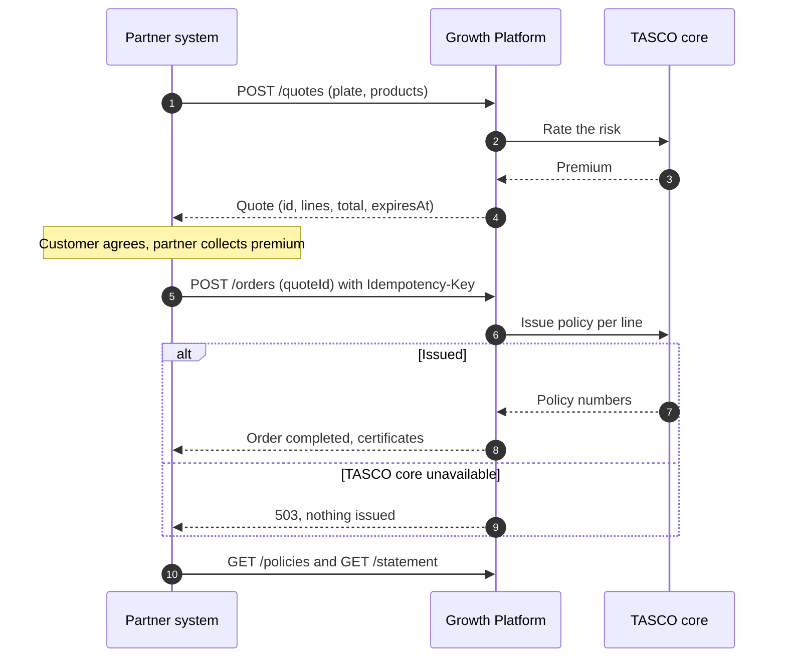

# Introduction

## Purpose

This guide tells a developer at a TASCO partner how to connect the partner's sales system to the TASCO Growth Platform: how to authenticate, quote, bind a quote into policies, list the policies sold and read the commission statement, and how to handle errors and retries safely.

## Scope

Version 1 of the Partner API, under the base path `/api/partner/v1`, with four operations. The staff side (onboarding a partner, issuing keys, statements in the console) is described in TGP-MAN-01 Staff Console User Manual, chapter "Partner manager".

## Audience

IT developers and integration engineers at banks, car showrooms, insurance agents, fleet operators and inspection centres that sell TASCO motor cover. TASCO's own Tasco360 partner app connects in exactly the same way, as an API consumer with its own partner account and key.

## Related documents

| ID | Title |
|---|---|
| TGP-ARC-02 | Integration Architecture |
| TGP-ARC-04 | Security Architecture |
| TGP-MAN-01 | Staff Console User Manual |
| TGP-OPS-01 | Runbook and Support Guide |

The machine-readable specification is published by the platform at `GET /api/openapi.json` (OpenAPI 3.1). Partner operations carry the tag "Partner API".

# Overview

| Item | Value |
|---|---|
| Base URL | Given to you by your TASCO partner manager, one for the sandbox and one for production |
| Base path | `/api/partner/v1` |
| Transport | HTTPS only; JSON request and response bodies (`Content-Type: application/json`) |
| Authentication | `X-Api-Key` header; each key carries scopes |
| Idempotency | `Idempotency-Key` header, required on `POST /orders` |
| Amounts | Integers in VND |
| Dates | `YYYY-MM-DD`; timestamps in ISO 8601 UTC |
| Payment | Collected by the partner; binding does not debit any customer wallet |
| Support | Your partner manager; quote the `requestId` of any error |

| Method and path | Scope | Purpose |
|---|---|---|
| `POST /api/partner/v1/quotes` | `quote` | Price cover for a vehicle identified by its licence plate |
| `POST /api/partner/v1/orders` | `purchase` | Bind a quote and issue the policies |
| `GET /api/partner/v1/policies` | `policies:read` | List the policies sold through your account |
| `GET /api/partner/v1/statement` | `policies:read` | Your commission statement for a period |

The usual flow is quote, customer agreement, bind, then periodic reads of policies and the statement.



TASCO core is the master for products and prices. Rating requests carry only the risk attributes of the vehicle; the policyholder's identity is sent to TASCO core at issuance.

# Authentication

Send your key in the `X-Api-Key` header on every request:

```
X-Api-Key: tpk_EXAMPLEonlyNOTaREALkey000000000
```

- Keys start with `tpk_` and are issued by your TASCO partner manager in the staff console. The key is shown once; TASCO stores only a fingerprint and cannot recover it. If a key is lost, ask for a new one; the old one is revoked.
- Keys have a lifetime of 90 days, 180 days, 1 year or 2 years, chosen when the key is issued. Plan the replacement before the expiry date.
- Keep keys on your servers, in a secret store. Never put a key in a mobile app, a web page or source control. Calls from a browser are refused unless TASCO has allowed the origin.
- Use different keys for the sandbox and for production.
- A missing, wrong, revoked or expired key, or a suspended partner account, gives `401 UNAUTHENTICATED`.

## Scopes

Each key carries one or more scopes. The platform checks them on every call; a call outside the key's scopes gives `403 FORBIDDEN` with the message "API key lacks scope …".

| Scope | In the console | Allows |
|---|---|---|
| `quote` | Quote | `POST /quotes` |
| `purchase` | Purchase (create orders) | `POST /orders` |
| `policies:read` | Read policies & statement | `GET /policies`, `GET /statement` |

A sales system that quotes and binds normally holds all three. A reporting system needs only `policies:read`.

In the examples below:

```bash
export BASE="https://<sandbox-host>"     # given by TASCO
export KEY="tpk_EXAMPLEonlyNOTaREALkey000000000"
```

# Create a quote

`POST /api/partner/v1/quotes` prices one to five products for a vehicle identified by its licence plate. If TASCO does not know the vehicle yet, it is added to the platform from the data you send (new business). Seats, use and current expiry you send are recorded as information declared by your organisation; they never override verified data.

## Request

| Field | Type | Required | Notes |
|---|---|---|---|
| `plate` | string, up to 20 | Yes | Any common format: `51K88821`, `51K-888.21`, `51k 888 21`. Must be a valid Vietnamese plate. |
| `products` | array, 1 to 5 | Yes | Each item `{ "code": "...", "options": { ... } }` |
| `holderName` | string, up to 120 | No | Policyholder name |
| `phone` | string, up to 20 | No | Vietnamese mobile number, validated |
| `seats` | integer, 1 to 60 | No | Number of seats; drives the vehicle category and the seat accident premium |
| `usage` | `personal` or `commercial` | No | Commercial transport use |
| `ownerType` | `individual` or `company` | No | Default `individual` |
| `currentExpiry` | date | No | Expiry of the customer's current TNDS; new cover starts the next day |

| Product code | Product | Options |
|---|---|---|
| `TNDS_CAR` | Compulsory third-party liability for cars; regulated price | `termYears` 1 to 3; `category` to override the vehicle category |
| `PA_SEAT` | Personal accident cover per seat (driver and passengers) | `sumInsuredPerSeat`: 10000000, 20000000, 50000000 or 100000000; `seats` (defaults to the vehicle's seats) |
| `MOTOR_PD` | Physical damage cover | `sumInsured` up to 5000000000; `deductible` 0, 500000 or 1000000; `vehicleAge` in years. Needs an inspection before binding. |

`TNDS_MOTORBIKE` is sold only in the customer app and is refused on the partner channel.

## Example

```bash
curl -sS -X POST "$BASE/api/partner/v1/quotes" \
  -H "X-Api-Key: $KEY" \
  -H "Content-Type: application/json" \
  -H "X-Request-Id: bank01-req-000123" \
  -d '{
    "plate": "51K-888.21",
    "holderName": "Nguyễn Văn Minh",
    "phone": "0912345678",
    "seats": 5,
    "usage": "personal",
    "ownerType": "individual",
    "products": [
      { "code": "TNDS_CAR", "options": { "termYears": 1 } },
      { "code": "PA_SEAT",  "options": { "sumInsuredPerSeat": 20000000 } }
    ]
  }'
```

## Response

`200 OK`, abridged. The person, plate and phone number are fictional.

```json
{
  "id": "Q-7cce99e6-209a-4036-8e1d-9f9c517c1c97",
  "plate": "51K-888.21",
  "channel": "partner_api",
  "partnerId": "P-BANK-01",
  "lines": [
    {
      "product": "TNDS_CAR",
      "productName": "Compulsory motor third-party liability (car)",
      "productNameVi": "Bảo hiểm TNDS bắt buộc ô tô",
      "startDate": "2026-10-07",
      "endDate": "2027-10-07",
      "premiumNet": 437000,
      "vat": 43700,
      "total": 480700,
      "priceRegulated": true,
      "breakdown": [
        { "label": "Car < 6 seats (non-commercial)", "annual": 437000, "years": 1 }
      ],
      "note": "Premium fixed by regulation — identical at every insurer."
    },
    {
      "product": "PA_SEAT",
      "productNameVi": "Bảo hiểm tai nạn lái phụ xe và người ngồi trên xe",
      "startDate": "2026-10-07",
      "endDate": "2027-10-07",
      "premiumNet": 100000,
      "vat": 0,
      "total": 100000,
      "priceRegulated": false,
      "breakdown": [
        { "label": "Personal accident", "seats": 5, "sumInsuredPerSeat": 20000000, "ratePerSeat": 0.001 }
      ]
    }
  ],
  "total": 580700,
  "bundle": "SAFE_DRIVE",
  "benefits": [
    { "id": "e_certificate", "titleVi": "Giấy chứng nhận điện tử + mã QR" }
  ],
  "status": "open",
  "ratingSource": "core",
  "indicative": false,
  "createdAt": "2026-10-07T03:12:44.120Z",
  "expiresAt": "2026-10-08T03:12:44.120Z"
}
```

## Notes

- `total` of a line is `premiumNet` plus `vat`. Personal accident cover is VAT-exempt.
- TNDS premiums are regulated and identical at every insurer. Never present a discount on them.
- A quote is valid for 24 hours (`expiresAt`).
- `bundle` is set when the products form a published bundle: `SAFE_DRIVE` (TNDS and seat accident) or `FULL_MOTOR` (TNDS, physical damage and seat accident). The bundle price is the sum of its parts.
- `ratingSource` shows who priced the quote: `core` (TASCO core) or `rules` (TASCO's filed rates held on the platform, used in the sandbox).
- If `indicative` is `true`, TASCO core was unavailable and the price is provisional. An indicative quote cannot be bound; request a new quote once TASCO core is available.
- Keep `id`; you need it to bind.

# Bind a quote

`POST /api/partner/v1/orders` binds a quote and issues one policy per line. It needs the `purchase` scope and an `Idempotency-Key` header.

## Request

| Header or field | Required | Notes |
|---|---|---|
| `Idempotency-Key` header | Yes | 8 to 100 characters: letters, digits, `_` or `-`. A UUID or your own order reference. |
| `quoteId` | Yes | A quote created with your own key |
| `holderName` | No | Replaces the policyholder name given at quote time |

```bash
curl -sS -X POST "$BASE/api/partner/v1/orders" \
  -H "X-Api-Key: $KEY" \
  -H "Content-Type: application/json" \
  -H "Idempotency-Key: bank01-order-2026-000457" \
  -d '{ "quoteId": "Q-7cce99e6-209a-4036-8e1d-9f9c517c1c97", "holderName": "Nguyễn Văn Minh" }'
```

## Response

`200 OK`, abridged.

```json
{
  "order": {
    "id": "O-e740b421fc4bf21e5f02",
    "quoteId": "Q-7cce99e6-209a-4036-8e1d-9f9c517c1c97",
    "channel": "partner_api",
    "partnerId": "P-BANK-01",
    "amount": 580700,
    "status": "completed",
    "paymentRef": "PARTNER-P-BANK-01-O-e740b421fc4bf21e5f02",
    "policies": ["TAS-TNDSCA-2026-100001", "TAS-PASEAT-2026-100002"],
    "commission": [
      { "product": "TNDS_CAR", "rate": 0.05, "amount": 21850, "capped": false },
      { "product": "PA_SEAT", "rate": 0.15, "amount": 15000, "capped": false }
    ],
    "completedAt": "2026-10-07T03:13:02.511Z"
  },
  "policies": [
    {
      "certNo": "TAS-TNDSCA-2026-100001",
      "policyNo": "POL-100001",
      "product": "TNDS_CAR",
      "plate": "51K-888.21",
      "startDate": "2026-10-07",
      "endDate": "2027-10-07",
      "total": 480700,
      "status": "active",
      "certificateUrl": "https://<platform-host>/verify/TAS-TNDSCA-2026-100001"
    }
  ],
  "idempotentReplay": false
}
```

- Only `order.status` `completed` means the policies were issued.
- `certificateUrl` is the public verification page. Print it as a QR code on your documents. Anyone can scan it to see validity, product, period and a masked plate; it shows no personal data.
- Commission is calculated on the net premium within the statutory caps and recorded on the order. The rates in the example are those configured in the sandbox; yours are set in your partner agreement.
- Partner sales are collected by the partner. `paymentRef` starts with `PARTNER-`, no customer wallet is debited, and the premium is remitted to TASCO under your partner agreement and reconciled against the statement.

## Physical damage cover

A quote that contains `MOTOR_PD` can be bound only after a TASCO assessor has recorded a passed inspection of the vehicle. Until then the order fails with `422 BUSINESS_RULE_VIOLATION` and the message "Physical damage cover needs a vehicle inspection first — a TASCO assessor will contact you". Arrange the inspection through your partner manager, or quote `TNDS_CAR` and `PA_SEAT` without `MOTOR_PD`.

# Idempotency

`POST /orders` must never issue a policy twice, even when your system retries after a timeout. The `Idempotency-Key` makes that safe.

- Create one key per purchase attempt and store it with your order before you call.
- If you get no answer (timeout, dropped connection), send the same request with the same key. You get either the completed order with `"idempotentReplay": true` (the `policies` array is not repeated; read it with `GET /policies`), or `409` if that attempt failed.
- After a definite failure, such as `503`, or `409` "A previous attempt with this Idempotency-Key ended as … — retry with a new key", retry with a new key. The quote is released after a failure, as long as it has not expired.
- A second bind of a quote that is already bought gives `422` "Quote is converted".
- `409` "This quote is already being paid" means another request is binding the same quote at that moment. Wait, then check `GET /policies` before retrying.

# List your policies

`GET /api/partner/v1/policies` returns the policies sold through your partner account, newest expiry first. It needs the `policies:read` scope.

| Query parameter | Type | Default |
|---|---|---|
| `limit` | integer, 1 to 500 | 50 |
| `offset` | integer, 0 or more | 0 |

```bash
curl -sS "$BASE/api/partner/v1/policies?limit=100&offset=0" -H "X-Api-Key: $KEY"
```

The response is a JSON array of policies, with the fields shown in the bind response plus `premiumNet`, `vat`, `channel`, `orderId`, `issuedAt` and `insurer`:

```json
[
  {
    "certNo": "TAS-PASEAT-2026-100002",
    "policyNo": "POL-100002",
    "plate": "51K-888.21",
    "product": "PA_SEAT",
    "startDate": "2026-10-07",
    "endDate": "2027-10-07",
    "premiumNet": 100000,
    "vat": 0,
    "total": 100000,
    "status": "active",
    "orderId": "O-e740b421fc4bf21e5f02",
    "certificateUrl": "https://<platform-host>/verify/TAS-PASEAT-2026-100002",
    "issuedAt": "2026-10-07T03:13:02.511Z",
    "insurer": "TASCO"
  }
]
```

Page through with `offset` until the array is shorter than `limit`.

# Read your commission statement

`GET /api/partner/v1/statement` returns the commission on your completed orders for a period. It needs the `policies:read` scope.

| Query parameter | Type | Notes |
|---|---|---|
| `from` | date | Inclusive; compared with the order date |
| `to` | date | Inclusive |

```bash
curl -sS "$BASE/api/partner/v1/statement?from=2026-10-01&to=2026-10-31" -H "X-Api-Key: $KEY"
```

```json
{
  "partnerId": "P-BANK-01",
  "from": "2026-10-01",
  "to": "2026-10-31",
  "orders": 1,
  "totalCommission": 36850,
  "lines": [
    { "orderId": "O-e740b421fc4bf21e5f02", "date": "2026-10-07", "product": "TNDS_CAR", "rate": 0.05, "amount": 21850, "capped": false },
    { "orderId": "O-e740b421fc4bf21e5f02", "date": "2026-10-07", "product": "PA_SEAT", "rate": 0.15, "amount": 15000, "capped": false }
  ],
  "byOrder": [
    {
      "orderId": "O-e740b421fc4bf21e5f02",
      "date": "2026-10-07",
      "products": ["TNDS_CAR", "PA_SEAT"],
      "subtotal": 36850,
      "certificates": ["TAS-TNDSCA-2026-100001", "TAS-PASEAT-2026-100002"],
      "premium": 580700
    }
  ]
}
```

`lines` has one row per product; `byOrder` groups them per order with the certificates and the premium collected. Only completed orders appear. This is the same statement your partner manager sees in the console.

# Errors

Every error has the same shape:

```json
{
  "error": {
    "code": "VALIDATION_FAILED",
    "message": "Request validation failed",
    "details": ["products is required"],
    "requestId": "bank01-req-000123"
  }
}
```

- `requestId` repeats your `X-Request-Id` header (8 to 64 letters, digits, `_` or `-`), or is generated when you send none. It is also returned in the `X-Request-Id` response header. Log it and quote it to support.
- `details` lists field-level problems for validation errors.

| HTTP | Code | Typical cause | What to do |
|---|---|---|---|
| 400 | `VALIDATION_FAILED` | Missing or invalid field; invalid plate or phone; missing or malformed `Idempotency-Key`; unknown product; unsupported sum insured or deductible; malformed JSON | Fix the request; do not retry it unchanged |
| 401 | `UNAUTHENTICATED` | Missing, wrong, revoked or expired key; suspended partner | Check the key; contact your partner manager |
| 403 | `FORBIDDEN` | Key lacks the scope; browser origin not allowed | Ask for the right scope; call from your server |
| 404 | `NOT_FOUND` | Quote not found or created by another partner; wrong path | Check the ID and the path |
| 405 | `METHOD_NOT_ALLOWED` | Wrong HTTP method | Fix the method |
| 409 | `CONFLICT` | Key of a failed attempt re-sent; quote being paid by another request | See "Idempotency" |
| 415 | `UNSUPPORTED_MEDIA_TYPE` | Body sent without `Content-Type: application/json` | Set the header |
| 422 | `BUSINESS_RULE_VIOLATION` | Product not sold on the partner channel; quote expired, already bought or indicative; sum insured above the online limit; physical damage without an inspection | Re-quote or change the request |
| 429 | `RATE_LIMITED` | Too many requests | Wait for `Retry-After` seconds, then back off |
| 503 | `UPSTREAM_UNAVAILABLE` | TASCO core temporarily unavailable; nothing was issued | Retry with back-off; for orders, use a new key |
| 500 | `INTERNAL_ERROR` | Unexpected error | Retry once; then contact support with the `requestId` |

Examples of messages you will see:

| Situation | Message |
|---|---|
| Plate not recognised | "Invalid licence plate" |
| Motorbike TNDS requested | "TNDS_MOTORBIKE is not sold on channel partner_api" |
| Quote older than 24 hours | "Quote expired — please re-quote" |
| Quote already bound | "Quote is converted" |
| No `Idempotency-Key` | "Idempotency-Key header (8–100 chars) is required" |
| Key without `policies:read` | "API key lacks scope policies:read" |

## Retry policy

- Retry only `429`, `503`, network timeouts and the `409` cases in "Idempotency". Use exponential back-off with jitter: 1, 2, 4 and 8 seconds, at most five attempts.
- On `POST /orders`, reuse the same `Idempotency-Key` only when the outcome is unknown. After a definite failure, use a new key.
- Never retry `400`, `401`, `403`, `404` or `422` without changing something.

# Rate limits

The platform allows 300 requests per minute from one client address by default. Above that it answers `429 RATE_LIMITED` with a `Retry-After` header in seconds. TASCO can agree a different limit for high-volume partners; ask your partner manager. Spread batch jobs (such as nightly policy reads) over time rather than sending them in bursts.

# Sandbox

The sandbox is a separate environment with its own base URL and keys. It behaves like production, with these differences:

- Policy issuance uses a sandbox adapter: certificates and policy numbers are test values and are not valid cover.
- Seat accident and physical damage prices use illustrative rates; TNDS uses the regulated tariff.
- Data is synthetic. Never send real customer data to the sandbox.
- Your partner manager can simulate an inspection or an issuance outage for the certification tests.

## Certification tests

Run these tests in the sandbox. Your partner manager signs off the results before a production key is issued.

1. Quote TNDS for a plate TASCO knows, and for a new plate with `currentExpiry` and `seats`.
2. Quote TNDS with seat accident cover and check that `bundle` is `SAFE_DRIVE`.
3. Bind with an `Idempotency-Key`. Repeat the same call and check `idempotentReplay: true`, `status: "completed"` and that no second policy appears.
4. Bind an expired quote: expect `422`.
5. Bind a quote created by another partner's key: expect `404`.
6. Omit `Idempotency-Key`: expect `400`. Omit or alter the key: expect `401`. Use a key without `purchase` on `POST /orders`: expect `403`.
7. With a simulated issuance outage, bind and expect `503`; re-send the same key and expect `409`; retry with a new key and expect success.
8. Quote `MOTOR_PD` and bind before an inspection: expect `422`.
9. Read policies and the statement for the test period and check the commission against the agreed rates.
10. Scan a `certificateUrl` QR code and check that the page shows a valid certificate and a masked plate.

# Go-live checklist

| Item | Owner |
|---|---|
| Sandbox certification tests passed and signed off | Partner, TASCO partner manager |
| Partner agreement signed, including commission rates and premium settlement | Partner, TASCO Partnerships |
| Production base URL received; partner server addresses allow-listed if required | TASCO IT |
| Production key issued with the needed scopes, stored in a secret store, never in client apps | TASCO partner manager, partner IT |
| Key expiry date recorded and a replacement planned | Partner IT |
| `X-Request-Id` and `requestId` logged for every call | Partner IT |
| Retry and idempotency logic reviewed against this guide | Partner IT |
| Sales staff briefed: TNDS price is regulated, no discount wording, no OTP or card details by phone | Partner sales |
| Customer data handled under Decree 13/2023/ND-CP; only the data the policy needs is sent | Partner compliance |
| Certificate QR printed on customer documents | Partner |
| Support contacts exchanged; escalation path agreed | Both |

# Data protection

- Send personal data (name, phone) only when the policy needs it and you have a lawful basis under Vietnam's personal data protection rules (Decree 13/2023/ND-CP), to be confirmed by TASCO legal for your agreement.
- The API does not collect marketing consent for TASCO or VETC. Do not tell customers they will receive TASCO or VETC marketing.
- Keep certificate data no longer than your agreement allows. Do not scrape the public verification page.
- Pass any request from a customer to see or erase the data TASCO holds to your partner manager, with the date you received it. TASCO compliance logs it and answers within the response time set by TASCO.
- Never present TNDS with discount, rebate or cashback wording.

# Appendix

## Change log

| Version | Date | Change |
|---|---|---|
| v1 | 08/10/2026 | First release: quotes, idempotent orders collected by the partner, policies, commission statement, scoped keys |

## Field reference: quote line

| Field | Meaning |
|---|---|
| `product` | Product code |
| `productName`, `productNameVi` | Product name in English and Vietnamese |
| `startDate`, `endDate` | Cover period |
| `premiumNet`, `vat`, `total` | Premium before VAT, VAT and total, in VND |
| `priceRegulated` | `true` for TNDS |
| `breakdown` | How the premium was calculated |
| `note` | A short pricing note |
