# Introduction

## Purpose

This manual explains how TASCO Insurance and VETC staff use the staff console of the TASCO Growth Platform. It covers signing in, the screen layout and the patterns every page shares, and then gives one chapter per role with the daily routine and step-by-step tasks.

## Scope

The manual describes version 1.0 of the staff console as delivered for user acceptance testing. Screen labels are quoted in English, as they appear when the console language is set to English. The console opens in Vietnamese by default; section "Language" in the Getting started chapter shows how to switch, and the Appendix lists the Vietnamese names of the main pages.

The customer app is covered by TGP-MAN-02 Customer App Guide, and partner system integration by TGP-MAN-03 Partner API Integration Guide.

## Audience

Every staff user of the console: executives, campaign managers, telesales supervisors and agents, rule authors and approvers, compliance officers, data stewards, claims handlers, partner managers, administrators, support engineers and internal auditors. Read the Getting started chapter first, then the chapter for your role.

## Golden rules

Three rules apply to every role and are built into the console.

- TNDS premiums are set by regulation and are the same at every insurer. Never offer or mention a discount, rebate or cashback on TNDS. TASCO competes on service: roadside assistance, the e-certificate, renewal reminders and fast claims.
- Staff never take payment, card details or OTP codes. A quote is sent to the customer's app, and the customer confirms and pays there.
- Open a customer record only when your work needs it. Every view is recorded in the audit trail.

## Related documents

| ID | Title |
|---|---|
| TGP-BUS-02 | Functional Requirements Specification |
| TGP-BUS-06 | Personas and Customer Journeys |
| TGP-UX-03 | Information Architecture and Navigation |
| TGP-OPS-01 | Runbook and Support Guide |
| TGP-DEL-06 | Organisational Change and Training Plan |
| TGP-MAN-02 | Customer App Guide |
| TGP-MAN-03 | Partner API Integration Guide |

# Getting started

## What you need

| You need | Notes |
|---|---|
| A user account | Created by a platform administrator after training. Each account has one or more roles and a data region (a province or All regions). |
| A supported browser | A current version of Chrome, Edge, Firefox or Safari. A screen at least 1,280 pixels wide works best. |
| An authenticator app | Needed for the Administrator, Rule approver, Compliance officer and Data steward roles. Microsoft Authenticator, Google Authenticator or a similar app. |
| The console address | Given by TASCO IT for production, and by your trainer for training and UAT. |

## Sign in

1. Open the console address. The sign-in page shows the TASCO brand panel on the left and the **Sign in** form on the right.
2. Enter your **Username** and **Password**. The eye icon in the password field shows or hides what you typed; a warning appears when Caps Lock is on.
3. Select **Sign in**.

If your role does not need two-step verification, the console opens on your start page and greets you by name. If it does, the **Two-step verification** step appears.

{width=16cm}

**Forgot password?** under the password field explains what to do: ask your system administrator to reset it. For security, passwords are never sent by e-mail.

The hotline and support e-mail shown at the foot of the page are TASCO's customer channels. Staff with sign-in problems contact their own service desk.

## Two-step verification

The first time you sign in with a role that needs two-step verification, the page shows a QR code.

1. Open your authenticator app and scan the QR code. If you cannot scan it, open **Can't scan? Enter the key manually** and type the key into the app.
2. The app shows an entry for the TASCO Growth Platform with a six-digit code that changes every 30 seconds.
3. Type the code into the six boxes under **6-digit authentication code**. The form submits itself when the sixth digit is entered; you can also select **Verify**.

At every later sign-in, only the six boxes appear. Each code can be used once: if you signed in a moment ago, wait for the next code. You have five minutes to complete this step before you must start again from the password. **Use a different account** takes you back to the first step.

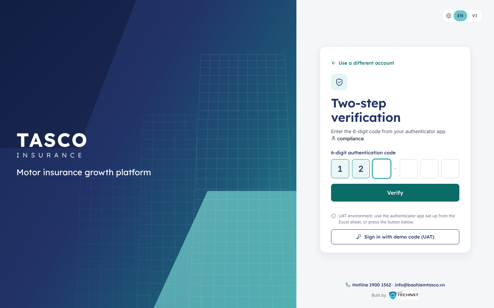{width=16cm}

In the UAT environment only, the step also shows **Sign in with demo code (UAT)**, which fills in the current code for a demo user. This button does not exist in production.

## Your start page

The console opens on the first page your role may use.

| Role | Start page |
|---|---|
| Executive, campaign manager, telesales supervisor, rule author, rule approver, compliance officer, data steward, partner manager, auditor, administrator | **Dashboard**, with figures chosen for the role |
| Telesales agent | **Dashboard**, shown as **My work today** |
| Claims handler | **Claims** |
| Support engineer | **Operations** |

## Screen layout

Every page has the same frame.

- The teal utility strip at the very top shows the TASCO **Hotline** (1900 1562) on the left. On the right are the environment badge (**UAT** in the test environment only), the **EN** / **VI** language switch and your user menu.
- The top bar under it shows the breadcrumb (where you are), the customer search box, the notifications bell and **Help**.
- The sidebar on the left lists only the pages your role may use, in groups. A number badge on a page shows work waiting for you.
- The footer reads "© 2026 TASCO Insurance · Powered by iorta TechNXT · v1.0".

| Sidebar group | Pages |
|---|---|
| (none) | Dashboard |
| Sell | Leads, Telesales inbox, Voice assistant |
| Engage | Journeys, Campaigns |
| Serve | Claims |
| Partners | Partners |
| Data | Data quality |
| Governance | Business rules, Approvals, Audit |
| Administration | Users, Operations |

**Collapse sidebar** at the foot of the sidebar reduces it to icons; hover over an icon to see the page name. The console remembers this choice on your computer. On a narrow screen the sidebar is hidden behind the menu button at the left of the top bar.

## Global search

Roles that can view customers have a search box in the top bar: **Search plate or phone…**.

1. Select the box, or press the / key anywhere outside a text field.
2. Type at least three characters of a licence plate, or a full phone number.
3. Pick a result with the mouse or the arrow keys and Enter. Each result shows the formatted plate, owner name, region and expiry date.

The customer opens in Customer 360 (see the Telesales agent chapter).

## Notifications

The bell in the top bar appears for roles that have work to act on. Its badge counts waiting items, and the panel lists the most recent ones.

| Item | Who sees it | Opens |
|---|---|---|
| New hot lead | Telesales agents and supervisors | Telesales inbox |
| Awaiting approval | Rule approvers and compliance officers (changes they may decide) | Approvals |
| SLA due soon / SLA breached | Claims handlers (claims to acknowledge within 2 hours, or overdue) | Claims |
| Open data issues | Data stewards | Data quality |

When nothing is waiting, the panel shows "You're all caught up".

{width=16cm}

## Help

**Help** (the question-mark icon in the top bar) opens a short panel about the page you are on: what it is for and the two or three points that matter most. Press Esc or select the close icon to return. This manual is the full reference.

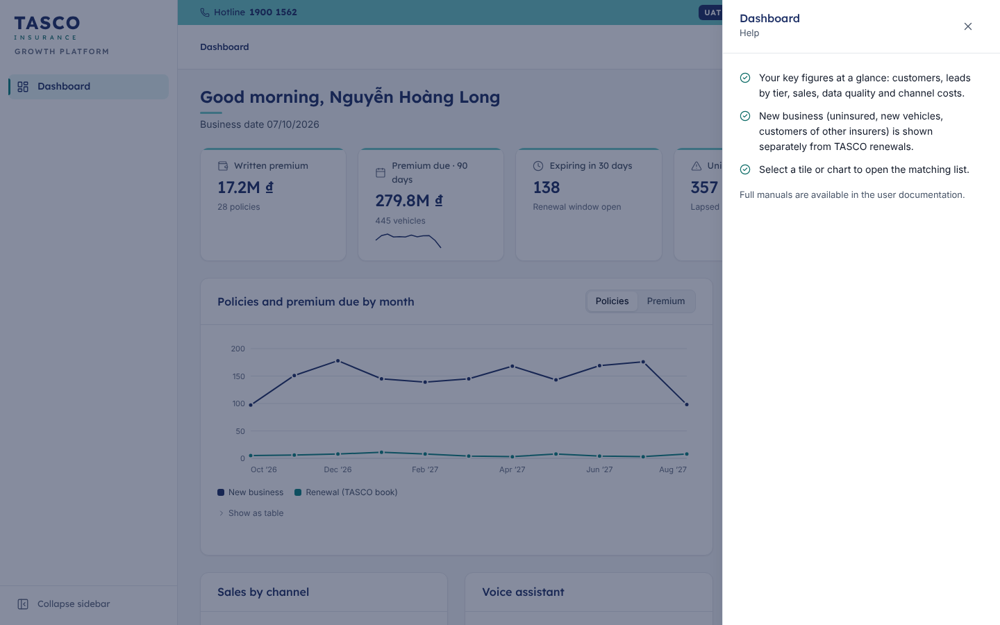{width=16cm}

## User menu, language and theme

Select your name in the utility strip to open the user menu. It shows your name, roles and data region, and holds:

- **Language**: **English** or **Tiếng Việt**. The **EN** / **VI** switch in the strip does the same. Data such as plates, names and rule names is never translated.
- **Theme**: **Light**, **Dark** or **System** (follows your computer's setting).
- **Change password**: enter the **Current password** and a **New password** of at least 12 characters, then **Save**. You are signed out everywhere and sign in again with the new password.
- **Sign out**. Always sign out on a shared computer.

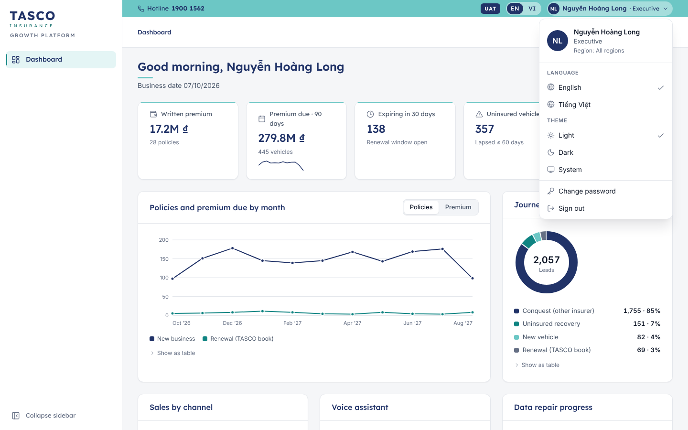{width=16cm}

If an administrator created your account or reset your password, the dialog **Please set your own password** opens straight after sign-in and cannot be closed until you have set one.

## Session length and lockout

A session lasts 30 minutes. When it ends, the console shows "Session expired — please sign in again" and returns to the sign-in page.

After five failed attempts (wrong password or wrong code, counted together) the account is locked for 15 minutes and the sign-in page says "Your account is temporarily locked after several failed attempts". Wait, or ask an administrator to unlock it.

## Common patterns

The pages share a small set of patterns. Learn them once.

### Page header

Each page has a title, an optional one-line subtitle and its main action at the top right, for example **New campaign** or **Rehearse a call**. Many pages then show a strip of figure tiles. A tile you can select filters the list below it.

### Tables

Lists are tables with a toolbar above them.

- The search box filters the rows as you type.
- Filter chips narrow the list, for example **Hot**, **Warm** and **Nurture** on Leads. A chip with an arrow opens a list of values; **Clear filters** removes them all.
- Column headers with an arrow can be sorted; select again to reverse the order.
- **Export CSV** downloads the rows you are looking at, with business labels, for use in a spreadsheet.
- At the foot, **Rows per page** and the range ("1–25 of 2,223") with previous and next arrows.

Select a row to open it, either in a new page, a right-hand drawer, or the detail panel next to the list.

### Row actions

Workflow tables have one primary action per row, named after what you do next ("Acknowledge", "Resolve…", "View statement"). Secondary and negative actions sit in the **More actions** menu (the three-dot button). Closed records show a muted **View** action instead.

### Drawers and confirmations

Details and forms open in a drawer on the right of the screen, so the list stays in place. Press Esc or select the close icon to leave it.

Decisions that change a record, such as approving a claim or rejecting a rule change, take two steps. You fill in the form and select **Review**; the dialog then shows a summary ("Check the details before you confirm") and the confirm button, for example **Confirm approval**. **Back** returns to the form. A message in the corner (a toast) confirms the result.

### Status chips and SLA chips

A record's status is shown once, as a coloured chip: green for completed or healthy, amber for waiting or due soon, red for rejected or breached, grey for closed or neutral. The Appendix lists every status name.

Work with a deadline also shows an SLA chip: **On track**, **Due soon** or **Breached**, with the time left or overdue ("1h 20m left", "35m over"). Hover over the chip to see the exact due time.

### Masked personal data

If your role may not see personal data, names and phone numbers appear masked (for example "N. V. An", "0912 *** 678") with a lock icon. This is expected.

### Error messages

An error appears as a red toast with a plain message and a reference such as "Ref. 7F3C2A1B". Give this reference to the service desk; it identifies the request in the logs.

# Executive

## What the role is for

Executives in the CEO office and sales leadership follow growth, renewal and data repair at a glance. The role is read-only: it sees the Dashboard and nothing else, and never sees customer personal data.

## Daily routine

Open the Dashboard once a day, or before a sales meeting. It takes about five minutes to read.

## Read the dashboard

The figure tiles at the top show only figures that have data.

| Tile | What it means |
|---|---|
| Written premium | Premium of policies sold through the platform, with the number of policies |
| Premium due · 90 days | Premium of TASCO renewals and new business falling due in the next three months, with the number of vehicles and a trend line |
| Expiring in 30 days | Vehicles whose cover ends within 30 days (renewal window open) |
| Uninsured vehicles | Vehicles whose cover lapsed within the last 60 days |
| Voice saving | Cost saved by the voice assistant compared with the same calls made by telesales |

Below the tiles:

- **Policies and premium due by month** shows new business and TASCO renewals by month. The **Policies** / **Premium** switch changes the measure.
- **Journey mix** shows how leads divide between renewal, conquest (customers of other insurers), new vehicles and uninsured recovery.
- **Sales by channel** shows where policies were sold (VETC app, Zalo, telesales, partner API). When only one channel has sales, the card shows **Policies by product** instead.
- **Voice assistant** shows calls made, hot handoffs to telesales and renewal links sent, with the main call outcomes.
- **Data repair progress** shows the share of vehicles with a reliable expiry date and the top open data issues.

Every chart has **Show as table** under it for the exact numbers.

{width=16cm}

## What to check

- Premium due in the next 90 days against the sales target.
- Uninsured vehicles: a rising number means recovery journeys or telesales capacity need attention.
- Data repair progress: sales depend on reliable expiry dates.
- Any figure that looks wrong: ask the campaign manager or the data steward before drawing conclusions. The figures come from the platform, not from TASCO core, so they can differ slightly from finance reports.

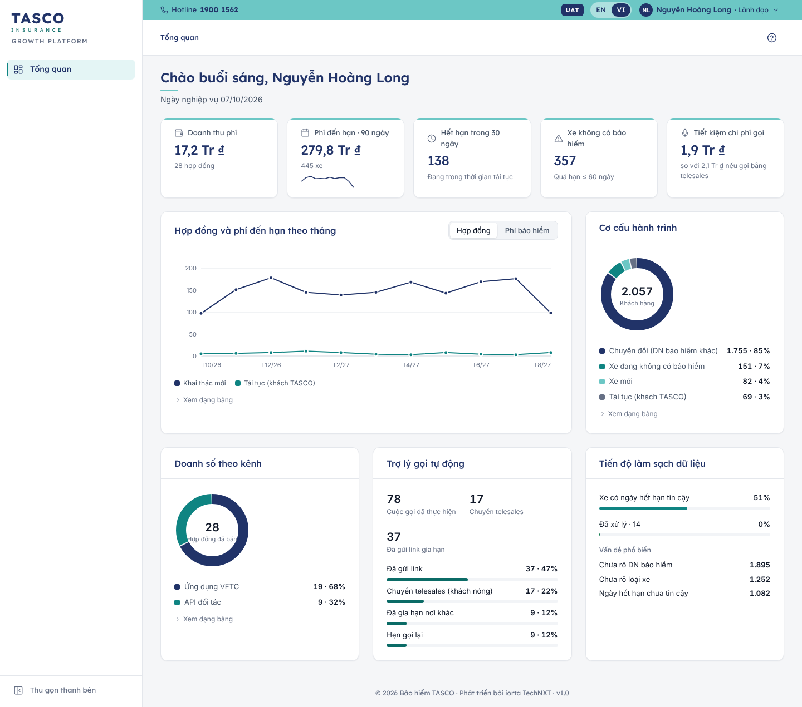{width=16cm}

# Campaign manager

## What the role is for

The campaign manager decides who TASCO contacts, when and through which channel. The role works with leads, journeys, voice and messaging campaigns, and reads the business rules. It can open Customer 360 with personal data masked, and sees the telesales inbox read-only.

## Daily routine

1. Open the **Dashboard**. Check **Due today** and select **Run due touchpoints** if the scheduled run has not happened.
2. Review **Pipeline by journey** and **Campaign performance**.
3. Plan or launch a voice campaign for hot or warm leads with **New campaign**.
4. Check the results of the previous day's campaigns.
5. Once a week, review the journeys and raise any change to cadences or message wording with the rule author.

## Read your dashboard

The tiles show **Hot leads** (with the warm count), **Due today** or **Due in 7 days**, **Messages sent**, **Calls made** and **Policies sold**. Select **Hot leads** to open the hot-tier lead list.

**Pipeline by journey** lists leads per journey with the touchpoints due today and in the next seven days; select a row to open those leads. **Campaign performance** lists the five latest campaigns; **Messages by channel** shows the split between app notifications, Zalo ZNS and SMS.

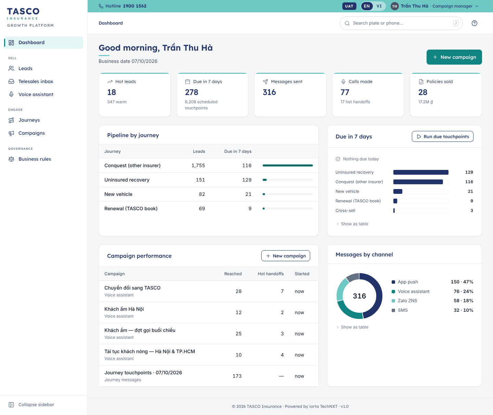{width=16cm}

## Find a target segment

1. Select **Leads** in the sidebar.
2. Select a tier chip: **Hot** (score 70 or more), **Warm** (45 or more) or **Nurture**.
3. Use the **Journey**, **Next best action** and **Region** chips to narrow the list.
4. Sort by **Score** or by **Expiry** with the column headers.
5. Select **Export CSV** to take the list into a spreadsheet for planning.

Each row shows the vehicle, score, tier, journey, expiry date ("in 22 days", "lapsed 25 days"), next best action, region and premium. Select a row to open Customer 360.

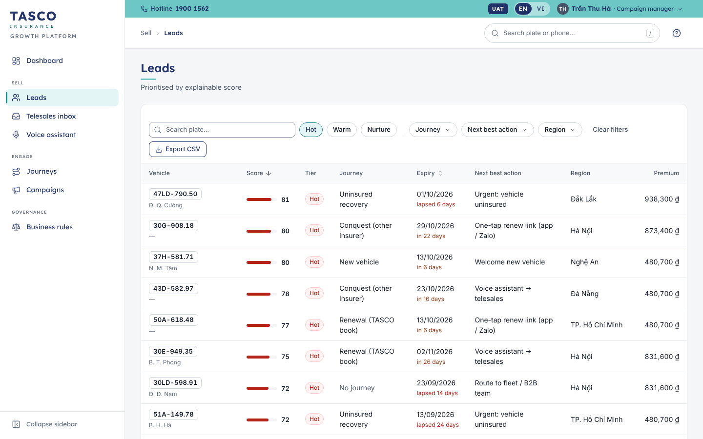{width=16cm}

## Run due touchpoints

Journeys send reminders on fixed days before or after the policy expiry. A scheduled job normally sends them; you can also run them by hand.

1. Select **Journeys** in the sidebar. Each journey card shows its cadence (for example D−45, D−30, D−7, D0), the channels per step and its figures: **In journey**, **Due in 7 days**, **Sold** and **Conversion**.
2. Select **Run due touchpoints**.
3. Check the **Business date** and **Send time (local)**.
4. Select **Run now**.

The toast reports how many touchpoints were sent and how many skipped. The results card lists them by channel. A touchpoint is skipped when the contact policy does not allow it: outside contact hours (08:00 to 20:00), no consent, daily or weekly limit reached, or blocked by the copy guard. Skipped touchpoints show the reason in the customer's Journey tab.

**Next scheduled touchpoints** at the foot of the page lists what is coming, with the due date, vehicle, journey, step, channels and status.

## Simulate an ecosystem event

VETC events such as a new ETC tag, an inspection booking, a wallet top-up or a long highway trip can trigger a message. To test a trigger in UAT or training:

1. On **Journeys**, select **Simulate ecosystem event**.
2. Choose the **Event** and type the **Customer plate**, for example 30E-949.35.
3. Select **Send event**.

The result shows what happened: "Message sent", "Conditions not met", "No permitted channel" or "Blocked by content rules".

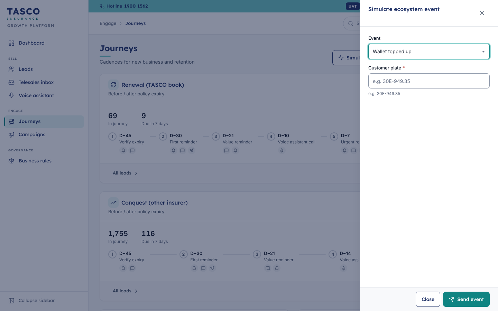{width=16cm}

## Launch a voice campaign

1. Select **Campaigns** in the sidebar, then **New campaign**. You can also start from the Dashboard or the Voice assistant page.
2. Under **Channel**, keep **Voice assistant**. (**Journey messages** sends every touchpoint that is due, as in "Run due touchpoints".)
3. Give the campaign a **Name** your team will recognise (optional).
4. Under **Audience**, choose the **Lead tier** (Hot or Warm), the **Journey** and the **Region**.
5. Under **Calling window**, set the **Date**, the **Start time (local)** and the **Maximum calls** (1 to 200). Calls only go out inside the allowed contact hours.
6. Read the **Contact-policy preview** on the right. It shows how many customers are **In audience**, how many **Can be contacted** and how many **Will be called**, and why others are **Held back by contact policy** (for example "No call consent" or "Weekly call limit reached"). Company vehicles are counted under **Routed to fleet team** and are not called.
7. Select **Launch campaign**.

The toast reports how many customers were reached and how many became hot handoffs. Hot handoffs appear at once in the Telesales inbox.

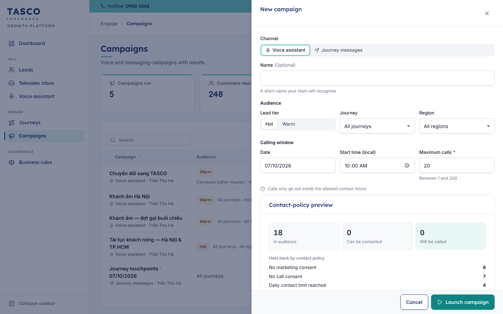{width=16cm}

## Review campaign results

On **Campaigns**, the tiles show **Campaigns run**, **Customers reached**, **Hot handoffs** and **Renewal links sent**. Select a campaign row to open its results: audience, maximum calls, customers reached, a chart of call outcomes and a chart of customers held back by the contact policy.

To listen in on what the assistant said, open **Voice assistant**, filter by **Outcome** and select a call. The call drawer shows the plate check, outcome, number of exchanges, duration and the full transcript in Vietnamese; switch on **Show English translation** to read it in English. **Open handoff** goes to the telesales handoff the call created.

## Request a change to journeys, messages or scoring

The campaign manager reads the rules but does not change them. To change a cadence, a message or the scoring, send the rule author the request with the reason and, ideally, the expected effect. The change follows the maker-checker process in the Rule author and approver chapter.

## What to check

- Skipped touchpoints rising: consent or contact data may be poor, or a cap is too tight.
- Hot handoffs not picked up: tell the telesales supervisor before launching more calls.
- Opt-out and scam-concern outcomes: a rise means the script or timing needs review with compliance.

# Telesales supervisor

## What the role is for

The supervisor runs the telesales team for a region. The role sees every handoff in its region, reassigns work, keeps the team within the two-hour first-call SLA and coaches agents. Supervisors can do everything an agent does, including quoting.

## Daily routine

1. Start on the **Dashboard**. Check **Within SLA** and the **SLA watchlist**.
2. Open the **Telesales inbox**. Make sure every **New** handoff has an owner and reassign work from absent or overloaded agents.
3. During the day, watch the notifications bell for new hot leads.
4. At the end of the day, check **Callback** handoffs and that every called customer has an outcome.
5. Once a week, sample won and lost handoffs and their notes for coaching.

## Read your dashboard

| Tile | What it means |
|---|---|
| Open handoffs | Handoffs not yet won or lost, split into New and Callback |
| Within SLA | Share of waiting handoffs that are not past their first-call deadline, with the breached and due-soon counts |
| Win rate | Won divided by won plus lost |
| Hot leads | Hot-tier leads in your region |
| Policies sold | Policies sold through the platform, with written premium |

The **SLA watchlist** lists the six waiting handoffs closest to their deadline, with the SLA chip, the reason and the assigned agent. Select one to open it. **Open by agent** and **Open by region** show where the work sits.

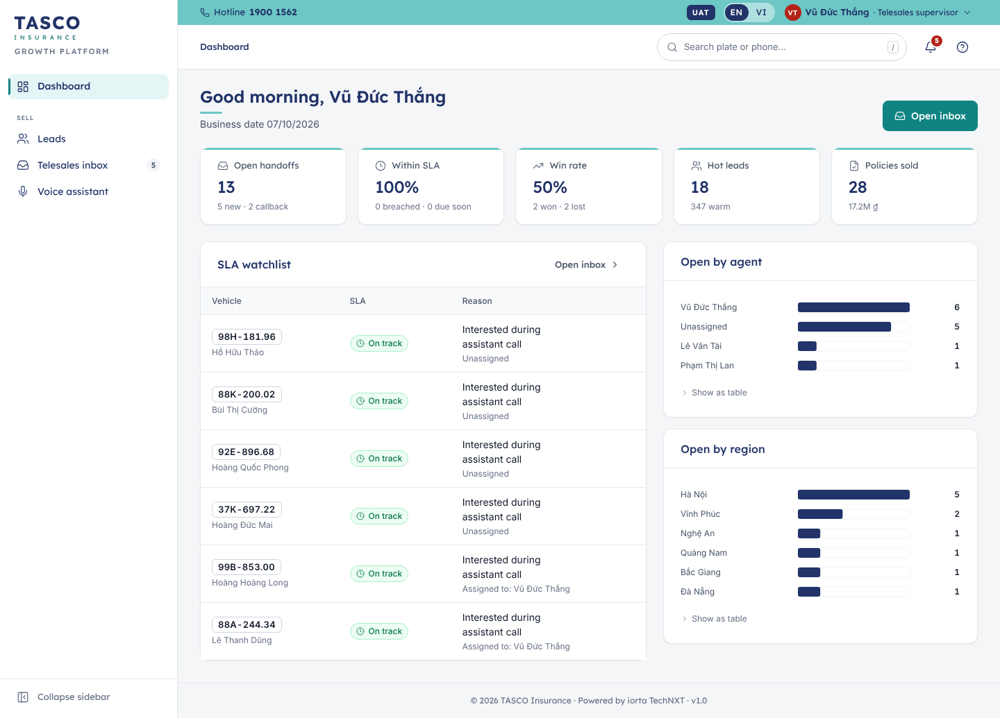{width=16cm}

## Manage the queue

1. Select **Telesales inbox** (or **Open inbox** on the Dashboard).
2. Use the status chips above the queue: **New**, **In progress**, **Callback**, **Won**, **Lost**. Each shows its count.
3. Switch **Only mine** off to see the whole team's work.
4. The queue lists waiting work with the oldest deadline first. Each card shows the plate, customer, reason, SLA chip, assigned agent and age.

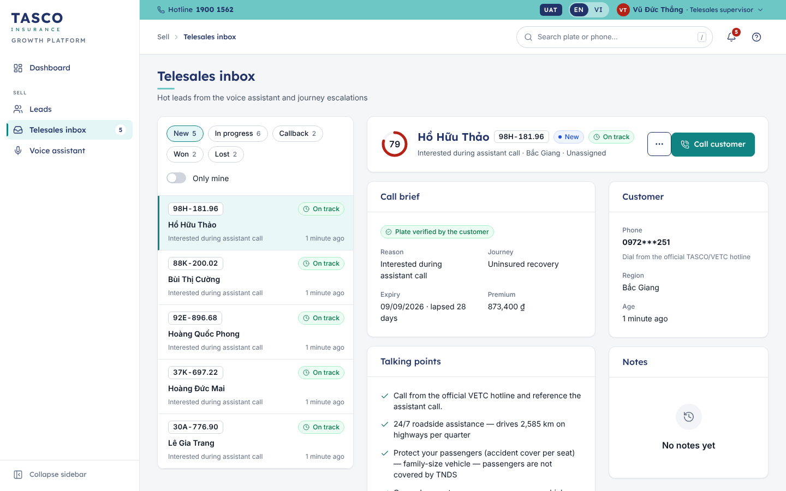{width=16cm}

## Reassign a handoff

1. Select the handoff in the queue.
2. In the detail panel, open **More actions** and select **Reassign**.
3. Choose the agent under **Assign to**. The list shows agents and supervisors with their region.
4. Add a **Note** if useful, for example why the handoff moved.
5. Select **Reassign**.

The handoff moves to the new agent, who sees it in their queue. The note is kept in the handoff's **Notes**.

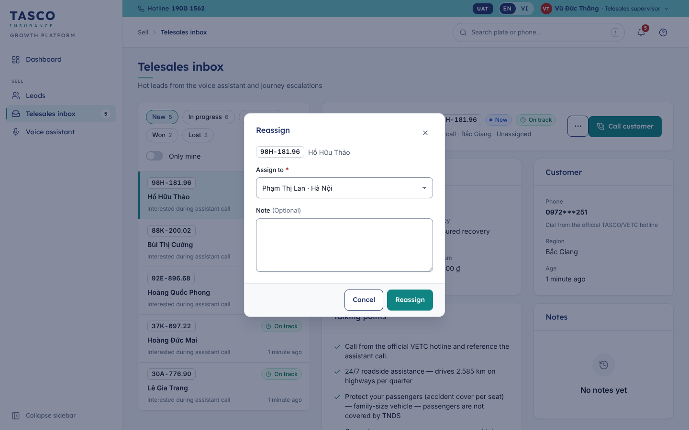{width=16cm}

## Correct an outcome

Won and lost are final. If an agent recorded the wrong outcome, add a note to the handoff explaining the correction with **More actions** › **Add note**, and tell the agent. Do not reopen work by creating duplicate quotes.

## Coaching checklist

When you sample a handoff, check that the agent:

- called from the official hotline and referred to the assistant's call;
- read the call brief and talking points first, especially a trust concern or a price question;
- answered price questions truthfully (regulated price, same at every insurer) and offered one relevant service benefit;
- sent the quote to the customer's app and never asked for payment or OTP codes by phone;
- recorded the outcome and a clear note straight after the call.

## What to check

- **Breached** handoffs on the watchlist: reassign or call yourself.
- An agent with many **In progress** handoffs and few outcomes.
- Lost reasons: many "Price / budget" outcomes suggest the value message needs work.

# Telesales agent

## What the role is for

The voice assistant makes the first call. It says that it is automated, checks the licence plate with the customer, confirms the expiry date and answers basic questions. When a customer is interested, or a customer has not responded to digital reminders, the platform puts a handoff in your **Telesales inbox**.

Your job is to call the customer, prepare a quote, send it to the customer's app and record the outcome. You see customers and handoffs in your own region, with personal data.

Three promises are kept on every call: you call from the official TASCO or VETC hotline; you never ask for OTP codes, card details or payment by phone; you never offer a discount on TNDS.

## Daily routine

1. Start on **My work today**. It shows **Handoffs to call**, **Callbacks**, **New in my region** and **Hot leads to work**.
2. Work the handoffs in the order the inbox shows them: the oldest deadline first.
3. Make the callbacks you scheduled for today.
4. Between handoffs, work the hot leads list.
5. Record every outcome before you take the next call.

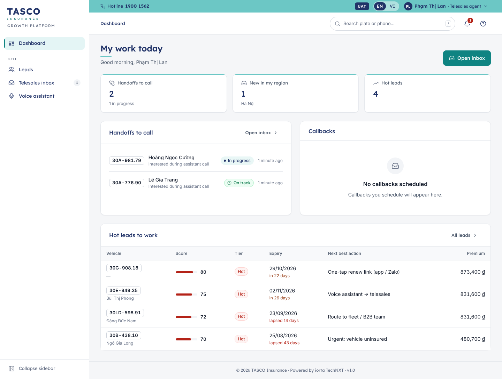{width=16cm}

## Work a handoff

### Open and read the call brief

1. Select **Telesales inbox** in the sidebar, or a handoff on **My work today**.
2. Select the first card in the queue. The detail panel opens next to the queue.
3. Read the panel before you dial:
   - the header: customer name, plate, status, SLA chip, reason and region;
   - **Call brief**: signals such as **Plate verified by the customer**, **Asked about price** or **Raised a trust concern**, with the journey, expiry date and premium;
   - **Talking points** generated for this customer;
   - **Customer**: the masked phone number with the reminder "Dial from the official TASCO/VETC hotline";
   - **Notes** from earlier contacts.

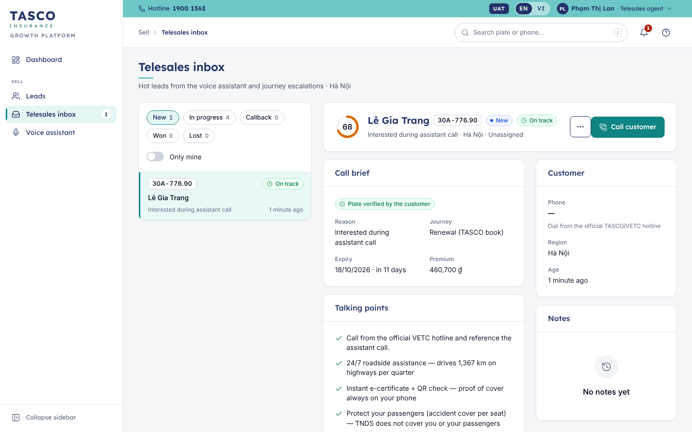{width=16cm}

### Call

4. Select **Call customer**. The status changes to **In progress**, the handoff is assigned to you and other agents no longer see it. The toast reminds you to call from the official hotline.
5. Call the customer. Refer to the assistant's call and confirm the plate.

### Quote

6. Select **Send quote**. Customer 360 opens on the **Policy & quotes** tab.
7. In **Build a quote**:
   - **Compulsory third-party liability (car)** is always included and priced by regulation;
   - switch on **Driver & passenger accident** if the customer wants it, and choose the **Cover per seat** (VND 10, 20 or 50 million);
   - switch on **Motor physical damage** if the customer wants it, and enter the **Vehicle value (sum insured)**, at least VND 100,000,000;
   - choose the **Term**: 1, 2 or 3 years.
8. Select **Calculate price**. The **Quote summary** shows each product with its period, premium and VAT, the total and, when the products form a bundle, the bundle name. The line under the total says whether the price came from TASCO core or from TASCO's filed rates.

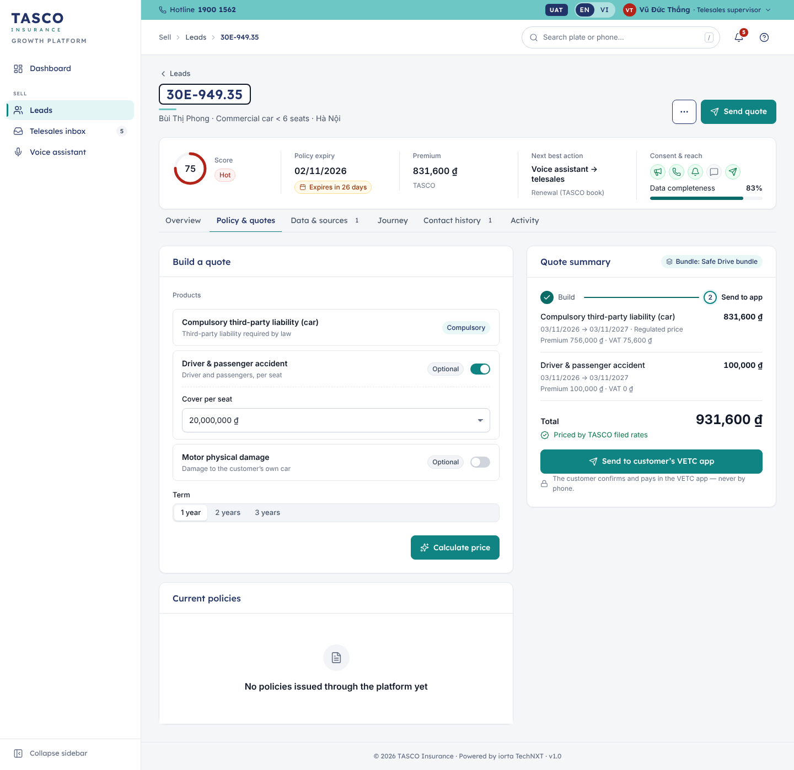{width=16cm}

If the summary shows **Indicative price**, TASCO core was not available. Select **Re-rate** before sending; an indicative quote cannot be paid.

If the quote includes physical damage cover, the summary shows a **Vehicle inspection** step. Select **Record inspection**, enter the **Inspection evidence** (assessor name and photo reference), tick **Inspection passed** and confirm. Sending stays disabled until the inspection is recorded.

### Send the quote to the customer

9. Select **Send to customer's VETC app**.

The toast confirms "Quote sent to the customer's VETC app". The customer sees the quote on the home screen of the app and pays there. If no channel can reach the customer, the toast says "No channel available to reach this customer"; tell your supervisor.

### Record the outcome

10. Return to the **Telesales inbox** and select the handoff.
11. Open **More actions** and choose:
    - **Mark won** when the customer agreed and will pay in the app. Describe it under **What happened?**.
    - **Schedule callback** when the customer asks you to call later. Set **Call back on** and the **Time**.
    - **Mark lost** with a **Reason**: Price / budget, Renewed with another insurer, Not interested, Could not reach the customer, or Other.
    - **Add note** for anything colleagues should know.

The handoff moves to the matching status chip and the note is saved with your name.

## Customer 360

Customer 360 is one page about one vehicle and its owner. Open it from Leads, the inbox (**View Customer 360**) or the global search.

The header shows the plate, the owner, vehicle category and province, and a **Do not contact** badge and red banner if the customer opted out. The summary card shows the lead score ring and tier, the policy expiry with a status chip (for example "Expires in 22 days" or "Lapsed 25 days"), the premium and current insurer, the next best action and journey, and the consent and reach icons (marketing consent, call consent, VETC app notifications, Zalo, SMS) with a data completeness meter.

| Tab | What it shows |
|---|---|
| Overview | **Why this customer** (each score factor with points and a reason), **Guided next action**, and **Value to offer**: the service benefits relevant to this customer. A benefit marked "Staff only · pending legal review" must not be offered. |
| Policy & quotes | The quote builder (roles that can quote) and **Current policies** with certificate numbers and periods |
| Data & sources | **Golden record**, **Where the data comes from** (each field with its source and confidence), **Expiry evidence** and **Data-quality issues** |
| Journey | The journey stepper and every touchpoint with its channel, date, status and, if skipped, the reason |
| Contact history | Messages and assistant calls; select a call to open its transcript |
| Activity | Who viewed or changed the record, customer actions in the app and policies issued |

**More actions** in the header offers **Start assistant call** (opens a rehearsal with the voice assistant for this customer), **Open in telesales inbox** and, for roles allowed to, **Correct expiry date** and **Simulate wallet top-up**.

{width=16cm}

## Rehearse a call

To hear what the voice assistant says before calling a customer, select **Voice assistant** › **Rehearse a call** and pick a customer, or use **Start assistant call** in Customer 360. Type what the customer would say, or use the **Quick replies**. The stepper shows the stage (**Introduction**, **Plate check**, **Offer**, **Wrap-up**). Rehearsals are recorded like real calls; in production, rehearse only with customers you are working on.

## Handling common objections

| The customer says | Do | Do not |
|---|---|---|
| "Is this a scam? How do you have my number?" | Explain that you call the VETC account holder who registered this number, that TASCO never asks for OTP or payment by phone, and offer to send the quote to their app so they can check it there. | Push for the sale |
| "Can you make it cheaper?" | Explain that the TNDS price is set by regulation and is the same everywhere, then mention one service benefit that fits the customer. | Promise a discount, gift or cashback |
| "I already renewed." | Thank them; ask which insurer and the new expiry date; record **Mark lost** with "Renewed with another insurer". | Argue |
| "Call me later." | Agree a time; record **Schedule callback**. | Call outside 08:00 to 20:00 |
| "Don't call me again." | Apologise and end the call; record **Mark lost** with a note and tell your supervisor. The customer can also turn off calls in the app. | Continue the call |
| "Wrong person" or "I sold the car." | Apologise and end the call; record **Mark lost** with a note. | Reveal any vehicle or policy details |

## What to check

- The SLA chip on your oldest **New** handoff.
- That every handoff you called has an outcome before you take the next one.
- Your callbacks for today.

# Rule author and approver

## What the role is for

Business rules decide how the platform behaves: lead scoring, next best actions, journeys and cadences, message and voice script wording, the contact policy, benefits, commission, data trust and service levels. Rules are versioned and every change follows maker-checker: a rule author drafts it and a different person approves it. Nobody can approve their own change, and one person cannot hold both roles.

Five rule sets are restricted and can only be approved by a compliance officer: **Contact policy**, **Copy guard**, **Access policies**, **Partner commission** and **Data retention**.

Pricing rules (the TNDS tariffs and the physical damage and seat accident rates) are owned by TASCO core when the platform rates through TASCO core. They then show the banner "Owned by TASCO core" and cannot be edited. The product catalogue is kept in line with TASCO core by a nightly sync that proposes changes for approval.

## Daily routine

- Rule author: check the status of your drafts and submitted changes on **Business rules**; read any rejection reason and respond.
- Rule approver: open **Approvals** when the badge shows changes waiting for you; decide each one the same day where possible.

## Find a rule set

1. Select **Business rules** in the sidebar. Rule sets are grouped by area: **Selling**, **Contact & messaging**, **Products & pricing**, **Partners**, **Data**, **Access & compliance**.
2. Each row shows the rule set's business name and purpose, its versions as chips (for example "Active v1 · Awaiting approval v2 · Draft v3"), who changed it last and when, and who approves it (**Rule approver** or **Compliance**).
3. Use the search box or the chips **All**, **Awaiting approval**, **Drafts** and **Restricted** to narrow the list. The tiles at the top do the same.
4. Select a row to open the version that needs attention: a pending one first, then the newest draft, then the active one.

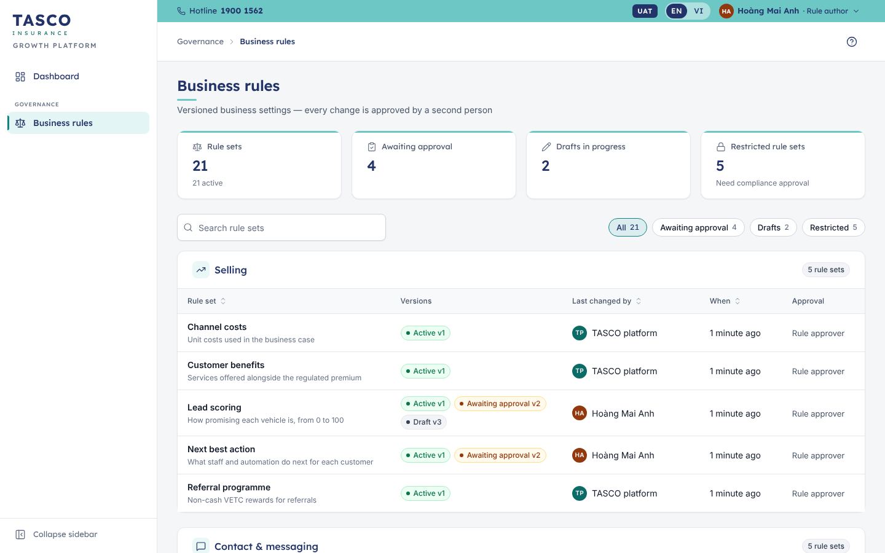{width=16cm}

## Author a change

1. Open the rule set and select **Create draft from this version** on the active version. A new draft opens; if you already have one, **Open my draft** takes you to it.
2. Edit the settings in the form. Each rule set has its own form, with sliders and number fields for weights and thresholds, tables for decision rules, switches for flags and text fields for message wording. One-line help sits under each field.
3. Watch **What changes** on the right. It lists every difference from the active version in business words, for example "Hot lead threshold: 70 → 68".
4. Select **Validate**. Problems are explained next to the field in plain language. For message and script wording, the copy guard checks for banned phrases such as discount claims. "All checks passed" means the draft can be submitted.
5. Select **Save draft**. A badge reads **Unsaved changes** until you do.

Technical users (administrators and support engineers) also see **Advanced (JSON)**, a technical view of the same settings. Business users do not need it.

## Simulate before you submit

For lead scoring, next best action, journeys and benefits, the **Simulation** panel shows the effect of your draft on real customers.

1. Under **Find a customer**, type part of a plate (for example 30E949) or pick one of the suggested customers.
2. Select **Run simulation**. The comparison shows score, tier and next best action before and after the change.
3. Select **Test on 60 customers** to see the effect on a sample across all tiers: how many customers change tier, and the movements between tiers and next best actions.

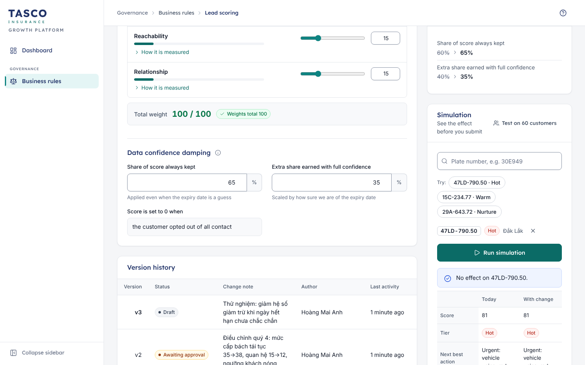{width=16cm}

## Submit for approval

1. Select **Submit for approval**. The draft is validated again.
2. Under **Note for the approver**, explain what changes and why, for example the simulation result. The note is required.
3. Select **Submit for approval** in the dialog.

The workflow stepper moves from **Draft** to **Awaiting approval**, and the approvers see the change in their inbox. While it waits, you can select **Withdraw** to take it back to draft and edit it. You cannot approve your own change.

If the change is rejected, the version shows a red banner with the approver's reason. Select **Create draft from this version** to start a corrected draft.

## Roll back

Open an earlier version (status **Replaced**) from **Version history** and select **Roll back to this version**. This creates a draft with the earlier settings, which goes through approval like any other change.

## Review and approve a change

1. Select **Approvals** in the sidebar. The tiles show **Waiting for you**, **Oldest request**, **Need compliance approval** and **Decided in 30 days**.
2. The **Inbox** tab lists each change with the rule set and version, **Requested by**, **Submitted**, the **Author's note** and the approver needed. Select **Review**.
3. The review drawer shows:
   - a banner about who may decide. "You cannot approve your own change" or "Compliance approval required" appear when you may not decide; otherwise the banner reminds you that approval activates the version at once;
   - what the version replaces and the author's note;
   - **What changes**, in business words;
   - **Effect on customers**, simulated on a sample of about 60 customers (scoring, next best action, journeys and benefits);
   - **Check a specific customer** for a single before-and-after comparison.
4. To approve, select **Approve**, add an optional **Approval note** and select **Approve and activate**. The new version is active immediately for all customers and replaces the previous one.
5. To reject, select **Reject…**, give the **Reason for rejection** (what must change before it can be approved) and select **Reject change**. The change goes back to the author with your reason.

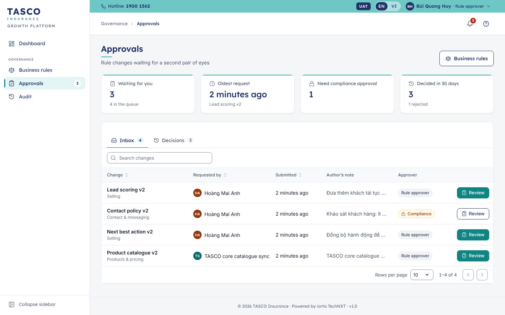{width=16cm}

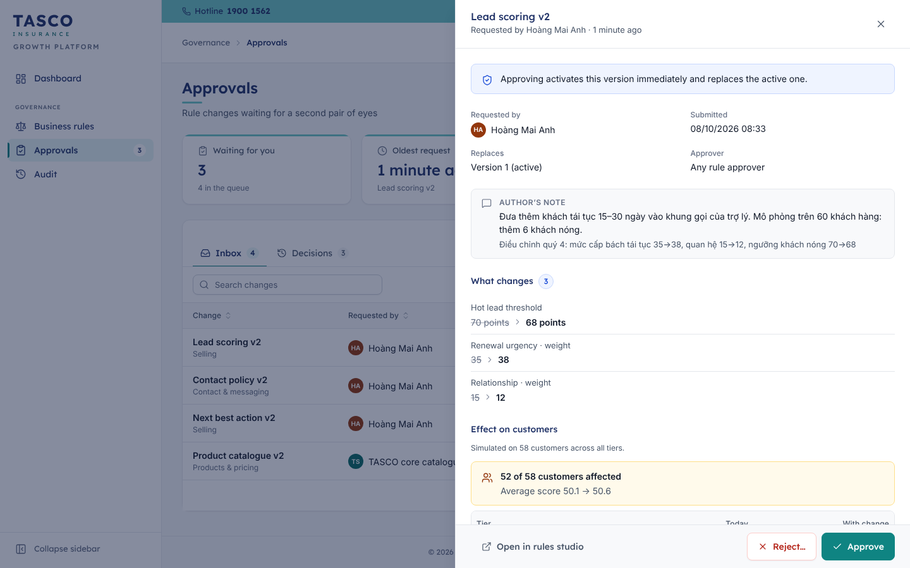{width=16cm}

The **Decisions** tab lists past decisions with the decision, who decided, who requested it, when, the comment and the rule set's current status. **Export CSV** gives the list for governance reporting.

## What to check

- As author: run the simulation and put its result in the note; approvers reject changes without evidence.
- As approver: that the note explains the change, that **What changes** matches the note, and that the effect on customers is what the author expects.
- Message and voice wording: no discount language, the automated-call disclosure kept, plain Vietnamese.

# Compliance officer

## What the role is for

The compliance officer approves the restricted rule sets, watches the voice assistant's compliance figures and reviews the audit trail. The role can open Customer 360 with personal data masked. Two-step verification is required.

## Daily routine

1. Open **Approvals** when the bell or badge shows changes waiting. Restricted changes show the **Compliance** chip.
2. Once a week, review the **Audit** page: voice compliance figures and changes to rules and users.
3. Once a month, complete the checklist under "What to check" below.

## Approve a restricted change

The steps are the same as for any rule approver (see "Review and approve a change" in the Rule author and approver chapter). Restricted rule sets are those where a mistake has legal or regulatory effect:

| Rule set | What to look for |
|---|---|
| Contact policy | Contact hours (08:00 to 20:00), daily and weekly limits, consent needed per channel, which service notices may ignore marketing limits |
| Copy guard | Banned phrases in customer wording, such as discount, rebate or cashback claims on TNDS |
| Access policies | Who may see which customer records (region limits) |
| Partner commission | Rates within the statutory caps |
| Data retention | How long each kind of record is kept |

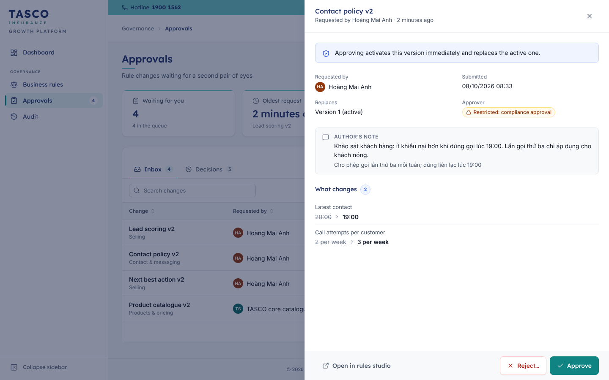{width=16cm}

## Review voice assistant compliance

The **Audit** page opens with an integrity banner and a strip of voice compliance figures:

| Figure | What it means |
|---|---|
| Voice assistant calls | Calls made in the period |
| Disclosed as automated | Share of calls where the assistant announced it is automated at the start (always 100%) |
| Opt-out rate | Customers who asked not to be called |
| Plate verification failures | Calls ended before any offer because the plate did not match |
| Scam concerns raised | Customers who raised a scam concern; the assistant handles these with the trust script |

## Search the audit trail

1. Select **Audit** in the sidebar.
2. Narrow the list with **Person** (or **TASCO platform (automated)**), **Activity type** (Sign-in & access, Customer data, Sales, Rules, Claims, Partners, Administration), **Object** and the date range.
3. Search for a word, a person or an object in the search box.
4. Select a row to open the record. It shows when, the activity type, the person and role, the object (with a link where your role may open it) and a **Before and after** table for changes.
5. Select **Export CSV** to keep the result as evidence.

Each row is a plain sentence, for example "Rule Author submitted Lead scoring v3 for approval". The page shows the latest 500 matching records; narrow the dates to see older activity.

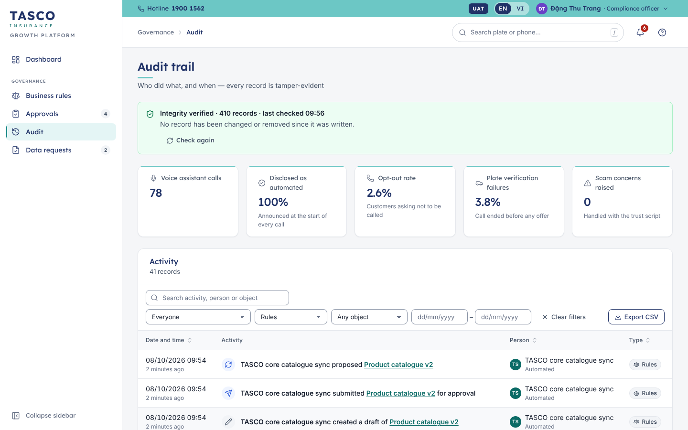{width=16cm}

The integrity banner reads "Integrity verified" with the number of records and the time of the last check. **Check again** re-checks the whole chain. If it ever reads "Integrity check failed", escalate at once to Security and Internal Audit.

## Data subject requests

There is no console screen for data subject access or erasure requests in this release. Customers can download their own data from the Account tab of the customer app (see TGP-MAN-02 Customer App Guide). For any other request, the compliance officer raises it with TASCO IT, who run the export or erasure; each one is recorded in the audit trail as "exported the personal data of…" or "erased the personal data of…". The procedure is to be confirmed by TASCO legal.

## What to check

Monthly checklist:

- Every restricted change approved in the month has a clear author's note and simulation evidence where it applies.
- Opt-out rate and scam concerns: investigate any rise with the campaign manager.
- No rule set approved by the same person who authored it (the console prevents this; the audit trail confirms it).
- Sign-in activity: repeated lockouts or sign-ins at unusual hours.
- Integrity banner shows "Integrity verified".

# Data steward

## What the role is for

The platform keeps one trusted record per vehicle (the golden record), built from VETC accounts, TASCO core, partner files, customer declarations and assistant calls. Each fact carries its source and a confidence level. When sources disagree or a fact is missing, the platform raises a data issue. The data steward works the **Data quality** queue so that sales and journeys run on reliable data. Two-step verification is required.

## Daily routine

1. Open **Data quality**. Check the **Open issues** and **High severity** tiles.
2. Assign today's work: select issues and **Assign**, or take them with **Assign to me**.
3. Resolve high-severity issues first: unreliable expiry dates, customers who say they renewed elsewhere, conflicting phone numbers and plate mismatches from calls.
4. Dismiss issues that need no action, with a reason.

## Read the queue

The type chips above the queue show each issue type with its count, for example **Unreliable expiry date** or **Missing phone**; select one to filter. Each row shows:

| Column | Content |
|---|---|
| Issue | The issue type and its severity chip (High, Medium or Low) |
| Vehicle | Plate and owner (masked where required) |
| Source | Where the record came from and when, for example "VETC account import · 07/10/2026" |
| Age | How long the issue has been open |
| Assignee | Who is working it, or Unassigned |

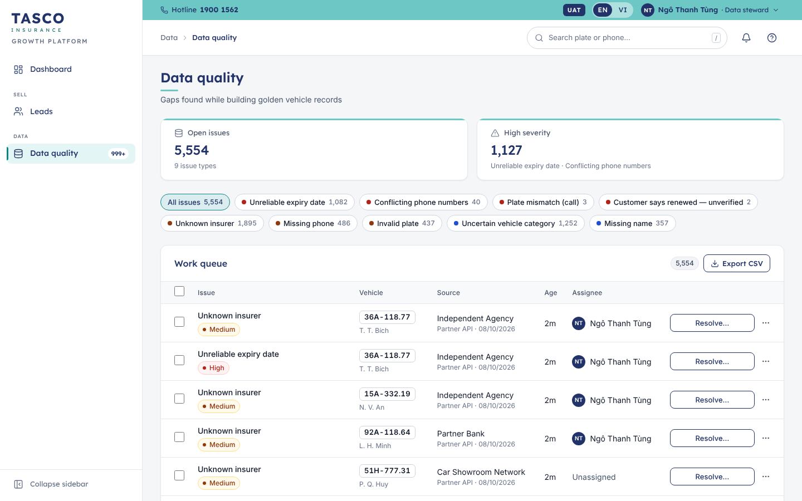{width=16cm}

## Resolve an issue

1. Select **Resolve…** on the row. The drawer opens with the issue, the current values, the data lineage and, for conflicts, **Two sources disagree** side by side.
2. Under **Resolution**, choose how to resolve it. The options depend on the issue type:
   - **Confirm current value**: the value on record is correct; nothing changes.
   - **Correct with evidence**: enter the correct value (expiry date and insurer, vehicle type, phone, name or plate).
   - **Merge duplicates**: choose the **Phone number to keep**; the others are retired.
   - **Keep the verified record** or **Accept the customer's statement** when a customer says they renewed elsewhere.
   - **Dismiss with a reason**.
3. Choose the **Evidence type** (photo of the certificate, confirmation from the insurer, verification call with the owner, inspection record, vehicle registration or TASCO core lookup) and add an **Evidence reference** such as a certificate number or call reference.
4. Select **Resolve issue**.

The issue closes, the golden record is updated, the lead is re-scored and the decision is recorded in the audit trail. **Open Customer 360** in the drawer shows the whole record.

{width=16cm}

## Assign or dismiss several issues

1. Tick the rows, or the box in the header to select the page.
2. Select **Assign** and choose a colleague, or **Dismiss** and choose a **Reason**: False positive, Duplicate of another issue, Vehicle sold or deregistered, Company vehicle handled by the fleet team, or Other reason. Add a **Note** if useful.
3. Review and confirm.

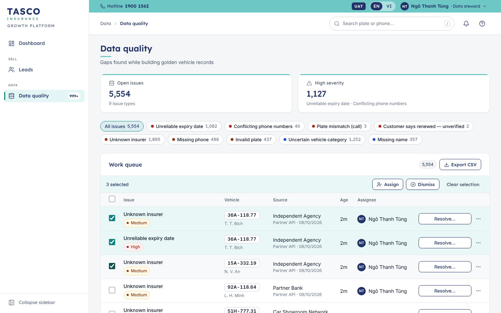{width=16cm}

## Correct an expiry date from Customer 360

When a customer sends a certificate photo outside the queue, open the customer, select **More actions** › **Correct expiry date**, enter the **New expiry date**, the **Current insurer** if known and the **Evidence** (for example "certificate photo sent by the customer"), then **Save correction**. The lead is re-scored at once.

## Data loads

Data from VETC, TASCO core and partner files is loaded through the platform's integrations, not through the console. Each load appears in the audit trail ("imported 1,250 records from VETC account import") and its rejected records appear as issues in the queue.

## What to check

- High-severity issues older than two days.
- On the Dashboard, **Data repair progress**: the share of vehicles with a reliable expiry date should rise week by week.
- A sudden rise in one issue type after a data load: tell TASCO IT, as the source file may be faulty.

# Claims handler

## What the role is for

Customers report accidents in the customer app. Each report arrives in the **Claims** queue. The claims handler acknowledges it, assigns an assessor, records the assessment decision and the payment. The customer follows the progress in the app.

Service levels: acknowledge within 4 hours of the report, decide within 5 days and pay within 3 days of approval.

## Daily routine

1. Open **Claims** (your start page). Check the **Due soon** and **SLA breached** tiles; the bell also warns you two hours before an acknowledgement is due.
2. Acknowledge every new claim in the **To acknowledge** view.
3. Move each claim in assessment to its next step.
4. Record payments for approved claims.

## Read the queue

The tiles show **Open claims** (with the number awaiting acknowledgement), **Due soon**, **SLA breached** and **Paid this month**. The chips **All**, **To acknowledge**, **In assessment**, **Awaiting payment** and **Closed** filter the queue.

Each row shows the claim reference, the vehicle and owner, the incident date and product, a summary, the status chip with its SLA chip, and the **Next step** button.

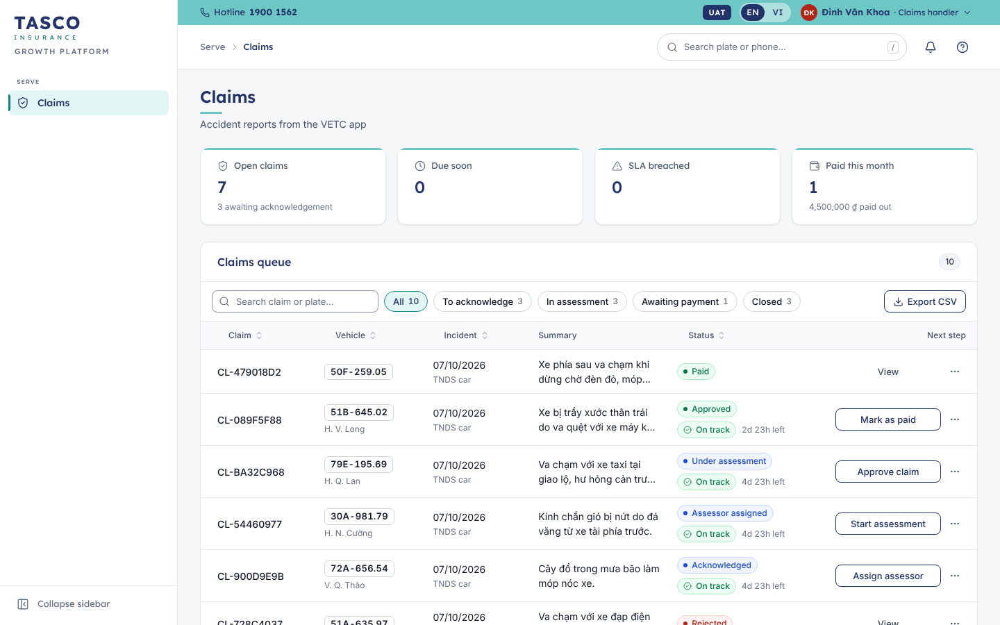{width=16cm}

## Move a claim through its steps

The **Next step** button always names the next action:

| Status | Next step | What you enter |
|---|---|---|
| Submitted | **Acknowledge** | Nothing; the customer is told the claim was received |
| Acknowledged | **Assign assessor** | **Assessor** full name, optional note |
| Assessor assigned | **Start assessment** | Nothing |
| Under assessment | **Approve claim** | **Approved amount (₫)** after deductible, optional note |
| Approved | **Mark as paid** | **Payment reference** (bank transfer or VETC wallet transaction), optional note |
| Paid or Rejected | **View** | Read-only |

1. Select the **Next step** button on the row, or open the claim and use the button at the foot of the drawer.
2. If the step needs details, fill them in and select **Review**, then check the summary.
3. Confirm, for example with **Acknowledge** or **Confirm approval**.

The status chip changes, the toast confirms the step and the customer sees the new stage in the app.

{width=16cm}

## Reject a claim

A claim can be rejected while it is submitted, acknowledged or under assessment.

1. Select **Reject claim** in **More actions**, or at the foot of the claim drawer.
2. Choose the **Rejection reason**: Not covered by the policy, Outside the policy period, Missing documents, Suspected fraud, Duplicate of an existing claim, or Other reason.
3. Write the **Explanation for the customer** (at least 10 characters).
4. Review and select **Confirm rejection**.

## Read a claim

Select a row to open the claim drawer.

| Tab | Content |
|---|---|
| Overview | **Progress** (each step with who did it and when, the assessor, approved amount and payment reference), **What happened** (full description, incident date, location, report time, current SLA) and **Photos** sent from the app |
| Policy & customer | Product, certificate and policy numbers, policy period, premium and sales channel; plate, owner, province, vehicle type and owner type |
| Notes | Internal notes, visible to staff only. **Add note** to keep colleagues informed. |
| History | Every status change and note in time order |

{width=16cm}

## What to check

- Nothing in **SLA breached**.
- The approved amount matches the assessor's report before you confirm.
- Rejections always carry a clear explanation for the customer.

# Partner manager

## What the role is for

Partners such as banks, car showrooms, insurance agents, fleets and inspection centres sell TASCO cover through the Partner API. The partner manager onboards partners, issues and revokes their API keys, suspends or reactivates them and provides commission statements. The technical integration is described in TGP-MAN-03 Partner API Integration Guide. TASCO's own Tasco360 partner app can connect as an API consumer in the same way.

## Daily routine

1. Open **Partners**. Check **Active partners**, **Policies this month**, **Commission this month** and **Active API keys**.
2. Answer partner requests: new keys, statements, suspensions.
3. Each month, send or confirm commission statements.

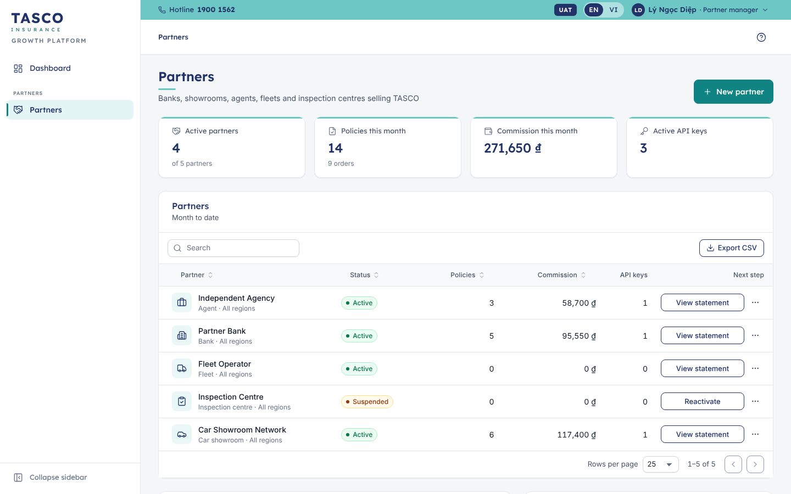{width=16cm}

## Onboard a partner

1. Select **New partner**.
2. Enter the **Partner name** (legal or trading name), the **Partner type** and the **Operating region**.
3. Tick **Issue an API key after creating** if the partner is ready to connect.
4. Select **Create partner**.

## Issue an API key

1. On the partner's row, open **More actions** › **Issue API key** (active partners only).
2. Under **Access**, choose what the key may do: **Quote**, **Purchase (create orders)** and **Read policies & statement**.
3. Choose the **Key lifetime**: 90 days, 180 days, 1 year or 2 years.
4. Select **Issue key**.
5. The **New API key** dialog shows the key once. Copy it, select **I have copied the key**, and send it to the partner over a secure channel.

TASCO stores only a fingerprint of the key, so a lost key cannot be shown again: issue a new one and revoke the old. Issue separate keys for the sandbox and for production.

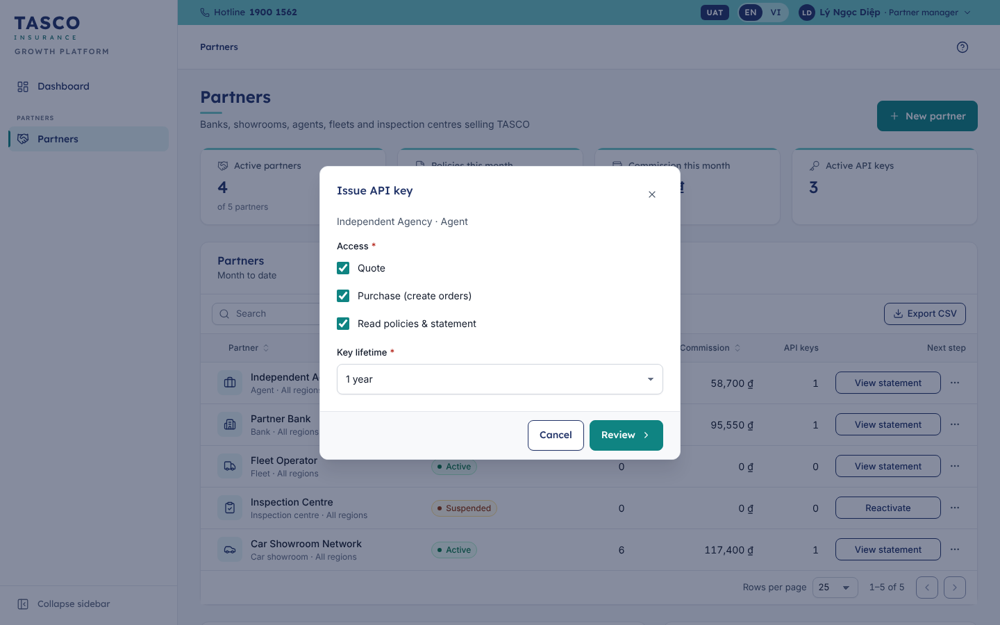{width=16cm}

## Revoke a key, suspend or reactivate a partner

- To revoke a key, open **More actions** › **Manage API keys**, find the key by its identifier and select **Revoke**. Systems using it are refused immediately.
- To stop a partner trading, select **More actions** › **Suspend**. The partner cannot quote or create orders until you select **Reactivate**.

## Commission statements

1. Select **View statement** on the partner's row.
2. Choose the period: **This month**, **Last month**, **This quarter** or **Year to date**.
3. The statement shows **Orders**, **Policies**, **Premium collected** and the commission per order and product, with the rate, subtotal and total.
4. Select **Export CSV** to send it to the partner or finance.

Partners can fetch the same statement themselves through the API.

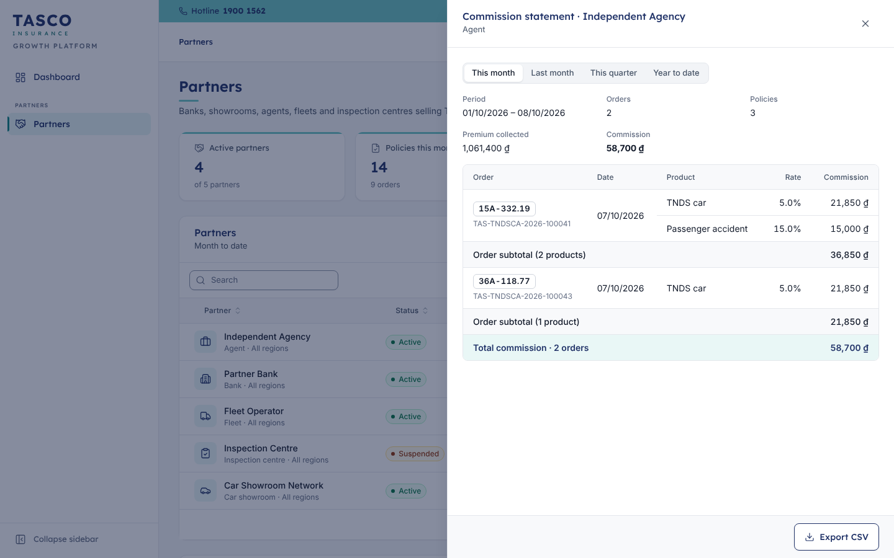{width=16cm}

## What to check

- Keys close to expiry: issue a replacement before the old one expires.
- Partners with keys but no sales: their integration may be stuck.
- Commission rates in the statement match the partner agreement; rate changes go through the **Partner commission** rule set and compliance approval.

# Administrator and support

## What the role is for

The administrator manages staff accounts and roles and has read access to operations, the audit trail and the rules. The support engineer looks after the platform's integrations and background jobs. For separation of duties, an administrator cannot also hold a business role such as rule author, approver, data steward, telesales or partner manager, and does not see customer personal data. Administrators need two-step verification.

Incident handling, monitoring and configuration are described in TGP-OPS-01 Runbook and Support Guide.

## Daily routine

- Administrator: review **Users** for locked accounts and pending two-step set-ups; process joiners, movers and leavers.
- Support engineer: open **Operations**; check integration health, failed jobs and the event backlog.

## Manage users

The **Users** page shows **Active users**, **Two-step verification on**, **Locked out** and **Disabled**. The chips **All**, **Active**, **Locked**, **Disabled** and **MFA setup pending** filter the list. Each row shows the user, roles, region, two-step status, last sign-in, status and the next step.

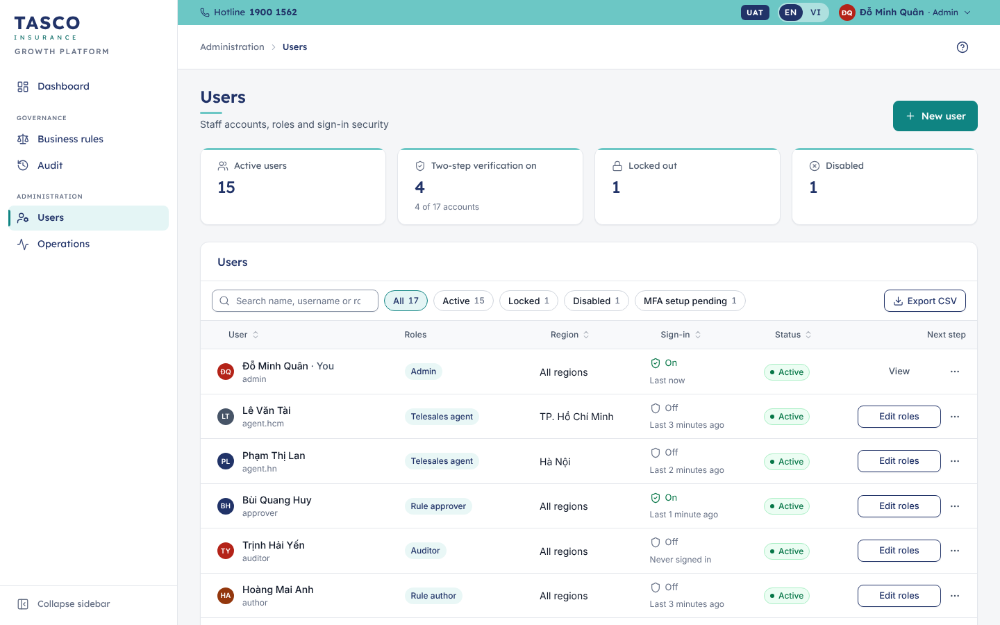{width=16cm}

### Create a user

1. Select **New user**.
2. Enter the **Full name** and the **Username** (lower-case letters, digits, dots or dashes).
3. Choose the **Roles**. If two roles may not be held by one person, a **Separation of duties** message names the pair. Roles that need two-step verification show "Required for the selected roles".
4. Choose the **Data region**, which limits which customers the user can see.
5. Select **Create user**.
6. The **Temporary password** dialog shows the password once. Copy it, select **I have copied it** and give it to the user over a separate channel. The user must change it at first sign-in.

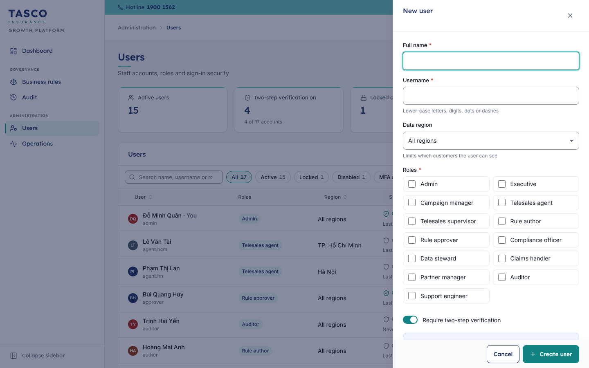{width=16cm}

### Change roles, unlock, reset or disable

Use the row's primary action or **More actions**:

| Action | Effect |
|---|---|
| **Edit roles** | Change roles and region. Open sessions are signed out so the new access applies at once. You cannot change your own roles. |
| **Unlock** | A locked user can sign in again straight away |
| **Reset two-step verification** | The user sets up the authenticator app again at next sign-in, for example after losing a phone |
| **Reset password** | Creates a temporary password, shown once; the user must change it at sign-in |
| **Disable** / **Enable** | A disabled user is signed out and cannot sign in until enabled |

For a leaver, disable the account on the last working day. For a mover, edit the roles and region; never share accounts.

## Monitor operations

1. Select **Operations** in the sidebar.
2. The tiles show **Integrations operational** (for example "8 of 9"), **Failed jobs (24 h)**, **Events waiting** and **Audit records**.
3. **Integration health** has one card per integration: TASCO core rating, TASCO product catalogue, policy issuance, VETC wallet, TASCO payment gateway, voice assistant, app push, Zalo ZNS and SMS brandname. Each card shows the status (**Operational**, **Recovering** or **Outage**), the mode (**Live** or **Simulated**), latency, last call and when it was checked. The rating card also shows the **Rating source** and the catalogue card the **Last sync**.
4. **Background jobs** lists each job with its schedule, last run and next run.
5. **Event backlog** shows events waiting, processed and in the dead letter. **Active rule versions** lists the version in force for each rule set.

Select **Refresh** to reload the page.

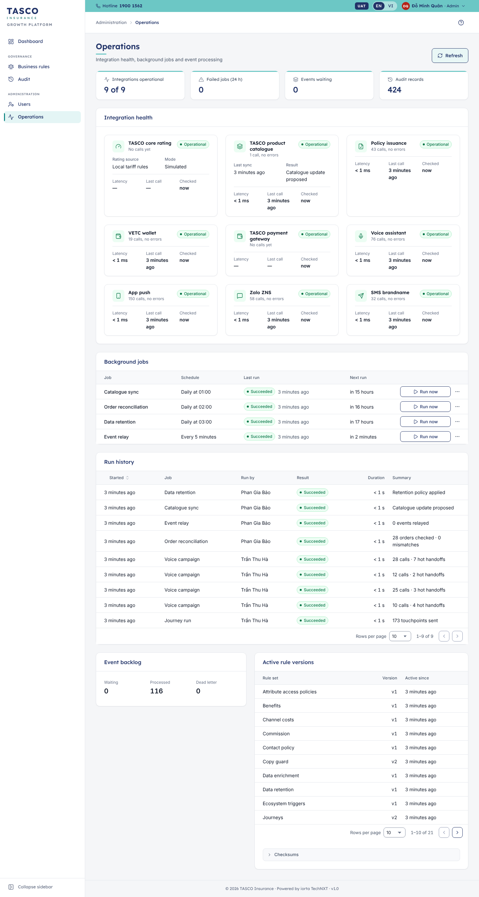{width=16cm}

| Job | Schedule (Vietnam time) | What it does |
|---|---|---|
| Catalogue sync | Daily at 01:00 | Compares the product catalogue with TASCO core and proposes changes for approval |
| Order reconciliation | Daily at 02:00 | Checks orders against payments and policies and reports mismatches |
| Data retention | Daily at 03:00 | Applies the data retention policy |
| Event relay | Every 5 minutes | Delivers pending platform events |

## Run a job by hand

Support engineers and administrators can run a job outside its schedule, for example after an integration outage.

1. On the job's row, select **Run now**.
2. Read the confirmation: the job runs against live data and is recorded in the audit trail. Confirm.
3. The toast reports "Job finished". **View history** lists each run with the start time, who ran it (Scheduler or a staff member), result, duration and summary.

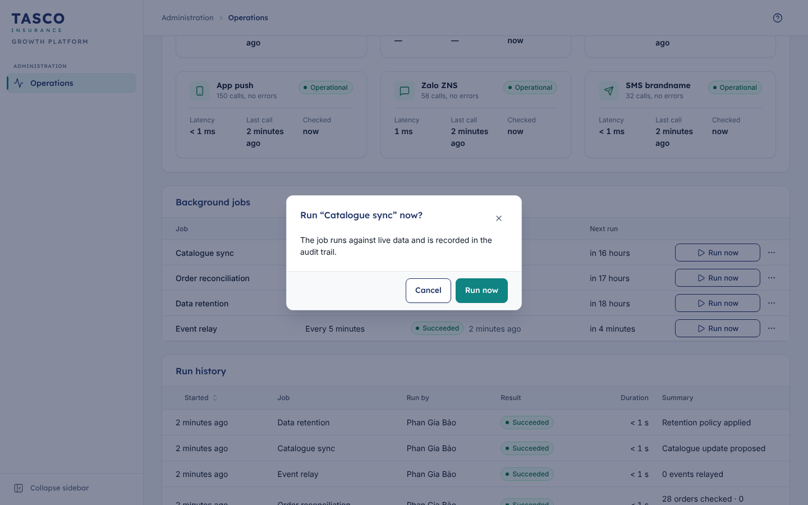{width=16cm}

## What to check

- Any integration not **Operational**: follow TGP-OPS-01 Runbook and Support Guide.
- Failed jobs and dead-letter events.
- Accounts locked repeatedly, and accounts not used for 90 days.

# Auditor

## What the role is for

Internal audit reviews who did what and when. The auditor reads the audit trail with technical details, the business rules and their version history, and the Dashboard. The role cannot change anything.

## Daily routine

There is no fixed routine. Typical reviews are monthly sign-in activity, all rule changes in a period, changes to user roles, and claim decisions.

## Review the audit trail

1. Select **Audit** in the sidebar. The integrity banner shows whether the chain of records is intact.
2. Filter by **Person**, **Activity type**, **Object** and dates, or search.
3. Select a record. As an auditor you also see **Technical details**, collapsed by default: the record ID, action code, object and actor references, the record hash and the previous record's hash, and the raw details. The IP address is shown for sign-in events.
4. **Export CSV** keeps the filtered list as working-paper evidence.

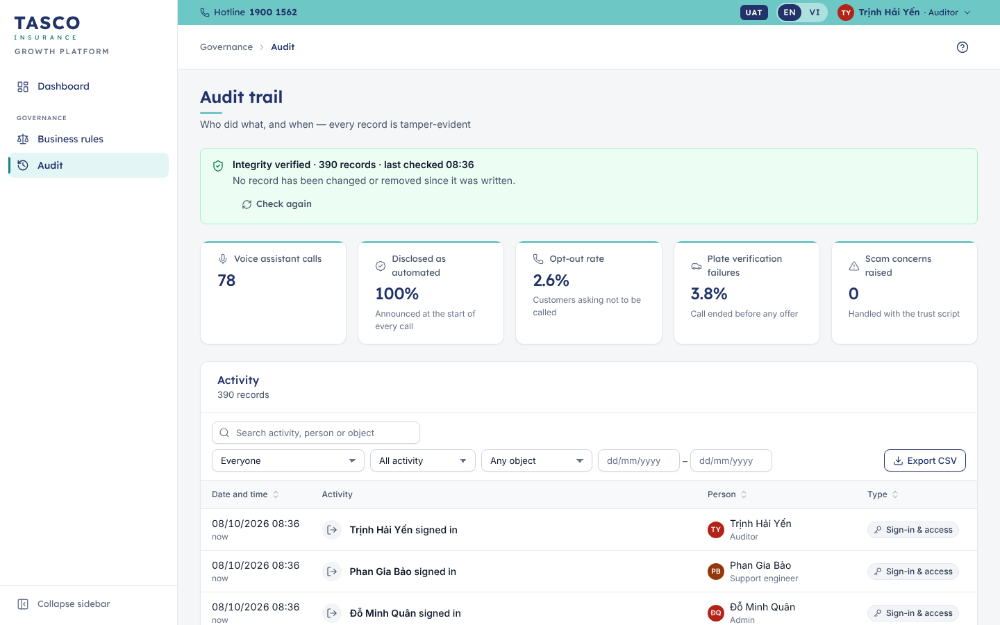{width=16cm}

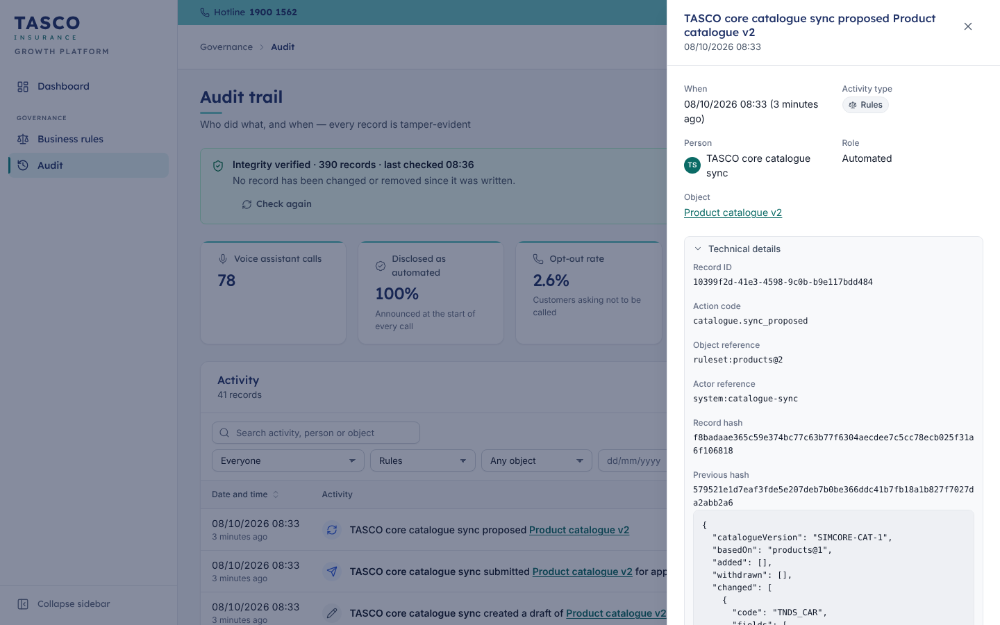{width=16cm}

## Review sign-in activity

Choose **Sign-in & access** under **Activity type**. Records show successful sign-ins, wrong passwords, unknown usernames, lockouts, unlocks, password resets and two-step verification resets.

{width=16cm}

## Review rule versions

Open **Business rules** and any rule set. **Version history** lists every version with its status, change note, author and last activity. The **Workflow** card of a version shows who drafted, submitted, approved or rejected it, with comments and times. Compare with the audit trail filtered to **Rules**.

## What to check

- Integrity verified.
- Every active rule version approved by someone other than its author.
- Role changes for administrators and approvers backed by a request.
- Claim approvals and payments within the approver's authority.

# Troubleshooting and support

## Common problems

| Problem | Likely cause | What to do |
|---|---|---|
| "Incorrect username or password." | Typing error, Caps Lock, wrong account | Check and try again. Five failures lock the account for 15 minutes. |
| "Your account is temporarily locked…" | Five failed attempts | Wait 15 minutes or ask an administrator to unlock it |
| "Too many attempts. Please wait a moment and try again." | Many sign-in attempts from the same computer | Wait a minute |
| "Incorrect code. Check the 6 digits and that your phone's clock is correct." | Old or mistyped code, or the phone clock is wrong | Use the newest code; set the phone's time to automatic |
| "This code has already been used…" | Each code works once | Wait for the next code (up to 30 seconds) |
| "Your sign-in session expired. Please sign in again." | More than 5 minutes on the code step | Start again from the password |
| A QR code appears although you set up the app before | An administrator reset your two-step verification | Scan the new code and remove the old entry from the app |
| Lost or replaced phone | | Ask an administrator to reset your two-step verification |
| "Session expired — please sign in again" | The 30-minute session ended | Sign in again |
| A page is missing from the sidebar, or "You do not have access to this page." | Your role does not include it | Ask your manager to request a role change |
| Names or phone numbers are masked | Your role may not see personal data | Expected |
| A customer outside your region cannot be opened | Region limits | Expected; ask your supervisor to reassign |
| "… was modified by someone else" | Another user changed the same record | Reload the page and repeat your change |
| "Quote expired — please re-quote" | Quotes are valid for 24 hours | Calculate the price again |
| "Upstream service unavailable" | TASCO core, the VETC wallet or a messaging provider is temporarily down | Try again later; nothing was completed. Report it if it lasts. |
| The page looks wrong or blank | Browser cache or an unsupported browser | Reload with Ctrl+F5; use a supported browser |

## Getting help

1. Select **Help** in the top bar for a short explanation of the page.
2. Ask your team champion, trained during roll-out, for "how do I…" questions.
3. Contact the service desk for access, lockouts and errors. Give the error reference (for example "Ref. 7F3C2A1B"), the page, the time and what you were doing. Never put customer personal data in a ticket; use the plate only.

The hotline 1900 1562, info@baohiemtasco.vn and baohiemtasco.vn shown in the console are TASCO Insurance's customer channels. Give them to customers who ask how to reach TASCO.

## Responsible use

- Use only your own account. Never share passwords or authenticator codes.
- Open customer records only when your work needs it.
- Do not copy customer data into spreadsheets, chat apps or e-mail, except exports your role needs and your manager approves.
- Never take payment, payment details or OTP codes by phone.
- Report a suspected security or privacy incident to the service desk at once.

# Appendix

## Role and permission summary

| Role | Main pages | Personal data | Two-step |
|---|---|---|---|
| Executive | Dashboard | No | No |
| Campaign manager | Dashboard, Leads, Customer 360, Voice assistant, Journeys, Campaigns, Telesales inbox (read), Business rules (read) | Masked | No |
| Telesales supervisor | Dashboard, Leads, Customer 360, Telesales inbox (all in region, reassign), Voice assistant | Yes | No |
| Telesales agent | My work today, Leads, Customer 360, Telesales inbox (own and unassigned in region), Voice assistant | Yes | No |
| Rule author | Dashboard, Business rules (draft and submit) | No | No |
| Rule approver | Dashboard, Business rules, Approvals, Audit | No | Yes |
| Compliance officer | Dashboard, Business rules, Approvals (including restricted), Audit, Customer 360 | Masked | Yes |
| Data steward | Dashboard, Data quality, Leads, Customer 360 (correct expiry) | Yes | Yes |
| Claims handler | Claims, Customer 360 | Masked | No |
| Partner manager | Dashboard, Partners | No | No |
| Administrator | Dashboard, Users, Operations, Audit, Business rules (read) | No | Yes |
| Support engineer | Operations | No | No |
| Auditor | Dashboard, Audit (with technical details), Business rules (read) | No | No |

Pairs of roles one person may not hold: administrator with any business role (rule author, rule approver, compliance officer, data steward, telesales agent, telesales supervisor, campaign manager, partner manager); rule author with rule approver; rule author with compliance officer.

## Page names in Vietnamese

| English | Tiếng Việt |
|---|---|
| Dashboard | Tổng quan |
| Leads | Khách hàng tiềm năng |
| Telesales inbox | Hộp việc telesales |
| Voice assistant | Trợ lý gọi tự động |
| Journeys | Hành trình |
| Campaigns | Chiến dịch |
| Claims | Bồi thường |
| Partners | Đối tác |
| Data quality | Chất lượng dữ liệu |
| Business rules | Quy tắc nghiệp vụ |
| Approvals | Phê duyệt |
| Audit | Nhật ký kiểm toán |
| Users | Người dùng |
| Operations | Vận hành |
| Customer 360 | Khách hàng 360 |

## Glossary of status names

### Telesales handoffs

| Status | Tiếng Việt | Meaning |
|---|---|---|
| New | Mới | Waiting for a first call |
| In progress | Đang xử lý | An agent selected Call customer and owns the handoff |
| Callback | Hẹn gọi lại | The customer asked to be called at an agreed time |
| Won | Thành công | The customer agreed and pays in the app (final) |
| Lost | Không thành công | No sale, with a reason (final) |

### SLA chips

| Chip | Meaning |
|---|---|
| On track | More than the warning window left (30 minutes for handoffs; 1 hour for claim acknowledgement; 24 hours for claim decision and payment) |
| Due soon | Inside the warning window |
| Breached | Past the deadline; the chip shows how long ago |

### Claims

| Status | Meaning |
|---|---|
| Submitted | Reported by the customer in the app |
| Acknowledged | Received by TASCO; the customer has been told |
| Assessor assigned | A field assessor is named |
| Under assessment | The assessor is assessing the damage |
| Approved | Approved with an amount; awaiting payment |
| Paid | Payment recorded with a reference (closed) |
| Rejected | Rejected with a reason explained to the customer (closed) |

### Rule versions

| Status | Meaning |
|---|---|
| Draft | Being edited by its author |
| Awaiting approval | Submitted; waiting for a second person |
| Active | In force for all customers |
| Replaced | Was active; replaced by a newer version |
| Rejected | Returned to the author with a reason |

### Leads, journeys and calls

| Term | Meaning |
|---|---|
| Hot, Warm, Nurture | Lead tiers: score 70 or more, 45 or more, below 45 |
| Scheduled, Done, Skipped, Cancelled | Touchpoint status; a skipped touchpoint shows why |
| Hot handoff to telesales | Call outcome: the customer wants an advisor |
| Link sent | Call outcome: a renewal link was sent to the app or Zalo |
| Call back later, No answer | Call outcomes for a later attempt |
| Already renewed elsewhere | The customer says they renewed with another insurer (becomes a data issue) |
| Opted out | The customer asked not to be contacted |
| Plate mismatch, Wrong person, Not verified | The call ended before any offer |
| Scam concern | The customer raised a trust concern |

### Data issues

| Term | Meaning |
|---|---|
| High, Medium, Low | Severity of the issue |
| Confirmed current value, Corrected, Merged duplicates, Dismissed | How the issue was resolved |

### Partners, keys, users and integrations

| Term | Meaning |
|---|---|
| Active, Suspended | Partner may or may not trade through the API |
| Active, Revoked | API key status; each key also shows its expiry date |
| Active, Locked, Disabled | User status; Locked clears after 15 minutes or on unlock |
| On, Setup pending, Off | Two-step verification status of a user |
| Operational, Recovering, Outage | Integration health |
| Live, Simulated | Whether an integration calls the real system or the sandbox |
