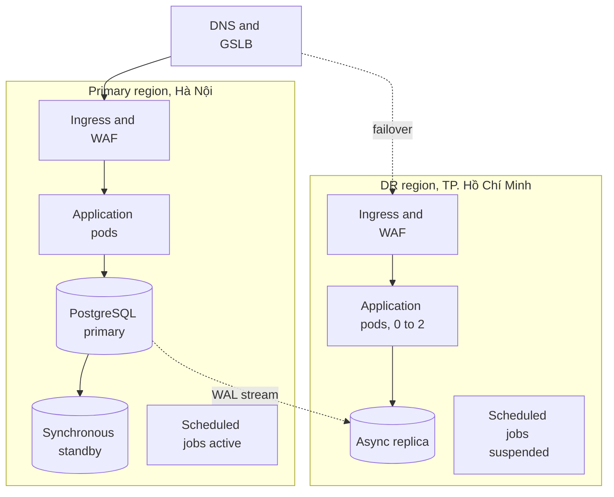
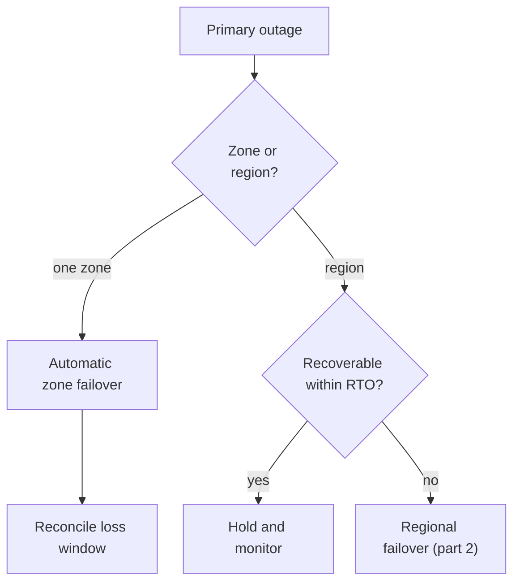
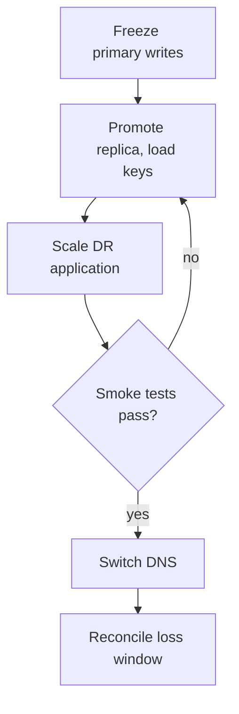

# Introduction

This plan describes how the TASCO Growth Platform is recovered after a disaster and how the business keeps selling and serving customers when the platform or one of its dependencies is unavailable. It sets the recovery targets, the backup strategy, the DR topology, the failover and failback procedures, the DR tests and the continuity actions for partner outages.

It covers the stateless application tier, the PostgreSQL database, secrets and keys, configuration, scheduled jobs, ingress and DNS, and the monitoring stack. VETC systems, TASCO core, Zalo, the SMS provider and the voice vendor have their own DR plans; this plan covers their unavailability and the platform's dependency on them, with particular attention to TASCO core, which prices every quote and issues every policy. The hosted UAT on Railway is not covered.

The audience is the TASCO Head of IT, who is accountable, SRE and the DBA, who carry out the procedures, and the TASCO business continuity team.

Related documents:

- TGP-OPS-01 Runbook and Support Guide (incident procedures RB-01 to RB-18).
- TGP-OPS-02 Monitoring and Alerting.
- TGP-OPS-04 Production Readiness Checklist.
- TGP-ARC-05 Deployment and Infrastructure Architecture.
- TGP-ARC-02 Integration Architecture.

The hosting provider and regions are confirmed in discovery. This plan assumes two regions in Vietnam, a primary in Hà Nội and a secondary in TP. Hồ Chí Minh, to meet data-localisation expectations for Vietnamese personal data (Decree 53/2022/ND-CP and the PDP Law; to be confirmed by TASCO legal).

## Facts that make recovery simpler

- All state is in PostgreSQL: profiles, leads, touchpoints, messages, quotes, orders, policies, every rule set version, the event outbox and the hash-chained audit log. Application pods hold only disposable state (rate-limit buckets, the token revocation list and a 15-second rule cache).
- Events are written in the same database transaction as the change, so after a restore the relay processes pending events again. Subscribers are idempotent, with the exceptions listed in RB-06.
- Encryption keys are part of the backup set. A database backup cannot be read without every `DATA_KEYS` key ID ever used and the `BLIND_INDEX_KEY`. The keys live in the vault, replicated to the DR region.

# Recovery targets

## Commitments

| Measure | Target |
|---|---|
| Availability of the customer purchase path | 99.9 % per month |
| Recovery point objective | 15 minutes or less |
| Recovery time objective | 4 hours or less |
| Backups | Encrypted; point-in-time recovery for 35 days; restore tested quarterly |
| Application | At least two replicas across zones; rolling deployments; disruption budgets |

## Business impact analysis

| Business service | Impact of an outage | Tolerable downtime | Tier |
|---|---|---|---|
| Customer renewal and purchase (quote, pay, issue, e-certificate) | Lost premium on expiry day; customer trust; the customer may drive uninsured | 4 h | 1 |
| Quote pricing by TASCO core | No bindable price, so no new sale (core-only mode) | 4 h, dependent on TASCO core | 1 (dependency) |
| Certificate verification by QR | Customers cannot prove cover at roadside or inspection | 4 h | 1 |
| Partner API | Partner sales stop; contractual penalties | 4 h | 1 |
| Telesales console and handoffs | Hot leads go cold; agents idle | 8 h | 2 |
| Journeys and messaging | Reminders delayed by a day; recoverable on the next run | 24 h | 2 |
| Claims first notice of loss | Customers use the TASCO hotline | 24 h | 2 |
| Rules studio, data quality, ingestion, catalogue sync | Changes deferred; ingestion and sync re-runnable | 72 h | 3 |
| Dashboards | Management reporting delayed | 72 h | 3 |
| Audit trail integrity | Regulatory evidence | No loss of committed entries within the RPO | 1 (data) |

## Targets by tier

| Tier | RTO | RPO | Mechanism |
|---|---|---|---|
| 1 | 1 h for a zone failure (automatic); 4 h for a region loss (declared) | 0 for a zone failure; 15 minutes or less for a region loss (design aim 5 minutes) | Multi-zone PostgreSQL with a synchronous standby; asynchronous cross-region replica; continuous WAL archiving |
| 2 | 8 h | 15 minutes or less | Same database; journeys catch up on the next run |
| 3 | 72 h | 24 h or less | Same database; ingestion re-run from source extracts |

Secrets and keys: RTO 1 hour, RPO 0 (replicated vault). Monitoring: RTO 24 hours, rebuilt from code; loss of metric history accepted.

# Backups

| Asset | Method | Frequency | Retention | Location | Verified by |
|---|---|---|---|---|---|
| PostgreSQL | Managed point-in-time recovery: continuous WAL archiving and a daily base backup | Continuous; daily at 01:00 | 35 days; monthly snapshot for 12 months; yearly for 10 years (orders, certificates and audit log kept 3,650 days) | Primary region and a cross-region copy | Weekly automated restore (DR-T1 light) |
| Audit chain head | Export of the latest sequence and hash | Nightly | 10 years | WORM bucket | Compared with audit verification |
| Secrets and keys (`JWT_SECRET`, all `DATA_KEYS` IDs, `BLIND_INDEX_KEY`, database and partner credentials including the TASCO core client secret) | Vault with replication and two-person sealed escrow | On change | All versions of `DATA_KEYS` kept indefinitely | Vault in both regions and escrow | Key recovery drill (DR-T5) |
| Configuration and infrastructure code | Git (`deploy/k8s`, `Dockerfile`, CI) | On commit | Indefinite | Git hosting and a mirror | Rebuild drill (DR-T4) |
| Container images | Registry with immutable tags (version and commit) | On release | Last 20 releases | Replicated to the DR region | Pull test in DR |
| Rule sets and product catalogue | Inside PostgreSQL (all versions); defaults in `config/rules` | — | — | Covered by the database backup | Checksums against the change log |
| Source extracts | Landing bucket | Per delivery | 365 days | Primary and DR | Re-import test |

Backups are encrypted at rest by the provider. Personal data inside them is also encrypted at field level (AES-256-GCM), so a restore needs the application keys.

# DR topology

The DR region runs as a warm standby: an asynchronous database replica, a scaled-down application and suspended scheduled jobs.

| Element | Primary | DR (warm standby) |
|---|---|---|
| Application | At least 3 replicas across 2 zones; disruption budget minimum 2; grace period at least 30 s | 0 to 2 replicas of the same image; scaled up on declaration |
| Database | High-availability primary with a synchronous standby (automatic zone failover) | Asynchronous replica, lag under 30 s (ALR-91), promotable |
| Scheduled jobs | Active, including the nightly catalogue sync | Suspended. Two journey schedulers would contact customers twice |
| Outbound traffic | Allow-listed at VETC, TASCO core, Zalo, SMS and the voice vendor | DR egress addresses registered with every partner in advance |
| Secrets | Vault | Replicated vault, including the TASCO core client credentials and any client certificate |
| DNS | Public names for console, app API, partner API and verification | Failover record, TTL 60 s |

Partner allow-lists are the usual blocker in a real failover. VETC wallet, TASCO core and the SMS provider must allow-list the DR egress addresses before go-live (PRC-DR-04).

# TASCO core dependency

TASCO core is the master for products and rating and issues every policy. It sits outside this plan's recovery scope, but the platform cannot complete a sale without it, so its availability sets the effective recovery time of the purchase path.

| Situation | Platform behaviour | Action |
|---|---|---|
| Core rating down, `RATING_SOURCE=core` (production default) | No quote is created; agents and customers are told to try again shortly. Other services (certificate check, claims, consent, console) keep working | RB-16; pause journeys after 30 minutes (SOP-07) |
| Core rating down, `core_with_fallback` | Indicative quotes from the approved tariff tables; they cannot be paid until re-rated by core | RB-16, then RB-18 to re-rate the backlog |
| Core issuance down | Payment is compensated automatically: issued lines cancelled, full refund | RB-03 and RB-11 |
| Core catalogue down | The active product set in the database stays in force; the nightly sync fails and is re-run later | RB-17 |
| Long core outage | Quotes expire at the earlier of 24 hours and core's own validity, so customers re-quote after recovery | Customer communication through VETC |

When the platform itself fails over to the DR region:

- TASCO core must accept calls from the DR egress addresses, and the token endpoint must be reachable from DR.
- The TASCO core client ID, secret and any client certificate must be present in the DR vault; step 5 of FO-1 checks this.
- The catalogue sync is suspended with the other scheduled jobs and resumed in step 10; a re-run never queues the same proposal twice.
- Orders paid in the data-loss window may already have policies in TASCO core, bound with a core quote reference, but no record in the restored database. Reconciliation in step 10 compares the TASCO core issuance report with platform orders by core quote reference.

Production local rating (`RATING_SOURCE=rules`) is refused at start-up unless `ALLOW_LOCAL_RATING` is set, and needs TASCO's explicit approval. It is not a DR measure.

TASCO core's own recovery targets are recorded in its interface agreement. If they are longer than 4 hours, the purchase path cannot meet its 4-hour target during a core disaster, whatever the platform does.

# Failover and failback

The decision path runs from detection through promotion of the DR database to the DNS switch, with smoke tests as the gate before customers are moved. The first diagram shows the decision, the second the regional failover.

## FO-0 Zone failure (automatic)

1. Managed PostgreSQL fails over to the synchronous standby in 60 to 120 seconds. Readiness returns 503 during the switch (RB-01) and the pool reconnects.
2. Kubernetes reschedules pods to the healthy zone; the disruption budget and autoscaler keep capacity.
3. L2 checks readiness, operations status and integration status, and runs reconciliation for the window. No customer announcement unless degradation lasts more than 15 minutes.

## FO-1 Region loss (declared, RTO 4 hours)

| Step | Time | Action | Owner |
|---|---|---|---|
| 1 | 0:00 | The Incident Commander declares DR after confirming the primary region cannot recover within the RTO (provider status, outage of 30 minutes or more, or loss of the data centre). The TASCO Head of IT or delegate decides | Incident Commander |
| 2 | 0:05 | War room; TASCO and VETC leadership and VETC customer service informed; customer banner | Communications Lead |
| 3 | 0:10 | If the primary is partly alive, freeze its writes: scale its application to 0 and suspend its scheduled jobs | L2 |
| 4 | 0:15 | Promote the DR replica and record the last applied LSN and time: this is the actual RPO | DBA |
| 5 | 0:30 | Confirm the DR vault holds every `DATA_KEYS` ID, `BLIND_INDEX_KEY`, `JWT_SECRET` and the TASCO core client credentials; point `DATABASE_URL` at the promoted instance | SRE |
| 6 | 0:45 | Scale the DR application to the production replica count with `MIGRATE_ON_START=false` | SRE |
| 7 | 1:00 | Smoke tests: readiness (`store` postgres, `db` true), audit verification, staff sign-in with MFA, customer session, home and quote (proves TASCO core rating from DR), certificate check, operations and integration status with all circuits closed | L2 and QA |
| 8 | 1:15 | Switch DNS to DR (TTL 60 s) | SRE |
| 9 | 1:30 | Run the relay; events stuck in processing are re-claimed after 5 minutes, otherwise RB-06 | L2 |
| 10 | 1:45 | Resume scheduled jobs in DR, including the catalogue sync. Reconcile the loss window with the VETC settlement file and the TASCO core issuance report (by core quote reference); work `compensation_failed` and `payment_failed` orders through RB-11 | L2 and TASCO Finance |
| 11 | 2:00 to 4:00 | Monitor the service level objectives; notify partners; issue the DR status report | Incident Commander |

## FB-1 Failback to the primary region (planned)

1. Rebuild the primary-region database as a replica of the DR primary from a fresh base backup. Never reuse the old primary's data files.
2. When lag is under 5 seconds, in a CAB-approved window after 20:00: suspend DR jobs, scale the DR application to 0 (about 10 minutes of outage), promote the primary-region replica, point the secrets at it, scale up, run the step 7 smoke tests, switch DNS back and resume jobs.
3. Rebuild the DR replica from the new primary. Reconcile and verify the audit chain.

## FO-2 Logical corruption (point-in-time recovery)

Used when a bad job, a bad manual statement or a defect corrupts data and the infrastructure is healthy.

1. Stop the source of damage: suspend jobs and, if needed, scale writers down.
2. Restore to a new instance at the moment just before the event.
3. Either cut over fully to the restored instance (loses every write after that moment, so only for a short window), or copy the affected rows from it into production under a change ticket.
4. Verify the audit chain after any repair. Audit rows are never edited; repairs are recorded as new audit entries or in the change ticket.

# DR tests

| ID | Test | Scope | Frequency | Success criteria |
|---|---|---|---|---|
| DR-T1 | Backup restore | Restore to a new PREPROD instance at a random point in the last 7 days; application connects; audit verifies; row counts checked | Weekly automated (light); quarterly full | Restore within 60 minutes; data consistent to the target time (RPO within 15 minutes; design aim 5 minutes) |
| DR-T2 | Zone failover | Database failover and drain of one zone under PERF-S1 load (TC-141, TC-142) | Before G3, then twice a year | Readiness back within 2 minutes; no lost orders; 5xx only during the switch |
| DR-T3 | Region failover drill | Full FO-1 in PREPROD and DR, including quotes priced by TASCO core from DR | Before the scale phase, then yearly | RTO within 4 hours and RPO within 15 minutes; partner and TASCO core calls succeed from DR egress |
| DR-T4 | Rebuild from code | New cluster from infrastructure code, image registry and key escrow | Yearly | Platform running from scratch within 8 hours |
| DR-T5 | Key recovery | Recover all `DATA_KEYS` IDs, `BLIND_INDEX_KEY` and the TASCO core client secret from escrow; decrypt a sample in isolation | Twice a year | Two-person procedure within 1 hour |
| DR-T6 | Vendor outage tabletop | Walk through the continuity scenarios with VETC customer service, the telesales supervisor, TASCO core IT and the voice vendor | Before the pilot, then twice a year | Roles clear; templates approved; contact lists valid |
| DR-T7 | Outbox recovery | Kill pods during relay; recover stuck and dead-letter events through RB-06 | Before G3 | No lost or duplicated customer messages beyond the documented exceptions |

| Window | Tests |
|---|---|
| Test phase, 11 to 22 January 2027 | DR-T1, DR-T2, DR-T5, DR-T6, DR-T7 (G3 evidence) |
| Before the scale phase | DR-T3 |
| Every quarter | DR-T1 full |
| Twice a year | DR-T2, DR-T5, DR-T6 |
| Every year | DR-T3, DR-T4 |

Each test produces a report with the date, scenario, actual RTO and RPO, issues and actions, signed by the TASCO Head of IT.

# Business continuity

| Scenario | Detection | Continuity actions | Customer impact |
|---|---|---|---|
| TASCO core rating outage | ALR-13, ALR-16; RB-16 | Core-only mode: no new quotes; telesales record intent and call back; journeys paused after 30 minutes. Fallback mode: indicative quotes, re-rated after recovery (RB-18) | New purchases delayed |
| TASCO core issuance outage | ALR-84; RB-03 | Stop sales (pause journeys, hide the renewal banner); queue callbacks; failed orders compensated automatically; `compensation_failed` orders worked manually (RB-11) | Purchases delayed; charged customers refunded |
| VETC wallet outage | ALR-10; RB-02 | No other payment method in scope: customers pay only in the official app and staff never take payment. In-app banner; telesales send quotes and call back; journeys paused (SOP-07) | Purchases delayed |
| Voice vendor outage | ALR-10; RB-05 | Stop launching voice campaigns. Through maker-checker, add telesales to the voice step's channels, or raise hot-lead priority for agents. Supervisors add shifts. Digital reminders continue | Fewer proactive calls |
| Telesales unavailable | Supervisor report; ALR-83 | Through a rule change, remove telesales from journey steps and switch the voice bot's hot-lead outcome to sending the renewal link; partner channel unaffected. If no channel remains, suspend journeys (SOP-07) | Hot leads served by self-service link |
| Zalo ZNS or SMS outage | ALR-31; RB-04 | Built-in channel fallback (app push, ZNS, SMS per step); for a long outage, reorder channels through a rule change | Some reminders delayed |
| VETC sign-on or app outage | VETC notice | Signed links through Zalo continue if Zalo is up; telesales assist | Partial |
| Platform total outage | DR declared | VETC customer service scripts; TASCO hotline for claims; partners informed | Per RTO |

L2 keeps a manual workaround register with the approved customer templates (Vietnamese and English), customer service scripts, the partner notice template and the decision log.

## Communication

| Audience | Owner | Channel | Timing |
|---|---|---|---|
| Executives (TASCO Head of IT, Business Owner, VETC IT Lead) | Incident Commander | Phone and email | Within 30 minutes of a Sev 1 or DR declaration, then hourly |
| TASCO core IT | Incident Commander | Core IT bridge | At once for any rating, catalogue or issuance impact, and at DR declaration |
| Staff (telesales, campaign, claims) | Service desk | Teams or Zalo broadcast | Within 30 minutes |
| Customers | VETC customer service and TASCO Marketing (approved templates) | In-app banner, ZNS service message, hotline message | When the purchase path is down for more than 30 minutes |
| Partners | Partner Manager | Partner status email or portal | Within 30 minutes of partner API impact |
| Regulator and data subjects | DPO with Legal | Statutory process | Within legal deadlines for a personal data breach |

A recovery notice goes to all parties at the end, and the post-incident report within 5 business days.

# Plan maintenance

The plan is reviewed after every DR test, every Sev 1 and every architecture change (new region, provider or integration, including changes to the TASCO core interface). Contact lists are checked quarterly. SRE owns the technical procedures, the TASCO Head of IT the impact analysis and tiers, VETC customer service the customer communication, and the Partner Manager the partner communication.
