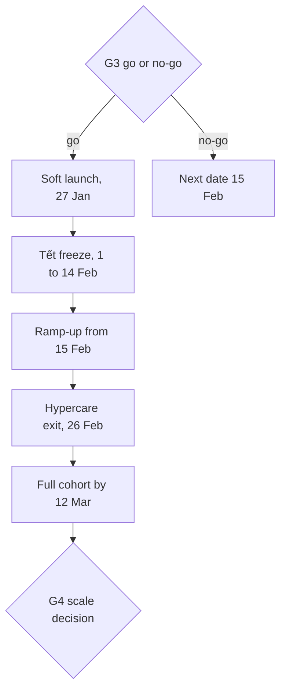
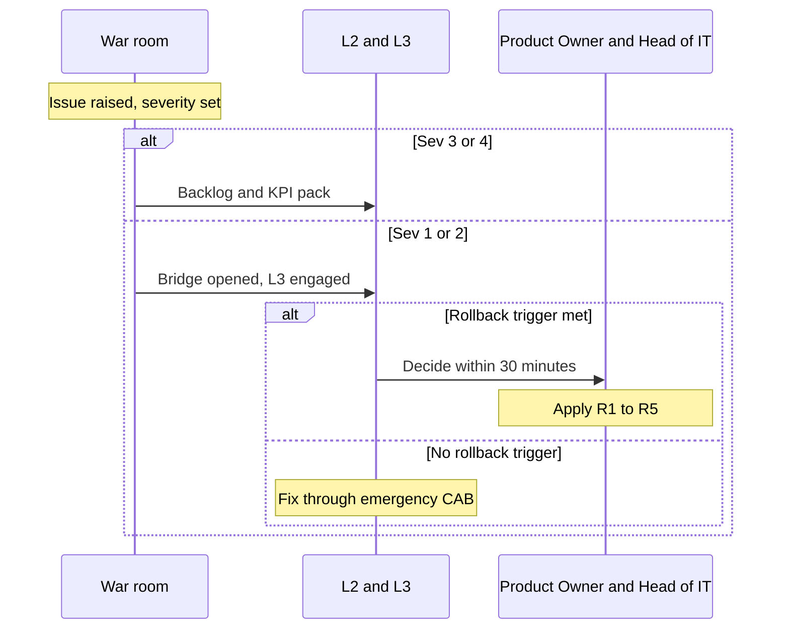

# Introduction

This plan describes how the TASCO Growth Platform goes live for the pilot and how the delivery team supports it in the first weeks. It covers the go or no-go criteria, the cutover schedule, the ramp-up around Tết, the rollback options, hypercare and the hand-over to business as usual.

The plan follows the proposal timeline: work starts on 2 November 2026, the pilot soft-launches in week 13, just before Tết, and four weeks of hypercare end on 26 February 2027 (milestone M4). Dates are indicative until discovery confirms them.

| Milestone | Date |
|---|---|
| G2 build complete (M2 integrated build) | 8 January 2027 |
| SIT, UAT and security testing | 11 to 26 January 2027 |
| G3 go or no-go | Tuesday 26 January 2027 |
| Soft launch (T0) | Wednesday 27 January 2027 |
| M3 acceptance (UAT signed off at G3) | 26 January 2027 |
| Tết change freeze | 1 to 14 February 2027 |
| Ramp-up to the full pilot cohort | From 15 February 2027 |
| M4 pilot live and hypercare complete | 26 February 2027 |
| Pilot read-out and G4 scale decision | Early May 2027 |

The audience is the cutover manager (iorta TechNXT Delivery Lead), the TASCO Product Owner as business go-live owner, the Steering Committee, the CAB and the war room team.

Related documents:

- TGP-OPS-04 Production Readiness Checklist.
- TGP-OPS-01 Runbook and Support Guide and TGP-OPS-06 Release and Change Management.
- TGP-OPS-03 Disaster Recovery and Business Continuity Plan.
- TGP-DEL-01 Project Plan and TGP-DEL-05 Knowledge Transfer Plan.

# Go-live approach

This is a new service: no existing system is replaced, and current renewal reminders continue for the control group. Exposure grows in controlled steps using levers that already exist in the platform.

| Lever | How | Granularity |
|---|---|---|
| Vehicles in the platform | Only the pilot cohort is loaded | Cohort |
| Who journeys target | Journey audience rules (region, category, days to expiry, confidence, tier), changed through maker-checker | Segment |
| Products and channels on sale | Product status and channels in the products rule set; new TASCO core products stay off sale until channels are set | Product and channel |
| Benefits shown | Only approved benefits reach customers; roadmap items stay staff-only; loyalty points stay pending legal review and are never promised | Item |
| Contact intensity | Contact policy caps; voice campaign size | Global |
| Entry points | VETC app banner (VETC side); Zalo menu; assisted sales by telesales (quote sent to the customer's app, never paid by staff); partner keys issued only when the partner is ready | Channel |
| Kill switch | SOP-07: suspend the journeys job; marketing cap 0 through rules | Global |

A percentage roll-out ("10 % of the base") is not possible today because no stable random bucket exists (KI-24). The control group of about 10 % is therefore held out as a list at load time unless KI-24 is fixed first.

The pilot moves from a small soft launch through the Tết freeze to the full cohort, with hypercare across the whole period.

# Go or no-go criteria

| # | Criterion | Evidence | Owner |
|---|---|---|---|
| G-1 | Every P1 item of TGP-OPS-04 is Done or Waived by the Steering Committee | Checklist | Delivery Lead |
| G-2 | UAT accepted overall and by every persona; compliance scenarios passed without waiver | UAT sign-off sheet | TASCO Business Owner |
| G-3 | Security sign-off: no open critical or high penetration test findings | CISO memo | TASCO CISO |
| G-4 | Compliance and legal sign-offs: content inventory, contact policy, tariffs, Zalo templates, privacy notice and DPIA, data-request response time (PRC-COMP-14), quick renewal eligibility rule (PRC-FUNC-09) | Memos | Compliance, Legal, DPO |
| G-5 | Sev 1 and compliance known issues fixed with regression tests passing on the release tag: KI-01, KI-02, KI-09, KI-28, KI-33 (TC-080, TC-134, TC-135, TC-159, TC-162); open Sev 2 issues KI-04, KI-13 and KI-18 fixed or waived with a date | Results workbook; known issues | Dev lead |
| G-6 | Partners ready in production: VETC wallet, sign-on, app deep link and push; TASCO core rating, catalogue and issuance on the confirmed specification with production credentials (PRC-CORE-01 to 04); Zalo; SMS; voice vendor; DR egress allow-listed | Partner confirmations | Integration lead |
| G-7 | Operations ready: on-call live, procedures walked through, dashboards and alerts live, synthetics green for 48 hours in production | Operations sign-off | L2 lead |
| G-8 | Cutover and rollback rehearsed in PREPROD within the planned times | Rehearsal report | Cutover manager |
| G-9 | Pilot cohort loaded in PREPROD from real extracts; counts reconcile | Load report | Data steward |
| G-10 | No open Sev 1 or 2 defects, or Sev 2 waived with a fix date before 15 February | Defect report | QA Lead |

All criteria met: go. One or more unmet with a credible fix within 48 hours: go with conditions, with the soft launch moved to the fix date if it still falls before 1 February. Otherwise no-go; because of the Tết freeze, the next possible soft launch is 15 February.

# Cutover

T0 is Wednesday 27 January 2027 at 08:15, the first scheduled journey run (job `tasco-growth-journeys` at 01:15 UTC).

| When | Activity | Owner | Exit check |
|---|---|---|---|
| T−23 days, Monday 4 January | Production and DR infrastructure built from code; PostgreSQL with high availability, point-in-time recovery and cross-region replica; vault keys; monitoring, dashboards and alerts | SRE, DBA | PRC-DR-01, PRC-OPS-01 |
| T−16 days, Monday 11 January | Release candidate tagged for SIT and UAT; feature freeze (fixes only); provisional CAB approval | Release manager | CAB minutes |
| T−12 days, Friday 15 January | Partner production connectivity: allow-lists for production and DR, credentials in the vault (including TASCO core), Zalo template IDs mapped, SMS brandname live, voice numbers | Integration lead | Connectivity test per partner, no customer traffic |
| T−9 days, Monday 18 January | Production secrets loaded; migration job; rule sets seeded; first catalogue sync from TASCO core reviewed and approved; no demo users or demo settings; named users created with first-sign-in password change and MFA set-up for privileged users | SRE, administrator, rule approver | Readiness shows store `postgres`; integration status shows mode `http`; rule checksums recorded |
| T−6 days, Thursday 21 January | Dress rehearsal in PREPROD: full cutover and rollback, timed; DR-T1, DR-T2 and DR-T7 | Cutover manager | Rehearsal report (G-8) |
| T−4 days, Saturday 23 January, 09:00 to 17:00 | Deploy the release candidate to production through the migration job and rollout; smoke tests; journeys job deployed suspended; soft-launch cohort (about 20,000 vehicles in the pilot provinces, car TNDS, expiry in 15 to 60 days) loaded in batches of 2,000 or fewer | SRE, data steward | Counts reconcile (TC-112); reconciliation clean |
| T−2 days, Monday 25 January, 21:00 | Deploy final UAT fixes as `v1.0.0` (CAB) and repeat the smoke tests | Release manager | Smoke tests pass |
| T−1 day, Tuesday 26 January, 10:00 | Lead recompute; journey audience restricted to the pilot provinces (maker-checker); next day's due touchpoints reviewed per journey and channel; voice campaign limit agreed (200 calls a day or fewer) | Campaign manager, Compliance | Volume sign-off |
| T−1 day, 15:00 | G3 go or no-go at the Steering Committee; final CAB approval | Steering Committee, CAB | Signed decision |
| T−1 day, 18:00 | Final checkpoint: synthetics green 24 hours, no open Sev 1 or 2, on-call staffed, war room booked | Cutover manager | Recorded go or hold |
| T0, 08:00 | War room open; dashboards D1 to D5 on screen; VETC enables the app entry point | All | — |
| T0, 08:05 | Resume the journeys job before its 08:15 run (or run it manually within contact hours on day 1); confirm the relay job is active | L2 | `journey run complete` reviewed |
| T0, 09:00 to 12:00 | Watch the first messages, sessions and orders end to end (TASCO core quote, wallet, issuance, certificate check); first assisted sale; first voice campaign of 50 calls at 10:00 | War room | First order verified by QR |
| T0, 17:00 | Day-1 review of the KPI pack; decide day-2 volume | Product Owner | Minutes |

## Smoke tests after any production deployment

1. Readiness 200 on every pod with store `postgres` and `db` true.
2. Metadata shows demo mode off and the right version.
3. Demo code helper returns 404.
4. Staff sign-in with MFA using a named smoke account.
5. `/metrics` without a token returns 401.
6. Operations status: all circuits closed; rule checksums match the change log; dead letters unchanged.
7. Integration status: rating source as decided, mode `http`, rating and catalogue circuits closed, last catalogue sync succeeded.
8. Audit verification returns `ok:true`.
9. Certificate check for the synthetic test certificate (SYN-02).
10. A compliance officer opens the data-request register; it loads with the 72-hour response time shown.
11. Go-live day only: one real purchase for an internal staff vehicle, paid by its owner in the VETC app, with a core quote reference on the policy and a QR check. TASCO decides whether to keep or cancel it.

# Pilot ramp-up

| Period | Scope | Volume control | Gate to the next step |
|---|---|---|---|
| 27 to 29 January | Car TNDS renewal journey only; app push and ZNS; voice bot up to 200 calls a day; telesales teams in the pilot provinces | About 20,000 vehicles; expiry in 15 to 60 days | Daily KPIs green; no compliance incident |
| 1 to 14 February (Tết freeze) | Run only: no deployments; no rule changes except emergency rollback (RB-10) or the kill switch (SOP-07). Journeys continue at low volume; voice campaigns paused from 5 to 14 February | Same cohort | — |
| From 15 February | Renewal, conquest and lapsed-recovery journeys; SMS fallback on | Rest of the cohort loaded in steps up to 50,000 to 100,000 vehicles by 12 March; voice up to 2,000 calls a day | Weekly pilot review |
| Early May 2027 | Pilot read-out against the control group and G4 scale decision | — | Steering Committee |

# Rollback

## Triggers

Any one trigger leads the Incident Commander to propose rollback; the Product Owner and the TASCO Head of IT decide within 30 minutes.

| Trigger | Threshold |
|---|---|
| Compliance breach | Any marketing outside 08:00 to 20:00, any contact with a DNC customer, any message with banned wording, any call without consent |
| Money without cover | More than 3 orders in a day paid with no policy and not refunded within 24 hours; any confirmed double charge |
| Availability | Purchase path (SLO-01) breached for more than 2 hours, or a Sev 1 open for more than 4 hours |
| Data integrity | Audit chain fails verification; one customer's data shown to another |
| Partner instruction | VETC or TASCO core asks for suspension |

## Levels

| Level | Action | Time to effect | Data impact |
|---|---|---|---|
| R1 Stop outbound contact | SOP-07: suspend the journeys job; stop voice campaigns; marketing cap 0 | Minutes | None |
| R2 Rule rollback | Maker-checker rollback of the faulty rule set (RB-10) | About 15 minutes (two people) | None |
| R3 Application rollback | Redeploy the previous image. Migrations are forward-only and backward-compatible, so the previous version runs on the new schema | 15 minutes or less | None |
| R4 Close entry points | VETC disables the app banner; Zalo menu hidden; partner keys suspended | 1 hour or less | None; open quotes expire within 24 hours |
| R5 Withdraw the pilot | R1 and R4. The platform stays up to serve existing policies (certificate check, claims, data requests), which are never switched off for customers who have bought | 2 hours or less | Policies stay valid; reconciliation completes |
| R6 Data restore | Only for corruption: point-in-time recovery per FO-2 in TGP-OPS-03 | Hours | Writes after the restore point reconciled |

For the first go-live there is no previous version, so R3 is replaced by R1 and R4 while a hotfix is prepared.

# Hypercare

## Organisation

Hypercare runs from the soft launch on 27 January to 26 February 2027, about four weeks, at reduced intensity over Tết. Each later scale-up step has its own four-week hypercare under the scale phase.

| Element | Arrangement |
|---|---|
| War room | TASCO head office in Hà Nội plus a virtual bridge; 08:00 to 20:00 on weekdays in the first week, then virtual |
| Stand-ups | 08:00 (overnight jobs, alerts, KPIs, plan) and 17:00 (day review, decisions) |
| Staffing | iorta TechNXT: tech lead, two developers, QA, SRE (L3 on-call 24 × 7). TASCO: Product Owner, L2 support, compliance analyst, campaign manager, telesales supervisor. VETC: app and customer service liaison. TASCO core IT: named contact for rating and issuance |
| Tết cover | 24-hour on-call for L2 and L3 throughout the freeze; war room on call rather than staffed |
| Change policy | Daily hotfix window at 07:00 (before the journey run) for Sev 1 and 2 fixes through the emergency CAB; rule changes through maker-checker with the Product Owner's agreement |
| Service levels | The severity table in TGP-OPS-01, with L3 engaged directly for Sev 1 and 2 |

## Escalation

Issues raised in the war room are classified by severity; a rollback trigger takes the decision to the Product Owner and Head of IT, everything else goes to a fix through the emergency CAB or the backlog.

## Daily KPI pack

Prepared by 07:45 and reviewed at the 08:00 stand-up.

| Area | Indicator | Source | Action threshold |
|---|---|---|---|
| Journeys | Touchpoints due, done, skipped, deferred and cancelled by journey and channel; top 5 skip reasons | `journey run complete` log | Skipped above 30 % for reasons other than consent: RB-07 |
| Messaging | Sent, failed and blocked by channel | `messages_total` | Any blocked: Compliance (ALR-30) |
| Rating | Quotes priced by TASCO core; unavailable ratio; core p95; indicative quotes open | `rating_requests_total`, `integration_latency_seconds`, `quotes_indicative_total` | Unavailable above 1 % or any indicative quote: RB-16, RB-18 |
| Voice | Calls by outcome; plate verification failures; opt-outs | `voice_calls_total` | Verification failure above 15 %; opt-out above 10 % |
| Telesales | Handoffs created, claimed, won and lost; open over 2 business hours | Handoff list; database series | More than 20 aged handoffs |
| Sales funnel | Quotes and orders by channel and journey; conversion; premium; time from payment confirmation to e-certificate | Metrics; dashboard; VETC analytics | Conversion down 50 % week on week |
| Renewal | Renewals by path (quick renewal or full flow); top reasons customers were not offered quick renewal; median renewal time | Orders; customer app analytics | Median above 60 seconds: review with the Product Owner |
| Integrity | Compensated, `compensation_failed` and `payment_failed` orders; reconciliation mismatches | Metrics; job history | Any: RB-11 (`compensation_failed` is Sev 1) |
| Data | New data quality issues by type; customer-confirmed expiries | Data quality queue; audit | — |
| Reliability | Service level objectives; incidents by severity; alerts; dead letters | Dashboards D1 to D3 | More than 50 % of the weekly error budget used |
| Compliance | Contacts outside hours (must be 0); DNC contacts (0); complaints | RB-07 query; customer service | Any: Sev 1 |
| Privacy | Data requests open, due within 24 hours and overdue | Data-request register | Any overdue: SOP-05 escalation |
| Support | Tickets by tier and category; share resolved at L1 and L2 | ITSM | L3 share above 30 % from week 3 |

## Exit criteria

| # | Criterion |
|---|---|
| H-1 | No Sev 1 for 14 consecutive days and no open Sev 2 |
| H-2 | SLO-01 to SLO-04 met for the last 14 days |
| H-3 | Journeys complete within contact hours every day for the last 10 business days |
| H-4 | Reconciliation clean (no unexplained mismatches) for 10 consecutive days |
| H-5 | L2 resolves at least 80 % of tickets without L3; procedures and known errors updated for every new incident type |
| H-6 | Fewer than 5 non-actionable pages a week |
| H-7 | Fewer than 10 open Sev 3 defects, each with a planned release |
| H-8 | Knowledge transfer sessions for the pilot features completed (TGP-DEL-05) |
| H-9 | Business Owner and TASCO Head of IT sign the hypercare exit |

# Transition to business as usual

| Phase | Duration | Who leads | iorta TechNXT role |
|---|---|---|---|
| Hypercare | To 26 February 2027 | iorta TechNXT in the war room | L3 on-call 24 × 7 |
| Shadow | 2 weeks | TASCO L2 leads | Supports alongside |
| Reverse shadow | 1 week | TASCO L2 alone | On call |
| Business as usual | Ongoing | TASCO L2 | L3 under the managed service |

| Item | Hand-over |
|---|---|
| Support | L2 rota fully TASCO; L3 through the managed service (USD 6,900 per month) with the severity levels in TGP-OPS-01 |
| Monitoring | Alert routing switched to TASCO on-call; dashboards owned by TASCO IT Operations |
| Releases | Monthly release train through CAB (TGP-OPS-06); rule changes become routine work for TASCO rule authors and approvers, including approval of catalogue sync proposals |
| Knowledge | Knowledge transfer complete; procedures and readiness evidence archived; open known issues with owners |
| Governance | Monthly service review (service levels, incidents, capacity, known issues); quarterly DR test reports; quarterly access review |
