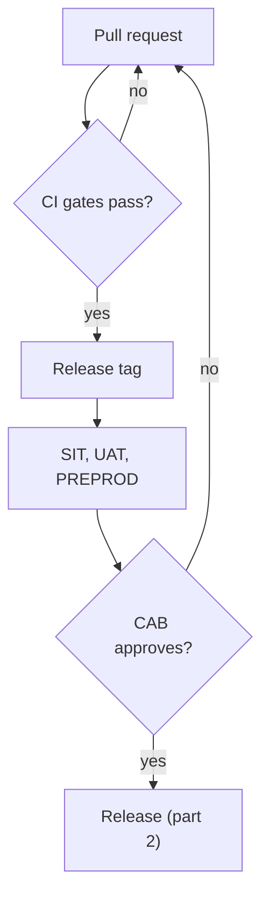
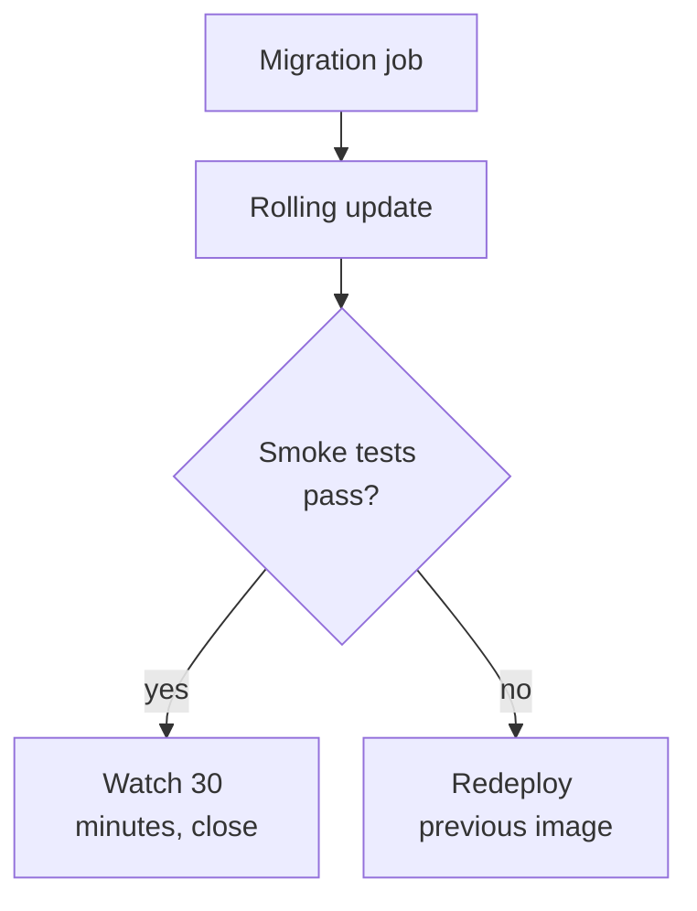
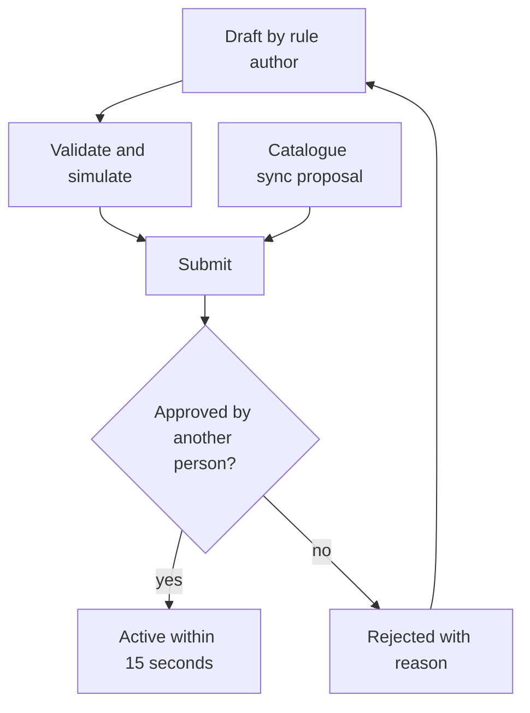

# Introduction

This document describes how changes reach production on the TASCO Growth Platform: code and configuration releases through CI/CD and the Change Advisory Board, and business rule changes through the maker-checker workflow in the rules studio. It covers versioning, branching, CI/CD gates, CAB change types, the database migration policy, rule-based feature switches, the rule change procedure, release notes and the freeze calendar.

The audience is the release manager, CAB members, developers, rule authors and approvers. The release manager role sits with iorta TechNXT during build and hypercare and moves to TASCO IT afterwards. The CAB is chaired by the TASCO Head of IT, with the TASCO Product Owner, Compliance, Security, VETC IT (for changes that affect VETC interfaces), TASCO core IT (for changes that affect the core interface) and the iorta TechNXT Tech Lead.

Related documents:

- TGP-QA-01 Test Strategy (CI gates and regression).
- TGP-OPS-05 Go-Live and Hypercare Plan (smoke tests and rollback levels).
- TGP-OPS-01 Runbook and Support Guide.
- TGP-ARC-07 Architecture Decision Records (ADR-003 rules engine and maker-checker, ADR-013 TASCO core as rating master).

# Two kinds of change

The platform separates code from business rules. They carry different risks and follow different paths.

| | Code or configuration | Business rule |
|---|---|---|
| What | Source code, database migrations, security configuration (`config/security/rbac.json`), container and deployment files, environment settings and secrets, dependencies | Any of the 21 rule kinds stored in the database: scoring, next best action, journeys, triggers, benefits, contact policy, copy guard, message templates, voice script, products, TNDS tariffs, rating tables, commission, enrichment, access policy, retention, costs, referral and service levels |
| Path | Pull request, CI gates, release tag, CAB, deployment | Rules studio: draft, validate, simulate, submit, approval by a different person, active within 15 seconds on all servers |
| Who | Developers; the release manager deploys | A rule author drafts; a rule approver or compliance officer (MFA) approves. Access policy, copy guard, contact policy, commission and retention can only be approved by a compliance officer |
| Evidence | Code review, CI results, release notes | Audit trail (draft, submit, approve or reject), checksum, simulation result, approval comment |
| Rollback | Redeploy the previous image (level R3 in TGP-OPS-05) | Roll back to the previous version, which creates a new draft for approval |
| CAB | Yes: standard, normal or emergency | Not for routine changes; maker-checker is the control and CAB sees a weekly list of activations. Contact policy, copy guard, access policy, commission, tariffs, retention and anything pending legal review need CAB and Compliance approval first |

Product catalogue changes from TASCO core follow the rule path. The nightly catalogue sync proposes a new products version as `system:catalogue-sync`; a person with the approver role reviews and approves it. Nothing is activated automatically, and new products stay off sale until their channels are configured.

The files in `config/rules` only seed an empty database. Editing them does not change production rules once seeded. When a production rule change should also become the default for new environments, it is mirrored into git with a pull request that references the rule version and checksum.

# Versioning

- The application follows semantic versioning, shown in the metadata endpoint and the OpenAPI document. MAJOR is a breaking change to a public contract (partner API, customer API used by the VETC app, events consumed outside the platform). A breaking partner change means a new `/v2/` path alongside `/v1/`, with at least 6 months' notice. MINOR adds compatible features, endpoints, optional fields or additive migrations. PATCH is a fix or security patch with no contract change.
- Images are tagged with the version and the commit; deployments reference the immutable digest.
- Rule sets are versioned separately as `<kind>@<n>` with a checksum. Operations status lists the active version and checksum per kind, and release notes record the versions validated with each release.
- Database migrations are numbered files recorded in `schema_migrations`.

# Branching

Development is trunk-based with short-lived branches.

| Branch | Purpose | Rules |
|---|---|---|
| `main` | Always releasable | Protected; at least one approving review (two for identity, access policy, encryption, security configuration and migrations); all CI gates green; linear history |
| `feature/<ticket>-<slug>` | Work in progress | Rebased on `main`; lives 3 days or less; unfinished features hidden behind rule switches |
| `release/X.Y` | Stabilisation for go-live or a freeze | Cut from `main`; fixes cherry-picked from `main` |
| `hotfix/X.Y.Z` | Emergency fix on a released version | From the release tag; merged back to `main` |

Commits reference the ticket. Pull requests include the test evidence and, for migrations, the compatibility note.

# CI/CD

## Gates

The CI workflow runs on every pull request and on pushes to `main` and `release/**`.

| Stage | Command or tool | Gate |
|---|---|---|
| Install | `npm ci` with the lockfile | — |
| Lint | `npm run lint` | No errors |
| Tests with coverage | `npm run test:coverage` (unit, integration, API, security, functional) | All pass; lines and functions at least 80 %, branches at least 70 % |
| PostgreSQL tests | `npm run test:pg` against PostgreSQL 16 | All pass |
| Static analysis | CodeQL | No new high or critical |
| Dependencies | `npm run audit` | No high or critical in production dependencies |
| Secrets | gitleaks | No findings |
| Container | Image build and Trivy scan | No high or critical |
| SBOM | CycloneDX | Attached to the build |
| Dynamic scan | ZAP baseline against the built image | Report only in CI; no high alert accepted for a release tag |
| Contract | Regenerate the OpenAPI document and compare with the committed copy | Fails if stale. A change to the partner API needs reviewer sign-off and a partner notice |
| Migration immutability | DBA review: an applied migration file is never edited (an automated check is recommended) | Hard rule |
| Performance smoke | `npm run test:perf` (15 s, 25 concurrent) | p95 at most 300 ms and errors at most 1 %; release candidates also run PERF-S1, within 120 % of the previous baseline |

## Release pipeline

A code change passes the CI gates, is promoted with the same image digest through SIT, UAT and PREPROD, and reaches production only after CAB approval and passing smoke tests. The first diagram covers preparation and testing, the second the release and its verification.





Production deployment steps:

1. CAB approval recorded.
2. Migration job runs with a separate database role that has DDL rights.
3. Rolling update with no unavailable pods and one surge pod. Readiness gates traffic; old pods drain within 25 seconds of `SIGTERM`.
4. Smoke tests from TGP-OPS-05, including the integration status check for TASCO core.
5. Dashboards D1 to D3 watched for 30 minutes, then the change is closed.

Deployments run Tuesday to Thursday, 21:00 to 23:00, outside marketing contact hours and well before the 08:15 journey run. There are no deployments on the day before a public holiday, during the Tết freeze or in month-end renewal peaks, except emergencies. The hosted UAT on Railway deploys from the same `Dockerfile`; `railway.json` runs the migration as a pre-deploy step and gates traffic on readiness.

# CAB

| Change type | Examples | Approval | Lead time |
|---|---|---|---|
| Standard (pre-approved, low risk) | Patch release passing all gates with no migration; scaling within autoscaler limits; certificate renewal; partner key issue or revocation (SOP-04); offboarding (SOP-03) | Release manager; logged | Same day |
| Normal | Minor or major release; any migration; configuration or secret change (SOP-01, SOP-02, TASCO core credentials); access control changes; infrastructure; new partner integration; change of rating mode | Weekly CAB, Wednesday 14:00 | 3 business days or more |
| Emergency | Sev 1 or 2 fix; patch for an actively exploited vulnerability; rotation of a compromised secret | Emergency CAB: TASCO Head of IT and Product Owner, plus Compliance when customer contact is affected; ratified at the next CAB | Immediate |

A change record holds the description, risk and impact, tickets, release notes, test evidence, migration plan and compatibility, deployment and rollback steps, verification, communication plan and window.

A change of `RATING_SOURCE` is always a normal change with TASCO Business Owner approval. Setting `ALLOW_LOCAL_RATING` in production also needs TASCO's explicit written approval.

# Database migrations

1. Never edit a migration applied to any shared environment, even for whitespace. The file name is its identity in `schema_migrations`, so an edit is skipped where already applied and diverges elsewhere. Add a new numbered file instead (`003_dsar_requests.sql`, which adds the data-request register, is the latest). DBA review enforces this, and the header of `001_init.sql` states it.
2. Migrations take a PostgreSQL advisory lock, so two migrators started together run one after the other (KI-30 fixed). Rule activation is transactional.
3. Migrations are forward-only and follow expand and contract, so an application rollback never needs a schema rollback. Expand: add tables, nullable columns and indexes. Large concurrent index builds are a manual DBA step referenced by the change, because each migration file runs in a transaction. Move data in batches by a job, not in the DDL migration. Contract (drop or rename) only in a later release, when no running version uses the old structure.
4. `schema.js` must match the SQL; a unit test checks parity ("schema drift guard").
5. Migrations are idempotent where possible, reviewed by the DBA, timed on PERF data, and run by the migration job before rollout (`MIGRATE_ON_START=false` in Kubernetes).
6. Destructive data changes, such as deletes or updates touching personal data, record a fresh point-in-time restore point in the change and involve the DPO where personal data is affected.

# Feature switches through rules

There is no separate feature-flag service. Exposure is controlled by rule sets, which are versioned, simulated, approved and audited.

| Need | Rule kind and field | Example |
|---|---|---|
| Product on or off, or per channel | Products: status and channels | Keep physical damage cover off the partner channel until the inspection flow is live |
| New product from TASCO core | Products: channels (empty after sync) | Configure channels when the business is ready to sell it |
| Bundles | Products: bundle status | Activate a TNDS and personal accident bundle |
| Benefits shown to customers | Benefits: legal status (only approved items reach customers) and availability | Loyalty points stay pending legal review |
| Referral programme | Referral: enabled | Off until legal approval |
| Journey targeting and regional roll-out | Journeys: audience, steps, tiers | Pilot audience restricted to the pilot provinces |
| Event triggers | Triggers | Enable the long-trip trigger in the scale phase |
| Contact intensity | Contact policy caps | Emergency marketing stop: daily cap 0 |
| Quick renewal | Service levels: `quickRenewal` (enabled, journeys, confirmed vehicle and its maximum age, add-ons, wallet balance) | Turn quick renewal off, or widen it to other journeys; the full flow stays available |
| Data-request response time | Service levels: `dsarResponseHours` | Set to the period TASCO legal confirms |
| Voice script | Voice script content | Prompt wording and intents |
| Access attributes | Access policy | Regional restriction (CAB-reviewed) |

Code that is not ready is not merged enabled: it sits behind one of these switches or is not routed. Demo-only routes are disabled whenever demo mode is off.

# Rule change procedure

The rule path has its own approval loop and needs no deployment; catalogue proposals from TASCO core enter the same loop.



| Step | Who | How | Control |
|---|---|---|---|
| 1 Draft | Rule author | Rules studio form (Advanced JSON view for technical users) | Content validated: allowed operators only, decision tables, kind-specific checks (weights sum to 100, commission within the statutory cap), copy guard on messages and benefits. Invalid drafts are refused |
| 2 Validate and simulate | Author | Simulation on the reference profiles for scoring, next best action, journeys and benefits | Evidence attached to the change note |
| 3 Submit | Author only | Submit for approval | Only drafts; only by their author |
| 4 Approve or reject | Rule approver or compliance officer, never the author, with MFA | Approve or reject with a comment | Self-approval refused (maker-checker) |
| 5 Activate | System | Previous version retired; activation event; caches refreshed; all servers within 15 seconds | Audit entry with the superseded version |
| 6 Verify | Author and approver | Operations status shows the new version and checksum; dashboards D4 and D5 watched for 24 hours | — |
| 7 Record | Author | Weekly rule change log to CAB: kind, version, checksum, purpose, approver | — |

Customer-facing rule changes are made outside contact hours or before the 08:15 journey run, unless urgent, so that a whole run uses one version.

# Release notes

Every release has notes in this form:

```markdown
# Release vX.Y.Z (DD/MM/YYYY)

## Summary
One paragraph in business terms.

## Changes
| Ticket | Type | Description | Customer or partner impact |
|---|---|---|---|

## API and contract changes
- OpenAPI difference: none, or link. Partner API impact and notice date.
- Event payload changes.
- TASCO core interface changes, agreed with TASCO core IT.

## Database migrations
| File | Purpose | Compatible with the previous release | Estimated duration |
|---|---|---|---|

## Configuration and secrets
- New or changed settings, defaults, required in production.
- Secret rotations.

## Rule sets validated with this release
| Kind | Version | Checksum |
|---|---|---|

## Known issues
- KI-xx: status or workaround.

## Test evidence
- CI run, SIT and UAT results, performance smoke against the baseline.

## Deployment and rollback
- Window; migration job, rollout, smoke tests.
- Previous image for rollback; rule rollback if any.

## Approvals
- CAB reference and date; Compliance if customer-facing.
```

# Freeze calendar

| Period | Rule |
|---|---|
| Go-live release candidate (11 to 26 January 2027) | Fixes only, on `release/1.0` |
| Tết (1 to 14 February 2027) | No deployments and no rule changes except emergency rollback (RB-10) or the kill switch (SOP-07) |
| First week of each scale-up step | Emergency changes only |
| Month end (last 2 business days) | No normal changes affecting sales, rating or journeys |
