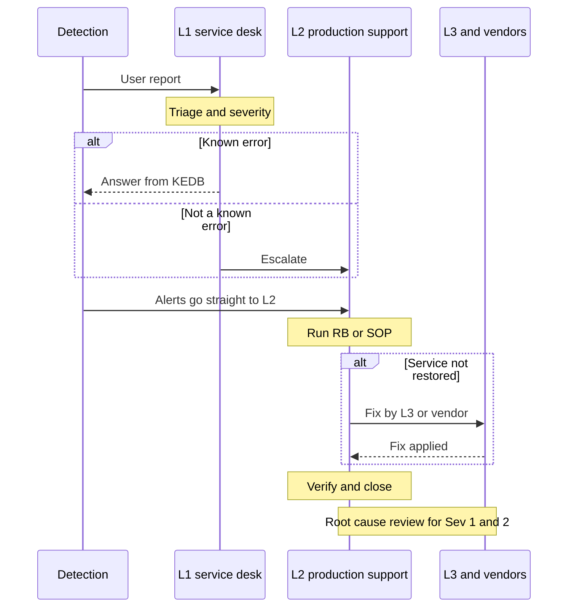

# Introduction

This guide tells the support teams how to run the TASCO Growth Platform in production: who handles what, how incidents are classified, what the platform exposes for diagnosis, and the step-by-step procedures for known incident types and routine operations.

It covers production on Kubernetes (`deploy/k8s`, namespace `tasco-growth`). The hosted UAT on Railway (https://tasco-growth-api-uat.up.railway.app) is a non-production environment; where it behaves differently this is stated. The procedures are written for the production adapters, which keep the integration names used here: `vetc-wallet`, `tasco-core` (policy issuance), `tasco-core-rating`, `tasco-core-catalogue`, `voice-ai`, `app-push`, `zalo-zns` and `sms`. Today the VETC, issuance, messaging and voice adapters in the repository are sandboxes; the TASCO core rating client is the production client, with paths to be confirmed against TASCO's interface specification.

The audience is the L1 service desk, L2 production support and on-call, and L3 engineering. TASCO IT Production Support owns this guide in business as usual; iorta TechNXT provides L3 during hypercare and under the managed service.

Related documents:

- TGP-OPS-02 Monitoring and Alerting (alert rules ALR-xx that point to the procedures here).
- TGP-OPS-03 Disaster Recovery and Business Continuity Plan.
- TGP-OPS-06 Release and Change Management.
- TGP-QA-01 Test Strategy (known issues KI-xx).
- TGP-ARC-02 Integration Architecture.

# Support model

## Incident flow

An incident starts from an alert or a user report and ends with verification and, for Sev 1 and 2, a root-cause review.



## Tiers

| Tier | Who | Hours | Scope | Tools |
|---|---|---|---|---|
| L1 service desk | TASCO IT service desk (staff and partners); VETC customer service (customers) | 08:00 to 20:00, 7 days; Sev 1 out of hours through the on-call phone | Intake, severity, known-error answers, capture of request ID, time, user and route | ITSM tool, the known-error answers in this guide, read-only dashboards |
| L2 production support | TASCO IT production support engineers (role `support_engineer`) | 24 × 7 on-call rota | Procedures RB and SOP, job reruns, circuit and backlog checks, configuration changes through CAB, escalation | Operations API, dashboards, log search, namespace-scoped `kubectl`, read-only database replica |
| L3 engineering | iorta TechNXT | Business hours; 24 × 7 for Sev 1 during hypercare and under the managed service | Code and data defects, hotfixes, data fixes under change control, root-cause analysis | Repository, CI/CD, break-glass database access with approval |
| Vendors and partners | VETC IT, TASCO core IT, Zalo, SMS provider, voice vendor, cloud and database provider | Per contract | Faults in their systems | Their portals and status pages |

After hypercare, L3 is provided under the managed service (USD 6,900 per month, 12-month initial term), whose priority levels match the severities below.

## Severity and service levels

| Severity | Definition | Examples | Response | Restore or workaround | Updates |
|---|---|---|---|---|---|
| Sev 1 (P1 critical) | Customers cannot buy; production down; security or privacy breach; regulatory breach in progress | Readiness failing on all pods; TASCO core rating down in core-only mode; customers charged without cover; banned wording sent; DNC customer contacted; audit chain broken | 30 minutes, 24 × 7 | 4 hours | Every 30 minutes |
| Sev 2 (P2 high) | Major function degraded; one integration or channel down; workaround exists | Zalo circuit open; journeys not run; partner API down for one partner; dead letters growing; indicative quotes piling up | 2 business hours | 1 business day | Every 2 hours |
| Sev 3 (P3 medium) | Defect with a workaround; low business impact | Slow dashboard; one user locked out; catalogue sync failed with no product change due | Next business day | Next scheduled release | Daily |
| Sev 4 (P4 low) | Question, cosmetic issue or small enhancement | Label wording; report request | 3 business days | Planned | On change |

Business hours are 08:00 to 17:30 Vietnam time, Monday to Friday, excluding public holidays. The clock starts when the alert fires or the ticket is created. A Sev 1 or Sev 2 opens a war room (Teams or Zalo group "TASCO-GP-INCIDENT") with an Incident Commander (L2 lead), a Communications Lead and the L3 engineer.

## On-call

| Item | Arrangement |
|---|---|
| Rota | Weekly, handover on Monday at 09:00; primary and secondary L2; iorta TechNXT L3 secondary during hypercare |
| Paging | Alertmanager to PagerDuty, Opsgenie or the TASCO equivalent for `severity: page`; Teams or Zalo channel for `severity: ticket` |
| Handover | Open incidents, silences with expiry, pending changes, jobs to watch (journeys at 08:15, reconciliation at 02:00, catalogue sync at 01:00) |
| Escalation | Primary (15 minutes), secondary (15 minutes), L2 lead, then the TASCO Head of IT for a Sev 1 open more than 1 hour |
| Toolkit | VPN, `kubectl` context, dashboards, log search, ITSM, this guide, escalation contact list in this guide |

# System quick reference

| Item | Value |
|---|---|
| Probes | `GET /health/live` (process up); `GET /health/ready` returns `{status, store, db}` and 503 when the database ping fails, during shutdown or before the server listens |
| Metrics | `GET /metrics` (Prometheus text; bearer `METRICS_TOKEN`). Names in TGP-OPS-02 |
| Operations status | `GET /api/ops/status` (permission `ops:read`): store, circuit per integration, active rule versions and checksums, event backlog by status, audit count |
| Integration status | `GET /api/integrations/status` (`ops:read`): rating source, fail-closed or fallback, core mode (`http` or `simulated`), rating and catalogue circuits, last catalogue sync, issuance circuit |
| Job history | `GET /api/ops/jobs`: recent runs with kind, status, result and error |
| Run a job (API) | `POST /api/ops/jobs/reconciliation`, `retention`, `relay` or `catalogue-sync` (`ops:run_jobs`) |
| Run a job (CLI) | `npm run job -- <migrate, rules, journeys, recompute, reconcile, retention, relay, sync-catalogue, openapi>`. The `seed` job refuses to run unless demo mode is on and is never used in production |
| Scheduled jobs (UTC in `deploy/k8s/60-jobs.yaml`) | Journeys 01:15 (08:15 ICT); recompute 17:30 (00:30); sync-catalogue 18:00 (01:00); reconcile 19:00 (02:00); retention 20:00 (03:00); relay every 5 minutes (each pod also relays every second). All with `concurrencyPolicy: Forbid`. The migration Job runs before each rollout |
| Shutdown | `SIGTERM`: readiness false, relay stopped, server closed, exit 0; forced exit after 25 s. `terminationGracePeriodSeconds` must be at least 30 |
| Circuit breakers | 5 consecutive failed calls open the circuit for 30 s, then one probe (half-open). Defaults: 5 s timeout, 2 retries with jittered backoff. `voice-ai`: 30 s, no retries. TASCO core rating and catalogue: `TASCO_CORE_TIMEOUT_MS` (5 s) per call, 2 retries with 200 ms backoff; core business errors never open the circuit |
| Rating | `RATING_SOURCE`: `core` (production default; no quote when core is down), `core_with_fallback` (indicative quote, payable only after re-rating), `rules` (sandbox only; refused in production without `ALLOW_LOCAL_RATING`) |
| Outbox | `domain_events`: pending, processing, done; back to pending on handler failure; `dead_letter` after 5 attempts |
| Key settings | `DATABASE_URL`, `DB_POOL_MAX` (10), `JWT_SECRET`, `JWT_TTL_SECONDS` (1800), `DATA_KEYS`, `DATA_KEY_ACTIVE`, `BLIND_INDEX_KEY`, `MFA_REQUIRED_ROLES`, `CORS_ORIGINS`, `RATE_LIMIT_*`, `LOCKOUT_*`, `BODY_LIMIT_BYTES`, `TRUST_PROXY`, `TRUST_PROXY_HOPS` (1), `DEMO_MODE` (false), `MIGRATE_ON_START` (false in Kubernetes), `METRICS_TOKEN`, `LINK_TTL_DAYS` (30), `RATING_SOURCE`, `ALLOW_LOCAL_RATING` (false), `TASCO_CORE_BASE_URL`, `TASCO_CORE_TOKEN_URL`, `TASCO_CORE_CLIENT_ID`, `TASCO_CORE_CLIENT_SECRET`, `TASCO_CORE_SCOPE`, `TASCO_CORE_TIMEOUT_MS`. Secrets can be given as `<NAME>_FILE`. UAT only: `DEMO_PASSWORD`, `DEMO_TOTP_SEED`, `DEMO_ACCOUNT_SYNC` |
| Customer contacts | Shown on the customer app support sheet. `SUPPORT_HOTLINE` (1900 1562), `SUPPORT_EMAIL` (info@baohiemtasco.vn), `SUPPORT_WEBSITE` (https://baohiemtasco.vn), `SUPPORT_ZALO_NAME` (Bảo hiểm Tasco), `SUPPORT_ZALO_URL` (empty: customers search for the Official Account by name), `SUPPORT_FACEBOOK_URL`, `SUPPORT_MESSENGER_URL`. The defaults are TASCO's official contacts; an empty value hides that action. A change is a normal change (TGP-OPS-06) |
| Service levels | Rule set `service_levels` (maker-checker): `dsarResponseHours` (72) sets the data-request due time; `quickRenewal` sets when the customer app offers quick renewal |
| Database migrations | `001_init.sql`, `002_integrity_hardening.sql`, `003_dsar_requests.sql` (data-request register, table `dsar_requests`), applied in order by the migration job |

## Logs

The service writes one JSON object per line to stdout. Personal data keys are redacted.

| Message | Level | Fields | Meaning |
|---|---|---|---|
| `request` | info | `requestId`, `method`, `route`, `status`, `ms` | Every API request (not health, metrics or static files) |
| `unhandled error` | error | `requestId`, `path`, `err` | 500 `INTERNAL_ERROR`; always investigate |
| `circuit opened`, `circuit closed` | warn, info | `integration`, `failures` | Breaker transitions |
| `tasco core unreachable`, `tasco core call failed` | warn | `op` (`token`, `quote`, `catalogue`), `status`, `coreCode` | Network failure or error response from TASCO core |
| `core rating unavailable — failing closed`, `… indicative local price issued` | warn | `reason` | Rating outcome when core is unavailable |
| `catalogue sync proposed products rule set` | info | `ruleSetId`, `catalogueVersion`, counts | Sync created a proposal |
| `event handler failed` | error | `type`, `handler`, `eventId`, `err` | Outbox subscriber failure (retried) |
| `outbox relay failed` | error | `err` | Relay loop error, usually the database |
| `job failed`, `job finished` | error, info | `job`, `result` or `err` | Command-line jobs |
| `journey run complete` | info | `due`, `done`, `skipped`, `cancelled`, `deferred`, by channel and journey | Daily journeys |
| `order completed` | info | `orderId`, `channel` | Sale |
| `rule set activated` | info | `kind`, `id` | Rule change live |
| `pg pool error` | error | `err` | Database connectivity |
| `fatal startup error` | stderr | `err` | Boot refused: missing secret or `DATABASE_URL`, demo mode in production, invalid rating configuration, bad keys, database unreachable |

Log queries (Loki LogQL; the `jq` equivalent works on `kubectl logs`):

```logql
# All 5xx in the last 15 minutes by route
sum by (route) (count_over_time({app="tasco-growth-api"} | json | msg="request" | status >= 500 [15m]))

# Trace one request end to end
{app="tasco-growth-api"} | json | requestId="3f2a9c1e-…"

# Slow purchases (over 3 s)
{app="tasco-growth-api"} | json | msg="request" | route="POST /api/customer/orders" | ms > 3000

# Breaker transitions and TASCO core failures
{app="tasco-growth-api"} | json | msg=~"circuit (opened|closed)|tasco core.*"
```

```bash
kubectl -n tasco-growth logs deploy/tasco-growth-api --since=15m | jq -c 'select(.msg=="request" and .status>=500) | {ts,requestId,route,status,ms}'
kubectl -n tasco-growth logs deploy/tasco-growth-api --since=1h | jq -c 'select(.level=="error") | {ts,msg,requestId,err:.err.message}'
```

The hash-chained audit trail in the database holds security and business events such as `auth.login_failed`, `auth.login_locked`, `user.reset`, `rules.approved`, `quote.sent_to_customer`, `quote.rerated`, `catalogue.sync_proposed`, `order.issuance_failed`, `consent.withdrawn`, `dsar.request_logged`, `dsar.request_completed`, `dsar.request_refused` and `dsar.erased`. Query it with `GET /api/audit?action=…&actor=…&entityId=…` (`audit:read`).

# Incident procedures

Each procedure follows the same order: detect, assess severity, diagnose, remediate, verify, follow up. Record request IDs, times (ICT) and actions in the ticket. SQL queries run on the read-only replica; updates run only under a change ticket.

| ID | Incident | Usual severity |
|---|---|---|
| RB-01 | Database down or readiness failing | Sev 1 |
| RB-02 | Circuit open: VETC wallet | Sev 1 or 2 |
| RB-03 | Circuit open: TASCO core policy issuance | Sev 1 |
| RB-04 | Circuit open: Zalo ZNS, SMS or app push | Sev 2 |
| RB-05 | Voice vendor failures | Sev 2 |
| RB-06 | Outbox backlog or dead-letter events | Sev 2 |
| RB-07 | Journey run skipped many touchpoints | Sev 2 |
| RB-08 | Audit chain verification fails | Sev 1 |
| RB-09 | Sign-in failures and lockouts | Sev 2 or 3 |
| RB-10 | Rule set activated by mistake | Sev 1 or 2 |
| RB-11 | Payment captured but issuance failed | Sev 1 or 2 |
| RB-12 | High latency | Sev 2 |
| RB-13 | Memory growth | Sev 2 or 3 |
| RB-14 | Certificate verification failures | Sev 2 or 3 |
| RB-15 | Partner API failures | Sev 2 or 3 |
| RB-16 | TASCO core rating unavailable or circuit open | Sev 1 or 2 |
| RB-17 | Catalogue sync failure | Sev 3 or 2 |
| RB-18 | Indicative-quote backlog | Sev 2 or 3 |

## RB-01 Database down or readiness failing

| Step | Action |
|---|---|
| Detect | ALR-01 ReadinessFailing, ALR-02 HighErrorRate; readiness 503 with `db:false`; logs `pg pool error`, `outbox relay failed`; pods leave the Service endpoints |
| Severity | Sev 1 when no pod is ready |
| Diagnose | 1. Pod readiness: `kubectl -n tasco-growth get pods -l app=tasco-growth-api`. 2. Readiness body: `store` must be `postgres`; `memory` means a misconfigured pod (production refuses to start without `DATABASE_URL`, KI-28 fixed), treat as Sev 1. 3. Provider console: instance status, failover, storage, CPU, connections. 4. Connection count by state in `pg_stat_activity` (pods × `DB_POOL_MAX`). 5. Expired credentials or TLS certificate |
| Remediate | Failover in progress: wait 60 to 120 s; the application reconnects without a restart. Storage full: extend it, then look for runaway tables (`domain_events`, `audit_log`, KI-13). Connections exhausted: scale down to the minimum, restart pods holding idle transactions, add or resize the pooler. Credentials or TLS: rotate the secret, rolling restart. Primary lost: DR procedure FO-1 in TGP-OPS-03 |
| Verify | Readiness 200 on every pod; operations status responds; pending events draining; reconciliation run for the outage window |
| Follow up | Reconcile orders created during the outage (RB-11); run missed journeys inside contact hours (RB-07) |

## RB-02 Circuit open: VETC wallet

| Step | Action |
|---|---|
| Detect | ALR-10 CircuitOpen for `vetc-wallet`; status shows `open`; customers get 503 at payment; orders `payment_failed` |
| Severity | Sev 1 if it lasts more than 15 minutes in business hours; otherwise Sev 2 |
| Diagnose | 1. Error or timeout: `sum by (result) (rate(integration_calls_total{integration="vetc-wallet"}[5m]))`. 2. Logs: `circuit opened`, "timed out after 5000ms". 3. VETC status page or bridge. 4. Egress allow-list, network policy, DNS, client certificate expiry |
| Remediate | The breaker heals itself: one probe every 30 s. Do not restart pods; it only adds load on VETC. 1. Raise the incident with VETC IT. 2. Ask VETC customer service to show the in-app notice "Thanh toán tạm gián đoạn" if the outage passes 15 minutes. 3. Pause the journeys job if the outage covers the 08:15 run (SOP-07). 4. Telesales keep quoting and sending quotes; customers pay when the wallet recovers. Staff cannot take payment |
| Verify | Circuit closed; completed orders resume; error ratio under 1 % |
| Follow up | Debits that timed out on our side may have been captured by VETC (KI-18): list `payment_failed` orders in the window (RB-11, Q1) and reconcile them with the VETC settlement file |

## RB-03 Circuit open: TASCO core policy issuance

This procedure covers issuance and cancellation (`tasco-core`). Rating is RB-16.

| Step | Action |
|---|---|
| Detect | ALR-10 for `tasco-core`; ALR-84 IssuanceFailures; orders `issuance_failed_refunded` or `compensation_failed`; audit `order.issuance_failed` |
| Severity | Sev 1: customers are charged and then refunded. Any `compensation_failed` order needs manual action (RB-11) |
| Diagnose | As RB-02 for `integration="tasco-core"`; contact TASCO core IT |
| Remediate | 1. If the outage will last more than 30 minutes, pause sales entry points: suspend the journeys job (SOP-07), ask VETC to hide the renewal banner, inform partners on the partner status channel. 2. Work each failed order through RB-11 |
| Verify | Circuit closed; a test issuance with an internal test vehicle agreed with TASCO core, then cancelled |

## RB-04 Circuit open: Zalo ZNS, SMS or app push

| Step | Action |
|---|---|
| Detect | ALR-10; ALR-31 MessageFailureRatio; failed messages by channel |
| Severity | Sev 2: journeys degrade, customers can still self-serve |
| Diagnose | Zalo: expired OA token, template disabled, daily quota reached. SMS: brandname registration, provider balance. Push: credentials and certificates (FCM, Apple) |
| Remediate | Touchpoints fall back to the next channel in their step. If every channel fails, the touchpoint is skipped. For a long outage, suspend the journeys job (SOP-07), resume after recovery and re-queue the skipped touchpoints (RB-07) |
| Verify | Sent messages resume for the channel |

## RB-05 Voice vendor failures

| Step | Action |
|---|---|
| Detect | ALR-10 for `voice-ai`; no calls during business hours; voice steps failing |
| Severity | Sev 2. Business continuity in TGP-OPS-03 |
| Remediate | Open a bridge with the vendor. Stop launching voice campaigns. Journey voice steps fail; telesales steps continue. Supervisors move agent capacity to hot leads |

## RB-06 Outbox backlog or dead-letter events

| Step | Action |
|---|---|
| Detect | ALR-20 DeadLetterEvents; ALR-21 OutboxBacklog; event backlog in operations status |
| Severity | Sev 2: lead recompute, confirmation messages and cross-sell are delayed or lost |
| Diagnose | 1. Backlog by status. 2. Logs `event handler failed`. 3. Dead letters (Q1). 4. Events stuck in processing: PostgreSQL re-claims them after 5 minutes; if any are older than 10 minutes, no relay is running (Q2). 5. Large pending count without dead letters: slow relay or every pod failing `outbox relay failed` |
| Remediate | Fix the cause first (bad rule set, missing profile, database). Then, under a change ticket (L3 and DBA), re-queue with Q3 or Q4; there is no API for this yet (KI-03). Drain with `POST /api/ops/jobs/relay`. Subscribers are idempotent except `policy.issued` (confirmation and cross-sell) and `renewal.link_requested` (send link), which send customer messages again if replayed after a partial success: check `data.handled` first |
| Verify | Dead letters stable; pending under 100 within minutes; one confirmation per order for replayed `policy.issued` events |
| Follow up | Root cause for the failing handler; regression test |

```sql
-- Q1 dead letters
SELECT id, data->>'type' AS type, data->>'attempts' AS attempts, data->>'lastError' AS last_error, data->'handled' AS handled, occurred_at FROM domain_events WHERE status = 'dead_letter' ORDER BY occurred_at DESC LIMIT 50;

-- Q2 stuck in processing
SELECT count(*) FROM domain_events WHERE status = 'processing' AND updated_at < now() - interval '10 minutes';

-- Q3 stuck processing back to pending (normally unnecessary)
UPDATE domain_events SET status='pending', data=jsonb_set(data,'{status}','"pending"'), version=version+1, updated_at=now() WHERE status='processing' AND updated_at < now() - interval '10 minutes';

-- Q4 selected dead letters back to pending (handlers already done are skipped)
UPDATE domain_events SET status='pending', data=jsonb_set(jsonb_set(data,'{status}','"pending"'),'{attempts}','0'), version=version+1, updated_at=now() WHERE status='dead_letter' AND id = ANY(ARRAY['<uuid1>','<uuid2>']::text[]);
```

## RB-07 Journey run skipped many touchpoints

| Step | Action |
|---|---|
| Detect | ALR-33 JourneySkipSpike; high skipped or deferred counts in `journey run complete`; skipped touchpoints listed in the console |
| Severity | Sev 2 (lost renewals). Sev 1 if marketing went out outside contact hours (should be impossible) |
| Diagnose | Group skip reasons (Q1). Typical causes: (a) daily or weekly cap reached through overlapping journeys; (b) no marketing consent or not reachable on a channel (expected); (c) provider failure (RB-04). Touchpoints blocked only by contact hours are deferred, not skipped (KI-05 fixed). A high deferred count means the run happened outside 08:00 to 20:00: check that the schedule is in UTC (01:15 UTC is 08:15 ICT) |
| Remediate | For (c), touchpoints skipped for transient reasons may be re-queued (change ticket, L3) with Q2, then re-run inside contact hours (`POST /api/journeys/run`). Production always uses the real clock (KI-33 fixed). Deferred touchpoints run in the next in-window run. (a) and (b) are expected; review caps with Compliance if volumes look wrong |
| Verify | Re-run done count rises; Q3 returns 0 |

```sql
-- Q1 skip reasons in the last day
SELECT data->'result'->>'reason' AS reason, count(*) FROM touchpoints WHERE status='skipped' AND (data->>'executedAt')::timestamptz > now() - interval '1 day' GROUP BY 1 ORDER BY 2 DESC LIMIT 20;

-- Q2 re-queue transient skips from the last 2 days
UPDATE touchpoints SET status='scheduled', channel=NULL, data=jsonb_set((data - 'result' - 'executedAt') || '{"channel":null}', '{status}', '"scheduled"'), version=version+1, updated_at=now() WHERE status='skipped' AND due_date >= CURRENT_DATE - 2 AND data->'result'->>'reason' NOT SIMILAR TO '%(consent|do-not-contact|cap reached|not reachable)%';

-- Q3 marketing sent outside contact hours (must be 0)
SELECT count(*) FROM messages WHERE (data->>'marketing')::boolean AND (extract(hour from sent_at AT TIME ZONE 'Asia/Ho_Chi_Minh') < 8 OR extract(hour from sent_at AT TIME ZONE 'Asia/Ho_Chi_Minh') >= 20);
```

## RB-08 Audit chain verification fails

| Step | Action |
|---|---|
| Detect | ALR-40 AuditChainBroken (hourly synthetic SYN-07 returns `ok:false`) |
| Severity | Sev 1, treated as a security incident until proven otherwise. Notify the TASCO CISO and DPO |
| Diagnose | 0. The audit table rejects UPDATE, DELETE and TRUNCATE by trigger, so a break means someone with owner rights disabled a trigger, or a restore went wrong. Check the triggers are enabled (`pg_trigger` for `audit_log`). 1. The result gives `brokenAt` (position in sequence order) and `hash mismatch` or `prev hash mismatch`. 2. Read the rows around it (Q1). 3. Hash mismatch: the row content changed. Previous-hash mismatch: a row was deleted or inserted out of band, or a partial restore happened. 4. Compare with the latest backup. 5. Check database audit logs for direct changes |
| Remediate | Do not repair the chain. Preserve evidence: snapshot the database and export the audit table to WORM storage. Revoke compromised credentials. Follow the security incident procedure, including legal assessment of notification duties under the PDP rules. Under the CISO's direction, original rows may be restored into a forensic copy |
| Verify | Forensic report identifies the affected range; verification passes on the forensic copy |
| Prevent | Triggers enabled; app role has INSERT and SELECT only; pgaudit logs `DISABLE TRIGGER`; chain head exported nightly. Verification reads the whole table (KI-12): at large volumes, run it on a replica off-peak |

```sql
-- Q1 rows around the break
SELECT seq, id, at, actor, action, entity_type, entity_id, prev_hash, hash FROM audit_log ORDER BY seq OFFSET GREATEST(<brokenAt>-2,0) LIMIT 5;
```

## RB-09 Sign-in failures and lockouts

| Step | Action |
|---|---|
| Detect | ALR-50 LoginFailureSpike; ALR-51 AccountLockouts; ALR-52 LoginRateLimited; audit `auth.login_failed`, `auth.login_locked`, `auth.mfa_failed` |
| Diagnose | Read recent `auth.login_failed` entries: reason (`unknown_user`, `bad_password`, `inactive`) and IP. Many usernames from few IPs: credential stuffing, Sev 2 security. One user, many failures: forgotten password. Many 429 from the office IP at shift start: agents share one egress IP and the per-IP limit (10 per minute) |
| Remediate | Lockout counts password and code failures. Credential stuffing: block IPs at the WAF, confirm MFA for privileged roles, inform Security. Single user: the lock expires after 15 minutes; if urgent, an administrator unlocks (SOP-08). Shared office IP: raise the sign-in limit through CAB, or check `TRUST_PROXY`, `TRUST_PROXY_HOPS` and that the gateway passes the client IP |
| Verify | 401 and 423 rates back to baseline |

## RB-10 Rule set activated by mistake

| Step | Action |
|---|---|
| Detect | Business report (wrong scores, wrong message, journey volumes jump); log `rule set activated`; audit `rules.approved`; changed version or checksum in operations status |
| Severity | Sev 1 if customers are harmed (wrong price shown, wrong wording, wrong audience contacted); otherwise Sev 2 |
| Remediate | 1. If messaging or journeys are affected, stop outbound contact first (SOP-07). 2. Find the last good version: the retired version superseded by the bad one. 3. Roll back through maker-checker: a rule author rolls back to the good version, which creates a new draft, and submits it; a different person with the approver role (MFA) approves it with the incident number. Restricted kinds (access policy, copy guard, contact policy, commission, retention) need a compliance officer. Keep an on-call author and approver pair reachable. 4. All servers pick up the new version within 15 seconds. 5. If leads or journeys were affected, recompute leads |
| Verify | Operations status shows the good checksum; simulate on three profiles; resume journeys |
| Follow up | Messages already sent cannot be recalled; Compliance decides whether customers must be contacted |

## RB-11 Payment captured but issuance failed

| Step | Action |
|---|---|
| Detect | Audit `order.issuance_failed`; orders `issuance_failed_refunded` or `compensation_failed` (ALR-84); reconciliation mismatches (ALR-36): "compensation failed … manual action", "payment failed — confirm with VETC wallet", "stuck in pending_payment > 1h", "missing payment reference", "policy … missing"; customer complaint "charged, no certificate" |
| Severity | Sev 1 for more than a handful of orders, or any `compensation_failed` order |
| Diagnose | List recent failed orders (Q1). For each: (1) `issuance_failed_refunded`: compensation done; confirm the refund in the VETC back office. Partner orders show refund not applicable (partner-collected). (2) `compensation_failed`: refund failed or TASCO core did not cancel some policies (Q2). (3) `payment_failed`: check whether VETC captured anyway (KI-18). (4) Pending more than one hour: flagged as stuck |
| Remediate | Decide per order with TASCO Finance. (a) Customer still wants cover: the quote was released; the customer retries in the app with a new key (the failed key returns 409, KI-31 fixed); after 24 hours a new quote is needed. (b) Refund failed: refund in the VETC back office and record the refund ID. (c) Cancellation failed: ask TASCO core operations to cancel the listed policies. (d) Captured but `payment_failed`: refund through VETC, or issue manually with TASCO core and inform the customer. Then run reconciliation |
| Verify | No mismatches for the window; the daily settlement report agrees |
| Customer communication | VETC customer service template "Giao dịch chưa hoàn tất – đã hoàn tiền" (approved by Compliance) |

```sql
-- Q1 failed orders in the last 2 days
SELECT id, status, data->>'paymentRef' AS payment_ref, data->'policies' AS issued, data->'refund' AS refund, data->'cancelFailures' AS cancel_failures, data->>'error' AS error, created_at FROM orders WHERE status IN ('compensation_failed','issuance_failed_refunded','payment_failed','pending_payment') AND created_at > now() - interval '2 days' ORDER BY created_at;

-- Q2 policies of one order
SELECT id, product, status FROM policies WHERE data->>'orderId' = '<orderId>';
```

## RB-12 High latency

| Step | Action |
|---|---|
| Detect | ALR-03 LatencySLOBreach; ALR-14 CoreRatingLatency; slow synthetics |
| Diagnose | 1. Which routes: `histogram_quantile(0.95, sum by (le, route) (rate(http_request_duration_seconds_bucket[5m])))`. 2. Quote routes only: TASCO core rating latency (ALR-14, RB-16). 3. Routes that drain events inline (orders, partner quotes, ingest, voice turns, consent, expiry, journeys run, ecosystem events, voice campaign) with a high pending backlog: they are doing the backlog's work (KI-04); drain with the relay job or scale out, and find why the backlog grew. 4. Orders only: wallet or issuance latency. 5. Everything: database, CPU throttling, memory (RB-13). 6. Dashboards at scale (KI-12). 7. Sign-in at shift start: password hashing CPU; scale out |
| Remediate | Scale out (raise the autoscaler minimum through an emergency change); stop long ad-hoc queries; move recompute and ingest batches off-peak |
| Verify | p95 under target for 30 minutes |

## RB-13 Memory growth

| Step | Action |
|---|---|
| Detect | ALR-60 MemoryHigh (above 80 % of the container limit); ALR-61 FrequentRestarts (OOM kills) |
| Diagnose | 1. Store first: if readiness shows `memory`, the pod holds all data in RAM; Sev 1 misconfiguration. 2. Growth with traffic from many IPs: rate-limiter buckets (cleaned above 50,000 keys). 3. Large requests: ingest of 5,000 records, dashboards and data exports. 4. Audit verification (KI-12). 5. Heap snapshot on one pod with `NODE_OPTIONS=--heapsnapshot-signal=SIGUSR2` (through CAB), send the signal, copy the snapshot to L3 |
| Remediate | Rolling restart as a stopgap (readiness drops first); raise the limit through CAB; L3 fix |
| Verify | Memory flat over 6 hours |

## RB-14 Certificate verification failures

| Step | Action |
|---|---|
| Detect | Complaints from customers, police or inspection centres; `valid:false` from the public certificate check; 429 on that route; ALR-71 |
| Diagnose | 1. Not found: no policy row with that number; check the order (RB-11). 2. Not yet in force: expected for early renewals (cover starts the day after the current expiry); explain the start date. Expired: the policy has ended. 3. Valid in the API but the page fails: check the verification page in the release image and the CSP. 4. 429: each check costs 2 tokens (150 per minute per IP); inspection centres behind one IP may need an allow-list at the gateway |
| Remediate | As per the cause. A missing policy after successful TASCO core issuance is inserted by L3 from the core record under change control |
| Verify | The QR scan shows a valid certificate |

## RB-15 Partner API failures

| Step | Action |
|---|---|
| Detect | Partner reports; 401 spikes on the partner API (ALR-54); partner quotes flat |
| Diagnose | 401: wrong or revoked key, or partner suspended; keys start with `tpk_`. 404 on bind: quote belongs to another partner, or a typo. 422: quote expired or converted. 409 on retry: the key belongs to a failed attempt or the quote is being paid; retry with a new key. 403: key lacks the scope (quote, purchase, policies:read) |
| Remediate | Re-issue the key (SOP-04); reactivate the partner through the partner manager |

## RB-16 TASCO core rating unavailable or circuit open

| Step | Action |
|---|---|
| Detect | ALR-13 CoreRatingCircuitOpen; ALR-16 RatingUnavailable; integration status shows the rating circuit `open`; agents and customers see "TASCO core rating is temporarily unavailable" (core mode) or quotes marked indicative (fallback mode, ALR-15); logs `tasco core unreachable`, `tasco core call failed`, `core rating unavailable` |
| Severity | Core mode: Sev 1 when no quote can be priced for more than 15 minutes in business hours, because new sales stop. Fallback mode: Sev 2, because quotes continue but cannot be paid |
| Diagnose | 1. `GET /api/integrations/status`: rating source, fail-closed or fallback, core `mode` (`simulated` in production is a Sev 1 misconfiguration), circuits. 2. Results: `sum by (result) (rate(integration_calls_total{integration="tasco-core-rating"}[5m]))` and core latency `histogram_quantile(0.95, sum by (le) (rate(integration_latency_seconds_bucket{integration="tasco-core",op="quote"}[5m])))`. 3. Reason in the logs: `timeout`, `unavailable`, or failures on `op="token"` (credentials expired, rotated or revoked). 4. Responses rejected as invalid: TASCO core changed its contract; check with TASCO core IT. 5. Network: egress proxy, client certificate, DNS. 6. TASCO core status through the core IT bridge |
| Remediate | The breaker heals itself; do not restart pods. 1. Raise the incident with TASCO core IT. 2. Token failures: put the new client secret in the vault (`TASCO_CORE_CLIENT_SECRET_FILE`) and do a rolling restart through an emergency change. 3. Outage over 30 minutes: pause the journeys job (SOP-07) so reminders do not send customers to a quote that fails; ask VETC to show the in-app notice. 4. Telesales tell customers to try again later; in fallback mode agents may send indicative quotes, which customers can pay only after re-rating. 5. Do not switch production to local rating: start-up refuses it without `ALLOW_LOCAL_RATING`, and it needs TASCO's explicit approval through an emergency CAB |
| Verify | Circuit closed; `rating_requests_total{result="ok"}` rising; a test quote for an internal vehicle carries a core quote reference |
| Follow up | Work indicative quotes created during the outage (RB-18); reconcile any orders that failed at issuance (RB-11) |

## RB-17 Catalogue sync failure

| Step | Action |
|---|---|
| Detect | ALR-37 CatalogueSyncFailed: the `tasco-growth-sync-catalogue` job failed or has not succeeded for 26 hours; integration status shows last sync `failed` with an error; job history `catalogue_sync` failed; log `job failed` |
| Severity | Sev 3: the active product catalogue is unchanged and sales continue. Sev 2 if TASCO has a product change due, for example a product that must stop selling on a set date |
| Diagnose | 1. Error text in the last sync: unavailable or timeout (core catalogue endpoint or circuit `tasco-core-catalogue`), invalid response or duplicate product (contract violation), or rule validation failure of the proposal (L3). 2. `already_proposed` is not a failure: a proposal is waiting for approval. 3. Core reachability as in RB-16 |
| Remediate | When core is reachable, re-run `POST /api/ops/jobs/catalogue-sync` or `npm run job -- sync-catalogue`; a re-run never queues the same proposal twice. Contract violations go to TASCO core IT and L3; do not hand-edit products. If a product change is due while the sync is broken, a rule author drafts the change in the rules studio and an approver approves it (maker-checker), as agreed with the TASCO Product Owner |
| Verify | Last sync succeeded with outcome proposed or no change; any proposal is in the approvers' queue |
| Follow up | An approver reviews the proposal; new products are not on sale until their channels are configured |

## RB-18 Indicative-quote backlog

Applies only when `RATING_SOURCE=core_with_fallback`.

| Step | Action |
|---|---|
| Detect | ALR-38 IndicativeQuoteBacklog; ALR-15 IndicativeQuotesIssued; customers report they cannot pay ("This price is indicative … it must be re-rated by TASCO core before payment"); payment 422 with reason `indicative_quote` |
| Severity | Sev 2 while core is still down (cause in RB-16); Sev 3 for the backlog left after recovery |
| Diagnose | Count open indicative quotes and the oldest (Q1). Confirm the rating circuit is closed before asking anyone to re-rate |
| Remediate | There is no bulk re-rate job; quotes are re-rated one by one. Agents re-rate in the console (`POST /api/quotes/:id/rerate`) and re-send the quote; the customer app can confirm the final price itself (`POST /api/customer/quotes/:id/rerate`). Supervisors prioritise hot leads. If core's final price differs from the indicative one, the customer sees the final price before paying and the agent explains the difference. Quotes older than 24 hours have expired and need a new quote |
| Verify | Backlog falling; no order was paid from an indicative quote (Q2 returns 0) |
| Follow up | Report the number of indicative quotes and their conversion after re-rating to the Business Owner, who reviews whether fallback mode remains the right choice |

```sql
-- Q1 open indicative quotes
SELECT count(*) AS open_indicative, min(created_at) AS oldest FROM quotes WHERE status = 'open' AND (data->>'indicative')::boolean;

-- Q2 orders paid from an indicative quote (must be 0)
SELECT count(*) FROM orders o JOIN quotes q ON q.id = o.data->>'quoteId' WHERE o.status = 'completed' AND (q.data->>'indicative')::boolean;
```

# Standard operating procedures

## SOP-01 Rotate the personal data encryption key

`DATA_KEYS` has the form `k1:<base64 32 bytes>,k2:<base64 32 bytes>`. `DATA_KEY_ACTIVE` selects the key for new writes (default: the last one listed). Ciphertext carries its key ID, so any listed key can decrypt it.

| Step | Action | Owner |
|---|---|---|
| 0 | Standard change; off-peak (22:00) | L2 |
| 1 | Generate the key in the vault (`openssl rand -base64 32`) as `k2`. Never put it in git or tickets | Security |
| 2 | Distribute without activating: set `DATA_KEYS=k1:…,k2:…` and `DATA_KEY_ACTIVE=k1`. Rolling restart of the Deployment, and update the job pods, which read the same secret | L2 |
| 3 | Confirm every pod runs with the new secret and logs show no `unknown data key` errors | L2 |
| 4 | Activate: `DATA_KEY_ACTIVE=k2`, rolling restart. Skipping step 2 makes old pods fail on `k2` data | L2 |
| 5 | Confirm new writes use `k2` (count rows containing `enc:v1:k2:`) | DBA |
| 6 | Never remove `k1` while any row contains `enc:v1:k1:`. There is no re-encryption job yet (KI-19) | Security |
| Rollback | Set `DATA_KEY_ACTIVE=k1`, keep `k2` listed | L2 |

`BLIND_INDEX_KEY` (phone search) must not be rotated without rebuilding the phone index, for which there is no tool (KI-19). Treat it as long-lived and protect it in the vault.

## SOP-02 Rotate the token signing secret

| Step | Action |
|---|---|
| Impact | One HS256 secret with no key ID. Rotation invalidates at once all staff sessions, customer sessions (one hour), pending MFA challenges and every signed renewal link already sent (KI-08; links otherwise expire after 30 days). Customers with older reminders see "Link invalid or expired" and must open the app directly |
| Planned rotation | Every 90 days, or when staff with secret access leave. After 20:00 (no sends), ideally the evening before a journey run so new links are generated the next morning. Tell staff 24 hours ahead |
| Steps | 1. Generate at least 48 random bytes in the vault. 2. Update the secret. 3. Roll out quickly (`maxSurge` 100 %) to shorten the mixed period. 4. Confirm sign-in works |
| Emergency | Rotate immediately whatever the time; Sev 1; disable affected users; review sign-in audit entries since the suspected exposure |

The TASCO core client secret is rotated the same way: TASCO core IT issues the new secret, it goes into the vault, then a rolling restart; both secrets should be valid during the change.

## SOP-03 User offboarding

1. The HR or line-manager ticket triggers it the same day, within one hour for involuntary exits.
2. The administrator disables the user. This takes effect on the next request, because every request reloads the user.
3. The supervisor reassigns the user's open handoffs.
4. For a rule author, review their drafts and pending rule sets and reject or re-own them.
5. Remove VPN, identity provider and console access. Rotate any shared secret the user knew (SOP-01, SOP-02, SOP-04).
6. Attach the audit entry `user.updated` to the ticket. Line managers sign a quarterly access review.

## SOP-04 Partner API keys

| Action | Procedure |
|---|---|
| Issue | The partner manager issues a key. It is shown once (`tpk_…`); only its SHA-256 hash is stored. Deliver it through a secure split channel (key by encrypted email, password by SMS). Record the key ID and prefix |
| Rotate | Issue a new key, the partner deploys it, revoke the old one. Both work in between |
| Revoke | Revocation is immediate. If the key ID is unknown, find it in the audit trail (`partner.api_key_issued` for the partner) |
| Suspend a partner | Set the partner's status to suspended; all its keys stop working |
| Suspected leak | Revoke at once (Sev 2 security); review the partner's policy reads and orders since the exposure |

## SOP-05 Data requests (access and erasure)

Customers may ask to see or erase the personal data TASCO holds about them. Every request is logged in the data-request register in the staff console (Governance, "Data requests"; "Yêu cầu dữ liệu cá nhân" in Vietnamese), which starts the response clock, keeps a timeline and writes every action to the audit trail. Only the compliance officer role holds the permission `dsar:manage`, with MFA.

| Item | Arrangement |
|---|---|
| Who handles | TASCO compliance officers (named in the sign-off list), with the DPO accountable. Intake staff (TASCO hotline 1900 1562, info@baohiemtasco.vn, branches, letters, VETC customer service) pass the request to Compliance the same business day; they do not export or erase data themselves |
| Response time | 72 hours from receipt (`dsarResponseHours` in the `service_levels` rule set), to be confirmed by TASCO legal under Decree 13/2023/ND-CP and PDP Law 91/2025/QH15. The due time is set when the request is logged and uses the date and time the request was received, not the time it was logged. A change to the response time is a rule change through maker-checker |
| Self-service | A customer who downloads their own data in the app is recorded automatically as a completed access request with channel app. No action is needed |
| Queue | The register shows open, due within 24 hours, overdue and completed in the last 30 days, with filters by status and type |

| Step | Action | Owner |
|---|---|---|
| 1 Log | "Log request": find the customer by plate or phone; choose the type (access or erasure) and channel (hotline, email, app, branch or letter); enter the received date and time; add a note with the ticket number. The reference has the form `DSR-YYMMDD-XXXX` | Compliance officer, same business day |
| 2 Verify identity | Verify the requester against the TASCO identity procedure before any data leaves the company or is erased. Record it with "Start handling" (identity verified). Export and erasure are refused by the system until identity is recorded | Compliance officer |
| 3a Access | "Export data" downloads `TASCO-data-<plate>-<date>.json` (profile, lead, policies, quotes, orders, claims, messages, source records, voice sessions and tasks) and completes the request. Send it to the customer through an encrypted channel agreed with the DPO | Compliance officer |
| 3b Erasure | "Erase personal data" needs a reason and the plate typed again. Personal data is anonymised: name and phones cleared, profile set to do-not-contact, lead deleted, messages and transcripts blanked, source, handoff and claim personal data cleared, sessions revoked. Policies and orders are kept under the legal obligation, linked by plate only. While a policy is in force the system refuses the erasure with the legal reason and the end date; diarise a new request for after expiry | Compliance officer |
| 3c Refuse | "Refuse" with a reason of at least five characters, for example identity could not be verified | Compliance officer with the DPO |
| 4 Other systems | Forward the request to VETC (app, wallet) and TASCO core, which hold their own records, and note their references on the request | Compliance officer |
| 5 Reply | Tell the customer the outcome through the channel they used, with the approved template | Compliance officer |

Escalation when a request is late:

| Condition | Action |
|---|---|
| Due within 24 hours and not started | Compliance lead assigns a handler at the daily health check; the request shows "Due soon" |
| Overdue (past the 72-hour due time) | Ticket at Sev 3 to the compliance lead and the DPO the same day; the DPO decides whether the customer must be told of the delay and why |
| Overdue by more than 24 hours, or more than 3 overdue at once | Sev 2; DPO informs TASCO Legal; root cause recorded (staffing, identity checks, other systems) |
| Export or erasure fails with an error | L2 ticket with the request ID; L3 under change control. Do not erase data by hand in the database |

Audit evidence: the register and each request's timeline (received, identity verified, in progress, completed or refused, with names and times), and the audit entries `dsar.request_logged`, `dsar.identity_verified`, `dsar.request_started`, `dsar.request_completed`, `dsar.request_refused`, `dsar.request_viewed` and `dsar.register_viewed`, plus `dsar.access_exported` or `dsar.erased` from the fulfilment itself. The register can be exported to CSV for the DPO's monthly report and for the regulator on request. The register lists a masked name and the plate only.

Objection or consent withdrawal is not a data request: the customer uses the consent centre in the app or tells the voice bot ("đừng gọi nữa"). Staff cannot edit consent; through customer service, record it in the ticket and have the customer use the app, or L3 applies it as a data fix.

## SOP-06 Data correction by the data steward

| Case | Procedure |
|---|---|
| Wrong policy expiry | The data steward (MFA) corrects the date with an evidence reference. Evidence is mandatory and recorded in the audit trail; the lead is recomputed at once |
| Data quality queue | Fix at the source, then resolve the issue with a note. It reopens if the next import detects it again |
| Wrong name or phone | No direct edit (data minimisation). Correct it in the source system (VETC account, TASCO core) and let the next extract update it, or import the corrected record from that source |
| Plate mismatch or wrong person from the voice bot | Confirm with VETC customer service, then correct the phone in the source system |
| Bulk correction | Change ticket and file; import in batches of 2,000 records or fewer (KI-16); check the rejected and profiles-touched counts |

## SOP-07 Emergency stop of outbound contact

There is no single switch. Use these levers, fastest first:

1. Suspend the journeys job: `kubectl -n tasco-growth patch cronjob tasco-growth-journeys -p '{"spec":{"suspend":true}}'`. No scheduled reminders, calls or telesales tasks.
2. Tell campaign managers not to run journeys or voice campaigns manually; optionally remove the permission through CAB.
3. Block marketing in rules: a compliance officer approves a contact policy version with a daily marketing cap of 0. Service messages (confirmations, lapsed notices) still go out. Takes about 15 seconds after approval.
4. Event triggers still send service messages and top-up marketing within caps; to stop them, pause the VETC event feed at source.

Resume in reverse order and re-queue skipped touchpoints if appropriate (RB-07).

## SOP-08 Unlock a user, reset MFA or handle a forgotten password

| Case | Procedure |
|---|---|
| Account locked | The lock expires after 15 minutes. If the user cannot wait, an administrator unlocks the account (`POST /api/users/:id/reset` with `unlock`) |
| Lost or replaced phone | Verify the requester's identity (ticket). The administrator resets MFA (`resetMfa`, with `unlock` if needed). A new secret is generated, existing tokens are revoked and the user sets up the authenticator at next sign-in. The administrator never sees the secret |
| Forgotten password | There is no password-reset function. Once staff sign-in is federated with the TASCO identity provider (ADR-007 in TGP-ARC-07), it handles this. Until then, under a change ticket approved by the TASCO IT security lead, L3 sets a temporary password that must be changed at next sign-in. Record it in the ticket, because the script bypasses the application audit trail |
| Constraints | An administrator cannot reset their own account or change their own roles or status. Every reset is audited as `user.reset`. Codes cannot be reused |
| Hosted UAT | Demo accounts are unlocked and reset at every start-up; restarting the UAT service is the quickest fix for a locked demo account |

## SOP-09 Re-running scheduled jobs

| Job | How | Safe to re-run |
|---|---|---|
| Relay | `POST /api/ops/jobs/relay` or `npm run job -- relay` | Yes |
| Reconciliation | `POST /api/ops/jobs/reconciliation` | Yes (read-only) |
| Retention | `POST /api/ops/jobs/retention` | Yes (deletes by cut-off date) |
| Catalogue sync | `POST /api/ops/jobs/catalogue-sync` or `npm run job -- sync-catalogue` | Yes; never activates anything and never queues the same proposal twice |
| Journeys | `npm run job -- journeys` or `POST /api/journeys/run` | Yes; executed touchpoints are not re-sent; outside contact hours marketing is only deferred, so run it inside them |
| Recompute | `npm run job -- recompute` | Yes; heavy at scale (KI-12), off-peak only |
| Migrate | Migration Job before rollout | Yes (applied migrations skipped) |
| Rules | `npm run job -- rules` | Yes; seeds only kinds with no version |
| Seed | Refuses to run unless demo mode is on; never used in production | — |

# Daily health check

| Time | Check | Pass |
|---|---|---|
| 08:00 | Operations status: all circuits closed; dead letters unchanged; rule checksums match the change log | Yes or no |
| 08:00 | Integration status: core mode `http`, rating and catalogue circuits closed, last catalogue sync succeeded; any proposal awaiting approval noted | Yes or no |
| 08:00 | Last night's reconciliation and retention succeeded with no mismatches (any failed or compensated order goes to RB-11) | Yes or no |
| 09:00 | Journey run at 08:15 complete; deferred close to 0; skip reasons normal; relay job succeeding | Yes or no |
| 09:00 | Audit chain verification ok | Yes or no |
| 09:00 | Data requests: none overdue; requests due within 24 hours have a handler (SOP-05) | Yes or no |
| 12:00 and 17:00 | Quotes and orders in line with the same weekday last week; no open indicative quotes older than one hour (fallback mode) | Yes or no |
| Weekly | Access review changes; secret ages (including the TASCO core client secret); certificate expiries; backup restore result (TGP-OPS-03) | Yes or no |

# Known-error answers for L1

| Symptom | Likely cause | L1 action |
|---|---|---|
| "Account temporarily locked" | Five failed sign-ins or codes | Wait 15 minutes; if urgent, ticket for an unlock (SOP-08) |
| QR code or password change at first sign-in | Normal set-up of the authenticator and initial password | Guide the user through set-up |
| Lost or replaced phone | MFA must be set up again | Ticket for an MFA reset (SOP-08) |
| "Invalid code" although it looks right | Code already used, or phone clock wrong | Wait for the next code; set the phone to automatic time |
| "Too many sign-in attempts — wait a minute" | Sign-in limit per IP | Wait 60 s; if the whole office is affected, L2 (RB-09) |
| Customer: "Link invalid or expired" | Link sent before a secret rotation, or mistyped | Ask the customer to open the VETC app and go to Insurance |
| Customer: "Quote expired — please re-quote" | Quote older than 24 hours | Re-quote in the app |
| Customer or agent: "TASCO core rating is temporarily unavailable" | TASCO core outage | Ask the customer to try again shortly; ticket to L2 if more than a few reports (RB-16) |
| Customer cannot pay a quote marked indicative | Price set while TASCO core was unavailable | Ask an agent to re-rate the quote and send it again, or the customer to confirm the final price in the app (RB-18) |
| Customer cannot pay for physical damage cover | A vehicle inspection must be recorded first | Explain that a TASCO assessor will contact them; L2 checks the inspection was recorded |
| Customer charged, no certificate | Issuance failure | Sev 2 ticket to L2 with time, plate and order reference (RB-11) |
| Agent asks how to take payment | Staff never take payment | Explain the assisted sale: send the quote; the customer pays in the VETC app |
| Certificate shows not valid after a renewal | Cover starts the day after the old policy ends | Explain the start date |
| Agent cannot open a customer | Regional restriction | Expected; the supervisor reassigns |
| Customer asks to see or delete their data | Data request | Record the request, the channel and the time received; pass it to Compliance the same business day (SOP-05). Customers can also download their own data in the app |
| Customer does not see quick renewal ("Gia hạn nhanh") | Not eligible this time, for example vehicle details not confirmed in the last 365 days, add-ons or physical damage cover, an indicative price, or a wallet balance below the premium | Expected; the customer renews through the full flow ("Gia hạn ngay" or "Tùy chỉnh gói bảo hiểm") |
| Error message with a request ID | Unexpected error | Ticket to L2 with the request ID |

# Incident communication

| Audience | Channel | Owner | When |
|---|---|---|---|
| War room | Teams or Zalo "TASCO-GP-INCIDENT" bridge | Incident Commander | Start of a Sev 1 or 2 |
| TASCO Head of IT and Business Owner | Phone and email | Communications Lead | Sev 1 within 30 minutes, then hourly |
| VETC IT and customer service | Shared incident channel | Communications Lead | Any customer-facing impact |
| TASCO core IT | Core IT bridge | Communications Lead | Any rating, catalogue or issuance impact |
| Customers | In-app banner or ZNS service message (approved templates) | VETC customer service and TASCO Marketing | Sev 1 lasting more than 30 minutes on the purchase path |
| Partners | Partner status email | Partner Manager | Partner API impact over 15 minutes |
| Regulator and data subjects | As directed by Legal and the DPO | DPO | Personal data breach, within statutory deadlines |

A blameless root-cause review is completed within 5 business days for every Sev 1 and 2, with actions tracked to closure and procedures updated.

# Escalation contacts

Named contacts are entered before G3 from the interface agreements and vendor contracts, and checked quarterly.

| Party | Role | Contact source | Hours |
|---|---|---|---|
| TASCO IT Production Support | L2 on-call | Rota tool | 24 × 7 |
| iorta TechNXT | L3 engineering on-call | Rota tool | 24 × 7 for Sev 1 |
| VETC IT | Wallet, sign-on, app, events | VETC interface agreement | 24 × 7 |
| TASCO core IT | Rating, catalogue, issuance | TASCO core interface agreement | Business hours plus Sev 1 on-call |
| Zalo | OA and ZNS account manager | Zalo OA agreement | Business hours |
| SMS brandname provider | NOC | Provider contract | 24 × 7 |
| Voice vendor | NOC | Vendor contract | 24 × 7 during campaign hours |
| Cloud and database provider | Support | Hosting contract | 24 × 7 |
| TASCO CISO and DPO | Security and privacy incidents; overdue data requests | TASCO security directory | 24 × 7 for Sev 1 |
