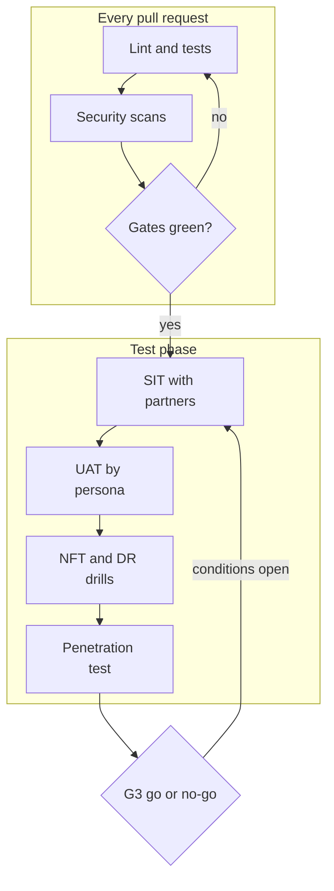
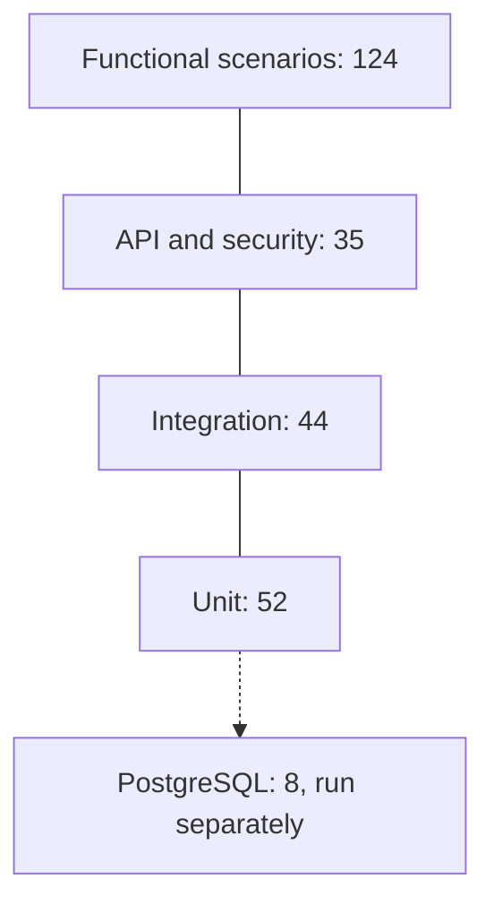
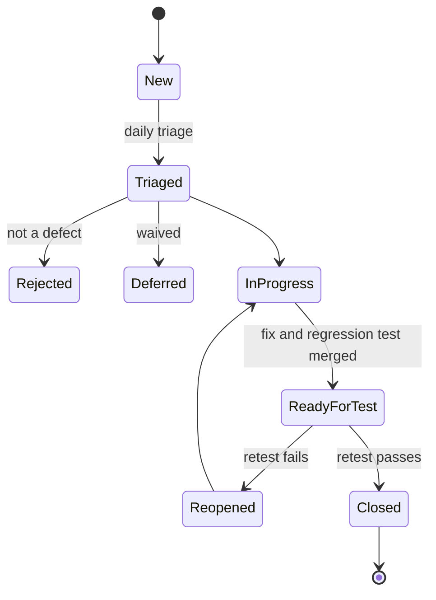

# Introduction

This strategy sets out how the TASCO Growth Platform is tested from the first sprint to go-live: what is tested, at which level, in which environment, with which data, and what evidence each gate needs. It also records the latest execution results and the known issues found while the tests were derived.

The system under test is `tasco-growth-platform` release 1.0.0 (Node.js 22, PostgreSQL 16). The client is TASCO Insurance, with VETC as ecosystem and channel partner. iorta TechNXT owns this strategy; TASCO IT, the TASCO Business Owner, TASCO Compliance and VETC IT approve it.

The audience is the test team, developers, TASCO IT and the Steering Committee.

Related documents:

- TGP-QA-02 Test Case Catalogue (TC-001 to TC-180).
- TGP-QA-03 Performance and Capacity Test Plan.
- TGP-QA-04 User Acceptance Test Plan.
- TGP-OPS-04 Production Readiness Checklist and TGP-OPS-06 Release and Change Management.
- TGP-DEL-01 Project Plan (gates G1 to G4).
- TGP-ARC-02 Integration Architecture (TASCO core, VETC and channel interfaces).

The record of execution is the workbook TASCO-Test-Cases-and-Results.xlsx.

## Sandbox and production

The repository ships sandbox adapters for the VETC wallet, TASCO core policy issuance, Zalo ZNS, SMS, app push and the voice-AI caller, and a synthetic VETC data source. For TASCO core rating and the product catalogue there is a production REST client (`tascoCoreRatingClient.js`), tested against a local HTTP stub; UAT uses a simulated core. The client's paths are assumptions until TASCO's interface specification arrives.

Unit, integration, API, security and performance results in this document were produced against these sandboxes. They are not evidence of real partner behaviour. That evidence comes from SIT and later phases, against the partner UAT endpoints, once the production adapters exist.

# Scope

## In scope

| Area | Main components | Main risks tested |
|---|---|---|
| HTTP pipeline and platform | `app.js`, `router.js`, `security.js`, `openapi.js`; health, metrics and OpenAPI endpoints | Wrong status codes, missing security headers, request-size abuse, contract drift |
| Identity and access | `identityService.js`, `accessPolicy.js`, `rbac.json`, `abac.json` | Broken sign-in, MFA bypass, privilege escalation, IDOR, personal data leakage |
| Data enrichment and MDM | `ingestionService.js`, `enrichment.js`, `identity.js` | Wrong golden record, plate and phone errors, lost customer declarations |
| Lead scoring and next best action | `leadService.js`, `leads.js`, scoring, NBA and benefits rules | Mis-prioritised leads, unexplainable scores, unapproved benefits reaching customers |
| Journey engine | `journeyService.js`, `contactPolicy.js`, journey, trigger, contact policy and copy guard rules | Spam, contact outside 08:00 to 20:00, contact with DNC customers, banned discount wording |
| Voice bot and telesales | `voiceService.js`, `voicebot.js`, handoff routes | Plate disclosure, opt-out ignored, agents seeing others' work |
| Sales | `salesService.js`, `rating.js`, products and commission rules | Wrong premium, double charge, payment without policy, commission above the cap |
| TASCO core rating and catalogue | `ratingService.js`, `catalogueService.js`, `tascoCoreRatingClient.js` | Local price overriding core, indicative quote paid, catalogue change activated without approval, personal data sent at rating |
| Partner channel | `partnerService.js`, partner API | Key leakage, cross-partner IDOR |
| Claims first notice of loss | `claimsService.js` | Illegal status changes, claims on other customers' policies |
| Rules governance | `rulesService.js`, `validators.js`, `jsonLogic.js` | Self-approval, invalid rule activated, stale cache across replicas |
| Privacy and audit | DSAR in `customerService.js`, `auditService.js`, `auditChain.js` | Erasure with an active policy, personal data in clear at rest, undetected audit tampering |
| Operations and persistence | `opsService.js`, outbox, jobs, `postgresStore.js`, migrations | Lost events, unreconciled orders, unsafe shutdown, memory and PostgreSQL drift |
| Front ends | Staff console, customer app, certificate verification page | Accessibility, localisation, usability (being redesigned) |
| Deployment assets | `Dockerfile`, `deploy/k8s`, `railway.json`, CI workflow | Image vulnerabilities, probe errors, missing scheduled jobs |

## Out of scope

The owning party tests the internals of TASCO core, the VETC wallet and identity service, Zalo ZNS, the SMS gateway and the voice vendor's speech engine. We test our contract with each of them in SIT. Claims adjudication is outside the platform, which is the first-notice front door only. Federation with the TASCO identity provider is tested in SIT once TASCO configures it.

# Test approach

The approach runs from automated checks on every change, through integration with the partners, to business acceptance and the go-live decision.

## Unit tests

Unit tests cover the pure domain and shared modules: plate and phone normalisation, enrichment, scoring and next best action, the three rating methods, contact policy, the voice dialogue, rules evaluation, encryption, resilience, metrics and log redaction. They use the built-in `node:test` runner, consistent with the platform's single runtime dependency (`pg`). Tests are deterministic: the clock, business date and random seed are injected, and there is no network access.

## Integration tests

Integration tests wire the application services through `createContainer(config)` with the in-memory store and sandbox gateways. Typical flows are ingest, rebuild, lead recompute and touchpoints; purchase, issuance, confirmation and cross-sell; rule approval and cache refresh; and core rating, fallback, re-rate and catalogue sync. Faults are injected by replacing a gateway port, for example a wallet that fails or a TASCO core that times out.

## API and contract tests

API tests call every route in the route table over real HTTP: 97 routes in release 1.0.0 (6 public, 76 staff, 11 customer, 4 partner). The OpenAPI document is generated from the same table, so contract tests check that it lists every route, declares security per audience, requires `Idempotency-Key` on both order routes and rejects unknown body properties. CI regenerates the document and fails if it differs from the committed copy.

The authorisation matrix calls every route with each of 15 principals (13 staff roles, a customer and a partner) and checks for 2xx, 401 or 403. Negative tests cover 400, 404, 405, 409, 413, 415, 422, 423 and 429.

## Functional acceptance tests

There is one automated test for every Given/When/Then scenario in TGP-BUS-04 User Stories and Acceptance Criteria, named `US-xxx · scenario`, running against the real API with the in-memory store. The suite has 124 scenarios: 121 automated and 3 recorded as to-do because they are manual or roadmap items (US-055 fleet dashboard, US-076 language toggle and US-077 physical QR scan, the last two verified in UAT). Each scenario is a row of the workbook sheet *Functional Test Cases*.

## System integration testing

SIT runs in the SIT environment (PostgreSQL, demo mode off, production adapters pointing at partner UAT endpoints). Exit needs all P1 SIT cases passed and interface defects closed or waived by both parties.

| Interface | Counterparty environment | Key scenarios | Prerequisite |
|---|---|---|---|
| Core rating and catalogue | TASCO core UAT | Quote each product; validity and quote reference; catalogue fetch and sync proposal; fail-closed and fallback behaviour (TC-180) | Confirmed interface specification; OAuth client credentials |
| Policy issuance and cancellation | TASCO core UAT | Issue TNDS car and motorbike, physical damage cover after inspection, personal accident cover per seat; multi-line failure and compensation (TC-153) | Production issuance adapter; product mapping signed off |
| Wallet debit and refund | VETC wallet UAT | Idempotent debit; timeout then retry; refund after issuance failure; insufficient balance (TC-152) | Wallet adapter; funded test wallets |
| Customer sign-on | VETC identity UAT | Token exchange; expired and foreign-audience tokens (TC-151) | Production token verification |
| Messaging | Zalo ZNS, SMS brandname, VETC app push | Approved templates and parameters; diacritics and length; deep link opens the renewal (TC-149, TC-150) | Zalo template approval; brandname registration; app build |
| Voice | Voice vendor test trunk | Real speech into the dialogue; plate-first check; opt-out; transfer (TC-154) | Vendor contract and test numbers |
| Events and extracts | VETC event feed, VETC and TASCO extracts | Tag activation and inspection events; batches of 2,000 records or fewer; lineage; settlement comparison (TC-155) | Data-sharing agreement; masking |

## User acceptance testing

Business users run scenarios by persona: campaign manager, telesales agent and supervisor, rule author and approver, compliance officer, data steward, claims handler, partner manager and developer, customer, executive, auditor, administrator and support engineer. The plan, scenarios and sign-off sheet are in TGP-QA-04 User Acceptance Test Plan.

## Non-functional testing

| Type | Objective | Approach | Reference |
|---|---|---|---|
| Load | Meet the p95 targets at the design point | `npm run test:perf` (p50, p95, p99, requests per second); k6 for distributed load | TGP-QA-03, PERF-S1 to S6 |
| Volume | Pilot cohort, then 6 million profiles | Synthetic generator in the PERF environment | PERF-S7 to S9 |
| Stress and soak | Graceful degradation; no leaks over 12 to 24 hours | Ramp to 2× the design point; 60 % load for 12 hours | PERF-S10, S11 |
| Security | No open critical or high findings | Static, dependency, secret, container and dynamic scans; abuse-case suite; penetration test | Security testing below |
| Resilience | Breakers, outbox, database failover, pod loss | Fault injection | Resilience testing below |
| DR | Recovery within the targets | PITR restore; failover drills | TGP-OPS-03, DR-T1 to DR-T7 |
| Accessibility | WCAG 2.2 AA | Automated scan plus screen reader and keyboard passes | TC-144 to TC-146 |
| Usability | Key tasks completed by agents and customers | Moderated sessions | TGP-UX-04 Usability Testing Plan |

## Security testing

| Control | Tool or test | Gate |
|---|---|---|
| Static analysis | CodeQL (security-extended) | No new high or critical alerts |
| Lint | ESLint 9 | Zero errors |
| Dependencies | `npm run audit` (production dependencies) | No high or critical |
| SBOM | CycloneDX | Attached to every tagged build |
| Secrets | gitleaks over the full history | Zero findings |
| Container | Trivy image scan | No high or critical without a dated waiver |
| Dynamic scan | ZAP baseline on every push (report only); authenticated scan before G3 | No high-risk alert at release |
| Abuse cases | `test/security` | All pass |
| Penetration test | Independent vendor, grey-box, OWASP ASVS Level 2 scope, during the test phase | No open critical or high at G3; mediums with a dated plan |

| Control in code | Abuse cases |
|---|---|
| Token checks: algorithm, signature, expiry, audience, tokens issued before a password, role or status change | TC-011, TC-013 to TC-016 |
| Lockout after 5 failures across password and code for 15 minutes; code replay refused | TC-005, TC-006, TC-020 |
| Sign-in limit 10 per minute per IP; global limit 300 per minute per IP | TC-121, TC-122 |
| Body limit 1 MiB; JSON only; static path traversal guard; unknown properties refused | TC-117 to TC-120 |
| Parameterised SQL and column allow-list | TC-123, TC-124 |
| Ownership checks on customer and partner quotes | TC-071, TC-081 |
| Maker-checker | TC-090, TC-091 |
| Field encryption at rest and log redaction | TC-108, TC-109 |
| No personal data in core rating requests | TC-170, TC-177 |

## Resilience testing

| Fault | Injection | Expected behaviour |
|---|---|---|
| VETC wallet slow or down | Port with delay over 5 s or errors | 5 s timeout, 2 retries with backoff, circuit `vetc-wallet` opens after 5 failed calls for 30 s; order `payment_failed`; 503 `UPSTREAM_UNAVAILABLE` |
| TASCO core rating slow or down | Port times out or circuit opens | Circuit `tasco-core-rating` opens after 5 failed calls. `core` mode: 503 and no quote. `core_with_fallback`: indicative quote that cannot be paid until re-rated (TC-167 to TC-169) |
| TASCO core issuance fails after payment | Issuance port fails | Issued lines cancelled, full refund through the wallet breaker; order `issuance_failed_refunded`, or `compensation_failed` for manual action (TC-080) |
| TASCO core catalogue unavailable | Catalogue port fails | Sync job recorded as failed; active products unchanged (TC-173) |
| Zalo ZNS or SMS down | Notification port fails | Message failed; next channel in the step tried |
| Voice vendor down | Telephony port fails | Circuit `voice-ai` (30 s timeout, no retries); voice steps fail, other steps continue |
| Event handler failure | Subscriber fails | Event retried; after 5 attempts `dead_letter` |
| Process crash during relay | Kill the process | PostgreSQL re-claims events stuck in processing after 5 minutes; completed handlers skipped |
| Database failover | Managed failover | Readiness 503 during the switch; pool reconnects; no 500 storm |
| Pod termination | Delete a pod under load | Readiness false, server closes within 25 s, no failed in-flight requests |
| Several replicas relaying | 3 replicas | Row locking prevents double claims; handlers idempotent |

## Accessibility and localisation

Every staff console page, the customer app and the certificate verification page are scanned with axe-core in both themes and both languages, with zero serious or critical violations allowed. Manual passes cover keyboard-only use, NVDA, VoiceOver and TalkBack, 24 × 24 pixel touch targets, accessible authentication (paste and password managers allowed) and announced status messages.

Customer-facing text is Vietnamese first, with English for staff review. Tests check that placeholders resolve, dates print as dd/mm/yyyy, amounts print with đ and SMS length stays within the agreed segments. The voice bot matches both accented and unaccented speech.

## Compliance testing

| Control | Test focus | Cases |
|---|---|---|
| Copy guard: no discount, rebate or cashback wording for price-regulated products | Banned phrases rejected in drafts, with and without diacritics and with spacing tricks; blocked at send time | TC-060, TC-061, TC-095 |
| Contact window 08:00 to 20:00 for marketing | Boundary values 07:59, 08:00, 19:59, 20:00 | TC-050 to TC-052 |
| Consent and do-not-contact | No marketing without consent; no calls without call consent; DNC suppresses everything | TC-053 to TC-055 |
| Frequency caps | 1 per day and 3 per week for marketing; 2 calls per week; service messages exempt | TC-056 to TC-058 |
| Maker-checker and separation of duties | Self-approval refused; conflicting roles refused; restricted rule kinds need a compliance officer | TC-027, TC-090 to TC-092 |
| Commission caps | Drafts above the statutory cap refused; runtime capping | TC-084, TC-085 |
| Personal data minimisation | Masking by permission; certificate check without name; no identity in rating requests | TC-031, TC-074, TC-170 |
| Benefits pending legal review | Loyalty points never shown to customers | TC-041 |
| Data subject rights | Export complete; erasure refused while a policy is active | TC-105 to TC-107 |
| Voice bot disclosure and plate-first | Bot never reads the full plate; discloses automation; opt-out honoured | TC-064 to TC-069 |
| Staff never take payment | No staff route debits a wallet; assisted sales send the quote to the customer | TC-156, TC-157 |
| No time override in production | Contact window always on the real clock outside demo mode | TC-162 |
| Price bound by TASCO core | Indicative prices cannot be paid; core answers never overridden | TC-166, TC-167 |

Regulatory interpretations in these rules are to be confirmed by TASCO legal before go-live.

## Data quality, reconciliation and migration

The golden record follows survivorship by source trust, expiry inference by evidence weight and protection of customer-declared, voice-bot and TASCO-issued facts. Data quality issues are raised once and re-raised only after resolution. After each ingest batch, records equal upserted source records, rejected equals invalid plates and profiles touched equals distinct valid plates.

Reconciliation flags completed orders without a payment reference or policy, orders pending for more than an hour, and `compensation_failed` and `payment_failed` orders. In SIT it is also compared with VETC settlement files and TASCO issuance reports; that comparison is manual until a settlement adapter exists (KI-18).

Migrations are applied in a transaction per file under an advisory lock. Tests cover a fresh database, a re-run (no-op), schema parity with `schema.js`, upgrade at production-like volume, and the objects created by `002_integrity_hardening.sql`. Applied migration files are never edited; DBA review enforces this and a CI check is recommended. The initial load of the pilot cohort is reconciled against the source extracts (TC-112).

# Automation and regression

## Automated test layers

The automated suites are layered from fast domain checks up to user-story scenarios against the running API. The numbers below are the test counts in the 8 October 2026 run (255 tests).

| Folder | Content |
|---|---|
| `test/unit` | identity, jsonLogic, platform, rulesDomain, stores, tascoCoreRatingClient, voicebot |
| `test/integration` | coreRating, governance, governanceStudio, journeys, reviewFixes, sales |
| `test/api` | HTTP, contract and authorisation matrix; console and sales workflows; customer hosts and vehicle confirmation |
| `test/security` | Abuse cases and hardening regressions |
| `test/functional` | One test per user-story scenario, in three epic files |
| `test/pg` | PostgreSQL adapter (needs `TEST_DATABASE_URL`) |
| `test/perf` | `load.js`, a dependency-free load generator |

## CI gates

| Gate | Command or tool | Blocks a pull request | Blocks a release tag |
|---|---|---|---|
| Lint | `npm run lint` | Yes | Yes |
| Tests with coverage | `npm run test:coverage`: lines and functions ≥ 80 %, branches ≥ 70 % | Yes | Yes |
| OpenAPI contract | Regenerate and diff the committed document | Yes | Yes |
| PostgreSQL tests | `npm run test:pg` against PostgreSQL 16 | Yes | Yes |
| Performance smoke | `npm run test:perf` (15 s, 25 concurrent): p95 ≤ 300 ms, errors ≤ 1 % | Yes | Yes |
| CodeQL, dependency audit, gitleaks | As in Security testing | Yes | Yes |
| Container scan | Trivy | Yes (high or critical) | Yes |
| SBOM | CycloneDX | No | Yes (artefact) |
| Dynamic scan | ZAP baseline | No (report only) | Yes (no high) |

## Regression

Every pull request runs the full automated suite; it takes minutes because the in-memory store needs no infrastructure. Release candidates add a SIT smoke (wallet debit and refund, core rating and issuance, ZNS send, sign-on) and manual regression of the changed area. Every fixed Sev 1 or Sev 2 defect gets an automated regression test that names the defect.

Business rule changes go through maker-checker, not a code release. The rules studio's validation and simulation are the regression tools: a change to scoring, next best action, journeys or benefits includes a simulation on the reference profiles in TGP-QA-04 as approval evidence. Product changes proposed by the catalogue sync follow the same approval.

# Environments

| Environment | Purpose | Store and data | Demo mode | Integrations |
|---|---|---|---|---|
| Local and CI | Development and automated tests | In-memory (PostgreSQL for `test:pg`); synthetic | Per test | Sandbox |
| Development | Feature integration | PostgreSQL; synthetic, 2,500 to 50,000 records | On | Sandbox |
| Hosted UAT (Railway) | Walkthroughs, training and early feedback at https://tasco-growth-api-uat.up.railway.app | PostgreSQL; synthetic; demo accounts kept usable | On (`NODE_ENV=uat`) | Sandbox |
| SIT | Integration with partners | PostgreSQL; synthetic and partner test identities | Off | Production adapters to partner UAT |
| UAT | Business acceptance | PostgreSQL; synthetic and masked samples, no production personal data | Off (named accounts) | Production adapters to partner UAT |
| PERF | Load, volume, soak, stress | PostgreSQL sized as production; synthetic up to 6 million profiles | Off | Sandbox with injected latency |
| PREPROD | Release rehearsal and DR drills | PostgreSQL with PITR; synthetic | Off | Partner UAT |
| Production | Live service | PostgreSQL HA with PITR; real data | Off | Production adapters |

In production mode the process refuses to start without `JWT_SECRET`, `BLIND_INDEX_KEY`, `DATA_KEYS` and `DATABASE_URL`, or with demo mode on. It also refuses local rating unless `ALLOW_LOCAL_RATING` is set, and requires an `https` core URL with client credentials when core rating is configured (TC-159, TC-176). The production configuration ships with `RATING_SOURCE=core`.

# Test data management

Synthetic data comes first. The generator reproduces the real data problems: about 1 in 10 records with a verified policy, dirty plates and phones, duplicates across sources and partner-owned policies. It is deterministic for a given seed and sized with `SEED_RECORDS` (2,500 by default, 6 million in batches for volume tests).

No production personal data is used outside production. SIT and UAT use synthetic profiles and partner test identities (test wallets, test SIMs, test Zalo accounts). Extracts used for data profiling in discovery are masked.

`SIM_TODAY` pins the business date so journey offsets and the 24-hour quote validity are reproducible. Simulated times on journey and voice campaign runs are honoured only in demo mode.

The demo users (14 staff users covering 13 roles, with MFA for administrator, approver, compliance and data steward) exist only where demo mode is on, and the seed job refuses to run otherwise. Locally the demo password is `Tasco@Demo2026!`. The hosted UAT uses a separate password, issued in the UAT access workbook and never written in documents; it also publishes authenticator keys for the MFA demo users and resets the demo accounts at start-up.

# Entry and exit criteria

| Level | Entry | Exit |
|---|---|---|
| Unit, integration, API | Story in progress with acceptance criteria | All pass; coverage gate met; no lint errors |
| SIT | Build complete (G2, 08/01/2027); production adapters in SIT; partner endpoints and credentials available; interface agreements signed | All P1 and at least 95 % of P2 SIT cases passed; no open Sev 1 or 2 interface defects; reconciliation proven end to end |
| UAT | SIT exit met; environment loaded; users trained | TGP-QA-04 exit criteria and signed sign-off sheet |
| NFT | Feature-complete build in PERF; monitoring in place | Targets in TGP-QA-03 met; soak shows no leak; DR drill within targets |
| Security | Feature-complete build | No open critical or high findings; mediums with a dated plan |
| Go-live (G3) | All of the above | TGP-OPS-04 Production Readiness Checklist complete or waived by the Steering Committee |

# Defect management

## Severity

| Severity | Definition | Examples | Fix expectation in test phases |
|---|---|---|---|
| Sev 1, critical | Data loss, security or regulatory breach, money taken without cover, or a core flow down with no workaround | Customer charged with no policy or refund; personal data exposed; banned wording sent; DNC customer contacted; indicative price paid; audit chain broken | Before the next build; blocks the gate |
| Sev 2, high | Major function broken with a costly workaround; compliance risk | A cohort skipped by journeys; wrong partner commission; opt-out not saved; lockout not enforced | Before gate exit |
| Sev 3, medium | Function impaired with a reasonable workaround | Wrong lead filter; dashboard count off; 500 instead of 400 | Fixed or planned before go-live; can be waived |
| Sev 4, low | Cosmetic or minor | Label typo | Backlog |

The Product Owner sets business priority (P1 to P4) separately.

## Workflow

Defects move through daily triage by the QA Lead, Product Owner and Tech Lead; a defect is closed only after a passing retest and, for Sev 1 and 2, an automated regression test.

Sev 3 and 4 deferrals are approved by the Product Owner; Sev 1 and 2 deferrals by the Steering Committee. Each defect records the environment, build, `X-Request-Id` (returned in every response and error body), route, persona, steps, expected and actual results, severity and priority. Data defects carry the profile ID, never personal data.

# Metrics

| Metric | Target |
|---|---|
| Automated pass rate on `main` | 100 % (flaky tests quarantined within 24 hours) |
| Coverage (lines, functions, branches) | At least 80, 80 and 70 % |
| Requirements traced to tests | 100 % of MVP stories have at least one test |
| Defects found before production (30 days after go-live) | At least 90 % |
| Open Sev 1 or 2 at a gate | 0 |
| Reopen rate | Under 10 % |
| Time to fix Sev 1 and Sev 2 in test phases | Under 1 day and under 3 days |
| SIT pass rate for P1 cases | 100 % |
| Serious or critical accessibility violations | 0 |

# Roles and responsibilities

| Role | Organisation | Responsibilities |
|---|---|---|
| QA Lead | iorta TechNXT | Owns this strategy and the catalogue; triage, reporting, gate evidence |
| Test engineers | iorta TechNXT | Automated suites, SIT execution, regression |
| Performance engineer | iorta TechNXT | Load, volume, soak, stress; capacity model |
| DevSecOps engineer | iorta TechNXT | CI security gates; penetration test coordination |
| SRE | iorta TechNXT, then TASCO IT | Resilience and DR tests; monitoring |
| Product Owner | TASCO Insurance | Acceptance criteria, defect priority, UAT coordination |
| Business testers | TASCO Insurance and VETC | UAT execution and sign-off |
| Compliance officer | TASCO Insurance | Sign-off of copy guard, contact policy, consent, scripts and benefits |
| Data steward | TASCO Insurance | Data quality acceptance; reconciliation sign-off |
| Partner IT | TASCO core IT, VETC IT, Zalo | SIT endpoints, test data, interface defect fixes |
| Penetration tester | Independent vendor | Penetration test and report |

# Current results

The latest full run was on 7 October 2026 on release 1.0.0 (Node.js 22; PostgreSQL 16 for `test/pg`; in-memory store for the other suites).

| Measure | Result | Gate |
|---|---|---|
| Automated tests (`npm test`) | 255 tests: 252 passed, 0 failed, 3 to-do (the manual and roadmap scenarios) | 0 failed |
| PostgreSQL suite | 8 tests, all passed: migrations, encryption at rest, injection resistance, audit immutability, one active rule version per kind, row-locked outbox claims and an end-to-end sale | All pass |
| Functional scenarios | 124: 121 automated and passing, 3 manual or roadmap | All automated pass |
| Coverage (lines, branches, functions) | 99.41 %, 88.25 %, 97.12 % | 80 %, 70 %, 80 % |
| Lint | 0 errors | 0 errors |
| Load smoke (one process, 25 concurrent, 15 s) | 337 requests per second, p95 103 ms, 0 errors | p95 ≤ 300 ms, errors ≤ 1 % |
| Catalogue cases in the workbook | 184: 157 Pass, 23 Not Run, 4 Blocked | — |

The Not Run cases are the SIT, UAT, DR, accessibility and at-scale performance cases, which belong to later phases. The four Blocked cases depend on open known issues: TC-017 (KI-07), TC-029 (KI-10), TC-114 (KI-13) and TC-155 (KI-18). The core rating cases TC-165 to TC-179 run in the suites above and passed; they are added to the workbook at its next regeneration.

# Known issues

These issues were found while the tests were derived and are logged as defects with a proposed severity. IDs are stable and are referenced by test cases, runbooks and the readiness checklist. The QA Lead re-verifies the status at every release. Of 33 issues, 16 are open (three of them partly fixed) and 17 are fixed; the fixed items are listed in the Appendix.

| ID | Sev | Area | Finding | Recommendation |
|---|---|---|---|---|
| KI-03 | 3 | Events | Partly fixed: stuck events are re-claimed after 5 minutes, but dead-letter events have no replay tool | Ops job to requeue dead letters; interim SQL in RB-06 |
| KI-04 | 2 | Performance | Several handlers drain the global event backlog inline, so one request's latency depends on everyone's events | Drain only the request's own events or rely on the relay; measured by PERF-S5 |
| KI-07 | 3 | Security | Sign-out and rate limits are per replica, so limits multiply and a revoked token stays valid elsewhere until expiry (30 minutes) | Shared cache or gateway limits; short token lifetime |
| KI-08 | 4 | Security | Partly fixed: renewal links expire, but are keyed from `JWT_SECRET`, so rotating it invalidates every link sent | Separate link key |
| KI-10 | 3 | Access control | Partly fixed: regional checks do not yet cover voice sessions, policy lists and the claims list | Apply the access check consistently |
| KI-12 | 3 | Performance | Audit verification loads the whole log; several jobs page with OFFSET, which degrades at 6 million rows | Verification checkpoints; keyset pagination; SQL aggregates |
| KI-13 | 2 | Compliance | Retention deletes only source records and voice sessions; profile anonymisation and archival of messages, orders and certificates have no job | Build the archival job, or a legal waiver before go-live |
| KI-16 | 4 | API | Ingest accepts 5,000 records but the body limit is 1 MiB | Batches of 2,000 or fewer, or a per-route limit |
| KI-17 | 4 | Observability | Metrics have no type lines or gauges for circuit state, outbox backlog or pool; counters reset on restart | Add gauges; alert rules use rates |
| KI-18 | 2 | Sales | A wallet debit that times out on our side but is captured by VETC leaves the order `payment_failed` with no refund; no settlement adapter | Daily settlement reconciliation; reconciliation flags every `payment_failed` order (RB-11) |
| KI-19 | 3 | Security operations | No re-encryption job after a data key rotation; the blind-index key cannot be rotated without a rebuild | Re-encrypt and re-index job (SOP-01) |
| KI-20 | 4 | Sales | Two concurrent purchases with the same key: the second gets 409 instead of a replay. No double charge is possible | Return the stored order on conflict |
| KI-21 | 4 | Rules | The commission validator checks caps only where the rule names the product literally; runtime still caps | Validate every product and partner type |
| KI-22 | 4 | Security | The request body is read before authentication | Authenticate first on non-public routes |
| KI-23 | 4 | Security | Customers cannot revoke their own one-hour tokens | Customer sign-out, or a shorter lifetime with refresh |
| KI-24 | 4 | Roll-out | No fact supports a percentage cohort, so "10 % of the base" needs a code change | Add a stable cohort bucket fact |

# Appendix

## Fixed known issues

| ID | Sev | Area | Fix | Regression |
|---|---|---|---|---|
| KI-01 | 1 | Security | Seed job refuses to run unless demo mode is on; no seed job in the Kubernetes manifests | TC-134 |
| KI-02 | 1 | Sales | Saga compensation: issued lines cancelled, full refund through the breaker, `compensation_failed` flagged by reconciliation | TC-080 |
| KI-05 | 2 | Journeys | Journey runs page through all due touchpoints; window-blocked touchpoints are deferred, not skipped | TC-050 |
| KI-06 | — | Security | MFA step checks status and lock, counts failures across both factors, refuses code replay | TC-020 |
| KI-09 | 1 | Compliance | Voice campaign checks consent, DNC, window and caps for each call and records the contact | TC-135 |
| KI-11 | — | API | Malformed path encoding returns 400 | TC-129 |
| KI-14 | 4 | Security | `/metrics` requires a bearer token when `METRICS_TOKEN` is set | TC-132 |
| KI-15 | — | Front end | Staff console, customer app and certificate verification pages present | Smoke test |
| KI-25 | 2 | Voice bot | Spoken plates with Vietnamese tens and motorbike plates parse | TC-065 |
| KI-26 | 3 | Compliance | Copy guard also matches with spaces, dots, hyphens and underscores removed | TC-061 |
| KI-27 | 3 | Identity operations | Administrator unlock and MFA reset endpoint, audited, never reveals the seed | SOP-08 |
| KI-28 | 1 | Configuration | Production refuses to start without `DATABASE_URL` | TC-159 |
| KI-29 | — | Privacy | Erasure also clears handoffs, claims text and voice signals and revokes sessions | TC-107 |
| KI-30 | — | Deployment | Migrations take an advisory lock | `test/pg` |
| KI-31 | 3 | Sales | Replaying a failed attempt's key returns 409; a new key succeeds | TC-160 |
| KI-32 | 4 | Access control | Region checked before a quote is marked as sent | TC-158 |
| KI-33 | 2 | Compliance | Simulated times honoured only in demo mode | TC-162 |
