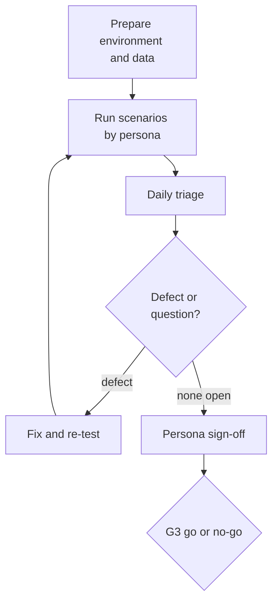

# Introduction

This plan describes how TASCO Insurance and VETC accept the platform before the pilot. It sets out the approach, the business scenarios by persona, the entry and exit criteria, how defects are triaged, the schedule and the sign-off.

UAT confirms that the platform supports TASCO's and VETC's business processes end to end and is fit for a controlled pilot. It does not repeat the automated functional tests; it confirms the business outcome with the people who will use the system.

The audience is the TASCO Product Owner, who owns the plan, the persona leads and testers in TASCO and VETC, TASCO Compliance, and the iorta TechNXT QA Lead, who facilitates.

Related documents:

- TGP-QA-01 Test Strategy (defect severity, known issues).
- TGP-QA-02 Test Case Catalogue (the cases each scenario maps to).
- TGP-MAN-01 Staff Console User Manual and TGP-MAN-02 Customer App Guide (step-by-step scripts per role, issued after the user interface redesign).
- TGP-UX-04 Usability Testing Plan (observation alongside UAT).
- TGP-OPS-04 Production Readiness Checklist (conditions attached to acceptance).

Results are recorded in the workbook TASCO-Test-Cases-and-Results.xlsx.

# Approach

UAT is scenario-based. Real users of each role run business scenarios with explicit acceptance criteria: telesales agents from the pilot teams, campaign managers, compliance, data stewards, claims handlers, partner managers, a partner's integration developer, and VETC customer service staff acting as customers on test devices.

The cycle runs from preparation through daily execution and triage to sign-off by each persona lead and the Business Owner.

Two environments are used:

- Formal UAT environment: PostgreSQL, demo mode off, production adapters pointing at the VETC, TASCO core and Zalo UAT endpoints, synthetic data and partner test identities, no production personal data. Acceptance is decided here.
- Hosted UAT on Railway (https://tasco-growth-api-uat.up.railway.app). Sandbox adapters and demo accounts. Used for tester training, walkthroughs and early feedback before the formal window. Access and the password are issued in the UAT access workbook, never in documents.

The business date is pinned for the journey scenarios so that reminders fall due on the planned days. Contact-window scenarios run at the real time of day in the formal environment, because simulated times are ignored outside demo mode.

Usability is observed alongside, as described in TGP-UX-04: task success, time on task and the SUS questionnaire.

## User accounts

The formal UAT uses named accounts, not the demo users. Administrators, rule approvers, compliance officers and data stewards must use an authenticator app. Each user sets it up at first sign-in (the QR code is shown only to them) and changes the initial password. A locked-out user, or one who has lost their phone, is unlocked or reset by an administrator. Telesales agents and supervisors are assigned to a region.

On the hosted UAT the demo accounts are used. They are unlocked and reset at every start-up, the MFA screen offers "Sign in with demo code (UAT)", and the sign-in page has no role shortcuts.

## Test data

| Data set | Source | Volume |
|---|---|---|
| Vehicle base | Synthetic generator with a fixed seed per cycle, plus the reference profiles below | 50,000 |
| Reference profiles | Hand-crafted for deterministic scenarios | 12 |
| Customer test identities | VETC test accounts with test wallets, Zalo test accounts, test SIMs | 20 |
| Partner keys | `P-BANK-UAT`, `P-SHOWROOM-UAT` | 2 |

| Reference | Profile | Used in |
|---|---|---|
| UAT-REF-01 | Hà Nội car under 6 seats, TASCO-insured, expiry in 30 days, verified, all consents | UAT-CM-01, UAT-CU-01 |
| UAT-REF-02 | TP. Hồ Chí Minh car, other insurer, expiry in 14 days, confidence 0.7, call consent | UAT-TS-01, UAT-VB-01 |
| UAT-REF-03 | Hà Nội, expiry unknown (confidence below 0.5) | UAT-CU-02, UAT-DS-01 |
| UAT-REF-04 | Hà Nội, lapsed 10 days | UAT-CM-02 |
| UAT-REF-05 | On the do-not-contact list | UAT-CO-03 |
| UAT-REF-06 | No marketing consent, call consent only | UAT-CO-02 |
| UAT-REF-07 | Company-owned fleet vehicle | UAT-CM-03 |
| UAT-REF-08 | Expired policy, no active cover, has messages and calls | UAT-CO-05 |
| UAT-REF-09 | Active TASCO policy | UAT-CO-05 |
| UAT-REF-10 | New toll tag activated 3 days ago | UAT-CM-04 |
| UAT-REF-11 | Conflicting phones across two sources | UAT-DS-02 |
| UAT-REF-12 | Plate not in the base | UAT-PA-01 |

# Business scenarios

Status values in the execution log are Not run, Pass, Pass with minor defects, Fail and Blocked.

## Campaign manager

| ID | Scenario | Acceptance criteria | Related cases |
|---|---|---|---|
| UAT-CM-01 | Review the renewal pipeline for the pilot cities and understand why a lead is hot | Leads filter by tier, journey and expiry; score reasons are clear without technical help; benefits match the customer's use | TC-042, TC-049 |
| UAT-CM-02 | Review the daily journey run (08:15) or run it manually within contact hours | Run summary (done, skipped, deferred, cancelled by channel and journey) matches the reference profiles; skip reasons are clear | TC-050 to TC-059 |
| UAT-CM-03 | Confirm that company vehicles go to the business sales team and are not called | Fleet vehicle routed to business sales; excluded from voice campaigns | TC-045 |
| UAT-CM-04 | A VETC event (tag activated, inspection booked) triggers the right journey or message | Correct template; service or marketing classification agreed with Compliance | TC-063 |
| UAT-CM-05 | Read the overview dashboard and the economics view | Figures reconcile with the actions performed; costs use the configured rates | — |

## Telesales agent and supervisor

| ID | Scenario | Acceptance criteria | Related cases |
|---|---|---|---|
| UAT-TS-01 | Take a hot lead from the voice bot, read the summary, call the customer and send the renewal link | Summary shows a masked phone, the plate confirmed by the customer, price and trust signals; the lead is assigned to the agent; the note is saved; the lead is won after purchase | TC-070, TC-025 |
| UAT-TS-02 | Quote TNDS with personal accident cover per seat by phone, send the quote to the customer's VETC app or Zalo, and have the customer pay in the app during the call | TNDS premium as regulated; no discount wording; the agent cannot take payment; the customer pays once even on a double tap; the e-certificate QR verifies | TC-072 to TC-074, TC-156, TC-157 |
| UAT-TS-03 | Agent in Hà Nội tries to open a TP. Hồ Chí Minh customer | Access refused with a clear message | TC-024 |
| UAT-TS-04 | Supervisor reassigns work and sees the whole team queue | Only the supervisor can reassign; activity recorded | TC-026 |
| UAT-TS-05 | Agent rehearses the voice bot script in the console | Script discloses automation first and checks the plate first; transcript shows Vietnamese with an English gloss | TC-064, TC-148 |
| UAT-TS-06 | Quote physical damage cover | Payment is blocked until a vehicle inspection is recorded; the customer app explains why | TC-163 |
| UAT-TS-07 | Quote while TASCO core is unavailable, then confirm the final price when core is back | Core only: the agent sees "try again shortly" and no quote is created. Core with indicative fallback: the quote is marked indicative, cannot be paid, and becomes payable once it has been re-rated with TASCO core (by the agent, or by the customer in the app) | TC-167, TC-168, TC-171 |

## Voice bot campaign

Operated by the campaign manager and observed by Compliance.

| ID | Scenario | Acceptance criteria | Related cases |
|---|---|---|---|
| UAT-VB-01 | Campaign to 20 hot leads with the real voice vendor on test SIMs | Calls only between 08:00 and 20:00 and only with call consent; outcomes recorded; handoffs created | TC-135, TC-154, TC-162 |
| UAT-VB-02 | Tester gives a wrong plate | Call ends politely; no personal data disclosed; data issue raised | TC-066 |
| UAT-VB-03 | Tester asks not to be called again | Bot confirms; customer added to the do-not-contact list; no further calls or marketing | TC-068 |
| UAT-VB-04 | Tester says the plate as the bot suggests ("ba mươi A, …") and a motorbike plate | Both verified | TC-065 |

## Customer (VETC app and Zalo)

Run by VETC customer service testers on test devices.

| ID | Scenario | Acceptance criteria | Related cases |
|---|---|---|---|
| UAT-CU-01 | Receive a renewal reminder, open the link and renew in three taps or fewer with the VETC wallet | Link opens the right vehicle; regulated premium; paid once; e-certificate shown; confirmation received; reminders stop | TC-073, TC-059, TC-150 |
| UAT-CU-02 | Confirm the current expiry date | Date saved; confirmation prompt cleared; lead re-evaluated | TC-035 |
| UAT-CU-03 | Turn off marketing and calls in the consent centre | Takes effect at once; service messages still arrive | TC-053, TC-054 |
| UAT-CU-04 | Report an accident with photos | Claim reference shown; status visible; acknowledgement time communicated | TC-100 |
| UAT-CU-05 | Download my data | Export complete and readable | TC-105 |
| UAT-CU-06 | Scan the certificate QR as a third party (for example traffic police) | Validity, product, period and masked plate shown; no name or phone | TC-074 |
| UAT-CU-07 | Renew with a screen reader on iOS and Android | Flow can be completed; WCAG 2.2 AA issues logged | TC-145 |

## Rule author, rule approver and compliance officer

| ID | Scenario | Acceptance criteria | Related cases |
|---|---|---|---|
| UAT-RU-01 | Author changes lead scoring weights in the rules studio, simulates on UAT-REF-01 to 04 and submits; approver approves | Simulation shows before and after; approval activates the new version and retires the old one; all servers use it within 15 seconds; activity recorded | TC-093, TC-097, TC-099 |
| UAT-RU-02 | Author adds "giảm giá" or "hoàn tiền" to a message or benefit | Rejected with a clear wording error | TC-095 |
| UAT-RU-03 | Administrator gives one person author and approver roles; author approves own change | Role combination refused; approval refused | TC-027, TC-090 |
| UAT-RU-04 | A wrong rule is activated and rolled back | Roll back creates a draft that needs approval; old behaviour returns after approval | TC-094 |
| UAT-RU-05 | Commission above the statutory cap | Rejected | TC-084 |
| UAT-RU-06 | Approver reviews a product catalogue change proposed by the nightly TASCO core sync | Proposal shows added, changed and withdrawn products in business terms; new products are not on sale until channels are configured; approval by a person other than the proposer | TC-172 |

## Compliance officer

| ID | Scenario | Acceptance criteria | Related cases |
|---|---|---|---|
| UAT-CO-01 | Review every active customer message, voice script and benefit text in Vietnamese | Signed content inventory; no discount, rebate or cashback language; disclosures present | TC-147, TC-061 |
| UAT-CO-02 | Marketing attempted at 07:30 and 20:15, and to a customer without marketing consent | Blocked with the right reasons | TC-050, TC-052, TC-053 |
| UAT-CO-03 | Any contact with a do-not-contact customer | Blocked on every channel; voice session refused | TC-055 |
| UAT-CO-04 | Frequency caps | At most 1 marketing message a day and 3 a week; at most 2 calls a week | TC-056, TC-057 |
| UAT-CO-05 | Erasure requests for UAT-REF-09 (active policy) and UAT-REF-08 | REF-09 refused with the legal-obligation message; REF-08 anonymised; activity recorded | TC-106, TC-107 |
| UAT-CO-06 | Review the audit trail and check its integrity | Integrity verified; actions traceable to named users | TC-110 |
| UAT-CO-07 | Benefits pending legal review do not reach customers | Loyalty points not visible in the app | TC-041 |

## Data steward

| ID | Scenario | Acceptance criteria | Related cases |
|---|---|---|---|
| UAT-DS-01 | Correct a customer's expiry with evidence | Saved with evidence in the audit trail; lead recomputed | TC-037 |
| UAT-DS-02 | Work the data quality queue (conflicting phone, invalid plate, plate mismatch from the bot) | Issues shown by type; resolution recorded | TC-034, TC-038 |
| UAT-DS-03 | Import a masked partner file and review the data sources | Counts reconcile; source shown per field | TC-032, TC-040, TC-112 |

## Partner manager and partner developer

| ID | Scenario | Acceptance criteria | Related cases |
|---|---|---|---|
| UAT-PA-01 | Onboard a partner, issue a key, and let the partner quote and bind a new plate | Key shown once; quote and order succeed; policy appears in the partner's list | TC-083, TC-086 |
| UAT-PA-02 | Partner tries to bind another partner's quote | Refused as not found | TC-081 |
| UAT-PA-03 | Commission statement for a period | Totals match orders and capped rates; agreed by TASCO Finance | TC-085 |
| UAT-PA-04 | Suspend the partner or revoke the key | Next call refused at once | TC-089 |
| UAT-PA-05 | Partner developer integrates from the API documentation alone | Integration done without undocumented behaviour | TC-133 |

## Claims handler

| ID | Scenario | Acceptance criteria | Related cases |
|---|---|---|---|
| UAT-CL-01 | Work the claims queue: acknowledge, assign assessor, assess, approve, mark as paid | Only valid next steps offered; history visible to the customer | TC-103, TC-104 |

## Executive, auditor, administrator and support

| ID | Scenario | Acceptance criteria | Related cases |
|---|---|---|---|
| UAT-EX-01 | Executive reviews growth and adoption dashboards | Figures reconcile with the UAT activity log; read-only | — |
| UAT-AU-01 | Auditor searches the audit trail by object, person and activity | Results complete; no personal data in details | TC-110 |
| UAT-AD-01 | Administrator creates, changes and disables users | Disabled user locked out at once; administrator cannot see customer personal data | TC-011, TC-022 |
| UAT-AD-02 | Administrator unlocks a user and resets MFA for a user who lost their phone | Reset works; user sets up again at next sign-in; administrator never sees the secret and cannot reset own account; activity recorded | TC-010 |
| UAT-OP-01 | Support engineer checks operations status and integration health, runs reconciliation and the event relay, reads job history | Matches TGP-OPS-01; failed and compensated orders flagged; TASCO core circuit and last catalogue sync visible | TC-113, TC-175 |

# Entry criteria

| # | Criterion | Evidence |
|---|---|---|
| E1 | SIT exit met: all P1 SIT cases passed, no open Sev 1 or 2 interface defects | SIT report, 15/01/2027 |
| E2 | UAT environment deployed from a release candidate; readiness and audit verification green | Deployment record |
| E3 | Data loaded, including reference profiles; business date set and recorded | Data load checklist |
| E4 | Named accounts created, MFA set up, regions confirmed | User list export |
| E5 | Testers trained (one hour per persona) | Attendance list |
| E6 | Known issues relevant to UAT fixed and regression-tested (KI-01, KI-02, KI-06, KI-09, KI-25, KI-28, KI-29, KI-31, KI-32, KI-33); remaining open items briefed with workarounds | TGP-QA-01 known issues |
| E7 | Zalo templates approved for UAT (or a test account in use); VETC test wallets funded; TASCO core UAT credentials issued | Partner confirmations |

# Exit criteria

| # | Criterion |
|---|---|
| X1 | All scenarios executed; at least 95 % passed |
| X2 | No open Sev 1 or Sev 2 defects, or Sev 2 waived in writing by the Business Owner with a fix date before the ramp-up to the full pilot cohort on 15/02/2027 |
| X3 | All compliance scenarios (UAT-CO-01 to 07, UAT-RU-02, 03, 05, UAT-VB-01, 03) passed. No waiver is possible |
| X4 | Usability: task success at least 90 % on UAT-TS-01, UAT-TS-02 and UAT-CU-01; SUS at least 70 |
| X5 | Sign-off sheet (Appendix) signed by every persona lead and the Business Owner |

# Defect triage

Triage takes place daily at 16:30 for 30 minutes, chaired by the TASCO Product Owner with the QA Lead, Tech Lead, a VETC representative and, when a compliance defect is open, Compliance. Severity follows TGP-QA-01; the Product Owner sets business priority.

Defects carry the request ID shown on screen or in the API response, the persona, the scenario ID and the reference profile, never customer personal data. Fixes reach the UAT environment at most once a day, at 08:00, with release notes, and are re-tested the same day. Requests that change agreed behaviour go to the Product Owner's backlog as change requests, not defects.

| Severity | Response in UAT | Fix target |
|---|---|---|
| Sev 1 | Same day; the affected scenario stops | Next daily build |
| Sev 2 | Next triage | Within 2 business days |
| Sev 3 | Next triage | Before go-live, or waived |
| Sev 4 | Backlog | After go-live |

# Schedule

| Date | Activity |
|---|---|
| 14 to 15 January 2027 | Environment prepared; data loaded; accounts created; entry criteria reviewed |
| Monday 18 January | Kick-off at 09:00; training per persona; execution starts |
| 18 to 22 January | Execution: day 1 campaign, rules and compliance; day 2 telesales and voice; day 3 customer app and partners; day 4 data steward, claims and support; day 5 catch-up and usability sessions |
| Monday 25 January | Fix and re-test; regression of fixed areas |
| Tuesday 26 January, morning | Final triage; sign-off sheet completed; UAT report to the Product Owner and Business Owner |
| Tuesday 26 January, afternoon | G3 go or no-go at the Steering Committee; M3 Acceptance milestone |

# Roles

| Role | Organisation | Responsibility |
|---|---|---|
| UAT manager | TASCO Product Owner | Owns the plan; chairs triage; coordinates sign-off |
| UAT facilitator | iorta TechNXT QA Lead | Environment, data, scripts, defect logging, daily report |
| Persona leads | TASCO business units, VETC customer service | Run scenarios; sign per persona |
| Compliance reviewer | TASCO Compliance | Compliance scenarios and content inventory sign-off |
| Support | iorta TechNXT engineering and operations | Fix deployments and environment issues, following TGP-OPS-01 |

# Appendix

## Sign-off sheet

| Persona or area | Scenarios | Executed and passed | Open defects and waivers | Persona lead | Decision, signature and date |
|---|---|---|---|---|---|
| Campaign manager | UAT-CM-01 to 05 | | | | |
| Telesales agent and supervisor | UAT-TS-01 to 07 | | | | |
| Voice bot campaign | UAT-VB-01 to 04 | | | | |
| Customer (VETC app and Zalo) | UAT-CU-01 to 07 | | | VETC Product Owner | |
| Rules | UAT-RU-01 to 06 | | | | |
| Compliance | UAT-CO-01 to 07 | | No waivers permitted | TASCO Compliance Officer | |
| Data steward | UAT-DS-01 to 03 | | | | |
| Partners | UAT-PA-01 to 05 | | | | |
| Claims | UAT-CL-01 | | | | |
| Executive, auditor, administrator, support | UAT-EX-01, UAT-AU-01, UAT-AD-01, UAT-AD-02, UAT-OP-01 | | | | |
| Overall acceptance | 50 scenarios | | | TASCO Business Owner | |

Decisions are Accept, Accept with conditions, or Reject. Conditions attached to an acceptance are copied to TGP-OPS-04 Production Readiness Checklist with an owner and due date.
