# Introduction

## Purpose

This document defines the visual language and the component library of the TASCO Growth Platform. It records the design tokens as they are implemented, explains how the TASCO Insurance brand from baohiemtasco.vn is carried into the staff console and the customer app, and gives usage rules for every shared component so that new screens look and behave like the existing ones.

## Scope

The staff console, the customer app in all four hosts (VETC app, Zalo Mini App, TASCO app and TASCO website) and the public certificate check page. Interaction rules, wording, formats and accessibility commitments are in TGP-UX-02; navigation and the screen inventory are in TGP-UX-03.

Every value in this document is taken from the code delivered for user acceptance testing. Where a value is a placeholder until TASCO supplies an asset, it says so and the item is listed for sign-off.

## Audience

TASCO marketing and the product owner, who confirm the brand use; designers and front-end engineers at iorta TechNXT and TASCO, who build new screens; QA, who checks screens against these rules.

## Related documents

| ID | Title |
|---|---|
| TGP-UX-02 | UX Standards and Accessibility |
| TGP-UX-03 | Information Architecture and Navigation |
| TGP-MAN-01 | Staff Console User Manual |
| TGP-MAN-02 | Customer App Guide |
| TGP-ARC-07 | Architecture Decision Records |

# Design principles

The redesign answered one complaint from TASCO: the first console looked technical and generated rather than designed. Six principles guide every screen since.

| Principle | What it means on screen |
|---|---|
| Business language only | Labels come from the label dictionary in Vietnamese and English. No internal codes, JSON, hashes or record identifiers outside a collapsed "Technical details" section for technical roles. |
| One next step | Each row, card or step has one primary action named with a verb. Secondary actions sit in a menu. |
| Status once | A record's state appears once, as a chip. Progress is shown with a stepper, deadlines with an SLA chip. |
| Calm density | White cards on a light grey page, a 24 px grid, Inter for dense data and no paragraphs inside cards. |
| Brand on surfaces, contrast in the ink | The light TASCO teal fills large surfaces; text and filled buttons use darker teals that pass WCAG 2.2 AA. |
| One component library | Every page is built from the same components, so a pattern learnt once works everywhere. |

# Brand foundations

## Alignment with baohiemtasco.vn

TASCO asked for the platform to feel like a TASCO product. The visual language follows the TASCO Insurance website and the e.baohiemtasco.vn quote form.

| Website element | Where it appears in the platform |
|---|---|
| Teal utility bar with the hotline 1900 1562 | 36 px utility strip above the console top bar, and on the certificate check page |
| White navigation bar with the logo on the left | Console sidebar header and customer app bar, both with the wordmark |
| Navy headings in a wide geometric typeface | Lexend in navy #213368 for page titles, card titles, navigation and buttons |
| Navy and teal diagonal parallelogram bands | Home hero band in the customer app, the Account footer band and the staff sign-in panel |
| Quote form in a white card: teal title, two-column teal radios, units inside inputs, full-width teal button | Step 1 of the purchase flow and the vehicle confirmation card |
| Round navy chat button at the bottom right | Floating support button in the customer app |
| Teal footer with the white logo | Footer band at the foot of the customer app's Account tab |

## The wordmark

TASCO's logo file has not yet been supplied, and the platform does not copy the image from the website. In its place a typographic wordmark is drawn in code: "TASCO" in navy, Lexend 700 with wide letter spacing, above "INSURANCE" in teal at about a third of the size with very wide tracking. A white version is used on navy and teal backgrounds, and the dark theme switches the colour version to white and light teal automatically.

The wordmark is a stand-in. It is built as one component (`wordmark()` in `public/js/shared/brand.js`), so the official logo replaces it in one place once TASCO marketing supplies the files. Its accessible name is "TASCO Insurance".

| Size | Height of "TASCO" | Used in |
|---|---|---|
| Small | 18 px | Customer app bar, mobile sign-in header |
| Medium | 26 px | Console sidebar, Account footer band |
| Large | 40 px | Customer app splash screen |
| Extra large | 56 px | Staff sign-in brand panel |

## Co-branding by host

Inside the VETC app and the Zalo Mini App the app bar shows the wordmark, a multiplication sign and a navy "VETC" tag, read as "TASCO × VETC". In the TASCO app and on the TASCO website the wordmark stands alone. The host also changes the payment wording (TGP-UX-03 describes what changes by host).

## Sign-in page

The staff sign-in page mirrors the website's split layout. The left part is a brand panel drawn in CSS and SVG, because TASCO's building photograph is not licensed for this use: a navy-to-teal gradient, the diagonal bands, a faint pattern of glass façade lines and the white wordmark with the line "Motor insurance growth platform". The right part holds the form on the light page background, with a large navy "Sign in" heading, 52 px fields, a full-width action-teal button and the hotline and e-mail at the foot. Below 900 px wide the brand panel is hidden and a small wordmark heads the form.

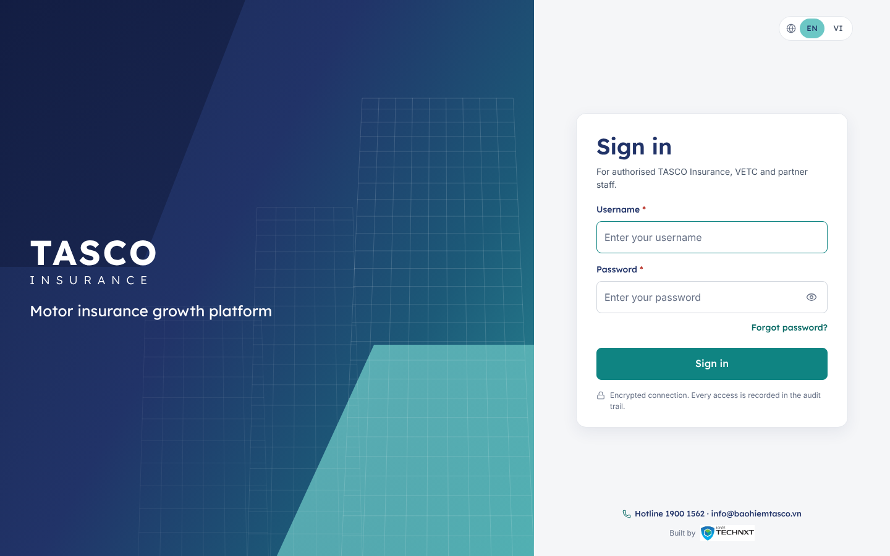{width=16cm}

# Colour

## The teal rule

The TASCO brand teal #6CC7C5 is light. White text on it reaches only 1.98:1, far below the 4.5:1 that WCAG 2.2 AA requires for normal text. The platform therefore uses three teals, each for one job.

| Teal | Hex | Job | Contrast |
|---|---|---|---|
| Brand teal | #6CC7C5 | Large surfaces: utility strip, bands, footer, selected states, focus halo. Always with navy text | Navy on it 6.11:1 |
| Action teal | #0F8482 | Filled primary buttons with white text; selected radio and checkbox marks | White on it 4.52:1 |
| Link teal | #0B6B66 | Teal text, links, the "INSURANCE" line of the wordmark, hover of the action teal | 6.35:1 on white, 5.87:1 on the page background |

The action teal is the lightest teal on the brand hue (178.7°) that reaches 4.5:1 against white. The rule is written into the header of `public/css/tokens.css` so that engineers see it where they change colours. Text in brand teal on white is never used.

## Brand and interactive tokens

| Token | Light | Dark | Use |
|---|---|---|---|
| `--brand-navy` | #213368 | #213368 | Headings, wordmark, navy surfaces |
| `--brand-teal` | #6CC7C5 | #6CC7C5 | Brand surfaces with navy text |
| `--primary` | #0F8482 | #6CC7C5 | Primary button fill |
| `--primary-contrast` | #FFFFFF | #0E1A3D | Text on the primary fill |
| `--primary-hover` | #0B6B66 | #8AD5D3 | Primary button hover |
| `--link` | #0B6B66 | #7FDCD8 | Links and teal text |
| `--nav-active-bg` | #6CC7C5 at 18 % | #6CC7C5 at 16 % | Active sidebar item, active tab icon |
| `--focus` | #0F8482 | #8AD5D3 | Focus outline |

Secondary buttons have a navy border and navy text (a light-teal border in the dark theme). The focus ring is a 3 px light-teal halo with a 1 px action-teal line inside it, so it shows on white, grey and teal backgrounds alike.

## Text and surfaces

| Token | Light | Dark | Use | Contrast (light) |
|---|---|---|---|---|
| `--bg` | #F5F6F8 | #0B1430 | Page background | |
| `--surface` | #FFFFFF | #111D3F | Cards, drawers, dialogs | |
| `--surface-2` | #F8F9FB | #15234A | Table headers, subtle panels | |
| `--text` | #101828 | #E8ECF4 | Body text | 17.75:1 on white |
| `--text-muted` | #475467 | #AEB9D0 | Secondary text, labels | 7.69:1 on white |
| `--text-subtle` | #667085 | #8F9CB8 | Meta text, placeholders | 4.97:1 on white, 4.60:1 on the page |
| `--heading` | #213368 | #EEF1F8 | Headings | 12.08:1 on white |
| `--border` | #E4E7EC | #26386B | Card and table borders | |
| `--border-strong` | #D0D5DD | #34497F | Button and chip borders, dividers | |
| `--border-input` | #8A94A6 | #6A7FB3 | Form-field borders, 3.06:1 on white | |

## Semantic colours

Semantic colours carry meaning in chips, banners and toasts. They always come with a word and usually an icon, never colour alone.

| Tone | Text | Background | Used for | Contrast |
|---|---|---|---|---|
| Success | #067647 | #ECFDF3 | Active, approved, paid, won, on track | 5.40:1 |
| Warning | #93370D | #FFFAEB | Awaiting approval, callback, due soon | 7.21:1 |
| Danger | #B42318 | #FEF3F2 | Rejected, lost, failed, breached | 6.05:1 |
| Information | #1D4ED8 | #EFF4FF | Submitted, in progress, scheduled | 6.08:1 |
| Neutral | #344054 | #F2F4F7 | Draft, closed, skipped | 9.49:1 |

In the dark theme the same tones use light text on deep backgrounds (for example success #6CE9A6 on #0D2A1E, 10.13:1). Lead tiers reuse the tones: Hot in danger red, Warm in warning amber and Nurture in grey.

## Chart palette

Charts use the brand colours first, then a grey and two semantic accents. Series keep the same colour across every chart.

| Series | Light | Dark |
|---|---|---|
| 1 | #213368 navy | #9DB0F0 |
| 2 | #0F8482 action teal | #6CC7C5 |
| 3 | #6CC7C5 brand teal | #B4E6E4 |
| 4 | #667085 grey | #98A2B3 |
| 5 | #DC6803 amber | #FDB022 |
| 6 | #C01048 rose | #F670A7 |

Series 3 is light against white (1.98:1). Every chart therefore also prints its values in the legend and offers "Show as table", so no reading depends on telling the light teal from the background.

# Typography

## Typefaces

Two typefaces are self-hosted under `public/fonts`, each with the Vietnamese, Latin and Latin Extended subsets, so that diacritics render in the same face as the rest of the word. Both are under the SIL OFL, and the licence files sit beside the fonts.

| Typeface | Weights | Used for |
|---|---|---|
| Lexend | 300, 400, 500, 600, 700 | Headings, navigation, buttons, tabs, KPI values, the utility strip, the whole customer app and the sign-in page |
| Inter | 400, 500, 600, 700 | Table cells, row actions, form input text, toolbars, small meta text and chart labels |

Lexend is the closest open typeface to the wide geometric face on baohiemtasco.vn. It is too wide for dense tables, so data stays in Inter, which keeps more columns readable at 1280 px. Inside the customer app, form inputs also use Inter so that typed plates and numbers read clearly.

## Type scale

| Token | Size | Typical use |
|---|---|---|
| `--fs-11` | 11 px | Collapsed-sidebar badges, chart axis labels |
| `--fs-12` | 12 px | Table headers, chips, meta text |
| `--fs-13` | 13 px | Secondary text, small buttons, utility strip, toolbars |
| `--fs-14` | 14 px | Console body text, buttons, navigation, tabs |
| `--fs-16` | 16 px | Card and drawer titles; customer app body text |
| `--fs-20` | 20 px | Section titles; quote form title in the customer app |
| `--fs-24` | 24 px | Page titles (H1) and KPI values |
| `--fs-30` | 30 px | Sign-in title on small screens |

The staff sign-in title is 36 px. Line height is 1.5 for text and 1.25 for headings. Numbers in tables, KPI tiles and amounts use tabular figures so that columns align.

## Headings

Page titles are Lexend 600 in navy with a 32 × 3 px brand-teal accent line under them. Card, drawer and dialog titles are Lexend 500 at 16 px. There is one H1 per page, and the router moves focus to it after every navigation.

# Spacing, layout and size

## Spacing

Spacing follows a 4-point scale: 4, 8, 12, 16, 24, 32, 48 and 64 px (`--sp-1` to `--sp-8`). Cards have 24 px padding, card headers 16 × 24 px, and the gap between cards and grid columns is 24 px. In the customer app the side gutter is 16 px and the gap between cards 16 px.

## Grid

Console pages use a 12-column grid with 24 px gutters and a main area that stops growing at 1,680 px. Common splits are 8 + 4 (list and side panel) and 6 + 6. Below 1,024 px every column becomes full width. KPI strips fill the row with tiles at least 200 px wide.

The customer app is a single column at most 480 px wide, centred on larger screens.

## Control sizes

| Control | Console | Customer app and sign-in |
|---|---|---|
| Buttons and inputs | 44 px | 52 px |
| Small buttons, table toolbar inputs | 32 px | 40 px |
| Large button | 48 px | 52 px |
| Icon button | 44 × 44 px | 44 × 44 px |
| Touch target minimum | 24 × 24 px with spacing | 44 × 44 px |

# Radius, elevation and motion

| Token | Value | Use |
|---|---|---|
| `--radius-sm` | 6 px | Chips inside controls, tooltips |
| `--radius` | 8 px | Buttons, inputs, selects |
| `--radius-card` | 12 px | Console cards, KPI tiles, dialogs |
| `--radius-card-lg` | 16 px | Customer app cards, sign-in card |
| `--radius-pill` | 999 px | Filter chips, status chips, global search |

Elevation is quiet. Console cards carry a 1 px shadow (`--shadow-xs`) and rely on their border. Raised brand cards, such as the sign-in card and the customer quote form, use a soft navy shadow (0 8 px 24 px at 8 % navy). Drawers, menus and dialogs use the larger shadows. Layers are ordered sticky header, sidebar, top bar, menus, drawer, dialog, toast, tooltip.

Motion is short: 120 ms for hovers, 180 ms for menus and 260 ms for drawers and sheets, all on one easing curve. When the user's system asks for reduced motion, every duration drops to zero and loading shimmer stops.

# Iconography

Icons come from Lucide, an open-source outline set under the ISC licence, vendored as a small module (`public/js/shared/icons.js`, about 110 icons) and drawn as inline SVG. Nothing loads from a third-party server, which keeps the strict CSP intact.

- Grid of 24, stroke 1.75, round joins, drawn in the current text colour.
- 18 px in navigation and buttons, 14 to 16 px in chips and tables, 20 to 24 px in the customer app.
- Decorative by default (hidden from screen readers). An icon that carries meaning on its own, such as an icon-only button, gets a text label.
- No emoji and no text glyphs (☎, ★, ◐, ?) as icons anywhere.

The same icon always means the same thing: shield-check for TNDS and claims, users for leads and seat accident cover, inbox for the telesales inbox, scale for business rules and the regulated price, history for audit, headset for customer support.

# Console components

All console components live in `public/js/console/ui.js` with styles in `public/css/components.css`. They build the page with safe DOM helpers only, never with injected HTML. The engineering reference with code examples is kept with the source; this chapter gives the design and usage rules.

## Anatomy of a console page

Every console page shares one frame and one page template.

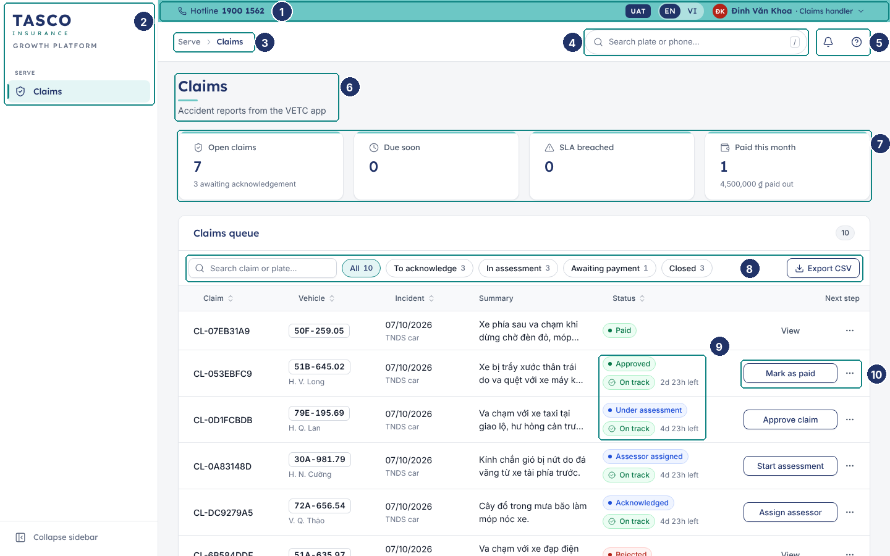{width=16cm}

| No. | Element | Rule |
|---|---|---|
| 1 | Utility strip | Brand teal with navy text: hotline, UAT badge in the test environment, EN / VI switch and user menu |
| 2 | Sidebar | Wordmark, then grouped pages for the role only; active item in light teal with a 3 px teal bar |
| 3 | Breadcrumb | Group and page, for example "Serve › Claims"; detail pages add the record |
| 4 | Global search | White pill; plate or phone, opens Customer 360 |
| 5 | Notifications and Help | Bell with a count, contextual help panel |
| 6 | Page header | H1 with teal accent, optional subtitle of one short line, primary actions on the right |
| 7 | KPI strip | Up to five tiles; a tile that filters the list below is a button |
| 8 | Table toolbar | Search, filter chips with counts, export on the right |
| 9 | Status and SLA chips | Status shown once; deadline as On track, Due soon or Breached with time left |
| 10 | Row actions | One verb button of fixed width, then the ⋯ menu |

## Buttons

| Variant | Look | Use |
|---|---|---|
| Primary | Action teal fill, white text | The one main action in a view, card, dialog or row |
| Secondary | White, navy border and text | Other actions next to a primary, and row actions |
| Ghost | No border, grey text | Low-emphasis actions and the muted "View" on closed rows |
| Danger | White, red border and text | Destructive actions in menus and dialogs |
| Danger solid | Red fill, white text | The confirm button of a destructive decision |
| Link | Link-teal text | Navigation inside text, such as "Forgot password?" |

- Labels are verbs in sentence case: "Approve claim", "Send quote", "Run now". A status name is never a button label.
- One primary button per view or card. In dialogs the primary sits on the right, with Cancel or Back to its left.
- An icon may lead the label; icon-only buttons have a tooltip and an accessible name.
- A button that starts a request shows a spinner and blocks repeat clicks until the request ends.
- Disabled buttons are avoided where possible; when an action is blocked, a short reason is shown next to it.

## Inputs, selects and date input

Labels sit above fields in Lexend, with a red asterisk for required fields and "(Optional)" where that is clearer. One line of help text sits under the field. Errors replace nothing: they appear under the field in red with an icon, and the field gets a red border.

- Text inputs are 44 px in the console, 52 px in the customer app, with an 8 px radius and a light grey border; focus shows the teal ring.
- Units sit inside the input on the right, as on the TASCO website: "chỗ" for seats, "₫" for money, "(₫)" in the label for amounts in dialogs.
- Selects use the native control for reliability on every browser and screen reader.
- The date input takes dd/MM/yyyy with a typing mask and validates on leaving the field ("Invalid date (dd/mm/yyyy)").
- Forms use a responsive grid with columns at least 220 px wide; action buttons are right-aligned at the foot.

## Segmented control, radios, checkboxes and switch

| Control | Use | Rule |
|---|---|---|
| Segmented control | Two to four views of the same data, such as Policies or Premium on a chart, or the 1, 2 or 3-year term in the customer app | Changes the view at once; never used to submit |
| Radio group | One choice from a short list, all options visible | Two columns on the customer quote form ("Không" and "Có"); single column in the console |
| Checkbox | Independent options; row selection in tables | The label is clickable; descriptions sit under the label |
| Switch | A setting that applies immediately, such as consent in the customer app or "Only mine" in the inbox | Save happens on change and is confirmed by a toast; never inside a form that has a Save button |

## Status chips and badges

A status chip is a pill with a coloured dot and the business label from the dictionary, for example "Under assessment" or "Awaiting approval". Tones follow the semantic colours. Other badges carry counts, tiers (Hot, Warm, Nurture) or small markers such as "Masked".

- Each record shows its status once. If a row also needs a deadline, the SLA chip sits under the status chip.
- Filter chips are different: they are toggle buttons in the table toolbar, show a count and turn light teal when selected.

## SLA chips

An SLA chip has three states with a fixed icon: On track (green, check), Due soon (amber, clock) and Breached (red, warning triangle). The chip is followed by the time left or overdue in short form ("2d 23h left", "35m over"), and its tooltip gives the exact due time. "Due soon" starts 30 minutes before a telesales handoff deadline and one hour before a claim acknowledgement deadline; the windows are set in the Service levels rule set.

## KPI tile

A KPI tile shows a label with an icon, a large value in Lexend, an optional delta or hint line and an optional sparkline. A 3 px brand-teal line runs along the top. Tiles that filter the list below are buttons and show a hover state. Values use compact formats on dashboards ("17.2M ₫") and full numbers elsewhere.

## Card

Cards are white with a 1 px border and a 12 px radius. A card header holds a Lexend title, an optional one-line subtitle and actions on the right. Tables sit in "flush" cards without inner padding. Cards never contain explanatory paragraphs; help goes into field help, a tooltip, an empty state or the Help panel.

## Data table

Lists are tables inside a card, with a toolbar above and pagination below.

- The header row is sticky, in 12 px grey text; sortable columns show an arrow and announce the sort order.
- Rows highlight on hover and open the record on click or Enter. There are no zebra stripes.
- Numbers and amounts are right-aligned with tabular figures. Plates appear as plate tags.
- Long text is clipped to two lines; the full text opens in the detail drawer.
- The toolbar holds search (filters as you type), filter chips or selects, and "Export CSV" where users need the data in a spreadsheet. Exports use business labels and open correctly in Excel.
- The footer shows "Rows per page", the range ("1–25 of 2,223") and previous and next buttons.
- While loading, skeleton rows keep the layout still; with no rows, the table shows an empty state.
- Bulk actions appear in a bar above the table once rows are selected.

## Row actions

Workflow tables end with a "Next step" column built by one component: one secondary button of fixed width with a verb label, then the ⋯ menu for other and negative actions. Closed records show a muted "View". The full pattern, with labels for each workflow, is in TGP-UX-02.

## Drawer

The drawer slides in from the right over a dimmed page, in three widths (400, 480 and 720 px). It is used for record details and for forms that should not lose the list behind them, such as resolving a data issue or reviewing a rule change. Focus moves into the drawer, stays there until it closes, and returns to the row or button that opened it. Esc, the close icon and a click on the backdrop close it. Action buttons sit in a footer bar.

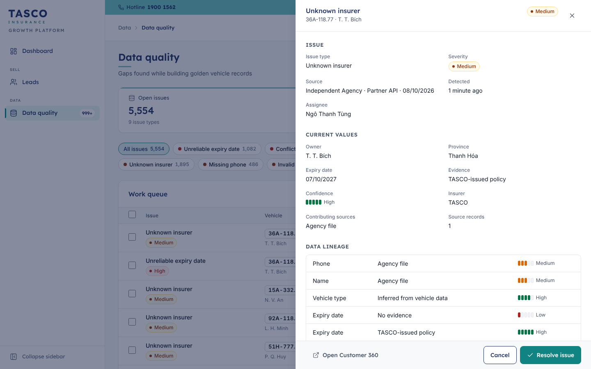{width=16cm}

## Modal and decision dialog

Modals are native dialogs, centred, in three widths. They are used for short tasks: change password, issue an API key, confirm a job run.

The decision dialog is a two-step modal for workflow decisions such as approving or rejecting a claim, rejecting a rule change or dismissing data issues. Step one asks for the data the decision needs (amount, reason, assessor, note) with inline validation and a "Review" button. Step two shows a summary under the banner "Check the details before you confirm" and the confirm button, labelled with the decision ("Confirm approval"). "Back" returns to the form. Destructive decisions use the danger solid button. The result is confirmed by a toast and the row updates in place.

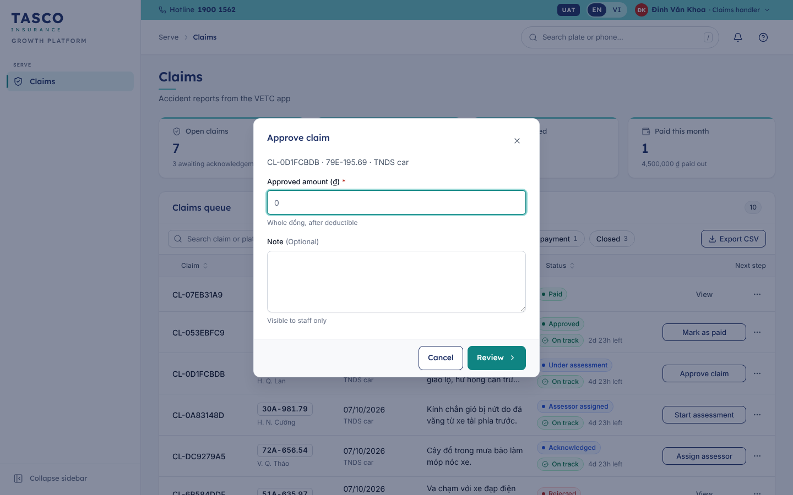{width=16cm}

## Toast and banner

Toasts appear at the bottom right, stack upwards and close after six seconds. Success is green, information blue, warning amber and errors red. An error toast shows a plain message and a short reference ("Ref. 7F3C2A1B") for the service desk. Toasts confirm actions; they never carry the only copy of information the user needs later.

Banners sit inside the page or a dialog and stay until dismissed or resolved: information, success, warning and error tones, with an icon, a title, one line of text and optional actions. The audit integrity banner and the indicative-price notice in the customer app are banners.

## Empty state and skeleton

An empty state has an icon in a grey circle, a short title, at most one line of text and, where useful, one action ("You're all caught up", "No notes yet"). A compact version is used inside cards and panels.

Skeletons are grey blocks in the shape of the content being loaded, with a gentle shimmer that stops under reduced motion. Whole pages show a skeleton while the router loads them, so the layout does not jump.

## Stepper and workflow steps

The horizontal stepper shows a fixed sequence with the current step highlighted, for example "Draft → Submitted → Approved → Active" on a rule version. The vertical workflow steps component is used in detail drawers: each step shows a marker (done, current, upcoming or failed), its label, who did it and when, and an optional note. Claims use it for Submitted → Acknowledged → Assessor assigned → Under assessment → Decision → Paid or Closed.

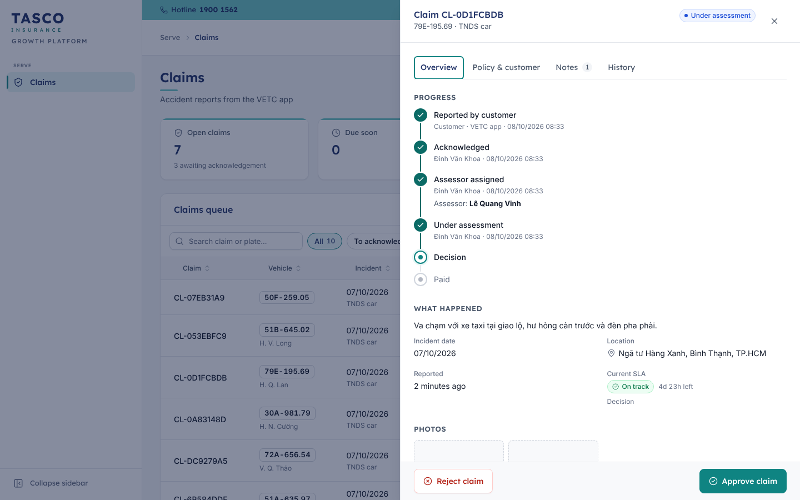{width=16cm}

## Timeline

The timeline lists events in human sentences, newest first: an icon in a circle, a title such as "Rule author submitted Lead scoring v3 for approval", a meta line and a relative time ("2 hours ago") with the exact time in a tooltip. It is used for the audit trail and Customer 360 activity.

## Key-value list

A key-value list is a definition list in one, two or three columns, with the label above the value in muted text. It is used for record facts in drawers and cards. An optional info icon explains a label in one line.

## Score ring and meters

The score ring shows a 0 to 100 score as a circular gauge with the number in the middle: red for Hot, amber for Warm, action teal otherwise. It has an accessible label such as "Score 79". Tables use a compact score bar. A confidence meter shows data confidence as five segments with the words High (80 % or more), Medium (50 % or more) or Low.

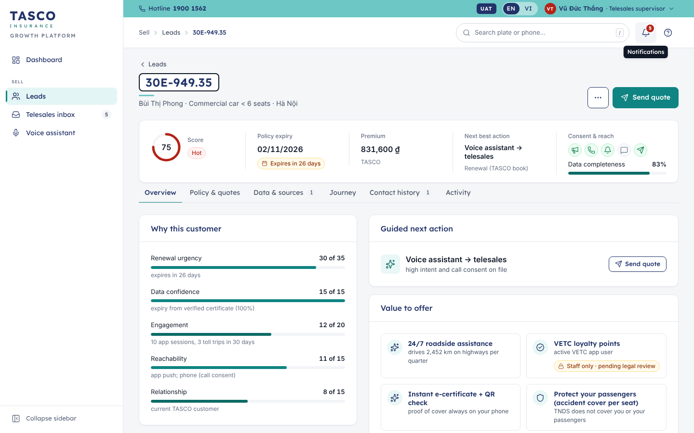{width=16cm}

## Charts

Charts are drawn as SVG by three components: bar, line and donut, plus a sparkline for KPI tiles.

- Each chart has a title and a short description for screen readers, and a "Show as table" link that reveals the data as a table.
- Donut legends list each slice with its value and share ("Conquest (other insurer) 1,756 · 85%"); line charts name each series under the plot.
- Donuts group anything beyond six slices as "Other". A total sits in the centre.
- Charts redraw when their container resizes, so text never scales with the drawing.
- Chart bars are not keyboard targets. If a bar is ever made clickable, the same list must also be reachable from the page's own filters.

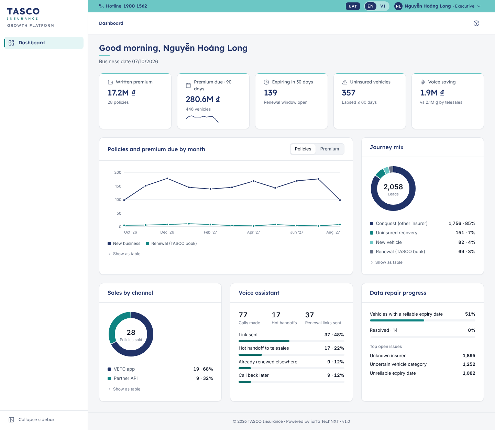{width=16cm}

## Tabs, menus and tooltips

Tabs follow the ARIA tabs pattern with arrow-key movement and optional counts ("Contact history 1"). Menus open from a button, move with the arrow keys and close with Esc; items can carry an icon, a short description, a radio tick or a red danger style. Tooltips appear on hover and on keyboard focus, hold one short line and never hold information that exists nowhere else.

# Customer app components

The customer app is built for phones from 360 to 430 px wide. Its components use the prefix `c-` in `public/css/customer.css` so that they can evolve without touching the console.

## Anatomy of the home screen

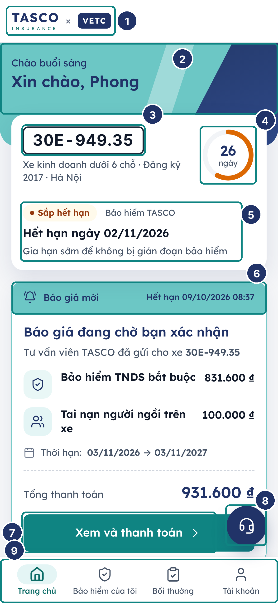{width=8cm}

| No. | Element | Rule |
|---|---|---|
| 1 | App bar | White, wordmark on the left; "× VETC" inside the VETC hosts |
| 2 | Hero band | Brand teal with the navy diagonal parallelogram; greeting in navy |
| 3 | Plate tag | Bordered like a number plate, formatted 30E-949.35 |
| 4 | Day ring | Days of cover left; amber when 45 days or fewer, red with a warning icon when lapsed |
| 5 | Cover status | Status chip, insurer, expiry line and one hint |
| 6 | Quote card | Teal header "Báo giá mới" with the expiry time of the quote |
| 7 | Primary button | Full width, action teal, one per screen section |
| 8 | Support button | Round navy button that opens the support sheet |
| 9 | Bottom tab bar | Four tabs; the active tab is link teal with a light-teal pill behind the icon |

## Quote form and vehicle confirmation card

Step 1 of the purchase flow is laid out like the e.baohiemtasco.vn quote form: a white card with a 16 px radius and soft shadow, the teal title "Bảo hiểm TNDS bắt buộc xe ô tô", a grey subtitle with the plate and vehicle, the question "Xe có kinh doanh vận tải không?" as two teal radio tiles in two columns, "Loại xe" (read-only, from the registration) and "Số chỗ ngồi" with the unit "chỗ" inside the field side by side, the 1, 2 or 3-year term as a segmented control with the regulated price line, optional add-ons as cards with switches, and the full-width button "Xem phí bảo hiểm".

On the review step the same vehicle questions appear in the vehicle confirmation card until the customer confirms them. Once confirmed, the card collapses to one summary line with an "Sửa" (edit) button.

::: {custom-style="Figure"}
{width=4.5cm} {width=4.5cm} {width=4.5cm}
:::

::: {custom-style="Caption"}
*Quote form, vehicle confirmation card open, and the same card after confirmation*
:::

The pending quote card on Home shows a quote sent by telesales: the teal header with its expiry time, each product with its amount, the period, "Tổng thanh toán" in large navy figures and the button "Xem và thanh toán".

## Plate tag

The plate tag looks like a Vietnamese number plate: dark 2 px border, white fill, bold dark figures with tabular spacing, formatted by the shared plate formatter (30E-949.35, 51B-645.02). It is never translated, masked or abbreviated in the customer app. In the console the plate tag is smaller and uses the same format.

## Bottom tab bar

Four tabs, each an icon above a label: "Trang chủ", "Bảo hiểm của tôi", "Bồi thường" and "Tài khoản". The bar is fixed to the bottom, 64 px high plus the phone's safe area, and stays visible on tab pages only. Task flows (buying, reporting an accident, confirming the expiry date) open full screen with a back arrow and a fixed action bar instead.

## Purchase stepper and action bar

The purchase stepper shows three numbered steps, "Chọn gói", "Xác nhận" and "Thanh toán", with a check on completed steps. The claim wizard uses a progress bar with "Bước 2/5" and the step name instead, because it has five steps. The action bar at the bottom of a flow holds the main button and, on the review step, the total to pay; when payment is blocked it shows the reason with a lock icon.

## Bottom sheet

Sheets rise from the bottom with a grab handle, a title, an optional subtitle and a close button. They trap focus and close with the close button, Esc or a tap outside, except where a decision is required. Sheets are used for the payment confirmation, the support options, the certificate QR code and the demo customer picker in demo environments.

## Support sheet and floating support button

The floating support button is a 56 px round navy button with a headset icon at the bottom right, above the tab bar, on every tab except Home. Home carries the main call to action, so there the same headset sits in the app bar instead. Both open the support sheet "Hỗ trợ khách hàng", which lists only the channels that are configured: call 1900 1562, the Zalo Official Account "Bảo hiểm Tasco" (a copy-the-name row until TASCO publishes a direct link), Messenger, the Fanpage, e-mail to info@baohiemtasco.vn and the TASCO website.

The button is shown on tab pages and on the expiry confirmation and claim flows. It is hidden throughout the purchase flow, so it can never cover the payment button.

::: {custom-style="Figure"}
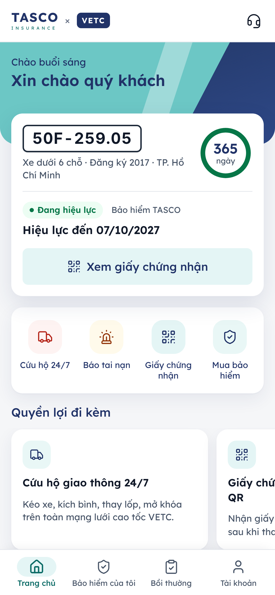{width=4.5cm} {width=4.5cm} 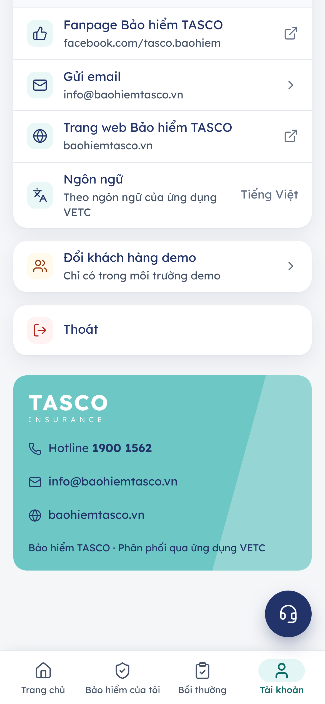{width=4.5cm}
:::

::: {custom-style="Caption"}
*Support button on Home, the support sheet, and the brand footer on the Account tab*
:::

## Brand footer

The Account tab ends with a brand-teal band carrying the white wordmark, the hotline, the e-mail address and the website in navy, with a lighter diagonal band on the right. The note under it reads "Bảo hiểm TASCO · Phân phối qua ứng dụng VETC" in VETC hosts and "Bảo hiểm TASCO" elsewhere.

## Other customer components

| Component | Rule |
|---|---|
| Buttons | 52 px, 8 px radius, Lexend 500. Primary in action teal; "soft" in light teal with navy text; ghost in link teal |
| Notices | Inline cards with an icon, title, one line and an optional small button (for example the indicative-price notice with "Xác nhận giá chính thức") |
| Icon chips | 40 px rounded squares in light teal with a navy icon, used for products, benefits and list rows |
| Benefit carousel | Swipe sideways, one benefit per card with a dot indicator; the list is also reachable by keyboard |
| Certificate card | Navy header with the white wordmark, the policy number, period, plate and QR code; the QR opens full screen for roadside checks |

# Dark theme

The console offers Light, Dark and System (following the computer's setting) in the user menu; the customer app and the certificate check follow the phone's setting. Both themes use the same tokens, so components need no extra code.

- Surfaces are deep navy (#0B1430 page, #111D3F cards); text is near-white (#E8ECF4) and muted text #AEB9D0.
- Primary buttons invert to brand teal #6CC7C5 with deep-navy text (8.6:1). Links become #7FDCD8.
- The utility strip stays brand teal with deep-navy text, so the TASCO band is recognisable in both themes.
- The colour wordmark turns white and light teal; the support button turns light teal with a navy icon.
- Semantic tones and chart colours switch to lighter variants that keep at least 4.5:1 on the dark surfaces.

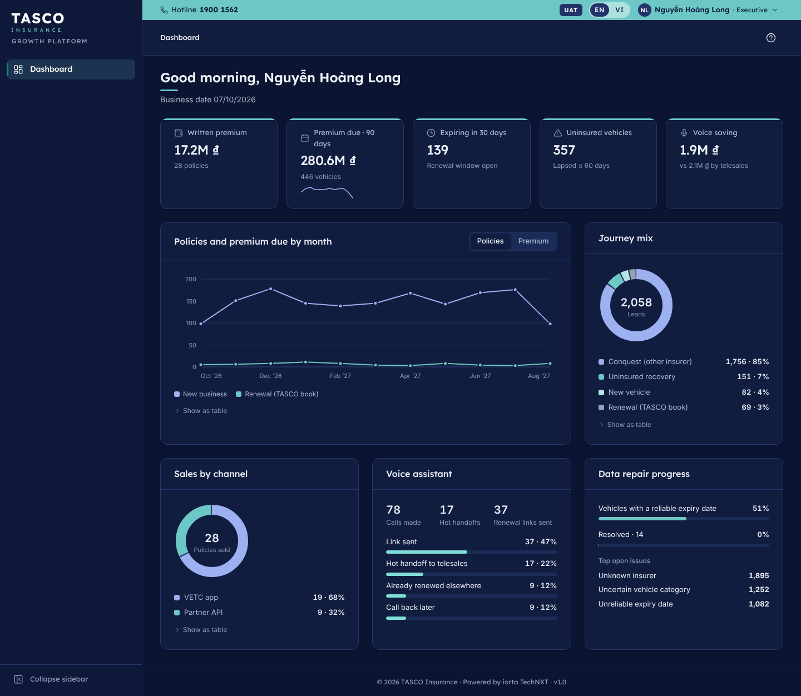{width=16cm}

# Governance of the design system

Tokens, components and these rules change through the same pull-request review as the code. A change to a colour, a type size or a component's behaviour updates `tokens.css` or `ui.js`, the component reference kept with the source, and this document in the same release. New colour pairings are checked for contrast in both themes before review.

TASCO marketing approves changes to brand elements: the logo, brand colours, typeface and co-brand lock-ups. The UX lead approves new components; a page-specific variant is preferred to a new component until the pattern is needed on a second page.

# Appendix

## Contrast checks

All ratios are computed with the WCAG 2.2 formula from the token values.

| Foreground | Background | Ratio | Result |
|---|---|---|---|
| White #FFFFFF | Brand teal #6CC7C5 | 1.98:1 | Fails; never used for text |
| Navy #213368 | Brand teal #6CC7C5 | 6.11:1 | Passes AA |
| White #FFFFFF | Action teal #0F8482 | 4.52:1 | Passes AA |
| Link teal #0B6B66 | White #FFFFFF | 6.35:1 | Passes AA |
| Link teal #0B6B66 | Page #F5F6F8 | 5.87:1 | Passes AA |
| Navy #213368 | Active nav tint #E5F5F5 | 10.77:1 | Passes AAA |
| Subtle text #667085 | Page #F5F6F8 | 4.60:1 | Passes AA |
| Deep navy #0E1A3D | Brand teal #6CC7C5 (dark buttons) | 8.60:1 | Passes AAA |
| Subtle text #8F9CB8 | Dark card #111D3F | 5.99:1 | Passes AA |
| Action teal #0F8482 (focus line) | White #FFFFFF | 4.52:1 | Passes the 3:1 non-text rule |

## Where things live

| Item | Source |
|---|---|
| Tokens and font declarations | `public/css/tokens.css` |
| Console components and brand layer | `public/js/console/ui.js`, `public/css/components.css` |
| Console shell and sign-in | `public/js/console/main.js`, `public/css/console.css` |
| Customer app components | `public/js/customer/app.js`, `public/css/customer.css` |
| Wordmark | `public/js/shared/brand.js` |
| Icons | `public/js/shared/icons.js` (Lucide, ISC licence) |
| Labels in Vietnamese and English | `public/js/shared/i18n.js` |
| Fonts and licences | `public/fonts` (Lexend and Inter, SIL OFL) |
