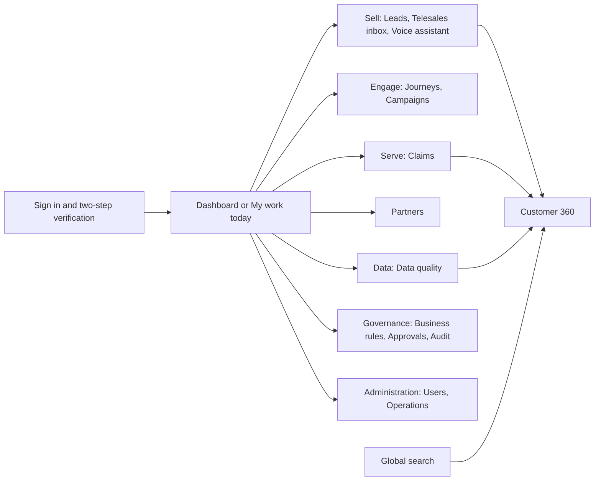
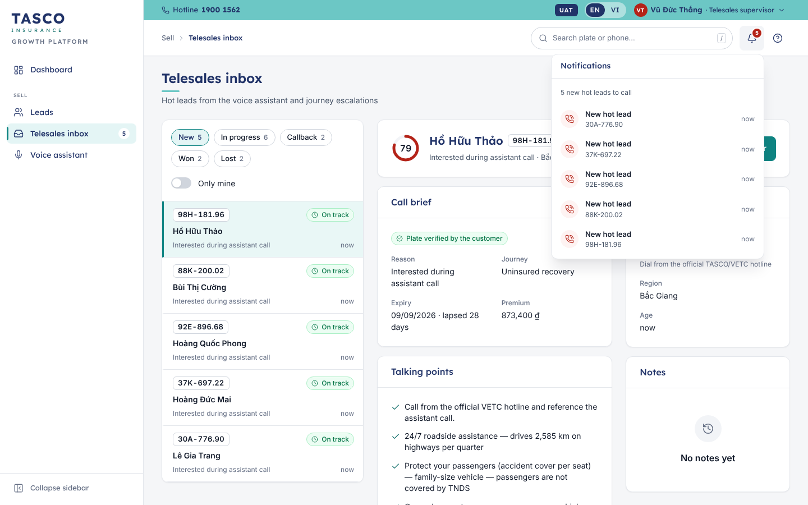
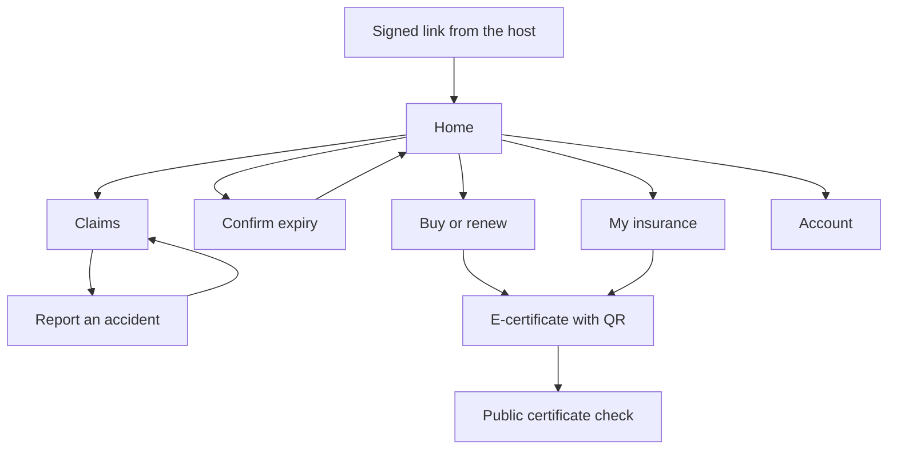
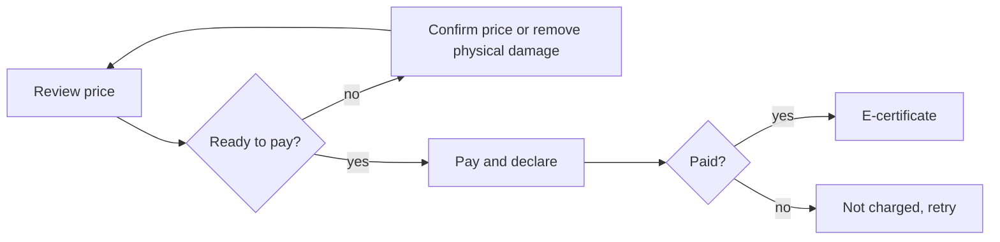

# Introduction

## Purpose

This document describes where everything lives in the TASCO Growth Platform and how people move around it: the staff console shell, the navigation each of the 13 staff roles sees, the inventory of screens, the customer app with its tabs and task flows, what changes when the app runs in a different host, and the deep links that open a given screen.

## Scope

The staff console, the customer app and the public certificate check, as delivered for user acceptance testing. The partner API has no user interface and is covered by TGP-MAN-03. Persona journeys, emotional curves and service blueprints are in TGP-BUS-06 Personas and Customer Journeys; this document covers only the screens and the paths between them.

## Audience

The TASCO product owner and business leads, who confirm the navigation; designers and engineers who add screens; trainers and testers who need the map of the product.

## Related documents

| ID | Title |
|---|---|
| TGP-BUS-06 | Personas and Customer Journeys |
| TGP-UX-01 | Design System |
| TGP-UX-02 | UX Standards and Accessibility |
| TGP-MAN-01 | Staff Console User Manual |
| TGP-MAN-02 | Customer App Guide |
| TGP-ARC-04 | Security Architecture |

# Surfaces

| Surface | Address | Users | Sign-in |
|---|---|---|---|
| Staff console | `/` | TASCO and VETC staff in 13 roles | Username and password; two-step verification for privileged roles |
| Customer app | `/app/` inside a host app or browser | Vehicle owners | Signed link from the host; no password |
| Certificate check | `/verify/<certificate number>` | Anyone, for example traffic police scanning the QR code | None; shows no personal data |
| Partner API | `/api/partner/…` | Bank, showroom and agent systems | API key (TGP-MAN-03) |

# Staff console shell

Every console page sits in the same frame, so a user who knows one page knows where everything is on the others. The design of each element is in TGP-UX-01; how to use it is in TGP-MAN-01.

| Element | Position | Contents |
|---|---|---|
| Utility strip | Top, full width, brand teal | Hotline 1900 1562; UAT badge in the test environment; EN / VI switch; user menu |
| Top bar | Under the strip, white | Menu button on narrow screens; breadcrumb; global search; notifications; Help |
| Sidebar | Left | Wordmark and "Growth Platform"; pages grouped by business area; collapse control |
| Page | Centre | Page header, optional KPI strip, cards on the 12-column grid |
| Footer | Bottom | "© 2026 TASCO Insurance · Powered by iorta TechNXT · v1.0" |

## Sidebar groups

Pages are grouped by what the business does, not by system module. A user sees only the pages their role allows; a group with no visible page is not shown at all.

| Group | Pages | Badge |
|---|---|---|
| (no group) | Dashboard, shown as "My work today" for telesales agents | |
| Sell | Leads, Telesales inbox, Voice assistant | Telesales inbox: new hot handoffs |
| Engage | Journeys, Campaigns | |
| Serve | Claims | Claims within two hours of, or past, their acknowledgement deadline |
| Partners | Partners | |
| Data | Data quality | Open data issues |
| Governance | Business rules, Approvals, Audit | Approvals: changes this user may decide |
| Administration | Users, Operations | |

Customer 360 has no sidebar entry. It opens from Leads, the telesales inbox, Data quality, Claims and the global search, and the sidebar keeps Leads highlighted while it is open.

## Breadcrumbs

The breadcrumb in the top bar shows the group and the page ("Governance › Approvals"). Detail pages add the record, with the parent page as a link: "Sell › Leads › 30E-949.35". The Dashboard has no group and shows its name alone.

## Global search

Roles that can view customers have a search box in the top bar ("Search plate or phone…"). It finds a vehicle by the first three or more characters of its plate, or by a full phone number, within the user's region, and opens Customer 360. Names are encrypted and not searchable. The / key moves focus to the box from anywhere on the page.

## Notifications

The bell appears for roles that have work arriving: telesales agents and supervisors (new hot handoffs), rule approvers and compliance officers (changes awaiting their decision), claims handlers (acknowledgement deadlines due soon or breached) and data stewards (open data issues). Its badge counts handoffs, approvals and claims; each entry links to the page where the work is done. Counts are taken from the same lists the pages show. They refresh on every page change and after each action, at most every 30 seconds unless an action forces a refresh.

## Help and user menu

Help opens a short panel for the current page in the user's language. The user menu shows the user's name, roles and data region, and holds the language (English or Tiếng Việt), the theme (Light, Dark or System), Change password and Sign out.

## Site map

The diagram shows the console's groups and the pages they hold, from sign-in to Customer 360.

# Navigation by role

The console reads the user's permissions at sign-in and builds the sidebar from them. The server checks the same permissions on every request, so hiding a page is a convenience and not the control. The roles and permissions are defined in the role configuration described in TGP-ARC-04.

| Role | Start page | Sidebar | Search and bell |
|---|---|---|---|
| Executive | Dashboard | Dashboard | Neither |
| Campaign manager | Dashboard | Dashboard; Leads, Telesales inbox (read only), Voice assistant; Journeys, Campaigns; Business rules (read only) | Search |
| Telesales supervisor | Dashboard | Dashboard; Leads, Telesales inbox, Voice assistant | Both |
| Telesales agent | My work today | My work today; Leads, Telesales inbox, Voice assistant | Both |
| Rule author | Dashboard | Dashboard; Business rules | Neither |
| Rule approver | Dashboard | Dashboard; Business rules, Approvals, Audit | Bell |
| Compliance officer | Dashboard | Dashboard; Business rules, Approvals (including restricted rules), Audit | Both |
| Data steward | Dashboard | Dashboard; Leads; Data quality | Both |
| Claims handler | Claims | Claims | Both |
| Partner manager | Dashboard | Dashboard; Partners | Neither |
| Administrator | Dashboard | Dashboard; Business rules (read only); Audit; Users, Operations | Neither |
| Support engineer | Operations | Operations | Neither |
| Auditor | Dashboard | Dashboard; Business rules (read only); Audit | Neither |

- The start page is the first page in the sidebar order that the role may open.
- Telesales agents and supervisors see the leads, handoffs and customers of their own region; the others with access to customers see all regions unless their account is limited to one.
- A user with more than one role sees the union of the pages. Combinations that break separation of duties, such as administrator with any business role or rule author with rule approver, cannot be assigned.
- Opening a page that the role may not use, for example from an old bookmark, shows "You do not have access to this page." inside the frame.

{width=16cm}

# Screen inventory: staff console

| Page | Route | Purpose | Roles |
|---|---|---|---|
| Dashboard | `#/home` | Role-specific figures, charts and worklists; "My work today" for agents | All except claims handler and support engineer |
| Leads | `#/leads` | Vehicles ranked by score with tier, journey, next best action and expiry; filters and export | Campaign manager, telesales, data steward |
| Customer 360 | `#/customer/<id>` | One vehicle and owner: overview, policy and quotes, data and sources, journey, contact history, activity | Every role that can view customers |
| Telesales inbox | `#/handoffs` | Queue of hot handoffs beside the selected handoff's call brief, talking points and notes | Telesales; campaign manager (read only) |
| Voice assistant | `#/voice` | Recent assistant calls with outcomes and transcripts; rehearse a call | Campaign manager, telesales |
| Journeys | `#/journeys` | Journey cadences, today's touchpoints, run due touchpoints, simulate an ecosystem event | Campaign manager |
| Campaigns | `#/campaigns` | Voice-assistant campaigns: create with audience and contact-policy preview, view results | Campaign manager |
| Claims | `#/claims` | Accident reports with status, SLA and next step; claim drawer with workflow steps | Claims handler |
| Partners | `#/partners` | Partners with type, status, keys and sales; onboard, issue keys, statements, suspend | Partner manager |
| Data quality | `#/dq` | Work queue of data issues by type and severity; resolve, assign, dismiss in bulk | Data steward |
| Business rules | `#/rules` | Rule sets by business area; form editor, what changes, simulation, version history | Rule author, approver, compliance; others read only |
| Approvals | `#/approvals` | Changes waiting for this approver, with review drawer and past decisions | Rule approver, compliance officer |
| Audit | `#/audit` | Audit trail in plain sentences with filters and the integrity banner | Rule approver, compliance, administrator, auditor |
| Users | `#/users` | Staff accounts with roles, region, two-step status; create, edit roles, unlock, reset, disable | Administrator |
| Operations | `#/ops` | Integration health, background jobs with run history, active rule versions | Administrator, support engineer |

## Detail views

Lists open records without leaving the page wherever the user is likely to return to the list.

| Record | Opens in | Contents |
|---|---|---|
| Handoff | Detail panel beside the queue | Header with score ring and SLA chip; call brief; customer; talking points; notes |
| Claim | Right drawer with tabs | Workflow steps; what happened; policy; photos; history |
| Data issue | Right drawer | Issue, current values, data lineage, guided resolution |
| Rule change for approval | Right drawer | Who may decide, what changes, effect on customers, check a customer |
| Audit record | Right drawer | Before and after; technical details for auditors |
| User, partner | Right drawer | Profile, roles or contract, keys, actions |
| Customer | Full page (Customer 360) | Header card and six tabs |
| Rule version | Full page | Workflow stepper, form editor, what changes, simulation, version history |

# Customer app

## Structure

The customer app has four tabs for looking things up and three full-screen flows for getting things done. Tab pages carry the bottom tab bar and the support button (in the app bar on Home, floating on the other tabs); flows replace the tab bar with a back arrow and a fixed action bar.

| Tab | Vietnamese label | Contents |
|---|---|---|
| Home | Trang chủ | Greeting; vehicle card with cover status and day ring; a quote waiting for payment; expiry confirmation prompt; quick actions (Cứu hộ 24/7, Báo tai nạn, Giấy chứng nhận, Mua bảo hiểm); benefits; safety messages |
| My insurance | Bảo hiểm của tôi | Policies with period and status; e-certificate with QR code, full-screen QR and save as image |
| Claims | Bồi thường | Emergency and support numbers; "Báo tai nạn"; the customer's claims with progress steps |
| Account | Tài khoản | Consent switches; download my data; support channels; language; sign out; brand footer |

| Flow | Opened from | Steps |
|---|---|---|
| Buy or renew (Mua bảo hiểm) | Home vehicle card, quick action, quote card, renewal link | Chọn gói, Xác nhận, Thanh toán, then the result |
| Confirm expiry (Ngày hết hạn bảo hiểm) | Home prompt or vehicle card | One form: expiry date and current insurer |
| Report an accident (Báo tai nạn) | Claims tab, Home quick action | Five steps: policy, when and where, what happened, photos, review and send |

The diagram shows the tabs, the flows and where each flow returns.

## Purchase flow

The purchase flow is the same for a renewal, a new purchase and a quote sent by telesales; a telesales quote opens directly at the review step, where the diagram starts. Payment is possible only when the quote is ready. Its decision points protect the customer: an indicative price must be confirmed by TASCO core before payment, physical damage cover needs a vehicle inspection, and a failed payment never charges the customer.

| Step | Screen | Main action |
|---|---|---|
| 1 Chọn gói | Quote form: business use, vehicle type, seats, term, optional seat accident and physical damage cover | "Xem phí bảo hiểm" |
| 2 Xác nhận | Vehicle confirmation card, price detail with VAT, included benefits, quote validity | "Tiếp tục" (after "Xác nhận thông tin xe" if the vehicle is not yet confirmed) |
| 3 Thanh toán | Payment method for the host, payment details, declaration tick box | "Thanh toán" with the amount, then "Xác nhận thanh toán" in the sheet |
| Result | Processing, then success with policy numbers and certificate, or failure with retry | "Lưu chứng nhận", "Về trang chủ" |

## Claim wizard

Reporting an accident takes five short steps with a progress bar ("Bước 2/5"). The customer chooses the policy, gives the date, time and place, says what happened and whether anyone was hurt, adds photos and reviews before sending. The confirmation shows the claim reference and the acknowledgement deadline, and the claim appears in the Claims tab with its progress: Đã gửi, Tiếp nhận, Giám định, Duyệt, Chi trả. Without an active policy the wizard shows an empty state with "Mua bảo hiểm".

## Account

Account groups three things the customer controls: privacy and contact (marketing consent and call consent as switches that save at once; the policy service notices are always on), personal data ("Tải dữ liệu của tôi" downloads a copy of the data TASCO holds) and support (the same channels as the support sheet). In demo environments only, it also offers "Đổi khách hàng demo".

# Hosts

The same customer app runs in four hosts. One set of screens and services serves them all; the host decides the branding, the payment method and some wording.

| Host | Channel value | Branding | Payment | Release |
|---|---|---|---|---|
| VETC app | `vetc_app` (default) | TASCO × VETC | Ví VETC (VETC wallet) | MVP pilot |
| Zalo Mini App | `zalo_mini_app` | TASCO × VETC | Ví VETC | Scale phase, module S4 |
| TASCO app | `tasco_app` | TASCO | Thanh toán qua cổng TASCO | Scale phase, module S3 |
| TASCO website | `tasco_web` | TASCO | Thanh toán qua cổng TASCO | Scale phase, module S3 |

All four hosts work in the sandbox today; the TASCO payment gateway is a sandbox adapter until TASCO's integration is specified.

What changes by host:

- the app bar co-brand ("× VETC" or none) and the footer note ("Phân phối qua ứng dụng VETC" or "Bảo hiểm TASCO");
- the payment method on step 3, its description and the security line ("Thanh toán được bảo mật bởi VETC" or "… bởi cổng thanh toán TASCO");
- the wallet balance and the low-balance notice, shown only for the VETC wallet;
- every message that sends the customer back to the host ("Vui lòng mở lại từ ứng dụng VETC", "… từ website Bảo hiểm TASCO");
- the page title in the browser tab ("Trang chủ · TASCO × VETC" or "Trang chủ · Bảo hiểm TASCO");
- the channel recorded on quotes and orders, which drives sales-by-channel reporting.

The screens, steps, prices and wording of the insurance itself do not change.

::: {custom-style="Figure"}
{width=6cm} {width=6cm}
:::

::: {custom-style="Caption"}
*Payment step in the VETC app (VETC wallet) and on the TASCO website (TASCO payment gateway)*
:::

# Deep links

| Link | Opens | Rules |
|---|---|---|
| `/app/?r=<signed token>` | The customer app for one vehicle, on Home | The token names the customer profile and its expiry and is signed by the platform; it is valid for 30 days. It is exchanged for a session at once and removed from the address bar |
| `/app/?r=<token>&channel=<host>` | As above, in the named host | Only the four channel values are accepted; anything else falls back to `vetc_app`. The channel is kept for the session |
| `/app/#/buy?quote=<quote>` | Review step of a quote sent by telesales | Used by the Home quote card; an expired or paid quote returns to step 1 with a message |
| `/app/#/policies`, `#/claims`, `#/claims/new`, `#/account`, `#/confirm` | A tab or flow, once a session exists | Without a session the app shows the entry screen |
| `/verify/<certificate number>` | Public certificate check | Encoded in the certificate QR code; shows status, product, masked plate and period |
| `/#/<page>` and `/#/customer/<id>` | A console page or Customer 360 | After sign-in the user lands on the requested page if the role allows it, otherwise on the start page |

Renewal links reach the customer in VETC app notifications, Zalo messages from the official account and SMS. An expired or damaged link shows "Liên kết đã hết hạn hoặc không hợp lệ" with the instruction to open the app again from the host. Opening the insurance section directly with VETC single sign-on, without a link, is part of scale module S2; until then the signed link is the way in.

# Key task paths

The paths below count deliberate taps or clicks from the natural starting point; typing is not counted. They are the baseline for the usability tests in TGP-UX-04.

## Customer renews from a reminder

| Tap | Action | Screen reached |
|---|---|---|
| 0 | Open the link in the reminder | Home with the vehicle card and "Gia hạn ngay" |
| 1 | "Gia hạn ngay" | Quote form with the vehicle details filled in |
| 2 | "Xem phí bảo hiểm" | Review with the price and benefits |
| 3 | "Tiếp tục" | Payment |
| 4 | Tick the declaration | |
| 5 | "Thanh toán" with the amount | Confirmation sheet |
| 6 | "Xác nhận thanh toán" | Processing, then success with the e-certificate |

The flow takes six taps. NFR-035 sets a target of three taps after opening the link; the declaration and the confirmation sheet were added for TASCO's purchase rules and to prevent accidental payment. Options are to merge the declaration into the payment button, or to let the VETC wallet's own confirmation replace the sheet. The choice is listed for sign-off and will be tested in the usability rounds.

A quote sent by telesales opens at the review step and also takes six taps: "Xem và thanh toán", "Xác nhận thông tin xe", "Tiếp tục", the declaration, "Thanh toán" and "Xác nhận thanh toán".

## Telesales agent works a handoff

| Click | Action |
|---|---|
| 1 | Select the handoff on My work today or in the inbox; the call brief opens beside the queue |
| 2 | "Call customer" (assigns the handoff; the agent dials from the official hotline) |
| 3 | "Send quote" (opens Customer 360 on Policy & quotes) |
| 4 to 5 | Switch on an add-on and choose the cover, if wanted |
| 6 | "Calculate price" |
| 7 | "Send to customer's VETC app" |
| 8 to 11 | Back to the inbox, select the handoff, More actions, "Mark won" and confirm |

The call brief and talking points are one click from the start page, which meets NFR-036. Staff never take payment; the customer pays in the app.

## Rule author changes a setting and an approver activates it

| Actor | Path |
|---|---|
| Rule author | Business rules › rule set › "Create draft from this version" › edit the form › "Validate" › "Run simulation" › "Save draft" › "Submit for approval" with a note |
| Approver | Notification or Approvals › "Review" › read what changes and the effect on customers › "Approve" › "Approve and activate" |

The new version is active within seconds and the author cannot approve their own change. Restricted rule sets go to a compliance officer.

# Appendix

## Customer app screen inventory

| Screen | Route | Bar | Support button |
|---|---|---|---|
| Entry (splash) | `/app/` without a session | None | No |
| Home | `#/home` | Tab bar | Yes |
| My insurance | `#/policies` | Tab bar | Yes |
| Claims | `#/claims` | Tab bar | Yes |
| Account | `#/account` | Tab bar | Yes |
| Buy or renew | `#/buy` | Action bar | No |
| Confirm expiry | `#/confirm` | Action bar | Yes |
| Report an accident | `#/claims/new` | Action bar | Yes |
| Certificate check | `/verify/<certificate number>` | None | No |

## Page names in both languages

| English | Tiếng Việt |
|---|---|
| Sell, Engage, Serve, Partners, Data, Governance, Administration | Bán hàng, Tương tác, Dịch vụ, Đối tác, Dữ liệu, Quản trị, Quản trị hệ thống |
| Dashboard | Tổng quan |
| Leads | Khách hàng tiềm năng |
| Telesales inbox | Hộp việc telesales |
| Voice assistant | Trợ lý gọi tự động |
| Journeys, Campaigns | Hành trình, Chiến dịch |
| Claims | Bồi thường |
| Data quality | Chất lượng dữ liệu |
| Business rules, Approvals, Audit | Quy tắc nghiệp vụ, Phê duyệt, Nhật ký kiểm toán |
| Users, Operations | Người dùng, Vận hành |
| Customer 360 | Khách hàng 360 |
